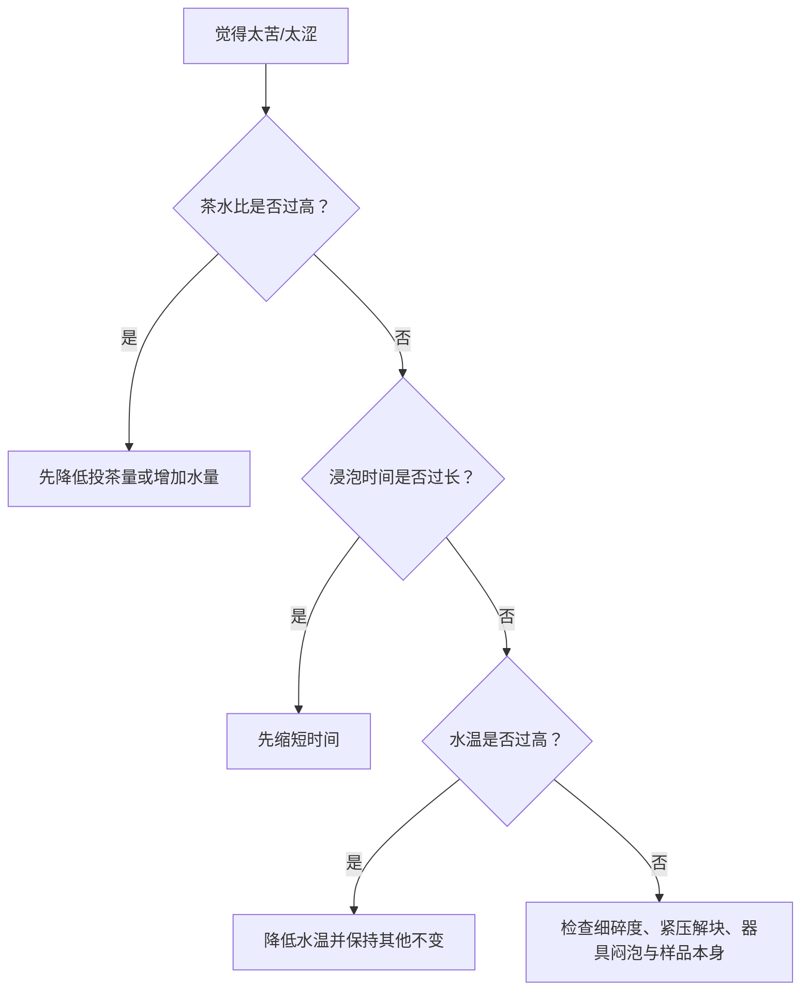

# 第 21 章 四个旋钮：水温、茶水比、时间、器型各在改变什么

> **本章问题**：一杯茶苦了，究竟该降温、缩时、少投茶，还是换器具？

冲泡不是玄学配方，而是让水从茶叶中带走可溶物和挥发性物质的过程。最常用的四个旋钮是水温、
茶水比、时间与器型；它们会互相影响，但不完全可替代。[^foundation]

## 21.1 四个旋钮的方向表

| 旋钮 | 首先改变什么 | 常见副作用 | 不能简单替代的原因 |
|------|--------------|------------|--------------------|
| 水温 | 溶解与扩散速率，挥发释放 | 高温更易把苦涩和厚重一并带出 | 温度改变的是选择性与香气释放，不只是总量 |
| 茶水比 | 杯中浓度 | 过高会掩盖香气层次、放大刺激 | 不改变单片叶的浸出动力学 |
| 时间 | 累积浸出量 | 过长易使后段物质占比上升 | 与水温、形态存在非线性关系 |
| 器型 | 散热、浸泡方式、出汤速度与观察条件 | 保温/闷泡差异 | 器具改变的是整个接触环境 |

## 21.2 排错顺序：先把“浓”与“萃取走向”分开

这不是固定处方，而是优先检查最容易失控的变量。每次只改一项，才知道改善来自哪里。

## 21.3 形态会改变所有旋钮的效果

细碎茶、颗粒茶和完整条索的接触面积不同；紧压茶还多一道解块与吸水过程。因此“同样 10 秒”
不是同一种刺激。比较两种茶时，应先承认形态不同，再谈水温或时间优劣。

## 21.4 常见说法辨析

| 说法 | 判定 | 说明 |
|------|------|------|
| “苦了就一定降水温” | **⚠️ 不充分** | 投茶量、时间、细碎度和闷泡也可能是主因。 |
| “多泡几次自然会更好喝” | **❌ 错误** | 后续浸出会改变成分结构，未必更协调。 |
| “同一参数适合所有绿茶/乌龙” | **❌ 错误** | 原料、形态、工艺和个人目标不同。 |

## 21.5 思考题

1. 为什么降低茶水比和缩短时间都可能减弱苦涩，却不是同一个动作？
2. 为什么紧压茶不宜直接套用散茶的出汤时间？
3. 一杯茶太淡但不苦，优先改哪一项？为什么仍须一次只改一个？

> 📖 **参考答案**：[Q1](../../qa/21-four-knobs-qa.md#q1) · [Q2](../../qa/21-four-knobs-qa.md#q2) · [Q3](../../qa/21-four-knobs-qa.md#q3)

## 21.6 本章实操

### 🅐 无器具版：变量审计

把你最近一次“泡坏了”的茶写成四个旋钮：当时水温、茶水比、时间、器具分别是什么？
列三个候选原因，选一个下次只改它。

### 🅑 有条件版：一变量三杯

用同一款茶与同一器具做三杯：基准杯、只改时间、只改水温。记录苦、涩、鲜、厚四项方向；
不要同时改两项，否则结果不可解释。

## 21.7 本章主要参考

| 结论 | 来源 |
|------|------|
| 成分的溶出难易与温度/时间方向 | [第 1 章：成分与滋味](../01-foundation/01-leaf-chemistry.md)及其主要参考 |
| 标准审评冲泡方法的边界 | [GB/T 23776-2018](https://std.samr.gov.cn/search/stdPage?q=GB%2FT23776) |

[^foundation]: 本章讲变量控制的方向；不把特定茶类的家庭冲泡参数伪装成通用标准。
