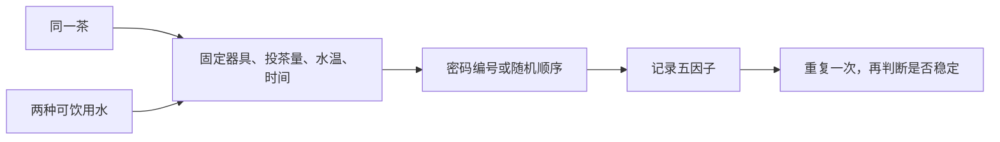

# 第 22 章 水：不是“矿物质越多越好”，而是水样与茶样的匹配

> **本章问题**：硬度、pH、矿物质会改变什么？为什么不能从“纯净水/矿泉水/山泉水”名称直接推出结果？

水是茶汤的主体，也是萃取环境。研究已观察到不同水样会改变龙井茶、普洱生茶等的感官表现与
部分呈味成分浸出；硬度、酸碱度和矿化度是可能因素，但茶类与具体水样同样重要。[^research]

## 22.1 先认识三个标签背后的变量

| 常见说法 | 真正要看的变量 | 为什么名称不够 |
|----------|----------------|----------------|
| 软/硬水 | 主要与钙、镁等离子相关的硬度 | 两瓶“矿泉水”硬度可差很多 |
| 酸/碱 | pH 与缓冲体系 | pH 相同不代表离子组成相同 |
| 矿化度高/低 | 总溶解固体及具体离子 | “矿物质”不是一种物质 |

水质会同时影响溶出、络合/沉淀、汤色稳定性和水本身的口感，因此没有脱离茶样的“宇宙最佳水”。

## 22.2 证据强度：方向可用，配方不可搬运

| 可较有把握地说 | 不能直接说 |
|----------------|------------|
| 不同水样可使同一茶的色、香、味出现可感知差异 | 某品牌水适合所有茶 |
| 硬度、pH、矿化度与具体离子可能共同参与 | 只凭一个硬度值就能预测所有感官结果 |
| 高硬度或高矿化水在部分研究中与汤色偏暗、苦涩或香气受限相关 | 硬水一定不能泡茶、纯水一定最好 |

## 22.3 最实用的做法：先做自己的双水对照

若想比较水，**一次只换水**。不要同时换茶、器具、温度和水；否则你得到的是不同冲泡，而不是水的效果。

## 22.4 常见说法辨析

| 说法 | 判定 | 说明 |
|------|------|------|
| “矿物质越多，茶越甜” | **❌ 错误** | 离子种类、浓度、茶类与其他条件都参与，不能单向概括。 |
| “纯净水一定是最安全的泡茶水” | **⚠️ 不充分** | 食品安全与风味表现是两件事；水应首先符合饮用水安全要求。 |
| “硬水一定把茶泡坏” | **⚠️ 过度概括** | 部分研究观察到不利方向，但结果依赖水样和茶样；用对照验证。 |

## 22.5 思考题

1. 为什么“矿泉水”不是一个足以预测泡茶结果的变量？
2. 比较两种水时，为什么要固定水温和投茶量？
3. 为什么不能从一次对比就宣布某种水“适合所有茶”？

> 📖 **参考答案**：[Q1](../../qa/22-water-qa.md#q1) · [Q2](../../qa/22-water-qa.md#q2) · [Q3](../../qa/22-water-qa.md#q3)

## 22.6 本章实操

### 🅐 无器具版：读水标签，不做风味跳跃

找两种饮用水标签，抄写能看到的矿物质、硬度、pH 或总溶解固体信息。写下：哪些变量仍未知？
为什么它们不足以直接证明“最适合泡茶”？

### 🅑 有条件版：双水盲对照（备齐后再做）

使用同一茶、同一器具、相同参数，比较两种合格饮用水；同伴随机编号。每种水至少重复一次。
记录的是差异方向和稳定性，而不是寻找“正确答案”。

## 22.7 本章主要参考

| 结论 | 来源 |
|------|------|
| 不同水质对龙井茶感官与主要成分的影响 | [Gong 等，《茶叶科学》](https://www.tea-science.com/EN/10.13305/j.cnki.jts.2020.02.008) |
| 水质参数与普洱生茶风味成分/感官特性 | [《食品科学》相关研究](https://www.spkx.net.cn/article/2025/1002-6630/2025-46-24-023.html) |

[^research]: 两项研究均针对特定茶样与水样；本章据此写比较方法，不外推成通用矿物质配方。
