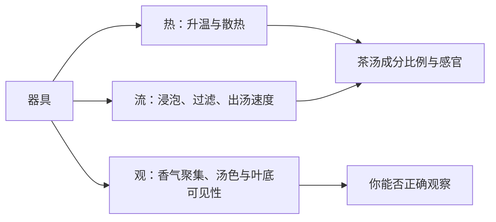

# 第 23 章 器：器具改变的是接触环境，不是给茶“加魔法”

> **本章问题**：盖碗、玻璃杯、紫砂、飘逸杯、煮茶器各适合解决什么问题？

器具首先改变散热、浸泡方式、出汤速度、观察便利性与清洁风险。它可以帮助你实现某种冲泡目标，
但不能替代原料、工艺或控制变量。[^boundary]

## 23.1 用功能选器，不按传说选器

| 器具 | 最突出的功能 | 适用情景 | 主要限制 |
|------|--------------|----------|----------|
| 盖碗 | 出汤快、变量可控、闻盖香方便 | 对比、学习、需要调整参数 | 保温与操作需练习 |
| 玻璃杯 | 观察舒展和汤色 | 细嫩茶、日常直观品饮 | 长时间浸泡不易精确分离茶水 |
| 紫砂/陶器 | 热容量与保温方式不同 | 想维持较稳定热环境时 | 孔隙、清洁与残留会增加变量 |
| 飘逸杯/滤网杯 | 茶水分离方便 | 日常定时出汤 | 滤网孔径、容量与材质会影响流速 |
| 煮茶器 | 长时间高温接触 | 适合本就需要煮饮的产品路线 | 易过萃，不能套用所有茶 |

“适合”不等于排他。例如盖碗不是高级茶专属，玻璃杯也不只适合绿茶；关键是你要不要看叶底、
控制出汤、保留香气或避免过萃。

## 23.2 器具的三条物理路径

器具影响的不只有茶汤，也影响评审者获得的信息。例如不透明杯让你较难观察叶片舒展；
带盖器具便于分阶段闻香；不能快速分离茶水的容器更容易使时间变量失控。

## 23.3 材质叙事的证据边界

不同材质的热性质、表面状态和清洁程度确会不同；但“某把壶自动软化苦涩”“壶养得越久茶越健康”
之类的强因果说法，若没有明确的对照实验和可重复结果，不应当作本书结论。实际比较时，先固定
茶、水、投茶量和时间，再只换器具，才能知道差异来自哪里。

## 23.4 常见说法辨析

| 说法 | 判定 | 说明 |
|------|------|------|
| “紫砂一定比盖碗泡得好” | **❌ 错误** | 它们提供不同热与流动条件，目标不同。 |
| “器具越贵越能提升茶叶等级” | **❌ 错误** | 器具不能改变原料等级或修复缺陷。 |
| “同一把器具越用越不用洗” | **❌ 错误** | 残留会成为不可控变量，也可能带来异味与卫生问题。 |

## 23.5 思考题

1. 为什么器具选择首先是控制变量问题？
2. 比较盖碗和玻璃杯时，至少应固定哪三项？
3. 为什么“器具让茶更顺”需要先拆成热、流和残留三个候选？

> 📖 **参考答案**：[Q1](../../qa/23-vessels-qa.md#q1) · [Q2](../../qa/23-vessels-qa.md#q2) · [Q3](../../qa/23-vessels-qa.md#q3)

## 23.6 本章实操

### 🅐 无器具版：为目标选器

分别为“想练对样”“想看叶片舒展”“总是泡苦”“需要办公室方便出汤”选择器具，写下你选择的是
哪一条功能，而不是“哪种器具更高级”。

### 🅑 有条件版：只换器具的双杯对照

使用同一茶、同一水、相同茶水比和相同计时，比较两种器具。记录热香、出汤速度、汤色与涩感，
并检查是否真的只改变了器具。

## 23.7 本章主要参考

本章只使用控制变量和热/流动边界的基础推理；具体家庭器具的优劣缺乏跨茶类统一实证，故不列
“最佳器具”或材质功效结论。标准审评器具与条件见 [GB/T 23776-2018](https://std.samr.gov.cn/search/stdPage?q=GB%2FT23776)。

[^boundary]: 器具的功能性差异不等于健康、能量或“养出茶味”等未经验证主张。
