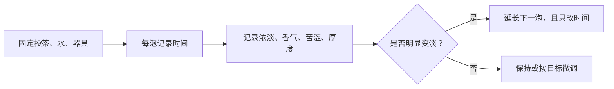

# 第 24 章 一茶多泡：耐泡是曲线，不是一个次数

“耐泡”应理解为连续冲泡中茶汤表现随泡次的变化曲线，而非“能泡 X 次”的单点宣传。它受原料、
形态、投茶量、器具、每泡时间和你对“可接受”的定义共同影响。

## 24.1 三条曲线同时在变

| 曲线 | 常见走向 | 影响因素 |
|------|----------|----------|
| 浓度 | 通常逐泡下降 | 茶水比、每泡时间、叶片形态 |
| 香气 | 可能先展开再下降 | 挥发、温度、工艺与器具 |
| 苦涩/厚度 | 不一定同步下降 | 不同物质溶出速度不同 |

所以“第一泡淡、第三泡好喝”或“后段更甜”都可能发生，不能只用第一泡或最后一泡判断一款茶。

## 24.2 出汤节奏的唯一通用原则：记录，不背配方

紧压、细碎、完整条索的曲线不同；把别人“第几泡多少秒”直接搬来，通常比记录自己的曲线更不可靠。

## 24.3 常见说法辨析

| 说法 | 判定 | 说明 |
|------|------|------|
| “泡得越多越耐泡越好” | **❌ 错误** | 需先定义什么样的浓度、香气与协调性仍可接受。 |
| “后面加时一定能救回来” | **⚠️ 不充分** | 可提升浓度，但不一定恢复香气或协调性。 |
| “耐泡完全由树龄决定” | **❌ 缺乏证据** | 形态、工艺、冲泡与个人阈值均是混杂因素。 |

## 24.4 思考题

1. 为什么“能泡十泡”不是完整的耐泡描述？
2. 后段变淡时，为什么先只改时间？

> 📖 **参考答案**：[Q1](../../qa/24-multiple-infusions-qa.md#q1) · [Q2](../../qa/24-multiple-infusions-qa.md#q2)

## 24.5 本章实操

### 🅐 无器具版

找一条“耐泡”宣传，列出它缺失的浓度、参数、器具和可接受阈值信息。

### 🅑 有条件版

用同一茶连续冲泡五次，填写[冲泡记录表](../../forms/brewing-log.md)，画出自己主观的浓淡与香气曲线。

## 24.6 本章主要参考

本章基于第 1 章的选择性溶出原则和第 21 章控制变量方法；不采信跨茶类的固定“耐泡次数”。
