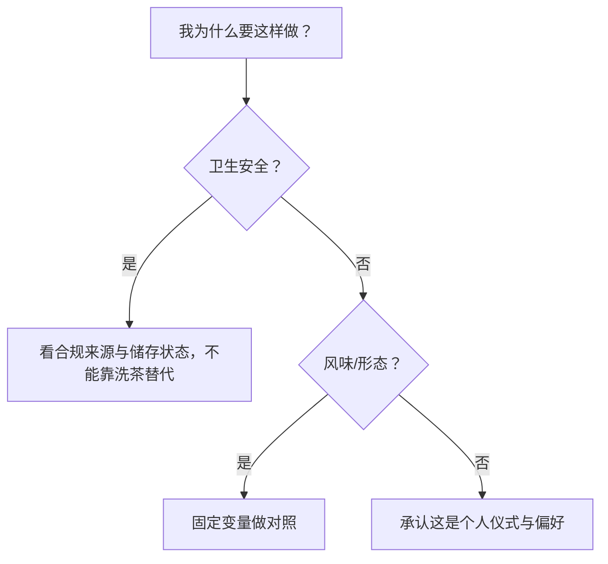

# 第 25 章 醒茶、洗茶、冷泡：常见做法的证据边界

> 本章不裁定个人习惯“对不对”，而是区分卫生、风味与仪式感三类目标。

## 25.1 三件事不是同一个问题

| 做法 | 可能的目标 | 证据边界 |
|------|------------|----------|
| 洗茶 | 去除表面碎末、快速润湿或仪式动作 | 不能把它宣传为可靠的农残/咖啡因去除方案 |
| 醒茶 | 让紧压茶解块、暴露后散去包装气 | 效果依赖样品、时间与环境，非所有茶必需 |
| 冷泡 | 以低温、长时提取 | 会改变萃取速度和感官结构，不是热泡的等价替代 |

## 25.2 先问目的，再选动作

## 25.3 常见说法辨析

| 说法 | 判定 | 说明 |
|------|------|------|
| “洗茶能洗掉农残，因而更安全” | **❌ 不成立** | 食品安全不能由一次冲洗替代合规生产、检测和储存。 |
| “醒茶是所有老茶必须步骤” | **⚠️ 过度概括** | 紧压解块或散包装气可能有用，但不是普遍必要条件。 |
| “冷泡没有咖啡因/不会苦涩” | **❌ 错误** | 低温改变溶出速度与比例，不等于零溶出。 |

## 25.4 思考题

1. 为什么洗茶不能替代食品安全判断？
2. 冷泡与热泡为什么不是“同一茶、只是温度不同”这么简单？

> 📖 **参考答案**：[Q1](../../qa/25-common-practices-qa.md#q1) · [Q2](../../qa/25-common-practices-qa.md#q2)

## 25.5 本章实操

### 🅐 无器具版

把自己的一项冲泡习惯标为卫生、风味还是仪式目标；若是卫生目标，写出它真正需要的外部证据。

### 🅑 有条件版

同一款茶做“有/无快速润湿”或“冷/热泡”对照，每次只改变一个动作，记录差异但不外推为普遍结论。

## 25.6 本章主要参考

| 结论 | 来源 |
|------|------|
| 成分溶出与温度关系 | [第 1 章](../01-foundation/01-leaf-chemistry.md)；[第 21 章](21-four-knobs.md) |
| 食品安全限量/检测的边界 | [GB 2762、GB 2763](../../standards.md) |
