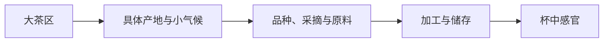

# 第 26 章 中国四大茶区：地图是起点，不是风味判决书

中国茶区常按自然条件与茶类生产概况概括为江北、江南、华南和西南四大茶区。这是宏观教学框架；
它不能替代具体产区、海拔、品种和工艺信息。

| 茶区 | 概括范围与条件 | 常见生产倾向 | 不能推出 |
|------|----------------|--------------|----------|
| 江北 | 纬度较高、越冬条件更受限制 | 绿茶等为代表 | 所有茶都鲜爽或品质相同 |
| 江南 | 茶区广、雨热条件较适宜 | 绿茶、红茶、黄茶、黑茶等多样 | 一个省只有一种茶 |
| 华南 | 温热湿润、生长期较长 | 乌龙、红茶、花茶等多样 | “南方茶一定更浓” |
| 西南 | 山地高原、品种与生态差异大 | 大叶种茶、红茶、普洱等重要 | 海拔/树龄单独决定品质 |

## 26.1 从地图到杯中，要经过四层

大茶区只解释第一层。把“西南”“江南”直接等同于某种香气或价格，是跳过了中间三层。

## 26.2 学产区最有用的提问

1. 这个名字是行政地理、地理标志、历史产区，还是商标/营销用语？
2. 它对应的品种、海拔、气候和加工路线是什么？
3. 同一产区内部有哪些原料、季节和工艺差异？
4. 眼前这款茶有哪些可核对的信息，而不是只写了一个地名？

## 26.3 常见说法辨析

| 说法 | 判定 | 说明 |
|------|------|------|
| “同一产区的茶味道都一样” | **❌ 错误** | 品种、季节、地块、采摘和加工都能造成差异。 |
| “海拔越高越好” | **❌ 过度概括** | 海拔是多个生态变量的代理，不是单一品质开关。 |
| “产区名就是品质等级” | **❌ 错误** | 产区信息与等级、批次、加工和储存是不同字段。 |

## 26.4 思考题

1. 为什么四大茶区不能直接预测一杯茶的具体香气？
2. 买到一款只写“某大茶区”的茶，还应追问哪三条信息？

> 📖 **参考答案**：[Q1](../../qa/26-china-regions-qa.md#q1) · [Q2](../../qa/26-china-regions-qa.md#q2)

## 26.5 本章实操

### 🅐 无器具版

从三款茶包装抄下产区信息，分别标出它是宏观区域、具体产地、地理标志还是无法确认；再列出缺失字段。

### 🅑 有条件版

选择同一茶类但标称产区不同的两款茶，以盲评方式记录差异；结论只能写为“这两批样品不同”，
不能直接归因于整个产区。

## 26.6 本章主要参考

本章采用《中国茶经》等教材中的四大茶区教学框架；作为宏观分类使用，不据此给出品质排序。
