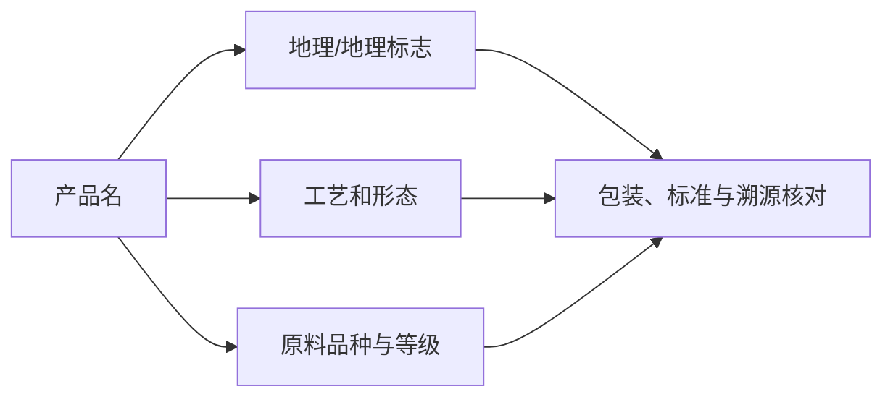

# 第 27 章 绿茶名品谱系：先认工艺和形态，再认名字

龙井、碧螺春、毛峰、安吉白茶等名称常同时携带产地、形态、品种与历史信息。学习它们的正确顺序是：
先看杀青/干燥路线和原料规格，再看地理名称与产品标准边界。

| 名称线索 | 常见工艺/形态重点 | 需额外核对 |
|----------|------------------|------------|
| 龙井 | 扁平整形、炒青路线 | 具体产地、执行标准、等级 |
| 碧螺春 | 卷曲细嫩、炒青路线 | 原料、产地与产品名称边界 |
| 毛峰 | 条形显毫等外形描述 | “毛峰”在不同产区的具体标准 |
| 安吉白茶 | 白化品种制成的绿茶 | 它是绿茶，不因名字归为白茶 |

## 27.1 名称的三层，不要混读

同一名称在不同保护范围、等级和批次下可有明显差异；相近外形也不能证明来自同一产地。

## 27.2 安吉白茶：最值得先纠正的名字

安吉白茶通常指特定白化茶树品种鲜叶制成的**绿茶**；“白”主要指春季特定阶段叶色的性状，
不代表其采用白茶的萎凋/干燥工艺。分类应回到决定性加工路径，而不是名称颜色。

## 27.3 常见说法辨析

| 说法 | 判定 | 说明 |
|------|------|------|
| “名字里有白茶就是白茶” | **❌ 错误** | 安吉白茶是典型反例，分类先看工艺。 |
| “明前一定比雨前好” | **⚠️ 过度概括** | 采期、产区、品种、天气和个人偏好共同决定；早不自动等于好。 |
| “西湖/原产地字样等于全程品质保证” | **❌ 错误** | 仍要看产品标准、等级、批次与实际感官。 |

## 27.4 思考题

1. 为什么安吉白茶不应按名字归入白茶？
2. 买绿茶名品时，除产地名外还应核对哪三类信息？

> 📖 **参考答案**：[Q1](../../qa/27-green-tea-lineages-qa.md#q1) · [Q2](../../qa/27-green-tea-lineages-qa.md#q2)

## 27.5 本章实操

### 🅐 无器具版

找两款含地理名称的绿茶包装，分别标出工艺线索、原料/等级线索和可核对标准；缺失项留空。

### 🅑 有条件版

选两款形态不同的绿茶，固定冲泡条件，比较“形态影响浸出”与“名称差异”哪一条有直接观察支持。

## 27.6 本章主要参考

| 结论 | 来源 |
|------|------|
| 绿茶分类以杀青等加工路径为依据 | [GB/T 30766](../../standards.md)；[第 5、6 章](../02-processing/05-classification.md) |
| 安吉白茶的分类边界 | [第 2 章品种与产地](../01-foundation/02-cultivar-terroir.md)与绿茶工艺框架 |
