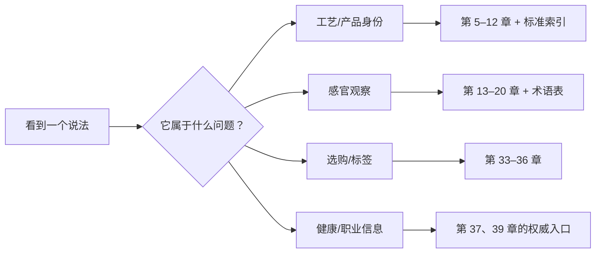

# 第 40 章 国标索引与中英术语对照：把“会说”变成“能回查”

本章是导航页，不替代标准原文、考试公告或专业翻译。标准的版本和状态会变化，使用于检验、贸易、
认证等正式场合时，请回到国家标准全文公开系统或全国标准信息公共服务平台核验。

## 40.1 按问题找标准

| 你要解决的问题 | 优先入口 | 说明 |
|----------------|----------|------|
| 茶类怎么分 | [GB/T 30766](../../standards.md) | 六大基本茶类与再加工茶 |
| 怎样做感官审评 | [GB/T 23776](../../standards.md) | 方法、条件与流程 |
| 审评词怎样规范 | [GB/T 14487](../../standards.md) | 术语边界 |
| 某类产品怎么界定 | [各茶类产品标准](../../standards.md) | 先确认对象与版本 |
| 贮存、农残或污染物 | [贮存与安全标准](../../standards.md) | 不用产品标准替代安全标准 |
| 标签和包装信息 | [第 36 章](../06-buying-storage/36-packaging-standards.md) | 回到当期法规与标签标准 |

## 40.2 高频中英对照

| 中文 | 常用英文 | 使用提示 |
|------|----------|----------|
| 绿茶 | green tea | 按加工路线，而非叶色 |
| 白茶 | white tea | 与“白色茶汤”无关 |
| 黄茶 | yellow tea | 不等于所有黄汤茶 |
| 乌龙茶 | oolong tea | 英文常不保留“青茶”字面 |
| 红茶 | black tea | 中英文颜色命名不对称 |
| 黑茶 | dark tea | 不等于英语 black tea |
| 再加工茶 | reprocessed tea | 从成茶进一步加工的分类视角 |
| 杀青 | fixation / kill-green | 指灭酶目标，不只是干燥 |
| 萎凋 | withering | 失水并伴随转化 |
| 做青 | zuoqing | 常保留拼音，需说明摇青与晾青交替 |
| 渥堆 | pile fermentation | 黑茶/熟普的后发酵工序 |
| 感官审评 | sensory evaluation | 标准方法下的比较性评价 |
| 盲评 | blind evaluation | 降低身份信息带来的期待偏差 |
| 涩 | astringency | 触觉/化学感，不等于苦味 |

更多定义与锚点见[术语表](../../glossary.md)，每个词应优先回到所在章节理解，而非脱离上下文死记翻译。

## 40.3 全书回查路线

## 40.4 思考题

1. 为什么应先查标准的适用范围，再引用标准号？
2. 为什么把红茶翻译成 *black tea* 时仍需补充语境？

> 📖 **参考答案**：[Q1](../../qa/40-index-terms-qa.md#q1) · [Q2](../../qa/40-index-terms-qa.md#q2)

## 40.5 本章实操

### 🅐 无器具版

任选三个术语，用本章找到术语表和对应章节；写下每个词在本书中的“定义、观察方式、常见误用”。

### 🅑 有条件版

拿一包茶的标签和一次审评记录，分别圈出需要产品标准、感官术语和安全/标签规则支撑的字段，
不要让一个标准号承担所有判断。

## 40.6 本章主要参考

本章索引均指向[国标与文献索引](../../standards.md)、[术语表](../../glossary.md)及各章末尾的来源表。
英文译法为检索和交流用常用词；法律、认证和贸易文件应使用其适用的正式术语。
