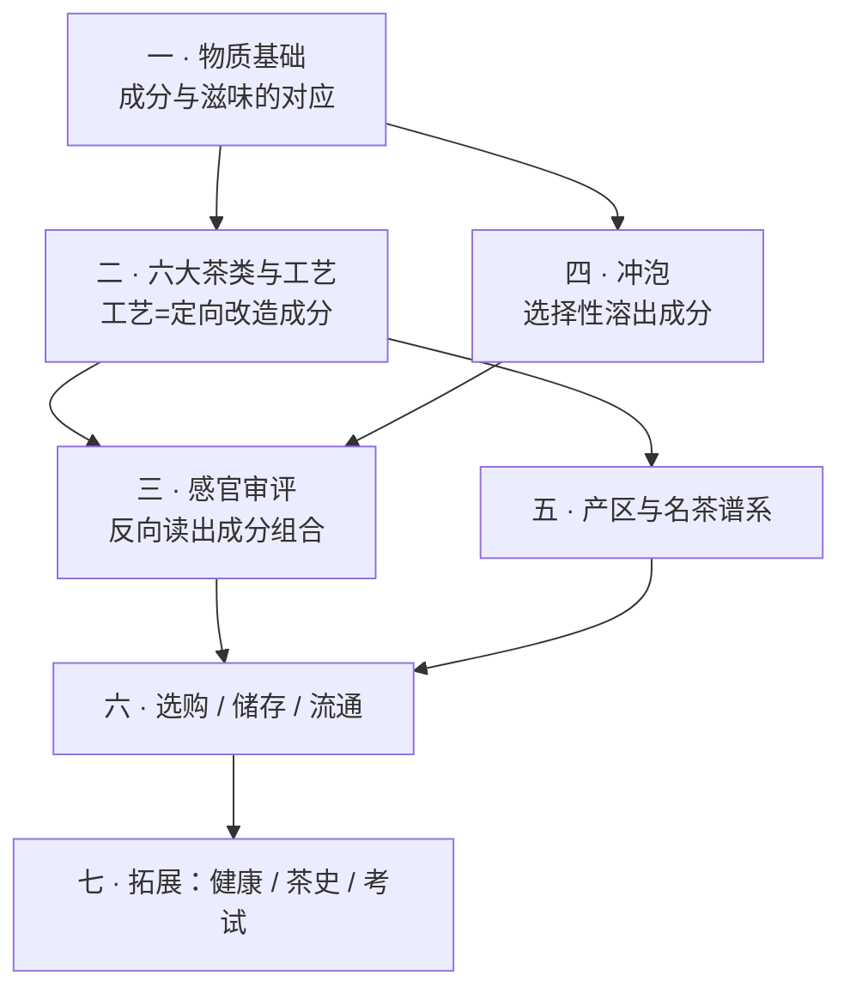

# 学习路线图 (Roadmap)

> **总目标**：系统性地把茶学吃透到**评茶员知识体系**的深度——看懂六大茶类的工艺原理、
> 会用标准方法做感官审评、能把"好喝"翻译成可复现的判断，并能独立选购、储存、冲泡。
>
> 分七部分，由浅入深、前后依赖。这是一份**活的大纲**：随学习进度和兴趣随时调整。
> 状态标记：✅ 已完成 · 🔜 进行中 · ⬜ 待学。

## 这本书的依赖顺序（为什么这么排）

一句话：**第一部分是地基**。茶的一切技术问题，本质都是「让**哪些成分**、以**多少比例**、
进入茶汤」——工艺在改造成分，冲泡在选择性溶出成分，审评在反向读出成分组合。

---

## 第一部分 · 茶的物质基础

**目标**：建立"成分 → 滋味/香气/汤色"的对应关系。这是全书的地基，后面每一部分都要回头引用。

| 章 | 主题 | 一句话学到什么 | 状态 |
|----|------|----------------|------|
| 1 | [一片叶子里有什么](chapters/01-foundation/01-leaf-chemistry.md) | 五大类成分各对应哪种感受，酚氨比为什么能解释很多事 | ✅ |
| 2 | [茶树：品种、产地与"山场"](chapters/01-foundation/02-cultivar-terroir.md) | 品种/海拔/土壤/遮阴如何在成分层面进入茶汤 | ✅ |
| 3 | [鲜叶与采摘](chapters/01-foundation/03-plucking.md) | 嫩度、采摘标准与"等级"的由来，明前贵在哪 | ✅ |
| 4 | [酶与氧化](chapters/01-foundation/04-enzymes-oxidation.md) | 所谓"发酵"到底发生了什么，酶促 vs 湿热 vs 微生物 | ✅ |
| — | [第一部分小结（速查）](chapters/01-foundation/summary.md) | 一页表带走全部对应关系 + 证据强度清单 | ✅ |

> **学完能**：拿到任何一款茶的描述，能大致推断它的成分格局和滋味走向。
>
> **🎉 第一部分已完成。下一站：第二部分第 5 章 · 分类的逻辑。**

---

## 第二部分 · 六大茶类与工艺原理 ★核心

**目标**：理解分类的**逻辑**（不是背名字），能从工艺步骤推出成品特征，反之亦然。

| 章 | 主题 | 一句话学到什么 | 状态 |
|----|------|----------------|------|
| 5 | [分类的逻辑](chapters/02-processing/05-classification.md) | GB/T 30766 的分类依据 + 一张工艺总图看懂六类差别 | ✅ |
| 6 | [绿茶：杀青](chapters/02-processing/06-green-tea.md) | 如何用高温「锁住」绿，炒青/烘青/蒸青/晒青的分野 | ✅ |
| 7 | [白茶：萎凋](chapters/02-processing/07-white-tea.md) | 最少干预为什么最难控，新白茶与老白茶 | ✅ |
| 8 | [黄茶：闷黄](chapters/02-processing/08-yellow-tea.md) | 一步之差与绿茶分家，为什么产量最小 | ✅ |
| 9 | [乌龙茶：做青与焙火](chapters/02-processing/09-oolong-tea.md) | 半发酵的技术顶点，摇青/晾青/焙火如何塑造香与韵 | ✅ |
| 10 | [红茶：全发酵](chapters/02-processing/10-red-tea.md) | 茶黄素/茶红素/茶褐素的生成与汤色滋味 | ✅ |
| 11 | [黑茶与普洱](chapters/02-processing/11-dark-tea.md) | 微生物后发酵：渥堆（熟）vs 自然陈化（生） | ✅ |
| 12 | [再加工茶](chapters/02-processing/12-reprocessed-tea.md) | 花茶窨制、紧压、抹茶、速溶与调饮基底 | ✅ |
| — | [第二部分小结（速查）](chapters/02-processing/summary.md) | 六类工艺一张对照表 | ✅ |
| 🛠 | [**项目 P1：从工艺特征反推茶类**](chapters/02-processing/project-P1-reverse-engineering.md) | 给若干条描述，判断类别与工艺缺陷 | ✅ |

> **学完能**：看到一款陌生茶的干茶、汤色、叶底，说出它属于哪一类、大致经历了什么工艺。

---

## 第三部分 · 感官审评：把"好喝"变成可复现的判断 ★核心

**目标**：掌握标准审评方法与术语体系，让判断可复现、可交流、可与人对样。

| 章 | 主题 | 一句话学到什么 | 状态 |
|----|------|----------------|------|
| 13 | [审评体系概览](chapters/03-sensory/13-sensory-overview.md) | 审评室/器具/GB/T 23776 的标准流程与为什么这么定 | ✅ |
| 14 | [干评与湿评](chapters/03-sensory/14-dry-wet-evaluation.md) | 五因子（外形/汤色/香气/滋味/叶底）怎么走一遍 | ✅ |
| 15 | [审评术语](chapters/03-sensory/15-sensory-terms.md) | 把"好喝"翻译成 GB/T 14487 的规范词 | ✅ |
| 16 | [香气](chapters/03-sensory/16-aroma.md) | 品种香/工艺香/地域香/劣变气的来源与判别 | ✅ |
| 17 | [滋味](chapters/03-sensory/17-taste.md) | 浓淡、强弱、鲜爽、涩感、回甘、生津的机理 | ✅ |
| 18 | [叶底与汤色](chapters/03-sensory/18-liquor-leaf.md) | 两项最不容易骗人的证据 | ✅ |
| 19 | [缺陷与劣变](chapters/03-sensory/19-defects.md) | 烟焦、酸馊、陈霉、水闷、青气：从哪一步坏的 | ✅ |
| 20 | [评分与对样](chapters/03-sensory/20-scoring-reference.md) | 权重、计分与"对标准样"评茶 | ✅ |
| 🛠 | [**项目 P2：自建审评表 + 30 天盲品训练计划**](chapters/03-sensory/project-P2-blind-training.md) | 从"我觉得好喝"到可复现打分 | ✅ |

> **学完能**：按标准方法审评一款茶，写出规范的审评词并给分；和别人对样时说得清分歧在哪。

---

## 第四部分 · 冲泡：可控变量与茶汤

**目标**：把冲泡当成**控制变量实验**。四个旋钮各自改变什么，为什么。

| 章 | 主题 | 一句话学到什么 | 状态 |
|----|------|----------------|------|
| 21 | [四个旋钮](chapters/04-brewing/21-four-knobs.md) | 水温/茶水比/时间/器型分别调的是哪些成分 | ✅ |
| 22 | [水](chapters/04-brewing/22-water.md) | 硬度、pH、矿物质如何改变汤色与滋味 | ✅ |
| 23 | [器](chapters/04-brewing/23-vessels.md) | 盖碗/紫砂/玻璃/飘逸杯/煮饮的适用边界 | ✅ |
| 24 | 一茶多泡 | 冲泡曲线与出汤节奏，"耐泡"到底是什么 | ⬜ |
| 25 | 醒茶、洗茶、冷泡 | 常见说法的证据核查 | ⬜ |
| 🛠 | **项目 P3：控制变量冲泡矩阵** | 同一款茶跑一个 3×3 实验，画出自己的冲泡曲线 | ⬜ |

> **学完能**：拿到一款陌生茶，几泡内找到它的合适参数；能解释"为什么这泡苦了"。

---

## 第五部分 · 产区与名茶谱系

**目标**：建立地理与谱系的地图，把名字挂到工艺和风味上，而不是死记硬背。

| 章 | 主题 | 一句话学到什么 | 状态 |
|----|------|----------------|------|
| 26 | 中国四大茶区 | 地理气候如何决定茶类分布 | ⬜ |
| 27 | 绿茶名品谱系 | 龙井/碧螺春/毛峰/安吉白茶…差异在哪 | ⬜ |
| 28 | 乌龙谱系 | 闽南/闽北/广东/台湾四条支线 | ⬜ |
| 29 | 红茶谱系 | 正山小种/祁门/滇红 + 阿萨姆/大吉岭/锡兰/肯尼亚 | ⬜ |
| 30 | 白茶与黄茶谱系 | 品种、等级（银针/牡丹/寿眉）与产区 | ⬜ |
| 31 | 黑茶与普洱 | 产区、山头、年份与"越陈越香"的边界 | ⬜ |
| 32 | 世界茶 | 日本蒸青体系、印度、斯里兰卡、非洲 | ⬜ |
| 🛠 | **项目 P4：产区盲品地图** | 从风味特征反推产区与品种 | ⬜ |

---

## 第六部分 · 选购、储存与流通

**目标**：把知识变成花钱不吃亏的能力。

| 章 | 主题 | 一句话学到什么 | 状态 |
|----|------|----------------|------|
| 33 | 选购 | 看什么、问什么，常见坑（做旧/年份/山头/拼配误解） | ⬜ |
| 34 | 价格是怎么形成的 | 成本结构、稀缺性叙事与溢价来源 | ⬜ |
| 35 | 储存 | 六大茶类各自的存法与变质机理（受潮/氧化/串味/陈霉） | ⬜ |
| 36 | 包装与标准 | 读懂执行标准号、等级、地理标志与保质期 | ⬜ |
| 🛠 | **项目 P5：一次真实选购决策复盘** | 把全书知识跑一遍真实购买 | ⬜ |

---

## 第七部分 · 拓展

| 章 | 主题 | 一句话学到什么 | 状态 |
|----|------|----------------|------|
| 37 | 茶与健康 | 证据等级怎么读，常见说法逐条辨析（不做医疗建议） | ⬜ |
| 38 | 茶史与茶文化速览 | 唐煮宋点明清泡、《茶经》、茶马古道、日本茶道、英式下午茶 | ⬜ |
| 39 | 评茶员 / 茶艺师考试导览 | 等级、考什么、怎么准备 | ⬜ |
| 40 | 国标索引与中英术语对照 | 一页查到所有标准与术语 | ⬜ |

---

## 调整记录

- **2026-08-03**：立项。确定七部分 40 章 + 5 个项目；深度对标评茶员体系；
  实操统一写成「🅐 无器具版 / 🅑 有条件版」两档（读者暂无茶具茶样）。
- **2026-08-03**：**第一部分（第 1~4 章 + 小结）完成**。同时按 CLAUDE.md §1.1 查证纪律
  对第 1 章做了外部资料核查并修正 5 处（茶多酚 18%~36% 是鲜叶而非成品茶区间、
  儿茶素占比放宽为 60%~80%、茶红素改为不引具体值、洗茶辨析的理由重写、
  补咖啡碱竞争唾液蛋白结合位点而**减弱**涩感）。各章新增「本章主要参考」小节逐条登记出处；
  小结新增**证据强度清单**（✅ 有共识 / ⚠️ 有争议 / ❌ 明确错误）。
- **2026-08-19**：**第二部分开工**（导读 + 第 5、6 章）。同时引入**图的基础设施**：
  `scripts/figures/make_figures.py` 生成 SVG 示意图（本机无中文字体，matplotlib 出图会变方框，
  故改用 SVG——文字由读者浏览器渲染，且可 diff）。首批 8 张图，并回头给第 3、4 章补图。
- **2026-10-10**：**第 8 章（黄茶：闷黄）完成**。在第 4 章 4.8 节已核机理基础上，
  补充闷黄温度/含水率/时间三参数的具体研究数据（交叉验证两篇期刊论文与一篇综述）、
  湿坯/干坯闷黄的含水率与耗时对照、君山银针"初包复包"与蒙顶黄芽"三炒三闷"案例、
  黄大茶"锅巴香"的吡嗪类呈香物质研究、以及"闷黄微生物作用尚无定论"这一开放问题
  （与黑茶渥堆"微生物主导"形成对比）。新增 1 张 SVG 示意图（闷黄三型对照）。
- **2026-10-10**：**第 9 章（乌龙茶：做青与焙火）完成**。讲清"先放后收"的工序结构、
  做青的"还阳/退青"物理现象、机械损伤诱导吲哚等香气物质生成的分子机制
  （交叉引用 *JAFC* 2016 论文与 2025 年武夷岩茶全工序代谢组学研究）、
  轻摇/重摇对儿茶素与香气物质的对照数据、闽北/闽南/广东/台湾四大产区做青工艺差异、
  焙火的美拉德反应机理与四川乌龙茶焙火实验数据。
  同时明确标注"摇青次数""焙火温度区间""发酵度百分比"三处数字不同来源互相矛盾、
  本书不采信单点数字，只给方向性结论；顺带核实并修正了 GB/T 18745（武夷岩茶 2006 版
  已取消名岩区/丹岩区划分）与 GB/T 30357 系列分部分构成这两处已存在的标准登记。
  新增 1 张 SVG 示意图（焙火火功温度区间）。
- **2026-10-10**：**第 10 章（红茶：全发酵）完成**。在第 1、4 章已核的 TF/TR/TB
  典型区间与氧化路径基础上，展开茶黄素生成机制（儿茶素 B 环结构配对氧化规则，
  解释 EGCG 为何在红茶中几乎检测不到）、三者比例关系与汤色滋味对应
  （新增 1 张 SVG 示意图 tf-tr-tb-balance.svg）、工夫红茶/红碎茶/小种红茶三类
  细分工艺差异（CTC/洛托凡揉切、正山小种"过红锅"、金骏眉工艺创新）。
  明确标注茶红素具体百分比因测定方法不统一而不可横向比较、茶黄素与茶褐素的
  相关系数均来自单一研究仅作方向参考；顺带核实补全 GB/T 13738 红茶系列分部分构成。
- **2026-10-10**：**第 11 章（黑茶与普洱）完成**。在第 4 章 4.9 节已核渥堆机理
  基础上，展开黑茶内部差异（茯砖"发花"培养冠突散囊菌、六堡茶传统/现代工艺
  之分、槟榔香的国标定义）、GB/T 22111 普洱茶生茶/熟茶定义、熟茶渥堆历史
  （1973 年昆明茶厂赴广州学习、"冷水渥堆法"）、生茶自然陈化机理
  （没食子酸生成、儿茶素下降、陈香挥发物变化，并明确标注残余酶/环境微生物/
  非酶促氧化三者贡献比例尚无定论）。新增 1 张 SVG 示意图
  （生茶陈化 vs 熟茶渥堆路径对比）。按要求重点审视"越陈越香"（拆成三个
  子命题分别判定证据强度）、黄曲霉毒素争议（假阳性检测方法问题+官方监测
  数据）、干仓/湿仓（缺乏统一标准）、山头茶炒作（价格暴涨的资本运作证据链）
  这几类普洱茶圈高密度流传的说法，严格按证据强度框架处理，不当事实陈述。
  顺带核实补全 GB/T 32719 黑茶系列与 GB/T 9833 紧压茶系列的分部分构成。
- **2026-10-10**：**第 12 章（再加工茶）完成**。以 GB/T 30766 的“以茶叶为原料再加工”
  定义为主线，把茶坯/基础茶类与最终产品/再加工动作拆开，讲清花茶窨制中“香气迁移”
  与“水热负担”同时发生的控制逻辑；明确紧压是成型而非新茶类或陈化保证；以 GB/T 34778
  的产品边界区分抹茶与一般绿茶粉；补入萃取、速溶与调饮基底的工程取舍。全章不采信
  “第几窨”“粒径”“遮阴天数”等无法稳定交叉核验的营销式单点数字。
