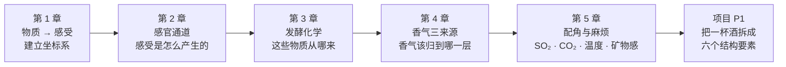

# 第一部分导读 · 一杯酒的物质基础与感官

> **这一部分要建立的，是全书唯一的"底层坐标系"。**
> 后面六部分——品种、风土、工艺、产区、品鉴、烈酒——讲的全是
> "怎么改变这个坐标系里的数值"和"怎么把数值读出来"。

## 为什么从物质开始，而不是从酒名开始

大部分人的品酒之路是从**名字**开始的：赤霞珠、勃艮第、单一麦芽、酱香。
名字好记，但有个致命缺点——**它不可比较**。

"波尔多混酿"和"巴罗萨西拉"这两个名字摆在一起，你没法说出它们的区别在哪，
只能记住"一个是法国的、一个是澳洲的"。但如果换成这种描述：

> 甲：残糖低、酸中等、单宁高且偏紧、酒精中等、body 中等偏重
> 乙：残糖低、酸偏低、单宁中高但柔、酒精偏高、body 重

这两句话**可以直接比较**，而且它们**能预测你的感受**——
乙会更甜润、更"热"、更容易在第二杯就腻。

所以本书的顺序是反过来的：**先学坐标，再挂名字**。
名字挂在坐标上之后就不需要背了，因为它变成了"哪一片区域"，而不是"一个孤立的词"。

## 这一部分的五章在干什么

| 章 | 它回答的问题 | 学完你能做什么 |
|----|-------------|--------------|
| 1 | 甜、酸、涩、苦、酒精感、body 各自来自什么物质？ | 把任何一句酒评拆回"它在说哪个成分" |
| 2 | 这些感受在身体的哪个系统产生？为什么人和人差这么多？ | 知道哪些分歧是"你错了"，哪些分歧是"我们的感受器不一样" |
| 3 | 糖怎么变成酒精，顺带产生了什么？ | 会算糖酒转化的账，知道甘油和酯类从哪来 |
| 4 | 一个香气词是品种带来的、发酵产生的，还是陈年长出来的？ | 判断一种香气"能不能被工艺造出来"——这直接关系到定价 |
| 5 | 亚硫酸盐、二氧化碳、温度、所谓"矿物感"各是什么等级的概念？ | 分清哪些是化学事实、哪些是行业惯例、哪些只是叙事 |

## 读这一部分的三个提醒

**① 别急着记数字。** 这一部分会出现不少浓度区间与阈值。
它们的作用是让你知道**量级**（"单宁是每升几百到上千毫克这个尺度，不是几克"），
而不是让你背下来。**要带走的是方向和机理**：谁让酒更涩、谁让酒更"热"、谁让香气更容易出来。

**② 感官术语的边界很不干净，这是事实而非本书的含糊。**
"body"不对应单一物质，"矿物感"至今没有公认的化学定义，
"平衡"是要素之间的相对关系而不是某个值。本书会在每处明确标出这类边界——
**承认不清楚的地方，是这本书想保持正确的方式**。

**③ 这一部分的实操一瓶酒都不用开。** 🅐 档全部是读酒标、查法规、做换算、比对酒评。
真正需要喝的练习都在 🅑 档，标注"备齐后再做"。

> **适度饮酒，未成年人不饮酒，酒后不驾车。**

## 当前进度

- ✅ 第 1 章 [一杯酒里有什么：糖、酸、酒精、单宁与香气分子](01-what-is-in-the-glass.md)
- ✅ 第 2 章 [感官通道：味觉、嗅觉、三叉神经与"风味"的组装](02-sensory-channels.md)
- ✅ 第 3 章 [酒精发酵：从糖到乙醇，以及一堆副产物](03-alcoholic-fermentation.md)
- ✅ 第 4 章 [香气的三个来源：品种香、发酵香、陈年香](04-three-origins-of-aroma.md)
- ✅ 第 5 章 [配角与麻烦：二氧化硫、二氧化碳、"矿物感"与温度](05-so2-co2-minerality.md)
- 🔜 项目 P1：把一杯酒拆成六个结构要素

完整大纲见[学习路线图](../../roadmap.md)。
