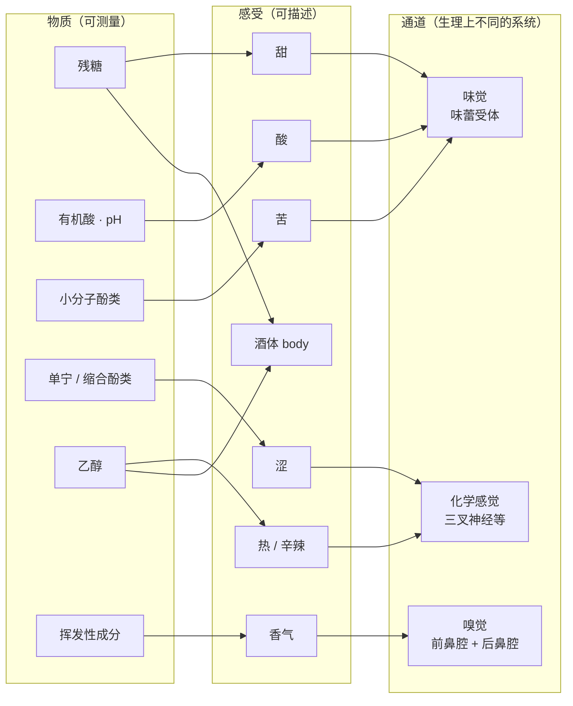
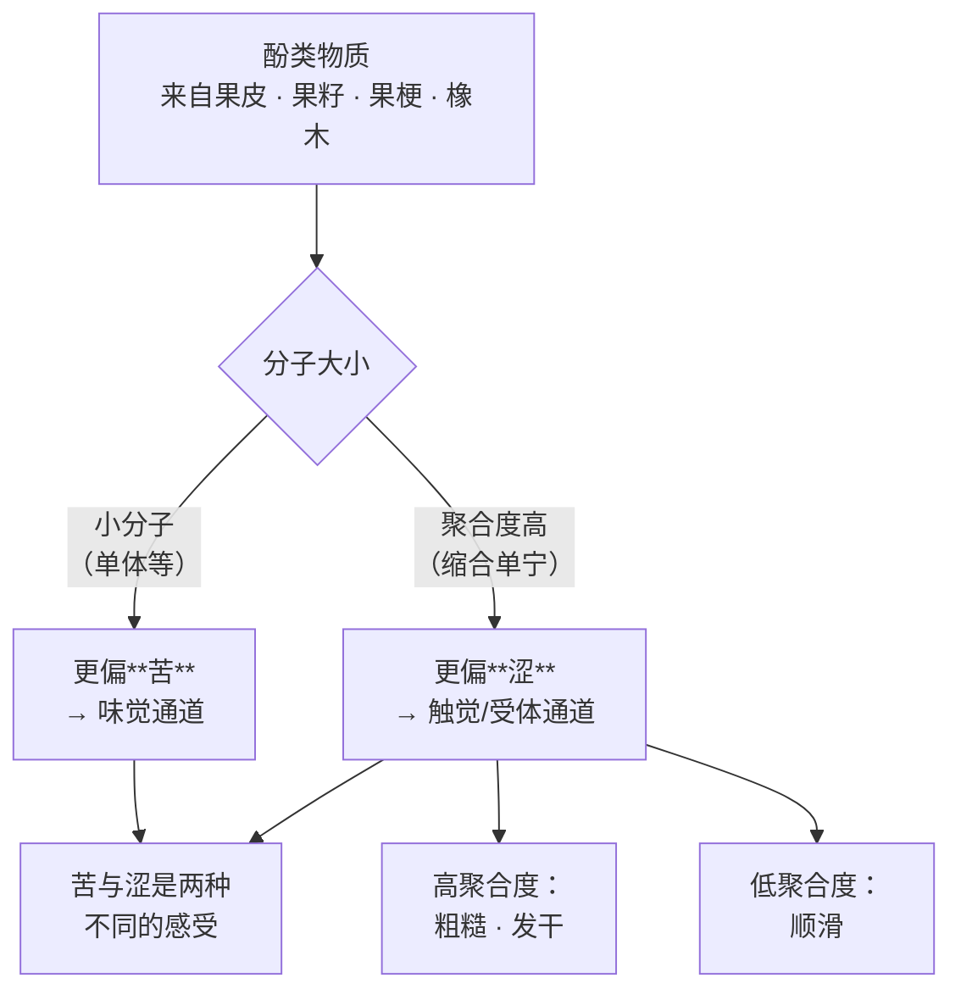
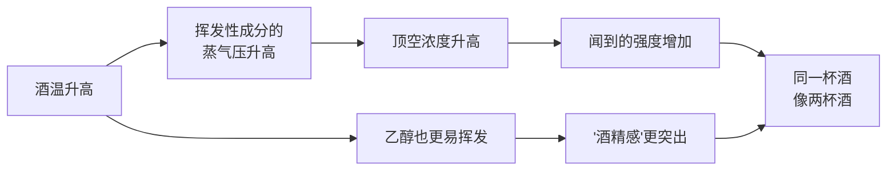

# 第 1 章 一杯酒里有什么：糖、酸、酒精、单宁与香气分子

> **本章目标**：把"甜、酸、涩、苦、酒精感、酒体、香气"这七件事，一项一项落到**具体物质**上。
> 学完这一章，你听到任何一句酒评，都能把它拆回"这句话在说哪个成分、走的哪条感官通道"。
>
> 这是全书的地基。它不需要你开一瓶酒，也不需要天赋——
> 但它会让你之后每一次喝酒都多出一层可以核对的东西。

> **适度饮酒，未成年人不饮酒，酒后不驾车。** 本章的 🅐 实操全部不需要开瓶。

## 1.1 一杯酒的物质清单，比你想的短

先做一次很笨但很有用的算术。

一瓶标 13 % vol 的酒，意思是每升里有 130 mL 乙醇[^1]。乙醇在 20 ℃ 的密度约
0.789 g/cm³，所以：

```
130 mL/L × 0.789 g/mL ≈ 102.6 g/L 乙醇
```

一升酒大约 1 kg 上下，所以**乙醇占了约 10 % 的质量**。剩下的绝大部分是**水**。

那"一切个性"藏在哪？藏在剩下的那几个百分点里。我们可以用**法规限值**把它框出来
（这些是本书能查到原文的硬数字，不是估计）：

| 成分 | 一个可核对的锚点 | 出处 |
|------|----------------|------|
| 残糖[^2] | 要叫"干（dry）"，通常不超过 **4 g/L**（附条件时可到 9 g/L） | (EU) 2019/33 Annex III |
| 总酸[^3] | 欧盟对"葡萄酒"的**法定下限**：以酒石酸计 **3.5 g/L**（= 46.6 meq/L） | (EU) No 1308/2013 Annex VII |
| 乙醇 | 欧盟"葡萄酒"的实际酒精度下限 **8.5 % vol**（A、B 种植区）/ **9 % vol**（其他区），总酒精度上限 **15 % vol**（有例外） | 同上 |
| 甘油[^4] | 没有法定限值。个案实测：某试验中酿酒酵母对照株产 **6.2 g/L**，换用其他酵母做顺序接种可到 **10.1 / 11.5 g/L**；同一菌株在霞多丽 **8.1 g/L**、在西拉 **14.9 g/L** | 转引，见[出处登记](../../standards.md) §8.2 |
| 二氧化硫[^5] | 总量上限：红 **150 mg/L**、白与桃红 **200 mg/L**（糖含量 ≥5 g/L 时提高） | (EU) 2019/934 Annex I Part B |
| 挥发酸[^6] | 上限：白与桃红 **18 meq/L**、红 **20 meq/L** | 同上 Part C |

把干型酒的这几项加起来——残糖不到 4、总酸六七克的量级、甘油个位数到十几克、
酚类在红酒里是克的量级——**总共也就是几十 g/L，即百分之几**。

> **所以第一条要记住的事**：水和乙醇占掉了 95 % 以上的质量，
> 而**决定这杯酒是什么样的一切**——糖、酸、甘油、单宁、上千种香气分子——
> 全挤在剩下那几个百分点里。这就是为什么"差一点"在酒里能差很多：
> 基数太小，一点变化就是成倍的变化。

> **诚实说明**：上表给的是**法规限值**与**个案实测值**，不是"典型区间"。
> 本书至今没有找到可引用的一手"典型区间"数据（法规只规定上下限，不告诉你常见值是多少）。
> 所以本章不写"干红的总酸一般是 x~y"这种句子——**那类数字在网上很多，出处都对不上**。

[^1]: [乙醇](../../glossary.md#ethanol)（ethanol）与[酒精度](../../glossary.md#abv)（ABV, % vol）。
[^2]: [残糖](../../glossary.md#residual-sugar)（residual sugar, RS）。
[^3]: [总酸 / 可滴定酸](../../glossary.md#total-acidity)（total / titratable acidity）。
[^4]: [甘油](../../glossary.md#glycerol)（glycerol）。
[^5]: [二氧化硫 / 亚硫酸盐](../../glossary.md#so2)（SO₂ / sulfites）。
[^6]: [挥发酸](../../glossary.md#volatile-acidity)（volatile acidity, VA），主体是乙酸。

### 物质、感受、通道：三件不同的事

初学者最容易犯的错，是把这三样混成一件事。它们必须分开：



注意图里两条**反直觉**的连线：**涩**和**酒精的热感**都没有连到味觉，
而是连到"化学感觉"[^7]——它们**不是味道**。这一点是本章后面两节的重点。

还要注意 **body**[^8] 没有专属的输入：它是由多个成分共同造成的**综合印象**，
不对应任何单一物质。所以本书凡在需要精确的地方，都会把 body 拆成
"酒精度 + 残糖 + 溶解的固体物质"来讲。

[^7]: [化学感觉 / 化学触觉](../../glossary.md#chemesthesis)（chemesthesis）。
[^8]: [酒体](../../glossary.md#body)（body）。

## 1.2 甜：残糖，以及法规怎么把"甜"切成四档

"这酒甜不甜"看起来是最主观的问题，其实是**唯一有法定刻度**的那一项。

欧盟 (EU) 2019/33 的 Annex III 把静止葡萄酒的甜度术语规定成四档
（下面是本书读取法规原文后的复述，不是转述二手资料）：

| 术语（英/法） | 糖含量条件 |
|--------------|-----------|
| dry / sec（干） | 不超过 **4 g/L**；**或者**不超过 **9 g/L**，前提是"以酒石酸计的总酸（g/L）比残糖低不超过 2 g" |
| medium dry / demi-sec（半干） | 不超过 **12 g/L**；或不超过 **18 g/L**，前提是总酸比残糖低不超过 10 g |
| medium / moelleux（半甜） | 不超过 **45 g/L** |
| sweet / doux（甜） | **至少 45 g/L** |

这张表里最值得琢磨的不是那四个数字，而是**那个附加条件**。

> **法规自己承认："甜"是相对的。**
> 同样 8 g/L 的残糖：如果总酸只有 4 g/L，它不能叫"干"；
> 如果总酸有 6.5 g/L（与残糖之差在 2 g 以内），它**可以合法地叫"干"**。
>
> 换句话说，立法者接受了一个感官事实：**酸会抵消甜的感知**。
> 这条规则是本书"结构要素要放在一起看"这个原则最硬的证据——
> 它不是品酒师的说法，它写在法规里。

起泡酒用的是另一套术语（同一附件的 Part A），阈值完全不同：

| 术语 | 糖含量条件 |
|------|-----------|
| brut nature（及各语言等价词） | **低于 3 g/L**，且**二次发酵后未加糖** |
| extra brut | **0~6 g/L** |
| brut | **低于 12 g/L** |
| extra dry | **12~17 g/L** |
| sec / dry | **17~32 g/L** |
| demi-sec | **32~50 g/L** |
| doux | **高于 50 g/L** |

对比着看，你会发现一件很容易踩坑的事：

> **同一个"干"字，在不同品类里代表的糖量完全不同。**
> 静止酒的 `sec`（干）通常在 4 g/L 以下；
> 起泡酒的 `sec / dry` 却是 **17~32 g/L**——足够让很多人觉得明显甜。
> 而起泡酒里真正"不甜"的那一档叫 **brut nature**（<3 g/L）。
>
> 所以在酒单上看到"Dry 香槟"时，它比"Brut 香槟"**甜得多**，
> 这不是商家用词不当，而是法定术语就是这么定的。

为什么两套阈值差这么大（气泡、酸度、温度如何改变甜的感知）留到第 16 章。
这里只要记住：**术语是按品类定义的，不能跨品类套用**。

### 残糖里是什么糖，也有影响

葡萄汁里主要是**葡萄糖和果糖**[^9]。酿酒酵母 *Saccharomyces cerevisiae*
是**嗜葡萄糖的**（glucophilic）——有实验在发酵两天后测到它消耗了
**48.19 % 的葡萄糖，但只消耗了 26.74 % 的果糖**（差异显著，p<0.01）[^10]。

结果是：**发酵越往后、残糖越多的酒，残糖里果糖的比例越高**。
两种糖的甜度并不相同，所以"残糖数字一样、甜感不一样"是可能的。

> **诚实说明**：果糖与葡萄糖的**具体甜度比值**，本书尚未核到可引用的一手出处，
> 所以这里只说"不相同"，不给数字。见[出处登记](../../standards.md)的待办清单。

[^9]: [葡萄糖与果糖](../../glossary.md#glucose-fructose)。另见[加糖](../../glossary.md#chaptalization)（chaptalization）——它提高的是酒精，不是甜度。
[^10]: *Frontiers in Microbiology* 2025（PMC12263952）。多篇论文把"*S. cerevisiae* 嗜葡萄糖"作为已知事实引用，见[出处登记](../../standards.md) §8。

## 1.3 酸：总酸和 pH 是两件事

这一节只要讲清一件事：**总酸和 pH 不是同一个指标，而且不能互相换算。**

- **总酸（可滴定酸）** 量的是"这杯酒里总共有多少酸"——用碱滴定到某个终点，
  测的是**能被中和的酸总量**；
- **pH**[^11] 量的是"这些酸**解离出了**多少游离氢离子"。

两者不同步。同一个总酸数字，可以对应不同的 pH。
造成不同步的原因涉及缓冲体系与盐的形成，本书在第 3 章补齐出处后再展开——
这里先记住结论：**看酸必须两个数一起看**。

它们各自决定不同的事：

| 指标 | 主要决定 |
|------|---------|
| 总酸 + 残糖的**相对关系** | 你入口感到的"酸不酸、甜不甜"（正是 §1.2 那条法规条件的由来） |
| **pH** | 颜色表现、二氧化硫的有效形态比例、微生物稳定性（第 5 章） |

### 单位陷阱：一个酸的数字必须先问"以什么计"

欧盟法规写"葡萄酒的总酸**以酒石酸计**不低于 3.5 g/L，**即 46.6 meq/L**"——
一句话里给了两个单位，这本身就是提醒：

> **同一瓶酒，换一个表达基准，数字就变了。**
> 看到"总酸 6.2"这样的数字，先问三件事：以什么酸计？g/L 还是 meq/L？测的是总酸还是挥发酸？
> 三个问题里有一个答不上来，这个数字就没有意义。

法规给的换算关系可以自己验算：酒石酸是二元酸，摩尔质量约 150 g/mol，
所以 1 meq 对应约 75 mg，`3.5 g/L ÷ 0.075 g ≈ 46.7 meq/L`——与法规写的 46.6 meq/L 吻合。
**这类小验算值得做**：它能立刻暴露抄错的数字。

### 挥发酸：少量是复杂度，过量是缺陷

酒里的酸分两类：**固定酸**（酒石酸[^12]、苹果酸[^13]、乳酸等，蒸不走）
和**挥发酸**（主体是乙酸，能被蒸馏带出）。挥发酸在低浓度下给复杂度，高了就是醋味。

法规对它设了上限：白与桃红 **18 meq/L**、红 **20 meq/L**。
换算成常见的 g/L 写法（乙酸是一元酸，摩尔质量约 60 g/mol）：

```
18 meq/L × 0.060 g ≈ 1.08 g/L
20 meq/L × 0.060 g ≈ 1.20 g/L
```

也就是说：**法定上限大约在 1.1~1.2 g/L（以乙酸计）这个量级**。
这个数字很有用——它告诉你"闻得出醋味"这件事，
在合法的酒里发生的空间其实很小（缺陷识别见第 31 章）。

> 顺带一句术语纪律：把苹果酸转化成乳酸的过程叫**苹果酸乳酸发酵**[^14]，
> 行业里常俗称"二次发酵"。但在起泡酒的语境里，"二次发酵"指的是**瓶内/罐内产气的那次酒精发酵**
> ——**同一个词，两个完全不同的东西**。看到这个词先确认在说哪个（第 14、16 章）。

[^11]: [pH](../../glossary.md#ph)。
[^12]: [酒石酸](../../glossary.md#tartaric-acid)（tartaric acid）。
[^13]: [苹果酸](../../glossary.md#malic-acid)（malic acid）。
[^14]: [苹果酸乳酸发酵](../../glossary.md#mlf)（malolactic fermentation, MLF）。

## 1.4 酒精：一个数字背后其实有四件事

酒标上那个百分数，看起来只是"烈不烈"。实际上乙醇在同时干四件事。

先把法规的边界摆清楚。欧盟 (EU) No 1308/2013 对"葡萄酒"的定义里写明：

- **实际酒精度不低于 8.5 % vol**（原料全部来自 A、B 两个种植区时），
  **其他种植区不低于 9 % vol**；
- 带原产地/地理标志保护的酒可**低至 4.5 % vol**；
- **总酒精度不超过 15 % vol**——但有例外：未经加糖增浓的某些欧盟产区上限可达 **20 % vol**，
  带 PDO[^15] 且未增浓的可以超过 15 % vol。

这三条一起说明了一件事：**"葡萄酒"是一个被定义出来的法律类别，不是一个自然类别。**
8 % 的和 20 % 的都可以合法地叫葡萄酒。

### 糖去哪了：一个可以自己算的换算

酒精来自糖。这个换算值得自己推一遍，因为它能解释"为什么暖产区的酒酒精度高"：

葡萄糖发酵成乙醇的化学计量关系是**一分子葡萄糖 → 两分子乙醇 + 两分子二氧化碳**。
按摩尔质量算，理论上 1 g 葡萄糖最多产 `2×46.07/180.16 ≈ 0.511 g` 乙醇。

而 1 % vol 的乙醇 = 每升 10 mL 乙醇 ≈ **7.89 g/L**。所以理论上需要：

```
7.89 ÷ 0.511 ≈ 15.4 g/L 糖  →  1 % vol 酒精
```

实际需要的糖**比这更多**——酵母还要长菌体、还要产甘油和其他副产物，
不可能把糖百分之百变成乙醇。教科书与行业资料给的**经验值在每升十六到十八克这个量级**
（不同资料略有差异，本书标为**经验值**；具体机制与数据见第 3 章）。

> **这个换算的用处**：知道了它，你就能从"酒精度 14.5 %"反推出
> "采收时的糖大约在 240 g/L 以上的量级"，
> 进而理解**采收决策**为什么是在糖、酸、酚类成熟度之间做取舍（第 7 章）。

### 乙醇同时在做的四件事

| 它干的事 | 通道 / 机理 | 证据 |
|---------|-----------|------|
| **热感、辛辣、刺** | 走**化学感觉**通路——乙醇可经由 TRPV1（也就是辣椒素受体）这一类通路引发和增强痛觉感受器的反应 | Trevisani 等，*Nature Neuroscience* 2002 |
| **甜感** | 乙醇本身带一点甜 | 见[出处登记](../../standards.md) §8.2 的甘油/乙醇感官研究（结论待第 3 章补齐）|
| **黏稠、重量感** | 提高液体黏度 | 实测：水基样品 **0.89~0.92 mPa·s**，含酒精的模型样品 **1.38~1.41 mPa·s**，红葡萄酒 **1.53~1.57 mPa·s** |
| **改变香气** | 作为溶剂，改变香气分子在液相与气相之间的分配（**基质效应**[^16]） | 机理与数据见第 4 章（本章不写死数字）|

> **所以"高酒精"从来不只是"更烈"**：它同时让酒更甜、更稠、更"热"，
> 还会改变你闻到什么。这就是为什么**降低酒精度不是拧一个旋钮**——
> 它会同时动四样东西。

[^15]: [PDO / PGI](../../glossary.md#pdo-pgi)（原产地保护 / 地理标志保护）。
[^16]: [基质效应](../../glossary.md#matrix-effect)（matrix effect）。

## 1.5 涩：它根本不是味觉

这是本章最重要的一节，因为它纠正的是一个几乎人人都有的误解。

**涩**[^17]是口腔黏膜的**干燥、收缩、发糙**感。它在舌头的味觉受体上找不到位置——
它属于**触觉/机械感受**这一侧。

目前的机制理解是这样的（据 2024 年发表在 *Chemical Senses* 的综述）：

- 过去认为涩的**唯一**机制是**唾液润滑性丧失**：单宁[^18]之类的多酚[^19]与唾液蛋白结合，
  破坏唾液的润滑层，于是舌与腭之间的**摩擦增大**；
- **近期研究表明还有第二条路**：**非触觉的口腔受体**也能在**没有机械刺激**的情况下引发涩感；
- 而且"涩到底是**单一感受**，还是包含 pucker（发紧）/ drying（发干）/ roughness（发糙）
  这些**独立的子性质**"——**至今没有定论**。

综述还指出一件对读者很实用的事：**任何单一的化学或物理测量都不足以预测涩的强度**，
因为每种测量只反映其中一条机制。

> **诚实说明**：所以当你看到"某酒的单宁含量 X mg/L"时，
> 那个数字**不能**直接翻译成"它有多涩"。这不是仪器不够好，是机制本身是多路的。



图里"聚合度决定涩的质地"这一条有实测支持：有研究给酒中添加不同**平均聚合度（mDP）**
的葡萄籽原花青素，感官评价显示**高 mDP 增强"粗糙、发干"的涩感，低 mDP 则带来更顺滑的口感**。
而"苦与涩对分子大小的偏好不同"这个问题，早在 1999 年就有人专门比较过
黄烷-3-醇的**单体、二聚体、三聚体**的苦与涩（Peleg 等）——
本书未读到该文原文，所以**只说这个问题被专门研究过，不写死具体结论**。

### 一个能直接打掉"涩就是稠"的数据

很多人把"涩"和"厚重"当成一件事。有一项 2026 年的研究顺手给了反例：
它测了各组样品的黏度，并且发现——

> **在同一基质内，加入 2 g/L 的原花青素对黏度没有显著影响（p>0.05）。**

也就是说：**加单宁不会让酒变稠**。让酒变稠的是酒精（见 §1.4 的黏度数字）。
所以"这酒很涩"和"这酒很厚"是**两句独立的话**，可以各自成立，也可以各自不成立。

### 记录时把苦和涩分开打分

苦[^20]是**真正的味觉**（由苦味受体介导），涩不是。日常语言把它们都叫"涩"，
但它们的分子偏好不同、通道不同、随时间的变化也不同。

> **这就是[品鉴记录表](../../forms/tasting-note.md)为什么把"涩"和"苦"分成两行。**
> 一开始会觉得难分，但正是"分不开"这件事本身值得记下来——
> 它往往意味着酚类的分子谱系比较宽（第 12、15 章）。

[^17]: [涩感](../../glossary.md#astringency)（astringency）。
[^18]: [单宁](../../glossary.md#tannin)（tannin）。
[^19]: [多酚 / 酚类物质](../../glossary.md#polyphenol)（polyphenols）。另见[花色苷](../../glossary.md#anthocyanin)。
[^20]: [苦味](../../glossary.md#bitterness)（bitterness）。

## 1.6 酒体与甘油：被误用最多的两个词

### body 是印象，不是物质

**body** 是"在口中的重量感、稠厚度"的综合印象。它**没有**对应的单一成分：
乙醇、残糖、以及溶解的固体物质（**干浸出物**[^21]）都在贡献。

所以当有人说"这酒 body 很足"，信息量其实很低——可能是酒精高，可能是糖多，
也可能只是温度偏高。**本书的做法是：凡需要精确时，就把 body 拆开说。**

### 甘油：一个被夸大的角色

**甘油**是酵母发酵的主要副产物之一，在酒里含量不低（见 §1.1 的个案数据），
它本身**略甜、略黏**。酒圈由此发展出一整套说法："甘油多所以酒稠"、"甘油多所以挂杯"。

这个问题**被专门研究过**——至少有三项研究直接冲着它去：

| 研究 | 冲着什么问题去的 |
|------|----------------|
| Noble & Bursick, *Am. J. Enol. Vitic.* 1984 | 甘油对**白葡萄酒感知黏度与甜度**的贡献 |
| Gawel & Waters, *J. Wine Research* 2008 | 甘油对**干白感知黏度**的影响 |
| Gawel, Van Sluyter & Waters, *AJGWR* 2007 | **乙醇与甘油**对雷司令 **body** 的影响 |

> **诚实说明（本书的纪律在这里体现得最清楚）**：这三篇的**题录**本书都核对过，
> 但**没有读到原文结论**，所以本章**不写"研究证明甘油不影响黏度"这类句子**——
> 哪怕那是圈内常见的转述。具体结论会在第 3 章补齐出处后写。
>
> 本章只给一条**可以现在就下的判断**：把"稠"直接归因于甘油，
> 是一条**缺乏本书已核证据支持**的推断链；而"酒精抬高黏度"是有实测数字的（§1.4）。
> 在两者之间，先信有数字的那个。

### 酒腿（挂杯）：一个纯流体力学现象

杯壁上那些"腿"或"泪"，叫做**马兰戈尼效应**[^22]。2015 年发表在 *Scientific Reports*
的研究把机制说得很清楚：

- 那是液膜上**逆着重力**向上的流动，由**界面张力梯度**驱动；
- **普遍接受的解释**是：**乙醇比水更易挥发**，液膜处乙醇先跑掉，
  造成组分梯度 → 表面张力梯度 → 把下方液体拉上来；
- 该研究进一步指出，**蒸发冷却**造成的热效应也有显著贡献；
- 而那种"一颗颗排列整齐的泪珠"，是一种**已知的流体力学不稳定性**。

请注意这个机制清单里**有什么、没有什么**：

> 里面有**乙醇**、**挥发**、**表面张力**、**温度**。
> 里面**没有**"甘油含量"，更**没有**"酒的品质"。
>
> 挂杯明显，主要说明**酒精度偏高**（外加杯子干净、环境干燥、温度合适）。
> 它是一个关于**乙醇浓度与物理条件**的指示，不是关于好坏的指示。

[^21]: [干浸出物](../../glossary.md#dry-extract)（total dry extract）。
[^22]: [马兰戈尼效应](../../glossary.md#marangoni)（Marangoni effect），俗称酒腿 / 酒泪 / 挂杯。

## 1.7 香气：为什么"闻"比"尝"重要，以及阈值不是常数

### 大部分"味道"其实是鼻子的事

味觉能报告的东西非常有限（甜、酸、苦、咸、鲜）。你说的"这酒有黑莓和胡椒味"，
用的不是味觉，而是**后鼻腔嗅觉**[^23]——酒在口中时，挥发性成分经咽腔上行进入鼻腔。

> **一个不用买任何东西的验证**：捏住鼻子喝一口，再松开。
> 松开的那一瞬间涌上来的所有"味道"，都是嗅觉给的（实操任务四）。

### 上千种成分，但只有少数几种说得上话

酒中已鉴定的**挥发性化合物**[^24]数量很大。

> **诚实说明**：常见的说法是"上千种"，但**具体数目取决于检测手段与纳入标准**，
> 而且随技术进步一直在增加。本书**不写死这个数字**
> （本书未读到相关综述原文，见[出处登记](../../standards.md) §8.4）。

好在关键结论不依赖这个数字：**绝大多数成分的浓度低于它自己的感知阈值**[^25]，
对香气没有贡献。筛掉它们的标准工具是**香气活性值（OAV）**[^26]——
浓度除以阈值，大于 1 才**可能**有贡献。

> **OAV 的两个局限必须一起记住**：① 它**不能简单相加**
> （成分之间有协同与掩盖）；② 阈值本身就不稳定（下面就是）。
> 所以"OAV 高"只意味着"值得关注"，不等于"闻起来就是这个味"。

### rotundone：一个把"阈值"这个概念打醒的案例

rotundone 是一种倍半萜，带黑胡椒气息，与西拉等品种的"胡椒味"有关。
它的阈值数据非常值得看，因为**同一个分子，不同研究给出的阈值差了将近一个数量级**：

| 来源 | 测定条件 | 报告的感知阈值 | 嗅盲比例 |
|------|---------|--------------|---------|
| Wood 等，2008（转引）| 前鼻腔，水中 | 约 **8 ng/L** | 受试者中约 1/5~1/4 完全闻不到，**在 4000 ng/L 时仍闻不到** |
| Wood 等，2008（转引）| 前鼻腔，红葡萄酒中 | 约 **16 ng/L** | 同上 |
| *Nutrients* 2020（美国非专业消费者）| 红葡萄酒中，前鼻腔 / 后鼻腔 | **140 / 146 ng/L** | 样本中约 **40 %** 嗅盲 |
| 另一项法国研究（经上文引述）| — | — | 约 **31 %** 的人在 **200 ng/L** 时仍无法察觉 |

从这张表能得到三个结论，每一个都能用一辈子：

1. **阈值不是物理常数。** 它随**介质**（水 / 酒）、**人群**（受训者 / 普通消费者）、
   **方法**而变。引用一个阈值而不给条件，等于没给。
   ——顺带一例：TCA（木塞味的主要责任分子[^27]）**被感知的程度会随酒的风格变化**
   （Mazzoleni & Maggi 2007 的论文标题就是这个结论）；本书因此不给它一个"标准阈值"。
2. **有些人闻不到某些分子，而且是结构性的。** rotundone 存在**特异性嗅盲**：
   不是"没练过"，是**浓度提高一百倍也闻不到**。
   所以"你怎么闻不出胡椒味"这句话，可能问的是一个生理上不存在的东西。
3. **"我闻到了 / 我没闻到"这类分歧，未必有人在说谎或不专业。**
   这是本书反复强调的态度：**先假设感受器不同，再假设对方错**。

[^23]: [后鼻腔嗅觉](../../glossary.md#retronasal)（retronasal olfaction）。
[^24]: [挥发性化合物](../../glossary.md#volatile-compound)。另见[品种香](../../glossary.md#varietal-aroma)（第 4 章）。
[^25]: [感知阈值](../../glossary.md#detection-threshold)（detection threshold）。
[^26]: [香气活性值](../../glossary.md#oav)（odour activity value, OAV）。
[^27]: [TCA · 2,4,6-三氯苯甲醚](../../glossary.md#tca)。另见[酒香酵母 Brett](../../glossary.md#brett)、[氧化](../../glossary.md#oxidation)（第 31 章展开）。

## 1.8 温度：同一杯酒在两个温度像两杯酒

你闻到的其实不是杯里的液体，而是液面之上那层气体——**顶空**[^28]里的浓度。

这就给出了一条纯物理的链条：



蒸气压随温度升高是物理定律层面的事实，所以"**冰过头的酒没有香气**"不是玄学：
你把挥发性成分按在了液相里。反过来，温度偏高时先冲出来的往往是乙醇。

另外，酒精度本身也会影响香气分子在液相与气相之间的分配（**基质效应**）——
机理与数据放在第 4 章，本章不写数字。

> **温度还会改变甜、酸、苦、涩的感知强度吗？**
> 几乎所有侍酒指南都这么说，而本书**目前没有核到可引用的一手研究**，
> 所以第 1 章**只写已核实的那一条**（温度改变顶空浓度）。
> 其余留到第 42 章，届时必须带出处——见[出处登记](../../standards.md) §9 的待办清单。

### 一个有用的旁证：研究者自己用什么条件

值得注意的是，做感官研究的论文都会**固定并写明**侍酒条件。例如：

- 一项 2025 年的研究在符合 **ISO 3591** 的品酒杯中进行，侍酒温度 **17 ± 2 ℃**；
- 一项 2026 年的研究同样用 ISO 3591 杯，侍酒温度 **16 ℃**，每杯倒 **40 mL**。

> **请不要把这些数字当成"正确的侍酒温度"。** 它们是为了让**样品之间可比**而固定的条件——
> 这恰恰说明：**温度不固定，比较就不成立**。
> 这也是[品鉴记录表](../../forms/tasting-note.md)要求记下杯型与酒温的原因。

[^28]: [顶空](../../glossary.md#headspace)（headspace）。

## 1.9 把七件事拼起来：本书的品鉴第一原理

现在可以把这一章收束成一条贯穿全书的原理了。

> ## 品鉴第一原理
>
> **一杯酒给你的所有感受，都来自可以命名、可以测量、可以拆开比较的东西。**
> 所以"好不好喝"可以先放一边——先回答：
> **甜 / 酸 / 涩 / 苦 / 酒精感 / body / 香气**这七项各自在什么位置。

它带来三条推论，后面六部分反复用：

1. **可拆解**：任何一句整体评价（"厚实""尖锐""寡淡"）都能拆成这七项里的某几项。
   拆不出来，说明那句话没有信息量。
2. **可比较**：七项构成一个坐标系。两杯酒的差异可以写成坐标差，
   而"哪个更好"不能——**前者可复述，后者不能**。
3. **相互作用是规则，不是例外**：酸抵消甜（法规都认了）、酒精带来甜和稠、
   温度改变香气强度。所以**单独调一项是不可能的**——
   这是后面"工艺"和"侍酒"两部分所有权衡的根源。

还要加上一条元原则，它和上面三条同等重要：

> **4. 分清"我感觉到的"、"物质上存在的"、"有证据支持的"。**
> 本章出现了三种不同强度的陈述：法规原文（硬）、实测数据（较硬）、
> 只核到题录的文献（待补）。**混用它们是酒类信息最大的污染源。**

## 1.10 常见说法辨析

按本书约定标注**证据强度**：✅ 有共识 / ⚠️ 有争议 / ❌ 明确错误 / 缺乏证据。

| 说法 | 判定 | 说明 |
|------|------|------|
| "挂杯（酒腿）越多，酒越好" | ❌ **明确错误** | 酒腿是马兰戈尼效应：乙醇挥发造成表面张力梯度，外加蒸发冷却的热效应。机制里只有乙醇、挥发、表面张力、温度，**没有品质**。挂杯明显主要提示**酒精度偏高**（*Sci. Rep.* 2015）|
| "挂杯多说明甘油多" | **缺乏证据** | 已发表的机制解释归因于**乙醇**的挥发，不是甘油。本书未见到支持甘油主导的证据 |
| "甘油让酒变稠，所以甘油越多越好" | ⚠️ **有争议（且被夸大）** | 这个问题至少被三项研究专门检验过（Noble & Bursick 1984；Gawel & Waters 2008；Gawel 等 2007），本书**尚未读到原文结论**，故不下断言。但"酒精抬高黏度"有实测数字（水基 0.89~0.92 → 红酒 1.53~1.57 mPa·s），**在两条解释之间先信有数字的** |
| "涩是因为酸太高" | ❌ **明确错误** | 两件事、两条通道：酸走**味觉**，涩是**唾液润滑性下降 + 口腔受体反应**（*Chemical Senses* 2024）。高酸低涩、低酸高涩的酒都大量存在 |
| "涩的酒就是厚的酒" | ❌ **明确错误** | 同一基质内加入 2 g/L 原花青素对黏度**无显著影响**（p>0.05）。加单宁不会让酒变稠 |
| "涩和苦是一回事" | ❌ **明确错误** | 苦是味觉、涩是触觉/受体反应；而且两者对分子大小的偏好不同（小分子偏苦、聚合度高偏涩）。记录时应分开打分 |
| "单宁含量能告诉我这酒有多涩" | ⚠️ **有争议** | 综述明确指出：**任何单一化学或物理测量都不足以预测涩强度**，因为机制是多路的；连"涩是否可分为发紧/发干/发糙等子性质"都未定论 |
| "标 Dry 的香槟就是不甜的" | ❌ **明确错误** | 起泡酒的 `sec / dry` 法定区间是 **17~32 g/L**，比静止酒的"干"（≤4 或附条件 ≤9 g/L）高一个量级。真正不甜的那档叫 **brut nature**（<3 g/L）|
| "干型酒残糖一定是零" | ❌ **明确错误** | 法规允许"干"到 4 g/L；总酸与残糖之差在 2 g 以内时甚至可到 9 g/L |
| "红酒都要醒酒" | **缺乏证据** | 本书**尚未找到设计可靠、可引用的对照实验**。醒酒同时改变多个变量（氧、温度、挥发），"一定更好"是没有依据的一般化。第 42 章补出处，届时再定级 |
| "红酒头痛是亚硫酸盐造成的" | **缺乏证据** | 值得注意的是**白葡萄酒的 SO₂ 法定上限比红葡萄酒更高**（白/桃红 200 vs 红 150 mg/L），这与"红酒更容易头痛"的说法方向相反。2023 年有研究提出**槲皮素**代谢物抑制 ALDH2（IC₅₀ 9.6 µM）→ 乙醛蓄积的**假说**，作者明确写"仍需人体试验验证"——**是假说，不是结论** |
| "标 13 % vol 就一定是 13 %" | ⚠️ **有争议（法规允许容差）** | 各法系都给酒标标示值留了容差，**本书尚未核对具体数值**，所以只说"有容差"，不给数字（待第 20 章）|
| "白葡萄酒不含单宁，所以不涩" | ⚠️ **措辞不准确** | 白葡萄酒同样含酚类，只是通常远少于红葡萄酒——差别主要来自**是否浸皮**这个工艺分野（第 12、13 章），不是"有无" |
| "酒越陈越好" | ❌ **明确错误** | 陈年是化学变化，不是单向改善；能否受益取决于结构（酸、酚类、糖、酒精）与封存条件。第 18、41 章讲判据 |
| "标了'老藤'的酒更好" | **缺乏证据** | 本书在已核对的欧盟法规条文中**未见到**对"老藤"的法定年限定义——也就是说这个词目前属于**不受约束的表述**。藤龄与品质的关系涉及产量与根系深度等机制（第 11 章），但"标了就更好"没有依据 |

## 1.11 思考题

1. 一瓶静止葡萄酒的残糖是 **8 g/L**。它能不能在酒标上合法地标"干（dry）"？
   你还需要知道哪一个数字才能回答？为什么法规要设这样一条**附加条件**——
   它承认了一个什么样的感官事实？
2. 为什么"总酸"和"pH"不能互相换算？各自主要决定什么？
   如果有人只给你一个 pH 值就要你判断"这酒酸不酸"，你会追问什么？
3. 请用本章给出的换算，估算一支 **14 % vol** 的干型酒，
   发酵前葡萄汁里的糖大约在什么量级。写出你的计算过程，并说明
   为什么你的结果应当**大于**用理论化学计量算出的值。
4. "涩"为什么不算味觉？请分别说明目前理解的**两条**机制，
   并解释为什么"测一个单宁含量就能预测涩的强度"这个想法行不通。
5. 有人拿着一杯酒说："看这挂杯，多厚的甘油，好酒。"
   请逐句指出这句话里有几处问题，并说明"挂杯明显"这一观察**真正能提示**什么。
6. **【案例】** 某电商详情页写着：
   *"精选老藤，酒精度 15.5 % vol，超高甘油带来极致挂杯与丝滑单宁，
   零添加亚硫酸盐所以喝完不头痛，建议醒酒 4 小时后饮用，越陈越香。"*
   请指出其中**至少五处**与本章内容矛盾或缺乏证据的地方，
   并写出你会怎么向店家追问（追问要能用一句话定性）。
7. **【案例】** 两位朋友喝同一瓶西拉。A 说"明显的黑胡椒味"，
   B 说"完全没有，你在自我暗示"。请用本章的证据说明：
   为什么 B 的指责很可能是错的？以及这件事对"要不要相信别人的酒评"意味着什么？
8. **【查证】** 本章所有甜度阈值都来自欧盟法规。
   请自己去查**中国国标 GB/T 15037** 对"干、半干、半甜、甜"的规定，
   并回答：它的分档方式与欧盟是否一致？有没有类似"总酸与残糖之差"的附加条件？
   （查不到原文也是一个有价值的结论——请记录你查到了哪一步、卡在哪里。）

> 📖 **参考答案**（想清楚再看）：[Q1](../../qa/01-what-is-in-the-glass-qa.md#q1) ·
> [Q2](../../qa/01-what-is-in-the-glass-qa.md#q2) · [Q3](../../qa/01-what-is-in-the-glass-qa.md#q3) ·
> [Q4](../../qa/01-what-is-in-the-glass-qa.md#q4) · [Q5](../../qa/01-what-is-in-the-glass-qa.md#q5) ·
> [Q6](../../qa/01-what-is-in-the-glass-qa.md#q6) · [Q7](../../qa/01-what-is-in-the-glass-qa.md#q7) ·
> [Q8](../../qa/01-what-is-in-the-glass-qa.md#q8)

## 1.12 本章实操

🅐 档**全部不需要开瓶喝酒**，现在就能做。

### 🅐 无器具版 · 任务一：把三张酒标翻译成信息

找**三张**酒标（自己家的、超市货架上拍的、或电商详情页里的都行），
把上面的字分成三类填进下表。目的不是判断好坏，而是训练"哪些字是受约束的"。

| # | 酒标原文照抄 | ① 受法规约束的信息（品类、酒精度、产地层级、甜度术语、含亚硫酸盐提示…） | ② 可核查但不受约束的（年份、品种、酒庄名…） | ③ 纯营销词（"精选""老藤""珍藏"…） |
|---|------------|--------------------------------|----------------------|------------------|
| 1 | | | | |
| 2 | | | | |
| 3 | | | | |

然后回答：

- 三张标里，**第 ③ 类占了多大比例**？
- 有没有哪张标出现了**甜度术语**？按本章的表，它对应的糖含量范围是多少？
- 有没有标上写了"Dry"或"sec"，而它其实是**起泡酒**？（如果有，恭喜你抓到了本章最实用的一个坑）

### 🅐 无器具版 · 任务二：查一条法规，体会一手资料长什么样

任选**一个**你感兴趣的产区，去找它的**官方产品规范**
（法国 AOC 的 *cahier des charges*、意大利 DOC/DOCG 的 *disciplinare*、
或美国 TTB 的 AVA 相关条文），找出其中任意**两个硬性数字**，例如：

| 我查的产区 | 数字 1（项目 + 数值） | 数字 2 | 文件名 / 链接 | 花了多久找到 |
|-----------|-------------------|--------|------------|------------|
| | | | | |

> **这个任务的真正目的**：让你亲身体会"**产区法规是可以查到原文的**"。
> 一旦你查过一次，以后再看到"某产区规定必须陈年 X 年"这类说法，
> 你的第一反应会变成"原文在哪"——这个反应比记住任何数字都值钱。
>
> 如果你**没查到**，那也请如实记录卡在哪一步（找不到官网？只有外文？要付费？）。
> 本书自己的[出处登记](../../standards.md) §9 就是这么一份"没查到清单"。

### 🅐 无器具版 · 任务三：做一次单位体检

下面三句话都是网上常见的写法。请指出每句话**缺了什么信息**，
以至于这个数字无法使用：

| 句子 | 缺了什么 | 补全后应该怎么写 |
|------|---------|---------------|
| "这款酒总酸 6.5，非常清爽" | | |
| "残糖 5，属于干型" | | |
| "这个分子的香气阈值是 2 ng/L" | | |

> 答案的方向分别是：**以什么计**、**是否满足附加的酸度条件**、**在什么介质里对什么人群测的**。

### 🅑 有条件版 · 任务四：捏鼻子实验（备齐后再做）

**所需**：任意一杯你手边已有的、带明显香气的**饮品**即可——
果汁、咖啡、茶都可以，**不必为此专门买酒或开瓶**。

做法：捏住鼻子喝一小口，在口中停留数秒，注意你能感到的只有甜/酸/苦/涩/温度；
然后**松开鼻子**并呼气，记录那一瞬间涌上来的东西。

| 捏住鼻子时我能感到的 | 松开后增加了什么 | 我的结论 |
|-------------------|---------------|---------|
| | | |

> 这个实验一分钟就能做完，但它是本书最重要的一次亲身验证：
> **你日常所说的"味道"，主体是嗅觉。**

### 🅑 有条件版 · 任务五：一酒两温对照（备齐后再做）

**所需**：一支酒（白或红均可）、两只**同款**杯子、一支温度计（或用冰箱定时替代）、
[品鉴记录表](../../forms/tasting-note.md)。**只改温度这一个变量。**

**适度饮酒，未成年人不饮酒，酒后不驾车。** 每杯 20~30 mL 足够完成记录，两杯合计不足一两。

| 观察项 | A 杯（较凉） | B 杯（较暖） | 差异 |
|-------|------------|------------|------|
| 实测温度 | | | |
| 香气强度（1~5） | | | |
| 能命名的香气 | | | |
| 酒精感（1~5） | | | |
| 涩（1~5，若是红酒） | | | |
| 我更喜欢哪杯，为什么 | | | |

> **注意纪律**：本章只有"温度改变顶空浓度"这一条是本书已核实的。
> 如果你在表里观察到**甜/酸/涩也变了**，那是一个**你自己的观察**，
> 值得记录，但**不要据此下一般性结论**——这正是第 42 章要带出处解决的问题。
> 学会区分"我观察到"和"已被证明"，是这本书想给你的核心习惯。

## 1.13 🔎 买酒与点酒时的用处

把这一章压缩成 6 个动作，柜台前、酒单前都能用：

1. **先看甜度术语，并确认品类**。`sec / dry` 在静止酒是 ≤4（附条件 ≤9）g/L，
   在起泡酒是 **17~32 g/L**。**要"不甜的气泡"，点 brut nature 或 brut，而不是 Dry。**
2. **看酒精度，然后把它翻译成三件事**：更甜、更稠、更热。
   不喜欢"上头感"就往低酒精度找——这比在酒评里挑形容词有效得多。
3. **听到"挂杯好"就自动翻译成"酒精度偏高"**。它不是品质信息，
   但它是一条**真实**的成分信息——这反而有用。
4. **听到"甘油丰富""单宁丝滑所以厚重"这类说法，降低权重**。
   前者缺乏本书已核的证据链，后者把两个独立维度混成了一个。
5. **把"我不喜欢"和"这酒有问题"分开说**。前者是偏好，后者需要判据
   （湿纸板、马厩、醋味、煮白菜等，第 31 章）。这一条能省下大量无效争论和退货纠纷。
6. **任何数字都追问三件事**：什么单位 / 以什么计 / 在什么条件下测的。
   答不出来的数字，直接当它不存在。

> 这六个动作**不需要任何器具、不需要天赋**，却能挡掉市场上最常见的一批话术。
> 后面四十多章讲的是：**当这些基础判断都没问题时，怎么进一步分辨。**

## 1.14 本章依据

本书的纪律要求把"实际查了什么"写出来。本章的依据分成三类，**强度不同**：

### A. 已核对原文的法规（最硬）

- **(EU) 2019/33** Annex III Part A / Part B——起泡酒与静止酒的甜度术语及阈值，
  含"总酸与残糖之差"的附加条件。
- **(EU) No 1308/2013** Annex VII Part II(1)——"葡萄酒"的定义：
  实际酒精度下限 8.5 / 9 % vol、PDO 例外 4.5 % vol、总酒精度上限 15 % vol 及其例外、
  总酸下限 3.5 g/L（以酒石酸计）= 46.6 meq/L。
- **(EU) 2019/934** Annex I Part B / Part C——二氧化硫与挥发酸的上限。

### B. 已核对摘要或数据段的同行评议文献

- **涩的机制与测量**：Wang 等，*Chemical Senses* 49 (2024)，涩感机制与唾液润滑性测量综述
  （双机制、子性质未定论、单一测量不足以预测强度）。
- **聚合度与涩的质地**：*Foods* 15 (2026)，葡萄籽原花青素平均聚合度对感官的影响。
- **黏度实测与"加单宁不改变黏度"**：*Current Research in Food Science* (2026)，
  涩味余味的 fNIRS 研究中的黏度测定与样品设计。
- **酒腿的机制**：Venerus & Nieto Simavilla，*Scientific Reports* 5 (2015) 16162。
- **rotundone 阈值与特异性嗅盲**：*Nutrients* 12 (2020) 2522（含对 Wood 等 2008 的引述）。
- **红酒头痛的槲皮素假说**：Devi、Levin & Waterhouse，*Scientific Reports* 13 (2023) 19503。
- **酿酒酵母嗜葡萄糖**：*Frontiers in Microbiology* (2025)，葡萄糖/果糖消耗比例的实测。
- **乙醇的化学刺激通路**：Trevisani 等，*Nature Neuroscience* 5 (2002) 546–551（据标题结论）。
- **感官研究的侍酒条件**：*Foods* (2025) 与 *Foods* (2026) 两项研究中
  符合 **ISO 3591** 的杯具与 17±2 ℃ / 16 ℃ 的侍酒温度。

### C. 只核对了题录、本章未据以写死结论的文献与教科书

列在这里是为了诚实说明"**本章哪些地方是有意留白的**"：

- 甘油的感官贡献：Noble & Bursick (1984)、Gawel & Waters (2008)、Gawel 等 (2007)
  ——题录已核，**结论待第 3 章补**。
- 苦与涩对分子大小的偏好：Peleg 等 (1999)。
- 非挥发性成分的完整定量与味觉重构：Hufnagel & Hofmann (2008)。
- 有机酸综述：Fowles (1992)。
- 香气成分总数：Polášková、Herszage & Ebeler，*Chem. Soc. Rev.* 37 (2008)
  ——**本章因此不写具体数目**。
- TCA 的感知随酒风格变化：Mazzoleni & Maggi (2007)——**只用其定性结论，不用数字**。
- **教科书体系参照**（本章未逐页核对，列出是为了标明后续该查哪里）：
  Jackson《Wine Science》第 5 版第 **6** 章（Chemical Constituents of Grapes and Wine）
  与第 **11** 章（Sensory Perception and Wine Assessment）；
  Waterhouse、Sacks & Jeffery《Understanding Wine Chemistry》第 2 版；
  Robinson & Harding《The Oxford Companion to Wine》第 5 版。

以上每一条的完整题录、DOI、核对状态与核对日期，见[出处与资料登记](../../standards.md)。

---

**下一章**：第 2 章 感官通道——味觉、嗅觉、三叉神经与"风味"的组装。
本章把物质对上了感受，下一章要回答：**这些感受在身体的哪里产生，
以及为什么人和人之间的差异这么大**。
