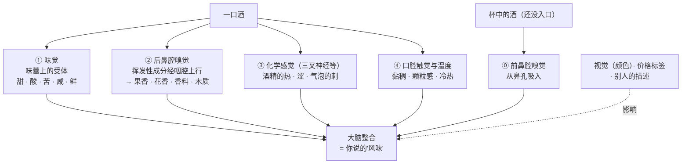
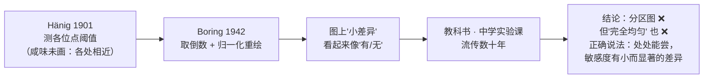

# 第 2 章 感官通道：味觉、嗅觉、三叉神经与"风味"的组装

> **本章目标**：把第 1 章建立的"物质 → 感受"链条，接到**身体的哪个系统**上。
> 学完这一章，你会知道：一句酒评里的每个词分别经由哪条通路进来，
> 以及**为什么两个人对同一杯酒可以诚实地给出相反的描述**。
>
> 这一章有一个反复出现的主题：**"我感觉不到"不等于"它不存在"**。
> 这不是一句客气话——它有分子层面的证据。

> **适度饮酒，未成年人不饮酒，酒后不驾车。** 本章的 🅐 实操全部不需要开瓶。

## 2.1 "风味"不是一种感觉，而是一次组装

日常语言里的"味道"是一个被压扁的词。它至少压掉了四件生理上完全不同的事：

注意图里两件事：

1. **"风味"是一个整合出来的结果**，不是某个器官的读数。所以它可以被非化学的输入
   （颜色、价格、别人先说了什么）影响——那部分留到第 32 章，本章只处理**生理通路**。
2. **同一杯酒进了嘴，味觉和嗅觉是同时在报告的**，而它们的**个体差异大小完全不同**。
   这一条是本章最有用的结论，2.4 节会回来讲。

> **本章的术语纪律**：本书此后凡写"味道"，一律指**味觉**那五项；
> 凡写"香气"，指嗅觉；凡写"口感"，指化学感觉 + 触觉。
> 写记录表时把它们分行，正是因为它们是不同的通道（见[品鉴记录表](../../forms/tasting-note.md)）。

## 2.2 味觉：五种基本味，各有受体——以及一张著名的错图

### 受体是分开的

味觉由味蕾里的味觉受体细胞介导，五种基本味各有各的分子机制。其中**酸味**的机制是最近才被定下来的：
2019 年发表在 *Current Biology* 的研究显示，**质子通道 Otop1 是酸味（对酸的味觉反应）所必需的**——
敲除它，味觉细胞与神经对酸刺激的反应就消失了[^1]。

> **诚实说明**：五种基本味中，甜、鲜、苦的受体家族（T1R、T2R）与酸的 Otop1 证据较为清楚；
> **咸味受体在人身上的完整机制仍有未定论的部分**，本书不给单一答案。

[^1]: [味觉受体](../../glossary.md#taste-receptor)（taste receptors）与[Otop1](../../glossary.md#otop1)（质子通道，酸味）。

### 那张"舌面分区图"是怎么来的

几乎每个人都见过那张图：舌尖甜、两侧咸和酸、舌根苦。**它是错的**，
而且错得很有教育意义。2022 年发表在 *Current Research in Food Science* 的综述把来龙去脉讲清楚了：

- 这张图**早就被推翻了**（"the existence of the so-called 'tongue map' has long been discredited"）；
- 它的来源是 1901 年 Hänig 的味觉阈值测量。Hänig 测的是**阈值随舌上位置的变化**，
  而且他**没有画咸味**，因为咸在所有测试位点上的感知大致相同；
- 1942 年 Boring 在教科书里**重新绘制**了 Hänig 的数据：把阈值取倒数、再除以最大值。
  这一步让**很小的差异在图上看起来像"有"和"无"**——
  评论者的原话是，这种画法让读者以为曲线低谷处"几乎没有感觉"；
- 然后它进了教科书、进了中学实验课，流传了几十年。

**但"完全均匀"也不对。** 同一篇综述强调了另一半事实：

- 五种基本味的受体**分布在整个有味蕾的区域**，不是分区专营；
- 然而心理物理学数据**确实显示**口腔不同位置的味觉敏感度存在
  **显著（尽管很小）的差异**——舌、软腭、咽都有味蕾；
- 味觉上皮的范围是：**舌缘与舌背、软腭、咽**。
  **嘴唇、舌下、硬腭、颊内侧不产生味觉**。

> **这个案例值得记住的不是舌头，而是图。**
> 一次坐标变换（取倒数 + 归一化）就能把"三倍的阈值差"画成"有和没有"。
> 你以后会在酒类营销里反复见到同一招：**纵轴不从零开始、用相对值放大微小差异**。

### 对品酒的实际含义

- **"先让酒碰舌尖尝甜"没有依据**——但"让酒在口中铺开"有另一个正当理由：
  增加与**味觉上皮**和**口腔黏膜**的接触面积，并把挥发性成分往**后鼻腔**推。
- 不必纠结"这口酒该放在舌头哪个位置"。要纠结的是**温度、量、停留时间是否每次一致**
  ——**可比较比"正确姿势"重要得多**。

## 2.3 嗅觉：约四百个受体，和一套组合编码

### 受体数量：一个可以查到的数字

人类的嗅觉受体（OR）基因是基因组中最大的多基因家族。2003 年发表在 *PNAS* 的全基因组分析
在人类基因组中检出 **388 个可能有功能的 OR 基因和 414 个假基因**（有功能者约占 48 %）；
另一篇 2009 年的论文写"迄今已发现近 **390 个**有功能的人 OR 基因与 **462 个**假基因"。

> 两个来源都落在**"约四百个有功能、另有约四百到五百个已失效"**这个量级上，
> 所以本书写**"约 400 个"**，不写单点精确值——**基因注释会随基因组版本更新**。

注意那个假基因数字：**人类的嗅觉受体基因有一半左右已经坏掉了**。
这是理解后面"个体差异"的关键背景——**坏掉与否，人和人并不相同**。

### 组合编码：不是一个分子对一个气味

嗅觉的工作方式是**组合式**的：一个气味分子会激活若干个受体，一个受体也会响应若干种分子，
大脑读的是**激活模式**而不是单个信号。

这件事有直接证据。2024 年发表在 *J. Agric. Food Chem.* 的研究，为了给雷司令陈年后的
"汽油味"分子 **TDN**[^2] 找到受体，**筛了一个含 766 个嗅觉受体变体的库**，
最后定位到 **OR8H1**，并且发现它对**六元碳环结构**有选择性——
也就是说，受体认的是**结构特征**，不是"某一种酒的味道"。

[^2]: [TDN](../../glossary.md#tdn)（1,1,6-三甲基-1,2-二氢萘），雷司令陈年"汽油味"的责任分子（第 4 章展开）。

### 两条鼻子：前鼻腔与后鼻腔

同一个分子，从鼻孔吸进去（**前鼻腔**[^3]）和从口中经咽腔上行（**后鼻腔**）是**两条路**，
经过的气流路径、温度、稀释程度都不同，因此**阈值可以不同**。

第 1 章那张 rotundone 的表里其实藏了一个答案：在美国非专业消费者样本中，
红葡萄酒中 rotundone 的**前鼻腔阈值 140 ng/L、后鼻腔 146 ng/L**——**两者几乎相同**。

> **别把这条个案推广成规律。** 它只说明：对这个分子、这个基质、这个人群，两条路差不多。
> 其他分子未必如此。**阈值永远要连着条件一起引用**，这是第 1 章的老规矩。

[^3]: [前鼻腔嗅觉](../../glossary.md#orthonasal)（orthonasal）与[后鼻腔嗅觉](../../glossary.md#retronasal)（retronasal）。

## 2.4 个体差异是结构性的，不是"练得不够"

这是本章最重要的一节。

### 一个几乎是单基因的例子：β-紫罗兰酮

**β-紫罗兰酮（β-ionone）** 带紫罗兰 / 覆盆子 / 玫瑰气息，是葡萄酒里的
C13-降异戊二烯类香气分子之一（第 4 章）。2013 年发表在 *Current Biology* 的研究发现：

- 一个单核苷酸变异 **rs6591536** 是 β-紫罗兰酮嗅觉敏感度的**因果变异**；
- 它导致嗅觉受体 **OR5A1** 第二胞外环上的一个氨基酸替换（N183D）；
- 这一个位点**解释了超过 96 % 的表型变异**——作者的原话是它"**近似一个单基因孟德尔性状**"；
- 携带敏感型基因型的人**更容易分辨**加了与没加 β-紫罗兰酮的食品饮料；
- 而且**用词不同**：敏感者倾向于描述为"**芬芳（fragrant）**""**花香（floral）**"，
  不敏感者对同一样品的描述则不一样；基因型还影响了情绪联想与产品选择。

请把这条结论读三遍：**不是"有人更会形容"，而是他们闻到的东西本来就不一样。**

同类的经典例子是 **androstenone**：2007 年发表在 *Nature* 的研究表明，
嗅觉受体 **OR7D4** 的遗传变异部分解释了为什么同一种气味有人觉得"汗臭尿骚"、
有人觉得"甜香花香"、还有人**什么都闻不到**。

再加上第 1 章讲过的 **rotundone 特异性嗅盲**（部分人在浓度高到 4000 ng/L 时仍闻不到），
三个独立的分子给出了同一个结论：

> **特异性嗅盲[^4]是嗅觉的常态现象，不是缺陷。**
> 它的比例可以高到三到四成，而且**提高浓度没有用**。

[^4]: [特异性嗅盲](../../glossary.md#specific-anosmia)（specific anosmia）——对某一类分子的选择性嗅觉缺失，
    其余嗅觉正常。它与[嗅觉受体](../../glossary.md#olfactory-receptor)基因的个体差异有关。

### 但训练确实有用——这两件事不矛盾

如果个体差异是先天的，练习还有意义吗？有。
2011 年发表在 *Chemosensory Perception* 的研究，标题本身就是结论：
**"专家的训练水平影响他们对关键葡萄酒化合物的检测阈值"**。

> **诚实说明**：本书**只读到该文的题录与标题结论**，未读到原文的具体数值，
> 因此这里只说"训练水平与检测阈值有关"，**不给任何"训练后阈值降低 X 倍"的数字**。

把两件事放在一起，得到本书对"品酒天赋"的完整立场：

| 层面 | 能不能靠练 | 证据 |
|------|-----------|------|
| **闻不闻得到某个分子** | 相当程度上**不能**（受体变异、特异性嗅盲） | OR5A1 / OR7D4 / rotundone |
| **检测阈值的高低** | **可以**被训练水平影响 | Tempere 等 2011（仅题录已核）|
| **能不能叫出名字、分类、复述** | **完全可以**，而且这是提升最快的部分 | 本书全书的方法 |

> **所以本书的教学重心很清楚**：不去训练你的受体（那是基因的事），
> 而去训练**你的记录方式与判据**——那部分人人可练，而且**可复现**。

### 味觉这一侧也有差异，但结论更谨慎

味觉的个体差异常用 **PROP 味觉者分型**[^5]来衡量（对 6-正丙基硫氧嘧啶这种苦味物质的敏感度，
与 *TAS2R38* 基因型相关），并常与**菌状乳头密度**[^6]一起讨论。

但它和葡萄酒感知的关系，**证据是分歧的**：

| 研究 | 结论方向 |
|------|---------|
| Pickering 等，*Food Quality and Preference* 2004 | 红葡萄酒引起的**味觉与涩感强度**与 PROP 敏感度**相关** |
| 一项 2024 年的研究（题为 "PROP taste status has limited impact on wine flavour perception and acceptability by consumers"）| PROP 分型对消费者的葡萄酒风味感知与接受度**影响有限** |
| Muñoz-González 等，*Food & Function* 2025 | 不同 PROP 分型的人，酒刺激后**唾液蛋白组的早期动态不同** |

> **本书的判定**：⚠️ **有争议**。"超级味觉者天生更会品酒"是一个**被过度简化**的说法——
> 分型与**某些**感知强度有关联的证据存在，但"因此判断更准确"是另一回事，**没有被证明**。

[^5]: [PROP 味觉者分型](../../glossary.md#prop-taster)（PROP taster status）。
[^6]: [菌状乳头](../../glossary.md#fungiform-papillae)（fungiform papillae）——舌前部含味蕾的乳头，密度个体差异很大。

## 2.5 三叉神经与化学感觉：酒里"辣""刺""涩"的来源

第 1 章说过涩不是味觉。**它到底在哪条通路上？** 2014 年发表在 *Chemical Senses* 的研究
用了一个非常干净的人体实验设计，值得完整看一遍：

| 实验条件 | 结果 |
|---------|------|
| 鼓索神经（**味觉**神经）**损伤或利多卡因麻醉** | 涩感**不受影响** |
| **同时**阻断舌的味觉与三叉神经支配（下牙槽神经阻滞） | 涩感**消失** |

结论很硬：**涩主要走三叉神经**[^7]，不是味觉。

该研究还做了细胞层面的工作：小鼠三叉神经节神经元对 **19 种单体酚类中的 8 种**
以及 **8 种红葡萄酒多酚聚合物**产生了明确的钙响应；
**带没食子酰基（galloyl）的分子更能激活**，不带的几乎不激活；
而且这些响应依赖 **Gαs / 腺苷酸环化酶 / 环核苷酸门控通道**这条 G 蛋白偶联信号通路，
**不依赖 TRP 通道**。

> **把它和第 1 章拼起来**：涩至少有两条路——
> ①**唾液润滑性下降造成的摩擦增大**（力学的），
> ②**三叉神经上的受体直接被酚类激活**（化学的，走 G 蛋白信号）。
> 这正是 2024 年那篇综述说的"非触觉的口腔受体也能在没有机械刺激时引发涩感"的分子版本。
>
> 顺带解释了一件事：**为什么"涩"这个词总是和"辣""刺"混在一起说**——
> 它们真的是同一套神经系统的邻居。

同一套系统还负责：**乙醇的灼热**（经 TRPV1 一类通路，第 1 章）、
**二氧化碳的刺感**（第 5 章）、**薄荷的凉**。

[^7]: [三叉神经与化学感觉](../../glossary.md#trigeminal)（trigeminal / chemesthesis）。

## 2.6 跨通道：为什么"闻起来甜"可能是真的

把一个果香浓郁但残糖很低的干型酒递给别人，常会听到"这酒有点甜"。
**这句话未必是外行话。**

**气味诱导的甜味增强**[^8]是一个被专门研究的现象。
2026 年发表在 *Current Research in Food Science* 的研究，
让 16 名受试者评价**含糖量相同、气味强度不同**的蔗糖溶液，同时记录脑电：

- 行为结果显示气味强度与甜味感知呈**倒 U 形**关系——**气味太强反而不再增甜**；
- 脑电数据支持嗅觉与味觉之间存在**跨通道交互**。

> **诚实说明**：这项研究用的是**蔗糖溶液**，不是葡萄酒；
> 本书**没有核到在葡萄酒基质里做的等价实验**。所以本章只说
> "**气味可以改变甜味感知，这一现象有实验证据**"，
> **不说"某某酒的甜感有百分之多少来自香气"**。

这条对记录方式有直接影响：

> **[品鉴记录表](../../forms/tasting-note.md)要求把"香气里的甜"和"味觉上的甜"分开写。**
> 前者写在香气栏（如"成熟果香、果酱感"），后者写在味觉栏（残糖档位）。
> 合并写，你就分不清一杯酒是**真的有糖**，还是**闻起来像有糖**——
> 而这两件事在买酒时后果完全不同（一个影响配餐，一个不影响）。

[^8]: [跨通道交互 · 气味诱导的甜味增强](../../glossary.md#cross-modal)（odour-induced sweetness enhancement, OISE）。

## 2.7 时间轴：适应、累积与顺序效应

感官不是一台每次给出相同读数的仪器，它**有历史**。

- **嗅觉适应**[^9]：持续闻同一种气味，感知强度会下降。
  这是"闻久了就闻不到了"的生理基础，也是**连续品鉴要留间隔**的原因。
- **涩会累积**：与香气相反，涩感**随每一口叠加**——
  这就是为什么连喝三口高单宁红酒之后，第三口总显得更涩。
  第 1 章引的 *Chemical Senses* 2024 综述把这一点归到唾液润滑层的恢复需要时间。
- **顺序效应**：先喝的那杯会改变后一杯的评价基线。
  这是盲品要**随机化呈现顺序**的原因（第 30 章）。

> **给实操的三条硬规矩**（后面所有 🅑 实操都会用到）：
> ① 比较两杯酒时，**同杯型、同温度、同倒酒量**；
> ② **两两之间留间隔**，必要时用清水；
> ③ **记录顺序**，并在可能时**换一次顺序再做一遍**——
> 如果结论跟着顺序变，那结论就是顺序，不是酒。

[^9]: [感官适应](../../glossary.md#sensory-adaptation)（sensory adaptation / fatigue）。

## 2.8 常见说法辨析

按本书约定标注**证据强度**：✅ 有共识 / ⚠️ 有争议 / ❌ 明确错误 / 缺乏证据。

| 说法 | 判定 | 说明 |
|------|------|------|
| "舌尖尝甜、舌根尝苦、两侧尝酸" | ❌ **明确错误** | 五种基本味的受体分布在**所有有味蕾的区域**；分区图源自 Hänig 1901 数据被 Boring 1942 重绘时的坐标处理（取倒数+归一化），把小差异画成了"有/无"（*Curr. Res. Food Sci.* 2022）|
| "所以舌头各处的敏感度完全一样" | ❌ **明确错误（矫枉过正）** | 同一篇综述指出：口腔各处确有**小而显著**的敏感度差异；且味觉上皮只包括**舌缘与舌背、软腭、咽**——嘴唇、舌下、硬腭、颊内侧不产生味觉 |
| "人类能分辨一万亿种气味" | ⚠️ **有争议（不要当结论用）** | 出自 Bushdid 等，*Science* 2014。2015 年 *eLife* 上有两篇论文直接质疑：Gerkin & Castro 指出该估计框架**脆弱到可以从同一批数据得出相差几十个数量级的结果**；Meister 从气味空间维度提出反驳。*Science* 亦于 2024 年对该文发布勘误。**本书因此不引用这个数字** |
| "你闻不出胡椒/紫罗兰，是练得不够" | ❌ **明确错误** | β-紫罗兰酮的敏感度由 **rs6591536（OR5A1）** 这一个位点解释了 **>96 %** 的变异，近似单基因孟德尔性状；androstenone 与 OR7D4 同理；rotundone 存在特异性嗅盲。**提高浓度也无效** |
| "所以训练没用，品酒全靠天赋" | ❌ **明确错误（另一个极端）** | Tempere 等 2011 的标题结论即为"专家的**训练水平影响其对关键葡萄酒化合物的检测阈值**"（本书仅核到题录）。可训练的是阈值、命名与记录；不可训练的是受体本身 |
| "涩是一种味觉" | ❌ **明确错误** | 只麻醉味觉神经（鼓索）涩感不变；**同时**阻断味觉与三叉神经支配才消失（*Chemical Senses* 2014）。涩主要走**三叉神经** |
| "涩就是单宁在物理地摩擦口腔" | ⚠️ **不完整** | 摩擦机制存在，但同一研究显示三叉神经元会被酚类**直接化学激活**（依赖 Gαs/腺苷酸环化酶/CNG 通道，**不依赖 TRP**），且**带没食子酰基的分子更有效** |
| "这酒闻着甜，肯定有残糖" | ❌ **明确错误** | 气味诱导的甜味增强有实验证据（含脑电，2026），且呈**倒 U 形**（气味过强反而减弱）。**闻起来甜 ≠ 有糖**——记录时必须分栏 |
| "超级味觉者（supertaster）品酒更准" | ⚠️ **有争议** | Pickering 等 2004 发现 PROP 敏感度与红酒的味觉/涩感**强度**相关；但 2024 年另一项研究报告 PROP 分型对消费者的风味感知与接受度**影响有限**。"强度不同"与"判断更准"是两回事 |
| "闻久一点就能闻出更多东西" | ⚠️ **有条件** | 短时间聚焦有用，但**嗅觉适应**会让持续暴露的强度感知下降。有效做法是**短闻、间隔、再闻**，而不是长时间贴着杯子 |
| "第三口更涩，说明这酒后段更重" | ❌ **归因错误** | 涩**本身就会随每一口累积**。要判断"后段"，必须**间隔并清口后重测**，否则测的是你自己的唾液恢复速度 |
| "两个人描述不一样，肯定有一个在装" | ❌ **明确错误** | 本章三个分子（β-紫罗兰酮、androstenone、rotundone）都给出了同一个反例。**先假设感受器不同，再假设对方错** |

## 2.9 思考题

1. 请用一句话说清"**味觉**"和"**风味**"的区别，并各举一个只属于前者、只属于后者的例子。
2. 舌面味觉分区图的错误是怎么产生的？请指出**具体是哪一步数据处理**把小差异变成了"有/无"，
   并说一个你在别处（不限于酒）见过的**同类图表陷阱**。
3. 为什么说"闻不到某个气味"可能与努力程度无关？请给出**两个不同分子**的证据，
   并说明这对"要不要相信一篇酒评里的香气词"意味着什么。
4. 2014 年那项有名的实验设计里，**只麻醉味觉神经**和**同时阻断味觉与三叉神经**
   分别得到了什么结果？这两个结果合起来证明了什么？
   如果只做前一个实验，你能得出结论吗？
5. 一位朋友说："这支干型白闻着很甜，所以它肯定加了糖。"
   请指出这个推理断在哪里，并说明你会用**什么办法**（不靠仪器）去分辨这两种可能。
6. **【案例】** 某品鉴课讲义写着：
   *"人类能分辨一万亿种气味，所以嗅觉训练的上限极高。请把酒含在舌尖三秒感受甜度，
   再移到舌根感受单宁的苦涩；连续快速品完六款，以保持嗅觉的新鲜度。
   如果你闻不出黑加仑，说明练习量不够。"*
   请指出其中**至少五处**与本章内容矛盾的地方，并把这段话**改写成一段站得住的指引**。
7. **【案例】** 两位侍酒师对同一支西拉给出的描述是：
   A："黑胡椒、紫罗兰、黑莓"；B："黑莓、甘草，没有胡椒也没有花香"。
   请根据本章内容，列出**至少两种**都不需要假设任何一方不诚实的解释，
   并说明你会**怎么设计一个小测试**来区分这几种解释。
8. **【查证】** 任选一个你感兴趣的葡萄酒香气分子（如 rotundone、β-紫罗兰酮、
   3-巯基己醇、TDN），去公开文献数据库（Europe PMC、Crossref、OpenAlex 均可免费检索）
   找一篇给出它**感知阈值**的论文，并记录：**测定介质是什么、人群是谁、方法是什么**。
   如果你找到了两个数字不一样的来源，那就更好——请把它们并排写下来。

> 📖 **参考答案**（想清楚再看）：[Q1](../../qa/02-sensory-channels-qa.md#q1) ·
> [Q2](../../qa/02-sensory-channels-qa.md#q2) · [Q3](../../qa/02-sensory-channels-qa.md#q3) ·
> [Q4](../../qa/02-sensory-channels-qa.md#q4) · [Q5](../../qa/02-sensory-channels-qa.md#q5) ·
> [Q6](../../qa/02-sensory-channels-qa.md#q6) · [Q7](../../qa/02-sensory-channels-qa.md#q7) ·
> [Q8](../../qa/02-sensory-channels-qa.md#q8)

## 2.10 本章实操

🅐 档**全部不需要开瓶喝酒**。

### 🅐 无器具版 · 任务一：给一段酒评做"通道归属"标注

找一段**真实的酒评**（酒厂背标、电商详情页、专业媒体评分词条都行），
把它拆成句子，逐句标注它在说哪条通道。目的是训练你**读酒评时自动分栏**。

| # | 原句照抄 | 通道（味觉 / 嗅觉 / 化学感觉 / 触觉 / 视觉 / 无信息） | 它是可核查的成分信息，还是评价？ |
|---|---------|---------------------------------------------|------------------------|
| 1 | | | |
| 2 | | | |
| 3 | | | |
| 4 | | | |
| 5 | | | |

统计一下：

- **"无信息"占了多大比例？**（"优雅""有故事感""经典风格"都属于此类）
- **嗅觉词和味觉词各占多少？** 回想 2.4 节：嗅觉词的**可迁移性**比味觉词差得多。
- 有没有句子把两个通道**混成一句**（比如"甜美的单宁"）？把它拆开重写一遍。

### 🅐 无器具版 · 任务二：查一个阈值，看它敢不敢给条件

用免费的文献检索工具（Europe PMC / Crossref / OpenAlex 都不需要订阅）
查一个香气分子的感知阈值，填下表。**重点不是数字，是条件。**

| 我查的分子 | 报告的阈值 | 介质（水 / 模拟酒液 / 真酒） | 人群（受训 / 普通消费者 / 人数） | 方法 | 出处（DOI）|
|-----------|-----------|------------------------|--------------------------|------|----------|
| | | | | | |
| | | | | | |

> 然后回答一个问题：**你在网上最常看到的那个阈值数字，给了这几个条件吗？**
> 如果没有，它就不是一个可用的数字——这正是第 1 章"任何数字都追问三件事"的练习版。

### 🅐 无器具版 · 任务三：设计一个"我闻不到"与"它不存在"的判据

假设你和朋友争论一支酒里"有没有黑胡椒味"。
请**不喝更多酒**，只用本章知识，设计一个能分辨下面三种情况的流程：

| 待分辨的可能 | 我的判据 / 做法 |
|-------------|---------------|
| ① 酒里确实没有该成分 | |
| ② 酒里有，但我属于特异性嗅盲 | |
| ③ 酒里有，我也不是嗅盲，只是**没被提示过这个词** | |

> 提示：想想**第三方盲测**、**同一批酒的其他人**、**参照物**、**换一个人重复**分别能排除掉哪一种。
> 这道题没有标准答案，但答案册给了一个可用的版本。

### 🅑 有条件版 · 任务四：捏鼻子 + 松开的三段式（备齐后再做）

**所需**：任意手边**已有的**带香气饮品即可（果汁 / 咖啡 / 茶），**不必为此买酒或开瓶**。
第 1 章做过一次两段版，这次做三段，加入"适应"这一项。

| 阶段 | 做法 | 我记录到什么 |
|------|------|------------|
| ① 前鼻腔 | 不入口，**短闻 2 秒**，移开，再闻一次 | |
| ② 味觉 + 化学感觉 | **捏住鼻子**喝一小口，停留 5 秒 | |
| ③ 后鼻腔 | **松开鼻子**呼气 | |
| ④ 适应测试 | 回到 ①，但这次**连续闻 30 秒不移开** | |

> 第 ④ 步要记录的是：**30 秒后强度有没有下降**。
> 如果下降了，你刚刚亲手测到了**嗅觉适应**——这也解释了为什么"一直闻"不是好方法。

### 🅑 有条件版 · 任务五：气味—甜味交互自测（备齐后再做）

**所需**：**不含酒精**即可完成——两杯**同样含糖量**的饮品，一杯带明显果香、一杯基本无香
（例如：同一款无糖苏打水各加等量的同一种糖浆，其中一杯滴一点点纯香精或加一小片水果皮榨出的香气）。
关键是**糖量必须相同、只改香气这一个变量**。

**适度饮酒，未成年人不饮酒，酒后不驾车。**（本任务不需要酒；若你选择改用两杯同款干型酒做对照，
每杯 20~30 mL 已足够完成记录。）

| 观察项 | A 杯（低香气） | B 杯（高香气） | 差异 |
|-------|-------------|-------------|------|
| 甜度打分（1~5） | | | |
| 香气强度（1~5） | | | |
| 我是否知道两杯含糖量相同 | | | |
| 请别人盲测的结果 | | | |

> **纪律提醒**：如果 B 杯被打了更高的甜度分，你复现的是一个**已被报告过的现象**，
> 而不是发现了什么新东西。请特别注意最后一行——**自己知道答案时做的测试不算数**。
> 这是本书第一次要求你做**盲测**，第 30 章会把这件事讲透。

## 2.11 🔎 买酒与点酒时的用处

1. **读酒评时先分栏**：把句子分成"味觉/结构"和"香气"两堆。
   **结构描述（甜度、酸度、单宁、酒精感、body）可迁移性高，香气词低**——
   前者可以拿来做购买决策，后者只当线索。
2. **别人说"闻不到"时，不要改自己的记录**。反过来也一样。
   先写下"我闻到 X，同席的人没有"，这比争论有价值得多。
3. **"闻着甜"要单独记一栏**。点甜度时看的是残糖与甜度术语（第 1 章），
   不是香气。**把闻着甜的干型酒当甜酒买回去配甜点，是很常见的一次失误。**
4. **连续试酒时留间隔**。涩会累积、嗅觉会适应。
   试到第四款还觉得"一款比一款涩"时，**先怀疑自己**。
5. **同杯型、同温度、同量**，这是你唯一能免费获得的实验控制。
   条件不一致的比较，结论不值得记进本子。
6. **遇到"人类能分辨一万亿种气味""舌头分区"这类说法的课程或文案，降低整体权重**。
   它们不是致命错误，但**说明信息源没有更新过**——
   在一个法规和研究都在变的领域，这比错一个数字更值得警惕。

## 2.12 本章依据

本章的依据分三类，**强度不同**：

### A. 已核对摘要或数据段的同行评议文献

- **舌面分区图的来龙去脉、味觉的空间分布**：Spence, C. "The tongue map and the spatial
  modulation of taste perception", *Current Research in Food Science* **5** (2022) 598–610。
  用到：分区图早已被推翻；来源是 Hänig (1901) 数据经 Boring (1942) 重绘；
  Hänig 未画咸味（各位点相近）；各基本味受体分布于所有有味蕾处；
  口腔各处敏感度存在小而显著的差异；味觉上皮范围（舌缘与舌背、软腭、咽）。
- **酸味的受体机制**：Teng 等，"Cellular and Neural Responses to Sour Stimuli Require the
  Proton Channel Otop1", *Current Biology* **29** (2019) 3647–3656.e5。
- **人类嗅觉受体基因数量**：Niimura & Nei, "Evolution of olfactory receptor genes in the human
  genome", *PNAS* **100** (2003) 12235–12240（388 个功能基因 / 414 个假基因，功能者占 48 %）；
  另一来源给"近 390 个功能基因 / 462 个假基因"（2009）。**本书因此只写"约 400 个"。**
- **组合编码与受体筛选**：Haag 等，"Petrol Note in Riesling — TDN Selectively Activates Human
  Odorant Receptor OR8H1", *J. Agric. Food Chem.* **72** (2024) 4888–4896
  （从 766 个嗅觉受体变体库中定位 OR8H1；对六元碳环结构有选择性）。
- **β-紫罗兰酮的单基因敏感度差异**：Jaeger 等，"A Mendelian Trait for Olfactory Sensitivity
  Affects Odor Experience and Food Selection", *Current Biology* **23** (2013) 1601–1605
  （rs6591536 / OR5A1 N183D；解释 >96 % 表型变异；敏感者用"fragrant""floral"描述）。
- **androstenone 与 OR7D4**：Keller 等，"Genetic variation in a human odorant receptor alters
  odour perception", *Nature* **449** (2007) 468–472。
- **涩感的通路归属与细胞机制**：Schöbel 等，"Astringency Is a Trigeminal Sensation That Involves
  the Activation of G Protein-Coupled Signaling by Phenolic Compounds",
  *Chemical Senses* **39** (2014) 471–487（鼓索损伤/麻醉不影响涩感；同时阻断味觉与三叉神经
  支配才消失；19 种单体酚中 8 种、8 种红酒多酚聚合物引发钙响应；没食子酰基是活性关键；
  依赖 Gαs / 腺苷酸环化酶 / CNG 通道，不依赖 TRP）。
- **气味诱导的甜味增强**：一项 2026 年发表于 *Current Research in Food Science* 的
  行为 + 脑电研究（16 名受试者，蔗糖溶液，气味强度与甜味感知呈倒 U 形）。
  ⚠️ **基质是蔗糖溶液，不是葡萄酒。**
- **"一万亿种气味"的争议**：Bushdid 等，*Science* **343** (2014) 1370–1372；
  反驳见 Gerkin & Castro, *eLife* **4** (2015) e08127 与 Meister, *eLife* **4** (2015) e07865；
  *Science* 2024 年勘误（DOI 10.1126/science.ado6457）。

### B. 只核对了题录、本章未据以写死数字的文献

- **训练水平与检测阈值**：Tempere 等，*Chemosensory Perception* **4** (2011) 99–115
  ——**只用其标题结论，不给数字**。
- **PROP 分型与葡萄酒感知**：Pickering 等，*Food Quality and Preference* (2004) 147–154；
  一项 2024 年报告"影响有限"的研究；Muñoz-González 等，*Food & Function* (2025) 2598–2610。
  三者方向不一致，**本书据此标为⚠️ 有争议**。

### C. 沿用第 1 章已核内容

- rotundone 的阈值与特异性嗅盲数据、乙醇经 TRPV1 一类通路引发的灼热感、
  涩的双机制综述（*Chemical Senses* 2024）——出处见[第 1 章](01-what-is-in-the-glass.md)
  的「本章依据」小节与[出处与资料登记](../../standards.md)。

以上每一条的完整题录、DOI 与核对状态，见[出处与资料登记](../../standards.md)。

---

**下一章**：第 3 章 酒精发酵——从糖到乙醇，以及一堆副产物。
本章讲了"感受在哪里产生"，下一章回到瓶子里：**这些物质究竟是怎么被造出来的，
以及法规允许酿酒师在这笔账上动多少手脚**。
