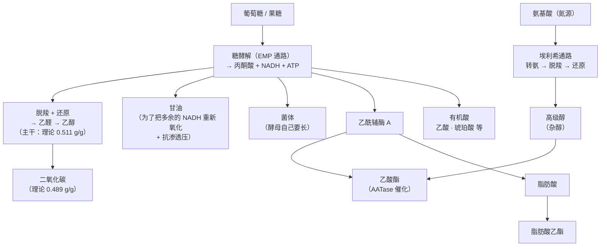
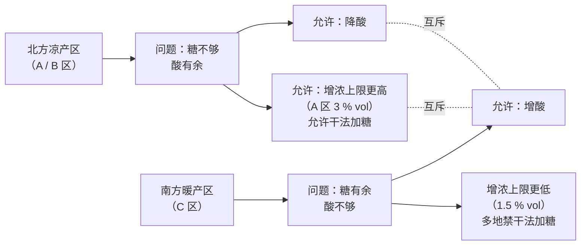

# 第 3 章 酒精发酵：从糖到乙醇，以及一堆副产物

> **本章目标**：把第 1 章那张"物质清单"补上**来源**。
> 糖变成乙醇只是这笔账的主干；真正决定风格的，是**碳去了哪些支路**——
> 甘油、高级醇、酯、乙酸、二氧化碳各分走了多少。
>
> 学完这一章，你能做三件事：**算一笔发酵的碳账**、
> **知道甘油到底给了什么感受（这一章终于有原文结论了）**、
> 以及**读懂法规允许酿酒师在这笔账上动哪些手脚**。

> **适度饮酒，未成年人不饮酒，酒后不驾车。** 本章的 🅐 实操全部不需要开瓶。

## 3.1 先把总账摊开：碳去哪了

第 1 章推过化学计量：一分子葡萄糖 → 两分子乙醇 + 两分子二氧化碳，
理论质量产率 `2 × 46.07 / 180.16 ≈ 0.511`。剩下的 0.489 全部是二氧化碳。

但**酵母不是一台只产乙醇的机器**。它还要长自己、还要平衡氧化还原、还要处理氮源，
于是碳被分到好几条支路上：



> **这张图是本书第三部分（酿造工艺）的骨架。**
> 后面讲"为什么这支酒有香蕉味""为什么这支酒更热"，
> 答案基本都是"**碳在这张图上走了哪条支路、走了多少**"。

### 一个你可以自己算的数：发酵会放出多少二氧化碳

这个计算有实际用处（下面会说为什么），而且只需要初中化学。

假设一批葡萄汁的糖是 **200 g/L**，全部发酵完：

```
理论 CO₂ 质量 = 200 g/L × 0.489 ≈ 97.8 g/L
物质的量       = 97.8 ÷ 44.01 ≈ 2.22 mol/L
20 ℃、101.325 kPa 下的摩尔体积 = RT/P = 8.314 × 293.15 ÷ 101325 ≈ 24.05 L/mol
体积           = 2.22 × 24.05 ≈ 53 L
```

也就是说：**每升葡萄汁大约放出 50 升上下的二氧化碳气体**
（实际略低于这个理论上限，因为部分碳去了菌体与副产物）。

一个 10 000 L 的发酵罐，整个发酵期间要放出**约五十万升气体**。

> **这就是酒窖里最真实的安全问题**：二氧化碳比空气重，会在**地面附近积聚**。
> 发酵季进入酒窖、尤其进入**罐体、地坑、地下酒窖**，是有实际窒息风险的作业，
> 需要通风与监测。本书不写作业规程，但你应当知道**这个数字有多大**——
> 参观酒庄时看到"发酵区禁止单独进入"的标识，它不是装饰。

## 3.2 甘油：氧化还原要平账，才有它

### 它为什么必然存在

糖酵解过程中会产生 **NADH**，而乙醇发酵的最后一步（乙醛 → 乙醇）正是用来把 NADH 变回 NAD⁺ 的。
理论上这笔账应该刚好平——但**酵母合成菌体时会额外产生 NADH**，
于是多出来的那部分必须找别的出口。

出口就是**甘油**：通过甘油-3-磷酸脱氢酶（Gpd1p / Gpd2p）把磷酸二羟丙酮还原，
消耗掉一分子 NADH。有研究直接验证了这条逻辑：在缺氧（呼吸能力缺失）条件下，
酵母细胞**严格依赖 Gpd2p 这个同工酶**来维持生长，
而补加乙偶姻（acetoin，另一个 NADH 的去处）可以逆转这种抑制[^1]。

甘油还有第二个角色：**渗透压保护剂**。高糖葡萄汁对酵母是一个高渗环境。

代谢工程的研究给了这笔账一个量级：在酵母生产乙醇的过程中，
**约有 4~5 % 的碳源被用于生成甘油**[^2]。

> **诚实说明**：这个 4~5 % 来自**工业乙醇发酵**语境的综述性陈述，
> 不是专门针对葡萄酒发酵测的。葡萄酒的甘油浓度个案见第 1 章 §1.1
> （同一菌株在霞多丽 8.1 g/L、在西拉 14.9 g/L，差异很大）。
> **本书只用它说明"甘油是主干反应的必然伴生物，量级在百分之几"，不当精确值。**

[^1]: [氧化还原平衡](../../glossary.md#redox-balance)（redox balance）——酵母必须让 NADH/NAD⁺ 收支相抵，这是甘油存在的根本原因。
[^2]: [甘油](../../glossary.md#glycerol)（glycerol），词条见术语表。

### 甘油到底给了什么感受：三篇原文，一个不完全一致的答案

第 1 章留了一个明确的欠账：甘油的感官研究"题录已核、结论未读"。
**本章补上了。** 三项研究的原文结论如下——请注意它们**并不完全一致**，
这恰恰是本书要展示的东西。

| 研究 | 做了什么 | 结论 |
|------|---------|------|
| **Noble & Bursick 1984**（*Am. J. Enol. Vitic.*）| 8 名受训评价员，配对比较法，在一款干型酒中测**甜度**与**黏度**的差别阈 | 要让甜度**可被察觉地提高**，需要加 **5.2 g/L** 甘油；这一加量只把黏度提高 **0.037 mPa·s**。而用无味的黄原胶单独测出的**黏度差别阈是 0.141 mPa·s**——要靠甘油达到这个增量需要加 **25.8 g/L**。因此在酒中常见的 **1.0~9.0 g/L** 范围内，**甘油的主要感官贡献是甜，不是黏度** |
| **Gawel & Waters 2008**（*J. Wine Research*）| 先用**匙羹藤（*Gymnema sylvestre*）**与甜味等化两种方法**把甘油的甜味屏蔽掉**，再做配对比较 | 屏蔽甜味后，**加入 6 g/L 甘油并没有提高干白的口中黏度感**。作者的结论是：**不能靠提高甘油来增强干白的口感黏度** |
| **Gawel、Van Sluyter & Waters 2007**（*Aust. J. Grape Wine Res.*）| 三款雷司令，把甘油调到 5.2 / 7.2 / 10.2 g/L、酒精调到 11.6 / 12.6 / 13.6 % vol，9 种组合交叉，受训评价组打分 | **酒精升高 → 热感升高（三款酒全部如此）**，body 与感知黏度升高（三款中的两款）。**甘油的效应不一致**（只在三款中的一款上分别显示出黏度/body 提高）；但 10 g/L 的平均黏度评分在**所有酒、所有酒精水平**下都高于 5 g/L，作者因此认为干白之间常见的甘油差异**可能**影响感知黏度。**酒精和甘油都没有一致地影响甜度、酸度、香气或风味强度** |

把三条放在一起，可以得到一个**可以负责任地说出口**的结论：

> **① "甘油让酒变稠"这个强主张不成立。**
> 1984 年的研究给了量化理由（要 25.8 g/L 才够到黏度差别阈，而酒里常见的是 1~9 g/L）；
> 2008 年的研究在**屏蔽甜味**之后直接没测到效应。
>
> **② "甘油贡献甜"有直接证据（1984），但没有被 2007 年的研究复现。**
> 1984 年测的是**差别阈**（加多少才察觉得到变化），
> 2007 年测的是**评分强度**（在给定的三个水平上打分）——**这是两种不同的问题**，
> 所以结论不一致并不必然是矛盾。本书据此把它标为 **⚠️ 有争议**。
>
> **③ 酒精的效应是三项研究里最稳的那个**：
> 酒精升高 → 热感升高（2007 年三款酒全部成立），
> 加上第 1 章的黏度实测（水基 0.89~0.92 → 红酒 1.53~1.57 mPa·s）。
> **在"甘油"和"酒精"两个解释之间，仍然先信酒精。**

还有一条值得单独摘出来的观察（2007 年那项研究）：

> **"body"这个词，在多数品评者那里是由"风味强度"和"感知黏度"共同撑起来的；
> "热感"不是 body 的重要成分；而"酸度"在 body 感知中的角色因人而异。**
>
> 这直接印证了第 1 章的做法：**body 是印象，不是物质**，需要精确时就拆开说。

## 3.3 高级醇：氮代谢的副产品

酵母利用氨基酸作氮源时，走的是 **埃利希通路（Ehrlich pathway）**[^3]：
**氨基酸经转氨 → α-酮酸 → 脱羧 → 还原 → 高级醇**（也叫杂醇）。
被"抠"下来的氨基用于同化反应，剩下的碳骨架就变成了各种脂肪族与芳香族的**杂醇代谢物**。

典型产物与它们在酒里的角色：

| 高级醇 | 来自哪个氨基酸 | 气味印象 |
|--------|--------------|---------|
| 异戊醇（3-甲基-1-丁醇）| 亮氨酸 | 指甲油 / 溶剂样，高浓度刺鼻 |
| 活性戊醇（2-甲基-1-丁醇）| 异亮氨酸 | 同类 |
| 异丁醇（2-甲基-1-丙醇）| 缬氨酸 | 同类 |
| **2-苯乙醇** | 苯丙氨酸 | **玫瑰 / 蜂蜜**——高级醇里少数被普遍视为正面的 |

> **一个关键的因果方向**：高级醇是**氮代谢**的产物，不是糖代谢的直接产物。
> 所以**葡萄汁里的氮状况会直接改写酒的香气谱**——这就是下一节的内容。

[^3]: [埃利希通路](../../glossary.md#ehrlich-pathway)（Ehrlich pathway）与[高级醇](../../glossary.md#higher-alcohol)（higher alcohols / fusel alcohols）。

## 3.4 酯：两个家族，"果味"的主要来源

**酯**[^4]是年轻酒果香的主要化学载体，分两个家族：

| 家族 | 怎么形成 | 代表 | 印象 |
|------|---------|------|------|
| **乙酸酯** | 乙酰辅酶 A + 高级醇，由**醇乙酰基转移酶（AATase，主要由 *ATF1* 编码）** 催化 | **乙酸异戊酯**、乙酸乙酯、乙酸苯乙酯 | 香蕉、梨、指甲油（乙酸乙酯过量时）|
| **脂肪酸乙酯** | 中链脂肪酸 + 乙醇 | 己酸乙酯、辛酸乙酯 | 苹果、菠萝、一般性"果味" |

一项 2023 年的综述总结了**乙酸酯生成的控制因素**：
**不饱和脂肪酸、前体供应、氮的比例、氧气**都会影响 AATase 的反应。

关于量级，有一个可引用的参考点：一篇 2025 年的综述转引的文献统计显示，
**干白葡萄酒中 3-甲基丁基乙酸酯（乙酸异戊酯）的平均含量约 2235 µg/L（n = 31）**。

> **诚实说明**：这是**转引的统计平均**，不是本书核到原始数据的"典型区间"。
> 按第 1 章的纪律，本书用它说明**量级（每升微克到毫克之间）**，不当典型值使用。

酯还有一个必须知道的性质：**它们不稳定**。酯化与水解是可逆的，
瓶中储存会让酯的组成随时间漂移——这就是"年轻酒的果香会淡去"的化学基础（第 18 章）。

[^4]: [酯](../../glossary.md#ester)（esters），葡萄酒果香的主要化学载体。

## 3.5 氮：决定发酵能不能走完，也决定香气长什么样

葡萄汁里能被酵母利用的氮叫 **可同化氮（YAN）**[^5]，主要是铵盐和游离氨基酸。

它是一个**双向**的变量：

- **不足** → 发酵变慢甚至**中止（stuck fermentation）**[^6]，
  还会促使酵母产生**硫化氢（H₂S，臭鸡蛋味）**。
  一项在苹果酒发酵中的研究直接把 YAN 浓度与 H₂S 产生和酵母基因表达联系起来。
- **过量或补加时机不当** → 改变高级醇与酯的比例，也就是改变香气谱。
  一项在 Moschofilero 上的研究显示，不同 YAN 水平下**乙酸酯、芳樟醇、橙花醇**的表现都不同。

**需求量因菌株而异**，差别可以很大：一项代谢组学研究比较了同一株商业酵母在
**433 mg/L（高）与 55 mg/L（低）YAN** 下的表现，两种条件下的菌体与代谢轮廓明显不同。

> **本书不给"YAN 应当是多少"的推荐值。**
> 一是它随菌株、糖度、温度变化；二是那属于酿造作业指导，不属于本书范围。
> 你只需要带走这条因果：**葡萄园的氮状况 → 葡萄汁的 YAN → 发酵能否完成 + 香气谱**。
> 这条链子在第 11 章（葡萄园管理）会再出现一次。

[^5]: [可同化氮](../../glossary.md#yan)（yeast assimilable nitrogen, YAN）。
[^6]: [发酵中止](../../glossary.md#stuck-fermentation)（stuck fermentation）。

## 3.6 温度：一个被当成信条、但被实验捅了一刀的变量

"白葡萄酒要低温发酵才能留住果香"几乎是行业共识。它也确实有物理依据
（低温减少挥发损失、减慢反应）。但**当有人真的去做对照实验时，结果比信条复杂**。

2017 年发表在 *J. Agric. Food Chem.* 的研究，用**两批马尔堡长相思葡萄汁**、
**四株酿酒酵母**，在 **12.5 ℃ 与 25 ℃** 下发酵，定量了 32 个香气化合物：

- **化学上确有差异**：14 个化合物驱动了差异。12.5 ℃ 的酒
  **3-巯基己醇（3MH）与高级醇更低**，但**果味的乙酸酯更高**；
- **感官上**：评价组在 **75 % 的酒对里没有测到"果味"的显著差异**；
- 在剩下 **25 %** 有显著差异的酒对里，**25 ℃ 发酵的酒反而更果味**，
  并且高果味与 **3MH** 相关；
- 作者的结论是：低温发酵的好处**可能不是"更果味"，而是"果味与青味之间更好的平衡"**；
  而且既然 75 % 的酒没有显著差异，**适当提高发酵温度或许可以在不损害品质的前提下降低能耗**。

> **这项研究值得记住的不是温度，而是它的结构**：
> **化学差异是真的，感官差异在多数情况下没测出来。**
> 这是酒类信息里最常见的一个跳跃——
> **"成分变了"被直接说成"喝起来变了"**，中间那一步其实需要感官实验来证明。
>
> ⚠️ 同时不要反向过度解读：这是**一个品种、两批汁、四株酵母**的结果，
> 不能推广成"发酵温度无所谓"。

## 3.7 法规允许在这笔账上动多少手脚

前面几节讲的是酵母干了什么。这一节讲的是**人被允许干什么**——
而这部分是**有原文可查的硬数字**。

欧盟 (EU) No 1308/2013 的 **Annex VIII Part I** 规定了三件事：**增浓、增酸、降酸**。
以下是本书读取法规原文后的复述。

### A. 增浓（enrichment，俗称"加糖"）

**可以提高多少**（按种植区）：

| 种植区 | 自然酒精度可提高的上限 |
|--------|---------------------|
| A 区 | **3 % vol** |
| B 区 | **2 % vol** |
| C 区（各 C 区） | **1.5 % vol** |

气候特别不利的年份，成员国可申请把上限**再提高 0.5 %**（需委员会批准）。

**允许用什么手段**：

- 对**鲜葡萄、发酵中的葡萄汁、仍在发酵的新酒**：加**蔗糖**、浓缩葡萄汁或精馏浓缩葡萄汁；
- 对**葡萄汁**：同上，或**部分浓缩（含反渗透）**；
- 对**葡萄酒**：只能**冷冻部分浓缩**。

**"干法加糖"（dry sugaring）的地理限制**——这条最有意思：

> 加蔗糖只允许在 **A 区、B 区**，以及 **C 区中除以下地方之外**的区域：
> **希腊、西班牙、意大利、塞浦路斯、葡萄牙**，
> 以及法国这几个上诉法院辖区内的葡萄园：
> **Aix-en-Provence、Nîmes、Montpellier、Toulouse、Agen、Pau、Bordeaux、Bastia**。
> 但法规同时写明：在上述**法国**辖区，国家主管机关**可以作为例外予以授权**
> （并须通知委员会与其他成员国）。

**其他限量**：

- 加浓缩葡萄汁/精馏浓缩葡萄汁**不得使初始体积增加**超过：A 区 11 %、B 区 8 %、C 区 6.5 %；
- 浓缩处理**不得使体积减少超过 20 %**，且**不得使自然酒精度提高超过 2 % vol**；
- **增浓后的总酒精度上限**：

| 种植区 | 增浓后总酒精度上限 | 红葡萄酒的例外 |
|--------|-----------------|--------------|
| A 区 | **11.5 % vol** | 可提至 **12 % vol** |
| B 区 | **12 % vol** | 可提至 **12.5 % vol** |
| C I 区 | **12.5 % vol** | — |
| C II 区 | **13 % vol** | — |
| C III 区 | **13.5 % vol** | — |

（另有一条：成员国可为生产**带原产地名称**的酒另行确定更高的上限。）

### B. 增酸与降酸

| 操作 | 上限（以酒石酸计） | 等价的 meq/L |
|------|-----------------|-------------|
| **葡萄酒以外的产品**增酸 | **1.50 g/L** | 20 meq/L |
| **葡萄酒**增酸 | **2.50 g/L** | 33.3 meq/L |
| **葡萄酒**降酸 | **1 g/L** | 13.3 meq/L |

允许的地理范围也不同：降酸在 A、B、C I 区；增酸与降酸在 C I、C II、C III(a) 区；
只增酸在 C III(b) 区。气候特殊的年份，A、B 区也可获授权增酸。

### C. 两条互斥规则（最能说明立法逻辑）

> **① 增酸与增浓互相排斥**（除非委员会以授权法案给出豁免）。
> **② 对同一个产品，增酸与降酸互相排斥。**



> **看懂这张图，你就看懂了欧洲酒法的一条基本逻辑**：
> **法规不是在规定"好酒该是什么样"，而是在按气候分配"允许纠正多少"。**
> 北边缺糖就多给一点增浓额度，南边缺酸就给增酸额度，
> 但**不许同时两头补**——否则"产地"这个概念就没有约束力了。
>
> 这条逻辑到第四部分（产区与酒标法规）会反复用到。

## 3.8 常见说法辨析

按本书约定标注**证据强度**：✅ 有共识 / ⚠️ 有争议 / ❌ 明确错误 / 缺乏证据。

| 说法 | 判定 | 说明 |
|------|------|------|
| "糖 100 % 变成了酒精" | ❌ **明确错误** | 化学计量的理论上限就只有 **0.511 g 乙醇/g 糖**，另外 0.489 是二氧化碳；而且碳还要分给菌体、甘油（约 4~5 % 的碳源）、有机酸、高级醇与酯 |
| "甘油多所以酒稠" | ❌ **明确错误（强主张不成立）** | 黏度差别阈约 **0.141 mPa·s**，靠甘油达到需加 **25.8 g/L**，而酒中常见的是 **1.0~9.0 g/L**（Noble & Bursick 1984）；屏蔽甜味后加 **6 g/L** 甘油**未提高**干白的感知黏度（Gawel & Waters 2008）|
| "甘油带来甜感" | ⚠️ **有争议（但比'稠'靠谱）** | 1984 年测到甜度**差别阈**在 **+5.2 g/L**，并认为在常见浓度下甘油的主要贡献就是甜；但 2007 年的雷司令研究中**酒精与甘油都没有一致地影响甜度评分**。两者测的问题不同（差别阈 vs 强度评分），本书并列 |
| "酒精只是让人上头，不影响口感" | ❌ **明确错误** | 2007 年的研究里，**酒精升高使三款酒的热感全部升高**，并在其中两款上提高了 body 与感知黏度；加上第 1 章的黏度实测数据 |
| "body 就是黏度" | ⚠️ **不准确** | 同一研究发现：多数品评者的 "body" 由**风味强度**与**感知黏度**共同构成；**热感不是 body 的重要成分**，酸度的角色**因人而异** |
| "低温发酵一定更果味" | ⚠️ **有争议** | 一项长相思对照实验（12.5 ℃ vs 25 ℃，4 株酵母）：**化学上确有差异**，但感官组在 **75 %** 的酒对里没测到果味差异；剩下 25 % 里**反而是 25 ℃ 的更果味**。作者提出低温的好处可能在于**果味与青味的平衡** |
| "香蕉味是加了香精" | ❌ **明确错误（在合法葡萄酒里）** | 香蕉样气味的主要责任分子是**乙酸异戊酯**，由酵母的**醇乙酰基转移酶**从乙酰辅酶 A 和异戊醇合成，是发酵的正常产物（第 4 章会讲怎么区分"能被酿出来的香气"与"不能的"）|
| "欧洲不许加糖，加糖的都是劣质酒" | ❌ **明确错误** | (EU) No 1308/2013 Annex VIII 明确允许增浓，并按种植区给了不同上限（A 区 3 %、B 区 2 %、C 区 1.5 % vol）。真正被限制的是**干法加糖的地理范围**（希腊、西班牙、意大利、塞浦路斯、葡萄牙及法国若干上诉法院辖区被排除，其中法国辖区可由国家主管机关例外授权）|
| "加酸是造假" | ❌ **明确错误** | 增酸同样是法定允许的酿酒操作，有明确上限（葡萄酒 **2.50 g/L**，以酒石酸计），并且**与增浓互斥**。它是暖产区的常规工具 |
| "酒精度越高说明酿酒师越会酿" | ❌ **明确错误** | 酒精度主要是**采收时糖度**的后果（第 1 章 §1.4 的换算），再叠加法规允许的增浓额度。它是**风格与气候**信息，不是技艺信息 |
| "发酵罐边上闻闻很香，没什么危险" | ❌ **明确错误（且危险）** | 按化学计量，200 g/L 糖的葡萄汁每升可放出约 **50 L** 二氧化碳；CO₂ 比空气重、在低处积聚。这是需要通风与监测的作业环境 |
| "酵母只管把糖变成酒，香气都来自葡萄" | ❌ **明确错误** | 高级醇来自**氮代谢**（埃利希通路），乙酸酯由酵母酶催化生成，某些品种硫醇**必须靠酶解才能从前体释放**（第 4 章）。发酵是香气的**生产环节**之一，不只是转化环节 |

## 3.9 思考题

1. 为什么理论上 1 g 糖最多只能产生 0.511 g 乙醇？剩下的 0.489 g 去了哪里？
   请用这个数字估算：一批 220 g/L 糖的葡萄汁完全发酵，每升大约放出多少升二氧化碳
   （写出你的假设与计算过程）。
2. 甘油为什么"必然"会产生？请从**氧化还原收支**的角度解释，
   并说明它的第二个生理作用是什么。
3. 现在本书已经读到了三篇甘油感官研究的结论。请用**两句话**分别回答：
   ①"甘油让酒变稠"能不能说？②"甘油带来甜感"能不能说？
   并说明这两个答案的**证据强度为什么不一样**。
4. 高级醇来自哪条通路、以什么为原料？为什么说"葡萄园的氮状况会改写酒的香气"？
5. 一位酿酒师说："我把发酵温度从 25 ℃ 降到 12.5 ℃，所以我的长相思更果味。"
   请指出这句话里哪一步是**化学事实**、哪一步是**尚未被证明的推断**，
   并说明那项对照实验实际测到了什么。
6. **【案例】** 某进口商的产品页写着：
   *"南意大利产区，传统干法加糖工艺提升糖度，自然发酵不加任何酸，
   甘油含量高达 12 g/L 带来丝滑稠厚口感，酒精度 15 % vol 体现酿造功力。"*
   请指出其中**至少五处**与本章内容矛盾或缺乏证据的地方，
   并写出你会向对方追问的三个问题。
7. **【案例】** 两支同产区、同年份的干白，技术资料如下：
   甲：酒精 12.0 % vol、甘油 9.5 g/L；乙：酒精 13.8 % vol、甘油 6.0 g/L。
   某销售说"甲的甘油更高，所以口感更厚"。
   请根据本章三项研究的结论，判断这句话站不站得住，并说明**你预期哪一支口感更重、为什么**。
8. **【查证】** 去查 (EU) No 1308/2013 的 **Annex VIII Part I**，
   回答：① 你所关心的某个国家属于哪个种植区（提示：种植区的地理界定在 Annex VII 的附录里）？
   ② 该区的增浓上限是多少？③ 该区允许干法加糖吗？
   如果查不到，请如实记录你卡在哪一步。

> 📖 **参考答案**（想清楚再看）：[Q1](../../qa/03-alcoholic-fermentation-qa.md#q1) ·
> [Q2](../../qa/03-alcoholic-fermentation-qa.md#q2) · [Q3](../../qa/03-alcoholic-fermentation-qa.md#q3) ·
> [Q4](../../qa/03-alcoholic-fermentation-qa.md#q4) · [Q5](../../qa/03-alcoholic-fermentation-qa.md#q5) ·
> [Q6](../../qa/03-alcoholic-fermentation-qa.md#q6) · [Q7](../../qa/03-alcoholic-fermentation-qa.md#q7) ·
> [Q8](../../qa/03-alcoholic-fermentation-qa.md#q8)

## 3.10 本章实操

🅐 档**全部不需要开瓶喝酒**。

### 🅐 无器具版 · 任务一：做一次完整的碳账估算

挑一支你手边有技术资料（或酒标上有酒精度）的酒，填下表。
所有计算都只用本章和第 1 章给过的系数。

| 步骤 | 公式 | 我的数字 |
|------|------|---------|
| ① 标示酒精度 | 从酒标读 | ____ % vol |
| ② 乙醇质量浓度 | % vol × 7.89 g/L | ____ g/L |
| ③ 理论最低糖量 | ② ÷ 0.511 | ____ g/L |
| ④ 按经验值估的实际糖量 | % vol × 16~18 g/L（**经验值**，见第 1 章）| ____ ~ ____ g/L |
| ⑤ 理论 CO₂ 质量 | ④ × 0.489 | ____ g/L |
| ⑥ 理论 CO₂ 体积（20 ℃）| ⑤ ÷ 44.01 × 24.05 | ____ L/L |

然后回答：

- ③ 和 ④ 差了多少？**这个差额去了哪里**（至少说出三条支路）？
- 如果这支酒来自 C 区且用足了增浓额度（1.5 % vol），
  那么**葡萄本身**的糖大约是多少？（用 ④ 的方法倒推）
- ⑥ 的数字乘以一个 5 000 L 的罐，是多少立方米气体？

### 🅐 无器具版 · 任务二：读一段法规，把它翻译成一句人话

打开 (EU) No 1308/2013 的 **Annex VIII Part I**（法规原文在多个官方渠道可读，
本书使用的抓取路径见[出处与资料登记](../../standards.md)的抓取说明），
找到 **Section A 第 2 点**和 **Section C 第 2~4 点**，填下表：

| 我读到的条款 | 原文写了什么数字 | 翻译成一句人话 |
|------------|---------------|--------------|
| Annex VIII Part I, A.2 | | |
| Annex VIII Part I, C.2 | | |
| Annex VIII Part I, C.3 | | |
| Annex VIII Part I, C.4 | | |

> **这个任务的价值**：法规原文读起来比想象中容易——
> 它通常就是"谁、可以做什么、上限是多少、在哪里"。
> 读过一次之后，你对"某某产区必须如何如何"这类说法的默认反应会变成"**条款号是多少**"。

### 🅐 无器具版 · 任务三：给三句话做"证据强度"分级

下面三句话都能在市面上见到。请分别判定它们属于
**事实 / 法规规定 / 行业惯例 / 缺乏证据**哪一层，并写出你的理由与需要的证据。

| 句子 | 我的分级 | 理由 / 我需要什么证据才能确认 |
|------|---------|--------------------------|
| "这支酒的甘油有 10 g/L，所以特别稠" | | |
| "我们是 C 区，增浓上限 1.5 % vol，所以不可能靠加糖做到 15 度" | | |
| "我们坚持低温发酵，所以果味更足" | | |

> 提示：三句话分别对应本章的 §3.2、§3.7、§3.6，
> 而且**三句话的判定结果各不相同**——这正是这道题的用意。

### 🅑 有条件版 · 任务四：同产区两支酒的"酒精 vs 甘油"对照（备齐后再做）

**所需**：同产区、同年份、同类型（都是干白或都是干红）的**两支酒**，
其中**一支酒精度明显更高**（相差至少 1.5 % vol）；两只**同款**杯子；
[品鉴记录表](../../forms/tasting-note.md)。

**适度饮酒，未成年人不饮酒，酒后不驾车。** 每杯 20~30 mL 足够完成记录，两杯合计不足一两。

| 观察项 | A（低酒精） | B（高酒精） | 差异 |
|-------|-----------|-----------|------|
| 标示酒精度 | | | |
| 技术资料上的甘油（若有） | | | |
| 热感 / 灼烧感（1~5） | | | |
| 感知黏度（1~5） | | | |
| body（1~5） | | | |
| 甜感（1~5） | | | |
| 我认为 body 的差异主要由什么造成 | | | |

> **对照 2007 年那项研究的结论再看一遍你的表**：
> 它在三款雷司令上都测到"酒精 ↑ → 热感 ↑"，但 body 与黏度只在三款中的两款上成立。
> **如果你的观察和它不一致，那不代表你错了**——
> 你只做了一次、一对样本、非盲测。请把这三个局限写在表格下面。
> **知道自己这次测量的局限在哪，比结论本身更值钱。**

## 3.11 🔎 买酒与点酒时的用处

1. **看到酒精度，先在心里换算成糖**：`% vol × 16~18 g/L`（经验值）。
   15 % vol 意味着采收时糖在每升两百四五十克的量级——
   这告诉你**气候、成熟度、采收时机**，比任何形容词都实在。
2. **"甘油丰富"这句话可以直接降权**。三项研究读下来，
   它对"稠"的贡献在常见浓度下测不出来；对"甜"的贡献有争议。
   **真正抬起 body 与热感的是酒精。**
3. **不要把"加糖"当贬义词**。它是法定允许的操作，有上限、有地理限制。
   值得问的是"**你们在哪个区、用了多少额度**"，而不是"有没有加"。
4. **暖产区看"有没有增酸"，凉产区看"有没有增浓"**——
   而且**两者互斥**。如果有人同时宣称两样都做了，那要么是口误，要么该追问。
5. **"低温发酵"是工艺描述，不是品质承诺**。
   它有物理依据，但已发表的对照实验显示感官差异在多数情况下没被测到。
   听到它只需记下"这是一个工艺选择"，不必加分。
6. **技术资料里最值钱的三项**：酒精度、残糖、总酸（以什么计）。
   甘油、"陈酿天数"、"手工采摘"这些要么不影响你的感受，要么无法核查。
   **把注意力放在能核查的那三项上。**

## 3.12 本章依据

### A. 已核对原文的法规（最硬）

- **(EU) No 1308/2013 Annex VIII Part I**——增浓、增酸、降酸：
  增浓上限（A 区 3 %、B 区 2 %、C 区 1.5 % vol，恶劣年份可再加 0.5 %）；
  允许的增浓手段与各自的适用对象；干法加糖的地理排除名单与法国的例外授权条款；
  浓缩葡萄汁加入量的体积上限（11 % / 8 % / 6.5 %）；浓缩不得减容超过 20 %、
  不得提高自然酒精度超过 2 % vol；增浓后总酒精度上限
  （A 11.5、B 12、C I 12.5、C II 13、C III 13.5 % vol，红葡萄酒在 A、B 区的例外）；
  增酸上限（非葡萄酒产品 1.50 g/L = 20 meq/L；葡萄酒 2.50 g/L = 33.3 meq/L）；
  降酸上限（1 g/L = 13.3 meq/L）；增酸与增浓互斥、增酸与降酸互斥。

### B. 已核对摘要或数据段的同行评议文献

- **甘油与甜度/黏度的差别阈**：Noble, A. C.; Bursick, G. F. "The Contribution of Glycerol to
  Perceived Viscosity and Sweetness in White Wine", *Am. J. Enol. Vitic.* **35** (1984) 110–112
  （甜度差别阈需 +5.2 g/L；该加量使黏度升高 0.037 mPa·s；黄原胶测得的黏度差别阈 0.141 mPa·s；
  以甘油达到该增量需 +25.8 g/L；在酒中常见的 1.0~9.0 g/L 范围内主要贡献是甜）。
- **屏蔽甜味后甘油对黏度无效**：Gawel, R.; Waters, E. J. *Journal of Wine Research* **19**
  (2008) 109–114（用 *Gymnema sylvestre* 与甜味等化屏蔽甜味后，+6 g/L 甘油未提高感知黏度）。
- **乙醇与甘油对 body 的影响**：Gawel, R.; Van Sluyter, S.; Waters, E. J.
  *Aust. J. Grape Wine Res.* **13** (2007) 38–45（三款雷司令 × 3 甘油水平 × 3 酒精水平；
  酒精升高使三款酒热感全部升高、两款 body 与黏度升高；甘油效应不一致但 10 g/L 的平均黏度评分
  在所有条件下高于 5 g/L；酒精与甘油均未一致影响甜度/酸度/香气；"body" 主要由风味强度与
  感知黏度构成，热感不是其重要成分，酸度的作用因人而异）。
- **甘油生成的氧化还原逻辑**：Pahlman 等，*J. Biol. Chem.* **279** (2004) 39677–39685
  （缺氧下细胞严格依赖 Gpd2p；补加乙偶姻可逆转抑制）。
- **甘油分走的碳比例**：Navarrete, C.; Nielsen, J.; Siewers, V. *AMB Express* **4** (2014) 86
  （引言："约 4~5 % 的碳源被用于生成甘油"）。⚠️ 语境为工业乙醇发酵。
- **埃利希通路**：Hazelwood 等，"The Ehrlich pathway for fusel alcohol production: a century of
  research on *Saccharomyces cerevisiae* metabolism", *Appl. Environ. Microbiol.* **74** (2008)
  2259–2266；通路描述另参一篇 2025 年 *Biotechnology Advances* 综述的摘要
  （氨基酸转氨为 α-酮酸、释出的氨用于同化反应、剩下的碳骨架成为杂醇代谢物）。
- **乙酸酯的生成与控制**：一篇 2023 年 *J. Biosci. Bioeng.* 的综述
  （AATase 从乙酰辅酶 A 与相应醇合成；受不饱和脂肪酸、前体、氮比例与氧气影响）。
- **乙酸异戊酯的含量量级**：一篇 2025 年 *Foods* 综述转引的统计
  （干白平均约 2235 µg/L，n = 31）。⚠️ **转引**。
- **YAN 的影响**：一项 2020 年 *Front. Microbiol.* 的苹果酒研究（YAN 与 H₂S 及基因表达）；
  一项 2023 年 *J. Agric. Food Chem.* 的 Moschofilero 研究（不同 YAN 下乙酸酯、芳樟醇、橙花醇的变化）；
  一项 2024 年 *Food Microbiology* 的代谢组学研究（同一菌株在 433 vs 55 mg/L YAN 下的差异）。
- **发酵温度的对照实验**：Deed 等，"Influence of Fermentation Temperature, Yeast Strain, and
  Grape Juice on the Aroma Chemistry and Sensory Profile of Sauvignon Blanc Wines",
  *J. Agric. Food Chem.* (2017)（12.5 ℃ vs 25 ℃，4 株酵母，32 个香气化合物；
  75 % 酒对感官无显著果味差异；有差异的 25 % 中 25 ℃ 更果味且与 3MH 相关）。

### C. 本章有意留白的地方

- **糖 → 酒精的实际转化系数**：本书仍只写"**经验值每升十六到十八克糖对应 1 % vol**"，
  因为尚未核到可引用的一手定义（法规只规定增浓的**结果上限**，不规定换算系数）。
- **YAN 的推荐值**、**发酵温度的推荐区间**：属于作业指导，且随菌株与原料变化，本书不给。
- **甘油对甜感的贡献**：两项研究结论不一致，本书并列而不裁决。

以上每一条的完整题录、DOI 与核对状态，见[出处与资料登记](../../standards.md)。

---

**下一章**：第 4 章 香气的三个来源——品种香、发酵香、陈年香。
本章讲了发酵造出了什么，下一章要回答一个买酒时非常实用的问题：
**一个香气词属于哪一层？这决定了它能不能被工艺"造"出来，也决定了它值多少钱。**
