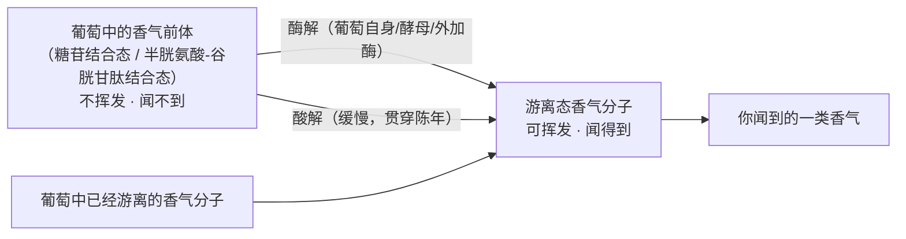
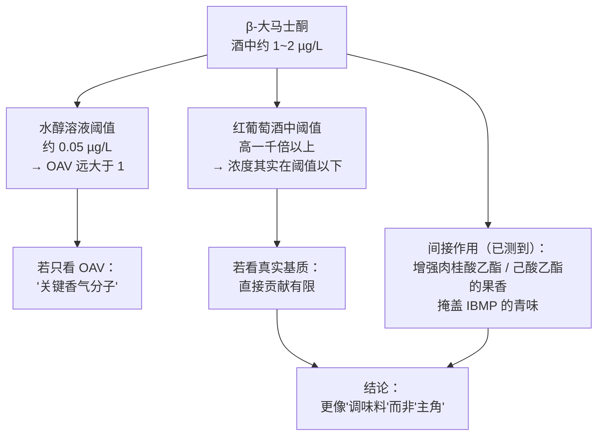
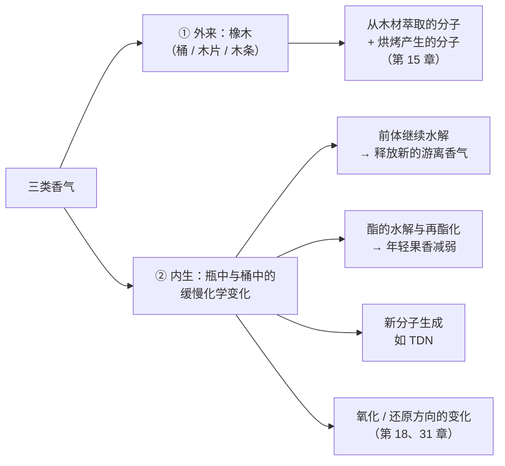
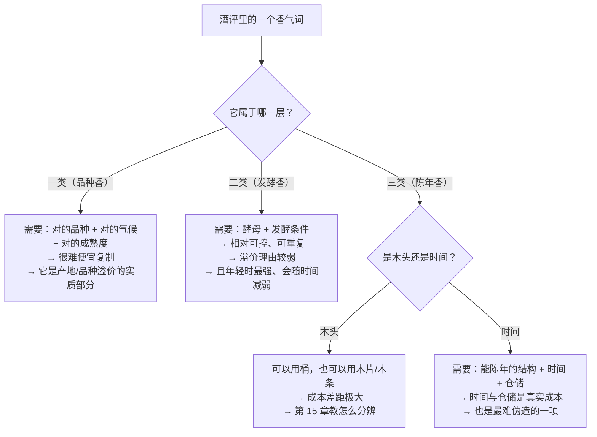

# 第 4 章 香气的三个来源：品种香、发酵香、陈年香

> **本章目标**：给每一个香气词找到**户口**——它来自葡萄、来自发酵，还是来自陈年？
>
> 这件事听起来像分类学练习，其实是全书**最省钱的一章**：
> 因为**一个香气能不能被工艺便宜地造出来**，直接决定了它值不值那个价。
>
> 本章还会用一个分子（β-大马士酮）把第 1 章的"基质效应"讲到底：
> **同一个分子，换个介质，阈值能差一千倍以上。**

> **适度饮酒，未成年人不饮酒，酒后不驾车。** 本章的 🅐 实操全部不需要开瓶。

## 4.1 先说清楚：三层分类是教学约定，不是化学定律

行业和教材习惯把葡萄酒香气分成三层：

| 层 | 通称 | 来源 |
|----|------|------|
| **一类** | **品种香 / 初级香气**[^1] | 葡萄本身（含以结合态存在的**香气前体**）|
| **二类** | **发酵香 / 次级香气**[^2] | 酒精发酵与苹果酸乳酸发酵中由微生物生成 |
| **三类** | **陈年香 / 三级香气**[^3] | 木桶熟成与瓶中陈年过程中生成或转化 |

这套分层很好用，但**它的边界是模糊的**，而且模糊得很有规律。本章会给出三个反例：

1. **品种硫醇**在葡萄里以**谷胱甘肽/半胱氨酸结合态**存在，
   **必须靠酶解才能释放**——它算一类还是二类？
2. **单萜**在葡萄里大量以**糖苷结合态**存在，游离态只是一部分；
   陈年中糖苷会继续水解，释放出新的游离香气——那它是一类还是三类？
3. **TDN** 的前体在葡萄里（受日照影响），但分子本身**主要在瓶中陈年时生成**。

> **所以本书的用法是**：把三层当成**"这个香气的产生需要什么条件"**的速记，
> 而不是当成互斥的抽屉。真正要回答的问题始终是那一个：
> **这个香气，需要特定的葡萄吗？还是换个酵母、加块木头就能有？**

[^1]: [品种香 / 一类香气](../../glossary.md#varietal-aroma)（varietal / primary aroma）。
[^2]: [发酵香 / 二类香气](../../glossary.md#fermentation-aroma)（fermentation / secondary aroma）。
[^3]: [陈年香 / 三类香气](../../glossary.md#aging-aroma)（ageing / tertiary aroma）。

## 4.2 一类：品种香，以及大部分被锁着的那一半

### 香气前体：葡萄里的香气很多是"锁着"的

葡萄里的香气分子有相当一部分不是游离的挥发性形式，而是**结合态**——
最常见的是与糖结合成**糖苷**（这一类研究从 1970 年代开始就有系统工作）。
结合态**不挥发、闻不到**，必须经酶解或酸解释放。

> **这张图解释了一件常见的事**：为什么同一批葡萄，
> **换个酵母、换套酶制剂，香气强度会明显不同**——
> 因为被释放出来的比例变了，而不是葡萄里的总量变了。
> 也解释了为什么有些酒**"开瓶两小时后香气才出来"**的说法有部分物理基础（第 42 章再谈）。

### 几类值得认识的品种香分子

以下每个数字都注明了**测定介质**。请始终连着条件读。

#### 甲氧基吡嗪：青椒味的责任分子

**3-异丁基-2-甲氧基吡嗪（IBMP）**[^4]是最常见的甲氧基吡嗪，带**青椒 / 草本**气息，
与赤霞珠、品丽珠、长相思、佳美娜等品种关系密切。

2000 年发表在 *J. Agric. Food Chem.* 的研究给出了两个非常有用的结果：

- 通过比较 **50 款红波尔多与卢瓦尔葡萄酒**的 IBMP 浓度与品评时感知到的青椒特征强度，
  作者把**"青椒特征变得明显"的阈值估为约 15 ng/L**；
- 对 **89 款红波尔多**的统计显示，**赤霞珠系的酒更常出现这种植物性特征**；
- 更有意思的是：随着葡萄成熟，**IBMP 的下降与苹果酸的分解高度相关**，
  而且**与品种、土壤、天气无关**。

> **最后这条值得画重点**：它把"青椒味"和"成熟度"直接挂上了钩，
> 而且给出了一个**可以在葡萄园测的代理指标**。
> 这是第 7 章（采收决策）会用到的一块拼图。
>
> ⚠️ **措辞纪律**：15 ng/L 是"**该特征变明显**"的阈值，是从浓度—感官对照中估出来的，
> **不是经典意义上的察觉阈值**。本书按原文写法复述，不把它称作"detection threshold"。

[^4]: [甲氧基吡嗪](../../glossary.md#methoxypyrazine)（methoxypyrazines，代表 IBMP）。

#### 单萜：麝香、玫瑰与花香

**单萜**[^5]是十个碳的萜类，在麝香（Muscat）系品种和雷司令、阿尔巴利诺等品种里含量较高，
香气描述以**花香**为主。已知的单萜约有五十种，其中四种最常被讨论：

| 化合物 | 报告的感知阈值 | 介质 |
|--------|--------------|------|
| 芳樟醇（linalool） | **25 µg/L** | 模拟酒液 |
| 香叶醇（geraniol） | **30 µg/L** | 模拟酒液 |
| 香茅醇（citronellol） | **100 µg/L** | 模拟酒液 |
| α-松油醇（α-terpineol） | **250 µg/L** | 模拟酒液 |
| 芳樟醇（linalool） | **50 µg/L** | **真葡萄酒** |

> **注意最后一行**：同一个芳樟醇，**模拟酒液 25 µg/L、真酒 50 µg/L**——差了一倍。
> 这还只是"小差"，下一节的 β-大马士酮会差一千倍以上。
>
> ⚠️ **出处强度**：上表前四行来自一篇 2025 年综述**转引** Black 等 2015 年的萜类综述；
> 最后一行转引自 Ribéreau-Gayon 的《Traité d'œnologie》。
> **本书未读到这两个来源的原文**，因此标为**转引**。

一个有用的参照量级：雷司令酒中芳樟醇的文献报告范围是
**未检出到 230 µg/L，中位数约 12 µg/L（基于 53 项研究）**（同样为转引）。
把中位数和阈值放在一起看：**多数雷司令的芳樟醇其实在阈值以下**——
所以"雷司令的花香"往往不是芳樟醇一个分子撑起来的。

[^5]: [单萜](../../glossary.md#monoterpene)（monoterpenes）。

#### 品种硫醇：把"一类"和"二类"的界线搅浑的那一类

**挥发性硫醇**[^6]是长相思、赛美蓉、灰皮诺等品种的标志性分子，
描述词是**西柚、黄杨、百香果、柑橘皮**。

1998 年发表在 *Flavour and Fragrance Journal* 的研究在长相思中鉴定出三个新的巯基醇，
并给出了**在水醇溶液中的**感知阈值：

| 化合物 | 阈值（水醇溶液）| 气味描述 |
|--------|---------------|---------|
| 4-巯基-4-甲基戊-2-醇（4MMPOH）| 约 **60 ng/L** | 柑橘皮 |
| **3-巯基己-1-醇（3MH）** | 约 **60 ng/L** | **西柚** |
| 3-巯基-3-甲基丁-1-醇（3MMB）| **1500 ng/L** | 煮熟的韭葱 |

2000 年的后续工作显示：这些硫醇**不只属于长相思**——
在琼瑶浆、雷司令、鸽笼白、小满胜、贵腐赛美蓉做的酒里，
**4MMP、3MH 与乙酸-3-巯基己酯（A3MH）的浓度在某些酒中显著高于其感知阈值**。

**而它们的"户口"很尴尬**：3MH 在葡萄汁里**大量以与谷胱甘肽、半胱氨酸结合的形式存在**，
**需要酶作用才能被感知**；而且**酿酒酵母本身释放这些硫醇的效率并不高**
（这正是有研究去改造酵母来提高释放率的原因）。

> **所以**：品种硫醇的**总量**由葡萄决定（一类），
> 但**你闻到多少**由发酵决定（二类）。
> 这就是为什么"同一片园子的长相思，不同酒庄做出来差别巨大"——
> 差别可以完全发生在**释放率**上。

[^6]: [挥发性硫醇](../../glossary.md#volatile-thiol)（volatile thiols / polyfunctional thiols）。

#### C13-降异戊二烯：从类胡萝卜素降解来的一族

**C13-降异戊二烯**[^7]由葡萄中的类胡萝卜素裂解而来，是一族"横跨三层"的分子：

| 化合物 | 气味描述 | 报告阈值 | 介质 |
|--------|---------|---------|------|
| **β-大马士酮** | 果香、花香、烤苹果 | **0.05 µg/L** | 模拟酒液 |
| **β-紫罗兰酮** | 紫罗兰、覆盆子、玫瑰 | **0.09 µg/L** | 模拟酒液 |
| **TDN** | 煤油、汽油 | **20 µg/L** | 白葡萄酒 |
| 维他斯品（vitispiranes）| 桉叶、樟脑、蔬菜调 | **800 µg/L** | 白葡萄酒 |

（⚠️ 以上四行均为**转引**自 Black 等 2015 综述。）

> **顺带把第 2 章的伏笔接上**：β-紫罗兰酮正是那个
> **由 rs6591536（OR5A1）一个位点解释了 >96 % 敏感度差异**的分子。
> 所以"这酒有紫罗兰香"这句话，**在人群中的可复现性天然就低**。

[^7]: [C13-降异戊二烯](../../glossary.md#norisoprenoid)（C13-norisoprenoids）。

## 4.3 一个把"基质效应"讲透的案例：β-大马士酮

β-大马士酮几乎出现在所有"红酒关键香气分子"的名单上。
2007 年发表在 *J. Agric. Food Chem.* 的研究专门去问了一个问题：
**它对红葡萄酒香气的贡献，到底是直接的还是间接的？**

结果有四条，每一条都能用一辈子：

1. **浓度**：在多款法国红葡萄酒中，**游离态约 1 µg/L，游离 + 结合态合计约 2 µg/L**。
2. **阈值极低 → 所以在气相色谱-嗅闻的稀释分析里总是"最后一个还闻得到的"**，
   这正是它长期被列为"关键香气"的原因。
3. **但基质效应巨大**：作者的结论是——
   **在红葡萄酒中的阈值，比在水醇溶液中高一千倍以上**。
   （相应地，也有文献给出红葡萄酒中约 **7 µg/L** 的阈值，
   而那篇 2025 年的综述在引用它时特意加了"**被高估的（overestimated）**"这个限定词。）
4. **它的作用更多是间接的**：在水醇溶液中，β-大马士酮
   **增强了肉桂酸乙酯与己酸乙酯的果香**，并**掩盖了 IBMP 的青味**。

把 1 和 3 放在一起：**酒里的浓度（约 1~2 µg/L）低于红酒中的阈值**。
换句话说：

> **你大概率"闻不到" β-大马士酮本身，但它仍然在改变你闻到的东西。**

> **这个案例是第 1 章两条纪律的合体**：
> ① **OAV 大于 1 只意味着"值得关注"，不等于"闻起来就是这个味"**；
> ② **阈值必须连着介质一起引用**，否则一个分子可以同时"是"和"不是"关键香气。
>
> 而它还给出了第三条新纪律：
> **一个分子可以在自己闻不到的浓度上，改变别的分子的表现。**
> 这就是为什么香气**不能简单相加**。

## 4.4 二类：发酵香

第 3 章已经讲了它们怎么来的，这里只做"户口登记"：

| 分子族 | 代表 | 印象 | 谁造的 |
|--------|------|------|--------|
| **乙酸酯** | 乙酸异戊酯 | 香蕉、梨 | 酵母（AATase / ATF1）|
| **脂肪酸乙酯** | 己酸乙酯、辛酸乙酯 | 苹果、菠萝、泛果味 | 酵母 |
| **高级醇** | 异戊醇、异丁醇 | 溶剂样（高浓度刺鼻）| 酵母（埃利希通路）|
| **2-苯乙醇** | — | 玫瑰、蜂蜜 | 酵母（苯丙氨酸来源）|
| **乙酸** | — | 醋（高浓度）| 酵母与醋酸菌；有转引的**感官阈值 0.74 g/L** |
| **双乙酰** | — | 黄油（第 14 章）| 苹果酸乳酸发酵 |
| **释放出来的品种硫醇** | 3MH、A3MH | 西柚、百香果 | **前体来自葡萄，释放靠酵母** |

一个可用的量级参照（⚠️ 转引）：**干白中乙酸异戊酯的平均含量约 2235 µg/L（n = 31）**。

关于 C6 化合物：**己醇、(Z)-3-己烯醇**等六碳化合物主要来自葡萄中多不饱和脂肪酸的
酶促氧化（脂氧合酶通路），在压榨与发酵前的处理阶段生成，带"青草、草本"调。
转引的阈值（水醇溶液）是：**(Z)-3-己烯醇约 400 µg/L、己醇约 8000 µg/L**。

> **注意 C6 的"户口"又是一个边界情况**：原料在葡萄里，
> 但生成量取决于**破碎、压榨、氧接触**这些工艺环节——
> 所以它既不完全是一类，也不完全是二类。
> **这正是 §4.1 说的"三层分类是速记而非抽屉"。**

## 4.5 三类：陈年香

陈年香有两条来路，第 15 章与第 18 章分别展开，本章只建立框架：

### 一个教科书级案例：雷司令的"汽油味"与 TDN

**TDN（1,1,6-三甲基-1,2-二氢萘）**[^8]是雷司令陈年后"煤油 / 汽油"气息的责任分子。
2024 年发表在 *J. Agric. Food Chem.* 的研究给了几条很有意思的事实：

- TDN 含量**依赖紫外线**，因此**南北半球的雷司令差异很大**；
- **澳大利亚雷司令的 TDN 浓度最高**，在那里它是**一个加分项**；
- 而**在欧洲的雷司令里，TDN 可能成为被拒绝的原因**；
- 研究者从 **766 个嗅觉受体变体**中筛出了 **OR8H1** 作为 TDN 的选择性受体。

> **请特别注意第二、三条**：**同一个分子，同一个浓度，在两个市场是相反的评价。**
>
> 这是本书第一次遇到"缺陷还是风格"的问题（第 31 章会系统讲）。
> 它的答案不在化学里，在**共识**里——
> 而共识是**地域性的、会变的**。所以本书的写法永远是：
> **"这个分子带来 X 气息；在 A 地被视为特征，在 B 地被视为缺点"**，
> 而不是"这是缺陷"或"这是优点"。

另一条值得记的：**维他斯品的阈值高达 800 µg/L（白葡萄酒）**，
而实测浓度通常远低于此——也就是说，**它常常出现在成分报告里，却不出现在你的鼻子里**。

> **这是"成分表 ≠ 感受"的又一个例子。**
> 看到一份香气成分报告时，第一件事不是看有哪些分子，
> 而是**逐个对照阈值与介质**。

[^8]: [TDN](../../glossary.md#tdn)（1,1,6-trimethyl-1,2-dihydronaphthalene）。

## 4.6 这套分层怎么帮你花钱

现在把分层翻译成买酒时的判断。核心问题只有一个：

> **这个香气，需要"特定的葡萄 + 特定的条件"，还是"换个操作就能有"？**

三条可以直接用的推论：

1. **以二类香气为主要卖点的酒，溢价理由最弱**。
   "浓郁的香蕉与热带水果香"在年轻白葡萄酒里主要是酵母的功劳，
   而**它还会随时间减弱**（酯不稳定，第 3 章）。
2. **一类香气是产地与品种溢价的实质部分**——
   因为它要求特定的品种、气候与成熟度，而这些**买不到、也调不出来**。
   这也是为什么第 8 章要认真处理"风土"里哪些部分可证。
3. **三类香气要先分清是木头还是时间**。
   木头有便宜的替代方案；**时间与仓储没有**。
   所以"陈年潜力"值钱，"橡木味"未必（第 15、41 章）。

## 4.7 常见说法辨析

按本书约定标注**证据强度**：✅ 有共识 / ⚠️ 有争议 / ❌ 明确错误 / 缺乏证据。

| 说法 | 判定 | 说明 |
|------|------|------|
| "一类、二类、三类香气是三个互不重叠的类别" | ⚠️ **简化过度** | 品种硫醇的前体在葡萄里（一类），释放靠酵母（二类）；单萜的糖苷在陈年中继续水解（一类↔三类）；C6 化合物的生成取决于破碎与压榨工艺。**分层是速记，不是抽屉** |
| "香气分子的阈值是一个固定数值" | ❌ **明确错误** | 芳樟醇：模拟酒液 25 µg/L、真酒 50 µg/L；β-大马士酮在红葡萄酒中的阈值比水醇溶液**高一千倍以上**（Pineau 等 2007）。**引用阈值必须给介质** |
| "OAV 大于 1 的分子就是这款酒的关键香气" | ❌ **明确错误** | β-大马士酮就是反例：酒中约 1~2 µg/L，在水醇溶液的阈值下 OAV 很高，但在**红葡萄酒基质**里浓度其实低于阈值。它的作用被测到的是**间接**的（增强酯类果香、掩盖 IBMP 的青味）|
| "香气分子的效果可以相加" | ❌ **明确错误** | 同一项研究直接测到了**增强**与**掩盖**两种非加和效应；第 1 章也写过 OAV 不能简单相加 |
| "青椒味说明酒有缺陷" | ⚠️ **取决于风格与产区共识** | IBMP 在红波尔多/卢瓦尔酒中"青椒特征变明显"的阈值约 **15 ng/L**，且在赤霞珠系中更常见；它与葡萄成熟度直接相关（IBMP 的下降与苹果酸分解高度相关）。**它是成熟度信息**，是否算缺点取决于该酒的风格定位 |
| "雷司令的汽油味是坏掉了" | ❌ **明确错误（但要看市场）** | TDN 是雷司令陈年的正常产物，含量**依赖紫外线**，南北半球差异很大；在澳大利亚它是**加分项**，在欧洲则可能成为**被拒绝的原因**（*JAFC* 2024）。同一分子，两地相反评价 |
| "雷司令的花香来自芳樟醇" | ⚠️ **不完整** | 转引的文献统计显示雷司令芳樟醇中位数约 **12 µg/L**（53 项研究），而真酒中的阈值约 **50 µg/L**——**多数样品在阈值以下**。花香多半是多个分子的合成效果 |
| "有香蕉味一定是加了香精" | ❌ **明确错误** | 乙酸异戊酯是酵母用醇乙酰基转移酶从乙酰辅酶 A 与异戊醇合成的正常发酵产物；干白中平均约 2235 µg/L（转引）|
| "长相思的百香果味全靠葡萄" | ❌ **明确错误** | 3MH 在葡萄汁中**大量以谷胱甘肽/半胱氨酸结合态存在**，**需要酶作用才能被感知**，而酿酒酵母释放这些硫醇的效率并不高。**总量靠葡萄，释放靠发酵** |
| "成分报告里有的分子，就是你能闻到的" | ❌ **明确错误** | 维他斯品在白葡萄酒中的阈值高达 **800 µg/L**，实测浓度通常远低于此。**看报告要逐项对阈值与介质** |
| "陈年香越多，酒越高级" | **缺乏证据** | "陈年香"里既有**时间与仓储**换来的（成本真实、难以伪造），也有**橡木制品**带来的（有廉价替代方案）。不分清这两者就给出的价值判断没有依据（第 15、41 章）|
| "香气词越多的酒评越专业" | **缺乏证据** | 第 2 章已说明：香气词的**个体可迁移性最低**（特异性嗅盲、受体变异）。数量多不等于信息量大；**结构描述的信息密度更高** |

## 4.8 思考题

1. 为什么说"三层分类是教学约定，不是化学定律"？请用**两个**本章给出的例子说明边界在哪。
2. 同一个芳樟醇，在模拟酒液和真酒里报告的阈值分别是多少？
   β-大马士酮的差距又是多少？这两个例子合起来，给"引用阈值"这件事定下了什么规矩？
3. β-大马士酮在酒里的浓度约 1~2 µg/L，而它在红葡萄酒中的阈值远高于此。
   既然"闻不到"，为什么它仍然被认为对香气有贡献？
   请说明已被测到的**两种**间接作用。
4. 一份技术报告列出某款白葡萄酒含维他斯品 **50 µg/L**。
   这条信息对你判断这款酒的香气有多大帮助？为什么？
5. 有人说"这支长相思的百香果味特别浓，说明葡萄园的风土特别好"。
   请指出这个推理缺了哪一环，并说明你会追问什么。
6. **【案例】** 某款酒的宣传写着：
   *"手工采摘的老藤雷司令，陈年十年后呈现标志性的汽油香——这是顶级雷司令的证明；
   同时具备浓郁的香蕉与热带水果香，证明其原料品质卓越；
   检测报告显示含 12 种关键香气化合物，香气复杂度极高。"*
   请指出其中**至少四处**与本章内容矛盾或站不住的地方，并说明每一处该怎么改写。
7. **【案例】** 两支同价位的霞多丽，酒评分别是：
   甲："浓郁的香草、烤面包与奶油气息，饱满";
   乙："柑橘、白花、燧石气息，收尾有咸鲜感，酸度紧致"。
   请分别判断这两段描述里的香气**主要属于哪一层**，
   并说明**从"钱花在哪"的角度**，你会追问两家酒庄什么问题。
8. **【查证】** 挑一个本章出现过的分子（IBMP、芳樟醇、3MH、β-大马士酮、TDN 任选），
   去公开文献库找**至少两个**给出它阈值的来源，并记录：
   **数值、介质、人群、这两个来源是不是互相引用的**。
   最后一项特别重要——**两篇论文引了同一篇老文献，不算两个独立来源**。

> 📖 **参考答案**（想清楚再看）：[Q1](../../qa/04-three-origins-of-aroma-qa.md#q1) ·
> [Q2](../../qa/04-three-origins-of-aroma-qa.md#q2) · [Q3](../../qa/04-three-origins-of-aroma-qa.md#q3) ·
> [Q4](../../qa/04-three-origins-of-aroma-qa.md#q4) · [Q5](../../qa/04-three-origins-of-aroma-qa.md#q5) ·
> [Q6](../../qa/04-three-origins-of-aroma-qa.md#q6) · [Q7](../../qa/04-three-origins-of-aroma-qa.md#q7) ·
> [Q8](../../qa/04-three-origins-of-aroma-qa.md#q8)

## 4.9 本章实操

🅐 档**全部不需要开瓶喝酒**。

### 🅐 无器具版 · 任务一：给一段酒评的香气词登记户口

找一段香气描述比较密的酒评，把每一个香气词单独列出来，填下表。
**"不确定"是允许的答案，而且往往是最诚实的那个。**

| 香气词 | 我猜的层级（一 / 二 / 三 / 不确定）| 我的理由 | 如果属实，它意味着什么成本 |
|-------|--------------------------------|---------|------------------------|
| | | | |
| | | | |
| | | | |
| | | | |
| | | | |

填完后统计：

- **二类香气占了多大比例？** 如果超过一半，这段酒评描述的可能是一款**年轻、以发酵香为主**的酒。
- **有没有词你放进了"三类"，但分不清是木头还是时间？** 把它们圈出来——
  这正是第 15 章要教你分辨的。
- **有没有词你根本归不了类？**（如"矿物感""湿石头""咸鲜"）——
  恭喜，你找到了第 5 章的主题。

### 🅐 无器具版 · 任务二：做一张"阈值必须带条件"的对照卡

从本章挑三个分子，去公开文献库（Europe PMC / Crossref / OpenAlex 都免费）
各找一个阈值来源，把条件补全。**目标不是记住数字，是养成填这张表的习惯。**

| 分子 | 阈值 | 介质 | 人群 / 方法 | 来源（DOI）| 这是原文还是转引？ |
|------|------|------|-----------|-----------|-----------------|
| | | | | | |
| | | | | | |
| | | | | | |

> 最后一列是这张表的灵魂。
> 本章表格里有好几行标了**转引**——因为本书只读到了别人对原文的引述。
> **你自己的表也应该诚实标注这一列。**

### 🅐 无器具版 · 任务三：拿成分报告去对阈值

假设某款白葡萄酒的检测报告给出下列数据（这是**练习用的示例数据，不是某款真实酒的实测值**）。
请用本章的阈值表判断：哪些分子**可能**对香气有贡献？

| 分子 | 报告浓度 | 本章给的阈值与介质 | 我的判断（可能有贡献 / 大概率没有 / 无法判断）| 理由 |
|------|---------|-----------------|------------------------------------|------|
| 芳樟醇 | 35 µg/L | | | |
| 香茅醇 | 40 µg/L | | | |
| 维他斯品 | 120 µg/L | | | |
| TDN | 25 µg/L | | | |
| (Z)-3-己烯醇 | 350 µg/L | | | |

> 做完之后请回答一个更重要的问题：
> **你刚才所有的判断，有哪些因为"报告没说在什么介质里测的阈值"而其实不成立？**
> 这道题的真正答案是：**在真酒基质里，上面每一条判断都只是"提示"，不是结论**。

### 🅑 有条件版 · 任务四：同品种、不同产地的一类香气对照（备齐后再做）

**所需**：**同一个品种、不同产地**的两支酒（例如两支长相思，一支来自凉气候、
一支来自暖气候；或两支雷司令，一支年轻、一支有年份），两只**同款**杯子，
[品鉴记录表](../../forms/tasting-note.md)。

**适度饮酒，未成年人不饮酒，酒后不驾车。** 每杯 20~30 mL 足够完成记录。

| 观察项 | A | B | 差异 |
|-------|---|---|------|
| 产地 / 年份 / 酒精度 | | | |
| 青草、青椒一类的调子（1~5）| | | |
| 柑橘、西柚、热带水果（1~5）| | | |
| 花香（1~5）| | | |
| 香蕉、梨一类的"发酵果味"（1~5）| | | |
| 汽油、蜂蜡、干果一类的陈年调（1~5）| | | |
| 我认为差异主要来自哪一层 | | | |

> **纪律提醒**：这个对照**同时改变了产地和年份两个变量**（很难避免），
> 所以它**不能**得出"某产地更 X"的结论。
> 它能做到的是：**让你亲手体会到三层香气在同一个品种上的不同比例**。
> 请把"我改变了几个变量"写在表格下面——这是本书要求的基本诚实。

## 4.10 🔎 买酒与点酒时的用处

1. **听到香气描述，先在心里问一句"这是哪一层"**。
   二类香气（香蕉、梨、泛果味）是酵母的功劳，溢价理由弱，而且**会随时间减弱**——
   这类酒**买年轻的、尽快喝**。
2. **"陈年香"要追问是木头还是时间**。
   "香草、烤面包、椰子"多半指向橡木（有廉价替代方案）；
   "蜂蜜、干果、汽油、蘑菇"更可能指向时间。**后者的成本更难伪造。**
3. **青椒味不是"坏"，是"成熟度偏低"的信号**。
   它和苹果酸的分解高度相关——所以它同时在告诉你这瓶酒的**酸度可能也偏高**。
   喜欢清爽风格的人应当把它当**正面**信息。
4. **看到"检测出 N 种香气化合物"，直接降权**。
   数量不是信息：维他斯品的阈值 800 µg/L，实测常常远低于此。
   **要问的是"哪几个超过了它在真酒里的阈值"。**
5. **同一个品种想比较产地，就买同品种的两支**，
   而不是听别人描述。你需要控制的变量比你想的少——品种、类型、大致价位即可。
6. **"汽油味"这类词在不同市场含义相反**。
   点酒前先确认对方（酒单 / 侍酒师 / 商家）用的是哪一套共识。
   **这条规矩在第 31 章会扩展到所有"缺陷还是风格"的争议上。**

## 4.11 本章依据

### A. 已核对摘要或结论段的同行评议文献

- **IBMP 的感官阈值与成熟度关联**：Roujou de Boubée, D.; van Leeuwen, C.; Dubourdieu, D.
  "Organoleptic Impact of 2-Methoxy-3-isobutylpyrazine on Red Bordeaux and Loire Wines.
  Effect of Environmental Conditions on Concentrations in Grapes during Ripening",
  *J. Agric. Food Chem.* **48** (2000) 4830–4834
  （比较 50 款红波尔多与卢瓦尔酒的浓度与青椒特征强度，估得阈值约 15 ng/L；
  89 款红波尔多的统计显示赤霞珠系更常出现该特征；成熟过程中 IBMP 的下降
  与苹果酸分解高度相关，且与品种、土壤、天气无关）。
- **β-大马士酮的基质效应与间接作用**：Pineau, B.; Barbe, J.-C.; van Leeuwen, C.;
  Dubourdieu, D. "Which Impact for β-Damascenone on Red Wines Aroma?",
  *J. Agric. Food Chem.* **55** (2007) 4103–4108
  （法国红葡萄酒中游离态约 1 µg/L、游离+结合态约 2 µg/L；红葡萄酒中的阈值
  比水醇溶液**高一千倍以上**；在水醇溶液中增强肉桂酸乙酯与己酸乙酯的果香、
  掩盖 IBMP 的青味；总体上"间接作用大于直接作用"）。
- **长相思硫醇的鉴定与阈值**：Tominaga 等，*Flavour and Fragrance Journal* **13** (1998)
  159–162（4MMPOH 与 3MH 在水醇溶液中的阈值约 60 ng/L，气味分别为柑橘皮与西柚；
  3MMB 阈值 1500 ng/L，煮韭葱气味）。
- **硫醇不限于长相思**：Tominaga 等，*Am. J. Enol. Vitic.* **51** (2000) 178–181
  （在琼瑶浆、雷司令、鸽笼白、小满胜、贵腐赛美蓉的酒中，4MMP、3MH、A3MH
  的浓度在某些酒中显著高于感知阈值）。
- **3MH 以结合态存在、酿酒酵母释放效率低**：一项 2021 年 *J. Agric. Food Chem.* 的
  酵母构建研究的摘要（3MH 在葡萄汁中大量以谷胱甘肽与半胱氨酸结合态存在，
  需酶作用才能被感知；*S. cerevisiae* 释放效率不高）。
- **TDN 与 OR8H1、南北半球差异、市场评价相反**：Haag 等，*J. Agric. Food Chem.* **72**
  (2024) 4888–4896。

### B. 转引（本书未读到原始文献，只读到别的同行评议文献对它的引述）

- **单萜与 C13-降异戊二烯的阈值**（芳樟醇 25、香叶醇 30、香茅醇 100、α-松油醇 250 µg/L，
  模拟酒液；β-大马士酮 0.05、β-紫罗兰酮 0.09 µg/L，模拟酒液；TDN 20、维他斯品 800 µg/L，
  白葡萄酒）、**雷司令芳樟醇的文献分布（未检出~230 µg/L，中位数约 12 µg/L，53 项研究）**：
  经 Farris 等，*Foods* **14** (2025) 3593 转引自 Black 等，
  *Aust. J. Grape Wine Res.* **21** (2015) 582–600。
- **芳樟醇在真酒中的阈值 50 µg/L**：同上综述转引自 Ribéreau-Gayon
  《Traité d'œnologie》（1998）。
- **C6 化合物阈值**（(Z)-3-己烯醇 400 µg/L、己醇 8000 µg/L，水醇溶液）：
  同上综述转引自 Guth, H., *J. Agric. Food Chem.* **45** (1997) 3027–3032。
- **干白中乙酸异戊酯平均约 2235 µg/L（n = 31）**：同上综述转引。
- **乙酸的感官阈值 0.74 g/L**：经一篇 2020 年 *Foods* 的非酿酒酵母综述转引。

### C. 只核对了题录的文献

- **糖苷结合态香气前体**：Günata 等关于葡萄香气结合态部分的一系列工作
  （1974 / 1984 / 1985），本书只核到题录，**未据以写任何数字**。

### D. 沿用前几章已核内容

- rotundone 的阈值与嗅盲（第 1 章）、β-紫罗兰酮的 OR5A1 单基因性状（第 2 章）、
  酯与高级醇的生成通路（第 3 章）。

以上每一条的完整题录、DOI 与核对状态，见[出处与资料登记](../../standards.md)。

---

**下一章**：第 5 章 配角与麻烦——二氧化硫、二氧化碳、"矿物感"与温度。
本章处理的是"闻得到的主角"，下一章处理三样**总被误解的配角**：
一个是**被妖魔化的添加物**，一个是**写进法规的气压**，
还有一个是**至今没有公认定义、却被反复用来加价的词**。
