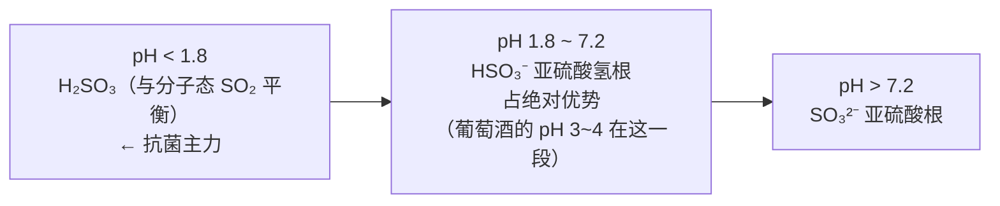
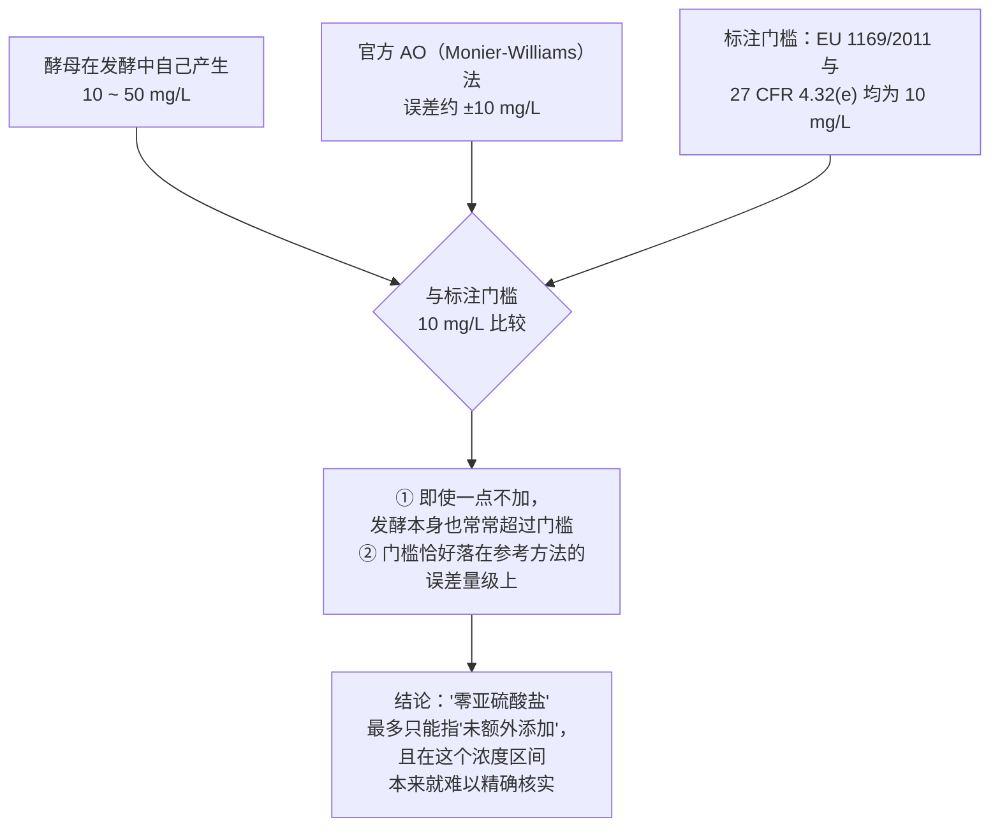
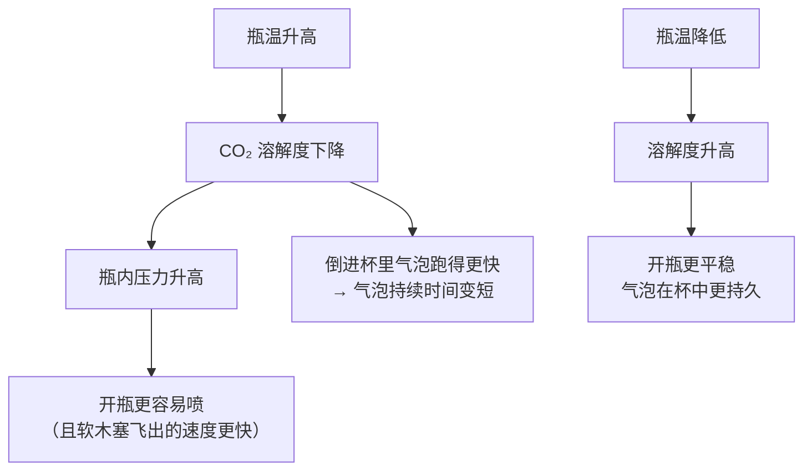
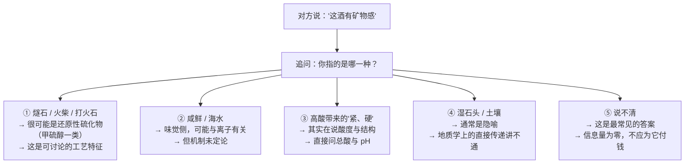

# 第 5 章 配角与麻烦：二氧化硫、二氧化碳、"矿物感"与温度

> **本章目标**：处理三样被误解得最厉害的东西。
>
> - **二氧化硫**：被当成"化学添加剂"骂了几十年，但它的化学其实非常清楚，
>   而且**法规、酵母自身产量、检测方法精度**三个数字放在一起，
>   能一次性解决"零亚硫酸盐"这类话术。
> - **二氧化碳**：唯一一个**气压被写进法规定义**的成分。
> - **"矿物感"**：一个**至今没有公认定义**、却被大量用来加价的词。
>
> 最后再用一节把"温度"这件事的**能写死的那一半**交代清楚，
> 另一半老老实实留给第 42 章。

> **适度饮酒，未成年人不饮酒，酒后不驾车。** 本章的 🅐 实操全部不需要开瓶。

## 5.1 二氧化硫：先把四个词分清楚

讨论 SO₂ 的所有混乱，几乎都源于**四个词被混用**。一篇 2026 年发表在
*Comprehensive Reviews in Food Science and Food Safety* 的综述把它们并排列了出来：

| 术语 | 指什么 | 谁在管它 |
|------|-------|---------|
| **分子态 SO₂**[^1] | 溶液中未解离的 SO₂ / H₂SO₃ 形式 | **抗菌活性的主力**；没有法规直接管它 |
| **游离 SO₂** | 分子态 + 亚硫酸氢根（HSO₃⁻）+ 亚硫酸根（SO₃²⁻）| 酒厂日常监控的指标 |
| **结合 SO₂** | 已与酒中成分（醛、酮、糖、羧酸等）结合而**失活**的部分 | —— |
| **总 SO₂** | 游离 + 结合 | **法规管的是这个** |

> ⚠️ **同一篇综述还指出一件让人不安的事**：
> 尽管很多研究都在测这几种形态，**至今没有被普遍接受的定义**，
> **尤其是"结合 SO₂"**——现行的四种参考方法（碘量法/Ripper、AO 法、FTIR、紫外-可见）
> 释放结合态的条件各不相同，**无法保证它们测的是同一批化学物质**。
>
> 本书因此不给"游离/结合"的比例数字。

[^1]: [分子态二氧化硫](../../glossary.md#molecular-so2)（molecular SO₂）与
    [游离/结合二氧化硫](../../glossary.md#free-bound-so2)（free / bound SO₂）。

### pH 决定了这笔钱有多好用

SO₂ 在水溶液中按 pH 分配成三种形态，两个解离常数把 pH 轴切成三段：



在葡萄酒的 pH 区间（约 3~4），**占绝对优势的是亚硫酸氢根**；
而**抗菌主力——分子态 SO₂——只占亚硫酸氢根的不到 5 %**，
亚硫酸根更是**不到 0.1 %**。

这意味着一件对酿酒非常重要的事：**同样的游离 SO₂ 数字，在不同 pH 的酒里效力完全不同。**
按第一解离常数 pKa₁ ≈ 1.8 可以自己估算这个比例：

```
分子态占游离态的比例 ≈ 1 / (1 + 10^(pH − 1.8))
```

| 酒的 pH | 分子态占游离 SO₂ 的比例（估算）|
|---------|----------------------------|
| 3.0 | 约 **5.9 %** |
| 3.2 | 约 **3.8 %** |
| 3.4 | 约 **2.4 %** |
| 3.6 | 约 **1.6 %** |
| 3.8 | 约 **1.0 %** |
| 4.0 | 约 **0.6 %** |

> ⚠️ **这张表是本书按 pKa₁ ≈ 1.8 自行计算的示意值，不是实测数据。**
> 真实葡萄酒里有乙醇、离子强度与温度的影响，表观 pKa 会偏移；
> 上表只用来说明**趋势与量级**：
> **pH 每升高 0.2，分子态 SO₂ 大约少三分之一到四成。**
>
> 从 pH 3.0 到 pH 4.0，**有效形态少了近一个数量级**。

> **这解释了第 1 章埋下的一条线**：为什么本书说"看酸必须总酸与 pH 一起看"。
> **总酸决定你尝到多酸，pH 决定这瓶酒需要多少 SO₂ 才稳得住。**
> 低 pH 的酒（通常是凉气候、高酸的酒）可以用更少的 SO₂ 达到同样的保护——
> 这是**酸度的一个隐性价值**，而它在酒评里从来不会被提到。

### 它还很容易跑掉

同一篇综述给了一个物理常数：SO₂ 的亨利定律常数为
**1.18 × 10⁻² mol·m⁻³·Pa⁻¹（26 ℃）**，约为氧气（1.28 × 10⁻⁵）的**一千倍**。

换句话说：**SO₂ 比氧在水中易溶得多**，但它同时也是一种**高挥发、高反应性**的气体——
综述在讨论分析方法时明确提到，它容易吸附在进样口与色谱柱表面、
会与微量水或氧反应，**造成损失或转化成检不出的形式**。

### 剂量的现实：酵母自己就产

这是本节最有用的一组数字（据同一篇综述转引 Stockley 等 2021）：

| 来源 | 浓度 |
|------|------|
| **酵母在酒精发酵中自己产生的 SO₂**（内源） | 一般在 **10~50 mg/L** |
| **人为添加的 SO₂**（外源） | 依技术需要通常在 **20~200 mg/L** |

> **把这条和"标注门槛"放在一起看，"零亚硫酸盐"这句话就基本破了**——见 §5.2。

## 5.2 限量与标注：三个法系，两个相同的数字

### 各法系的总 SO₂ 上限

下表**转引**自上述综述整理的对照表（本书只对欧盟与美国的条文做了原文核对）：

| 法域 / 依据 | 酒型 | 总 SO₂ 上限（非有机酒，mg/L）|
|------------|------|---------------------------|
| **OIV** OENO 09/1998 决议（国际推荐）| 红（糖 <5 g/L）| **150** |
| | 红（糖 >5 g/L）| 300 |
| | 白与桃红（糖 <5 g/L）| **200** |
| | 白与桃红（糖 >5 g/L）| 300 |
| | 利口酒 | 400 |
| **欧盟** (EU) 2019/934 Annex I Part B | 红（糖 <5 g/L）| **150** |
| | 红（糖 ≥5 g/L）| 200 |
| | 白与桃红（糖 <5 g/L）| **200** |
| | 白与桃红（糖 ≥5 g/L）| 250 |
| | 起泡酒 | 185 |
| **欧盟有机酒** (EC) 203/2012 | 红（糖 <5 g/L）| 100~120 |
| | 白与桃红（糖 <5 g/L）| 150~170 |
| **美国** 27 CFR 4.22(b)(1) | 所有葡萄酒 | **350** |
| **澳大利亚 / 新西兰** ANZFSC 4.5.1 | 糖 <35 g/L | 250 |
| | 糖 >35 g/L | 300 |
| **日本** 食品添加物规格基准 | 所有葡萄酒 | 350 |

本书**原文核对过**的两条：

- **(EU) 2019/934 Annex I Part B**（第 1 章已核）：红 150、白与桃红 200 mg/L，
  糖含量不低于 5 g/L 时提高到红 200、白与桃红 250，另有列名甜型 PDO 酒可到 300；
- **27 CFR 4.22(b)(1)**（本章核对）：成品酒中**总二氧化硫（或以 SO₂ 计的亚硫酸盐）
  不超过 350 ppm** 时，不构成"改变酒的类别或类型"。

> **请注意欧美之间那个两倍多的差距（150/200 vs 350）。**
> 这不是"欧洲更健康"或"美国更宽松"这么简单——
> 上限是**允许值**，不是**典型值**；两地的实际使用量取决于酒的 pH、糖、微生物风险与风格。
> **拿上限去比较两个市场的酒，是一个典型的误用。**

### 标注门槛：两个法系给了同一个数字

| 法域 | 规定 |
|------|------|
| **欧盟** (EU) No 1169/2011 Annex II 第 12 项 | "二氧化硫与亚硫酸盐，浓度**超过 10 mg/kg 或 10 mg/L（以总 SO₂ 计）**"属于必须标示的物质 |
| **美国** 27 CFR 4.32(e) | 当检出二氧化硫或亚硫酸处理剂达到 **10 ppm 或以上（以总 SO₂ 计）**，标签上必须写 "Contains sulfites"（或等价表述）|
| **OIV** OENO 09/1998 | 同样**建议**在超过 **10 mg/L** 时标注 |

> **三个来源、同一个数字 10 mg/L。** 这在本书里是很少见的一致程度，
> 说明它是一个被广泛接受的门槛。

### 于是"零亚硫酸盐"这句话就站不住了

把三组数字排在一起：



综述的原话是：现行分析方法在**低浓度（通常低于 10 mg/L）**下**精度不足**；
以官方的**通气-氧化法（AO 法，又称 Monier-Williams 法 / Frantz-Paul 法）**为例，
它的**误差幅度约为 10 mg/L**——**恰好和标注门槛同一个量级**。

> **所以本书对"无硫酒"的判定是**：
> "**未额外添加**"是一个可以成立的生产描述；
> "**不含亚硫酸盐**"则是一个**既与发酵事实冲突、又超出现行方法可靠分辨能力**的说法。
>
> 这和第 1 章辨析表里"零添加亚硫酸盐所以不头痛"那条是配套的：
> 前提本身就不成立，后面的因果就不必再谈。

## 5.3 二氧化碳：唯一被写进法规定义的气压

第 3 章算过：每升葡萄汁发酵能放出约 50 升二氧化碳。大部分跑掉了，但**留下多少是可以设计的**。

而在欧盟法规里，**"留了多少"直接决定这瓶酒叫什么名字**。
(EU) No 1308/2013 Annex VII Part II 的类别定义里，气压是硬指标
（以下为本书读取法规原文后的复述）：

| 类别 | 二氧化碳来源 | **20 ℃ 下的过压** | 其他关键条件 |
|------|------------|------------------|------------|
| **Sparkling wine**（起泡葡萄酒）| **完全来自发酵** | **不低于 3 bar** | 基酒（cuvée）总酒精度 ≥8.5 % vol |
| **Quality sparkling wine**（优质起泡葡萄酒）| **完全来自发酵** | **不低于 3.5 bar** | 基酒总酒精度 ≥9 % vol |
| **Quality aromatic sparkling wine**（优质芳香型起泡酒）| 完全来自发酵 | **不低于 3 bar** | 须用指定品种的葡萄汁构成基酒；实际酒精度 ≥6 % vol、总酒精度 ≥10 % vol |
| **Aerated sparkling wine**（充气起泡酒）| **全部或部分为外加** | 不低于 3 bar | 原料为**不带 PDO/PGI** 的葡萄酒 |
| **Semi-sparkling wine**（微起泡酒）| **内源（发酵产生）** | **1 ~ 2.5 bar** | 实际酒精度 ≥7 % vol、总酒精度 ≥9 % vol；容器 ≤60 L |
| **Aerated semi-sparkling wine**（充气微起泡酒）| 外加 | 不低于 1 bar | 实际酒精度 ≥7 % vol、总酒精度 ≥9 % vol |

从这张表能直接读出三条对买酒有用的规则：

1. **"气泡从哪来"是法定区分项**。
   `Aerated`（充气）这个词在名称里就意味着**二氧化碳是加进去的**，
   而且法规还要求它只能用**不带 PDO/PGI** 的基酒。
   **这是一个写在名称里、不需要问任何人就能读到的信息。**
2. **3 bar 是"起泡"与"微起泡"的分界**，3.5 bar 是"优质起泡"的门槛。
   所以"气压高低"不是玄学，是分类依据。
3. **注意所有条款都写明"在 20 ℃ 的封闭容器中"**。
   这不是废话——**气压强烈依赖温度**，不规定温度这个数字就没有意义
   （这和第 1 章"任何数字都要问条件"是同一条纪律，只是这次写进了法规）。

### 温度、溶解度与那些实际后果

二氧化碳在液体中的溶解度**随温度升高而下降**（亨利定律的温度依赖）。
这条纯物理的性质带来三个你会亲身遇到的后果：



> **所以"香槟要冰透了再开"有一半是安全理由，不是风味理由。**
> 风味那一半（温度怎么改变甜、酸与气泡的感受）留到第 16、42 章，
> 因为那需要感官研究的出处，本书目前还没核到足够的一手证据。

另外两件事：

- **二氧化碳有刺感**，走的是**化学感觉**通路（第 2 章），不是味觉；
  它还会带来轻微的酸感（溶解后形成碳酸）。机理与感官研究放在第 16 章。
- **静止酒里也有少量溶解的 CO₂**。有些酒厂会刻意留一点点来提升清爽感——
  这是一个**工艺选择**，不是缺陷（第 13 章）。

## 5.4 "矿物感"：一个等级完全不同的词

前面几节讨论的都是**有分子式、有法规编号**的东西。这一节不是。

**"矿物感"（minerality）**[^2]是近二十年被用得最多的葡萄酒描述词之一，
也是**最没有共识的**那个。

[^2]: [矿物感](../../glossary.md#minerality)（minerality；法：minéralité）。

### 第一层：地质学上的否定

流传最广的版本是"这片葡萄园的石灰岩/板岩风味进到了酒里"。
这个版本**在地质学上讲不通**，理由是常识性的：

- 岩石与矿物**本身没有味道**；
- 固体矿物**不易挥发**，因此进不了顶空、闻不到；
- 酒中的矿质元素浓度通常**低于人的感知阈值**。

这三点在 2025 年发表于 *RSC Advances* 的综述的引言里被作为"当前地质学视角的共识"复述。

### 第二层：感官研究上的"没有共识"

**如果它不是土壤味，那它是什么？** 多项感官研究去问了这个问题，
结论惊人地一致——**一致地指向"没有共识"**：

| 研究 | 做了什么 | 结果 |
|------|---------|------|
| Deneulin 等，*Food Research International* 2016 | 对 **1697 名**法语消费者做开放式问卷 + 文本统计 | **不存在精确定义，即使在专业人士之间也找不到共识含义**。最没经验的消费者**根本没听过**这个词；经验较少的年轻女性把它联想到**瓶装水里的矿物离子**；稍有经验者把它嵌进"风土"概念；**最有经验者指向燧石味或酸度** |
| Parr 等，*Food Research International* 2016（标题即"化学现实还是文化建构？"）| 16 款长相思（8 法 / 8 新西兰），**63 名**法国与新西兰专业人士，三种感知条件 | 两国的酒在"矿物感强度"上**平均得分相近**，但**对具体酒款的判断随参与者的文化背景而不同**；两国参与者**依据的信息不一样**；酒的若干成分与矿物感**有正相关也有负相关** |
| Rodrigues / Ballester 等，*Food Chemistry* 2017（夏布利）| 比较河两岸地块的酒，做感官评价 + 全面化学分析（含挥发性硫化物、硫醇、金属、阴阳离子）| **只有在"纯前鼻腔嗅闻"条件下**，左岸的酒才显著比右岸更"矿物"；左岸的**甲硫醇（MeSH，带贝类气息）显著更高**；右岸的**铜含量**（与游离 MeSH 降低相关）与降异戊二烯类（白色水果与花香）更高 |

> **请特别注意夏布利那项研究的两个细节**：
> ① 差异**只在前鼻腔嗅闻条件下出现**，全面品尝时消失了——
> 这说明"矿物感"在这批酒上主要是一个**嗅觉**现象；
> ② 与它相关的是**甲硫醇**这个**硫化物**，不是任何一种矿物离子。

### 第三层：一个提出框架的综述

2025 年 *RSC Advances* 上的那篇综述试图给"矿物感"建立一个化学框架，
把常见的"矿物"感受按**化学来源与途径**分成三组：

| 组 | 内容 | 例子 |
|----|------|------|
| **金属组** | 金属离子直接引发味觉 | NaCl、KCl 的咸感 |
| **硫组** | 含硫（尤其芳香族含硫）分子 | **H₂S、甲硫醇（MeSH）** 带来的燧石 / 还原气息 |
| **金属催化组** | 金属离子本身不产生气味，但**催化**反应生成挥发物 | Fe²⁺ 分解皮肤表面的脂质过氧化物生成 1-辛烯-3-酮 |

该综述还列出了目前被讨论的五类"矿物味"受体候选：
**TRPA1、TRPV1、ENaC**（离子通道）与 **Tas2R7、Tas1R3**（G 蛋白偶联受体）。

> ⚠️ **本书对这篇综述的定位要说清楚**：
> 它是一篇**提出框架的综述**，摘要里甚至写明这套理解"将有助于建立有说服力的营销策略"。
> **它不是一个已建立的共识**，与前面三项感官研究属于**不同性质的证据**。
> 本书并列它们，是因为**三项感官研究说"这个词没有共识定义"，
> 而这篇综述提出"也许可以按化学来源拆成三组"——两者并不矛盾，但后者尚待检验。**

### 所以听到"矿物感"时该怎么办

本书的建议不是"别用这个词"，而是**把它当成一个待拆解的词**：



> **这张图是本章最实用的东西。**
> 它不否定任何人的感受——**感受是真的**；
> 它只要求把感受**翻译成可以继续追问的东西**。
> 前三条都能接上本书已经讲过的机理，第四条是隐喻，第五条是话术。

## 5.5 温度：能写死的那一半

第 1 章已经写死了一条：**温度升高 → 挥发性成分的蒸气压升高 → 顶空浓度升高 → 闻到的强度增加**。
本章再补两条同样是**物理层面**、可以写死的：

| 条目 | 机理 | 后果 |
|------|------|------|
| **CO₂ 的溶解度随温度升高而下降** | 亨利定律的温度依赖 | 瓶温高 → 瓶压高、开瓶更危险、杯中气泡消散更快 |
| **化学反应速率随温度升高而加快** | 一般的反应动力学 | 储存温度越高，瓶中变化越快（第 18、41 章给判据）|

而**仍然不能写死的那一半**是：**温度怎样改变甜、酸、苦、涩的感知强度**。
几乎所有侍酒指南都会给一套说法，但本书至今**没有核到可引用的一手感官研究**，
因此按第 1 章的处理方式，继续留到第 42 章，并登记在
[出处与资料登记](../../standards.md)的待办清单里。

> **为什么要这么固执？** 因为"温度改变甜酸苦涩"这句话**听起来非常合理**，
> 而本书最怕的恰恰是"听起来合理"。
> 第 1 章的教训已经很清楚了：**干型酒的"典型成分区间"也听起来非常合理，
> 但它没有可引用的一手数据。**

## 5.6 常见说法辨析

按本书约定标注**证据强度**：✅ 有共识 / ⚠️ 有争议 / ❌ 明确错误 / 缺乏证据。

| 说法 | 判定 | 说明 |
|------|------|------|
| "这瓶酒零添加亚硫酸盐，所以不含亚硫酸盐" | ❌ **明确错误** | **酵母在酒精发酵中自己就产生 10~50 mg/L**（转引 Stockley 等 2021），而欧盟 (EU) No 1169/2011 与美国 27 CFR 4.32(e) 的标注门槛都是 **10 mg/L**。"未额外添加"成立，"不含"不成立 |
| "既然有标注门槛，那测一下就知道有没有" | ⚠️ **不可靠（在低浓度区）** | 官方 AO（Monier-Williams）法的**误差幅度约 10 mg/L**，恰好与标注门槛同量级；综述明确指出现行方法在 10 mg/L 以下精度不足 |
| "亚硫酸盐含量越低，酒越好" | **缺乏证据** | 需要多少 SO₂ **取决于 pH、糖、微生物风险与风格**。低 pH 的酒天然需要更少（分子态比例更高）。把一个**工艺变量**当成品质排序，没有依据 |
| "美国的酒亚硫酸盐更多，因为上限是 350" | ❌ **推理错误** | 350 mg/L 是 **27 CFR 4.22(b)(1)** 的**允许上限**，不是典型值。**用上限比较两个市场的实际用量是典型误用** |
| "游离 SO₂ 一样，保护效果就一样" | ❌ **明确错误** | 抗菌主力是**分子态**，其占比由 pH 决定：按 pKa₁ ≈ 1.8 估算，pH 3.0 时约 5.9 %，pH 4.0 时约 0.6 %——**差了近一个数量级** |
| "亚硫酸盐是红酒头痛的原因" | **缺乏证据** | 见第 1 章辨析表：白葡萄酒的 SO₂ 法定上限**高于**红葡萄酒（白/桃红 200 vs 红 150 mg/L），方向与该说法相反；2023 年的槲皮素解释是**假说**，作者明确写需人体试验验证 |
| "气泡多少是酒庄的风格选择，没有标准" | ❌ **明确错误** | (EU) No 1308/2013 Annex VII Part II 把气压写进了**类别定义**：起泡酒 ≥3 bar、优质起泡酒 ≥3.5 bar、微起泡酒 1~2.5 bar（均在 **20 ℃ 封闭容器**中测）|
| "气泡酒的气都是自然发酵来的" | ❌ **明确错误** | 法规同时定义了 **Aerated sparkling wine（充气起泡酒）**：二氧化碳全部或部分为**外加**，且必须用**不带 PDO/PGI** 的基酒。**"Aerated" 这个词就写在名称里** |
| "酒温高一点开瓶更容易，没什么风险" | ❌ **明确错误** | CO₂ 溶解度随温度升高而下降 → **瓶内压力升高**。这是安全问题，不是口感问题 |
| "矿物感来自土壤里的矿物质直接进入酒中" | ❌ **明确错误** | 岩石与矿物本身没有味道、不易挥发，酒中矿质元素浓度通常低于感知阈值（*RSC Adv.* 2025 综述引述的地质学视角）|
| "矿物感是一个专业词，专业人士都懂" | ❌ **明确错误** | 对 1697 名消费者的研究结论是：**不存在精确定义，即使在专业人士之间也找不到共识含义**；不同经验层次的人指的东西完全不同（矿物水 / 风土 / 燧石 / 酸度）|
| "矿物感是纯粹的文化建构，没有化学对应物" | ⚠️ **同样过头** | 夏布利研究在**前鼻腔嗅闻条件下**测到了显著差异，并与**甲硫醇**含量相关；2025 年的综述提出了金属 / 硫 / 金属催化三类化学来源的框架。**"没有公认定义"不等于"没有任何化学对应"** |
| "温度会改变你尝到的甜度与酸度" | **缺乏证据（本书尚未核到）** | 物理层面可写死的是：顶空浓度、CO₂ 溶解度、反应速率。**感知层面的部分留到第 42 章，届时必须带出处** |

## 5.7 思考题

1. 请分别用一句话解释"分子态 SO₂""游离 SO₂""结合 SO₂""总 SO₂"，
   并说明**法规管的是哪一个、酿酒师真正关心的是哪一个**，为什么这两个不一样。
2. 两支酒的游离 SO₂ 都是 30 mg/L，一支 pH 3.1、一支 pH 3.7。
   哪一支的抗菌保护更强？请用本章的估算式算出大致倍数，并说明这个计算有哪些前提。
3. 请用**三个数字**论证"不含亚硫酸盐"这句话为什么站不住。
   （提示：一个来自酵母，一个来自法规，一个来自分析方法。）
4. 欧盟法规里，`Sparkling wine` 与 `Aerated sparkling wine` 的区别是什么？
   为什么后者还额外规定了基酒**不得带 PDO/PGI**？你觉得立法者在防什么？
5. 为什么所有关于气压的法规条款都写明"在 20 ℃ 的封闭容器中"？
   如果去掉这个条件，会出什么问题？
6. **【案例】** 某自然酒吧的酒单写着：
   *"全店主打零硫酒，不含任何亚硫酸盐，喝完不头痛；
   我们的微气泡酒气压高达 4 bar，口感比普通起泡酒更活泼；
   这款夏布利有强烈的矿物感，是石灰岩土壤直接带来的风味。"*
   请指出其中**至少五处**问题，并把这三句话**分别改写成站得住的说法**。
7. **【案例】** 一位朋友说："我喝白葡萄酒从不头痛，喝红酒就头痛，
   所以一定是红酒的亚硫酸盐更多。"
   请用本章与第 1 章的内容指出这个推理的问题，
   并说明**你会建议他记录哪些变量**才能让这件事变得可讨论。
   （注意：本书不做医疗与健康建议，只讨论证据与变量。）
8. **【查证】** 中国对葡萄酒中二氧化硫的限量规定在 **GB 2760**（食品添加剂使用标准）里。
   请自己去查：① 它的**现行版本**是哪一年？② 葡萄酒的限量是多少、以什么计？
   ③ 标注要求写在哪个标准里？
   （查不到也是有价值的结论——请记录你查到了哪一步、卡在哪里。本书自己也卡住了，
   答案册里写了卡在哪。）

> 📖 **参考答案**（想清楚再看）：[Q1](../../qa/05-so2-co2-minerality-qa.md#q1) ·
> [Q2](../../qa/05-so2-co2-minerality-qa.md#q2) · [Q3](../../qa/05-so2-co2-minerality-qa.md#q3) ·
> [Q4](../../qa/05-so2-co2-minerality-qa.md#q4) · [Q5](../../qa/05-so2-co2-minerality-qa.md#q5) ·
> [Q6](../../qa/05-so2-co2-minerality-qa.md#q6) · [Q7](../../qa/05-so2-co2-minerality-qa.md#q7) ·
> [Q8](../../qa/05-so2-co2-minerality-qa.md#q8)

## 5.8 本章实操

🅐 档**全部不需要开瓶喝酒**。

### 🅐 无器具版 · 任务一：查三张酒标的亚硫酸盐提示

找**三张**酒标（自家的、超市拍的、电商图都行），看它们怎么处理亚硫酸盐这件事。

| # | 酒的产地 / 销往哪个市场 | 标签上的原文（"含亚硫酸盐""Contains sulfites""Contient des sulfites"…）| 它出现在正标还是背标 | 有没有同时出现"无硫""零添加"之类的宣传语 |
|---|---------------------|--------------------------------------------------------|-----------------|--------------------------------|
| 1 | | | | |
| 2 | | | | |
| 3 | | | | |

然后回答：

- 三张标里有没有**同时**出现"含亚硫酸盐"提示和"零硫/无硫"宣传语的？
  （如果有，请把这个矛盾写下来——它其实不是造假，而是**"未额外添加"与"总量超过 10 mg/L"
  可以同时成立**。）
- 按本章的门槛（10 mg/L，欧美一致），出现这个提示说明了什么、**没有**说明什么？

### 🅐 无器具版 · 任务二：自己算一遍 pH 对 SO₂ 的影响

用本章给的式子 `分子态占比 ≈ 1 / (1 + 10^(pH − 1.8))`，填下表，
然后回答后面的问题。**一个计算器就够。**

| pH | 分子态占游离 SO₂ 的比例 | 相对 pH 3.0 的倍数 |
|----|---------------------|------------------|
| 3.0 | | 1.0 |
| 3.3 | | |
| 3.6 | | |
| 3.9 | | |

- 要让 pH 3.6 的酒达到与 pH 3.0 的酒**相同的分子态 SO₂ 浓度**，
  游离 SO₂ 大约要提高多少倍？
- 这个结论对"低 pH（高酸）的酒有什么隐性优势"意味着什么？
- 这个计算**忽略了什么**？（至少说出两点。提示：真酒里还有什么、温度怎么影响、
  这个 pKa 是在什么条件下测的。）

### 🅐 无器具版 · 任务三：把"矿物感"拆成可追问的问题

找**三段**用了"矿物感""矿物味""minerality""咸鲜""燧石"这类词的酒评或商品描述，
用 §5.4 那张决策图给它们分类。

| # | 原文照抄 | 我判断它指的是哪一类（①燧石/②咸鲜/③酸度/④隐喻/⑤说不清）| 我会追问的一句话 |
|---|---------|--------------------------------------------|---------------|
| 1 | | | |
| 2 | | | |
| 3 | | | |

> **这个任务的真正目的**：训练你**不因为一个词听起来专业就给它加分**。
> 顺便留意一件事——**越贵的酒，商品描述里这类词出现得越多吗？**
> 如果是，那你刚刚发现了一个**定价与话术的相关性**（第 40 章会正面处理）。

### 🅑 有条件版 · 任务四：气泡与温度（备齐后再做）

**所需**：**一支**起泡酒、两只同款杯子、一支温度计、一个能计时的东西。
**不需要第二支酒**——这个实验只改温度。

**适度饮酒，未成年人不饮酒，酒后不驾车。** 每次倒 20~30 mL 即可完成观察。

做法：把酒充分冰镇后开瓶（**冰过的酒开瓶更平稳，这是本任务的安全前提**）。
先倒一杯记录；把剩下的酒**封好**（起泡酒专用塞），让第二杯的酒**回温若干度**后再倒。

| 观察项 | A（较凉，实测 ____ ℃）| B（较暖，实测 ____ ℃）| 差异 |
|-------|--------------------|--------------------|------|
| 倒酒时泡沫的高度与消退时间 | | | |
| 杯中气泡持续可见的时间 | | | |
| 香气强度（1~5）| | | |
| "刺"的感觉（1~5）| | | |
| 酸感（1~5）| | | |

> **纪律提醒**：
> ① 泡沫与气泡持续时间的差异，可以用**CO₂ 溶解度随温度下降**来解释（本章已写死）；
> ② 香气强度的差异，可以用**顶空浓度随温度升高**来解释（第 1 章已写死）；
> ③ 但"刺"和"酸感"的差异，**本书目前没有可引用的一手感官研究**——
> 请把它记为**你自己的观察**，不要写成结论。
>
> **能清楚说出自己这三行分别处在哪个证据等级上，这个实验就做到位了。**

## 5.9 🔎 买酒与点酒时的用处

1. **看到"含亚硫酸盐"提示，不要减分**。它只说明总量超过 10 mg/L——
   而**发酵本身就常常做到这个量**。它是一个**标注门槛**，不是一个品质信号。
2. **看到"零硫/无硫"，翻译成"未额外添加"**。
   这是一个**工艺选择**（通常也意味着更高的微生物风险与更短的窗口期），
   不是一个健康承诺。
3. **想要"用硫少"的酒，与其看宣传，不如看 pH 与酸度**。
   低 pH 的酒天然需要更少 SO₂——而酸度是酒评里会提、也可以向商家索要数据的一项。
4. **买气泡酒先读名称里的类别词**。
   `Aerated`（充气）在欧盟法规里意味着**二氧化碳是加进去的**，
   而且基酒**不带 PDO/PGI**。**这是免费的信息。**
5. **"气压更高更活泼"要打问号**。3 bar / 3.5 bar 是**分类门槛**，
   高于门槛的部分与"好不好"没有已建立的对应关系。
6. **听到"矿物感"，问一句"你指的是哪一种"**。
   如果对方能说成"燧石/火柴"，那是可讨论的工艺特征；
   如果能说成"高酸带来的紧致"，那直接去看总酸；
   **如果说不清，就不要为这个词付钱。**
7. **起泡酒开瓶前务必冰透**。这一条是安全，不是风味。

## 5.10 本章依据

### A. 已核对原文的法规（最硬）

- **(EU) No 1308/2013 Annex VII Part II**（本章核对第 4~9 项类别定义）：
  Sparkling wine ≥3 bar（20 ℃ 封闭容器）、CO₂ 完全来自发酵、cuvée 总酒精度 ≥8.5 % vol；
  Quality sparkling wine ≥3.5 bar、cuvée ≥9 % vol；
  Quality aromatic sparkling wine ≥3 bar、实际酒精度 ≥6 % vol、总酒精度 ≥10 % vol；
  Aerated sparkling wine（CO₂ 全部或部分外加、基酒不带 PDO/PGI）≥3 bar；
  Semi-sparkling wine 1~2.5 bar、实际 ≥7 % vol、总 ≥9 % vol、容器 ≤60 L；
  Aerated semi-sparkling wine ≥1 bar。
- **(EU) No 1169/2011 Annex II 第 12 项**：二氧化硫与亚硫酸盐在
  **超过 10 mg/kg 或 10 mg/L（以总 SO₂ 计）**时属于必须标示的物质。
- **27 CFR 4.22(b)(1)**：成品酒中总二氧化硫（或以 SO₂ 计的亚硫酸盐）
  **不超过 350 ppm** 不构成类别/类型的改变。
- **27 CFR 4.32(e)**：检出达到 **10 ppm 或以上**（以总 SO₂ 计）时，
  标签须标 "Contains sulfites" 或等价表述。
- **(EU) 2019/934 Annex I Part B**（第 1 章已核）：总 SO₂ 上限。

### B. 已核对摘要或数据段的同行评议文献

- **SO₂ 的形态、术语与分析方法**：一篇 2026 年发表于
  *Comprehensive Reviews in Food Science and Food Safety* 的综述
  （四个术语的区分；法规管总量；**"结合 SO₂" 至今没有普遍接受的定义**，
  四种参考方法释放条件不同；pH <1.8 时 H₂SO₃ 占优、1.8~7.2 时 HSO₃⁻ 占优、
  >7.2 时 SO₃²⁻ 占优；**葡萄酒 pH 3~4 区间分子态不足 HSO₃⁻ 的 5 %**、SO₃²⁻ <0.1 %；
  SO₂ 的亨利定律常数 1.18 × 10⁻² mol·m⁻³·Pa⁻¹（26 ℃），约为 O₂ 的一千倍；
  **内源 SO₂ 一般 10~50 mg/L、外源添加通常 20~200 mg/L**；
  **官方 AO 法误差幅度约 10 mg/L**，低于 10 mg/L 时精度不足；
  OIV OENO 09/1998 决议的限量与 10 mg/L 标注建议；各法域限量对照表）。
- **矿物感的化学框架**：一篇 2025 年发表于 *RSC Advances* 的综述
  （岩石与矿物本身无味、不易挥发、酒中矿质元素常低于阈值；提出金属 / 硫 /
  金属催化三组分类；列出 TRPA1、TRPV1、ENaC、Tas2R7、Tas1R3 五类受体候选）。
  ⚠️ **这是一篇提出框架的综述，不是已建立的共识。**
- **矿物感没有共识定义**：Deneulin, P.; Le Fur, Y.; Bavaud, F.
  *Food Research International* (2016) 288–297（1697 名法语消费者的开放式问卷）。
- **矿物感的文化维度**：Parr, W. V. 等，"Perceived minerality in sauvignon blanc wine:
  Chemical reality or cultural construct?", *Food Research International* (2016) 168–179
  （16 款酒、63 名法国与新西兰专业人士、三种感知条件）。
- **夏布利的矿物感与甲硫醇**：Rodrigues, H.; Sáenz-Navajas, M.-P.; Ballester, J. 等，
  "Sensory and chemical drivers of wine minerality aroma: An application to Chablis wines",
  *Food Chemistry* (2017) 553–562（仅在前鼻腔嗅闻条件下左岸显著更"矿物"；
  左岸甲硫醇显著更高；右岸铜与降异戊二烯更高）。

### C. 本书自行计算、已标注为示意的内容

- **分子态 SO₂ 占游离态比例随 pH 的变化表**：本书按 **pKa₁ ≈ 1.8**
  （取自上述综述所引的 pH 分段）用 `1 / (1 + 10^(pH − 1.8))` 计算，
  **忽略了乙醇、离子强度与温度对表观 pKa 的影响**，仅用于说明趋势与量级。

### D. 本章有意留白的地方

- **温度对甜、酸、苦、涩感知强度的影响**：本书**仍未核到可引用的一手感官研究**，
  按第 1 章的处理方式留到第 42 章。
- **中国 GB 2760 中葡萄酒的 SO₂ 限量**：本书只核到该标准的**现行版本为 2024 版**
  （见[出处与资料登记](../../standards.md)），**未读到条文**，因此正文不写中国的限量数字。
- **游离/结合 SO₂ 的典型比例**：因"结合 SO₂"缺乏统一定义，本书不给数字。
- **二氧化碳的感官机理（刺感、酸感、对甜度的影响）**：留到第 16 章。

以上每一条的完整题录、DOI 与核对状态，见[出处与资料登记](../../standards.md)。

---

**下一部分预告**：第一部分的五章到此写完，
接下来是**项目 P1：把一杯酒拆成六个结构要素**——
它会把第 1~5 章的判据合成一张你自己的坐标系，并要求你用**可比较的方式**记录。

再往后是第二部分**葡萄品种与风土**：
本章最后处理的"矿物感"其实已经踩到了风土叙事的门口——
第 8 章会把"风土"这个词按同样的方式拆开：**哪些部分可证，哪些部分是叙事。**
