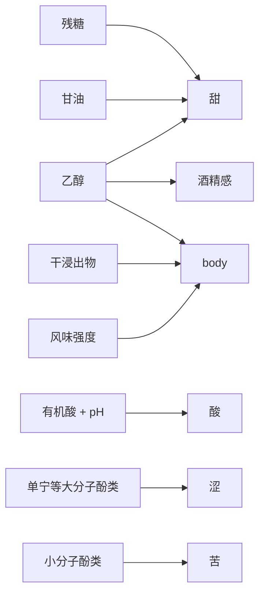
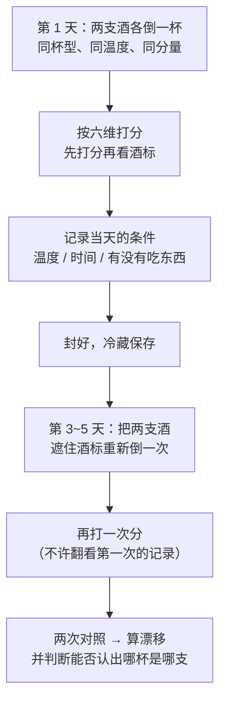

# 🛠 项目 P1 · 把一杯酒拆成六个结构要素

> **这是第一部分的收尾项目。** 前五章把"成分 → 感受"的链条讲了一遍，
> 这个项目要求你把它**变成一件可以反复使用的工具**：
> 一套**你自己的、刻度稳定的坐标系**，以及一份**能和三个月后的自己比较**的记录。
>
> **本项目的 🅐 档完全不需要开瓶喝酒。**
> **适度饮酒，未成年人不饮酒，酒后不驾车。**

## P1.1 为什么是"六个要素"，而不是"好喝不好喝"

第一部分导读里那句话是本书的出发点：**名字不可比较，坐标可比较。**

"好喝"是一个**一维**的结论，而且这一维里混着**当天的心情、价格、同桌的人**。
把它拆成六个可以分别命名的维度之后，会发生三件事：

1. **分歧变得可讨论**。"我觉得它太酸"和"我觉得它不够酸"是同一维度上的两个位置，
   而"我觉得不好喝"和"我觉得好喝"之间什么都没有。
2. **记录变得可累积**。六个数字三个月后还能读懂，"很清爽"三天后就读不懂了。
3. **你能发现自己的偏好在哪一维上**——这是本项目**最有价值的产出**，
   因为它直接决定你以后该买什么、不该为什么付钱。

本项目采用的六个要素，与[品鉴记录表](../../forms/tasting-note.md)的"表四 · 结构"完全一致：

| 要素 | 主要物质基础（第 1、3 章） | 感官通道（第 2 章） |
|------|--------------------------|-------------------|
| **甜** | 残糖为主；乙醇与甘油也带甜感 | 味觉 |
| **酸** | 有机酸浓度 + pH | 味觉（并伴随生津反应） |
| **涩** | 单宁等酚类与唾液蛋白的相互作用 | **触觉 / 化学感觉**，不是味觉 |
| **苦** | 小分子酚类等 | 味觉 |
| **酒精感** | 乙醇的化学刺激 | **化学感觉**（三叉神经通路） |
| **body** | 乙醇 + 残糖 + 干浸出物 + 风味强度的综合印象 | **多通道综合**，不对应单一物质 |

> ⚠️ **注意这张图里最容易出错的两条线**：
> **乙醇同时连着三个要素**（甜、酒精感、body），
> 而 **body 没有自己的专属物质**。
> 所以"酒精度高" ≠ "body 重"，但两者高度相关——
> 这正是初学者最常把两件事混为一谈的地方，本项目会专门检验它。

## P1.2 项目目标与交付物

**目标**：产出**一套属于你自己的刻度**，并证明它**稳定**（同一杯酒隔几天打出的分接近）
且**有分辨力**（不同的酒打出的分不一样）。

**交付物三件**（🅐 档只需前两件）：

| # | 交付物 | 说明 | 需要开瓶吗 |
|---|-------|------|-----------|
| **D1** | **个人锚点表** | 六个维度的 1 / 3 / 5 各锚在什么上——**用日常食物饮料做锚**，不用酒 | 否 |
| **D2** | **酒评翻译矩阵** | 把 10 段现成的酒评/商品描述翻译成六维坐标，并标出"读不出"的格子 | 否 |
| **D3** | **对照记录与信度自查** | 实际品鉴记录 + 重复测一次看漂移多少 | 是（🅑 档） |

## P1.3 🅐 无器具版（不需要开瓶）

### 任务一 · 造一把尺子：个人锚点表（D1）

**问题**：1~5 分的刻度如果不锚定，三个月后就漂了。
**做法**：给每个维度的 **1 分、3 分、5 分**各找一个**你随时能再尝到的日常参照物**。

下面给的是**示例，不是标准答案**——请务必换成你自己常喝常吃的东西，
因为**锚点的意义在于你能随时复现它**。

| 维度 | 1 分（几乎没有） | 3 分（明显但不主导） | 5 分（主角） | 我的锚点（填这一列） |
|------|----------------|-------------------|------------|-------------------|
| 甜 | 白开水 | 示例：常温可乐兑一半水 | 示例：蜂蜜水 | |
| 酸 | 白开水 | 示例：淡柠檬水 | 示例：浓柠檬汁 | |
| 涩 | 白开水 | 示例：泡久一点的红茶 | 示例：未熟的柿子 / 极浓的茶汤 | |
| 苦 | 白开水 | 示例：淡美式咖啡 | 示例：浓黑咖啡 / 苦瓜 | |
| 酒精感 | ——（这一维没有无酒精锚点）| ——| ——| 见下方说明 |
| body | 白开水 | 示例：全脂牛奶 | 示例：浓汤 / 米浆 | |

> **关于"酒精感"这一维的诚实说明**：
> 它对应的是**乙醇的化学刺激**（第 2 章：走三叉神经通路，不是味觉），
> **不存在不含酒精的等价锚点**。
> 折中办法：在 🅑 档第一次品鉴时，把当时那一杯记为"我的 3 分"，
> 以后都相对它来打分——**并在记录里写明这个锚是哪一杯、哪一天定的**。
> 这不优雅，但它诚实：**一把没有绝对零点的尺子，只要刻度稳定，仍然可用。**

**验收**：锚点必须满足两条——**随时可再现**（超市能买到 / 家里常备）、
**你能描述它的感受**（而不是只写个名字）。

### 任务二 · 把别人的话翻译成坐标：酒评翻译矩阵（D2）

**取材**：找 **10 段**现成文字——电商商品描述、酒单、酒评媒体的短评、直播话术都可以，
**尽量覆盖不同价位与不同风格**。

**做法**：逐段翻译成六维坐标。规则有三条，**比填表本身更重要**：

1. **只填文字支持的格子**，其余一律写"**读不出**"；
2. 每填一格，在"依据"栏抄下**原文的那几个字**；
3. 凡是无法归到六维的词（"优雅""复杂""有故事""风土表达"），
   单独记到"**归不了类的词**"一栏——这一栏就是第 5 章说的**待拆解词**。

| # | 来源（不必写商家名） | 甜 | 酸 | 涩 | 苦 | 酒精感 | body | 依据（原文摘几个字） | 归不了类的词 |
|---|-------------------|---|---|---|---|-------|------|-------------------|------------|
| 1 | | | | | | | | | |
| 2 | | | | | | | | | |
| … | | | | | | | | | |
| 10 | | | | | | | | | |

**填完后统计三件事**（这才是本任务的真正产出）：

| 统计项 | 我的结果 | 这说明什么 |
|--------|---------|-----------|
| 60 个格子里，"读不出"占多少？ | ____ / 60 | 比例越高，说明这批文字的**信息密度越低** |
| 哪一维最常被写到？哪一维几乎没人写？ | | 通常**涩与苦**最少被区分——而它们是两回事（第 1 章） |
| "归不了类的词"共出现多少次？在什么价位的文案里最多？ | | 第 5 章留的那个问题：**这类词和价格相关吗？** |

> **做这个任务时会遇到的典型情况**：
> 一段 80 字的商品描述，**六个格子能填上两个**，剩下全是"读不出"，
> 外加四五个归不了类的词。
> **这不是你不会读，是那段文字本来就没提供结构信息。**
> 认出这一点，就是这个项目想给你的第一件东西。

### 任务三 · 从酒标预测坐标（不开瓶）

**做法**：找 **5 张**酒标（自家的、超市拍的、电商详情页都行），
**只用酒标上受法规约束的信息**做预测，然后把"我预测的依据"写清楚。

| # | 酒标可读信息（酒精度 / 甜度术语 / 产区层级 / 年份 / 封瓶方式）| 我预测的六维坐标 | 我的推理（写清用了哪一条） | 置信度（高/中/低）|
|---|--------------------------------------------------|---------------|------------------------|-----------------|
| 1 | | | | |
| … | | | | |

**能用的推理只有这么几条**（第 1~5 章里有出处的那些）：

- **甜度术语是法规术语**：欧盟 (EU) 2019/33 Annex III 对 dry / medium dry / medium / sweet
  与起泡酒的 brut 一族都规定了残糖区间——**看到这类词，"甜"这一维就有了硬信息**；
- **标示酒精度**：与"酒精感"和"body"相关（第 3 章：乙醇同时抬热感与 body），
  但**不是等号**（第 3 章的雷司令研究：乙醇升高使三款酒**全部**热感升高，
  只在**三款中的两款**上抬高 body）；
- **"含亚硫酸盐"提示**：只说明总 SO₂ 超过 10 mg/L（第 5 章），**对六维没有信息**；
- **起泡酒的类别词与气压**：写进了 (EU) No 1308/2013 的类别定义（第 5 章）。

> **这个任务真正要训练的是"分清哪些字是法规、哪些字是营销"**——
> 也就是第四部分（第 19、20 章）的预演。
> 现在做一次，等读到那两章时你会发现自己已经有直觉了。

## P1.4 🅑 有条件版（备齐后再做）

> **备齐后再做。适度饮酒，未成年人不饮酒，酒后不驾车。**
> 本任务**全程每杯 20~30 mL 即可**，两个人分同两支酒最理想——
> 既减少酒量，又多一份独立评分。

**所需**：

| 类别 | 清单 | 为什么需要 |
|------|------|-----------|
| 酒 | **2 支**，同色（都白或都红），风格尽量拉开（例如一支标 dry、一支标 medium/甜型）| 要检验"分辨力"，就必须有差异 |
| 器具 | 两只**同款**杯子、不透光的袋子或锡纸（做遮标）、温度计（可选）、笔和纸 | 杯型与温度是变量，必须固定 |
| 表格 | [品鉴记录表](../../forms/tasting-note.md)（表四 · 结构）打印或抄两份 | 保证两次记录格式一致 |

### 步骤

⚠️ **第二次记录有一个无法消除的混杂因素**：酒已经开瓶几天，**它本身变了**（第 18 章）。
所以两次的差异里，既有"**你的尺子在漂**"，也有"**酒在变**"。
**本项目不要求你区分二者——只要求你在结论里写明这一点。**
（想把它分开，就得在同一天分两次盲测同一杯酒；有条件的话这是更好的做法。）

### D3 交付物模板

**表 A · 两支酒的六维坐标**

| 维度 | 酒甲 第一次 | 酒甲 第二次 | 酒乙 第一次 | 酒乙 第二次 | 甲乙差值（第一次）|
|------|-----------|-----------|-----------|-----------|----------------|
| 甜 | | | | | |
| 酸 | | | | | |
| 涩 | | | | | |
| 苦 | | | | | |
| 酒精感 | | | | | |
| body | | | | | |

**表 B · 两项自查指标**

| 指标 | 怎么算 | 我的结果 | 怎么读这个结果 |
|------|-------|---------|--------------|
| **稳定性（漂移）** | 同一支酒两次打分之差的绝对值，六维求和 | | 数值越小越稳；**大于 6 说明尺子还没定住**（平均每维差 1 分以上）|
| **分辨力** | 第一次记录中甲乙两支差值的绝对值之和 | | **分辨力必须明显大于漂移**，否则你区分的可能是噪声 |

> **这两个指标是本项目的核心**，因为它们回答的是一个很少被问的问题：
> **"我的评分到底可不可信？"**
> 大多数人从不检验自己的尺子，于是把噪声当成了发现。

**表 C · 结论**

1. 我在哪一维上**最稳**？哪一维上**最不稳**？
2. 我最不稳的那一维，最可能的原因是什么？（锚点没定好 / 两种感受混淆 / 酒本身变了）
3. 我发现自己的偏好集中在哪一维的哪一段？（例：偏好"酸 4~5、涩 2 以下"）
4. 这个偏好会怎么改变我下次买酒的动作？

## P1.5 验收标准（做完自己打勾）

- [ ] D1 的六个维度都有**可再现**的锚点（"酒精感"那一维写明了参照杯与日期）；
- [ ] D2 满 10 段，且**"读不出"的格子如实留空**（没有为了填满而猜）；
- [ ] D2 统计了三项结果，并至少发现一个自己此前没注意的现象；
- [ ] 任务三的 5 张酒标里，每条预测都写明了**依据哪一条法规或哪一章的机理**；
- [ ] （🅑）D3 的漂移与分辨力都算出来了，并写了结论表 C；
- [ ] 全程没有写出"这瓶酒一定是假的 / 一定不好"这类隔屏断言。

## P1.6 四个常见失误（本书自己也犯过）

| 失误 | 表现 | 怎么改 |
|------|------|-------|
| **把"涩"和"苦"合并** | 两栏永远填一样的数 | 分开测：**涩是口腔发糙发紧的触感**，**苦是味道**。含一口浓茶体会前者，含一口黑咖啡体会后者 |
| **把"酒精度高"直接写成"body 重"** | 看到 14.5 % vol 就给 body 打 5 | body 还受残糖与干浸出物影响；第 3 章的研究里，乙醇升高**只在部分酒上**抬高了 body |
| **先看酒标再打分** | 贵的酒各项都打得高 | 一律**先盲打分、后看标**。价格与标签对评分的影响是第 32 章的主题，它是真实存在的 |
| **为了填满表格而猜** | 几乎没有"读不出" | "读不出"是**有信息的记录**：它说明这段文字/这杯酒在这一维上没给你信号 |

## P1.7 🔎 买酒与点酒时的用处

1. **拿到任何一段酒评，先做六格翻译**。能填上三格以上，这段话值得读；
   全是"归不了类的词"，它就只是文案。
2. **把自己的偏好写成坐标区间**（例："酸 4、涩 2 以下、甜 1~2"），
   点酒时直接把这句话给侍酒师——**比说"我喜欢清爽的"精确一个数量级**。
3. **知道自己哪一维不稳，就别在那一维上花钱**。
   如果你在"涩"上的漂移有 2 分，那么"单宁细腻"的溢价对你暂时没有意义。
4. **用酒标上受法规约束的字做预测，用喝到的结果做校正**——
   这个循环跑几轮，你就不再需要别人告诉你"这瓶大概什么风格"了。

## P1.8 本项目依据

- **六要素与物质基础的对应**：第 1 章（糖、酸、酚类、乙醇、干浸出物与 body）、
  第 2 章（味觉 / 嗅觉 / 化学感觉的通道区分，以及涩属三叉神经的证据）、
  第 3 章（乙醇与甘油的感官研究：乙醇一致抬高热感、部分情况下抬高 body；
  甘油在常见浓度下主要贡献甜而非黏度）。
- **酒标上"哪些字受法律约束"**：(EU) 2019/33 Annex III（甜度术语的残糖区间）、
  (EU) No 1308/2013 Annex VII Part II（起泡酒类别与气压）、
  (EU) No 1169/2011 Annex II（亚硫酸盐标注门槛）——均已在
  [出处与资料登记](../../standards.md)登记并核对过原文。
- **"没有绝对零点但刻度稳定的量表仍然可用"**：这是本项目的方法约定，
  不是引用某项研究的结论。本书对个体差异的处理见第 2 章
  （阈值随人群、介质、方法变化，因此**跨人比较分数没有意义**）。

---

**第一部分到此结束。** 你现在手上有一套坐标、一把校准过的尺子，
以及一个能判断"这段话有没有信息"的习惯。

**下一部分**从"这些成分是从哪来的"开始：
[第二部分 · 葡萄品种与风土](../02-grape-terroir/00-intro.md)。
