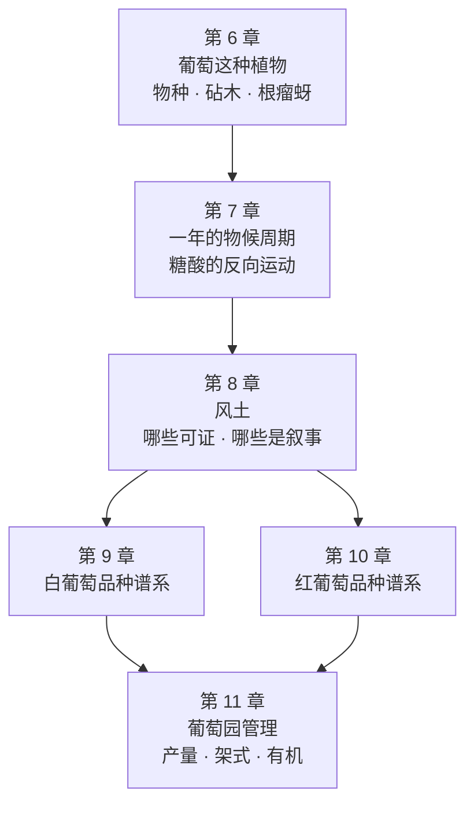

# 第二部分导读 · 葡萄品种与风土

> **第一部分回答的是"杯子里有什么"，这一部分回答"它们是从哪来的"。**
> 酿酒师能做的所有事，都是在**改造一批已经定下来的原料**。
> 所以在讲工艺之前，必须先弄清楚：**哪些东西在葡萄进酒厂之前就已经定了。**

## 这一部分为什么排在工艺前面

一个很常见的误解是"好酒是酿出来的"。更准确的说法是：

> **葡萄决定了这瓶酒的上限在哪里，工艺决定了它离上限有多远。**

第 4 章已经给过一个具体例子：品种硫醇（3MH 一类）的**总量由葡萄里的结合态前体决定**，
而**你能闻到多少由发酵决定**——两端各管一半，缺一不可。
这一部分处理的就是**前面那一半**。

还有一个更实际的理由：**这一部分是全书话术密度最高的地方。**
"老藤""风土""火山土壤带来矿物感""百年酒庄的独特土壤"——
这些说法大部分出现在葡萄园层面，而不是酒窖层面。
原因不难理解：**酒窖里的操作是可以被复制的，葡萄园的位置不能**，
所以"不可复制"的叙事天然长在这里。

本部分的态度与第 5 章处理"矿物感"时完全一致：
**先找出可证的部分，再指出叙事从哪里开始接手。**

## 这一部分的六章在干什么

| 章 | 它回答的问题 | 学完你能做什么 |
|----|-------------|--------------|
| 6 | 酿酒的葡萄到底是什么植物？为什么几乎都嫁接在美洲砧木上？ | 读懂"嫁接""自根""砧木"这类词，并知道法规对品种的硬约束 |
| 7 | 一年里葡萄经历了什么？糖和酸为什么反向运动？ | 明白"采收日期"为什么是一个**取舍**，而不是一个正确答案 |
| 8 | "风土"里哪一部分有机理、哪一部分是叙事？ | 听到风土叙事时，知道该追问什么 |
| 9 | 白葡萄品种怎么分类才有用？ | 用**香气分子类型**而不是国家来组织品种 |
| 10 | 红葡萄品种的结构指纹是什么？ | 看到品种名就能预判单宁、酸、酒精的大致位置 |
| 11 | 产量上限、架式、有机与生物动力各自意味着什么？ | 分清"写进法规的约束"与"写进宣传的立场" |

> **本轮已完成第 6~9 章**，第 10、11 章待写。最新进度见[学习路线图](../../roadmap.md)。

## 读这一部分的三个提醒

**① 品种不是要背的名单。** 全世界的葡萄品种数以千计（第 6 章会给 OIV 的统计），
背名字没有意义。有意义的是**把品种挂到第一部分的坐标上**：
它的酸掉得快不快、皮厚不厚、香气属于哪一类分子。
**同一个品种在不同气候下的差异，往往大于两个品种在同一气候下的差异**——
这句话第 8 章会用一项同时比较气候、土壤与品种的研究来支持。

**② 这一部分会大量出现"它取决于……"。** 这不是含糊，是事实：
葡萄园层面的变量高度交织（气候 × 土壤 × 品种 × 人的操作），
一项研究里的结论换个产区常常不成立。
本书的做法是**只写那些被多个来源支持的方向性结论**，
并在**每一处**写明该结论是在什么条件下测到的。

**③ 这一部分的 🅐 实操依然一瓶酒都不用开。**
读法规、查品种数据库、算积温、拆解一段风土文案——都不需要开瓶。

> **适度饮酒，未成年人不饮酒，酒后不驾车。**

## 当前进度

- ✅ 第 6 章 [葡萄这种植物：物种、砧木与根瘤蚜](06-grapevine-rootstock-phylloxera.md)
- ✅ 第 7 章 [从萌芽到采收：物候期与糖酸的反向运动](07-phenology-and-ripening.md)
- ✅ 第 8 章 [风土：哪些部分可证，哪些部分是叙事](08-terroir.md)
- ✅ 第 9 章 [白葡萄品种谱系](09-white-varieties.md)
- ⬜ 第 10 章 红葡萄品种谱系
- ⬜ 第 11 章 葡萄园管理：产量、架式、有机与生物动力

完整大纲见[学习路线图](../../roadmap.md)。
