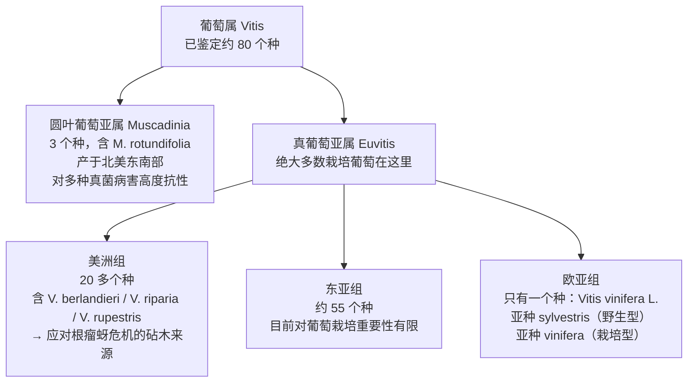
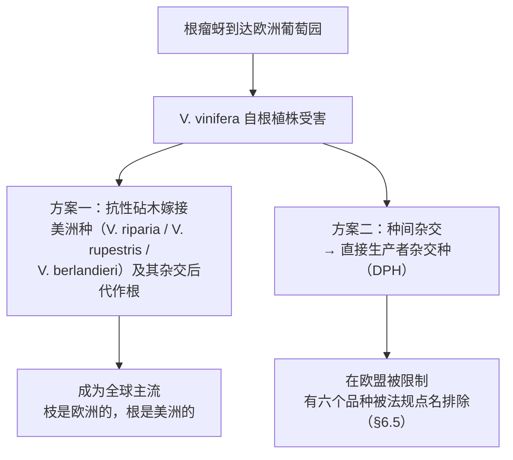
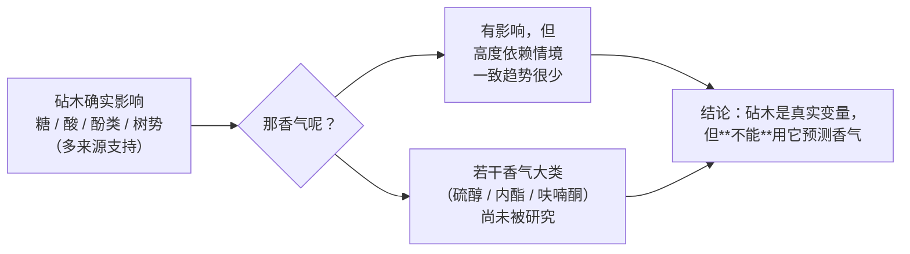

# 第 6 章 葡萄这种植物：物种、砧木与根瘤蚜

> **本章目标**：把"葡萄"这个被随口使用的词拆成**属 → 亚属 → 种 → 品种 → 克隆**五层，
> 然后讲清楚一件几乎所有酒书都会提、但很少讲透的事：
> **为什么今天全世界绝大多数酿酒葡萄，长的是欧洲的枝、美洲的根。**
>
> 这件事不是趣闻。它同时解释了三样东西：
> **砧木为什么是一个真实的酿造变量、法规为什么要点名禁止某些品种、
> 以及"自根老藤"这类卖点到底在卖什么。**

> **适度饮酒，未成年人不饮酒，酒后不驾车。** 本章的 🅐 实操全部不需要开瓶。

## 6.1 先把"葡萄"这个词拆开

日常说的"葡萄"在生物学上对应的是**葡萄属（*Vitis*）**。
根据 OIV 2017 年发布的《世界葡萄品种分布》报告（本书读取的是报告原文）：

三个数字值得记住（都来自这份 OIV 报告）：

| 问题 | OIV 报告的说法 |
|------|--------------|
| 世界上有多少葡萄品种？ | 国际葡萄品种目录（VIVC）收录 **21 045 个品种名**，其中 **12 250 个属于 *V. vinifera***——但其中含大量**同物异名与同名异物**；**实际的 *V. vinifera* 品种数估计约 6 000 个** |
| 常见的有多少？ | 全世界约 **10 000 个已知品种**中，**13 个品种覆盖了超过三分之一**的葡萄园面积，**33 个品种覆盖 50 %** |
| 酿酒葡萄属于哪个种？ | 欧亚组**只有一个种**：*Vitis vinifera*。世界上绝大多数酿酒品种都是它的品种 |

> **第一条实用推论**：**"品种很多"和"你会遇到的品种很多"是两件事。**
> 面积分布高度集中——**33 个品种占一半**。
> 所以按"重要性"学品种是划算的；按"数量"背品种是徒劳的。

> ⚠️ **同一份报告里这两个数并列时要小心**：约 10 000 是**整个葡萄属**的已知品种数，
> 约 6 000 是**estimated 的 *V. vinifera* 品种数**，二者统计口径不同，**不要互相换算**。

[^1]: [葡萄属与欧洲种葡萄](../../glossary.md#vitis-vinifera)（拉：*Vitis* / *Vitis vinifera* L.）。

*Vitis vinifera*[^1] 这个种的基因组在 2007 年由 *Nature* 上的一项工作给出高质量草图，
用的是一个**高度纯合**的基因型。该研究还报告了一件与本书直接相关的事：
**若干与"芳香特征"相关的基因家族出现了显著扩张**。

> **这条为什么值得写进一本品酒书**：第 4 章讲过香气分为三层，
> 其中"一类香气"（品种香）在葡萄里就已经定了。
> 基因组层面的观察给了这条一个更硬的说法：
> **"哪些香气分子能被合成"是写在这个物种的基因里的**，
> 而具体品种之间的差异，是在这个共同基础上的变体。

## 6.2 驯化：人到底选了什么

2023 年 *Science* 上一项用 **3 525 份**栽培与野生葡萄材料做的研究，
给出了目前较新的驯化图景：

- 更新世的严酷气候造成野生葡萄生境碎片化，分化出不同生态型；
- **约 11 000 年前，在西亚与高加索两地同时发生驯化**，分别产出**食用葡萄与酿酒葡萄**；
- 西亚的驯化材料随早期农人进入欧洲，与当地古老野生生态型**发生渐渗**，
  并沿人群迁徙路线分化，到**新石器晚期**形成了麝香（muscat）类与西方酿酒葡萄的祖先谱系；
- 对驯化性状的分析显示，被选择的包括：**浆果适口性、雌雄同株（两性花）、麝香风味、果皮颜色**。

> **"雌雄同株"这条看似不起眼，其实是整件事的关键。**
> 野生葡萄多为雌雄异株（需要两株才能结果），
> 而**栽培型以两性花为主，一株即可自花结实**——
> 这才使"挑一棵好的、把它复制下去"成为可能。
> 换句话说：**先有了可稳定复制的植株，才可能有"品种"这个概念。**

另外两条被选择的性状——**麝香风味**与**果皮颜色**——
正好对应第 4 章的一类香气与第 1 章的花青素。
**它们是被人挑出来的，不是天然如此。** 第 9 章会看到"白葡萄"这件事的分子机制。

## 6.3 根瘤蚜：一只蚜虫改写了全球葡萄园

### 它是什么、怎么造成伤害

**葡萄根瘤蚜**[^2]（*Daktulosphaira vitifoliae*）原产北美。
据 2001 年 *Annual Review of Entomology* 上的经典综述：

[^2]: [葡萄根瘤蚜](../../glossary.md#phylloxera)（拉：*Daktulosphaira vitifoliae*；英：grape phylloxera；法：phylloxéra）。

| 要点 | 综述的说法 |
|------|-----------|
| 生活史 | 兼有**有性**与**无性**世代，有取食**叶瘿**与**根瘤**的不同虫态；并非所有虫态在其分布区内都出现 |
| 关键的宿主差异 | 在 ***V. vinifera*** **品种上以根部虫态为主**；在美洲原产地的其他 *Vitis* 种上**以叶部虫态为主** |
| 伤害机制 | 取食点被**土传次生病原**侵染造成损害；另有虫与植株的生理互作，**但后者研究得并不充分** |
| 主要防治手段 | **源自美洲原生 *Vitis* 的抗性砧木**是首要工具 |
| 其他手段 | **杀虫剂效果有限**，其他方法**未被证实有效** |

> **请注意"伤害机制"那一栏的措辞。**
> 流行说法是"根瘤蚜把根吃死了"，而综述的表述要克制得多：
> 损害在很大程度上来自**取食点被次生病原侵染**，
> 而虫本身与植株的生理互作**"没有被很好地研究"**。
> ——**一件影响了整个行业一百多年的事，机制到 2001 年仍有未尽之处**，
> 这是本书反复想传达的那种"诚实的不确定"。

### 解法：换根，不换枝

既然美洲种的根能与这种蚜虫共存，而欧洲种的果实和风味无可替代，
解法就成了一个工程问题：**把 *V. vinifera* 的枝（接穗）嫁接到美洲种的根（砧木）上。**

OIV 的报告把这段历史概括为：**19 世纪末到 20 世纪中叶的种间杂交**，
产出了**直接生产者杂交种（direct producer hybrids, DPH）**与**砧木**，
并因此显著增加了植物材料的多样性。

### 今天它还在吗

在。2012 年 *Annals of Applied Biology* 的一篇综述指出：

- 全球范围内，根瘤蚜**主要仍靠抗性砧木管理**；
- 在分布受限的产区（**例如澳大利亚**），采用的是**监测、检测与检疫**的组合；
- 并提醒：**抗性砧木作为主要手段的稳固性，未来可能受到两件事的挑战**——
  **根瘤蚜不同克隆系与寄主的互作**，以及**气候变化对葡萄与根瘤蚜分布的影响**。

> **这条对读者的意义**：下次听到"根瘤蚜已经被解决了"，
> 准确的说法是"**它被一套持续维护的工程方案控制着**"。
> 澳大利亚那种"靠检疫把它挡在门外"的做法，
> 也解释了为什么某些产区对葡萄苗、甚至对进入葡萄园的鞋底都有规定。

## 6.4 砧木：一个被低估的酿造变量

砧木[^3]常被当成"防虫用的下半截"，但它实际上是一个**持续起作用的变量**。
2025 年 *Foods* 上一篇专门综述砧木与酒香气关系的文章，
在引言里把砧木的作用概括为：

[^3]: [砧木与接穗](../../glossary.md#rootstock)（英：rootstock / scion；法：porte-greffe / greffon），
    以及[嫁接](../../glossary.md#grafting)（英：grafting）与
    [自根](../../glossary.md#own-rooted)（英：own-rooted；法：franc de pied）。

| 砧木影响什么 | 对成品酒意味着什么 |
|------------|------------------|
| 树势（vigor）与产量 | 间接影响一切（第 11 章） |
| 对环境的适应性（升温、干旱、极端天气频发） | 这是它在气候变化语境下被重新重视的原因 |
| 葡萄的**糖与有机酸**含量 | 直接对应**潜在酒精度**与**感知酸度** |
| 葡萄的**酚类组成** | 对应酒的**颜色、结构与陈年潜力** |

看到这里很容易得出"选对砧木就能改善香气"的结论。**但该综述自己的结论恰恰相反**：

> 综述统计：共有 **33 个砧木**被研究过对挥发性化合物的影响、**29 个**被做过感官评价，
> **但大多数砧木只出现在单独一项研究中**。
> 少数几个（**1103P、110R、3309C、SO4**）被较多地重复研究。
> 尽管有个别较一致的观察（例如 3309C 常伴随更高的 β-大马士酮与乙酸己酯），
> **一致的趋势仍然很少**——砧木对香气化合物浓度的影响**高度依赖具体情境**，
> 同一砧木在不同试验中**并不会系统性地带来相似的变化**。
>
> 该综述还指出一个空白：**挥发性硫醇、内酯与呋喃酮这几类香气，
> 在砧木语境下根本还没有被研究过。**

> **本书的处理**：砧木属于"**真实存在、可以追问、但目前无法据以预测风味**"的变量。
> 遇到"我们用的是某某砧木所以更××"这种说法，
> 正确的反应不是否定，而是问一句：**这个结论来自哪一项试验、在什么条件下？**

## 6.5 法规怎么规定"能种什么"

葡萄品种不是随便种的。欧盟 (EU) No 1308/2013 的两条给出了硬约束
（以下为本书读取法规原文后的复述）：

### Article 81：能不能种

| 条款 | 规定 |
|------|------|
| 第 1 款 | 在欧盟境内生产的葡萄制品，必须来自可按第 2 款分类的品种 |
| 第 2 款 | 成员国负责制定可在其境内**种植、重植或嫁接**用于酿酒的品种目录；入选须满足两条：① 属于 ***Vitis vinifera***，**或**为 ***Vitis vinifera* 与葡萄属其他种的杂交种**；② **不属于被点名排除的六个品种**：**Noah、Othello、Isabelle、Jacquez、Clinton、Herbemont** |
| | 品种被移出目录后，种植者有 **15 年**时间将其拔除 |
| 第 3 款 | 年产量不超过 **50 000 百升**（按前五个葡萄酒年度平均）的成员国，可免于制定目录，但仍须遵守上述物种与排除名单的规定 |
| 第 4 款 | **科研与试验目的**可获豁免 |
| 第 5 款 | 违反上述规定种植的面积**必须拔除**；例外是**仅供酿酒者家庭自用**的酒 |

> **那六个被点名的品种是什么来头？**
> 它们正是 §6.3 提到的**直接生产者杂交种（DPH）**一类——
> 19 世纪末应对根瘤蚜时培育的美洲种杂交后代。
> **法规不是笼统禁止"杂交种"**（第 2 款明确允许 *vinifera* × 其他 *Vitis* 的杂交），
> 而是**逐个点名**排除了这六个。
> **本书未核到欧盟当初逐个排除它们的理由文件，因此不复述任何流传的解释。**

### Article 93：能不能挂产地名

这一条决定了同一片葡萄园的酒能写什么：

| | **PDO（原产地保护）** | **PGI（地理标志保护）** |
|---|---------------------|----------------------|
| 葡萄来源 | **100 % 来自该地理区域** | **至少 85 %** 来自该区域；其余须来自该成员国或第三国境内 |
| 生产地点 | 必须在该区域内完成 | 必须在该区域内完成 |
| **品种限制** | **只能用 *Vitis vinifera* 的品种** | ***Vitis vinifera*，或 *Vitis vinifera* 与葡萄属其他种的杂交种** |
| 品质与产地的关系 | 品质与特征"**本质上或完全归因于**特定地理环境（含其固有的自然与人文因素）" | 具有"**可归因于该地理来源**的特定品质、声誉或其他特征" |

（Article 93(4) 另规定：对 PDO 而言，"生产"涵盖**从采收到酿造过程完成**为止。）

> **这是本书第一次看到"品种"被写进产地制度的核心条款**，值得停一下：
> **PDO 与 PGI 的差别不只是"范围大小"，还包括允许用什么植物材料。**
> 这条在第 19、20 章会反复用到。

> ⚠️ **各国规则并不一致。** 上面是欧盟的写法。
> 美国的 AVA 体系、中国、澳洲的对应规定本书尚未核对原文，
> **不要把欧盟的条文当成世界通则**——这是本书的第 8 条纪律。

## 6.6 品种是怎么被复制的：无性繁殖与突变

一个品种要保持"是它自己"，靠的不是种子（种子是有性繁殖，后代会变），
而是**无性繁殖**：扦插或嫁接，把同一株植物的组织复制下去。

这带来一个有意思的后果，OIV 的报告写得很直白：
**葡萄的自然基因突变很常见，而持续的无性繁殖会把这些突变保留并扩散下去。**

最干净的例子是**颜色突变**。2006 年一项研究报告：
**白皮的 Pinot Blanc 相对黑皮的 Pinot Noir，缺失了那个有功能的 *VvmybA1c* 等位基因**
——Pinot Noir 在该位点是杂合的（一个无功能的 *VvmybA1a*、一个有功能的 *VvmybA1c*），
而 Pinot Blanc 只剩前者。**一次缺失，换一个"品种名"。**
（这一条的分子机制见第 9 章 §9.1。）

于是"品种"内部还有一层：

| 层级 | 含义 | 谁在管 |
|------|------|-------|
| **品种（variety / cépage）** | 遗传上可区分的栽培类型 | 法规目录（§6.5） |
| **克隆（clone）** | 同一品种中，由某一株经无性繁殖扩繁、带有特定突变组合的一群 | 各国的**克隆选种**体系（本书尚未核对其原文规程）|
| **马萨尔选种（sélection massale）** | 从老园里挑一批表现好的植株一起繁殖，保留园内多样性 | **行业惯例**，不是法规术语 |

> **诚实说明**：克隆编号（酒农口中的"某某号克隆"）与马萨尔选种的具体规程，
> **本书尚未核到可引用的一手出处**，因此本章只写它们**是什么层级的概念**，
> 不写任何"某号克隆更好"的结论。
> 相关待办已登记进[出处与资料登记](../../standards.md)。

## 6.7 常见说法辨析

按本书约定标注**证据强度**：✅ 有共识 / ⚠️ 有争议 / ❌ 明确错误 / 缺乏证据。

| 说法 | 判定 | 说明 |
|------|------|------|
| "全世界的酿酒葡萄基本都是同一个种" | ✅ **有共识** | OIV：欧亚组**只有一个种** *Vitis vinifera*，绝大多数酿酒品种属于它 |
| "葡萄品种成千上万，所以品种是学不完的" | ⚠️ **只说对了一半** | 品种数确实大（VIVC 收录 21 045 个名字），但**13 个品种覆盖超过三分之一面积、33 个覆盖一半**。**分布极度集中** |
| "嫁接是为了让酒更好喝" | ❌ **归因错误** | 嫁接的起点是**抗根瘤蚜**（Granett 等 2001：抗性砧木是首要防治工具）。砧木确实影响糖、酸、酚类与树势，但**那是后来被重新认识的用途** |
| "换个砧木就能换来某种香气" | **缺乏证据** | 2025 年砧木—香气综述的结论：影响**高度依赖情境**、**一致趋势很少**；多数砧木只被研究过一次；**硫醇、内酯、呋喃酮类根本尚未被研究** |
| "自根老藤的酒一定更好" | **缺乏证据** | 自根（franc de pied）是一个**可核实的事实陈述**，但"更好"需要证据。而且本书在已核对的欧盟条文中**未见到"老藤"的法定年限定义**（与第 4 章的结论一致）|
| "根瘤蚜已经被彻底解决了" | ⚠️ **过于乐观** | 2012 年综述明确提醒：抗性砧木体系的稳固性**可能受根瘤蚜克隆系差异与气候变化挑战**；部分产区（如澳大利亚）仍靠**监测与检疫**管理 |
| "根瘤蚜把葡萄根吃死了" | ⚠️ **简化过头** | 2001 年综述的说法是：损害很大程度来自**取食点被土传次生病原侵染**；虫与植株的生理互作**研究并不充分** |
| "欧盟禁止一切杂交葡萄" | ❌ **明确错误** | (EU) No 1308/2013 Art. 81(2) **明确允许** *Vitis vinifera* 与葡萄属其他种的杂交种进入成员国目录；被禁的是**点名的六个品种**（Noah、Othello、Isabelle、Jacquez、Clinton、Herbemont）|
| "PDO 和 PGI 的差别就是范围大小" | ❌ **不完整** | Art. 93 里至少还有两条硬差别：**葡萄 100 % vs 至少 85 %**，以及 **PDO 只能用 *V. vinifera*、PGI 允许种间杂交种** |
| "同一个品种，哪里种都一样" | ❌ **与本部分后续证据矛盾** | 第 8 章会给出一项同时比较气候、土壤与品种的研究：**气候与土壤的影响大于品种**（van Leeuwen 等 2004）|
| "克隆是人工改造的转基因" | ❌ **概念混淆** | 克隆是**无性繁殖**——把自然发生的突变保留下来（OIV：葡萄的自然突变常见，且被持续的无性繁殖保留）。Pinot Blanc 相对 Pinot Noir 的颜色差异就是一次**自然发生的等位基因缺失** |

## 6.8 思考题

1. 请用一句话说明：为什么"雌雄同株（两性花）"这个被驯化选择的性状，
   是"品种"这个概念得以存在的前提？
2. 根瘤蚜在 *V. vinifera* 上以**根部**虫态为主，在美洲原生 *Vitis* 上以**叶部**虫态为主。
   这个差异如何解释"嫁接"这个解法？
   （提示：受害的是哪个器官，被换掉的又是哪个器官。）
3. 2025 年那篇砧木综述既说"砧木显著影响糖、有机酸与酚类"，
   又说"对香气的影响很少有一致趋势"。这两句话矛盾吗？为什么？
4. **【案例】** 某进口商的商品页写着：
   *"本园为百年自根老藤，未经嫁接，因此保留了葡萄最纯粹的原始风味；
   我们采用欧洲禁止的古老杂交品种酿造，风味独一无二；
   砧木选用 110R，赋予酒体更好的矿物感。"*
   请指出其中**至少四处**问题（注意：其中一处是**内部自相矛盾**），并逐句改写。
5. **【案例】** 一位店员说："这瓶是 PGI 的，比 PDO 便宜，
   区别只是产区划得大一点，品质其实一样。"
   请用 Article 93 的条文指出这句话漏掉了什么。
   （提示：至少有两条硬性差别与"范围大小"无关。）
6. **【查证】** 去查一个你感兴趣的品种在**国际葡萄品种目录（VIVC）**里的记录：
   它的主名、同物异名（synonyms）有多少个、有没有已知的亲本关系。
   然后回答：**为什么 OIV 说 21 045 个"名字"里含有大量同物异名与同名异物？**
   这件事对"看酒标认品种"有什么实际影响？
7. 假设你在一份产区法规里看到"本产区允许种植的品种为……"这样一份名单。
   请说明这份名单**同时**受到哪两层约束（提示：一层来自欧盟法规，一层来自产区自己）。

> 📖 **参考答案**（想清楚再看）：[Q1](../../qa/06-grapevine-rootstock-phylloxera-qa.md#q1) ·
> [Q2](../../qa/06-grapevine-rootstock-phylloxera-qa.md#q2) ·
> [Q3](../../qa/06-grapevine-rootstock-phylloxera-qa.md#q3) ·
> [Q4](../../qa/06-grapevine-rootstock-phylloxera-qa.md#q4) ·
> [Q5](../../qa/06-grapevine-rootstock-phylloxera-qa.md#q5) ·
> [Q6](../../qa/06-grapevine-rootstock-phylloxera-qa.md#q6) ·
> [Q7](../../qa/06-grapevine-rootstock-phylloxera-qa.md#q7)

## 6.9 本章实操

🅐 档**全部不需要开瓶喝酒**。

### 🅐 无器具版 · 任务一：查一个品种的"身份证"

**去查国际葡萄品种目录（VIVC，由德国 Julius Kühn-Institut 维护的公开数据库）**，
挑 **3 个**品种（建议：一个你常喝的、一个你只听过名字的、一个中文名很陌生的），填下表。

| 品种 | 数据库里的主名（prime name）| 同物异名数量 | 所属种 | 已知亲本 | 我原本以为的写法对吗 |
|------|--------------------------|------------|-------|---------|-------------------|
| 1 | | | | | |
| 2 | | | | | |
| 3 | | | | | |

完成后回答：

- 你查的三个品种里，有没有哪一个的"中文习惯译名"其实对应数据库里的**另一个名字**？
- 如果酒标上写的是同物异名（例如同一个品种在两个国家叫不同名字），
  **你还能认出它吗**？这对"按品种买酒"意味着什么？

### 🅐 无器具版 · 任务二：读法规里的那六个名字

打开 (EU) No 1308/2013 的 Article 81（欧盟法规原文可在官方数据库检索；
本书读取的是其通过版原文），找到被点名排除的六个品种，然后：

| 问题 | 我的记录 |
|------|---------|
| 六个品种的原文拼写 | |
| 第 2 款允许的两类品种是什么 | |
| 被移出目录后，给种植者多长的拔除期 | |
| 第 3 款的豁免门槛是多少百升 | |
| 第 5 款唯一的例外情形是什么 | |

> **这个任务的真正目的**：让你**亲眼看到一份法规是怎么写的**——
> 它不讲风味、不讲品质，只讲**谁可以做什么**。
> 第四部分全部建立在这种阅读能力上。

### 🅐 无器具版 · 任务三：把"砧木话术"翻译成可追问的问题

找 **3 段**提到葡萄园层面卖点的文案（自根、老藤、某某砧木、某某克隆都算），
按下表拆解。

| # | 原文照抄 | 它陈述的**事实**部分（可核实） | 它给出的**因果**部分（需要证据） | 我会追问的一句话 |
|---|---------|---------------------------|-----------------------------|---------------|
| 1 | | | | |
| 2 | | | | |
| 3 | | | | |

> **拆解要领**："自根"是事实，"所以更纯粹"是因果；
> "砧木是 110R"是事实，"所以更有矿物感"是因果。
> **事实部分可以向卖家核实，因果部分需要证据——而本章告诉你，这类证据目前很薄。**

### 🅑 有条件版 · 任务四：同品种、不同产地的对照（备齐后再做）

**所需**：**2 支**同一品种、不同国家/产区的酒（价位尽量接近）、两只同款杯、
[品鉴记录表](../../forms/tasting-note.md)两份。

**适度饮酒，未成年人不饮酒，酒后不驾车。** 每杯 20~30 mL 即可完成记录。

用 P1 建立的六维坐标，先**盲打分**再看酒标：

| 维度 | 酒甲（产地 ____）| 酒乙（产地 ____）| 差值 |
|------|----------------|----------------|------|
| 甜 | | | |
| 酸 | | | |
| 涩 | | | |
| 苦 | | | |
| 酒精感 | | | |
| body | | | |

然后回答一个本章留下、**第 8 章才会回答**的问题：

> 这两支酒的差异，你会归给**品种**、**气候**、**土壤**，还是**酿造**？
> 请写下你的归因和理由——**第 8 章读完再回来看一次这张表。**
> （剧透：有一项研究发现，气候与土壤的影响**大于**品种。）

## 6.10 🔎 买酒与点酒时的用处

1. **按面积集中度学品种**。33 个品种覆盖全球一半葡萄园——
   先把常见的那一批挂到第一部分的坐标上，比背名单有效得多。
2. **看到"自根""老藤""某号克隆"，先分清事实与因果**。
   事实可以向卖家核实（并且他们通常乐意回答），因果目前缺乏可引用的证据。
3. **"砧木"是可以追问但不能据以预测风味的变量**。
   如果对方能说出具体试验条件，那是一次高质量的对话；说不出，就当它是信息噪声。
4. **PGI 比 PDO 便宜，不只是因为"范围大"**。
   还包括**允许 15 % 葡萄来自区域外**与**允许种间杂交品种**——
   这两条都实实在在影响成本结构（第 40 章）。
5. **在欧盟市场看到没听过的"古老品种"，先确认它是否在成员国目录内**。
   合法销售的酒一定满足 Article 81；
   反过来，"欧洲禁止的品种"这种卖点本身就与它能在欧盟销售这件事冲突。
6. **遇到根瘤蚜相关的产区规定（苗木检疫、参观限制），那是防疫而不是仪式**。
   澳大利亚那类做法直接写在管理体系里。

## 6.11 本章依据

### A. 已核对原文的法规

- **(EU) No 1308/2013 Article 81**（本章核对）：成员国分类制度；
  可入选者须属于 *Vitis vinifera* 或为 *Vitis vinifera* 与葡萄属其他种的杂交种，
  且**不得**为 Noah、Othello、Isabelle、Jacquez、Clinton、Herbemont 六者；
  移出目录后 **15 年**拔除期；**50 000 百升**以下的成员国豁免制定目录；
  科研试验豁免；违规面积须拔除，例外为**仅供酿酒者家庭自用**。
- **(EU) No 1308/2013 Article 93**（本章核对）：PDO 葡萄 **100 %** 来自该区域、
  **只能用 *Vitis vinifera***；PGI **至少 85 %**、允许 *Vitis vinifera* 与其他 *Vitis* 的杂交种；
  两者的生产均须在该区域内完成；PDO 的"生产"涵盖**从采收到酿造完成**。

### B. 已核对原文的国际组织出版物

- **OIV《世界葡萄品种分布》（Focus OIV 2017）**：*Vitis* 属已鉴定约 **80 个种**；
  分 **Muscadinia**（3 个种，含 *M. rotundifolia*，产于北美东南部，对主要真菌病害高度抗性）
  与 **Euvitis** 两个亚属；Euvitis 分**美洲组**（20 多个种，含 *V. berlandieri*、*V. riparia*、
  *V. rupestris*，用作应对根瘤蚜危机的砧木）、**东亚组**（约 55 个种，目前对葡萄栽培重要性有限）
  与**欧亚组**（**仅 *Vitis vinifera* 一个种**，含 *sylvestris* 与 *vinifera* 两个亚种）；
  **VIVC 收录 21 045 个品种名，其中 12 250 个为 *V. vinifera***，含大量同物异名与同名异物，
  **实际 *V. vinifera* 品种数估计约 6 000**；全球约 **10 000 个已知品种**中
  **13 个覆盖超过三分之一面积、33 个覆盖 50 %**；
  19 世纪末至 20 世纪中叶的种间杂交产生了**直接生产者杂交种（DPH）与砧木**；
  **葡萄的自然突变常见，并被持续的无性繁殖保留**。

### C. 已核对摘要的同行评议文献

- **根瘤蚜生物学与防治**：Granett, J.; Walker, M. A.; Kocsis, L.; Omer, A. D.
  "Biology and management of grape phylloxera", *Annual Review of Entomology* **46** (2001) 387–412
  （有性/无性世代与叶瘿、根瘤虫态；**根部虫态在 *V. vinifera* 上占优、叶部虫态在美洲原生
  *Vitis* 上占优**；损害经**土传次生病原**侵染取食点造成，生理互作研究不充分；
  **源自美洲原生 *Vitis* 的抗性砧木是首要防治工具**；杀虫剂效果有限）。
- **根瘤蚜的现代管理**：Benheim, D. 等，"Grape phylloxera (*Daktulosphaira vitifoliae*)
  — a review of potential detection and alternative management options",
  *Annals of Applied Biology* **161** (2012) 91–115
  （全球以抗性砧木为主；**澳大利亚等分布受限产区靠监测、检测与检疫**；
  砧木体系的稳固性可能受**克隆系差异与气候变化**挑战）。
- **葡萄基因组**：Jaillon, O. 等，"The grapevine genome sequence suggests ancestral
  hexaploidization in major angiosperm phyla", *Nature* **449** (2007) 463–467
  （以高度纯合基因型获得高质量草图；**若干与芳香特征相关的基因家族显著扩张**）。
- **驯化史**：Dong, Y. 等，"Dual domestications and origin of traits in grapevine evolution",
  *Science* **379** (2023) 892–901（**3 525 份**材料；**约 11 000 年前在西亚与高加索同时驯化**，
  分别产出食用与酿酒葡萄；随早期农人入欧并与西部野生生态型渐渗；
  驯化性状分析涉及**浆果适口性、雌雄同株、麝香风味与果皮颜色**）。
- **砧木与香气**：Farris, L.; Marguerit, E.; Lytra, G.; Barbe, J.-C.
  "Rootstock Influence on Wine Aroma Compounds and Sensory Perception: A Review",
  *Foods* **14** (2025) 3593（砧木起源于抗根瘤蚜，现影响树势、产量、环境适应性、
  糖与有机酸、酚类组成；**香气方面 33 个砧木被测挥发物、29 个被做感官，
  多数只出现在单独一项研究中；一致趋势很少；挥发性硫醇、内酯、呋喃酮尚未被研究**）。
- **颜色的体细胞突变**：Yakushiji, H. 等，"A skin color mutation of grapevine, from
  black-skinned Pinot Noir to white-skinned Pinot Blanc, is caused by deletion of the
  functional VvmybA1 allele", *Biosci. Biotechnol. Biochem.* **70** (2006) 1506–1508。

### D. 本章有意留白的地方

- **欧盟排除那六个品种的具体理由**：本书未核到可引用的官方说明文件，因此不复述任何流传的解释。
- **克隆选种与马萨尔选种的规程**：未核到一手出处，本章只写概念层级，不做优劣判断。
- **各砧木的具体特性**（耐石灰、耐旱、耐盐等）：本书只核到"砧木影响适应性"这一层级的表述，
  **具体砧木的具体指标未核**，因此正文不写。
- **欧盟以外的品种准入规则**：美国、中国、澳洲的对应规定待第四部分核对。

以上每一条的完整题录、DOI 与核对状态，见[出处与资料登记](../../standards.md)。

---

**下一章预告**：品种与砧木定下了"这株葡萄能做什么"，
接下来是**一年之内实际发生了什么**——
第 7 章讲物候期与**糖酸的反向运动**，
以及为什么"什么时候采收"是全书最典型的一个**取舍问题**。
