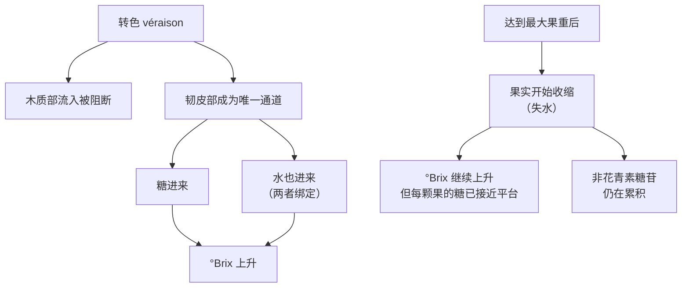
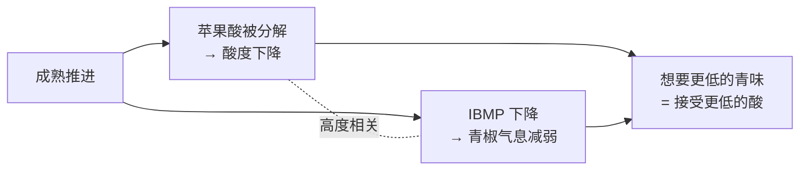

# 第 7 章 从萌芽到采收：物候期与糖酸的反向运动

> **本章目标**：把"一年"讲成一条**可以标刻度的时间轴**，
> 然后回答两个买酒时真正有用的问题：
>
> - **糖上去、酸下来**这件事在葡萄里究竟怎么发生的？
> - 既然如此，**"什么时候采收"为什么不存在唯一正确答案**？
>
> 本章还会给出一个反直觉但很硬的结论：
> **糖度（°Brix）升高，不一定等于葡萄里的糖变多了。**

> **适度饮酒，未成年人不饮酒，酒后不驾车。** 本章的 🅐 实操全部不需要开瓶。

## 7.1 为什么需要"编号的"物候期

"发芽了""开花了""转色了"这类说法，和第 1 章批评过的"这酒很厚实"是同一种毛病：
**不可比较**。同一句"开花了"，可能指刚看见花帽松动，也可能指花已经落完。

所以葡萄栽培学有**编号系统**[^1]。1995 年，*Australian Journal of Grape and Wine Research*
创刊卷上**连着发表了两套**：

[^1]: [物候期与编号系统](../../glossary.md#phenology)（英：phenology；
    改良 E-L 系统 modified Eichhorn-Lorenz system；扩展 BBCH 尺度 extended BBCH scale）。

| 系统 | 文献 | 特点 |
|------|------|------|
| **改良 E-L 系统**（modified Eichhorn–Lorenz） | Coombe, B. G. "Growth Stages of the Grapevine: Adoption of a system for identifying grapevine growth stages", *AJGWR* **1** (1995) 104–110 | 葡萄专用，澳洲与英语文献中常见 |
| **扩展 BBCH 尺度** | Lorenz, D. H. 等 "Growth Stages of the Grapevine: Phenological growth stages of the grapevine (*Vitis vinifera* L. ssp. *vinifera*) — Codes and descriptions according to the extended BBCH scale", *AJGWR* **1** (1995) 100–103 | 与其他作物通用的两位数编码体系 |

BBCH 的几个关键编码（**本书转引自一篇 2019 年引用 Lorenz 等 1995 的开放获取论文的表格，
未读到 1995 年原文**）：

| BBCH 码 | 描述 |
|--------|------|
| **05** | 芽鳞内的绒毛（"棕色绒球"）清晰可见——**萌芽启动** |
| **15** | 五片叶展开 |
| **60** | **首批花帽从花托脱离——开花** |
| **73** | 果粒长到"麦粒"大小——**坐果开始** |
| **75** | 果粒长到"豌豆"大小 |
| **81** | **成熟开始——转色（véraison）** |
| **89** | 果实达到可采收的成熟度 |

> **为什么本书要在一本品酒书里写这些编码**：
> 因为你以后会在**产区法规、年份报告与技术表**里看到它们。
> 当一份年份报告写"该年 BBCH 81 较均值提前 12 天"，
> 它说的是**转色提前了 12 天**——这是一句**可核对的陈述**，
> 而不是"那年天气很好"这种无法验证的话。

## 7.2 一年的时间轴


这条轴上有**两个关键节点**，其余都是过渡：

- **开花（BBCH 60）**：这一年能结多少果，很大程度上在这几天决定；
- **转色（véraison，BBCH 81）**[^2]：**全年的转折点**——下一节专讲。

[^2]: [转色](../../glossary.md#veraison)（法：véraison；英：veraison / onset of ripening）。

## 7.3 转色：一次"供水系统的切换"

转色不只是"变颜色"。它是浆果**物质来源发生切换**的时刻。

Coombe 与 McCarthy 在 2000 年的一篇分析里，把浆果重量拆成
**"非溶质（主要是水）"与"溶质（主要是糖）"**两部分来重新审视两组试验数据，
结论对理解"成熟"非常关键（以下为本书读取该文摘要后的复述）：

| 观察 | 说明 |
|------|------|
| 浆果呈典型的**双 S 形（double-sigmoid）体积-时间曲线** | 两次膨大之间有一个平台期 |
| **转色之后木质部（xylem）流入被阻断** | 因此"每颗果里的溶质随时间的变化"可以用来指示**韧皮部（phloem）的运输活动** |
| 在第一组试验（Muscat Gordo Blanco）中，不同开花时间的果实体积增幅差异很大，**但转色后的 °Brix 曲线几乎重合** | 因为**溶质的增速与体积的增速成正比** |
| 由此得出：**转色后，糖与水的增量是绑定的，来自同一个来源——韧皮部汁液** | 这是本节最重要的一句 |
| 第二组试验（Shiraz，灌溉处理）：果实在**花后 91 天、约 20 °Brix** 达到最大重量后**开始收缩** | 此时"每颗果的溶质"曲线先减速、后进入平台——说明**韧皮部流入受阻** |
| 在收缩期（果实似乎已与维管运输隔离）**非花青素类糖苷仍在累积** | 作者指出这对**风味物质的积累**研究有意义 |



> **本章最该记住的一条反直觉结论**：
>
> > **°Brix 升高，不一定等于糖变多。**
>
> 在果实收缩阶段，**每颗果里的溶质总量已接近平台，而水在减少**——
> 糖度照样往上走。
> 所以"我们等到 25 °Brix 才采"这句话，可能意味着"糖进来了很多"，
> **也可能意味着"水跑掉了不少"**。两者对酒的意义完全不同（后者浓缩了一切，包括缺点）。

## 7.4 糖上去、酸下来：两条不同的曲线

"糖酸反向运动"是这一章标题里的说法，但它其实是**两个独立过程**，
只是恰好在同一段时间里发生。

### 糖这一边

见上一节：转色后靠**韧皮部**输入，糖与水绑定；到某一点后流入受阻，果实开始失水浓缩。

### 酸这一边

葡萄里最主要的两种有机酸是**酒石酸**与**苹果酸**（第 1 章）。
关于**苹果酸**，2009 年 *Phytochemistry* 上一篇专门讨论浆果苹果酸代谢的综述给出了框架
（以下为本书读取其摘要后的复述）：

- 有机酸存在于所有植物，**种类与积累量在物种、发育阶段与组织之间差异极大**；
- 果实的酸味总体上来自**柠檬酸、苹果酸、草酸、奎宁酸、琥珀酸、酒石酸**等释放的质子，
  而各自的**阴离子形式又各有独特的味道**；
- 酸度**强烈影响作物品质，并且是决定采收日期的重要因素——对酿酒葡萄尤其如此**；
- 在葡萄中，**苹果酸是最主要的酸之一**，其积累**很大程度上来自果实内的从头合成**
  （以叶片运来的同化物为原料，加上果实自身的光合作用）；
- **成熟过程中苹果酸被分解**，该综述整合转录组、蛋白与酶活数据来梳理这些分解途径，
  并提出**丙酮酸是苹果酸分解过程中的重要中间体**。

> ⚠️ **本书在这里刻意留白**：
> **酒石酸在成熟期的定量变化，本书尚未核到可引用的一手出处**，
> 因此正文只写苹果酸。
> 你在很多资料里会读到"酒石酸稳定、苹果酸被呼吸掉"——
> 前半句本书暂时**不写死**，已登记进[出处与资料登记](../../standards.md)的待办清单。

### 一个个案：气候与酸度

OIV 的品种报告在写 **Tempranillo** 时有一句直接的表述：
**"在温暖气候下，Tempranillo 产出颜色深、酒精度高、酸度低的酒"**，
并补充这些特征**随产量提高而减弱**。

> **本书对这条的用法**：它是**一个品种在 OIV 报告中的描述**，
> **不是"温度越高酸越低"的普适定量规律**。
> 本书目前没有可引用的一手定量关系，所以只写方向、只标个案。

## 7.5 采收日期：三种"成熟度"的取舍

如果只有糖一个指标，采收就是个算术题。麻烦在于**至少有三条曲线同时在动**，
而它们**并不同时到达你想要的位置**。

| "成熟度" | 指什么 | 可测吗 | 本书的证据状态 |
|---------|-------|-------|--------------|
| **工艺成熟度**（糖与酸）| °Brix / 可滴定酸 / pH | **可测，且便宜** | ✅ 成熟指标本身没有争议；但见 §7.3 的"°Brix 陷阱" |
| **香气成熟度** | 香气分子与前体的变化 | 部分可测（需仪器）| ✅ 有一个非常清楚的例子，见下 |
| **酚类成熟度** | 单宁与花青素的量与质地 | 有方法，但**判据不统一** | ⬜ **本书未核到一致的、可引用的一手判据，因此不给任何指标** |

### 香气成熟度：一个干净的例子

第 4 章引用过的 Roujou de Boubée 等（2000）在研究**甲氧基吡嗪（IBMP，青椒气息）**时，
除了给出"红葡萄酒中该特征变明显的阈值约 **15 ng/L**"，还报告了一条与本章直接相关的观察：

> **成熟过程中 IBMP 的下降，与苹果酸的分解高度相关；
> 且这种相关性与品种、土壤类型、天气条件无关。**

这条为什么重要：



**"想要青味更少"和"想要酸度更高"在时间上是互相拉扯的。**
这就是本章说的"取舍"最具体的一个例子——
**它不是风格偏好问题，是同一条时间轴上的两个位置。**

（还有一个更简单的取舍：等得越久，糖越高 → 潜在酒精度越高。第 3 章算过这笔账。）

### 那"等到风味成熟"是什么意思？

行业里常说"等 phenolic ripeness / 风味成熟"。本书的处理是：

- **"香气与风味在成熟过程中确实有变化"**——✅ 有证据
  （上面的 IBMP 就是；Coombe 与 McCarthy 在 1997 年还专门发表过一篇
  《识别与命名成熟浆果中香气发育的起点》，**本书未读到原文，因此不复述其命名与判据**）；
- **"存在一个可操作的、公认的'风味成熟'判据"**——⬜ **本书未核到**。
  所以正文不写任何"尝到 X 就说明熟了"的口诀。

## 7.6 温度的账：积温与气候指数

气候对物候的影响最常被量化成**积温**[^3]（growing degree days, GDD）：
把生长季里每天超过某个基准温度的部分累加起来。

[^3]: [积温](../../glossary.md#growing-degree-days)（英：growing degree days, GDD；
    亦称 degree days / 生长度日）。

**基准取多少？** 本书目前核到的一手用法是：
van Leeuwen 等（2004）在同时评估气候、土壤与品种影响的研究中，
用的是 **以 10 ℃ 为基准的 degree days**，
与之并列的气候变量还有**最高/最低气温、日照时数、参考蒸散量（ETo）、降水与水分平衡**。

> ⚠️ **本书不给各类气候指数的分级阈值**（例如"某某指数多少以上算温暖产区"）。
> 世界范围内存在多套体系——
> Tonietto 与 Carbonneau 在 2004 年 *Agricultural and Forest Meteorology* 上
> 提出过一套**多准则的全球葡萄产区气候分类系统**（本书只核到题录，未读到原文）——
> **在没有读到原文之前，写阈值就是在编。**

积温有用，但它有三个已知的局限，读年份报告时要记住：

| 局限 | 说明 |
|------|------|
| 它是**累加量** | 同样的积温可以来自"整季温和"或"几波极端高温"，对葡萄的意义完全不同 |
| 它**只管温度** | 而下一章会给出证据：**水分状况**才是很多风味差异的中介变量 |
| **基准与统计口径必须一起看** | 基准 10 ℃ 与其他基准的数字**不能直接比较**（第 1 章的老规矩：任何数字都要问条件）|

## 7.7 气候变化：成熟提前是实测出来的

这不是预测，是**已经被记录下来的趋势**。

2018 年 *Australian Journal of Grape and Wine Research* 上的一项研究
（以下为本书读取其摘要后的复述）：

- 使用**澳大利亚 13 个产区、31 个葡萄园地块**的园区记录，配合网格化温度数据；
- 结果：**所有被考察的地块与产区都出现了成熟提前的趋势，
  同时生长季平均温度上升**；趋势的幅度**因品种与产区而异**；
- 另一项被检验的假设是"采收期被压缩"（不同品种的采收时间彼此靠近）——
  **在一半的产区中观察到了压缩**；
- 作者的结论包括一句很直白的话：**在创纪录的升温背景下，更早成熟正在成为新常态。**

（更早的同类工作：Webb, L. B.; Whetton, P. H.; Barlow, E. W. R.
"Observed trends in winegrape maturity in Australia", *Global Change Biology* **17** (2011) 2707–2719，
**本书只核到题录与标题结论**。）

> **这对买酒的人意味着什么？**
> 三件很具体的事：
>
> 1. **同一个产区的"典型风格"是会移动的**——十年前的产区印象可能已经过期；
> 2. **年份之间的差异有了方向性**，不再是纯随机波动；
> 3. **"采收期压缩"是一个供应链问题**：不同品种同时成熟 → 采收与压榨设备排队 →
>    影响的是**操作质量**，而不只是葡萄本身。

## 7.8 常见说法辨析

按本书约定标注**证据强度**：✅ 有共识 / ⚠️ 有争议 / ❌ 明确错误 / 缺乏证据。

| 说法 | 判定 | 说明 |
|------|------|------|
| "糖度越高说明葡萄糖分积累越多" | ❌ **不一定** | 达到最大果重后果实**收缩失水**，此时每颗果的溶质已接近平台，**°Brix 仍会继续上升**（Coombe & McCarthy 2000）|
| "转色只是变颜色" | ❌ **明确错误** | 转色后**木质部流入被阻断**，糖与水都改由**韧皮部**输入——这是浆果**供应系统的切换** |
| "晚采能同时得到更熟的风味和足够的酸度" | ❌ **与证据矛盾** | IBMP（青味）的下降与**苹果酸的分解高度相关**（Roujou de Boubée 等 2000）——**两者在时间上互相拉扯** |
| "酸度下降是因为糖把酸'稀释'了" | ⚠️ **混淆了两件事** | 苹果酸在成熟中**被代谢分解**（Sweetman 等 2009 的综述主题），这是代谢过程；浓度当然也受水分变化影响，但**不能用稀释解释分解** |
| "老资料里说酒石酸稳定、苹果酸被消耗" | **本书暂不表态** | 苹果酸被分解有一手综述支持；**酒石酸的定量变化本书未核到一手出处**，因此不写死 |
| "积温够了就能成熟" | ⚠️ **不充分** | 积温是**累加量**，无法区分"温和的一季"与"几波极端高温"；而且下一章会给出证据：**水分状况是关键中介** |
| "看到'积温 1600'就知道是温暖产区" | ❌ **缺条件** | **基准温度与统计口径必须一起给**。本书目前核到的一手用法是 **base 10 ℃**（van Leeuwen 等 2004）；各类气候分类体系的阈值本书未核到原文，**不写** |
| "风味成熟有明确判据，酿酒师尝一颗就知道" | **缺乏证据** | "成熟中风味会变"有证据（IBMP 那条很清楚）；但**可操作的公认判据本书未核到**。这是一条**经验与惯例**，不是已建立的指标 |
| "温暖气候的酒酸度低" | ⚠️ **方向常见但本书只当个案** | OIV 报告对 **Tempranillo** 写明"温暖气候下颜色深、酒精高、酸度低"，这是**一个品种的描述**；本书没有可引用的普适定量关系 |
| "气候变暖对葡萄成熟的影响还只是预测" | ❌ **明确错误** | 澳大利亚 13 个产区、31 个地块的园区记录显示**成熟提前的趋势已经出现**，且一半产区出现**采收期压缩**（2018）|
| "年份好坏就是那年热不热" | ⚠️ **过度简化** | 至少还要看**开花期天气（决定坐果）、水分状况、极端事件**——本章与第 8 章都会给出理由 |

## 7.9 思考题

1. 用一句话解释：为什么转色之后，"每颗果里的溶质随时间的变化"可以用来指示韧皮部的活动？
   （提示：另一条通道发生了什么？）
2. 某酒庄说"我们比邻居晚采两周，糖度从 23 升到 26 °Brix，浓缩度更好"。
   请说出这句话**至少两种**可能的物质解释，并说明它们对酒的意义有什么不同。
3. 为什么说"想要更少的青椒味"和"想要更高的酸度"在采收决策上是互相拉扯的？
   请写出这条推理链，并指出其中哪一步是有一手文献支持的。
4. **【案例】** 某年份报告写道：
   *"本年度生长季积温达 1 750，显著高于均值，是近十年最佳年份；
   转色期比常年提前，我们得以在最佳风味成熟度采收；
   由于晚采，本年份酒款同时具备高酸与成熟风味。"*
   请指出其中**至少四处**需要追问或站不住的地方，并写出你会问的问题。
5. **【案例】** 一位朋友说："气候变暖不影响品质，反正酒庄可以提前采收。"
   请用本章 2018 年那项研究的结果回应他——注意其中有一条结果他多半没想到。
6. **【查证】** 找一份公开的年份报告（酒庄、产区管理机构或专业媒体都行），
   看它是否给出了：① 物候期日期（萌芽/开花/转色/采收）；② 积温**及其基准温度**；
   ③ 降水或水分状况。
   把缺失的项列出来，并回答：**缺了哪一项之后，这份报告就无法与其他年份比较？**
7. 假设两块相邻地块的采收日期相差 10 天。请列出**至少四个**可能的原因
   （提示：本章与第 6 章各能提供两个）。

> 📖 **参考答案**（想清楚再看）：[Q1](../../qa/07-phenology-and-ripening-qa.md#q1) ·
> [Q2](../../qa/07-phenology-and-ripening-qa.md#q2) · [Q3](../../qa/07-phenology-and-ripening-qa.md#q3) ·
> [Q4](../../qa/07-phenology-and-ripening-qa.md#q4) · [Q5](../../qa/07-phenology-and-ripening-qa.md#q5) ·
> [Q6](../../qa/07-phenology-and-ripening-qa.md#q6) · [Q7](../../qa/07-phenology-and-ripening-qa.md#q7)

## 7.10 本章实操

🅐 档**全部不需要开瓶喝酒**。

### 🅐 无器具版 · 任务一：自己算一次积温

找一个你感兴趣的城市（或产区所在城市）的**公开气温数据**（气象部门网站即可），
取某一年 **4 月 1 日至 10 月 31 日**（北半球）的日平均气温，按下式累加：

```
GDD = Σ max(0, 日平均气温 − 10)      # 基准温度 10 ℃
```

| 项 | 我的记录 |
|----|---------|
| 城市 / 年份 | |
| 数据来源（网址或机构名）| |
| 统计区间 | |
| **基准温度** | 10 ℃ |
| 算得的 GDD | |
| 同一地点另一年的 GDD | |
| 两年差值 | |

然后回答：

- 如果把基准温度改成另一个数，你的结果会怎么变？
  （**动手把 10 改成 7 再算一次**——这一步比结论本身更有价值。）
- 为什么本书说"看到积温数字必须同时看基准温度与统计区间"？

> **纪律提醒**：算出来的数字**只能和你用同样方法算出来的数字比**。
> 不要拿它去和任何资料上的分级表对照——**本书没有核到那些阈值的原文**。

### 🅐 无器具版 · 任务二：读一份年份报告

用思考题 6 的清单，评估 **2 份**年份报告（同一产区不同年份，或两个产区同一年份）。

| 项 | 报告 A | 报告 B |
|----|-------|-------|
| 是否给出萌芽 / 开花 / 转色 / 采收日期 | | |
| 是否给出积温 **与基准温度** | | |
| 是否给出降水 / 水分状况 | | |
| 是否给出产量（hL/ha 或 t/ha）| | |
| **形容词与数字的比例**（粗略数一下）| | |
| 这份报告能否与另一年做定量比较？ | | |

> **这个任务通常会得到一个让人意外的结果**：
> 很多"年份报告"里**一个可比较的数字都没有**，全是天气的叙事。
> 认出这一点之后，你对"某某年是世纪年份"这类说法会自动降权。

### 🅐 无器具版 · 任务三：把采收取舍画成一张图

不需要任何资料，只用本章内容：在纸上画一条时间轴（转色 → 采收窗口），
在上面标出**四条曲线的大致方向**（不需要数值，只要方向与先后）：

| 曲线 | 方向 | 我的依据（写出本章哪一节）|
|------|------|------------------------|
| 每颗果的糖（溶质总量）| | |
| °Brix（糖度）| | |
| 苹果酸 | | |
| IBMP（青椒气息）| | |

画完后用一句话回答：**如果这位酿酒师最看重"低青味"，他会付出什么代价？**

### 🅑 有条件版 · 任务四：同酒庄两个年份的对照（备齐后再做）

**所需**：同一酒庄、同一酒款的**两个年份**各一支（年份差 2 年以上更好）、
两只同款杯、[品鉴记录表](../../forms/tasting-note.md)两份、
以及这两个年份的**公开年份报告或气象数据**。

**适度饮酒，未成年人不饮酒，酒后不驾车。** 每杯 20~30 mL 即可。

**做法**：先查数据、写下预测，**再**盲品打分。

| 步骤 | 内容 |
|------|------|
| 1 | 查两个年份的物候与气候数据，填进下表 |
| 2 | **在打开酒之前**写下预测：哪一年酸更高、酒精更高、青味更少 |
| 3 | 盲品，用 P1 的六维坐标打分 |
| 4 | 对照预测与实际，写下差异与可能原因 |

| 项 | 年份甲 | 年份乙 |
|----|-------|-------|
| 采收日期（若报告有）| | |
| 生长季平均温度 / 积温（注明基准）| | |
| 降水 | | |
| 标示酒精度 | | |
| **我的预测**（酸 / 酒精感 / 青味）| | |
| **盲品实测**（六维）| | |

> **纪律提醒**：两瓶酒之间还差着**装瓶后的陈年时间**（第 18 章）——
> 这是一个你无法消除的混杂因素。
> **结论里必须写明这一点**，否则你会把陈年的效果记到年份头上。

## 7.11 🔎 买酒与点酒时的用处

1. **看到"高糖度采收"，先问是"糖进来了"还是"水跑掉了"**。
   两者都会让 °Brix 上升，但后者会**同时浓缩缺点**。
2. **看到"晚采 + 高酸"同时作为卖点，要求解释**。
   在同一片园子里，这两件事互相拉扯；能同时成立通常意味着**别的因素介入了**
   （凉夜、高海拔、不同地块、增酸——增酸在欧盟是有规定的操作，第 3 章已核）。
3. **读年份报告先找三样**：物候日期、积温**及基准**、降水。
   三样都没有的报告，不能用来做年份比较。
4. **"世纪年份"这类说法先降权**，除非它给出可比较的数字。
5. **同一产区的风格印象要定期更新**。成熟提前已是实测趋势，
   **你脑子里十年前的产区画像可能已经过期**。
6. **采收期压缩是个操作风险信号**。多个品种同时成熟意味着采收与压榨排队——
   这对小酒庄尤其重要，值得在拜访时问一句。

## 7.12 本章依据

### A. 已核对题录的编号系统文献

- **改良 E-L 系统**：Coombe, B. G. "Growth Stages of the Grapevine: Adoption of a system
  for identifying grapevine growth stages", *Australian Journal of Grape and Wine Research*
  **1** (1995) 104–110，DOI 10.1111/j.1755-0238.1995.tb00086.x（🟡 题录已核，原文未读）。
- **扩展 BBCH 尺度**：Lorenz, D. H.; Eichhorn, K. W.; Bleiholder, H.; Klose, R.; Meier, U.
  "Growth Stages of the Grapevine: Phenological growth stages of the grapevine
  (*Vitis vinifera* L. ssp. *vinifera*) — Codes and descriptions according to the extended
  BBCH scale", 同卷 100–103，DOI 10.1111/j.1755-0238.1995.tb00085.x（🟡 题录已核，原文未读）。
  ⚠️ 正文中的 **BBCH 05 / 15 / 60 / 73 / 75 / 81 / 89** 七个编码与描述为**转引**
  （来自一篇 2019 年引用 Lorenz 等 1995 的开放获取论文中的对照表）。

### B. 已核对摘要的同行评议文献

- **浆果生长与成熟生理**：Coombe, B. G.; McCarthy, M. G. "Dynamics of grape berry growth
  and physiology of ripening", *AJGWR* **6** (2000) 131–135
  （双 S 形曲线；**转色后木质部流入被阻断**；转色后糖与水的增量绑定、同源于韧皮部汁液；
  Shiraz 试验中果实在**花后 91 天、约 20 °Brix** 达最大重量后收缩，
  溶质曲线进入平台说明**韧皮部流入受阻**；收缩期**非花青素糖苷仍在累积**）。
- **苹果酸代谢**：Sweetman, C.; Deluc, L. G.; Cramer, G. R.; Ford, C. M.; Soole, K. L.
  "Regulation of malate metabolism in grape berry and other developing fruits",
  *Phytochemistry* **70** (2009) 1329–1344
  （酸度是决定采收日期的重要因素，对酿酒葡萄尤其如此；葡萄中**苹果酸是主要酸之一**，
  积累很大程度来自果实内**从头合成**；**成熟中被分解**；丙酮酸是分解的重要中间体）。
- **IBMP 与苹果酸的相关**：Roujou de Boubée, D.; van Leeuwen, C.; Dubourdieu, D.
  *J. Agric. Food Chem.* **48** (2000) 4830–4834
  （红葡萄酒中青椒特征变明显的阈值约 **15 ng/L**；
  **成熟中 IBMP 的下降与苹果酸的分解高度相关，且与品种、土壤类型、天气条件无关**）。
- **气候变量与积温基准**：van Leeuwen, C.; Friant, P.; Choné, X.; Trégoat, O.; Koundouras, S.;
  Dubourdieu, D. "Influence of Climate, Soil, and Cultivar on Terroir",
  *Am. J. Enol. Vitic.* **55** (2004) 207–217
  （气候评估变量包含**以 10 ℃ 为基准的 degree days**、最高/最低气温、日照时数、ETo、
  降水与水分平衡；其余结论见第 8 章）。
- **成熟提前的实测趋势**：Jarvis, C.; Darbyshire, R.; Goodwin, I.; Barlow, E. W. R.; Eckard, R.
  "Advancement of winegrape maturity continuing for winegrowing regions in Australia
  with variable evidence of compression of the harvest period", *AJGWR* **25** (2018) 101–108
  （**澳大利亚 13 个产区、31 个地块**；所有地块与产区均出现成熟提前与生长季升温；
  趋势幅度因品种与产区而异；**一半产区出现采收期压缩**）。

### C. 只核到题录 / 标题结论的文献

- Webb, L. B.; Whetton, P. H.; Barlow, E. W. R. "Observed trends in winegrape maturity in
  Australia", *Global Change Biology* **17** (2011) 2707–2719。
- Tonietto, J.; Carbonneau, A. "A multicriteria climatic classification system for
  grape-growing regions worldwide", *Agricultural and Forest Meteorology* **124** (2004) 81–97
  ——**本书未读到原文，因此不给任何气候指数的分级阈值**。
- Coombe, B. G.; McCarthy, M. G. "Identification and naming of the inception of aroma
  development in ripening grape berries", *AJGWR* **3** (1997) 18–20
  ——**本书未读到原文，因此不复述其命名与判据**。

### D. 来自国际组织出版物的个案

- **OIV《世界葡萄品种分布》（Focus OIV 2017）** 对 **Tempranillo** 的描述：
  "在温暖气候下产出颜色深、酒精度高、酸度低的酒"，且这些特征随产量提高而减弱。
  **本书只把它当作一个品种的个案描述，不当作普适定量规律。**

### E. 本章有意留白的地方

- **酒石酸在成熟期的定量变化**：未核到一手出处，正文不写。
- **酚类成熟度的可操作判据**：未核到统一的一手判据，正文不给任何指标。
- **各类气候指数的分级阈值**：未读到原文，正文不写。
- **温度对成熟速率的定量关系**：本书只写方向与个案，不给公式。

以上每一条的完整题录、DOI 与核对状态，见[出处与资料登记](../../standards.md)。

---

**下一章预告**：本章反复出现一个还没展开的变量——**水**。
第 8 章会给出一项同时比较**气候、土壤与品种**的研究，
它的结论是：**气候与土壤的影响大于品种，而且很可能都是通过"葡萄树的水分状况"起作用的。**
那一章的标题是《风土：哪些部分可证，哪些部分是叙事》。
