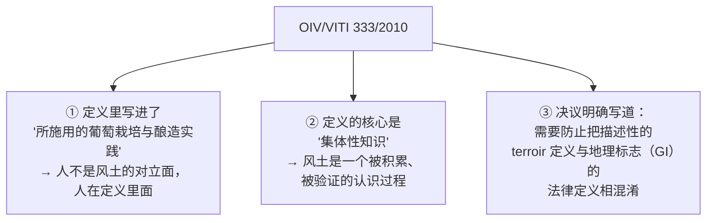
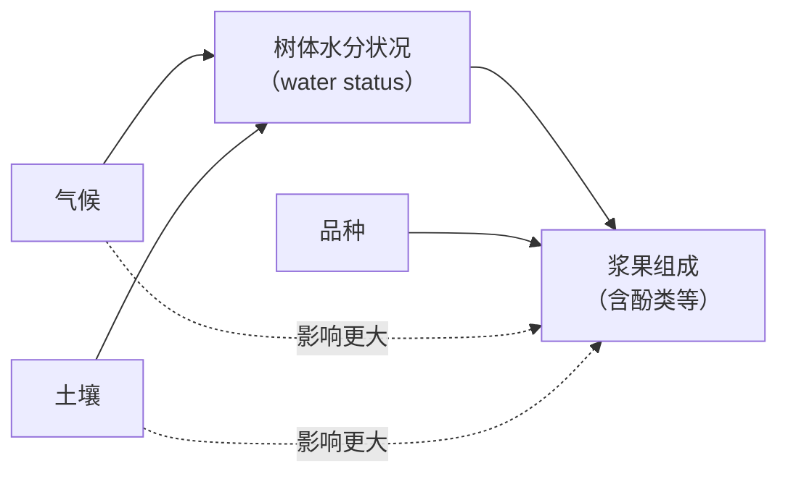
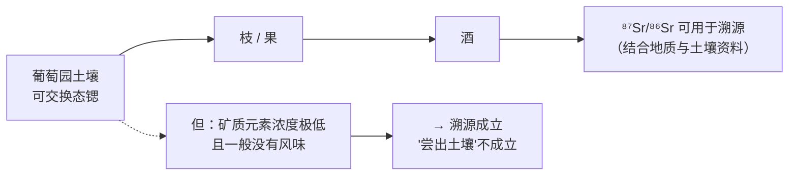
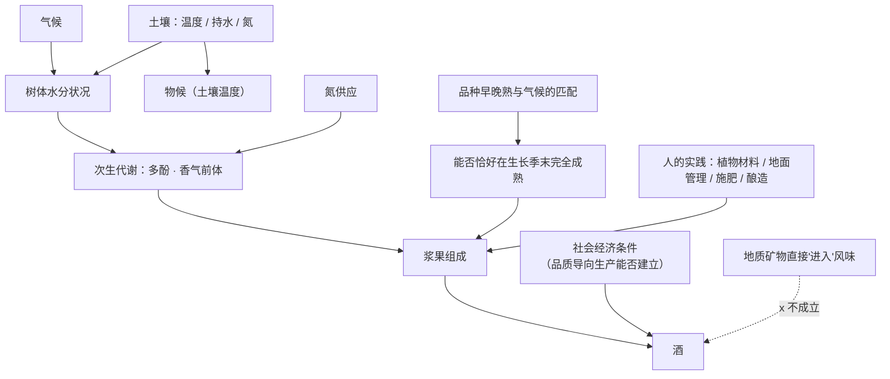

# 第 8 章 风土：哪些部分可证，哪些部分是叙事

> **本章目标**：把酒圈用得最多、也最难追问的一个词拆开。
>
> 处理方式和第 5 章拆"矿物感"完全一样：
> **先找到定义（有官方定义，而且比你想的克制得多），
> 再看有哪些部分被实测支持，最后指出叙事从哪一句话开始接手。**
>
> 提前说结论，本章有三条硬的：
>
> 1. **风土有官方定义，而且定义里明确写进了"人的实践"；**
> 2. **在一项同时比较气候、土壤与品种的研究里，气候与土壤的影响大于品种，
>    而且很可能都是通过"树的水分状况"起作用的；**
> 3. **土壤确实进到了酒里——但进去的是可以溯源的同位素比值，不是味道。**

> **适度饮酒，未成年人不饮酒，酒后不驾车。** 本章的 🅐 实操全部不需要开瓶。

## 8.1 先看官方定义：它比你想的克制

很多人以为"风土"[^1]只是个文学词。其实 **OIV 在 2010 年通过了一份决议专门定义它**
（**OIV/VITI 333/2010**，本书读取了该决议原文）。

[^1]: [风土](../../glossary.md#terroir)（法：terroir；英语文献中直接沿用 terroir，
    OIV 用 "vitivinicultural terroir"）。

决议给出的定义，复述如下：

> **葡萄与葡萄酒的"风土"是一个概念**，它指的是**一个区域**，
> 在这个区域中，**关于"可辨识的物理与生物环境"与"所施用的葡萄栽培与酿造实践"
> 之间相互作用的集体性知识得以形成**，
> 从而**为源自该区域的产品带来独特的特征**。
>
> "风土"**包括特定的土壤、地形、气候、景观特征与生物多样性特征**。

这份决议里有**三件事**值得停下来看：

**第 ① 条直接否掉了一个流传很广的说法**：
"风土就是老天爷给的，酒庄只是不去打扰它"。
**OIV 的定义里，栽培与酿造实践是风土的组成部分**，不是它的杂质。

**第 ③ 条更关键，而且几乎从不被提起**：
OIV 在决议的理由部分明确写了，**要防止把"风土"这个描述性定义
与"地理标志"这个法律定义混为一谈**。
换句话说：

> **"这瓶酒有 PDO/AOC" 是一个法律事实；
> "这瓶酒表达了风土" 是一个描述性主张。**
> **前者可以查，后者需要论证。**

决议还写明这个定义是**供葡萄酒行业作描述性使用**的，
并说一旦某个风土被**描述**出来，它可以有助于该地产品获得认可——
**注意动词是"描述"，不是"证明品质"。**

## 8.2 可证的部分（一）：气候、土壤与品种，谁更重要

2004 年 *American Journal of Enology and Viticulture* 上的一项研究，
少见地把**三大成分同时**放进了一个设计里（以下为本书读取其摘要后的复述）：

| 设计 | 内容 |
|------|------|
| 品种 | **梅洛、品丽珠、赤霞珠**三个品种（**非灌溉**）|
| 土壤 | **砾石土**、**底层为重黏土的土壤**、**根系可及地下水的沙土**三类 |
| 气候 | 用 **1996—2000 年**的年际变化评估：最高/最低气温、**以 10 ℃ 为基准的积温**、日照时数、参考蒸散量（ETo）、降水与**水分平衡** |
| 观测 | 树体生长与浆果组成（例如花青素浓度）|

**结果**：

1. 气候、土壤、品种三者对树体表现与浆果组成的影响**都高度显著**；
2. **气候与土壤的影响大于品种**；
3. **许多变量与树体水分胁迫的强度相关**；
4. 作者的结论是：**气候与土壤对果实品质的影响，很可能是通过它们对树体水分状况的作用来实现的。**

> **这条结论的实用价值极高，值得单独记住**：
>
> > **"同一个品种换个地方种，差异可能大于同一地方换个品种。"**
>
> 它直接解释了为什么第 6 章说"按品种买酒"必须同时看产区——
> 也解释了为什么"某某品种就是某某味道"这类说法总是不够用。
>
> ⚠️ **同时要写清它的边界**：这是**一项研究、在波尔多式的条件下、
> 用三个亲缘较近的品种**做的。**不要把它推广成"品种不重要"。**

## 8.3 可证的部分（二）：土壤通过三条路径起作用

2018 年 *OENO One* 上一篇关于**土壤相关风土因子**的综述，
把土壤的作用收敛成三条可测量的路径（以下为本书读取其摘要后的复述）：

| 路径 | 作用 | 备注 |
|------|------|------|
| **土壤温度** | 对**物候期**有显著影响 | 这直接接上第 7 章：物候提前或推迟，整条成熟曲线都平移 |
| **水分供应** | **有限的水分供应会限制新梢与浆果生长**，而这对达到适合酿造高品质红葡萄酒的果实组成是**关键的** | **次生代谢物**——多酚（花青素、单宁）与香气化合物及其前体——**尤其受树体水分状况影响** |
| **矿质营养（氮为关键）** | 氮影响**树势、产量、果粒大小与果实组成** | **低氮供应促进多酚合成**，但**可能对某些香气化合物不利** |

**注意最后一格里的那个"但"**：

> **低氮 → 多酚更多（对红酒结构有利），同时 → 某些香气化合物受损。**
> 这又是一个**取舍**，不是一个可以单向优化的旋钮。
> 第 3 章讲过的另一半在这里接上了：**葡萄汁的可同化氮（YAN）不足会影响发酵与香气**——
> 也就是说，**葡萄园里的氮决策，会一路影响到发酵罐里。**

### 这些都是可以测的

该综述还给了两个具体工具，这一点特别重要——**因为可测意味着可讨论**：

| 要测什么 | 怎么测 |
|---------|-------|
| **树体水分状况** | 对**葡萄糖分**做**碳同位素判别（δ¹³C）**测定 |
| **树体氮状况** | 测**酵母可同化氮（YAN）**（第 3 章的老朋友）|

综述由此得出一个很工程化的结论：**风土参数不仅可以被测量，还可以被制图**；
理想情况下，葡萄园应建立在**土壤温度（相对于气温）、土壤持水量（相对于降水与蒸散）
与土壤氮供应**都适合目标酒种的地方；
而且**风土表达可以通过选择植物材料、地面管理、施肥等手段来优化**。

> **请注意最后半句和 §8.1 的呼应**：
> **OIV 的定义把人的实践写进了风土，这篇综述则给出了"怎么优化"的操作路径。**
> 两者一致：**风土不是"不许动"，而是"知道自己在动什么"。**

## 8.4 可证的部分（三）：品种与气候的匹配

2006 年 *Journal of Wine Research* 上一篇被广泛引用的概念性论文，
给出了几条方向性结论（以下为本书读取其摘要后的复述）：

- 风土之所以重要，是因为它**把酒的感官属性与葡萄生长的环境条件联系起来**；
  酒的**品质层级与风格**在相当程度上可以用风土来解释；
- 但风土**很难被科学地研究**，因为涉及的因素太多（气候、土壤、品种与人的实践），
  而且这些因素**彼此相互作用**；
- **风土表达最好的情形，是品种的早晚熟性与当地气候条件相匹配，
  使得果实恰好在生长季结束时达到完全成熟**；
- 生产**高品质红葡萄酒**时，环境条件应当诱导**中等树势**——
  通过**适度的水分亏缺胁迫**或**较低的氮供应**；
  这些条件**最常出现在浅层或多石的土壤、气候适度干燥的地方**；
- 生产**高品质白葡萄酒**则需要**规律但不过量**的水分与氮供应；
- **然而，伟大的风土只有在社会经济条件有利于建立品质导向的葡萄酒生产时才会出现。**

> **最后那一句应该被更多地引用。**
> 它出自一篇同行评议论文的摘要，说的是：
> **"这块地好"这件事，从来不只是地的事。**
> 一片自然条件优越但没有市场、没有资本、没有技术积累的产区，
> 不会自动长出"伟大的风土"——
> **风土里包含了"有人愿意长期做品质导向的生产"这个前提。**
>
> 这条也解释了为什么本书把产区的**定价与声誉机制**放到第 40 章单独处理：
> **它们和土壤一样，是风土的一部分。**

## 8.5 微生物风土：一个有数据、但结论要克制的方向

2014 年 *PNAS* 上的一项研究用**高通量短扩增子测序**检查了葡萄表面的真菌与细菌群落
（以下为本书读取其摘要后的复述）：

- **区域、地块与葡萄品种**这三类因素**共同塑造**了葡萄表面的微生物组成；
- 这些微生物群落与**特定的气候特征相关联**；
- 作者据此提出：存在**非随机的"微生物风土"（microbial terroir）**，
  可能是区域间葡萄差异的决定因素之一。

**本书对这条的定位**（很重要）：

| 这项研究证明了 | 这项研究**没有**证明 |
|--------------|-------------------|
| 葡萄表面的微生物组成**有地理与品种格局**，且与气候相关 | 这些微生物**造成了**你尝到的风味差异 |
| 微生物是"风土"这个系统里一个**可测量的新维度** | "野生发酵所以更能表达风土"这类因果主张 |

> **诚实说明**：从"**微生物组成有地理差异**"到"**所以酒喝起来不一样**"，
> 中间还差**至少两步**：这些微生物要真的参与发酵，
> 且它们的代谢产物要在**感知阈值以上**（第 4 章的老规矩：检出 ≠ 闻得到）。
> **本书没有核到能补上这两步的研究**，因此这一节只写到"有格局"为止。

## 8.6 土壤确实进了酒里——进去的是同位素，不是味道

这一节要同时否定两个方向的极端说法，所以请慢读。

### 一边：矿物质进不了你的味觉

第 5 章已经写过地质学视角的三条：岩石与矿物本身没有味道、固体矿物不易挥发、
酒中矿质元素浓度通常低于感知阈值。

2018 年 *Beverages* 上一篇由感官研究者与地质学家合写的综述，
把这件事讲得更直白（以下为本书读取其摘要后的复述）：

- "矿物感"这个词**不寻常地被认为隐含了一个来源**——
  即"尝到的是通过葡萄树从园中岩石土壤里运上来的矿物"；
- 而这**不可能**，原因有二：
  **① 酒中的"矿物"是营养元素，与葡萄园地质意义上的矿物只有很远的关系；
  ② 酒中的矿质营养元素浓度通常极小，且一般没有风味；**
- 综述同时指出：无论专业人士还是消费者，
  对"矿物感"的定义与感官判断**都表现出明显的变异性**，
  尽管在"与哪些其他属性相伴出现"上存在一定共识。

### 另一边：土壤的签名确实进了酒里

**但如果就此说"土壤和酒没关系"，那就错到了另一边。**

2023 年一篇发表在 *Isotopes in Environmental and Health Studies* 上的综述
系统整理了 **1993—2021 年间、22 个国家**的葡萄酒 **⁸⁷Sr/⁸⁶Sr（锶同位素比）**数据
（以下为本书读取其摘要后的复述）：

- 方法的原理是：**酒中的锶同位素比反映葡萄园土壤中可交换（labile）部分的同位素比**；
- 在**全球尺度**上应用有明显局限；
- 但**结合详细的地质与土壤资料**时，它是**判定葡萄酒地理来源的可靠工具**——
  例如意大利中南部火山土壤上的酒可以被明确指纹化。

2025 年 *Journal of Food Composition and Analysis* 上的一项个案研究进一步显示：
在意大利南部 **15 个葡萄园**中，**土壤的锶同位素比与枝条、葡萄、微型酿造样与成品酒的比值显著相关**，
且外部来源的影响可以忽略。

> **把两边合起来，就是本章最漂亮的一条结论**：
>
> > **土壤的化学签名确实进入了酒里，并且精确到可以用来溯源；
> > 但它进去的是"同位素比值"这种没有味道的东西。**
>
> **"土壤进了酒"是对的，"尝得出土壤"是错的**——
> 这两句话可以同时成立，而大多数争论都因为没分清它们而空转。

## 8.7 于是叙事从哪里接手

把本章可证的部分收拢，一张图就够：

**叙事通常在这三个地方接手**：

| 接手点 | 典型说法 | 本书的判断 |
|-------|---------|-----------|
| 把**相关**说成**因果** | "我们是石灰岩，所以酸度高、有矿物感" | 土壤影响酸度有**间接机制**（水分、树势、物候），但"石灰岩 → 矿物感"这条**在地质学与感官两端都不成立** |
| 把**可测的东西**替换成**不可测的东西** | "这片土地的灵魂" | 可测的是：土壤温度、持水量、氮、δ¹³C、YAN——**这些都能问、能查** |
| 把**人的部分**从风土里摘出去 | "我们不干预，只让风土说话" | **OIV 的定义里，栽培与酿造实践本来就是风土的一部分**；"不干预"本身也是一种实践 |

## 8.8 常见说法辨析

按本书约定标注**证据强度**：✅ 有共识 / ⚠️ 有争议 / ❌ 明确错误 / 缺乏证据。

| 说法 | 判定 | 说明 |
|------|------|------|
| "风土是个玄学词，没有定义" | ❌ **明确错误** | **OIV/VITI 333/2010** 有正式定义：一个区域 + 关于环境与实践相互作用的**集体知识** + 由此带来的独特特征；并列举土壤、地形、气候、景观与生物多样性 |
| "风土就是老天给的，人为干预会破坏风土" | ❌ **与定义矛盾** | OIV 的定义**把"所施用的葡萄栽培与酿造实践"写在定义里**；2018 年的土壤综述也指出风土表达**可以通过植物材料、地面管理与施肥来优化** |
| "有 AOC / PDO 就等于有风土" | ❌ **两个层级** | OIV 决议的理由部分**明确要求区分**描述性的 terroir 定义与**地理标志的法律定义**。前者是描述，后者是法律资格 |
| "品种才是决定性的，产地是营销" | ⚠️ **与已核研究相反** | van Leeuwen 等（2004）在同一设计里比较三者：**气候与土壤的影响大于品种**；且多数变量与**水分胁迫强度**相关 |
| "土壤的矿物质被根吸上来，所以能尝到土壤味" | ❌ **明确错误** | 酒中的"矿物"是**营养元素**，与地质矿物关系很远；浓度**极低且一般没有风味**（2018 年 *Beverages* 综述；另见第 5 章）|
| "土壤和酒里的成分没有任何对应关系" | ❌ **也是错的** | **⁸⁷Sr/⁸⁶Sr 同位素比**从土壤可交换态一路传到酒中，个案研究显示土壤—枝—果—酒显著相关；结合地质资料可用于**溯源** |
| "石灰岩土壤带来高酸度与矿物感" | ⚠️ **两段要分开判** | 土壤**确实**能通过温度、持水与氮影响物候、树势与成分（有证据）；但"石灰岩 →（特定风味）"这条**没有可引用的机制或感官证据** |
| "贫瘠的土壤出好酒" | ⚠️ **方向有依据，说法太粗** | 有依据的表述是：高品质红酒需要**中等树势**，通过**适度水分亏缺或低氮**实现，这类条件**常见于浅层或多石土壤、适度干燥气候**（2006）。但**白葡萄酒的最优条件不同**（需要规律但不过量的水与氮），**"越贫瘠越好"不成立** |
| "野生发酵更能表达风土" | **缺乏证据** | 微生物确有**地理与品种格局**（*PNAS* 2014），但从"组成有差异"到"你尝得出来"还差两步（是否参与发酵、代谢物是否超过阈值）。本书未核到补上这两步的研究 |
| "好风土是天生的，与经济无关" | ⚠️ **与文献相反** | 2006 年那篇论文的摘要直接写：**伟大的风土只有在社会经济条件有利于建立品质导向生产时才会出现** |
| "同一个品种在哪里种都差不多" | ❌ **与 §8.2 矛盾** | 见上：气候与土壤的影响大于品种（在该研究的条件下）|
| "风土差异可以用一张土壤图解释完" | ⚠️ **过度简化** | 2006 年论文自己承认：风土**难以科学研究**，因为因素众多且**相互作用**；2018 年综述给出的也是**三条路径 + 两个测量工具**，不是一张图 |

## 8.9 思考题

1. OIV 的定义里有一个几乎所有中文科普都会略过的要素——**"所施用的葡萄栽培与酿造实践"**。
   请说明：把这一项写进定义，会让哪两种常见说法立刻站不住？
2. van Leeuwen 等（2004）的结论是"气候与土壤的影响大于品种"。
   请写出这项研究的**设计边界**（品种、土壤、气候、是否灌溉），
   并说明为什么不能据此说"品种不重要"。
3. 2018 年的土壤综述说"低氮促进多酚合成，但可能对某些香气化合物不利"。
   请把这句话翻译成一个**酿酒师面临的具体取舍**，并说明它与第 3 章的哪个概念相连。
4. 请用一句话解释：为什么"土壤的化学签名进入了酒"与"尝不出土壤的味道"可以同时成立？
5. **【案例】** 某酒庄网页写道：
   *"我们的葡萄园坐落在三亿年前的火山岩上，矿物质经由根系直接进入葡萄，
   赋予酒款标志性的矿物感与咸鲜；我们坚持零干预，让风土自己说话；
   我们的 AOC 等级本身就是风土优越的证明。"*
   请逐句判断并改写，其中**至少有一句与 OIV 的官方定义直接冲突**，请指出是哪一句。
6. **【案例】** 一位侍酒师说："这两瓶酒来自相邻的两块地，
   一块是黏土、一块是砾石，所以风格完全不同——这就是风土。"
   这个说法哪里对、哪里需要补充？请用本章的机制图说明**中间缺了哪一环**。
7. **【查证】** 去查一份公开的**风土 / 地块研究报告**（产区管理机构、研究机构或酒庄技术页）。
   看它是否给出了可测量的风土参数：土壤类型与深度、持水量、**δ¹³C**、**YAN**、土壤温度。
   记录它给了哪些、缺了哪些，并回答：**如果全部缺失，这份报告和一段散文的区别是什么？**
8. 为什么本书说"微生物风土"目前只能写到"有格局"为止？请说出中间缺失的两步分别是什么。

> 📖 **参考答案**（想清楚再看）：[Q1](../../qa/08-terroir-qa.md#q1) · [Q2](../../qa/08-terroir-qa.md#q2) ·
> [Q3](../../qa/08-terroir-qa.md#q3) · [Q4](../../qa/08-terroir-qa.md#q4) · [Q5](../../qa/08-terroir-qa.md#q5) ·
> [Q6](../../qa/08-terroir-qa.md#q6) · [Q7](../../qa/08-terroir-qa.md#q7) · [Q8](../../qa/08-terroir-qa.md#q8)

## 8.10 本章实操

🅐 档**全部不需要开瓶喝酒**。

### 🅐 无器具版 · 任务一：给一段风土文案做"可证性分级"

找 **3 段**含"风土""土壤""地块"字样的文案（酒庄页、商品详情、酒评皆可），
逐句分到下面四档里。

| 档 | 含义 | 例子 |
|----|------|------|
| **A. 可核实的事实** | 能向卖家或公开资料求证 | 海拔、土壤类型、朝向、种植年份、砧木 |
| **B. 有机制支持的推断** | 本章给过机制 | "多石土壤、适度干燥 → 中等树势 → 适合红葡萄酒" |
| **C. 相关但未证因果** | 有关联，因果没建立 | "我们用野生酵母，更能表达风土" |
| **D. 与已核证据冲突** | 直接矛盾 | "矿物质经根系进入酒中形成矿物感" |

| # | 原句 | 档位 | 我的理由 | 我会追问的一句 |
|---|------|------|---------|--------------|
| 1 | | | | |
| … | | | | |

**统计**：三段文案里 A / B / C / D 各占多少句？
**A + B 的比例，就是这段文案的"信息含量"。**

### 🅐 无器具版 · 任务二：做一张"可测风土参数"清单

假设你要去拜访一家酒庄，或给客服写一封提问邮件。
根据本章，列出**你会问的可测量参数**，并写明"知道它有什么用"。

| 参数 | 我的问法 | 知道它有什么用（写机制）|
|------|---------|----------------------|
| 土壤类型与深度 | | |
| 持水量 / 灌溉与否 | | |
| **δ¹³C**（葡萄糖分的碳同位素判别）| | |
| **YAN**（酵母可同化氮）| | |
| 土壤温度 / 朝向 / 海拔 | | |
| 产量（hL/ha 或 t/ha）| | |
| 品种与砧木 | | |

> **这张表本身就是一个筛子**：能回答其中三项以上的酒庄，
> 通常真的在做测量；一项都答不上来却大谈风土的，你就知道该怎么给这段话定价了。
> （**问不出来不代表酒不好**——只代表这段"风土叙事"没有信息。）

### 🅐 无器具版 · 任务三：两条路径的对照阅读

读本章 §8.6 的两组材料，然后用**你自己的话**填下表。
这是本章最重要的一次概念区分。

| 问题 | 我的回答 |
|------|---------|
| 锶同位素比从哪里来、到哪里去？ | |
| 为什么它可以用来溯源？ | |
| 为什么它**不能**用来解释风味？ | |
| "土壤进了酒"这句话，在什么意义上对、在什么意义上错？ | |
| 如果有人说"检测显示我们的酒富含矿物质，所以矿物感强"，你会怎么回应？ | |

### 🅑 有条件版 · 任务四：同品种、两块地（备齐后再做）

**所需**：**2 支**同品种、同年份、**不同地块或不同产区**的酒
（同一酒庄的两个地块酒最理想，价位接近的两家也行）、两只同款杯、
[品鉴记录表](../../forms/tasting-note.md)两份，以及**两块地的可查资料**。

**适度饮酒，未成年人不饮酒，酒后不驾车。** 每杯 20~30 mL 即可。

**顺序很重要**：**先盲品、再查资料**。

| 步骤 | 内容 |
|------|------|
| 1 | 盲品打六维分（P1 的坐标），并写下"我感觉到的最大差异是哪一维" |
| 2 | 查两块地的可查信息（土壤、海拔、朝向、年份气候、酿造差异）|
| 3 | 用本章的机制图，尝试为观察到的差异写一条**可能的**因果链 |
| 4 | **列出你无法排除的混杂因素**（这一步最重要）|

| 项 | 酒甲 | 酒乙 |
|----|------|------|
| 六维盲品结果 | | |
| 地块信息（土壤 / 海拔 / 朝向）| | |
| 酿造差异（桶、发酵、陈年）| | |
| 我写的因果链 | | |
| **我无法排除的混杂因素** | | |

> **纪律提醒**：只要两支酒的**酿造**不同（几乎总是不同），
> 你就**无法**把差异归给地块。
> 能诚实写出这一点，比写出一条漂亮的风土解释更有价值——
> **这正是 2006 年那篇论文说"风土很难被科学研究"的原因。**

## 8.11 🔎 买酒与点酒时的用处

1. **听到"风土"，先问"哪一部分"**。土壤温度？持水量？氮？品种与气候的匹配？
   这些都能聊；"土地的灵魂"不能聊。
2. **"AOC/PDO 等级"是法律事实，不是风土论证**。
   OIV 自己就要求把这两件事分开。
3. **"零干预让风土说话"在定义层面就站不住**——
   栽培与酿造实践**本来就写在 OIV 的风土定义里**。（这不是说不干预不好，
   而是说它是一种实践选择，不是风土的反面。）
4. **判断一家酒庄是否真的在做测量，问 δ¹³C 与 YAN**。
   这两个指标在业内是成熟工具，答得上来说明他们在量化管理。
5. **"贫瘠出好酒"只对红葡萄酒的一部分成立**。
   已核研究的说法是：高品质红酒需要中等树势（适度水分亏缺或低氮）；
   **白葡萄酒需要的是规律但不过量的水与氮**——买白葡萄酒时别套用红酒的口诀。
6. **遇到"能尝出土壤"的说法，用锶同位素那条来回应**：
   **土壤的签名确实在酒里，但它没有味道。**
7. **产区声誉与价格是风土的一部分，不是它的污染**。
   这条听上去不浪漫，但它出自同行评议文献，而且能帮你理解第 40 章的定价结构。

## 8.12 本章依据

### A. 已核对原文的国际组织文件

- **OIV 决议 OIV/VITI 333/2010《葡萄与葡萄酒"风土"的定义》**（本章核对原文）：
  定义为"一个区域，在其中关于**可辨识的物理与生物环境**与**所施用的葡萄栽培与酿造实践**
  之间相互作用的**集体性知识**得以形成，从而为源自该区域的产品带来独特特征"；
  "风土**包括**特定的土壤、地形、气候、景观特征与生物多样性特征"；
  决议理由部分写明该定义**供行业作描述性使用**，并**需防止与地理标志的法律定义相混淆**。

### B. 已核对摘要的同行评议文献

- **三大成分的相对影响**：van Leeuwen, C.; Friant, P.; Choné, X.; Trégoat, O.;
  Koundouras, S.; Dubourdieu, D. "Influence of Climate, Soil, and Cultivar on Terroir",
  *Am. J. Enol. Vitic.* **55** (2004) 207–217
  （**非灌溉**的梅洛、品丽珠、赤霞珠；砾石土 / 重黏土底土 / 根系可及地下水的沙土；
  1996—2000 年的气候变量含**以 10 ℃ 为基准的积温**、ETo 与水分平衡；
  三者影响均高度显著，**气候与土壤大于品种**；多数变量与**水分胁迫强度**相关；
  作者认为气候与土壤的影响**很可能经由树体水分状况介导**）。
- **土壤的三条路径与两个测量工具**：van Leeuwen, C.; Roby, J.-P.; de Rességuier, L.
  "Soil-related terroir factors: a review", *OENO One* **52** (2018) 173–188
  （土壤经**温度、水分供应、矿质供应**影响树体与成熟；土壤温度显著影响**物候**；
  **有限的水分供应限制新梢与浆果生长**，对高品质红葡萄酒的果实组成是关键；
  **次生代谢物（多酚、香气化合物及前体）尤其受水分状况影响**；
  **低氮促进多酚合成，但可能对某些香气化合物不利**；
  **δ¹³C** 用于评估水分状况、**YAN** 用于评估氮状况；风土参数可测量并制图；
  风土表达可通过植物材料、地面管理与施肥等优化）。
- **品种与气候的匹配、以及社会经济前提**：van Leeuwen, C.; Seguin, G.
  "The concept of terroir in viticulture", *Journal of Wine Research* **17** (2006) 1–10
  （风土难以科学研究，因素众多且相互作用；**最佳表达来自品种早晚熟性与当地气候的匹配**，
  使生长季末达到完全成熟；高品质红酒需要**中等树势**——经**适度水分亏缺或低氮**实现，
  常见于**浅层或多石土壤、适度干燥气候**；高品质白酒需**规律但不过量**的水与氮；
  **伟大的风土只有在社会经济条件有利于建立品质导向生产时才会出现**）。
- **微生物风土**：Bokulich, N. A.; Thorngate, J. H.; Richardson, P. M.; Mills, D. A.
  "Microbial biogeography of wine grapes is conditioned by cultivar, vintage, and climate",
  *PNAS* **111** (2014) E139–E148
  （高通量短扩增子测序；**区域、地块与品种**共同塑造葡萄表面真菌与细菌群落；
  群落与特定气候特征相关；作者据此提出存在**非随机的"微生物风土"**）。
- **"矿物感"的地质与感官审视**：Parr, W. V.; Maltman, A. J.; Easton, S.; Ballester, J.
  "Minerality in Wine: Towards the Reality behind the Myths", *Beverages* **4** (2018) 77
  （该词不寻常地隐含来源主张；但**酒中的"矿物"是营养元素，与葡萄园地质矿物关系很远**，
  且**浓度极小、一般没有风味**；专业人士与消费者对该词的定义与判断**变异明显**）。
  另见 Maltman, A. "Minerality in wine: a geological perspective",
  *Journal of Wine Research* **24** (2013) 169–181（🟡 题录已核，原文未读）。
- **锶同位素溯源**：Saar de Almeida, B. 等，"Characterizing wine terroir using strontium
  isotope ratios: a review", *Isotopes in Environmental and Health Studies* (2023)
  （原理：酒中 ⁸⁷Sr/⁸⁶Sr 反映葡萄园土壤**可交换部分**的比值；整理 1993—2021 年
  **22 个国家**的数据；**全球尺度有局限**，但结合详细地质与土壤资料时是**可靠的产地判定工具**）；
  以及 Mercurio, M. 等（2025）在 *Journal of Food Composition and Analysis* 的个案
  （意大利南部 **15 个葡萄园**；**土壤与枝、果、微酿样及成品酒的 Sr 同位素比显著相关**，
  外部来源影响可忽略）。

### C. 本章有意留白的地方

- **具体土壤类型 →具体风味**的对应（"石灰岩 → 某某味道"）：无可引用的机制或感官证据，不写。
- **微生物风土 → 感官差异**：缺"是否参与发酵""代谢物是否超阈值"两步，只写到"有格局"。
- **各产区的地块分级依据**：待第四部分核对各产区规范原文。
- **"老藤""低产 → 高品质"的定量关系**：未核到，第 11 章再处理。

以上每一条的完整题录、DOI 与核对状态，见[出处与资料登记](../../standards.md)。

---

**下一章预告**：讲完"从哪来"，接下来给名字挂坐标。
第 9 章处理**白葡萄品种**——但不按国家排列，
而是按**香气分子的类型**分组：萜烯型、硫醇型、降异戊二烯型，以及"中性"型。
这样分的理由，第 4 章已经埋好了。
