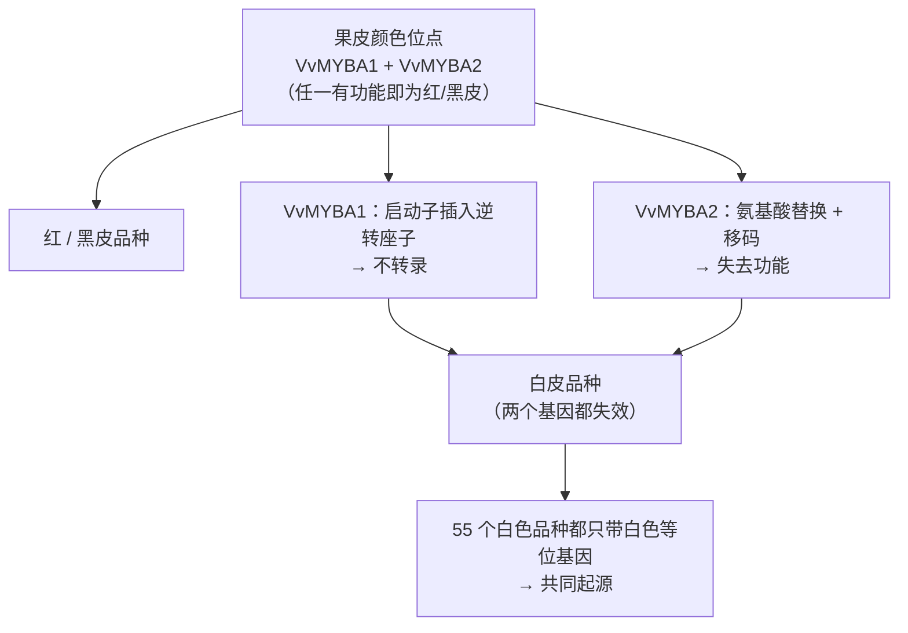
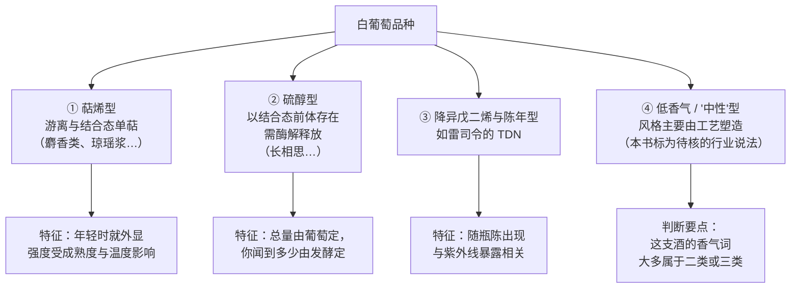
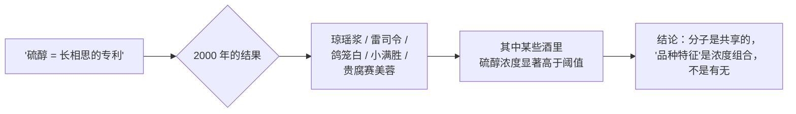

# 第 9 章 白葡萄品种谱系

> **本章目标**：给白葡萄品种建立一个**比"按国家背名单"有用得多**的组织方式。
>
> 本书的主张是：**按香气分子的类型给白品种分组**——
> 萜烯型、硫醇型、降异戊二烯型，以及"低香气"型。
> 理由第 4 章已经埋好：**一个香气属于哪一层，决定了它能不能被工艺造出来，
> 也就决定了你在为什么付钱。**
>
> 顺带解决两个基础问题：**"白葡萄"究竟是怎么来的**，
> 以及**霞多丽的父母是谁**——这两个问题都有干净的分子证据。

> **适度饮酒，未成年人不饮酒，酒后不驾车。** 本章的 🅐 实操全部不需要开瓶。

## 9.1 "白"是一次突变，而且可能只发生过一次

红葡萄与白葡萄的差别，在于果皮里有没有**花青素**（第 1 章）。
这件事由一个叫**果皮颜色位点**[^1]的地方控制，而它的分子机制在 2000 年代被解开了。

[^1]: [果皮颜色位点](../../glossary.md#berry-colour-locus)（英：berry colour locus；
    涉及调控基因 *VvMYBA1* 与 *VvMYBA2*）。

**第一块拼图（2004）**：*Science* 上一篇题为
《逆转座子诱导的葡萄果皮颜色突变》的短文报告了这一机制。

**第二块拼图（2007）**：*The Plant Journal* 上的一项工作把图景补完了
（以下为本书读取其摘要后的复述）：

| 发现 | 内容 |
|------|------|
| 位点结构 | 果皮颜色位点由**两个非常相似的基因** *VvMYBA1* 与 *VvMYBA2* 组成，位于**同一个细菌人工染色体**上；**任何一个都能调控果皮颜色** |
| *VvMYBA1* 怎么坏的 | 该基因在白色果皮中**不被转录**，原因是**启动子里插入了一个逆转座子**（即 2004 年那项工作的结论）|
| *VvMYBA2* 怎么坏的 | 白色等位基因由**两个非保守突变**失活：一个造成**氨基酸替换**，另一个造成**移码**、产生更短的蛋白；瞬时表达实验显示**任何一个突变都足以使其失去启动花青素合成的能力** |
| **最关键的一条** | 序列分析加标记信息确认：**55 个白色品种全部携带白色等位基因、不含红色等位基因** → 作者推论**现存的白色葡萄品种有共同起源** |
| 结论 | **两个相邻基因上各自发生的罕见突变事件，是白葡萄得以出现的必要条件** |

> **这条为什么值得放在一章的开头**：
> 它把"白葡萄品种"从一个**分类学标签**变成了一个**有共同祖先的群体**。
> 也解释了第 6 章那个例子——**白皮的 Pinot Blanc 相对黑皮的 Pinot Noir，
> 是缺失了那个有功能的 *VvmybA1c* 等位基因**（2006）。
> **同一个位点，同一类事件，只是发生在不同的时间。**

> ⚠️ **写作纪律**：本章不写"白葡萄比红葡萄更早/更晚出现"。
> 2023 年的驯化研究把**果皮颜色**列为被选择的性状之一（第 6 章），
> 但**具体的时间顺序本书未核到可引用的结论**。

## 9.2 霞多丽的父母：微卫星标记给的答案

品种之间的亲缘关系，在 DNA 标记出现之前全靠传说。
1999 年 *Science* 上的一项工作用**微卫星位点**分析了**300 多个**葡萄品种
（以下为本书读取其摘要后的复述）：

> 长期栽培于法国东北部的**16 个酿酒品种**——包括 **Chardonnay（霞多丽）、
> Gamay noir、Aligoté、Melon**——的微卫星基因型**与它们是同一对父母的后代相符**，
> 这对父母是 **Pinot（黑皮诺一族）与 Gouais blanc**，
> 两者在**中世纪**的该地区都很常见。
> 亲子鉴定使用了 **32 个微卫星位点**，统计上支持这些关系。

（OIV 的品种报告也采用这一结论：**Chardonnay 是 Gouais Blanc 与 Pinot 杂交的结果**；
该报告另提到遗传研究显示 **Pinot Noir 与 Gouais Blanc 的杂交产生了 21 个法国栽培品种**。）

> **两条实用推论**：
>
> 1. **"名门血统"不是修辞，是可以查的。** 一个品种的父母、同胞关系在公开数据库里就有
>    （第 6 章的 🅐 实操已经做过一次）。
> 2. **Gouais blanc 这个"父母"在历史上一直被认为是低档品种。**
>    高声誉的后代与低声誉的亲本并存——
>    这本身就提醒我们：**"品种的声誉"是市场建构，"品种的遗传"是另一回事。**

## 9.3 本书的分组法：按香气分子分，而不是按国家分

现在进入本章的核心。**为什么不按国家排列？**

因为"法国白葡萄品种"这个分组**不能预测任何东西**：
它把香气机制完全不同的品种放在一起，又把机制相同的品种拆到不同国家去。

**按香气分子分组，能直接回答第 4 章那个真正有用的问题**：

> **"要得到这个香气，需要特定的葡萄吗？还是换个操作就能有？"**

### ① 萜烯型

**单萜**[^2]是一类在葡萄里就已存在（部分以糖苷结合态存在）的香气分子，
典型气息是花香、柑橘与"麝香"。

[^2]: [单萜](../../glossary.md#monoterpene)（英：monoterpene）；
    另见[香气前体](../../glossary.md#aroma-precursor)与[一类香气](../../glossary.md#varietal-aroma)。

第 4 章已经登记过一组**转引**的感知阈值（**原始出处为 2015 年的萜类综述，
本书通过 2025 年的一篇综述读到**）：

| 分子 | 感知阈值 | 介质 |
|------|---------|------|
| 芳樟醇（linalool） | **25 µg/L** | 模拟酒液 |
| 芳樟醇 | **50 µg/L** | **葡萄酒**（另一来源）|
| 香叶醇（geraniol） | **30 µg/L** | 模拟酒液 |
| 香茅醇（citronellol） | **100 µg/L** | 模拟酒液 |
| α-松油醇（α-terpineol） | **250 µg/L** | 模拟酒液 |

> ⚠️ **这张表的正确读法**（第 4 章的规矩）：
> **同一个分子，模拟酒液 25 µg/L、真酒 50 µg/L——差两倍。**
> 所以**不要**拿模拟酒液的阈值去推真酒里的重要性。

**麝香（Muscat）类品种**是这一组的典型。值得注意的是：
2023 年的驯化研究把**麝香风味（muscat flavour）**列为驯化过程中**被选择的性状之一**——
也就是说，**这类香气是人挑出来的**（第 6 章 §6.2）。

同一组里还有**琼瑶浆（Gewürztraminer）**——但它在下一小节里会带来一个意外。

### ② 硫醇型

**挥发性硫醇**[^3]是长相思（Sauvignon Blanc）成名的分子基础。
1998 年 *Flavour and Fragrance Journal* 上的工作在长相思酒中鉴定出三种新硫醇
（以下为本书读取其摘要后的复述）：

[^3]: [挥发性硫醇](../../glossary.md#volatile-thiol)（英：volatile thiols）。

| 分子 | 水醇溶液中的感知阈值 | 气味 |
|------|-------------------|------|
| 4-巯基-4-甲基戊-2-醇 | **约 60 ng/L** | 柑橘皮 |
| **3-巯基己-1-醇（3MH）** | **约 60 ng/L** | **西柚** |
| 3-巯基-3-甲基丁-1-醇 | **1500 ng/L** | 煮熟的韭葱 |

OIV 的品种报告对长相思的描述与此一致：
**"这个品种的成功在很大程度上归功于硫醇类化合物带来的品种香（黑加仑、热带水果、黄杨），
而这些香气的表达随风土、年份与葡萄的生长条件而变化。"**

**但真正的意外在 2000 年**：另一项工作报告，
**在琼瑶浆、雷司令、鸽笼白（Colombard）、小满胜（Petit Manseng）
与贵腐赛美蓉所酿的酒中，4MMP、3MH 与乙酸-3-巯基己酯的浓度在某些酒中显著高于其感知阈值。**

> **这条把"品种香"这个概念本身修正了一次**：
> **品种之间的差别，更多是"哪些分子多、哪些分子少"的组合，
> 而不是"我有、你没有"。**
> 这也是本书为什么按分子分组——**分子是共享的语言，品种只是配方。**

**还有第 4 章那条必须重复的限制**：
3MH 在葡萄汁中**大量以与谷胱甘肽、半胱氨酸结合的形式存在，需要酶作用才能被感官察觉；
而酿酒酵母释放这些硫醇的效率并不高**（2021）。
所以：

> **硫醇型品种的香气强度，是"葡萄里的前体总量"与"发酵释放率"的乘积。**
> 看到"百香果味极浓"，**它可能在夸葡萄，也可能在夸酵母**（第 4 章 Q5）。

### ③ 降异戊二烯与"陈年型"

**雷司令（Riesling）**最著名的陈年特征是**汽油/煤油气息**，其责任分子是 **TDN**[^4]。

[^4]: [TDN](../../glossary.md#tdn)（1,1,6-三甲基-1,2-二氢萘）与
    [C13-降异戊二烯](../../glossary.md#norisoprenoid)（英：C13-norisoprenoids）。

2024 年 *J. Agric. Food Chem.* 上的一项工作（第 4 章已引用）给出两条：

- 从 **766 个嗅觉受体变体**的文库中筛出 **OR8H1** 作为 TDN 的选择性受体；
- **TDN 的含量依赖紫外线**，南北半球差异很大：
  **澳大利亚雷司令浓度最高，且在当地是加分项**，
  而在欧洲的雷司令中它**可能成为被拒绝的原因**。

第 4 章登记的转引阈值里还有两个与本组相关的数字：
**TDN 20 µg/L**、**维他斯品（vitispirane）800 µg/L**（白葡萄酒）。

> **这一组的实用含义**：
> **"陈年型"白葡萄酒的卖点分子，往往在年轻时还不存在。**
> 所以买一支年轻的雷司令时，"有没有汽油味"是一个**无意义的评价项**；
> 而买一支十年的雷司令时，它是一个**风格判断项**（而且**地域偏好相反**）。

### ④ 低香气 / "中性"型——本书把它标为待核

**霞多丽**常被描述为"中性品种，风格主要来自工艺"。
本书把这个说法分成两半处理：

| 半句 | 判定 | 理由 |
|------|------|------|
| "霞多丽酒的风格在很大程度上由工艺塑造" | ✅ **可支持** | 从第 4 章的分层看，霞多丽酒评里的高频词（黄油、烤面包、香草、奶油）大多属于**二类（发酵、苹乳）与三类（橡木）**香气——这些是工艺决定的 |
| "霞多丽本身缺乏品种香分子" | ⬜ **本书未核到一手证据** | 本书没有读到系统比较各品种游离/结合态香气分子含量的一手研究，**因此不写"中性品种"这个断言** |

> **这是本章最典型的一次"写规律而不写结论"**：
> 可以说的是"**这些香气词属于哪一层**"（有依据），
> 不能说的是"**这个品种天生没有香气**"（未核）。

OIV 报告对霞多丽的描述也只涉及农艺与市场层面：
**来自勃艮第；2015 年 210 000 ha、分布于 41 个国家；晚萌芽（因而对春霜敏感）、早成熟；
高树势、短枝修剪下产量中低；易感白粉病、植原体病与灰霉；
常被单一酿成干白并在酒标上标出品种名，也常用传统法酿起泡酒（单一使用时称 Blanc de Blancs）。**

同一组里还有一个更极端的例子——**Airen（阿依伦）**：
OIV 报告写明它**产出"香气细微、酸度低"的白葡萄酒，常用于混酿，也用于蒸馏制烈酒**。
**这类品种的存在提醒我们：世界上种得最多的白葡萄，并不是最有香气的那些。**

## 9.4 结构那一半：酸、酒精潜力与物候

香气只是白葡萄酒的一半。**另一半是结构**——而结构与品种的**物候特性**直接相关（第 7 章）。

OIV 报告里可以直接读出的几条（**这些是农艺描述，不是风味承诺**）：

| 品种 | 物候与农艺特征（OIV 报告） | 接到第 7 章上意味着什么 |
|------|--------------------------|----------------------|
| **Chardonnay** | **晚萌芽**（对春霜敏感）、**早成熟**；高树势；易感白粉病、植原体病、灰霉 | 早成熟 → 在温暖产区更容易糖高酸低 → 这解释了为什么凉气候霞多丽被单独看待 |
| **Sauvignon Blanc** | 萌芽中等、**开花早**、**成熟期长而晚**；高树势、低结实率、小果串**易落花落果（coulure）**；极易感白粉病与黑腐病 | 成熟期长 → 采收窗口内的取舍空间大（第 7 章的青味—酸度拉扯在这个品种上尤其典型）|
| **Airen** | **生长周期长**；高树势高结实；**果串很大、产量高**；抗多种病害 | 高产 + 低酸 → 大宗与蒸馏用途的经济学（第 40 章）|

> **诚实说明**：本书**没有**任何品种的"典型总酸区间""典型 pH 区间"——
> 第 1 章起就已登记：**干型葡萄酒的典型成分区间本书未核到可引用的一手数据**。
> 所以本章只给**方向**（早熟/晚熟、高产/低产），不给数字。

## 9.5 面积与市场：谁在被大量种植

OIV 2017 年那份报告给出了全球面积数据（2015 年口径）。
把其中的白葡萄品种挑出来：

| 品种 | 面积（2015）| 主要用途 | 本书关注点 |
|------|-----------|---------|-----------|
| **Sultanina**（Thompson Seedless）| 约 **273 000 ha** | **食用、制干**，也酿酒与蒸馏 | 世界上**用于食用与制干最多的品种**；原产阿富汗；**世界上第一个被栽培的无核品种** |
| **Airen** | **218 000 ha** | 酿酒、白兰地 | **占西班牙葡萄园的 22 %**，几乎只种在西班牙，是该国面积第一的品种 |
| **Chardonnay** | **210 000 ha**，分布于 **41 个国家** | 酿酒 | 报告称其为"**最国际化的白葡萄品种**" |
| **Sauvignon Blanc** | **123 000 ha** | 酿酒 | 是**新西兰种植最多的品种**（近 **20 500 ha**）|
| **Trebbiano Toscano / Ugni Blanc** | 列于"面积超过 **100 000 ha**"的品种表中 | **酿酒与白兰地** | 白兰地基酒的经济学见第 35 章 |

> **两条不该被跳过的观察**：
>
> 1. **面积第一梯队的白葡萄，多数不是"名酒品种"。**
>    Sultanina 主要用来吃和晒葡萄干，Airen 与 Ugni Blanc 大量流向蒸馏。
>    **"世界上最多的葡萄"与"酒单上最常见的葡萄"是两份不同的名单。**
> 2. **霞多丽的国际化程度是可量化的**：**41 个国家**。
>    这比任何"最受欢迎的白葡萄"之类的说法都更有信息量。

> ⚠️ **一次引用纪律的实战**：这份报告在**摘要**里写赤霞珠占世界葡萄园面积的 **5 %**，
> 而在**品种词条**里写"341 000 ha，占世界葡萄园的 **4 %**"。
> **同一份官方报告的两处数字不一致。**
> 本书的处理是：**只引用面积（ha），不引用百分比**——
> 因为面积是原始统计量，百分比取决于分母口径（是否含未投产面积等）。
> **这不是挑错，这是"关键数字要两个独立来源"的日常形态：
> 连同一个来源内部都可能不自洽。**

## 9.6 常见说法辨析

按本书约定标注**证据强度**：✅ 有共识 / ⚠️ 有争议 / ❌ 明确错误 / 缺乏证据。

| 说法 | 判定 | 说明 |
|------|------|------|
| "白葡萄是把红葡萄去皮压榨做的" | ❌ **概念混淆** | 白葡萄**品种**的果皮本身不含花青素，这由**果皮颜色位点的突变**决定。（用红葡萄压榨做白酒确实存在——那叫 blanc de noirs，是**工艺**，第 13、16 章）|
| "白葡萄品种五花八门，彼此没什么关系" | ⚠️ **与分子证据相反** | 55 个白色品种**全部只带白色等位基因**，作者据此推论**现存白色品种有共同起源**（2007）|
| "霞多丽是无性系变异出来的杂交品种，来历不明" | ❌ **明确错误** | 微卫星分析显示它与另外 15 个法国东北部品种**同为 Pinot × Gouais blanc 的后代**（1999，32 个位点）|
| "硫醇香气是长相思独有的" | ❌ **明确错误** | 2000 年的工作在**琼瑶浆、雷司令、鸽笼白、小满胜与贵腐赛美蓉**的酒中测到 4MMP / 3MH / A3MH **显著高于感知阈值** |
| "百香果味浓说明葡萄好" | ⚠️ **缺一环** | 3MH 在汁中**大量以结合态存在、需酶解释放**，而**酿酒酵母释放效率不高**（2021）。香气强度 = 前体总量 × 释放率——后者属于**酿造决策**（第 4 章 Q5）|
| "汽油味是雷司令品质的标志" | ⚠️ **地域偏好相反** | TDN 含量**依赖紫外线**；**澳大利亚雷司令浓度最高、当地视为加分项**，在欧洲雷司令中**可能成为被拒绝的原因**（2024）|
| "年轻的雷司令就该有汽油味" | ❌ **层级错误** | TDN 属于**陈年相关**的特征（第 4 章的三类香气）。年轻酒里评价它没有意义 |
| "霞多丽是中性品种，本身没有香气" | ⬜ **本书未核到一手证据** | 可支持的只有半句：霞多丽酒评里的高频词大多属于**二类与三类香气**（工艺决定）。"品种本身缺乏香气分子"这个断言**本书没有一手依据** |
| "阈值 25 µg/L，所以只要超过 25 就能闻到" | ❌ **忽略介质** | 那是**模拟酒液**中的值；同一分子在**葡萄酒**中的转引阈值是 **50 µg/L**。第 4 章的老规矩：**阈值是一次测量，不是常数** |
| "种得最多的白葡萄就是最好的白葡萄" | ❌ **两份名单** | 面积第一梯队里，**Sultanina 主要用于食用与制干**，**Airen 与 Ugni Blanc 大量用于蒸馏**（OIV 2017）|
| "看到 Blanc de Blancs 就是霞多丽" | ⚠️ **常见但不等价** | OIV 报告的表述是：霞多丽单一酿成起泡酒时**被称为 Blanc de Blancs**。但该词字面意思是"用白葡萄酿的白起泡酒"，**具体允许哪些品种由产区规范规定**——本书尚未核对相关产区规范原文，**不下断言** |
| "白葡萄酒不需要看酒标上的甜度词" | ❌ **恰恰相反** | 欧盟 (EU) 2019/33 Annex III 给了**残糖区间的法规定义**（第 1 章已核）。白葡萄酒的甜度跨度极大，**这个词是酒标上信息量最高的几个之一** |

## 9.7 思考题

1. 用两句话解释：为什么说"现存白葡萄品种可能有共同起源"是一个**可检验的结论**，
   而不是一个推测？（提示：证据是什么形状的？）
2. 为什么本书主张按**香气分子类型**给白品种分组，而不是按国家？
   请给出至少两个"按国家分组会分错"的例子（本章内就有）。
3. 2000 年那项在琼瑶浆、雷司令等品种中测到高浓度硫醇的研究，
   对"品种香"这个概念做了什么修正？
4. 芳樟醇在模拟酒液中的转引阈值是 25 µg/L，在葡萄酒中是 50 µg/L。
   请说明：如果一份检测报告写"本酒芳樟醇 35 µg/L，超过阈值"，你会怎么回应？
5. **【案例】** 某电商页面写道：
   *"新西兰长相思，百香果与西柚香气爆棚，这是当地独一无二的风土造就的品种香；
   我们的霞多丽为中性品种，因此完全靠橡木桶赋予风味；
   本款年轻雷司令已具备标志性汽油香，说明品质卓越。"*
   请逐句判断并改写。（三句各踩中本章一个不同的知识点。）
6. **【案例】** 一位店员说："阿依伦是西班牙种植面积最大的白葡萄，
   所以它一定是西班牙最好的白葡萄品种。"
   请指出这个推理的问题，并用 OIV 报告里的信息说明"面积大"实际意味着什么。
7. **【查证】** 挑一个白葡萄品种，去查：① 它的亲本（若已知）；
   ② 它在 OIV 报告里的面积与主要产国（若在列）；③ 它的同物异名。
   然后回答：**这三条信息里，哪一条最能帮你在酒单上做决定？为什么？**
8. 本章 §9.5 指出 OIV 报告的摘要与词条对同一个百分比给了不同的数
   （5 % 与 4 %）。如果你正在写一篇要引用这份报告的文章，你会怎么处理？
   请给出**两种**都站得住的做法。

> 📖 **参考答案**（想清楚再看）：[Q1](../../qa/09-white-varieties-qa.md#q1) ·
> [Q2](../../qa/09-white-varieties-qa.md#q2) · [Q3](../../qa/09-white-varieties-qa.md#q3) ·
> [Q4](../../qa/09-white-varieties-qa.md#q4) · [Q5](../../qa/09-white-varieties-qa.md#q5) ·
> [Q6](../../qa/09-white-varieties-qa.md#q6) · [Q7](../../qa/09-white-varieties-qa.md#q7) ·
> [Q8](../../qa/09-white-varieties-qa.md#q8)

## 9.8 本章实操

🅐 档**全部不需要开瓶喝酒**。

### 🅐 无器具版 · 任务一：给五段白葡萄酒描述做"香气分层"

找 **5 段**白葡萄酒的酒评或商品描述，把里面每一个香气词分到四组里
（萜烯型 / 硫醇型 / 降异戊二烯与陈年 / 二类与三类工艺香气），
分不了的单列。

| # | 香气词照抄 | 我的分组 | 依据（本章或第 4 章哪一节）| 这个特征"买得到"还是"做得出" |
|---|----------|---------|--------------------------|--------------------------|
| 1 | | | | |
| … | | | | |

**最后一栏是关键**：

- **"买得到"**（需要特定葡萄/年份/产地）——这部分对应的是**原料溢价**；
- **"做得出"**（换个酵母/桶/工艺就能有）——这部分对应的是**工艺成本**，通常低得多。

> **统计一下：这 5 段描述里，"做得出"的特征占了多少比例？**
> 第 4 章问过同样的问题，本章换成白葡萄酒再问一次——
> **因为白葡萄酒里"做得出"的比例往往更高。**

### 🅐 无器具版 · 任务二：用酒标预测结构（白葡萄酒版）

找 **5 张**白葡萄酒酒标，只用**受法规约束的信息**填下表。

| # | 品种（若标注）| 甜度术语（法规词）| 标示酒精度 | 产区 / 层级 | 我预测的：甜 / 酸 / body | 我的依据 |
|---|-------------|----------------|-----------|-----------|----------------------|---------|
| 1 | | | | | | |
| … | | | | | | |

**可用的依据只有这些**（都已在本书核过）：

- **甜度术语**：(EU) 2019/33 Annex III 的残糖区间（第 1 章已核对原文）；
- **标示酒精度**：与酒精感、body 相关但不是等号（第 3 章）；
  美国市场另有容差规定（27 CFR 4.36，第 1 章已核）；
- **品种的物候特性**：如霞多丽**早成熟**、长相思**成熟期长而晚**（OIV 2017）；
- **产区层级**：PDO / PGI 的硬约束（第 6 章 §6.5）。

> **不可用的依据**：品种的"典型总酸区间"——**本书没有这个数据**，
> 任何写着这种区间的资料，请先问它的出处。

### 🅐 无器具版 · 任务三：查一次品种的"分子身份"

从本章的四组里各挑 **1 个**品种（第四组可以挑霞多丽或阿依伦），
用公开数据库与文献检索，填下表。**查不到就写"查不到"——这也是结果。**

| 品种 | 我归到哪一组 | 我找到的支持证据（文献/报告名）| 证据强度（原文/摘要/转引/查不到）|
|------|------------|---------------------------|------------------------------|
| | | | |
| | | | |
| | | | |
| | | | |

完成后回答：**四组里，哪一组最难找到一手证据？** 为什么？
（提示：本章自己在第四组上就卡住了。）

### 🅑 有条件版 · 任务四：三支白葡萄酒的分组验证（备齐后再做）

**所需**：**3 支**白葡萄酒，分别来自本章的三组
（例：一支麝香类或琼瑶浆 / 一支长相思 / 一支有一定瓶龄的雷司令）、
三只同款杯、[品鉴记录表](../../forms/tasting-note.md)三份。

**适度饮酒，未成年人不饮酒，酒后不驾车。** 每杯 20~30 mL 即可完成记录。

| 观察项 | 萜烯型 | 硫醇型 | 陈年型 |
|-------|-------|-------|-------|
| 第一印象（不加修饰）| | | |
| 我能命名的香气 | | | |
| 香气强度（1~5）| | | |
| 六维结构（P1 坐标）| | | |
| 放置 20 分钟后的变化 | | | |

**然后做一次归因练习**：

> 对每一支酒，写下"**如果换一株酵母，这支酒的香气会损失多少？**"
> 并说明你的理由。
>
> **参考方向**（本章的机制）：
> 硫醇型高度依赖**释放率**（酵母释放效率不高），
> 萜烯型的前体在葡萄里已经存在，
> 陈年型的 TDN 出现在**瓶中**而不是发酵罐里。
> **三组对"酵母"这个变量的敏感度不同——这就是分组的价值。**

## 9.9 🔎 买酒与点酒时的用处

1. **看白葡萄酒的酒评时，先给香气词分层**。
   如果一段描述里全是"黄油、香草、烤面包"，你买的主要是**工艺**；
   如果是"西柚、黑加仑芽、白花"，你买的更多是**原料与产地**。
2. **"百香果味浓"要追问酵母**。硫醇型品种的香气强度里有很大一块由**释放率**决定，
   而释放率是酿造决策。
3. **买雷司令先看年份**。TDN 是陈年特征；而且**喜欢与否有明显地域差异**——
   如果你不喜欢汽油味，**避开 TDN 高的风格比避开某个产区更有效**。
4. **不要用"中性品种"给霞多丽降价或加价**。
   可支持的说法只是"它的风格主要由工艺塑造"——
   那意味着你该问的是**桶、苹乳发酵与酒泥**（第 14、15 章），而不是产地。
5. **白葡萄酒的甜度词是酒标上信息量最高的几个字之一**。
   欧盟对它有残糖区间的法规定义——**这是免费的、可核实的信息**。
6. **"世界上种得最多"与"值得喝"是两份名单**。
   面积前列的白葡萄里，有的主要用来晒葡萄干，有的主要用来蒸馏。
7. **在酒单上遇到没听过的白品种，先问一句"它的香气属于哪一类"**。
   对方若能答"萜烯/硫醇/中性"，这是一次高质量的对话；
   若只会说"很香很好喝"，那就回到你自己的六维坐标（项目 P1）。

## 9.10 本章依据

### A. 已核对摘要的同行评议文献

- **果皮颜色位点**：Walker, A. R.; Lee, E.; Bogs, J.; McDavid, D. A.; Thomas, M. R.;
  Robinson, S. P. "White grapes arose through the mutation of two similar and adjacent
  regulatory genes", *The Plant Journal* **49** (2007) 772–785
  （颜色位点由 *VvMYBA1* 与 *VvMYBA2* 两个高度相似的相邻基因组成，**任一有功能即可显色**；
  *VvMYBA1* 在白色果皮中因**启动子内逆转座子**而不转录；
  *VvMYBA2* 的白色等位基因由**氨基酸替换**与**移码**两个非保守突变失活，任一即足够；
  **55 个白色品种全部只携带白色等位基因** → 现存白色品种**有共同起源**）。
  上游文献：Kobayashi, S.; Goto-Yamamoto, N.; Hirochika, H.
  "Retrotransposon-induced mutations in grape skin color", *Science* **304** (2004) 982
  （🟡 题录与标题结论已核，摘要未取到）。
- **Pinot Blanc 的颜色缺失**：Yakushiji, H. 等，*Biosci. Biotechnol. Biochem.* **70** (2006)
  1506–1508（Pinot Noir 在 *VvmybA1* 位点杂合，Pinot Blanc **缺失了有功能的 *VvmybA1c***）。
- **霞多丽的亲本**：Bowers, J.; Boursiquot, J.-M.; This, P.; Chu, K.; Johansson, H.;
  Meredith, C. "Historical Genetics: The Parentage of Chardonnay, Gamay, and Other Wine
  Grapes of Northeastern France", *Science* **285** (1999) 1562–1565
  （分析 **300 多个**品种；法国东北部长期栽培的 **16 个品种**（含 Chardonnay、Gamay noir、
  Aligoté、Melon）与 **Pinot × Gouais blanc** 的后代关系相符；**32 个微卫星位点**的亲子分析）。
  另见 Bowers, J. E.; Meredith, C. P. "The parentage of a classic wine grape,
  Cabernet Sauvignon", *Nature Genetics* **16** (1997) 84–87（赤霞珠为
  **品丽珠 × 长相思**的后代；第 10 章会用到）。
- **长相思的硫醇**：Tominaga, T. 等，*Flavour and Fragrance Journal* **13** (1998) 159–162
  （4-巯基-4-甲基戊-2-醇与 **3MH** 在**水醇溶液**中阈值**约 60 ng/L**，
  气味分别为柑橘皮与**西柚**；3-巯基-3-甲基丁-1-醇阈值 **1500 ng/L**，气味为煮熟韭葱）。
- **硫醇不是长相思独有**：Tominaga, T. 等，"Contribution of Volatile Thiols to the Aromas
  of White Wines Made From Several *Vitis vinifera* Grape Varieties",
  *Am. J. Enol. Vitic.* **51** (2000) 178–181
  （在**琼瑶浆、雷司令、鸽笼白、小满胜与贵腐赛美蓉**所酿的酒中，
  **4MMP、3MH 与乙酸-3-巯基己酯在某些酒中显著高于其感知阈值**）。
- **硫醇的释放瓶颈**：一项 2021 年 *J. Agric. Food Chem.* 的酵母构建研究
  （3MH 在葡萄汁中**大量以谷胱甘肽/半胱氨酸结合态存在**，需酶作用释放；
  **酿酒酵母释放效率不高**）。
- **TDN 与雷司令**：Haag, F.; Frey, T.; Ball, L.; Hoffmann, S.; Krautwurst, D.
  *J. Agric. Food Chem.* **72** (2024) 4888–4896
  （从 **766 个嗅觉受体变体**中筛出 **OR8H1**；**TDN 含量依赖紫外线**；
  **澳大利亚雷司令浓度最高、当地为加分项**，在欧洲雷司令中**可能成为被拒绝的原因**）。
- **驯化中被选择的麝香风味**：Dong, Y. 等，*Science* **379** (2023) 892–901（第 6 章已引）。

### B. 转引的阈值数据（原始出处未读）

- 单萜在**模拟酒液**中的感知阈值：芳樟醇 **25**、香叶醇 **30**、香茅醇 **100**、
  α-松油醇 **250 µg/L**；芳樟醇在**葡萄酒**中 **50 µg/L**；
  TDN **20 µg/L**、维他斯品 **800 µg/L**（白葡萄酒）。
  **以上均为转引**（经 Farris 等 2025 *Foods* 综述读到，原始出处为 Black 等 2015
  与 Ribéreau-Gayon 等）——登记见[出处与资料登记](../../standards.md) §8.9。

### C. 已核对原文的国际组织出版物

- **OIV《世界葡萄品种分布》（Focus OIV 2017）**（2015 年口径）：
  **Sultanina** 约 **273 000 ha**（食用与制干用途最多的品种，原产阿富汗，
  世界上第一个被栽培的无核品种）；**Airen 218 000 ha，占西班牙葡萄园 22 %**，
  产出"**香气细微、酸度低**"的白葡萄酒，常用于混酿，也用于蒸馏；
  **Chardonnay 210 000 ha、41 个国家**，来自勃艮第，为 **Gouais Blanc × Pinot** 的后代，
  **晚萌芽、早成熟**，常单一酿成干白并标品种名，也用传统法酿起泡酒
  （单一使用时称 Blanc de Blancs）；
  **Sauvignon Blanc 123 000 ha**，**新西兰种植最多的品种（近 20 500 ha）**，
  萌芽中等、开花早、成熟期长而晚，其成功"在很大程度上归功于**硫醇类化合物**带来的品种香
  （黑加仑、热带水果、黄杨），表达随**风土、年份与生长条件**而变"；
  **Trebbiano Toscano / Ugni Blanc** 列于面积超过 **100 000 ha** 的品种表中，
  用途为**酿酒与白兰地**。
  ⚠️ **该报告摘要写赤霞珠占世界葡萄园面积 5 %，词条写 4 %——同一份报告内部不一致；
  本书因此只引面积，不引百分比。**

### D. 本章有意留白的地方

- **"霞多丽是中性品种"**：未核到系统比较各品种香气分子含量的一手研究，**不写该断言**。
- **各白葡萄品种的典型总酸 / pH 区间**：本书自第 1 章起即登记为未核到，**不写数字**。
- **白葡萄品种出现的时间顺序**：未核到可引用结论，不写。
- **Blanc de Blancs 在各产区法规中的确切定义**：未核对产区规范原文，不下断言。
- ~~**Trebbiano Toscano / Ugni Blanc 的具体面积**~~ → ✅ **已在第 10 章那一轮补核**：
  第二次通读同一份 OIV 报告时，在其**品种词条正文**中读到 **111 000 ha（2015）**
  （词条另写明：法国用它酿造 **7~9 % vol** 的低酒精酒再蒸馏成干邑与雅文邑）。
  登记见[出处与资料登记](../../standards.md) §1。

以上每一条的完整题录、DOI 与核对状态，见[出处与资料登记](../../standards.md)。

---

**下一章预告**：第 10 章用同样的方式处理**红葡萄品种**——
但组织维度会变，因为红葡萄的差别更多落在**酚类（单宁与花青素）**上，
而不只是香气分子。赤霞珠的父母（1997 年那项工作）也会在那里正式登场。
