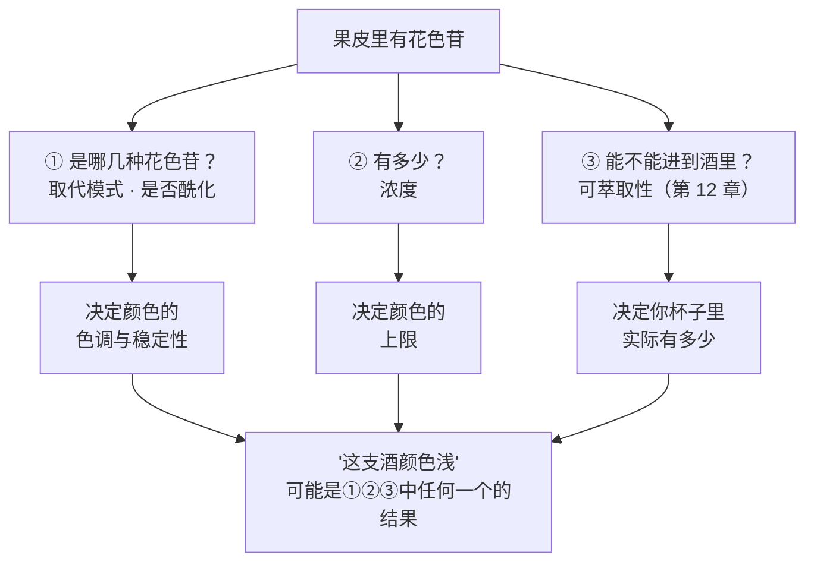
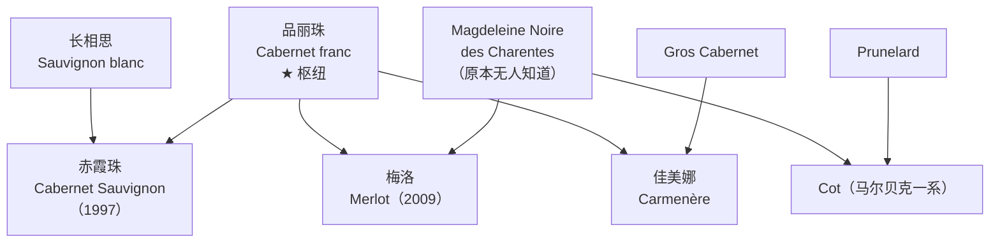
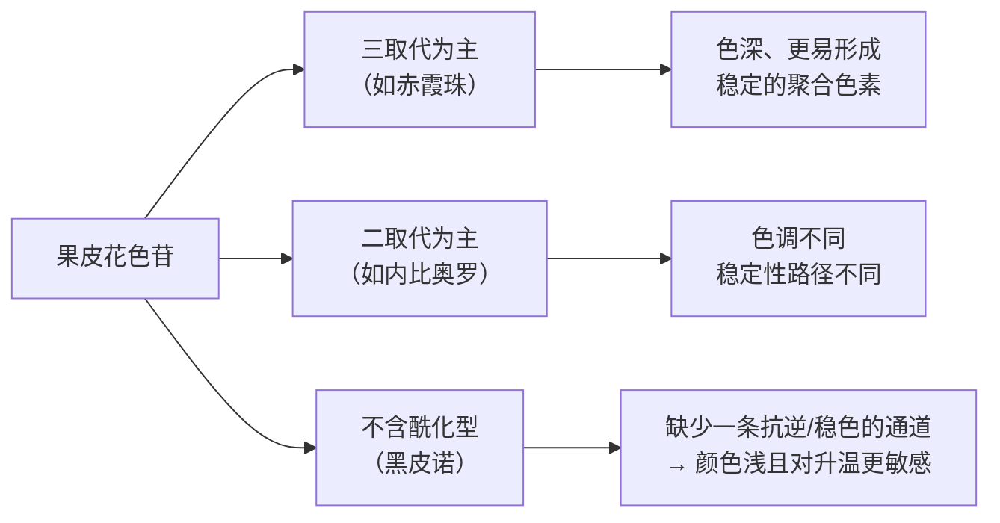

# 第 10 章 红葡萄品种谱系

> **本章目标**：给红葡萄品种建立一套**能预测结构**的组织方式。
>
> 第 9 章按**香气分子**给白品种分组，因为白葡萄酒最大的差异在香气。
> 红葡萄酒不一样：**它最大的差异在酚类**——颜色与单宁。
> 所以本章换一个维度：**花青素的分子形态 + 单宁的来源与结构**，
> 香气只作为少数几个"能定到分子"的补充标记。
>
> 顺带解决一个很少被讲清楚的事实：**几个最有名的红品种其实是一个家族**，
> 而这个家族的枢纽不是赤霞珠，是**品丽珠**。

> **适度饮酒，未成年人不饮酒，酒后不驾车。** 本章的 🅐 实操全部不需要开瓶。

## 10.1 先把"红"这个字的含义说清楚

第 9 章已经给出机制：果皮是否积累**花色苷**[^1]，由**果皮颜色位点**[^2]决定，
白色品种需要 *VvMYBA1* 与 *VvMYBA2* **两个基因都失效**。

[^1]: [花色苷](../../glossary.md#anthocyanin)（英：anthocyanins）。
[^2]: [果皮颜色位点](../../glossary.md#berry-colour-locus)（英：berry colour locus）。

反过来说：**"红葡萄"= 那个位点还有功能的品种**。但这句话只解决了"有没有"，
本章要处理的是**"是哪一种、有多少、能不能进到酒里"**——这三问的答案完全不同，
而市场上绝大多数关于红葡萄品种的说法，都栽在这三者的混淆上。

> **这张图是本章的主心骨**：
> 看到一支颜色浅的红葡萄酒，**至少有三种完全不同的原因**，
> 而"葡萄不好"只是其中一种可能，甚至常常是最不可能的那种。

## 10.2 家谱：枢纽是品丽珠，不是赤霞珠

第 9 章用微卫星标记讲过霞多丽的父母。同一类方法在红品种上给出了更有意思的结果。

**第一块（1997）**：*Nature Genetics* 上的工作用微卫星 DNA 证据支持
**赤霞珠（Cabernet Sauvignon）是品丽珠（Cabernet franc）与长相思（Sauvignon blanc）的后代**；
似然比高度支持这一关系。文中还特意写了一句：
**与品丽珠的近缘关系此前已被怀疑，但长相思的遗传贡献是一个意外。**

**第二块（2009）**：*Aust. J. Grape Wine Res.* 上的工作补上了梅洛（Merlot）
（以下为本书读取其摘要后的复述）：

| 项目 | 内容 |
|------|------|
| 方法 | **55 个核微卫星位点 + 3 个叶绿体微卫星位点**的遗传分析 |
| 母本 | 一个**此前未被登记、不为人知的品种**；先在法国北部布列塔尼被采到（当地中世纪末曾种葡萄），后又在夏朗特四处被找到；作者据种植者的称呼与文献把它命名为 **Magdeleine Noire des Charentes** |
| 父本 | **品丽珠**——即已经参与了赤霞珠亲缘的那一个 |
| 同族 | 作者进一步提出梅洛的亲族群，其中包括 **佳美娜 Carmenère（Gros Cabernet × 品丽珠）**、**Merlot Blanc（梅洛 × Folle Blanche）**、**Cot（Magdeleine Noire des Charentes × Prunelard）** 等 |
| 作者自己的强调 | 一个**从未被收集与登记**的品种，在多个重要品种的起源里扮演了关键角色——所以**趁还来得及，要去挖那些没被收进种质库的老品种** |

> **三条实用推论**：
>
> 1. **"波尔多混酿"在遗传上是一次近亲聚会。** OIV 报告把波尔多式混酿描述为
>    赤霞珠 + 梅洛 + 品丽珠 + 马尔贝克与/或小维铎的组合——
>    其中至少三个是**同一株品丽珠的后代或同族**。
> 2. **"某某品种是某某的兄弟/后代"是可查的，不是修辞。** 和第 9 章一样，
>    这类陈述有明确的检验方式（位点数、似然比）。听到这类说法时，**问它引的是哪项分析**。
> 3. **最重要的那个亲本，曾经没有名字。** 这是本书反复强调的一件事的另一个版本：
>    **"传统说法"与"可查证据"是两回事**，而后者有时会彻底改写前者。

至于西拉（Syrah），OIV 报告写：**遗传研究提示它是 Mondeuse Blanche（萨瓦）与 Dureza（阿尔代什）
杂交的结果**。⚠️ **本书只读到 OIV 报告对该结论的引述，未读到原始文献**，因此写"据 OIV 转引"。

## 10.3 第一个维度：花色苷不是一种分子，而是一族

这是本章最有价值、也最少被通俗资料讲对的一段。

葡萄皮里的花色苷是**一族**分子，彼此差别在两处：

- **取代模式**：B 环上带几个羟基/甲氧基——分**二取代**（如 cyanidin、peonidin 系）
  与**三取代**（如 delphinidin、petunidin、**malvidin** 系）；
- **是否酰化**：糖基上是否再挂一个酰基（乙酰、香豆酰等）。

**为什么这件事重要**：取代模式与酰化直接关系到**色调、对 pH 与二氧化硫的抵抗力，
以及在陈年中转化为稳定聚合色素的路径**。换句话说——

> **同样多的花色苷，可以给出完全不同的颜色表现与颜色寿命。**

已核到的两条一手证据：

| 证据 | 内容 |
|------|------|
| **2015 年 *Food Research International* 的酶试验** | 研究者特意选了**赤霞珠与内比奥罗（Nebbiolo）**做对照，理由写在方法里：**两者的花色苷谱不同，分别以三取代型与二取代型为主** |
| **2022 年 *Plants* 的升温试验** | 在马尔贝克、梅洛、黑皮诺上加装结构使果实区平均日温升高 **1.5~2.0 ℃**。结果**因品种而异**：马尔贝克在转色期、黑皮诺在采收期总花色苷显著下降，梅洛不受影响；升温还提高了**酰化/非酰化花色苷的比值**，作者推测酰化可能是一种应激反应。**而黑皮诺是唯一在采收期总量下降的品种——因为它不产酰化花色苷** |

> **"黑皮诺不产酰化花色苷"这一条，解释了很多事。**
> 它与 OIV 报告里那句看起来矛盾的话正好对上：
> **黑皮诺"果皮富含多酚"，却产出"颜色浅"的酒。**
> **量不是问题，形态才是。**

> ⚠️ **本书在这里踩一次刹车**：
> 上面三条都是**具体研究在具体条件下的观察**，**不是各品种花色苷含量的权威区间**。
> 本书**没有**"某品种典型总花色苷 x~y mg/kg"这类数据（未核到可引用的一手区间），
> 因此**不给任何品种的花色苷数字**，只给**形态差异的方向**。

## 10.4 第二个维度：单宁来自三个不同的地方

红葡萄酒的单宁[^3]不是一种东西，而是**三个来源的混合物**，
而这三者在酿造中**进入酒的时间完全不同**（第 12 章会展开）：

[^3]: [单宁](../../glossary.md#tannin)；另见[皮单宁与籽单宁](../../glossary.md#skin-vs-seed-tannin)
    与[平均聚合度](../../glossary.md#mdp)。

| 来源 | 特点 | 进入酒的条件 |
|------|------|------------|
| **果皮** | 水溶性较好 | 早，**约五天即达最大值的 80~85 %** |
| **果籽** | 外层有**脂质角质层**作为扩散屏障，且富含**没食子酰化**的结构 | 晚，**需十天以上**，且随乙醇浓度上升才逐步突破 |
| **果梗**（若保留整串） | 组成与皮、籽都不同（含黄烷-3-醇与二氢黄酮醇等） | 取决于是否除梗（第 12 章） |

（以上为 2026 年一篇 *Foods* 综述整理的文献共识，本书已读其正文相关段落。）

**品种在这一维度上的差别，本书只能写方向，不能写数字。**
可引用的是 OIV 报告的定性描述——注意它们是**农艺与酿造经验的描述，不是化学测定**：

| 品种 | OIV 报告怎么写的 | 翻到结构坐标上（第 1 章 / 项目 P1）|
|------|----------------|--------------------------------|
| **赤霞珠** | 典型风味为**紫罗兰与青椒**（**若采收偏早则存在吡嗪**）；**结构好、单宁含量高**；常被用于混酿，因为它**单宁感强、颜色深，但并不特别圆润丰腴**；**陈年潜力好**，植物性风味会**逐渐淡去** | 单宁高 · 颜色深 · body 偏"骨架"而非"肉" |
| **梅洛** | 产出**圆润、有结构、颜色深**的酒；**可与更具单宁感的酒混调以取得平衡** | 单宁中 · 颜色深 · 口感偏"圆" |
| **西拉** | 产出**颜色深、单宁高**的酒；其香气"**受消费者欢迎——前提是产量没有过高**" | 单宁高 · 颜色深 ·（香气与产量挂钩，见第 11 章）|
| **黑皮诺** | 果实**糖高、酸度中等、果皮富含多酚**；产出**颜色浅**的酒；温和气候下为**颜色浅至中等、酸度中等**、以**香气复杂度与细腻**著称；**在更靠南的地区品质下降**，因为酒精上升、香气特征减弱 | 单宁（本书不判定）· 颜色浅 · 酸中 · 高度依赖气候 |
| **歌海娜** | 产出**颜色深、"神经质"（nervous）、酒精高**的酒；**常与其他品种混调以取得更好的平衡** | 酒精高 · 常需要混调来补 |
| **丹魄** | **温暖气候下**产出**颜色深、酒精高、酸度低**的酒；**这些特征随产量升高而减弱** | 酸低 · 酒精高 ·（同样与产量挂钩）|

> **两处值得停一下的地方**：
>
> 1. **OIV 对西拉与丹魄都写了"产量一上去，特征就下来"。**
>    这是一份**政府间组织的报告**在说这件事，而不是酒商话术——第 11 章会专门处理它。
> 2. **"陈年潜力好"在赤霞珠词条里是和"植物性风味会逐渐淡去"连着写的。**
>    也就是说，这里的"陈年"指的是**一个具体的、可观察的变化**，
>    而不是"越放越好"这种不可证伪的说法。

## 10.5 第三个维度：少数能定到分子的品种标记

红葡萄酒的香气**大部分不能被归到单一分子**，但有两个例外值得单独记住——
因为它们是**极少数"闻到就能说出分子名"的情况**。

### ① 甲氧基吡嗪：赤霞珠系的青味

**IBMP**[^4] 带青椒 / 草本气息。2000 年 *J. Agric. Food Chem.* 上的工作（第 4 章已引）给出：

[^4]: [甲氧基吡嗪](../../glossary.md#methoxypyrazine)（英：methoxypyrazines）。

- 比较 **50 款**红波尔多与卢瓦尔酒后估得该特征变明显的阈值**约 15 ng/L**；
- 对 **89 款**红波尔多的统计显示**赤霞珠系更常出现**这一植物性特征；
- 成熟过程中 **IBMP 的下降与苹果酸的分解高度相关**，
  且**与品种、土壤类型、天气条件无关**。

OIV 的赤霞珠词条与此一致：**"若葡萄采收偏早，则吡嗪存在"**。

> **所以"青椒味"这个词的正确读法是**：
> 它**不是**"这个品种的味道"，而是**"这批葡萄的成熟度信号"**——
> 而且是一个**有阈值、有测定方法、随成熟下降**的信号（第 7 章）。

### ② Rotundone：黑胡椒

Rotundone[^5] 是极少数**单分子对应单一描述词**的例子。但它同时是本书用来讲
"**阈值不是常数**"的标准教材（第 2、4 章已引）：

[^5]: [rotundone](../../glossary.md#rotundone)（一种倍半萜）。

| 来源 | 阈值 | 人群 | 嗅盲比例 |
|------|------|------|---------|
| 2008 年（转引）| **8 ng/L（水）/ 16 ng/L（红葡萄酒）** | 受训人群 | 约 **1/5~1/4**；嗅盲者在 **4000 ng/L** 仍闻不到 |
| 2020 年（已读摘要）| **140 / 146 ng/L**（前鼻腔 / 后鼻腔，红葡萄酒）| 美国非专业消费者 | 约 **40 %** |

> **两组数字差近一个数量级，本书不裁决**（登记在[出处与资料登记](../../standards.md) §9）。
> 但**买酒时可用的结论非常清楚**：
> **"有黑胡椒味"这句话，有相当比例的人无论如何都验证不了。**
> 所以它是一个**不适合用来争论**的描述词。

⚠️ 一项 2026 年的单年份研究在黑皮诺与蓝佛朗克上测了 rotundone 等分子随采收期的变化，
报告 **rotundone 没有一致的采收期响应**——本书据此**不写"晚收胡椒味更重"**这类规律。

## 10.6 面积与经济：三张表推翻三个常识

OIV 报告（2015 年口径）的国家表里，藏着几条与直觉相反的事实。

| 观察 | 报告写的 | 为什么反直觉 |
|------|---------|------------|
| **法国的第一品种是梅洛** | 梅洛 **112 000 ha（13.9 %）**，是法国**唯一超过 100 000 ha 的品种**；前三名（梅洛、Ugni Blanc **82 000**、歌海娜 **81 000**）占全国三分之一 | 赤霞珠在法国只有 **48 000 ha（6.0 %）**，排第六 |
| **意大利的集中度极低** | 十大品种**只占全国面积的 38 %**；第一名桑娇维塞 **54 000 ha**，是**唯一超过 50 000 ha 的品种**；十五年间全国面积下降约 **20 %**，其中**只有 Glera（+24 %）与灰皮诺（+34 %）在增长** | "意大利品种多"是可量化的：**其余 62 % 的面积分散在十大之外** |
| **中国近三分之二的葡萄园种的是鲜食品种** | 巨峰 **365 000 ha（44 %）**、红地球 **146 000 ha（17.6 %）**；赤霞珠 **60 000 ha（7.2 %）**、佳美娜 8 000、梅洛 7 000、品丽珠 3 000、西拉 1 000、黑皮诺 1 000；全国 **830 000 ha** | 报告原话：**"中国几乎三分之二的葡萄园面积用于种植鲜食品种"**，同时酿酒品种面积近年"相对快速上升" |

全球层面的红品种面积（2015，均取自各品种**词条正文**）：

| 品种 | 面积 | 分布要点 |
|------|------|---------|
| 巨峰（Kyoho）| **365 000 ha** | 世界面积第一的品种，**鲜食**；**九成以上在中国** |
| 赤霞珠 | **341 000 ha** | 2015 年第二；主要在中国、法国、智利、美国、澳大利亚、西班牙、阿根廷、意大利、南非 |
| 梅洛 | **266 000 ha** | 分布于 **37 个国家** |
| 丹魄 | **231 000 ha** | 可能出现在 17 个国家，但 **88 % 的面积在西班牙** |
| 红地球（Red Globe）| **165 000 ha** | 世界第二大**鲜食**品种，**91 % 在中国** |
| 歌海娜 | **163 000 ha** | 法国 + 西班牙合计占其世界面积的 **87 %** |
| 西拉 | **190 000 ha** | 分布于 **31 个国家** |
| 黑皮诺 | **112 000 ha** | 世界第四大品种 |

> ⚠️ **引用纪律复习**（第 9 章 §9.5 那一条）：这份报告的**摘要**写赤霞珠占世界面积 **5 %**、
> **词条**写 **4 %**，**同一份报告内部不一致**。本书因此**只引面积，不引全球百分比**；
> 上表中的国别百分比来自**国家表**，与面积同源，可用。

## 10.7 常见说法辨析

按本书约定标注**证据强度**：✅ 有共识 / ⚠️ 有争议 / ❌ 明确错误 / 缺乏证据。

| 说法 | 判定 | 说明 |
|------|------|------|
| "颜色深说明葡萄好、酒好" | ❌ **至少混淆了三件事** | 颜色由**花色苷的形态、浓度与可萃取性**共同决定（§10.1），再叠加**浸皮时长与温度**（第 12 章）。黑皮诺"果皮富含多酚"却出浅色酒（OIV）——**深浅首先是品种与工艺的事** |
| "黑皮诺颜色浅是因为皮薄、酚类少" | ⚠️ **与已核描述冲突** | OIV 词条写黑皮诺"**果皮富含多酚**"。已核到的一条分子层面的原因是：**黑皮诺不产酰化花色苷**（2022）。⚠️ 本书**不因此断言"皮厚薄不重要"**——皮厚与果粒大小确实影响皮汁比，但那是另一条机制，本书未核到定量比较 |
| "赤霞珠有青椒味，说明这是它的品种特征" | ⚠️ **说反了因果** | IBMP 是**成熟度信号**：其下降与**苹果酸分解高度相关**，且**与品种、土壤、天气无关**（2000）。OIV 的写法是"**若采收偏早则吡嗪存在**"——所以它标记的是**采收决策**，不是品种身份 |
| "好的红葡萄酒单宁都来自果皮，籽单宁是缺陷" | ⚠️ **过度简化** | 皮单宁**约五天到达最大值的 80~85 %**，籽单宁**需十天以上**并随乙醇上升才释放——**两者都是常规红酒的正常组成**，区别在**比例与结构**（第 12 章）。把"籽单宁"直接等同于缺陷，等于把所有长浸皮的酒都判死 |
| "波尔多混酿的几个品种是精挑细选凑出来的互补组合" | ⚠️ **部分成立，但先看家谱** | 它们**在遗传上是一个家族**：赤霞珠 = 品丽珠 × 长相思（1997），梅洛 = Magdeleine Noire des Charentes × 品丽珠（2009），佳美娜 = Gros Cabernet × 品丽珠。互补性是真的（OIV：赤霞珠"单宁强、颜色深但不圆润"，梅洛"圆润"），但**这套组合首先是地理与历史的产物** |
| "赤霞珠是法国种得最多的葡萄" | ❌ **明确错误** | 法国第一是**梅洛 112 000 ha（13.9 %）**，赤霞珠 **48 000 ha（6.0 %）**排第六（OIV，2015 口径）|
| "中国葡萄园面积增长很快，说明中国葡萄酒产业在快速扩张" | ⚠️ **口径问题** | OIV 写明**中国近三分之二的葡萄园用于鲜食品种**（巨峰 44 % + 红地球 17.6 %）。**"葡萄园面积"与"酿酒葡萄面积"是两个数** |
| "这支酒有黑胡椒味，你闻不到是你不够敏感" | ❌ **拿个体差异当水平差异** | rotundone 的嗅盲比例在两项研究中分别为约 **1/5~1/4** 与约 **40 %**；嗅盲者在浓度高达 **4000 ng/L** 时仍闻不到。**闻不到与"不会品"无关**（第 2 章）|
| "内比奥罗颜色浅是因为萃取不足" | ⚠️ **至少还有一种解释** | 已核到的一条：内比奥罗与赤霞珠的**花色苷谱本身不同**（二取代型 vs 三取代型为主，2015）。⚠️ 本书**未核到**内比奥罗花色苷总量的可引用区间，**不下"天生就少"的结论** |
| "意大利品种多但都是小众，不重要" | ⚠️ **数字不支持** | 意大利**十大品种只占全国面积的 38 %**——**剩下 62 % 的面积**由十大之外的品种构成。这不是"边角料"，是**大半个意大利** |
| "某某品种天生单宁 x g/L、花色苷 y mg/kg" | 缺乏证据 | 本书**未核到**任何品种的可引用酚类区间。看到这类数字，先问：**测的是葡萄还是酒？哪一年？多少样本？** 品种间差异常小于年份与产区差异（第 8 章）|

## 10.8 思考题

1. 一支红葡萄酒颜色很浅。请列出**至少三种**机制上不同的原因，
   并说明各自需要什么信息才能区分。
2. 为什么说"黑皮诺果皮富含多酚"与"黑皮诺酒颜色浅"**并不矛盾**？
   请用本章的分子层面证据回答。
3. IBMP 的下降"与品种、土壤类型、天气条件无关"，却"与苹果酸的分解高度相关"。
   这两句话合起来，对"青椒味来自风土"这个说法意味着什么？
4. 皮单宁约五天达到最大值的 80~85 %，籽单宁需十天以上。
   如果一家酒庄说"我们浸皮 21 天以追求柔顺"，你会怎么理解这句话？
   （提示：先不要判断对错，先说它**必然**带来了什么。）
5. **【案例】** 某酒款页面写道：
   *"本款赤霞珠颜色极深，证明葡萄品质卓越；标志性的青椒香气是波尔多风土的印记；
   单宁全部来自果皮，因此柔顺无涩；黑胡椒气息明显，闻不到说明您的味蕾还需要训练。"*
   请逐句判断并改写。（四句各踩中本章一个不同的知识点。）
6. **【案例】** 一位讲师说："法国是赤霞珠的故乡，所以法国种得最多的当然是赤霞珠；
   意大利品种虽多但都很小众，记住桑娇维塞就够了。"
   请用 OIV 的国家表逐句反驳，并说明这两处错误**共同**反映了什么思维习惯。
7. **【查证】** 挑一个红葡萄品种，去查：① 它的亲本（若已知）与文献出处；
   ② 它在 OIV 报告中的面积与主要产国（若在列）；③ 有没有公开文献报告过它的花色苷谱。
   第三项大概率查不到——**请记录你是怎么确认"查不到"的**。
8. 本章对花色苷、单宁都**没有给任何品种的含量数字**，但给了不少"形态"与"方向"。
   请说明：在什么场景下，"方向"比"数字"更有用？在什么场景下反过来？

> 📖 **参考答案**（想清楚再看）：[Q1](../../qa/10-red-varieties-qa.md#q1) ·
> [Q2](../../qa/10-red-varieties-qa.md#q2) · [Q3](../../qa/10-red-varieties-qa.md#q3) ·
> [Q4](../../qa/10-red-varieties-qa.md#q4) · [Q5](../../qa/10-red-varieties-qa.md#q5) ·
> [Q6](../../qa/10-red-varieties-qa.md#q6) · [Q7](../../qa/10-red-varieties-qa.md#q7) ·
> [Q8](../../qa/10-red-varieties-qa.md#q8)

## 10.9 本章实操

🅐 档**全部不需要开瓶喝酒**。

### 🅐 无器具版 · 任务一：把"颜色深"这个词拆成三问

找 **6 段**红葡萄酒的商品描述或酒评，凡是提到颜色的，逐条填下表。

| # | 原文怎么写颜色 | 它在暗示①形态 / ②浓度 / ③萃取 中的哪一个？| 它把颜色和什么挂了钩 | 要验证这句话，需要什么信息 |
|---|--------------|------------------------------------|-------------------|------------------------|
| 1 | | | | |
| … | | | | |

**完成后回答**：这 6 段里，有几段把**颜色直接等同于品质**？
这些描述里有没有任何一段提到了**浸皮时长**（第 12 章会讲，那才是最直接的变量）？

### 🅐 无器具版 · 任务二：画一张自己的红品种家谱

用公开的葡萄品种数据库与本章引用的三项亲子分析（1997 / 2009 / OIV 转引），
把下面这些名字尽量连起来，**连不上的就空着**：

> 赤霞珠 · 品丽珠 · 长相思 · 梅洛 · 佳美娜 · Cot（马尔贝克一系）·
> Magdeleine Noire des Charentes · 西拉 · 黑皮诺 · Gouais blanc · 霞多丽

| 连线 | 我找到的出处 | 证据强度（原文 / 摘要 / 转引 / 查不到）|
|------|------------|----------------------------------|
| | | |

**完成后回答**：**哪一条连线最难找到一手出处？** 为什么？
（提示：本章自己在西拉那条上就只能写"据 OIV 转引"。）

### 🅐 无器具版 · 任务三：用 OIV 国家表做一次"反常识核对"

从 OIV 报告里挑 **3 个国家**的品种表，填下表。

| 国家 | 面积第一的品种 | 它是酿酒还是鲜食 | 十大品种占全国面积的比例 | 我原本以为的第一名 |
|------|--------------|----------------|----------------------|-----------------|
| | | | | |
| | | | | |
| | | | | |

**完成后回答**：三个国家里，你**猜对了几个**？
猜错的那些，错误的来源是什么——是记混了名气与面积，还是记混了酿酒与鲜食？

### 🅑 有条件版 · 任务四：三支红葡萄酒的颜色与单宁对照（备齐后再做）

**所需**：**3 支**红葡萄酒（建议：一支黑皮诺 / 一支赤霞珠或以赤霞珠为主的混酿 /
一支歌海娜或丹魄）、三只同款杯、白纸一张、[品鉴记录表](../../forms/tasting-note.md)三份。

**适度饮酒，未成年人不饮酒，酒后不驾车。** 每杯 20~30 mL 足以完成全部记录。

| 观察项 | 酒 A | 酒 B | 酒 C |
|-------|------|------|------|
| 杯壁边缘的色带（文字描述，不要只写"深"）| | | |
| 倾杯后液面边缘是否透明、宽度 | | | |
| 入口后**第几秒**开始觉得干涩 | | | |
| 涩感位置（舌面 / 齿龈 / 两颊）| | | |
| 第二口比第一口更涩吗 | | | |
| 我猜它浸皮了多久 | | | |

**然后做一次归因练习**：

> 对每一支酒写下："**如果这支酒的颜色再深一倍，最可能是哪一步变了？**"
> 候选项只有三个：**①品种的花色苷形态 ②葡萄的花色苷浓度 ③萃取（浸皮）**。
> 写完之后，去看酒标与酒庄页面上能不能找到第 ③ 项的任何信息。
>
> **多数情况下找不到——这本身就是本章最实用的一个发现：
> 决定你看到的颜色的那个变量，酒标上通常没有。**

## 10.10 🔎 买酒与点酒时的用处

1. **不要把颜色当品质。** 颜色至少有三条互不相同的来路（形态 / 浓度 / 萃取），
   其中只有一条与"葡萄好不好"沾边。
2. **听到"青椒味"，先问采收。** 它是成熟度信号，其下降与苹果酸分解高度相关，
   **与土壤、天气无关**——所以把它说成风土印记的，多半没查过。
3. **听到"黑胡椒味"，不要争。** 相当比例的人对 rotundone 嗅盲（两项研究分别约 1/5~1/4 与 40 %），
   而且**提高浓度也没用**。这是一个不适合作为共同标准的描述词。
4. **看到"长时间浸皮"，想到的应该是籽单宁。** 皮单宁五天就到位，
   **十天以上增加的主要是籽那一部分**——这不是缺点，但它必然改变酒的结构（第 12 章）。
5. **把品种名当成"结构的先验"，不是承诺。** OIV 自己两次写下"产量一高、特征就弱"
   （西拉、丹魄）——**品种给的是上限，产量与工艺决定你拿到多少**（第 11、12 章）。
6. **在意大利酒单上不要只找桑娇维塞。** 十大品种只占该国面积的 38 %，
   **真正的多样性在剩下的 62 % 里**。
7. **报出"单宁 x g/L"的销售材料，请索要测定方法。** 本书查不到任何品种的可引用酚类区间——
   **一个连本书都查不到的数字，卖家从哪里来的？**

## 10.11 本章依据

### A. 已核对摘要的同行评议文献

- **赤霞珠的亲本**：Bowers, J. E.; Meredith, C. P. "The parentage of a classic wine grape,
  Cabernet Sauvignon", *Nature Genetics* **16** (1997) 84–87
  （微卫星 DNA 证据支持赤霞珠为 **Cabernet franc × Sauvignon blanc** 的后代；
  文中称与品丽珠的近缘关系此前已被怀疑，但**长相思的遗传贡献是一个意外**）。
- **梅洛的亲本**：Boursiquot, J.-M. 等，"Parentage of Merlot and related winegrape cultivars
  of southwestern France: discovery of the missing link",
  *Aust. J. Grape Wine Res.* **15** (2009) 144–155
  （**55 个核微卫星 + 3 个叶绿体微卫星位点**；母本为此前未登记的品种，
  作者命名为 **Magdeleine Noire des Charentes**；父本为 **Cabernet franc**；
  同族包括 **Carmenère（Gros Cabernet × Cabernet franc）**、**Cot**、**Merlot Blanc**）。
- **花色苷谱的品种差异**：一项 2015 年 *Food Research International* 的酶试验
  （25 ℃、8 天模拟浸渍；选择**赤霞珠与内比奥罗**做对照，理由是
  **二者花色苷谱分别以三取代型与二取代型为主**；酶制剂使皮的花色苷释放能力提高 **8~15 %**，
  并把达到最大萃取量的时间缩短约 **40 h**；对花色苷谱与总量的显著影响**只出现在赤霞珠上**）。
- **升温与花色苷、以及黑皮诺不产酰化花色苷**：一项 2022 年 *Plants* 的田间试验
  （马尔贝克、梅洛、黑皮诺；结构使果实区平均日温升高 **1.5~2.0 ℃**；
  马尔贝克在转色期、黑皮诺在采收期总花色苷显著下降，梅洛不受影响；
  升温提高**酰化/非酰化花色苷比值**；**黑皮诺不产酰化花色苷**，
  是唯一在采收期总花色苷下降的品种）。
- **IBMP**：Roujou de Boubée, D.; van Leeuwen, C.; Dubourdieu, D.,
  *J. Agric. Food Chem.* **48** (2000) 4830–4834（第 4 章已引：**约 15 ng/L** 的感知门槛；
  **89 款**红波尔多中赤霞珠系更常出现该特征；**IBMP 的下降与苹果酸分解高度相关，
  且与品种、土壤类型、天气条件无关**）。
- **Rotundone**：Hopfer, H. 等，*Nutrients* **12** (2020) 2522
  （红葡萄酒中前/后鼻腔阈值 **140 / 146 ng/L**，样本中约 **40 %** 嗅盲）；
  Wood, C. 等，*J. Agric. Food Chem.* **56** (2008) 3738–3744
  （**8 / 16 ng/L**，约 **1/5~1/4** 嗅盲，嗅盲者在 **4000 ng/L** 仍无法察觉；⚠️ **转引**）。
- **采收期与 rotundone 无一致响应**：一项 2026 年 *Foods* 的**单年份**研究
  （蓝佛朗克与黑皮诺，四个商业园，早/标准/晚三个采收期；1-己醇随采收推迟下降、
  3-SH 倾向上升；**rotundone 无一致的采收期响应**）。⚠️ **单年份、探索性**，本书只用其否定性结论。
- **皮、籽、梗单宁的萃取时序**：见第 12 章依据（2026 *Foods* 综述）。

### B. 已核对原文的国际组织出版物

- **OIV《世界葡萄品种分布》（Focus OIV 2017）**，2015 年面积口径。本章用到：
  **赤霞珠 341 000 ha**（波尔多；品丽珠 × 长相思；晚萌芽、成熟期长；小果粒、小的圆锥圆柱形果串；
  极易感树干病害与白粉病；**2~14 t/ha**，视树势；典型风味紫罗兰与青椒——
  **若采收偏早则存在吡嗪**；结构好、**单宁高**；因**单宁感强、颜色深但不特别圆润丰腴**而常用于混酿；
  波尔多式混酿为赤霞珠 + 梅洛 + 品丽珠 + 马尔贝克与/或小维铎；**陈年潜力好，植物性风味逐渐淡去**）；
  **梅洛 266 000 ha、37 个国家**（波尔多；早萌芽早开花、成熟期中等、**温暖气候易过熟**；
  蔓生、树势正常、**易落花落果**；小果粒小果串、结实好、适合短枝修剪；
  波尔多与南部地区 **6~11 t/ha**；产出**圆润、有结构、颜色深**的酒，**可与更具单宁感的酒混调取得平衡**）；
  **丹魄 231 000 ha**（17 个国家、**88 % 在西班牙**；早萌芽、早熟、生长周期短；直立、高结实；
  易感黑痘病与白粉病、不耐极端干旱与风；树势很高；**2~10 t/ha**；
  **温暖气候下颜色深、酒精高、酸度低**，**这些特征随产量升高而减弱**）；
  **西拉 190 000 ha、31 个国家**（罗讷河谷；**据遗传研究为 Mondeuse Blanche × Dureza**；
  晚萌芽、成熟期短、采收晚；树势高但结实率低；**3~8 t/ha**；
  产出**颜色深、单宁高**的酒，其香气"受消费者欢迎，**前提是产量没有过高**"）；
  **歌海娜 163 000 ha**（西班牙原产，**法国 + 西班牙占其世界面积 87 %**；树势高、直立、
  结实高、果串大；**极耐旱**；易感霜霉、黑痘病、灰霉、落花落果与缺镁，且抗寒锻炼能力受损；
  **2~8 t/ha**；产出**颜色深、"神经质"、酒精高**的酒，**常与其他品种混调以取得平衡**）；
  **黑皮诺 112 000 ha**（勃艮第，可追至 14 世纪；**与 Gouais Blanc 的杂交产生了 21 个法国栽培品种**；
  **早萌芽**故易受春霜、但极耐冬寒；温暖气候下成熟很快；花期低温与高湿导致落果与无核小果，
  **不适合黏重与潮湿土壤**；易感霜霉、灰霉与叶蝉；低结实、小果串、**极小的果粒**，
  产量低（**勃艮第 3~9 t/ha**）；果实**糖高、酸度中等、果皮富含多酚**；
  产出**颜色浅**的酒，桶陈潜力好；温和地带产出**颜色浅至中等、酸度中等**、以**香气复杂度与细腻**
  著称的红酒，**更靠南的地区品质下降**，因为酒精上升、香气特征减弱）；
  **巨峰 365 000 ha**（鲜食；四倍体 vinifera × labruscana 杂交，1945 年由育种者 Y. Ohinoue 育成；
  **九成以上在中国**）；**红地球 165 000 ha**（世界第二大鲜食品种，**91 % 在中国**）。
  **国家表**：法国——梅洛 **112 000 ha（13.9 %）**、Ugni Blanc **82 000（10.2 %）**、
  歌海娜 **81 000（10.0 %）**、西拉 **64 000（7.9 %）**、霞多丽 **51 000（6.3 %）**、
  赤霞珠 **48 000（6.0 %）**、品丽珠 **33 000**、佳利酿 **33 000**、黑皮诺 **32 000**、
  长相思 **30 000**，总计 **806 000 ha**；报告称**三个品种占法国面积的三分之一**，
  且**梅洛是唯一超过 100 000 ha 的品种**。意大利——桑娇维塞 **54 000（7.9 %）**、
  蒙特布查诺 **27 000**、Glera **27 000**、灰皮诺 **25 000**、梅洛 **24 000**……总计 **682 000 ha**；
  报告称**十大品种只占全国面积的 38 %**，**桑娇维塞是唯一超过 50 000 ha 的品种**，
  十五年间全国面积下降约 **20 %**，**只有 Glera（+24 %）与灰皮诺（+34 %）增长**。
  中国——巨峰 **365 000（44.0 %）**、红地球 **146 000（17.6 %）**、赤霞珠 **60 000（7.2 %）**、
  佳美娜 **8 000**、梅洛 **7 000**、品丽珠 **3 000**、霞多丽 **3 000**、雷司令 **2 000**、
  西拉 **1 000**、黑皮诺 **1 000**，其他 **233 000**，总计 **830 000 ha**；
  报告称**中国几乎三分之二的葡萄园面积用于鲜食品种**。
  ⚠️ 该报告**摘要写赤霞珠占世界葡萄园 5 %、词条写 4 %**，本书**只引面积，不引全球百分比**。

### C. 本章有意留白的地方

- **各红葡萄品种的花色苷总量、单宁含量、总酚的典型区间**：本书未核到可引用的一手区间数据，
  **一概不写数字**，只写形态与方向。
- **"黑皮诺皮薄"这一广泛流传的解释**：本书未核到对比果皮厚度/皮汁比与颜色的一手定量研究，
  **不据此立论**，只引用"**不产酰化花色苷**"这条已核到的分子证据。
- **内比奥罗花色苷总量是否低于赤霞珠**：已核到的只有"**谱不同**"（二取代 vs 三取代为主），
  **总量差异未核**，不写。
- **西拉亲本的原始文献**：只读到 OIV 报告对其的引述，**标"据 OIV 转引"**。
- **"晚收会提高 rotundone"**：一项 2026 年单年份研究报告**无一致响应**，本书不写该规律。

以上每一条的完整题录、DOI 与核对状态，见[出处与资料登记](../../standards.md)。

---

**下一章预告**：第 11 章处理**葡萄园里的人为变量**——产量上限为什么被写进法规、
架式与树冠在调什么、以及有机与生物动力各自有多少可引用的证据。
本章两次出现的那句"**产量一高、特征就弱**"，会在那里被正面检验。
