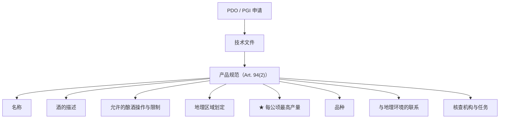
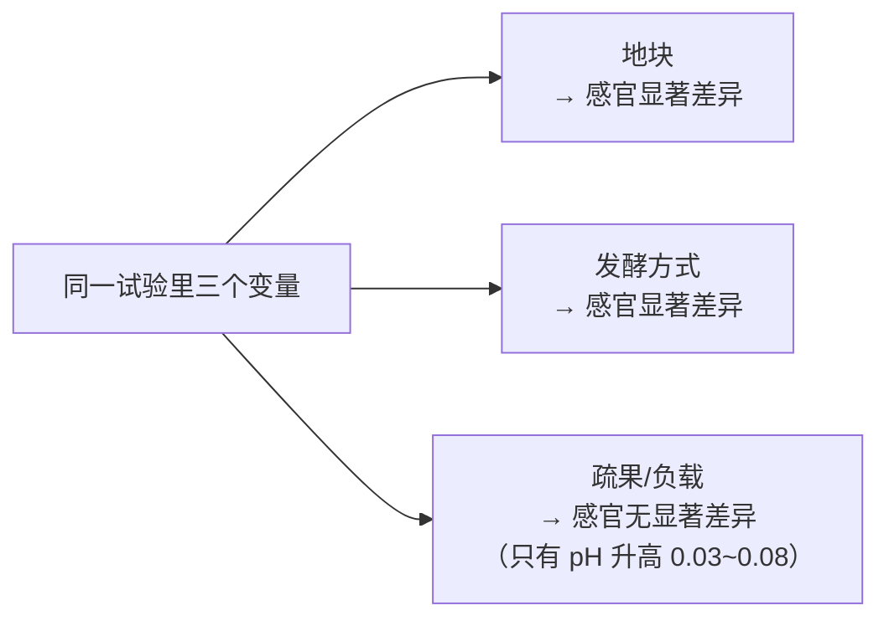
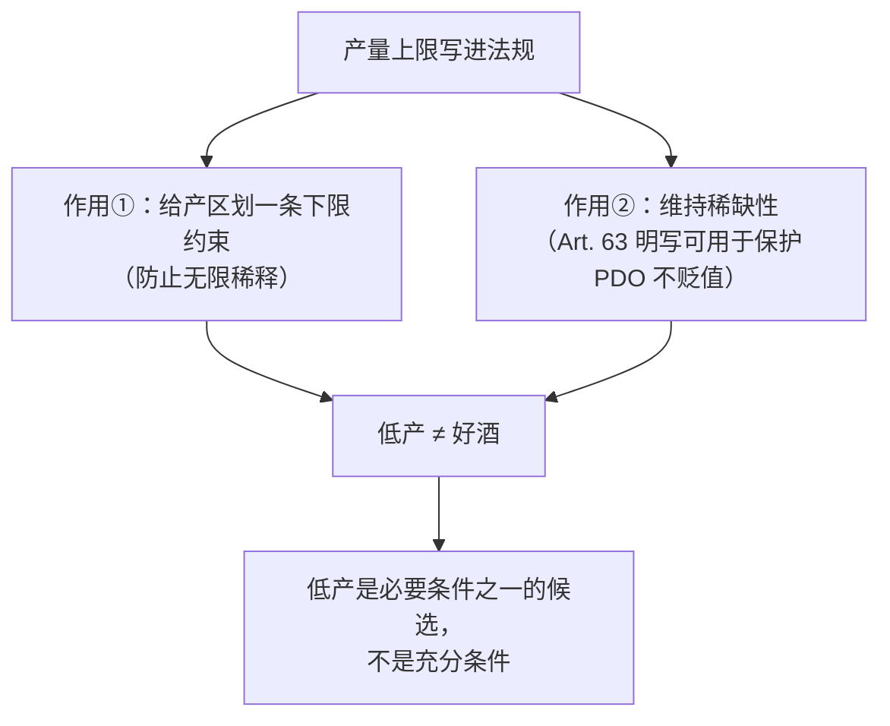
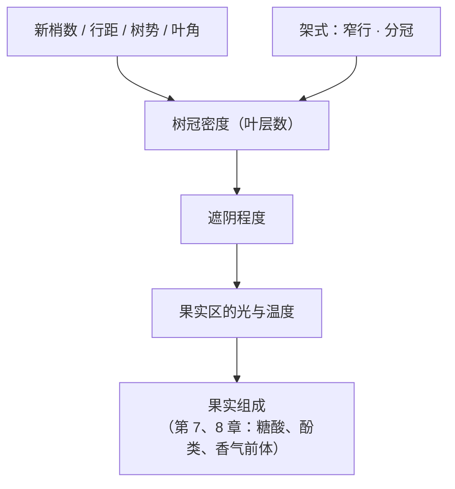
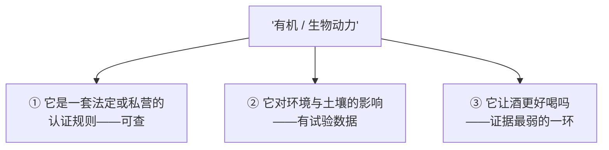

# 第 11 章 葡萄园管理：产量、架式、有机与生物动力

> **本章目标**：处理第二部分最后一组变量——**人在葡萄园里做的事**。
>
> 前面五章讲的是**给定的东西**：植物、年份、地块、品种。
> 这一章讲**可选的东西**：种多密、留多少果、树冠怎么摆、用不用合成农药。
>
> 这也是全书**话术与证据落差最大**的一章。
> 所以本章的组织方式是：**先看法规怎么写（可查）→ 再看试验怎么说（有限）→
> 最后看宣传怎么讲（无限）**。

> **适度饮酒，未成年人不饮酒，酒后不驾车。** 本章的 🅐 实操全部不需要开瓶。

## 11.1 产量：唯一被写进法规的葡萄园参数

酒标上不会写产量，但**产量上限是欧盟地理标志制度的强制内容之一**。

**(EU) No 1308/2013 第 94 条**规定，申请保护原产地名称或地理标志时必须提交**产品规范**，
而产品规范**至少**应包含九项，其中第 (e) 项是：

> **每公顷最高产量（the maximum yields per hectare）。**

同条还要求写明：受保护的名称、酒的描述（PDO 要写主要分析与感官特征）、
**所使用的特定酿酒操作及相关限制**、**地理区域的划定**、**品种**、
**与地理环境的联系依据**、适用的欧盟或国家法规要求、以及**负责核查的机构及其具体任务**。

> **这张图值得记住的原因**：它就是"**产区法规到底管什么**"的完整清单。
> 第四部分会把每一项展开，但**现在你已经可以拿它去对照任何一个产区的规范**：
> 一份规范如果没写产量上限，它就不是欧盟意义上的 PDO/PGI 产品规范。

**另一件被法规管住的事是"能不能种"**。同一部法规的 **Article 62 与 63**：

| 条款 | 内容 |
|------|------|
| **Art. 62(1)** | 按 Art. 81(2) 分类的酿酒葡萄品种，**只有获得授权才能种植或重植**（第 6 章已引 Art. 81）|
| **Art. 62(2)** | 授权对应**以公顷表示的具体面积**，依**客观、非歧视**的资格标准发放，**不向生产者收费** |
| **Art. 62(3)** | 授权**有效期三年**；获授权而未在有效期内使用的生产者要受行政处罚 |
| **Art. 62(4)** | **不适用于**：试验用地、嫁接苗圃、**只供酒农家庭自用**的地块，以及依国家法律因公益强制征购而需新种的地块 |
| **Art. 63(1)** | **保障机制**：成员国每年发放的**新种植授权**，对应其境内**实际种植面积的 1 %**（以上一年 7 月 31 日测定）|
| **Art. 63(2)(3)** | 成员国可在全国层面用**更低的百分比**，也可在区域层面限制；任何限制**必须高于 0 %**，并须以两类理由之一证成：**避免已被充分证明的供过于求风险**，或**避免某个 PDO/PGI 被显著贬值的风险** |

> **两条实用推论**：
>
> 1. **欧盟的葡萄园面积增长速度是被法律封顶的**（每年 1 %），
>    而且**封顶的理由之一明写着"保护某个 PDO/PGI 不被贬值"**——
>    也就是说，**稀缺性在这里是一项法定安排，不只是自然条件**。
> 2. **"家庭自用"是一个法定例外。** 这条在第 6 章的 Art. 81(5) 里也出现过
>    （违规种植须拔除，唯一例外是只供酒农家庭消费的酒）。

## 11.2 产量与品质：证据比口号弱得多

"低产 = 好酒"是葡萄酒世界流传最广的因果句之一。本书的态度是：**先看能查到什么。**

### ① OIV 报告自己说了什么

OIV 的品种词条里，**两次**出现了产量与特征挂钩的表述：

| 品种 | 原文大意 |
|------|---------|
| **丹魄** | 温暖气候下产出**颜色深、酒精高、酸度低**的酒；**这些特征随产量升高而减弱** |
| **西拉** | 其酒的香气"**受消费者欢迎——前提是葡萄产量没有过高**" |

这是**政府间组织的报告**在陈述方向，值得记住。但请注意它的形态：
**它是定性的、无阈值的、没有给出对照设计的。**

同一份报告还在**产量数据的脚注里**写了一句更重要的话
（这是本章最该被记住的一条**方法论**）：

> **产量取决于多个变量——气候条件、土壤类型、灌溉、施肥、架式、
> 株型大小、行距与株距、行向等等。**
> **因此，很难为每个品种给出一个准确的平均产量值。**

也就是说：**OIV 一边给出了各品种的 t/ha 区间，一边明说这些区间难以准确。**

| 品种 | OIV 给出的产量区间 | 备注 |
|------|------------------|------|
| 赤霞珠 | **2~14 t/ha** | 视树势 |
| 梅洛 | **6~11 t/ha** | 波尔多与法国南部地区 |
| 丹魄 | **2~10 t/ha** | |
| 西拉 | **3~8 t/ha** | |
| 歌海娜 | **2~8 t/ha** | |
| 黑皮诺 | **3~9 t/ha** | 勃艮第 |
| 霞多丽 | **3~10 t/ha** | |
| 长相思 | **5~10 t/ha** | |
| Ugni Blanc | **5~20 t/ha** | 白兰地基酒（第 35 章）|
| 巨峰 | **12~15 t/ha** | 鲜食 |
| 红地球 | **8~30 t/ha** | 鲜食 |

> ⚠️ **正确读法**：这些是**同一品种在不同条件下的跨度**，**不是"好酒该在哪一档"**。
> 注意赤霞珠的区间是 **2~14**——**上下相差七倍**。
> **一个跨度七倍的区间，不可能同时是品质标准。**

### ② 受控试验怎么说

已核到的一项**同时比较地块、疏果与发酵方式**的试验
（2025 年 *Foods*，梅洛，两个连续年份、两个地块、两档单株负载）：

| 变量 | 结果 |
|------|------|
| **地块** | **决定性因素**——区分两地块的分析标记是 **3-巯基己-1-醇（3MH）**，B 地块高出 **38~130 %**；地块也造成了**显著的感官差异** |
| **发酵方式**（接种 vs 自然发酵）| **影响大于单株负载**；自然发酵的酒 **2-苯乙酸酯 +58~299 %**、乙酸酯总和 **+54~218 %**、2-苯乙醇 **+24~46 %**，并造成**显著的感官差异** |
| **疏果（降低负载）** | 分析上的标记是 **pH**，低负载使 pH **显著升高 0.03~0.08 个单位**；**感官上没有造成显著差异** |

> ⚠️ **这是一项研究，不是定论。** 单一品种、两个年份、两个地块——
> 不能外推成"疏果没用"。但它足以支持一个更谨慎的表述：
>
> **在这项设计里，"酒庄选哪块地"和"怎么发酵"对成品的影响，都大于"留多少果"。**

**另一条线索**来自加州的一项长期对照试验（见 §11.5）：该试验用的品质代理指标不是产量，
而是**产量与修剪重量之比**（vine balance）——两个处理的**平均修剪重量都落在
每米 0.3~0.6 kg 这一被视为适合产出高品质酿酒葡萄的区间内**，
但**两者的产量/修剪重量比有显著差异**，作者据此判断一组"平衡理想"、另一组"略微超载"。

> **这提示了一个更有用的概念**：
> **重要的可能不是"产量绝对值低"，而是"产量与树体生长量匹配"。**
> ⚠️ 但本书**未核到**这一比值的普适阈值，因此**不给任何推荐区间**。

### ③ 结论：产量是约束，不是保证

## 11.3 树冠与架式：真正被研究透的那一块

相比产量，**树冠微气候**这一块的机理要清楚得多，而且有一篇 1985 年的经典综述
（*Am. J. Enol. Vitic.*）把框架立住了（以下为本书读取其摘要后的复述）：

| 结论 | 内容 |
|------|------|
| 核心变量 | **太阳辐射**受影响最大，因为叶片吸收率高；树冠外部的辐射环境取决于**葡萄园几何形状**与环境辐射水平 |
| 关键指标 | **树冠内的叶层数**决定遮阴程度；综述**主张约三层叶**为适宜的树冠密度 |
| 三种调节手段 | **控制新梢数**、**控制树势**、**选择架式** |
| 什么会加重遮阴 | **每公顷新梢数多、行距宽、树势高、叶片偏垂直** |
| 什么能减轻遮阴 | **窄行**，或**分冠**（canopy division）|

> **为什么这一节比"低产 = 好酒"可靠**：
> 因为它的因果链每一环都是**物理与生理**的——
> 叶片挡光是可测的，果实区温度是可测的，温度对花色苷的影响也有田间试验
> （第 10 章那项 +1.5~2.0 ℃ 的研究）。
> **相比之下，"产量→品质"这一环，中间缺了一个可测量的中介变量。**

**夏季修剪**这一块，一篇 2023 年的综述给出了三条与直觉不同的更新
（以下为本书读取其摘要后的复述）：

1. 由于普遍需要**保护果实免受过热与日灼**，**疏梢与去叶如今被更谨慎、更保守地使用**；
2. 夏季修剪的意义正在变化——这些操作**被当作把成熟导向某个方向的工具**，而不是被动接受；
3. **去叶表现出很高的可塑性**：依时机与方式不同，**产量可增可减、成熟可提前可推迟**；
4. 综述还指出：**疏果正越来越多地被描述成一项"非常规操作"，
   应留给偶发的超载年份**。

> **第 4 条值得单独抄下来。** 它与"每年都要疏果、疏得越狠越好"这种流行说法方向相反，
> 而它来自一篇同行评议综述，不是某位酿酒师的个人偏好。

## 11.4 水与氮：第 8 章那条主线的延续

第 8 章的核心结论是：**气候与土壤对果实组成的影响，很可能经由树体水分状况介导。**
葡萄园管理能直接动这个变量，手段就是**灌溉与施肥**。

已核到的两条：

- **一篇 2018 年的土壤风土综述**（第 8 章已引）：土壤经由**温度、水分供应、矿质供应**
  三条路径起作用；**有限的水分供应限制新梢与浆果生长**，对达到适合高品质红葡萄酒的果实组成
  是关键；**多酚与香气化合物及其前体尤其受树体水分状况影响**；
  **低氮促进多酚合成，但可能对某些香气化合物不利**。
- **一项 2013 年 *J. Agric. Food Chem.* 的试验**（赤霞珠）：四档**调亏灌溉**
  （100 % ETc / 70 % ETc / 转色前 25 % 后 100 % / 全程 25 %）× 两档浸皮（10 天 vs 30 天）。
  结果：**浸皮时长对多数化学参数的影响更大**；
  **调亏灌溉处理对花色苷与原花青素的萃取模式、以及原花青素的来源都没有影响**。

> **这项试验的价值在于它同时量了园里与窖里的变量**，而结论是：
> **在这项设计里，窖里的那个旋钮（浸皮 10 天还是 30 天）转动幅度更大。**
> 这不是说灌溉不重要——它显著影响**葡萄的组成**；
> 但**"葡萄里有多少"与"酒里有多少"之间还隔着一道萃取**（第 12 章）。

## 11.5 有机与生物动力：把三件事分开

这是本章最容易吵起来的一节，所以先**把三个不同的问题拆开**：

### ① 规则层面：谁定的、管什么

| 体系 | 性质 | 要点 |
|------|------|------|
| **欧盟有机生产** | **法规** | 现行框架为 **(EU) 2018/848**；它取代了此前的 **(EC) 834/2007** 与其实施细则 **(EC) 889/2008**（后两者是本节引用的那项长期试验当年遵循的版本）|
| **欧盟有机葡萄酒的酿造规则** | **法规** | **(EC) 203/2012** 对有机酒设定了比常规酒更低的总 SO₂ 上限（第 5 章已登记为**转引**，本书未读到法规原文）|
| **Demeter / 生物动力** | **私营标准**，**不是法规** | 生物动力认证要求使用一套被称为"**制剂**"的九种配方，这是它与有机认证的**主要区别**（见下）|

> ⚠️ **这一区别非常关键**：
> **"有机"在欧盟是有法规定义的，"生物动力"不是**——
> 它是**私营认证体系**的要求。两者在酒标上的法律地位不同（第 20 章会展开）。

### ② 试验层面：已核到的四项

**(a) 有机 vs 常规的产量差距（全球 meta 分析，2012 年 *Nature*）**

> 总体上有机产量**低于**常规产量，但差距**高度依赖情境**：
> 从 **5 % 低**（雨养的豆科与**多年生作物**，在弱酸到弱碱性土壤上）、
> **13 % 低**（采用最佳有机实践时）、到 **34 % 低**（当有机与常规系统最具可比性时）。

⚠️ **葡萄属于多年生作物**，落在差距最小的那一档的描述里——
但该分析是**全农业范围**的，**本书不把 5 % 这个数字外推到葡萄园**。

**(b) 有机 / 生物动力 / 集约的三方对照（德国盖森海姆，雷司令，三个连续生长季，2015 年 *PLOS ONE*）**

| 指标 | 结果 |
|------|------|
| 生长与产量 | **有机与生物动力都显著低于**按良好规范管理的集约处理 |
| **果实品质** | **不受管理体系影响** |
| 生理表现 | 有机与生物动力显著更低，作者认为这可能解释了生长与果串重量的差异 |
| 原因 | 土壤管理与施肥策略；**产量下降部分源于霜霉病发生更重**（有机与生物动力的植保方案排除了合成药剂）|

**(c) 同一片长期试验地的土壤参数（2020 年 *Plants*）**

- 生物动力小区的**容重更低、土壤有机碳更高**——作者认为**很可能来自行间使用的多物种覆盖作物**；
- 但**有机与生物动力小区在株下与轮距处出现铜的累积**，
  作者明确指出这**对长期土壤肥力是问题**，需要寻找铜的植保替代方案。

**(d) 生物动力"制剂"本身有没有效（加州，梅洛，1996 年起的长期重复试验，2005 年 *Am. J. Enol. Vitic.*）**

这是本节最重要的一项，因为它**把"生物动力"与"有机"之间唯一的差别单独拿出来测**：

> 试验设计：**4.9 ha 商业梅洛园**，两个处理——**生物动力**与**有机（对照）**，
> 各 **4 次重复**，随机完全区组。**所有管理措施完全相同，唯一的差别是生物动力处理加了那套制剂。**

| 测的东西 | 结果 |
|---------|------|
| **土壤质量**（前六年）| **没有差异** |
| 叶组织养分、每株果串数、单株产量、果串重、果粒重 | **没有差异** |
| **修剪重量** | 2001—2003 年两个处理**都落在每米 0.3~0.6 kg 这一被视为适合高品质酿酒葡萄的区间内** |
| **产量 / 修剪重量之比** | **有显著差异（p < 0.05）**：生物动力处理被判为**树体平衡理想**，对照被判为**略微超载** |
| 2003 年果实 | 生物动力处理的**糖度显著更高（p < 0.05）**；**总酚与总花色苷值得注意地更高（p < 0.1）** |
| 作者结论 | **生物动力制剂可能影响树冠与果实化学，但在本研究测量的土壤参数与组织养分上未被证明有影响** |

**(e) 一篇 2013 年的文献综述**（*HortTechnology*）把这件事的背景讲清楚了：
生物动力是 1920 年代由 Rudolph Steiner 首次描述的一种有机农业形式；
**使有机认证与生物动力认证区别开来的，正是那九种被认为能改良土壤、提高产量的制剂**；
该综述专门梳理**已发表的、同行评议的**关于制剂的科学证据。

### ③ 所以能说什么、不能说什么

| 陈述 | 能不能说 |
|------|---------|
| "有机/生物动力的产量通常更低" | ✅ 能说（Seufert 2012 的全农业 meta 分析 + 盖森海姆的葡萄试验一致）|
| "生物动力小区的土壤有机碳更高" | ⚠️ **在那片试验地**能说，而且作者把原因归给**覆盖作物**，不是制剂 |
| "有机/生物动力会造成铜累积" | ⚠️ **在那片试验地**观察到了，作者明确视为问题 |
| "生物动力制剂改善土壤" | ❌ **在设计最干净的那项试验里，前六年没有测到差异** |
| "生物动力的酒更好喝" | 缺乏证据 | 盖森海姆试验报告**果实品质不受管理体系影响**；加州试验测到的是**糖度与酚类的差异**，不是感官评定结果 |
| "有机酒对身体更好" | ❌ **不属于本书的讨论范围**——本书不做健康建议（见前置声明）|

## 11.6 常见说法辨析

按本书约定标注**证据强度**：✅ 有共识 / ⚠️ 有争议 / ❌ 明确错误 / 缺乏证据。

| 说法 | 判定 | 说明 |
|------|------|------|
| "低产量就是好酒的保证" | ⚠️ **把约束当成保证** | 产量上限确实被写进 PDO/PGI 产品规范（Art. 94(2)(e)），但它是**下限约束**；**Art. 63 还明写了限制发放授权可用于"避免某 PDO/PGI 被显著贬值"——即维持稀缺性**。而在一项同时比较地块、发酵方式与负载的梅洛试验里，**疏果没有造成感官上的显著差异** |
| "这个品种的合理产量是 x t/ha" | ⚠️ **报告自己反对这种用法** | OIV 在产量数据的脚注里明说：产量取决于气候、土壤、灌溉、施肥、架式、株型、行距株距、行向等，**很难为每个品种给出准确的平均产量值**。赤霞珠的区间是 **2~14 t/ha**——**相差七倍** |
| "老藤产量低所以品质高" | 缺乏证据 | 本书**未在已核对的欧盟条文中见到"老藤"的法定年限定义**（第 6 章已登记）。至于"产量低 → 品质高"这一环，见上一条 |
| "疏果是精品酒庄的标配，越狠越好" | ⚠️ **与一篇综述的方向相反** | 一篇 2023 年的夏季修剪综述指出，**疏果正越来越多地被描述成一项应留给偶发超载年份的非常规操作**；同一综述还指出，由于日灼风险，**疏梢与去叶如今被更谨慎地使用** |
| "架式和树冠都是玄学" | ❌ **这一块反而是机理最清楚的** | 1985 年的经典综述给出可操作的框架：**叶层数决定遮阴**，主张**约三层叶**；**新梢数多、行距宽、树势高、叶片偏垂直会加重遮阴**，**窄行或分冠可减轻** |
| "有机认证和生物动力认证差不多" | ❌ **法律地位不同** | 欧盟有机生产由**法规 (EU) 2018/848** 规定（取代 (EC) 834/2007 与 (EC) 889/2008）；**生物动力是私营标准**，其与有机认证的主要区别就是**必须使用那九种制剂** |
| "生物动力制剂能改良土壤" | ⚠️ **最干净的一项试验没测到** | 加州 4.9 ha 梅洛园、四重复随机完全区组、**唯一差别就是制剂**：**前六年土壤质量无差异**，叶组织养分、产量、果串重、果粒重**均无差异**。该试验确实测到**产量/修剪重量比显著不同**与 2003 年**糖度更高**、酚类与花色苷 p<0.1 更高——所以作者写的是"**可能影响树冠与果实化学**"，而不是"改良土壤" |
| "有机种植产量差不多，只是不用农药" | ❌ **与两类证据都不符** | 全球 meta 分析给出 **5 % / 13 % / 34 %** 三档低产情形；盖森海姆的雷司令试验中有机与生物动力的**生长与产量都显著更低**，**部分原因是霜霉病更重** |
| "有机 = 对土壤更好" | ⚠️ **要看测哪一项** | 同一片试验地上：生物动力小区**容重更低、有机碳更高**（作者归因于覆盖作物），但有机与生物动力小区**在株下与轮距处出现铜累积**，作者明确称其"对长期土壤肥力是问题" |
| "有机/生物动力的酒更好喝" | 缺乏证据 | 盖森海姆试验的结论是**果实品质不受管理体系影响**；本书未核到设计可靠的**盲品**对照结果。⚠️ 注意"**果实化学指标有差异**"与"**盲品能喝出来且更受偏好**"是两件事（第 30、32 章）|
| "欧盟葡萄园可以随便扩张" | ❌ **有法定上限** | **Art. 63(1)**：成员国每年发放的新种植授权对应**实际种植面积的 1 %**；成员国还可设更低比例或区域限制 |

## 11.7 思考题

1. 用自己的话说明：为什么"每公顷最高产量"被写进 PDO/PGI 产品规范，
   **不等于**"产量越低酒越好"？（提示：Art. 63(3) 允许用什么理由限制授权？）
2. OIV 给了赤霞珠 **2~14 t/ha** 的区间，同时在脚注里说很难给出准确的平均产量值。
   一份资料如果引用了这个区间却删掉了脚注，会造成什么误导？
3. 那项梅洛试验里，**地块**与**发酵方式**都造成了显著的感官差异，**疏果没有**。
   这项结果**不能**被用来证明什么？请至少写出两条。
4. 1985 年那篇综述主张树冠约"三层叶"。请说明：
   为什么这个结论比"低产=好酒"更容易被检验？
5. **【案例】** 某酒庄页面写道：
   *"我们采用生物动力法，严格控制产量在 25 hL/ha 以下；
   老藤天然低产，加上生物动力制剂改良了土壤，因此我们的酒有着无法复制的深度；
   有机种植让葡萄更健康，产量与常规无异。"*
   请逐句判断并改写。（四句各踩中本章一个不同的知识点。）
6. **【案例】** 一位侍酒师说："这支酒是生物动力的，所以你能尝出更多的矿物感和活力。"
   请拆解这句话里有几个需要分别检验的断言，并说明各自的证据状况
   （提示：其中一个在第 5、8 章已经处理过）。
7. **【查证】** 找一个你感兴趣的欧盟 PDO 产区，去查它的产品规范原文，
   然后填出 Art. 94(2) 要求的九项里，你能找到几项、分别写在文件的第几节。
   **找不到的那几项也要记下来**——并思考：是规范没写，还是你没找到？
8. 本章把"有机/生物动力"拆成了三个问题（规则 / 环境 / 风味）。
   请说明：为什么一份宣传材料常常把这三者**混在一句话里说**？
   这种混合对读者的判断做了什么？

> 📖 **参考答案**（想清楚再看）：[Q1](../../qa/11-vineyard-management-qa.md#q1) ·
> [Q2](../../qa/11-vineyard-management-qa.md#q2) · [Q3](../../qa/11-vineyard-management-qa.md#q3) ·
> [Q4](../../qa/11-vineyard-management-qa.md#q4) · [Q5](../../qa/11-vineyard-management-qa.md#q5) ·
> [Q6](../../qa/11-vineyard-management-qa.md#q6) · [Q7](../../qa/11-vineyard-management-qa.md#q7) ·
> [Q8](../../qa/11-vineyard-management-qa.md#q8)

## 11.8 本章实操

🅐 档**全部不需要开瓶喝酒**。

### 🅐 无器具版 · 任务一：把一份产品规范拆成九项

挑一个欧盟 PDO/PGI 产区，找到它的产品规范原文（各国主管机构官网通常提供），
按 Art. 94(2) 的九项逐条对照。

| Art. 94(2) 的项 | 规范里在哪一节 | 具体写了什么 | 我的备注 |
|----------------|-------------|------------|---------|
| (a) 名称 | | | |
| (b) 酒的描述 | | | |
| (c) 特定酿酒操作与限制 | | | |
| (d) 地理区域划定 | | | |
| **(e) 每公顷最高产量** | | | |
| (f) 品种 | | | |
| (g) 与地理环境的联系 | | | |
| (h) 适用的欧盟/国家/管理组织要求 | | | |
| (i) 核查机构及其任务 | | | |

**完成后回答**：**(c) 与 (e) 两项，哪一项写得更具体？**
这告诉你这个产区在意的是什么？

### 🅐 无器具版 · 任务二：给十条宣传语做"三分法"

收集 **10 条**带有"有机 / 生物动力 / 自然 / 可持续"字样的宣传语，
按本章 §11.5 的三分法拆开。

| # | 原文 | 它在说①规则 / ②环境 / ③风味 中的哪几个 | 三者被混在一句里了吗 | 这条能被什么证据检验 |
|---|------|------------------------------------|------------------|-------------------|
| 1 | | | | |
| … | | | | |

**完成后回答**：**有几条把①的合规性当成③的品质证明？**
（这是本章最常见的一种偷换。）

### 🅐 无器具版 · 任务三：做一次"产量数字溯源"

找 **5 条**提到具体产量数字（t/ha 或 hL/ha）的资料（酒庄页面、媒体文章、教材皆可），
逐条追问它的来源。

| # | 数字 | 单位是 t/ha 还是 hL/ha | 它说这是什么（法定上限 / 实际产量 / 推荐值）| 出处是否可查 | 有没有说明年份与地块 |
|---|------|---------------------|------------------------------------|------------|-------------------|
| 1 | | | | | |
| … | | | | | |

> **提醒一个容易被忽略的坑**：**t/ha 与 hL/ha 不能直接换算**——
> 中间隔着出汁率，而出汁率取决于压榨强度（第 13 章会讲，欧盟还**禁止过度压榨**）。
> 看到两种单位混用而不说明换算依据的资料，请提高警惕。

### 🅑 有条件版 · 任务四：同一酒庄、两个价位的对照（备齐后再做）

**所需**：同一家酒庄、**同一年份**、同一品种的**两个价位**的酒各一支
（入门款与上一档），两只同款杯，[品鉴记录表](../../forms/tasting-note.md)两份。

**适度饮酒，未成年人不饮酒，酒后不驾车。** 每杯 20~30 mL 即可。

先**不要**看价格标签之外的任何资料，填完记录表，再去查两支酒在酒庄页面上的差别描述。

| 项目 | 入门款 | 上一档 |
|------|-------|-------|
| 六维结构（项目 P1 坐标）| | |
| 我猜的差别来自哪里（园里 / 窖里）| | |
| 酒庄自己说差别来自哪里 | | |
| 酒庄给出的**可核查**信息有哪些 | | |

**然后做一次归因练习**：

> 酒庄给出的差别理由里，有几条属于**园里的变量**（地块、产量、树龄、种植方式），
> 有几条属于**窖里的变量**（浸皮、桶、陈年时间）？
>
> **本章与第 12 章合起来的一个提醒**：
> 在已核到的两项同时比较园里与窖里变量的试验中
> （梅洛的地块/疏果/发酵方式，赤霞珠的调亏灌溉/浸皮时长），
> **窖里的那个变量都不比园里的小**。
> 而**园里的故事更好讲，因为它不可复制**——第二部分导读里已经说过这件事。

## 11.9 🔎 买酒与点酒时的用处

1. **看到"限产 x hL/ha"，先确认它是法定上限还是酒庄自称。**
   PDO/PGI 的产品规范**必须**写最高产量（Art. 94(2)(e)），这个数字是可查的；
   酒庄自称的"我们远低于上限"则需要另外的证据。
2. **不要为"低产"单独付钱。** 产量是约束不是保证；
   而且 Art. 63 明写限制发放种植授权可用于**避免某个 PDO/PGI 被贬值**——
   **稀缺性在这里部分是法定安排**。
3. **"有机"可以查，"生物动力"要看是谁在认证。**
   前者在欧盟由 (EU) 2018/848 规定，后者是私营标准。
4. **把三个问题分开问**：这套做法是**合规**的吗？它对**土壤与环境**做了什么？
   它让**这瓶酒**变成什么样？——第三个问题目前证据最弱。
5. **听到"制剂改良了土壤"，可以提一句那项加州试验**：
   唯一差别就是制剂、四次重复、前六年土壤质量无差异。
   （该试验确实测到了树体平衡与果实化学上的差异——**说得准确比说得绝对更有说服力**。）
6. **架式与树冠是可以正经聊的话题。** 问"行距多少""是不是分冠""去叶在什么时候做"，
   比问"你们限产多少"更能看出对方懂不懂——因为这一块有清楚的机理。
7. **园里的故事听着更贵，但窖里的变量常常更大。**
   下一部分整个都在讲窖里的事。

## 11.10 本章依据

### A. 已核对原文的法规

- **(EU) No 1308/2013 Article 94**（PDO/PGI 申请与产品规范）：技术文件须含名称、申请人、
  **产品规范**与单一文件；**产品规范至少应包含**：(a) 名称；(b) 酒的描述
  （PDO 为主要分析与感官特征，PGI 为主要分析特征及对感官特征的评价或说明）；
  (c) 适用的特定酿酒操作及相关限制；(d) 地理区域的划定；**(e) 每公顷最高产量**；
  (f) 品种；(g) 与地理环境联系的依据；(h) 适用的欧盟或国家法规要求；
  (i) 核查机构的名称地址与具体任务。
  （经 legislation.gov.uk 的欧盟"as adopted"文本核对，2026-09-13。）
- **(EU) No 1308/2013 Article 62 与 63**（种植授权）：Art. 62(1) 分类品种须经授权方可种植或重植；
  62(2) 授权对应以公顷表示的面积，按客观非歧视标准发放、**不收费**；
  62(3) **有效期三年**，未使用者受行政处罚；62(4) 试验用地、嫁接苗圃、
  **仅供酒农家庭消费**的地块与因公益强制征购而新种的地块**不适用**本章；
  **Art. 63(1) 每年新种植授权 = 实际种植面积的 1 %**（以上一年 7 月 31 日测定）；
  63(2) 成员国可采用更低比例或作区域限制；63(3) 限制须**高于 0 %**，
  并须以**避免已被充分证明的供过于求风险**或**避免某 PDO/PGI 被显著贬值的风险**为由。
  （同上，2026-09-13。）
- **欧盟有机生产**：现行框架 **(EU) 2018/848**；此前为 **(EC) 834/2007** 与 **(EC) 889/2008**。
  ⚠️ **本书尚未核对这三部法规的条文原文**，正文只用到"存在这一框架、后者取代前者"这一层，
  **不引用任何具体条款或限值**。
- **(EC) 203/2012**（有机葡萄酒的酿造规则）：第 5 章已登记为**转引**，本书未读到原文。

### B. 已核对原文的国际组织出版物

- **OIV《世界葡萄品种分布》（Focus OIV 2017）**：各品种产量区间
  （赤霞珠 2~14、梅洛 6~11、丹魄 2~10、西拉 3~8、歌海娜 2~8、黑皮诺 3~9（勃艮第）、
  霞多丽 3~10、长相思 5~10、Ugni Blanc 5~20、巨峰 12~15、红地球 8~30 t/ha）；
  **脚注 16 的原文要点**：产量取决于气候条件、土壤类型、灌溉、施肥、架式、株型大小、
  行距与株距、行向等多个变量，**因此很难为每个品种确定准确的平均产量值**。
  另：**丹魄在温暖气候下颜色深、酒精高、酸度低，这些特征随产量升高而减弱**；
  **西拉的香气受消费者欢迎，前提是产量没有过高**。
  报告还提到欧盟曾依 **Council Regulation (EC) No 479/2008** 推行拔除与重组计划
  （对永久放弃葡萄种植给予补贴），这是 2000—2015 年世界面积变化的主因之一。

### C. 已核对摘要的同行评议文献

- **树冠微气候**：Smart, R. E. "Principles of Grapevine Canopy Microclimate Manipulation
  with Implications for Yield and Quality. A Review", *Am. J. Enol. Vitic.* **36** (1985) 230–239
  （**叶层数决定遮阴**，主张**约三层叶**的树冠密度；三种手段为**控制新梢数、控制树势、选择架式**；
  **高新梢数/宽行距/高树势/垂直叶片**加重遮阴，**窄行或分冠**减轻遮阴）。
- **夏季修剪**：一篇 2023 年 *Frontiers in Plant Science* 的综述
  （近 20 年地中海地区夏季修剪研究的更新：因日灼风险，**疏梢与去叶被更谨慎保守地使用**；
  这些操作正被当作**导向成熟的工具**；**去叶的可塑性很高——产量可增可减、成熟可提前可推迟**；
  **疏果越来越多被描述为应留给偶发超载年份的非常规操作**）。
- **地块 / 疏果 / 发酵方式的三方比较**：一项 2025 年 *Foods* 的试验
  （梅洛，两个连续年份、两个地块、两档单株负载，并同时比较接种与自然发酵：
  区分地块的标记是 **3MH**，B 地块高 **38~130 %**；
  疏果的标记是 **pH**，低负载使 pH 显著升高 **0.03~0.08**；
  自然发酵使 **2-苯乙酸酯 +58~299 %**、乙酸酯之和 **+54~218 %**、2-苯乙醇 **+24~46 %**；
  **地块与发酵方式造成显著感官差异，疏果没有**）。
- **调亏灌溉 × 浸皮时长**：一项 2013 年 *J. Agric. Food Chem.* 的试验
  （赤霞珠，四档 RDI × 10 天/30 天皮接触；**浸皮时长对多数化学参数影响更大**；
  **RDI 对花色苷与原花青素的萃取模式及原花青素来源均无影响**；
  延长浸渍导致**花色苷损失、原花青素萃取增加，其中约 73 % 为籽来源**）。
- **有机 vs 常规的产量差距**：Seufert, V.; Ramankutty, N.; Foley, J. A.
  "Comparing the yields of organic and conventional agriculture",
  *Nature* **485** (2012) 229–232（总体有机产量更低，但差距高度依赖情境：
  **5 %**（雨养豆科与多年生作物、弱酸至弱碱性土壤）、**13 %**（采用最佳有机实践）、
  **34 %**（有机与常规系统最具可比性时））。⚠️ **全农业范围，本书不外推到葡萄园**。
- **盖森海姆三方对照**：Döring, J. 等 "Growth, Yield and Fruit Quality of Grapevines under
  Organic and Biodynamic Management", *PLOS ONE* (2015), DOI 10.1371/journal.pone.0138445
  （雷司令，三个连续生长季；有机与生物动力小区依 (EC) 834/2007 与 (EC) 889/2008
  以及 ECOVIN、Demeter 标准管理；**有机与生物动力的生长与产量显著低于集约处理，
  而果实品质不受管理体系影响**；生理表现显著更低；**产量部分因霜霉病更重而下降**）。
- **同一试验地的土壤参数**：一项 2020 年 *Plants* 的研究
  （**生物动力小区容重更低、土壤有机碳更高**，作者归因于行间的多物种覆盖作物；
  但**有机与生物动力小区在株下与轮距处出现铜累积**，作者称其对长期土壤肥力是问题）。
- **生物动力"制剂"的单因素长期试验**：Reeve, J. R. 等 "Soil and Winegrape Quality in
  Biodynamically and Organically Managed Vineyards",
  *Am. J. Enol. Vitic.* **56** (2005) 367–376
  （加州 Ukiah 附近 **4.9 ha 商业梅洛园**，1996 年起；两个处理——生物动力与有机（对照），
  **各四次重复、随机完全区组**；**所有管理措施相同，唯一差别是加了制剂**；
  **前六年土壤质量无差异**；叶组织养分、每株果串数、单株产量、果串重、果粒重**均无差异**；
  2001—2003 年两处理的平均修剪重量都落在**每米 0.3~0.6 kg** 这一"适合产出高品质酿酒葡萄"
  的区间内，但**产量/修剪重量比有显著差异（p<0.05）**——生物动力处理被判为树体平衡理想、
  对照略微超载；2003 年生物动力处理的**糖度显著更高（p<0.05）**，
  **总酚与总花色苷值得注意地更高（p<0.1）**；结论：
  **制剂可能影响树冠与果实化学，但未被证明影响本研究所测的土壤参数与组织养分**）。
- **生物动力制剂的文献综述**：Chalker-Scott, L. "The Science Behind Biodynamic Preparations:
  A Literature Review", *HortTechnology* **23** (2013) 814–819
  （生物动力是 1920 年代由 Rudolph Steiner 首次描述的有机农业形式；
  **使生物动力认证区别于有机认证的，是必须使用九种被认为能改良土壤、提高产量的制剂**；
  该文梳理关于这些制剂的已发表同行评议证据）。
- **土壤风土综述**（第 8 章已引）：van Leeuwen, C.; Roby, J.-P.; de Rességuier, L.,
  *OENO One* **52** (2018) 173–188（土壤经**温度、水分供应、矿质供应**三条路径起作用；
  **有限的水分供应限制新梢与浆果生长**；**多酚与香气化合物及其前体尤其受树体水分状况影响**；
  **低氮促进多酚合成、但可能对某些香气化合物不利**）。

### D. 本章有意留白的地方

- **"老藤"的法定定义与树龄—品质关系**：未核到一手出处（第 6 章已登记），不写。
- **产量/修剪重量比（树体平衡）的普适阈值**：只核到一项试验中被引用的
  **修剪重量每米 0.3~0.6 kg** 这一"适合高品质酿酒葡萄"的区间，
  **比值本身的推荐范围未核到**，因此不给。
- **各国对有机葡萄酒的具体限值**：欧盟有机酒的 SO₂ 上限本书只有**转引**，
  中国与美国的对应规定未核到 → 不写数字。
- **有机 / 生物动力的盲品结果**：未核到设计可靠的对照盲品研究 →
  "更好喝"一律标为**缺乏证据**。
- **"自然酒"**：本书至今未核到任何法域对该词的法定定义，
  正文因此不使用它作为一个有边界的类别。

以上每一条的完整题录、DOI 与核对状态，见[出处与资料登记](../../standards.md)。

---

**第二部分到此结束。** 按[学习路线图](../../roadmap.md)的安排，
**第二部分不单独设实战项目**——品种与风土的内容会在**第四部分的项目 P3（产区深度档案）**
里被完整地用一次。

**下一章预告**：第三部分开讲**酿造**。第 12 章从红葡萄酒的**破碎、浸皮与萃取曲线**开始——
本章两次提到的那句"窖里的变量不比园里小"，在那里会有具体的数字。
