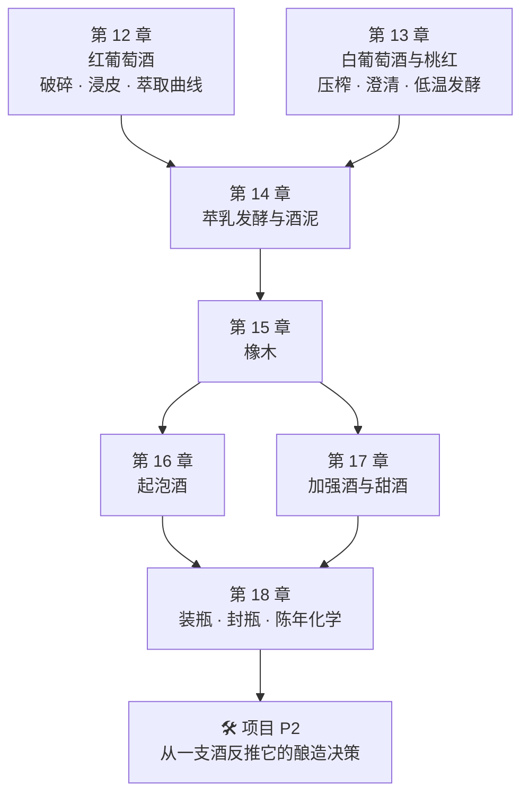

# 第三部分导读 · 酿造与陈年工艺

> **第二部分回答"原料里有什么"，这一部分回答"人对它做了什么"。**
>
> 一句话概括这一部分的立场：
>
> > **每一道工序都是在调某一个结构要素。**
> > 所以"这家酒庄的工艺很讲究"这种说法在本书里是没有信息量的——
> > 有信息量的是"**他们把哪个旋钮转到了哪里，代价是什么**"。

## 为什么这一部分排在产区法规之前

因为**产区法规里有一大半在管工艺**。

第 11 章已经给出了证据：(EU) No 1308/2013 **Art. 94(2)** 要求 PDO/PGI 的产品规范
必须包含"**所使用的特定酿酒操作，以及制作时的相关限制**"——
也就是说，**你要读懂一个产区的规范，得先知道那些操作是什么、在干什么**。
先学工艺再学法规，顺序才对。

还有一个更直接的理由：**第二部分反复撞上同一堵墙。**

- 第 10 章：葡萄里的花色苷有多少，与酒里有多少**不是一回事**——中间隔着萃取；
- 第 11 章：一项试验里，**浸皮 10 天还是 30 天**对多数化学参数的影响，
  大于四档调亏灌溉之间的差别；另一项试验里，**发酵方式**对成品的影响大于疏果。

> **两次都是同一个结论：窖里的旋钮转动幅度不比园里小。**
> 这一部分就是那些旋钮的说明书。

## 这一部分的七章加一个项目在干什么

| 章 | 它回答的问题 | 学完你能做什么 |
|----|-------------|--------------|
| 12 | 颜色和单宁是怎么被"泡"出来的？泡久了会变成什么？ | 看到"浸皮 x 天"就知道酒里多了什么、少了什么 |
| 13 | 为什么白葡萄酒的工艺是"减法"？桃红有哪几种做法？ | 读懂压榨、澄清、低温发酵各自在防什么 |
| 14 | "黄油味霞多丽"是怎么来的？酸度可以被改写吗？ | 把一组香气词归到一道具体工序上 |
| 15 | 香草 / 烘烤 / 椰子味的分子来源是什么？桶贵在哪？ | 分清"桶"与"桶味"的价格差别 |
| 16 | 气泡从哪来？为什么传统法有"面包香"？ | 用气压与酿法读懂起泡酒酒标 |
| 17 | 糖和酒精怎么被"留住"？ | 理解加强与甜酒的两条技术路线 |
| 18 | 瓶里到底在发生什么？塞子之争争的是什么？ | 判断一支酒"还能不能放" |

## 读这一部分的三个提醒

**① 工艺参数不是承诺。** 同一个"浸皮 21 天"，配不同的葡萄、不同的温度、不同的对照组，
可以得出相反的结论（第 10 章 Q4 已经演练过一次）。
本书写工艺时会尽量给出**该参数在文献里被测到的效果方向与条件**，而不是"标准做法"。

**② 这一部分的数字比前两部分多，但同样有边界。** 萃取动力学、发酵温度、气压
都是被反复测量的量，所以本书能给出区间；但**"多少天最好"这类问题没有答案**，
因为它取决于目标风格——**而目标风格不是一个科学问题**。

**③ 法规在这一部分会第一次成为主角。** 欧盟对酿酒操作维持着一份
**正面清单**（允许哪些工艺、哪些物质，各自的条件与限量），
并在另一处写下了一批**禁止事项**（不得加水、不得加酒精、**不得过度压榨**……）。
本书会在相应章节引用原文——**这是酒圈里少数"白纸黑字、可以直接查"的部分**。

> **适度饮酒，未成年人不饮酒，酒后不驾车。** 本部分各章的 🅐 实操依然不需要开瓶。

## 当前进度

- 🔜 第 12 章 [红葡萄酒：破碎、浸皮与萃取曲线](12-red-winemaking-extraction.md)
- 🔜 第 13 章 [白葡萄酒与桃红：压榨、澄清与低温发酵](13-white-and-rose.md)
- ⬜ 第 14 章 苹果酸乳酸发酵与酒泥接触
- ⬜ 第 15 章 橡木：桶的化学、新桶比例与替代品
- ⬜ 第 16 章 起泡酒：传统法、罐式法与气压
- ⬜ 第 17 章 加强酒与甜酒
- ⬜ 第 18 章 装瓶、封瓶与陈年化学
- ⬜ 🛠 项目 P2：从一支酒反推它的酿造决策

完整大纲见[学习路线图](../../roadmap.md)。
