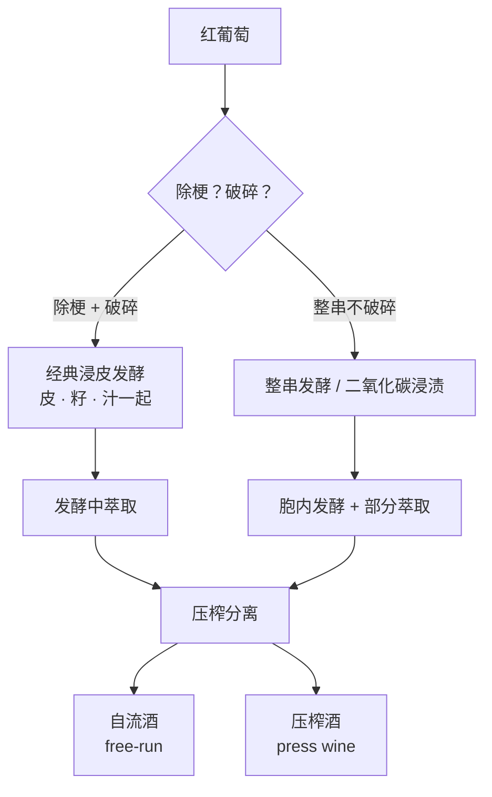
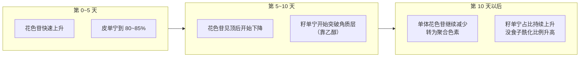
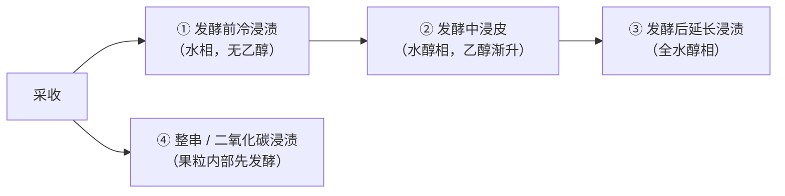

# 第 12 章 红葡萄酒：破碎、浸皮与萃取曲线

> **本章目标**：把"红葡萄酒是怎么做的"讲成**一条可以画出来的曲线**。
>
> 红葡萄酒与白葡萄酒的分界点只有一个：**发酵时果汁与固体在不在一起**。
> 一旦在一起，就有了**浸皮**[^1]；一旦有了浸皮，就有了一个随时间变化的萃取过程。
>
> **本章的核心主张**：**不同的酚类以完全不同的速度进入酒里，
> 有的还会先升后降。** 所以"泡多久"不是一个程度问题，而是一个**取舍**问题——
> 每多泡一天，你都在用一样东西换另一样。

[^1]: [浸皮 / 浸渍](../../glossary.md#maceration)（英：maceration；法：macération）。

> **适度饮酒，未成年人不饮酒，酒后不驾车。** 本章的 🅐 实操全部不需要开瓶。

## 12.1 分界点：固体在不在罐子里

**白葡萄酒的做法正好相反**（第 13 章）：先压榨、把固体拿走，再发酵。
所以本书把两者的差别概括成一句：

> **红葡萄酒是"加法"（把皮里的东西泡出来），白葡萄酒是"减法"（尽量不泡出来）。**

## 12.2 萃取曲线：本章最该记住的一张图

一篇 2026 年的 *Foods* 综述系统梳理了这一块的文献（本书已读其正文相关段落），
下面的数字全部来自该综述对各原始研究的整理：

| 组分 | 时间行为 |
|------|---------|
| **单体花色苷** | 在发酵早期**快速**萃取，通常在**头 4~7 天**达到最高浓度；**此后往往下降，有时下降幅度很大**。这一模式在赤霞珠、梅洛、西拉、黑皮诺、慕合怀特、艾格尼科等多个品种上被一致观察到 |
| 下降的原因 | **被酵母与固体吸附**、**并入聚合色素**、以及**化学降解** |
| **皮来源的黄烷-3-醇** | 因水溶性好而萃取快，**约五天即达到最大浓度的 80~85 %** |
| **籽来源的化合物** | **需要十天或更长**；果籽外层的**脂质角质层是扩散屏障**，形成一个初始滞后期，随发酵中**乙醇浓度上升**而逐步被克服 |
| **黄酮醇** | 极性更低，萃取比花色苷慢；一般在**头 5~7 天**上升，**8~9 天后进一步增强**，之后可能因不稳定苷元水解而下降 |
| **赤霞珠的总单宁** | 一项研究中**约在第 9 天**达到峰值 |
| **羟基肉桂酸类** | 极性高，萃取早；赤霞珠中肉桂酸酯浓度**约在第 4 天**达峰，浸渍结束后明显下降 |

> **三条要带走的结论**：
>
> 1. **颜色不是越泡越深。** 单体花色苷有峰值，过了就下降——
>    但**下降不等于颜色消失**：一部分被转化成了更稳定的**聚合色素**[^2]。
>    综述的表述很准确：**浸渍时长主要影响花色苷的组成与稳定性，而不是简单地影响浓度。**
> 2. **"再多泡几天"换来的主要是籽单宁。** 皮单宁五天就基本到位了。
> 3. **乙醇是一把钥匙。** 籽单宁的释放**不是严格需要乙醇**（水相中也能发生，只是效率低），
>    但乙醇显著加速它——**所以"浸皮"在发酵前后是两种不同的溶剂环境**（§12.4）。

[^2]: [聚合色素](../../glossary.md#polymeric-pigment)（英：polymeric pigments）；
    另见[共色作用](../../glossary.md#copigmentation)。

## 12.3 三个旋钮：时间、温度、酒帽

### ① 时间

同一篇综述给出的经典浸皮发酵时长：**通常 7~14 天**，视温度、酵母、糖含量、
酒帽管理与目标风格而定。其中一项被引用的研究给出的取舍是：

- **较短（7~9 天）**：更能保住新鲜与易饮；
- **较长（至 11 天）**：有利于萃取与**颜色稳定性和结构**相关的酚类，面向陈年。

### ② 温度

红葡萄酒发酵温度**通常维持在 20~30 ℃**。温度提高会：

- **提高细胞膜通透性与酚类溶解度** → 加快扩散、加快萃取；
- 但同时**加速降解、氧化与聚合**，并因挥发而**损失低沸点香气**。

⚠️ 已核到的结果**不一致**，本书并列：

- 在一项黑皮诺研究中，**发酵温度是决定花色苷含量的重要因素，酒帽管理影响较小**；
- 在内比奥罗的类酒模拟萃取与小试酿造中，**单独的温度对花色苷萃取或降解影响有限**。

### ③ 酒帽[^3]

[^3]: [酒帽与帽管理](../../glossary.md#cap-management)（英：cap / cap management）。

发酵产生的二氧化碳把果皮顶到液面，形成致密的**酒帽**。综述里有一个数字很值得记住：

> **帽内的温度可能比下方发酵液高出多达 14 ℃**——
> 因为帽里营养集中、酵母活动旺盛，而散热差。

不管帽会怎样？两头都不好：**温度梯度可能促进萃取，但过高会伤害酵母**；
**压实或混合不良的帽会限制内层萃取，同时表层更易氧化**。

所以帽管理是常规操作，**通常每天一到两次**。主要做法：

| 做法 | 原文术语 | 要点 |
|------|---------|------|
| **压帽** | pigeage / punch-down | 把帽压回液面之下；**小容器上更常用** |
| **淋帽 / 循环** | remontage / pump-over | 从罐底抽液、喷淋到帽上；**大罐上更常用** |
| **旋转罐** | rotary tank | 带挡板，使固体浸入液相 |
| **放液回淋** | délestage / rack and return | **把液体全部放空再倒回帽上**；帽的暂时塌陷改善混合，促进皮来源化合物迁移 |
| **"软"管理** | — | 近年探索：用注入空气或受控释放 CO₂ 让帽保持松散，**不施加强机械作用** |

**帽管理与温度，谁更重要？** 已核到的一项对照试验（2023 年 *Molecules*，
加州中央海岸歌海娜，三档发酵温度 × 压帽/不压帽）给了一个有意思的分裂结论：

| 比较 | 结果 |
|------|------|
| 对**前鼻腔香气**的感知 | **酒帽管理的影响显著大于发酵温度** |
| 对**挥发性化合物的浓度** | **发酵温度的影响大于酒帽管理** |
| 还原味 | **不压帽的酒显著更高**（5.02 vs 压帽的 3.50）|
| 酯类 | "冷/热"处理的酒里己酸乙酯 **650 µg/L**、乙酸异戊酯 **992 µg/L** 更高 |
| β-大马士酮 | **冷处理**的酒更高（**0.719 µg/L**）|
| 颜色 | **高温 + 不压帽**的组合，感知到的色彩饱和度与紫色调显著更高 |

> ⚠️ **诚实说明**：该摘要在几个香气强度评分的表述上**前后不自洽**
> （同一对比里把更高的数值同时给了两个处理），本书**只引用其中能自洽的部分**，
> 并把这一情况登记进[出处与资料登记](../../standards.md)——
> 这是第 9 章那条纪律（"连同一个来源内部都可能不自洽"）的又一次实战。

> **可以带走的那条**：**"不压帽 → 还原味更高"** 有清晰的机理支撑：
> 帽管理同时在管**氧暴露**与**温度分布**，而还原类气味与低氧环境相关（第 31 章）。

## 12.4 时间轴上的四种变体

把"什么时候泡"改一改，就得到四种在酒标与酒评里经常出现的做法。

### ① 发酵前冷浸渍（cold soak）

- **通常 3~5 天**，也有报告做到 **10 甚至 12 天**；
- **温度通常 5~15 ℃**，冷却能力足够时常低至 **3~5 ℃**；
- 常用干冰，因为它**降温快**并同时造出**富 CO₂ 的保护气氛**以限制氧化；
- 低温把酵母压在延滞期、抑制氧化酶、延缓杂菌，通常配合加二氧化硫。

**它的证据状况是本章最值得学的一课**：

> 许多试验报告冷浸渍**提高了花色苷、改变了颜色指标、有时提高总酚**，
> 覆盖赤霞珠、梅洛、西拉、丹魄、慕合怀特、塔娜等多个品种。
> **但结果并不总是一致**：也有研究报告**负面或可忽略的效果**，
> 效果**因品种与年份而异**，甚至**在酒精发酵之后就不再显现**——
> 后者提示**发酵阶段可以把最初的差异抹平**。
>
> 综述自己的结论是：这种变异**不是互相矛盾，而是反映了该技术高度依赖多个交互因素**。

⚠️ 所以本书**不写"冷浸渍能提升颜色"**，只写：
**它在水相中进行，溶剂极性决定了萃取的选择性；其效果高度依赖温度、时长与葡萄基质。**

### ② 整串 / 带梗发酵（whole-bunch）

- 整串比例通常在 **10 %~100 %** 之间；
- 在黑皮诺上研究与应用最多；
- 它同时带来**部分胞内（二氧化碳）浸渍**与**梗来源化合物的萃取**。

已核到的具体结果：

| 观察 | 内容 |
|------|------|
| 梗带来什么 | **梗来源的黄烷-3-醇与二氢黄酮醇（如 astilbin）**，可提高总单宁浓度并改变其组成 |
| 比例的影响 | 普里米蒂沃上 **75 % 优于 50 %**（花色苷浓度与色强的平衡）；黑皮诺上 **20 % 的低比例对花色苷无显著影响** |
| 高比例 | 黑皮诺 **60~100 %** 显著提高黄烷-3-醇（儿茶素、表儿茶素、没食子酸）、多种羟基肉桂酸与白藜芦醇 |
| 单宁来源结构 | **60 % 整串**可提高**梗与皮**来源单宁的比例，**降低籽来源单宁的相对贡献** |
| 反方向的效应 | **梗也会吸附花色苷**，可能降低色强 |
| 口感 | 报告**涩感增加、可能更苦**，但也有**甜感增强**（可能与梗中 astilbin 含量高有关）|
| 香气 | 整串提高香气多样性（花香、苦杏仁、辛香/丁香、植物性、熟果）；但**高整串比例也可能提高甲氧基吡嗪、部分 C6 化合物、β-大马士酮、丁香酚、愈创木酚与肉桂酸乙酯**——对应"青梗味" |

⚠️ 综述明确写道：**关于整串发酵的研究仍然相对有限且零散**，需要更多品种、
梗成熟度、比例与工艺条件的系统研究。

### ③ 二氧化碳浸渍（carbonic maceration）

| 项目 | 内容 |
|------|------|
| 做法 | **完整未破损的果串（通常带梗）**放入密闭耐压容器，先通入 CO₂，之后由发酵自产的气体维持 |
| 机制 | 果粒在缺氧富 CO₂ 环境下**几乎立刻**从呼吸转为发酵性无氧代谢，**在果粒内部**进行**胞内发酵** |
| 产生的酒精 | 在酵母主导的发酵开始前，果粒内已生成**约 1.5~2 %** 的乙醇 |
| 时长 | 几天到约三周，**典型 5~15 天**；**约 30~32 ℃ 时缩短到 5~8 天**，**15 ℃ 时延长到 15~20 天** |
| 历史 | **1934 年由 Michel Flanzy 发明**；最早在法国博若莱实施 |
| 前提 | **果粒不能有破损或感染**；通常配合适度加硫 |
| 酚类 | 与常规对照相比**倾向于更低的花色苷与总酚**（西拉、Cascade、丹魄与 Graciano 的研究）；但也有研究报告丹魄的 CM 酒**色强更高、聚合色素与 vitisin A/B 更高** |
| 感官 | 常表现为**颜色与酒体更轻、单宁口感与涩感更低** |
| 香气 | 常被描述为**更果味**：草莓/樱桃等红色浆果与糖果类气息；丹魄上**总酯与乙酸酯增加**，歌海娜与佳利酿上**二氢肉桂酸乙酯、3-巯基己醇与肉桂酸乙酯更高** |

> **这一条值得单独记**：**"博若莱新酒的糖果香"不是加了什么，
> 而是果粒在缺氧下自己代谢的结果。** 这是第 4 章"二类香气"的一个极端案例——
> **一个几乎完全由工艺决定的香气组。**

### ④ 发酵后延长浸渍（extended maceration）

- 指酒精发酵**结束后**继续与固体接触，再压榨；
- **全水醇介质**，萃取靠**扩散与浓度梯度**而非机械搅拌；细胞结构因先前发酵的高温而更通透；
- 时长**从数天到数周、甚至数月**；实践中**几天**用于微调酚类平衡，**2~4 周或更长**用于增加结构与陈年潜力；
- **风险更高**：失去发酵产生的 CO₂ 保护 → 氧暴露增加、氧化还原条件改变、微生物风险上升；
  常在罐顶充 CO₂；温度可**自然下降**，也有酿酒师**维持 28~30 ℃** 以持续萃取并压制微生物；
- 综述指出可能带来**过度单宁萃取、氧化与微生物败坏**，导致**过苦与过涩**；
  但也有报告称**温热的发酵后延长浸渍可软化波尔多红酒的涩感、增强甜感**。

**一项可引用的对照数字**（2013 年 *J. Agric. Food Chem.*，赤霞珠，第 11 章已引）：

> **10 天（对照）vs 30 天（延长浸渍）**：
> 延长浸渍导致**花色苷损失**、**原花青素萃取增加**，其中**约 73 % 为籽来源**；
> 单体黄烷-3-醇、低聚（2 ≤ mDP < 5）与高聚（mDP ≥ 5）原花青素浓度**都更高**；
> 酒中原花青素的粒径分布呈**双峰**：**mDP 2（占总质量 22~27 %）** 与
> **mDP 6~7（12~17 %）**，整体符合非正态的瑞利型分布。
> ⚠️ **同一试验中四档调亏灌溉对萃取模式没有影响**——**窖里赢了园里**。

## 12.5 热的与新的：把萃取"提速"

除了时间，还可以**破坏细胞结构**来提速。综述把这些归为技术性改造与新兴技术：

| 技术 | 要点 |
|------|------|
| **热浸渍 / 热浸提（thermovinification）** | 把破碎葡萄或葡萄汁加热到 **50~80 ℃**（多用管式换热器）并保持固液接触；**一般不应超过 85 ℃**；加热几分钟到几十分钟；之后**压榨、再冷却到约 35~40 ℃** 接种发酵——**这一点使它区别于常规红酒工艺** |
| **德国的 KZHE** | 破碎葡萄加热到**约 85 ℃、2 分钟**，随后在**约 45 ℃ 温浸 6~10 小时**，再**不带固体**发酵 |
| 热处理的好处 | 快速萃取酚类；**灭活氧化酶（如 PPO）**减少褐变；显著杀灭霉菌、非酿酒酵母、醋酸菌与乳酸菌 |
| 热处理的代价 | 挥发性香气损失与**热降解产生的异味**；**萃取出的酚类胶体稳定性可能更差**，储存中更易沉淀；还可能改变 pH |
| 证据状况 | ⚠️ **研究证据并不总支持其益处**：花色苷的响应**尤其多变**——有的报告升高，有的报告部分降解或"颜色看起来更深但含量没提高" |
| **其他** | 闪释（flash release）、Accentuated Cut Edges、冷冻萃取、**脉冲电场、超声、高压处理、微波、欧姆加热**等非热技术 |

⚠️ **这些技术能不能用、在什么条件下用，是法规问题。** 欧盟维持一份
**授权酿酒工艺的正面清单**（(EU) 2019/934 Annex I Part A Table 1），本书已核对原文，
其中与本章相关的包括：**热处理**（须符合 OIV 酿酒规范相应文件的条件）、
**离心与过滤**（惰性助滤剂不得留下不良残留）、**充惰性气体**（仅限氩或氮）、
**通气或充氧**（仅限气态氧）、**浮选**（仅限氮、二氧化碳或通气）、
**在酿造与陈年中使用橡木片**（含在鲜葡萄与葡萄汁的发酵中使用）等。

## 12.6 法规画出的边界

红葡萄酒酿造里最容易被忽略的三条硬边界，都写在 **(EU) No 1308/2013 Annex VIII Part II**
（本书已核对原文）：

| 条 | 内容 |
|----|------|
| **A.1** | **所有授权的酿酒操作都不得加水**，除非有特定技术必要 |
| **A.2** | **所有授权的酿酒操作都不得加酒精**，例外仅限：用酒精中止发酵的葡萄汁、利口酒、起泡酒、用于蒸馏的加强酒与微起泡酒 |
| **D.1** | **禁止过度压榨葡萄。** 成员国须结合本地与技术条件规定**皮渣与酒脚在压榨后必须含有的最低酒精量**，且该水平**至少相当于所产葡萄酒中酒精体积的 5 %** |

> **D.1 这一条非常有意思**：它是一条**"不许榨太干"**的法律。
> 立法的思路不是去测你用了多大压力，而是**规定副产物里必须还剩下多少**——
> 一个可核查的、结果导向的限制。第 13 章会看到它在白葡萄酒上更直接的后果。

另外两条与本章相关的：

- **C（Blending of wines）**：**禁止把第三国的酒与欧盟酒调配，也禁止第三国酒之间在欧盟境内调配**；
- **酶的用途被写死**：(EU) 2019/934 Annex I Part A Table 2 里，果胶裂解酶、果胶甲酯酶等
  只允许用于**浸渍、澄清、稳定、过滤，以及使葡萄的香气前体显现**——
  **最后一项正是第 4、9 章那条"总量由葡萄定、闻到多少由发酵定"的法律版本。**

## 12.7 常见说法辨析

按本书约定标注**证据强度**：✅ 有共识 / ⚠️ 有争议 / ❌ 明确错误 / 缺乏证据。

| 说法 | 判定 | 说明 |
|------|------|------|
| "浸皮越久颜色越深" | ❌ **与萃取曲线相反** | 单体花色苷通常在**头 4~7 天**见顶，之后**往往下降**（吸附、并入聚合色素、降解）。综述的表述是：**浸渍时长主要影响花色苷的组成与稳定性，而非简单地影响浓度** |
| "长浸皮让酒更柔顺" | ⚠️ **两个方向的证据都有** | 一项赤霞珠对照（10 天 vs 30 天）显示延长浸渍使**原花青素浓度全面升高**、其中**约 73 % 为籽来源**；但综述也引到**温热的发酵后延长浸渍在波尔多红酒上被报告软化涩感、增强甜感**。**结果取决于品种、成熟度与具体方案** |
| "籽单宁苦涩，好酒庄会避免" | ⚠️ **时间上做不到** | 籽来源化合物**需十天以上**才大量进入酒中，而经典浸皮发酵**通常 7~14 天**——所以多数红酒都含有籽来源单宁。真正的变量是**比例与结构**（mDP、没食子酰化比例）|
| "冷浸渍能提取更多颜色" | ⚠️ **结果不一致** | 多个品种上有正面报告，但也有**负面或可忽略**的结果，且**可能在酒精发酵后不再显现**。综述认为这反映了该技术**高度依赖交互因素**，而非研究互相矛盾 |
| "带梗发酵更天然、更好" | ⚠️ **有得有失，且研究有限** | 梗提供**梗来源单宁**并可**提高梗与皮单宁比例、降低籽单宁占比**；但**梗会吸附花色苷**，高比例还可能提高**甲氧基吡嗪**与愈创木酚等"青梗"相关分子。综述明说这块**研究仍相对有限且零散** |
| "博若莱那种糖果香是加了香精" | ❌ **机制清楚** | 二氧化碳浸渍中果粒在**缺氧富 CO₂** 下进行**胞内发酵**，在酵母发酵开始前已生成**约 1.5~2 %** 乙醇；多项研究报告 CM 酒**总酯与乙酸酯增加**、呈现红色浆果与糖果类气息 |
| "压帽比淋帽高级" | ⚠️ **是规模与目标的选择** | 压帽在**小容器**更常用、淋帽在**大罐**更常用。已核到的一项歌海娜试验显示：**帽管理对前鼻腔香气感知的影响大于发酵温度，而温度对挥发物浓度的影响大于帽管理**；**不压帽的酒还原味显著更高** |
| "发酵温度越高酒越浓郁" | ⚠️ **有代价，且证据不一** | 升温提高膜通透性与溶解度、加快萃取，但**加速降解、氧化、聚合**并因挥发**损失低沸点香气**。黑皮诺研究中温度是花色苷的重要因素，**内比奥罗研究中温度单独的影响有限** |
| "热浸提是廉价酒的做法，一定不好" | ⚠️ **要分开两件事** | 热处理确实带来**灭活氧化酶、减少杂菌**等技术优势，也确实可能**损失香气、产生热降解异味、降低酚类胶体稳定性**。⚠️ 而它对**花色苷**的效果在文献里**尤其多变**。**"便宜"与"有害"是两个判断** |
| "酒庄可以往酒里加水调整" | ❌ **欧盟明文禁止** | Annex VIII Part II A.1：**所有授权的酿酒操作都不得加水**，除非有特定技术必要 |
| "榨得越干出酒率越高，酒庄当然会榨到底" | ❌ **有法律上限** | Annex VIII Part II D.1：**禁止过度压榨**；成员国须规定皮渣与酒脚中**最低酒精含量**，且**至少相当于所产酒中酒精体积的 5 %** |
| "'浸皮 30 天'写在酒标上就说明酒好" | 缺乏证据 | 这是一个**参数**，不是一个结论。要判断它意味着什么，至少还需要知道：**是发酵中还是发酵后？温度多少？与什么对照？**（第 10 章 Q4 已演练）|

## 12.8 思考题

1. 用一句话解释：为什么"浸皮时间"影响的是**花色苷的组成与稳定性**，
   而不只是它的浓度？
2. 皮单宁约五天到达最大值的 80~85 %，籽单宁需十天以上。
   请说明这个时间差**在化学上的原因**，以及它为什么让"乙醇"成为关键变量。
3. 酒帽内的温度可比下方发酵液高出多达 14 ℃。
   请列出这一事实带来的**至少三个**必须被管理的后果。
4. 二氧化碳浸渍的酒"颜色与酒体更轻、更果味"。
   请把这两项分别归到本书的哪一层机制上
   （提示：一个与酚类萃取有关，一个与第 4 章的二类香气有关）。
5. **【案例】** 某酒款页面写道：
   *"本款浸皮长达 45 天，因此颜色极深、单宁极其柔顺；
   我们坚持 100 % 带梗发酵以获得最纯粹的果味；
   发酵温度全程 34 ℃ 以最大化萃取；为保证品质，我们把皮渣压榨到不含一丝酒液。"*
   请逐句判断并改写。（四句各踩中本章一个不同的知识点，其中一句可能违法。）
6. **【案例】** 一位酿酒师说："我们不做帽管理，让酒自然地和皮接触，
   这样单宁最柔和、风格最自然。"
   请说明这种做法**必然**带来哪些后果，以及你会追问什么。
7. **【查证】** 去查 (EU) 2019/934 Annex I Part A 的授权工艺表，
   找出**三项**本章没有提到的授权工艺，并记录它们各自的**使用条件与限制**。
   然后回答：这张表的存在，对"酒庄想怎么做就怎么做"这个印象做了什么？
8. 本章给了很多天数（4~7、5、9、10、7~14、3~5、5~15……）。
   请说明：这些数字中哪些是**机理性的**（反映扩散与溶解的物理化学），
   哪些是**惯例性的**（反映风格选择）？区分它们为什么重要？

> 📖 **参考答案**（想清楚再看）：[Q1](../../qa/12-red-winemaking-extraction-qa.md#q1) ·
> [Q2](../../qa/12-red-winemaking-extraction-qa.md#q2) ·
> [Q3](../../qa/12-red-winemaking-extraction-qa.md#q3) ·
> [Q4](../../qa/12-red-winemaking-extraction-qa.md#q4) ·
> [Q5](../../qa/12-red-winemaking-extraction-qa.md#q5) ·
> [Q6](../../qa/12-red-winemaking-extraction-qa.md#q6) ·
> [Q7](../../qa/12-red-winemaking-extraction-qa.md#q7) ·
> [Q8](../../qa/12-red-winemaking-extraction-qa.md#q8)

## 12.9 本章实操

🅐 档**全部不需要开瓶喝酒**。

### 🅐 无器具版 · 任务一：给十条酒庄描述做"旋钮定位"

收集 **10 条**提到红葡萄酒酿造的描述，把每条里出现的参数定位到本章的旋钮上。

| # | 原文里的参数 | 旋钮（时间 / 温度 / 帽管理 / 变体 / 热与新技术）| 它必然带来什么 | 它没说的是什么 |
|---|------------|------------------------------------------|--------------|--------------|
| 1 | | | | |
| … | | | | |

**"它没说的是什么"这一栏最关键**。参考清单：

- 说了浸皮天数，**说温度了吗**？
- 说了浸皮天数，**说是发酵中还是发酵后**了吗？
- 说了整串比例，**说梗的成熟度**了吗？
- 说了"低温发酵"，**给数字**了吗？

**完成后统计**：10 条里，有几条给出了**至少两个**可以互相校准的参数？

### 🅐 无器具版 · 任务二：自己画一张萃取曲线

用本章 §12.2 的数字，在一张纸上画出横轴为天数（0~30）的示意曲线，
至少画三条：**单体花色苷、皮来源黄烷-3-醇、籽来源原花青素**。

| 曲线 | 我画的形状 | 依据（本章哪一条）| 我标注的不确定处 |
|------|----------|----------------|----------------|
| 单体花色苷 | | | |
| 皮黄烷-3-醇 | | | |
| 籽原花青素 | | | |

> ⚠️ **画完请在图上写一句话**：**"本图为示意，纵轴无刻度。"**
> 本书对图的纪律（见前置体例）是：**没有可靠数据来源时，不要把图画成像实测数据的样子。**
> 本章给的是**时间点**（何时见顶、何时起步），**不是浓度值**。

**完成后回答**：如果要把这张图变成真正的数据图，你还需要哪些信息？

### 🅐 无器具版 · 任务三：读一次法规的"禁止事项"

打开 (EU) No 1308/2013 Annex VIII Part II，通读 A~D 四节，填下表。

| 我找到的禁止/限制 | 它管的是哪一步 | 我原本以为可以这么做吗 |
|----------------|-------------|---------------------|
| | | |
| | | |
| | | |

**完成后回答**：这几条限制里，哪一条**最能解释为什么廉价酒也有下限**？

### 🅑 有条件版 · 任务四：两支同产区、不同风格的红酒对照（备齐后再做）

**所需**：同一产区（甚至同一酒庄）的**两支风格明显不同**的红葡萄酒
（例如一支"早饮型"与一支"陈年型"，或一支二氧化碳浸渍法的与一支常规的），
两只同款杯，[品鉴记录表](../../forms/tasting-note.md)两份。

**适度饮酒，未成年人不饮酒，酒后不驾车。** 每杯 20~30 mL 即可。

| 观察项 | 酒 A | 酒 B |
|-------|------|------|
| 边缘色带（文字描述）| | |
| 香气里"红色浆果 / 糖果"类词的比重 | | |
| 入口 3 秒 / 10 秒 / 30 秒时的涩感变化 | | |
| 涩感质地（粗糙—顺滑，第 1 章的 mDP 那条）| | |
| 第二口比第一口累积了多少 | | |
| 我猜的浸皮方案 | | |

**然后做一次归因练习**：

> 对每一支酒写下三个猜测：**① 浸皮大概多少天？② 发酵中还是发酵后延长？
> ③ 有没有整串或二氧化碳浸渍的迹象？**
> 然后去酒庄页面找答案。
>
> **多数情况下找不到完整答案——这正是本章想让你体会的：
> 决定你杯中酚类构成的那几个变量，是酒标上最不透明的部分。**

## 12.10 🔎 买酒与点酒时的用处

1. **看到"长时间浸皮"，先想籽单宁，别想颜色。** 花色苷在头 4~7 天就见顶，
   之后主要是籽来源的化合物在增加。
2. **问"浸皮是在发酵中还是发酵后"。** 这一个问题就能把一段模糊描述变成有信息量的回答——
   两者的溶剂环境、风险与结果都不同。
3. **"温度 + 天数"要成对出现。** 只给天数不给温度的描述，信息量接近零。
4. **在酒单上遇到"二氧化碳浸渍 / 整串"，预期的是风格而不是等级。**
   CM 酒常表现为**颜色与酒体更轻、涩感更低、更果味**——**这是设计，不是缺陷**。
5. **"带梗"不是自动加分项。** 它同时带来梗单宁与"青梗"相关分子
   （甲氧基吡嗪、愈创木酚等），而**梗还会吸附花色苷**。可以问一句：**梗成熟吗？**
6. **听到"我们把每一滴都榨出来"，可以微笑。** 欧盟**禁止过度压榨**，
   并要求皮渣与酒脚里保留**至少相当于成酒酒精体积 5 %** 的酒精。
7. **"加水调整"在欧盟是禁止的**（除非有特定技术必要）——
   所以这类指控需要的是证据，不是想象。

## 12.11 本章依据

### A. 已核对原文的法规

- **(EU) No 1308/2013 Annex VIII Part II**（酿酒限制）：
  **A.1 不得加水**（除非特定技术必要）；**A.2 不得加酒精**
  （例外：以酒精中止发酵的葡萄汁、利口酒、起泡酒、用于蒸馏的加强酒、微起泡酒）；
  **A.3 用于蒸馏的加强酒只能用于蒸馏**；
  **C 调配**：禁止第三国酒与欧盟酒调配，也禁止第三国酒之间在欧盟境内调配；
  **D.1 禁止过度压榨葡萄**——成员国须结合本地与技术条件规定压榨后皮渣与酒脚中的
  **最低酒精量**，且**至少相当于所产葡萄酒中酒精体积的 5 %**；
  **D.3** 禁止压榨酒脚、禁止为蒸馏或 piquette 以外的目的再发酵皮渣。
  （经 legislation.gov.uk 的欧盟"as adopted"文本核对，2026-09-13。）
- **(EU) 2019/934 Annex I Part A Table 1**（授权的酿酒工艺）：本书核对到的相关条目包括
  **1 通气或充氧**（仅限气态氧）、**2 热处理**（须符合 OIV 酿酒规范相应文件的条件）、
  **3 离心与过滤**（惰性助滤剂不得留下不良残留）、**4 制造惰性气氛**（仅为隔绝空气操作）、
  **7 鼓泡**（仅限氩或氮）、**8 浮选**（仅限氮、二氧化碳或通气）、
  **11 橡木片**（用于酿造与陈年，**包括鲜葡萄与葡萄汁的发酵过程**）、
  **18 膜技术耦合活性炭**（仅用于降低酒中过量的 4-乙基苯酚与 4-乙基愈创木酚）、
  **19 含 y-八面沸石的滤板**（仅用于吸附卤代苯甲醚）。
  **Table 2** 中的酶：**果胶裂解酶、果胶甲酯酶**等"**仅用于浸渍、澄清、稳定、过滤，
  以及使葡萄的香气前体显现**"。（同上，2026-09-13。）

### B. 已核对正文相关段落的同行评议综述

- Sternad Lemut, M.; Antalick, G.; Comuzzo, P.; Voce, S.
  "Traditional and Emerging Maceration Techniques in Red Winemaking: Extraction Mechanisms
  Shaping Phenolic Composition, Volatile Profile, and Sensory Expression",
  *Foods* **15** (2026) 2571, DOI 10.3390/foods15142571（PMC13409729）。
  本章用到的要点（均为该综述对多项原始研究的整理，**本书未读到各原始文献**）：
  - **总机制**：果汁与皮渣接触首先萃取**花色苷与皮细胞中的单宁**；
    浸渍时间延长（尤其在酒精发酵期间）**一方面使单体花色苷含量下降**，
    **另一方面因乙醇溶解角质层而使籽来源单宁浓度上升**；
  - **花色苷动力学**：**头 4~7 天**达最大值后**往往下降**（吸附于酵母与固体、并入聚合色素、降解），
    在赤霞珠、梅洛、西拉、黑皮诺、慕合怀特、艾格尼科上一致观察到；
    **浸渍时长主要影响组成与稳定性，而非简单地影响浓度**；
  - **皮黄烷-3-醇**：约五天达最大值的 **80~85 %**；**籽来源需十天以上**，
    外层脂质角质层为扩散屏障，随乙醇上升逐步克服；**乙醇非严格必需，但水相效率更低**；
    一项研究中赤霞珠**总单宁约在第 9 天达峰**；
  - **黄酮醇**：头 **5~7 天**上升、**8~9 天**后进一步增强、之后可能下降；
    与更"天鹅绒感"的涩相关；
  - **羟基肉桂酸**：赤霞珠中肉桂酸酯**约第 4 天**达峰，浸渍后明显下降；
  - **经典浸皮发酵**：**通常 7~14 天**；**7~9 天**偏新鲜易饮、**至 11 天**偏结构与颜色稳定性；
    发酵温度**通常 20~30 ℃**；
  - **酒帽**：帽内温度可比下方液体**高出多达 14 ℃**；帽管理**通常每天一到两次**；
    做法包括 **pigeage / remontage / 旋转罐 / délestage / "软"管理（空气注入或受控释放 CO₂）**；
  - **发酵前冷浸渍**：**通常 3~5 天**（也有 10~12 天报告），**5~15 ℃**（冷却充足时 3~5 ℃），
    常用干冰；**效果报告不一致**，可能在酒精发酵后不再显现；
  - **整串发酵**：比例 **10~100 %**；梗提供黄烷-3-醇与 astilbin；
    普里米蒂沃 **75 % 优于 50 %**、黑皮诺 **20 %** 无显著花色苷影响、**60~100 %** 显著提高
    儿茶素/表儿茶素/没食子酸/多种 HCA/白藜芦醇；**60 % 可提高梗与皮单宁比例、
    降低籽单宁相对贡献**；**梗会吸附花色苷**；可能提高甲氧基吡嗪、C6 化合物、
    β-大马士酮、丁香酚、愈创木酚与肉桂酸乙酯；**研究仍相对有限且零散**；
  - **二氧化碳浸渍**：**1934 年由 Michel Flanzy 发明**；典型 **5~15 天**；
    **30~32 ℃ → 5~8 天**，**15 ℃ → 15~20 天**；胞内发酵产生**约 1.5~2 %** 乙醇；
    倾向于**更低的花色苷与总酚**，但丹魄的一项研究报告**更高的色强、聚合色素与 vitisin A/B**；
    感官上**颜色与酒体更轻、涩感更低**，香气更果味（红色浆果与糖果类）；
  - **发酵后延长浸渍**：数天至数周甚至数月；温度可自然下降或维持 **28~30 ℃**；
    风险为过度单宁萃取、氧化与微生物败坏；**温热条件下在波尔多红酒上被报告软化涩感、增强甜感**；
  - **热浸提**：**50~80 ℃**，**一般不超过 85 ℃**；加热后压榨并冷却到 **35~40 ℃** 接种；
    德国 **KZHE 为约 85 ℃、2 分钟，随后约 45 ℃ 温浸 6~10 小时**；
    优点为灭活 PPO、杀灭杂菌；缺点为香气损失、热降解异味、酚类胶体稳定性下降；
    **对花色苷的效果尤其多变**。

### C. 已核对摘要的同行评议文献

- **延长浸渍 × 调亏灌溉**：一项 2013 年 *J. Agric. Food Chem.* 的试验
  （赤霞珠；四档 RDI × 10 天对照 / 30 天延长浸渍；
  **浸渍时长对多数化学参数的影响更大**；**RDI 对花色苷与原花青素的萃取模式及来源均无影响**；
  延长浸渍造成**花色苷损失、原花青素萃取增加，约 73 % 为籽来源**；
  单体黄烷-3-醇与低聚（2 ≤ mDP < 5）、高聚（mDP ≥ 5）原花青素浓度均更高；
  粒径分布呈**双峰：mDP 2（22~27 %）与 mDP 6~7（12~17 %）**，符合非正态的瑞利型分布）。
- **发酵温度 × 酒帽管理**：一项 2023 年 *Molecules* 的试验
  （加州中央海岸歌海娜；三档发酵温度（冷 / 冷-热 / 热）× 压帽（PD）与不压帽（No PD）；
  描述性分析 n = 8、0~15 线性标度；
  **热发酵 + 不压帽**的组合在感知色彩饱和度（7.89）与紫色调（8.62）上显著更高；
  双因素方差分析显示**酒帽管理对前鼻腔香气感知的影响显著大于发酵温度**；
  **还原味在不压帽的酒中显著更高（5.02 vs 3.50）**；
  挥发物分析显示**发酵温度的影响大于酒帽管理**——"冷/热"处理的酒中
  **己酸乙酯 650 µg/L、乙酸异戊酯 992 µg/L** 更高，**冷处理**的酒中
  **β-大马士酮 0.719 µg/L** 更高）。
  ⚠️ **该摘要在另外两个香气属性的强度表述上前后不自洽**（同一组对比里把更高的数值
  同时给了两个处理），**本书只引用能自洽的部分**。

### D. 本章有意留白的地方

- **"最佳浸皮天数"**：不存在——综述明说最佳时长**取决于目标风格**。本书不给推荐值。
- **冷浸渍是否提高颜色**：文献结果不一致且依赖交互因素，本书**不下方向性结论**。
- **热浸提对花色苷的净效应**：文献"尤其多变"，本书不写方向。
- **各帽管理方式的定量效果对比**：只核到"帽管理对总单宁量影响较小、
  但显著影响单宁结构（分子量与聚合度）"这一层级的表述，**没有可引用的数值**。
- **压榨酒与自流酒的成分差异**：本书尚未核到可引用的一手定量比较 → 第 13 章同样不写数字。
- **中国、美国、澳洲对上述工艺的许可清单**：本章只核到欧盟的正面清单，
  **不得当作世界通则**（与第 6、9 章同一条纪律）。

以上每一条的完整题录、DOI 与核对状态，见[出处与资料登记](../../standards.md)。

---

**下一章预告**：第 13 章处理**白葡萄酒与桃红**——
同样是固液关系的问题，但方向相反：**怎么尽快、尽干净地把固体拿走**。
本章那条"禁止过度压榨"的法规，在那里会变成一个具体的工艺选择。
