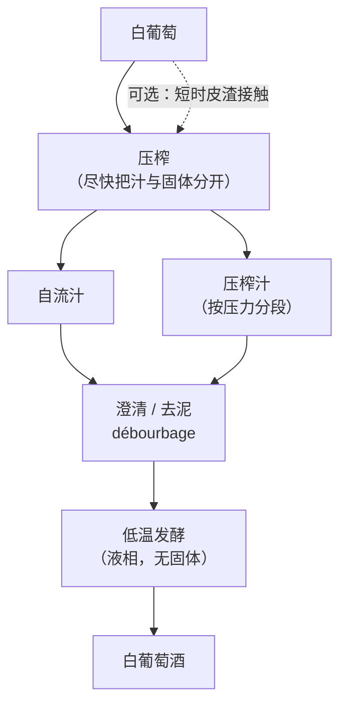
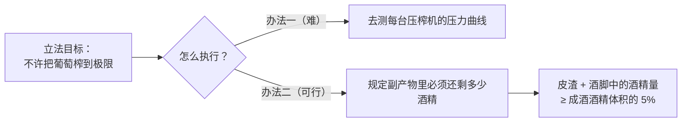
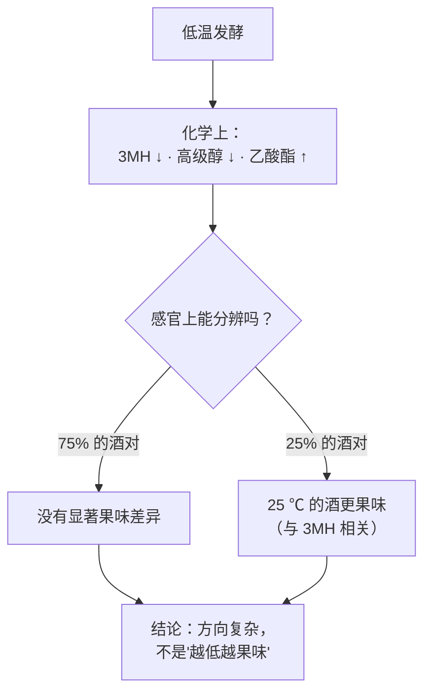
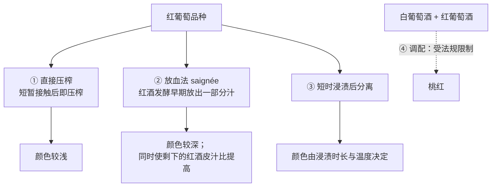
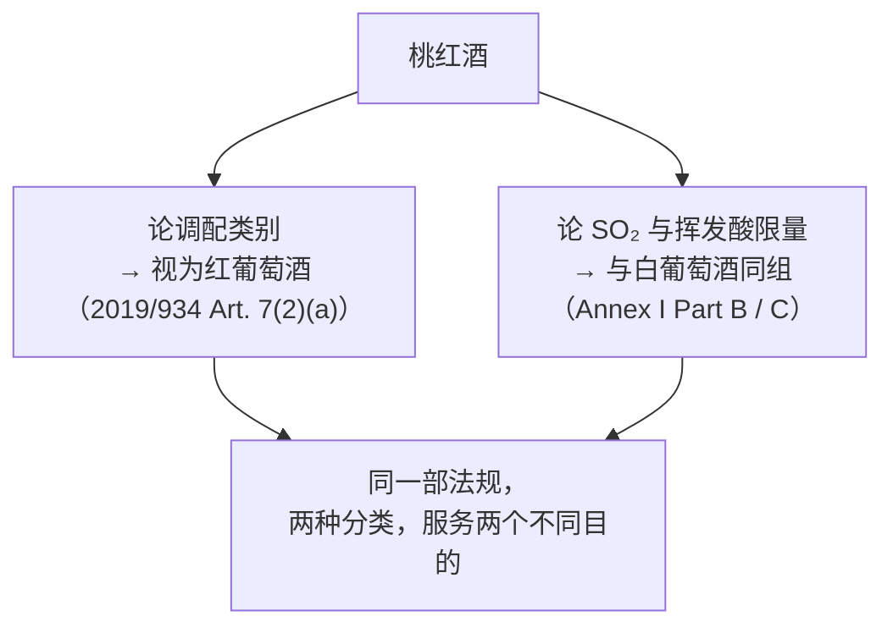

# 第 13 章 白葡萄酒与桃红：压榨、澄清与低温发酵

> **本章目标**：讲清楚一件容易被讲反的事——
> **白葡萄酒的工艺不是"简化版的红葡萄酒"，而是方向相反的一套操作。**
>
> 第 12 章的关键词是"**泡出来**"；本章的关键词是"**别泡出来、赶紧分开、别氧化**"。
> 三道主要工序（压榨、澄清、低温发酵）都在做减法。
>
> 桃红则是第三种情况：**它是一次被严格计时的浸皮**，
> 而且它在法规里的身份很有意思——**有时算白，有时算红**。

> **适度饮酒，未成年人不饮酒，酒后不驾车。** 本章的 🅐 实操全部不需要开瓶。

## 13.1 减法的工序图

**与第 12 章那张图对比，差别只有一处**：
**压榨的位置从"发酵之后"挪到了"发酵之前"。**
这一挪动改变了后面的一切——**因为发酵不再发生在有固体的环境里**。

> **一句话总结两章的关系**：
> **红葡萄酒的问题是"怎么把东西泡出来、什么时候停"；
> 白葡萄酒的问题是"怎么少泡出来、怎么不被氧化"。**

## 13.2 压榨：一条"不许榨太干"的法律

压榨是白葡萄酒的第一个决策点，它同时决定了**出汁率**与**汁里有什么**。

### ① 两种基本路线

| 路线 | 做法 | 特点 |
|------|------|------|
| **整串直接压榨** | 不除梗不破碎，整串进压榨机 | 梗形成天然排汁通道，压力更温和；固液接触时间最短 |
| **除梗破碎后压榨** | 先破碎（可选短时皮渣接触），再压榨 | 出汁率通常更高，但固液接触更久 |

### ② 分段：自流汁与压榨汁

压榨过程中流出的汁**不是均质的**：最初靠自重流出的（自流汁）与随压力升高榨出的
（压榨汁）在成分上不同，实践中会**分开收集**、事后再决定是否调配。

⚠️ **本书在这里必须诚实说明**：
**各压榨段之间成分差异的可引用定量数据，本书尚未核到**，
因此**不给任何"压榨汁酚类高多少"的数字**（登记见[出处与资料登记](../../standards.md)）。
本书只写**分段这件事本身是标准做法**，以及下面这条**可以查的法律约束**。

### ③ 法规：过度压榨是被禁止的

**(EU) No 1308/2013 Annex VIII Part II D.1**（第 12 章已引，这里是它真正的主场）：

> **禁止过度压榨葡萄。** 成员国须结合本地与技术条件，规定压榨后**皮渣与酒脚中
> 必须含有的最低酒精量**；该水平由成员国确定，且**至少相当于所生产葡萄酒中
> 所含酒精体积的 5 %**。

**这条法律的聪明之处在于它的执法方式**：

> **为什么这条对买酒的人有用**：
> 它意味着**"出汁率"在欧盟是有天花板的**。
> 那些"我们只取最精华的头道汁"的说法，描述的是**主动放弃**更高出汁率——
> 这确实是一笔成本，**但它是自愿的，不是稀缺的**。

## 13.3 澄清：把果汁里的固体拿走

压榨得到的葡萄汁浑浊，悬浮着果肉碎片、果皮碎屑、土壤颗粒与胶体。
把它们沉降并分离出来的工序在法语里叫 **débourbage**（去泥）[^1]。

[^1]: [澄清 / 去泥](../../glossary.md#debourbage)（法：débourbage；英：juice settling / clarification）。

**已核对原文的法规允许的手段**（(EU) 2019/934 Annex I Part A Table 1）：

| 手段 | 法规写的条件 |
|------|------------|
| **离心与过滤**（可用或不用惰性助滤剂）| 助滤剂**不得在处理后的产品中留下不良残留** |
| **浮选（flotation）** | **仅可使用氮、二氧化碳，或通气**；须符合 OIV 酿酒规范相应文件的条件 |
| **制造惰性气氛** | **仅用于**在隔绝空气的条件下操作产品 |
| **鼓泡** | **仅可使用氩或氮** |
| **果胶酶类**（果胶裂解酶、果胶甲酯酶等）| **仅用于**浸渍、澄清、稳定、过滤，以及**使葡萄的香气前体显现** |

> **注意"浮选"这一条**：它把气体打进果汁里，让固体**浮上去**而不是沉下来。
> 法规允许用**通气**来做——也就是说，**这是一道法律允许你让果汁接触氧气的工序**。
> 这与"白葡萄酒必须全程隔氧"的流行印象是冲突的（见 §13.4）。

**澄清到底有没有用？** 已核到一项对照试验（2026 年 *Foods*，
马家婆葡萄，比较**是否做澄清**与**装瓶前是否过滤**四种组合，陈放 18 个月后分析）：

| 观察项 | 结果 |
|-------|------|
| 未澄清的酒 | **胶体负荷更高、起泡性更低** |
| 澄清与过滤 | **提高了泡沫高度与稳定性** |
| 挥发物 | **澄清过的酒果香与花香酯类浓度更高** |
| 未澄清且未过滤的酒 | **挥发性酚类与挥发酸更高**，对应令人不快的气味 |
| 感官 | 各处理之间**可被察觉的差异**，尤其在酚类、果香/花香与美拉德类香气上 |

⚠️ **这是一项以"祖传法"起泡酒为对象的试验**（单一年份、单一品种），
本书**只用其方向性结论**，不外推为所有白葡萄酒的定量规律。

> **可以带走的方向**：**澄清程度影响的是"发酵会产生什么"，而不只是"酒清不清"。**
> 汁里的固体既是营养也是麻烦——它们改变发酵的进程，从而改变酯的组成（第 3 章）。

## 13.4 氧化：白葡萄酒真正的主线

红葡萄酒有大量酚类作为抗氧化缓冲，白葡萄酒没有。所以**氧化管理是白葡萄酒工艺的主线**。

### ① 机制：PPO、羟基肉桂酸与 GRP

葡萄汁一旦接触氧，果实自带的**多酚氧化酶（PPO）**就开始把**羟基肉桂酸类**
（咖啡酰酒石酸即 caftaric acid 等）氧化成醌；醌进一步反应导致**褐变**。
其中一条重要去路是与**谷胱甘肽**结合，生成被称为 **GRP**[^2] 的产物。

[^2]: [GRP · 葡萄反应产物](../../glossary.md#grp)（英：grape reaction product）；
    另见[谷胱甘肽](../../glossary.md#glutathione)。

已核到的一项对照试验（2024 年 *Foods*，比较 SO₂、纯谷胱甘肽与富含谷胱甘肽的
失活酵母对白葡萄汁褐变的保护）：

| 处理 | 结果 |
|------|------|
| **SO₂** | **大幅降低耗氧速率（约 72 %）**；**保护羟基肉桂酸免于氧化**；**即使存在漆酶也能防止褐变**——在对照条件下使颜色的蓝黄分量（b*）**降低约 91 %**，有漆酶时**降低约 76 %** |
| **纯谷胱甘肽（GSH）** | 耗氧速率**降低约 23 %**；**促进由羟基肉桂酸生成 GRP**；在**健康葡萄**条件下有效防褐变（b* **降低约 81 %**）；**有漆酶时效果不足**（b* 仅降低约 **39 %**）|
| **富含 GSH 的失活酵母** | 耗氧速率**降低约 36 %**；有漆酶时 b* 仅降低约 **24 %** |
| 作者结论 | 两种形式的 GSH 都可作为 SO₂ 的**有意思的替代工具**，**但仅限于葡萄健康的情况** |

> **这组数字非常适合记住，因为它一次性说清了三件事**：
>
> 1. **SO₂ 在白葡萄酒里不是可有可无的添加剂**，它在耗氧速率上的作用是**数量级级别**的；
> 2. **替代方案存在，但有适用条件**——"葡萄健康"这个前提，
>    在灰霉（带来漆酶）年份就不成立；
> 3. **"零添加"的代价是可以被测量的**，不是一个哲学问题（第 5 章已铺垫）。

### ② 两条路线：保护式与"先氧化再说"

行业里存在两条方向相反的思路：

| 路线 | 思路 | 代价 |
|------|------|------|
| **还原式 / 保护式** | 全程隔氧（惰性气氛、鼓泡用氩或氮、加 SO₂）| 保住易氧化香气（如硫醇），但还原类气味风险上升（第 31 章）|
| **让汁先氧化** | 让果汁中易氧化的酚类先被氧化并沉淀掉，**成酒反而更稳定** | 会损失一部分香气前体 |

⚠️ **本书未核到可引用的对照试验来比较这两条路线的成品差异**，
因此**只陈述两条路线存在及其各自的理由**，**不做优劣判断**（见 §13.9 留白）。

## 13.5 低温发酵：一个被夸大也被低估的旋钮

"低温发酵保留果香"几乎是白葡萄酒宣传的标配。**本书已核到的一手证据比这句话复杂得多。**

一项 2017 年 *J. Agric. Food Chem.* 的试验（第 3 章已引，这里完整展开）：

> **设计**：两批马尔堡长相思葡萄汁 × **4 株酿酒酵母** × **12.5 ℃ 与 25 ℃** 两档发酵温度；
> 定量 **32 个**香气化合物。

| 层面 | 结果 |
|------|------|
| 化学 | 其中 **14 个**化合物驱动了处理间的差异：**12.5 ℃ 的酒 3MH 与高级醇更低、果味乙酸酯更高** |
| **感官** | 品评组在 **75 % 的酒对**中**没有测到显著的果味差异** |
| 有差异的那 25 % | **25 ℃ 发酵的酒更果味**，且高果味与 **3MH** 相关 |
| 作者的解释 | 低温的益处可能在于**果味与青味之间的平衡**，而不是单纯提高果味 |
| 作者的额外提示 | **提高发酵温度或许可以在不损害品质的前提下降低能耗** |

> **这是全书最值得反复讲的一种结果形态**：
> **化学上测到了差异（14 个化合物），感官上大部分测不出来。**
>
> 它同时提醒两件事：
> **① "有统计显著的化学差异"不等于"喝得出来"；**
> **② 但也不能因此说低温没用——它在有差异的那部分里改变了方向。**

## 13.6 白葡萄酒也可以浸皮

第 12 章那篇综述里有一句容易被略过的话：
经典的浸皮发酵"**也越来越多地用于更复杂的、经过浸渍的白葡萄酒**"。

这就是俗称"橙酒"的那一类[^3]：**用白葡萄品种，但按红葡萄酒的方式带皮发酵**。
按本书的框架，它的后果是**可以从第 12 章的曲线直接推出来的**：

[^3]: [带皮发酵白葡萄酒](../../glossary.md#skin-contact-white)（英：skin-contact white / "orange wine"）。

- 会萃取出**皮来源的黄烷-3-醇**（约五天达 80~85 %）与更晚出现的**籽来源单宁**；
- 因此会有**涩感**——这在常规白葡萄酒里几乎不存在；
- 颜色变深来自**非花青素类酚的氧化与聚合**，而**不是**花色苷（白品种没有）。

⚠️ **本书未核到针对这一类酒的系统性一手研究**，因此**不给时长、不给风格断言**，
只写**它的机制与常规白葡萄酒的差别在哪**。

## 13.7 桃红：被计时的浸皮，与一个法律身份问题

### ① 三条工艺路线

**放血法有一个常被忽略的副作用**：它的**本来目的往往是浓缩剩下的那批红葡萄酒**
（放走一部分汁 → 剩下的皮汁比升高）。
所以**这一类桃红在有些酒庄里是红葡萄酒生产的副产品**——
这不是贬义，但它解释了为什么同一酒庄的桃红与红酒常常"同源"。

### ② 时间尺度：桃红的浸渍以小时计

一项 2005 年 *J. Sci. Food Agric.* 的试验很好地示范了这一点：

> **设计**：发酵前浸渍 **8 小时**，分别在 **5 ℃、10 ℃、15 ℃** 三档温度下进行，
> 从葡萄汁阶段一直跟踪到装瓶后 **6 个月**。

| 处理 | 结果 |
|------|------|
| **15 ℃** | **色强、a\*、C\* 最高**；**malvidin-3-葡萄糖苷含量最高**；**酒精与乙酸乙酯最低**；**只有这一组在瓶中 6 个月后释放出萜烯醇**；非正式感官评价中**得分最高** |
| **5 ℃** | **酯类水平最高**，且在储存中**更稳定**；非正式感官评价中**得分最低** |
| 方法学观察 | 以浸渍温度为区分变量时，**挥发性化合物**贡献最大；以取样时间为区分变量时，**颜色与酚类参数**更重要 |

> ⚠️ **诚实说明**：该研究的感官评价被原文称为"**非正式的（informal）**"，
> 因此本书**不把"15 ℃ 更好"当成结论**，只引用其**化学与颜色的对照结果**。

**但有一条方向性的东西值得记住**：
**在 8 小时这个尺度上，温度差 10 ℃ 就足以改变颜色、酯类与陈年中的香气释放。**
对比第 12 章红葡萄酒动辄 7~14 天的浸皮——**桃红是一门关于分钟与小时的手艺。**

### ③ 法律身份：同一部法规里，桃红有时算白，有时算红

这是本章最有趣的一条，而且**两处都已核对原文**。

**(A) 论调配（coupage）时，桃红算红。**
**(EU) 2019/934 Article 7**：

- **第 1 款**：**"coupage"** 指**不同来源、不同品种、不同年份或不同类别**的酒或葡萄汁的混合；
- **第 2 款 (a)**：**红葡萄酒、白葡萄酒**，以及可产出这两类酒的葡萄汁或酒，
  属于**不同类别**；并明确写道——**就本款而言，桃红酒应被视为红葡萄酒**；
- **第 3 款**：以下**不算 coupage**：用浓缩葡萄汁或精馏浓缩葡萄汁进行的**增浓**；以及**加甜**。

**Article 8 第 1 款**给出了那条被广泛传播、却常被讲得不准确的规则：

> **不带 PDO/PGI 的白葡萄酒与不带 PDO/PGI 的红葡萄酒进行 coupage，不能产出桃红酒。**
> **但是**，上述限制**不排除**这种 coupage——当最终产品用于制备
> (EU) No 1308/2013 Annex II Part IV 第 12 点定义的 **cuvée**（即起泡酒的基酒），
> 或用于生产**微起泡酒**时。

⚠️ **所以准确的说法是**：这条禁令**针对的是无地理标志的酒**，
**例外是起泡酒的 cuvée 与微起泡酒**——
而不是笼统的"欧盟禁止混调做桃红，只有香槟例外"。

**(B) 论二氧化硫与挥发酸限量时，桃红和白葡萄酒一组。**
**(EU) 2019/934 Annex I Part B 与 Part C**（第 5 章已核对原文）：

| 指标 | 红 | **白与桃红** |
|------|----|------------|
| 总 SO₂ 上限（一般情形）| **150 mg/L** | **200 mg/L** |
| 糖含量（葡萄糖+果糖）≥ 5 g/L 时 | **200 mg/L** | **250 mg/L** |
| 挥发酸上限 | **20 meq/L** | **18 meq/L** |

> **这条为什么重要**：它是一个绝佳的提醒——
> **"某种酒属于哪一类"这个问题，必须先问"为了什么目的分类"。**
> 把桃红归到红那边是为了**防止用调配伪造品类**；
> 把它归到白那边是为了**匹配它的化学脆弱性**（酚类少、更易氧化）。
> **分类不是本质，是工具。** 第四部分处理产区体系时，这条会反复用到。

## 13.8 常见说法辨析

按本书约定标注**证据强度**：✅ 有共识 / ⚠️ 有争议 / ❌ 明确错误 / 缺乏证据。

| 说法 | 判定 | 说明 |
|------|------|------|
| "桃红是红葡萄酒兑白葡萄酒做的" | ❌ **在欧盟对无 GI 的酒是被禁止的** | (EU) 2019/934 Art. 8(1)：**非 PDO/PGI 的白葡萄酒与非 PDO/PGI 的红葡萄酒 coupage 不能产出桃红酒**；例外是最终产品用于**起泡酒的 cuvée** 或**微起泡酒**。⚠️ 注意这条**只约束无地理标志的酒**，而且**例外不止香槟** |
| "桃红就是淡一点的红葡萄酒" | ⚠️ **法规自己都分两种情况** | 论**调配类别**时**桃红被视为红葡萄酒**（Art. 7(2)(a)）；论**SO₂ 与挥发酸限量**时它**与白葡萄酒同组**（总 SO₂ 200 mg/L、挥发酸 18 meq/L）|
| "白葡萄酒酿造很简单，就是榨汁发酵" | ⚠️ **它简单在工序少，难在容错低** | 白葡萄酒缺少红葡萄酒那样的酚类抗氧化缓冲。已核到的数字：**SO₂ 使葡萄汁耗氧速率降低约 72 %**，而纯谷胱甘肽只有约 **23 %**、富 GSH 失活酵母约 **36 %** |
| "白葡萄酒必须全程隔绝氧气" | ⚠️ **法规允许的手段里就有通气** | **浮选**这项授权工艺明确允许**用氮、二氧化碳或通气**来做（(EU) 2019/934 Annex I Part A Table 1）。行业中也存在"让果汁先氧化"的思路。⚠️ 两条路线的成品差异**本书未核到可引用的对照试验**，不做优劣判断 |
| "不加二氧化硫的白葡萄酒只是更自然，没别的差别" | ⚠️ **代价是可测量的** | 见上：SO₂ 在**耗氧速率**与**防褐变**上的作用是数量级级别的，而且**即使存在漆酶仍有效**（b* 降低约 76 %）；谷胱甘肽类替代品在有漆酶时**效果不足**（39 % / 24 %），作者明确写**仅适用于葡萄健康的情况** |
| "低温发酵保留果香" | ⚠️ **化学上有差异，感官上多数测不到** | 长相思试验（两批汁 × 4 株酵母 × 12.5/25 ℃）：**14 个化合物驱动差异**，低温组 **3MH 与高级醇更低、果味乙酸酯更高**；但感官组在 **75 % 的酒对**中**未测到显著果味差异**，在有差异的 25 % 中**25 ℃ 的酒更果味** |
| "澄清会把风味也去掉，所以越浑浊越好" | ⚠️ **一项试验给出的方向相反** | 该试验中**澄清过的酒果香与花香酯类浓度更高**，而**未澄清且未过滤的酒挥发性酚类与挥发酸更高**（对应不愉快气味）。⚠️ 单一品种、单一年份的"祖传法"起泡酒试验，**不外推为定量规律** |
| "好酒庄只用自流汁，把葡萄榨到底的都是烂酒" | ⚠️ **前半句是成本选择，后半句被法律排除** | 分段收集自流汁与压榨汁是标准做法；但**过度压榨在欧盟是被禁止的**——皮渣与酒脚中的酒精量须**至少相当于成酒酒精体积的 5 %**。⚠️ 各压榨段的成分差异**本书未核到可引用数据**，不写数字 |
| "橙酒是白葡萄酒氧化坏了" | ❌ **是工艺，不是缺陷** | 它是**用白葡萄品种做带皮发酵**。按第 12 章的曲线可直接推出：会萃取皮与籽来源的单宁、因此**有涩感**；颜色变深来自**非花青素类酚的氧化与聚合**（白品种没有花色苷）。⚠️ 本书未核到该类酒的系统研究，**不给风格断言** |
| "桃红浸渍时间越长颜色越漂亮" | ⚠️ **尺度完全不同，且温度同样重要** | 桃红的浸渍以**小时**计。一项 8 小时、三档温度的试验显示：**15 ℃ 组色强、a\*、C\* 与 malvidin-3-葡萄糖苷最高**，**5 ℃ 组酯类最高**。⚠️ 该研究的感官评价被原文称为"**非正式**"，本书不据此判定优劣 |
| "白葡萄酒的甜度词不重要" | ❌ **它是酒标上信息量最高的几个字之一** | (EU) 2019/33 Annex III 给了残糖区间的法规定义（第 1、9 章已核）|

## 13.9 思考题

1. 用一句话说明：为什么把"压榨"从发酵之后挪到发酵之前，
   会改变后面几乎所有工序的目标？
2. "禁止过度压榨"这条法规**没有**规定压力上限，而是规定了副产物中的最低酒精量。
   请说明这种立法方式的两个优点。
3. SO₂ 使葡萄汁的耗氧速率降低约 72 %，纯谷胱甘肽约 23 %，富 GSH 失活酵母约 36 %。
   仅凭这三个数字，你**还不能**下"SO₂ 不可替代"的结论。还缺什么信息？
   （提示：那项研究里有一个关键的前提条件。）
4. 长相思试验中，**化学上有 14 个化合物驱动差异，但 75 % 的酒对在感官上无显著果味差异**。
   请说明这对"低温发酵保留果香"这句宣传语意味着什么，
   以及它**没有**证伪什么。
5. **【案例】** 某桃红酒款页面写道：
   *"欧盟严禁用红白调配做桃红，只有香槟例外，所以桃红一定是真材实料；
   本款浸渍长达 3 天以获得美丽的色泽；我们全程零二氧化硫，因此更纯净；
   桃红在法规上就是淡红葡萄酒。"*
   请逐句判断并改写。（四句各踩中本章一个不同的知识点。）
6. **【案例】** 一位店员说："这支白葡萄酒是不澄清、不过滤、不加硫的，
   所以它保留了最完整的风味。"
   请指出这句话里有几个可以分别检验的断言，并说明各自的证据状况。
7. **【查证】** 去查 (EU) 2019/934 Article 7 的三款，
   写出"coupage"的完整定义、被视为不同类别的情形，以及**哪两种操作明确不算 coupage**。
   然后回答：为什么立法者要特意把"增浓"与"加甜"排除在 coupage 之外？
8. 本章出现了两次"同一件事在不同目的下被归成不同类别"
   （桃红在调配与限量上的双重身份）。
   请再举一个你在别处见过的例子，并说明**先问"为了什么目的分类"**为什么是个好习惯。

> 📖 **参考答案**（想清楚再看）：[Q1](../../qa/13-white-and-rose-qa.md#q1) ·
> [Q2](../../qa/13-white-and-rose-qa.md#q2) · [Q3](../../qa/13-white-and-rose-qa.md#q3) ·
> [Q4](../../qa/13-white-and-rose-qa.md#q4) · [Q5](../../qa/13-white-and-rose-qa.md#q5) ·
> [Q6](../../qa/13-white-and-rose-qa.md#q6) · [Q7](../../qa/13-white-and-rose-qa.md#q7) ·
> [Q8](../../qa/13-white-and-rose-qa.md#q8)

## 13.10 本章实操

🅐 档**全部不需要开瓶喝酒**。

### 🅐 无器具版 · 任务一：给桃红做一次"法律身份"练习

找 **5 款**桃红葡萄酒的酒标或商品页，填下表。**只用受法规约束的信息。**

| # | 有无 PDO/PGI | 标示酒精度 | 甜度术语（法规词）| 有没有说工艺（直接压榨 / 放血 / 浸渍时长）| 如果要调配，它受 Art. 8(1) 约束吗 |
|---|------------|-----------|----------------|------------------------------------|--------------------------------|
| 1 | | | | | |
| … | | | | | |

**最后一栏是本任务的重点**：
Art. 8(1) 的禁令针对的是**非 PDO/PGI 的白酒与非 PDO/PGI 的红酒**之间的 coupage。
所以第一栏的答案直接决定了最后一栏。

**完成后回答**：5 款里有几款说明了工艺？这个比例说明了什么？

### 🅐 无器具版 · 任务二：给"零添加"算一次账

找 **3 款**宣称"无添加二氧化硫 / 零硫"的白葡萄酒或桃红，查它们公开的信息，填下表。

| # | 它怎么表述的（"无添加"还是"不含"）| 有没有标 "contains sulfites" 类字样 | 它说了用什么替代吗 | 我能查到的储运与保质提示 |
|---|--------------------------------|--------------------------------|-----------------|----------------------|
| 1 | | | | |
| … | | | | |

> **两条本书已核过的背景**（不要写进你的结论里当断言，只作对照）：
>
> - **欧盟与美国的标注门槛都是 10 mg/L**（第 5 章已核原文）——
>   **发酵本身也会产生 SO₂**，所以"无添加"与"不含"是两回事；
> - 谷胱甘肽类替代品在**葡萄健康**时有效，**存在漆酶（灰霉）时效果不足**。

**完成后回答**：三款里有几款把"无添加"写成了"不含"？

### 🅐 无器具版 · 任务三：读一次授权工艺表里的白葡萄酒工序

打开 (EU) 2019/934 Annex I Part A Table 1，**只找与澄清、气体、酶相关的条目**，填下表。

| 条目 | 法规写的条件与限制 | 它在白葡萄酒里用来干什么 | 我原本以为的 |
|------|-----------------|---------------------|-----------|
| 离心与过滤 | | | |
| 浮选 | | | |
| 制造惰性气氛 | | | |
| 鼓泡 | | | |
| 果胶酶类 | | | |

**完成后回答**：**"鼓泡只能用氩或氮"与"浮选可以用通气"** 放在一起看，
说明法规是怎么区分"操作目的"的？

### 🅑 有条件版 · 任务四：同一酒庄的白与桃红对照（备齐后再做）

**所需**：同一酒庄、同一年份的**一支白葡萄酒**与**一支桃红**，两只同款杯，
[品鉴记录表](../../forms/tasting-note.md)两份。

**适度饮酒，未成年人不饮酒，酒后不驾车。** 每杯 20~30 mL 即可。

| 观察项 | 白 | 桃红 |
|-------|----|----|
| 颜色（色调 + 深浅 + 边缘，文字描述）| | |
| 有没有任何涩感？出现在第几秒 | | |
| 酸的位置（前段 / 中段 / 收尾）| | |
| 香气里"红色浆果"类词的比重 | | |
| 放置 30 分钟后的变化 | | |

**然后做一次归因练习**：

> 桃红那一支**如果有**任何涩感，它最可能来自哪一步？
> （提示：第 12 章的曲线告诉你，皮来源黄烷-3-醇需要多久开始出现。
> 而桃红的浸渍以**小时**计。）
>
> **如果两支酒你都尝不出涩**，这本身也是一个结果——
> 请把它写下来，并与本章 §13.7 的时间尺度对照。

## 13.11 🔎 买酒与点酒时的用处

1. **桃红的第一个问题是"怎么做的"，不是"多少钱"。**
   直接压榨、放血、短时浸渍会给出不同的颜色与结构；
   **而多数酒标上不写**——所以这是一个值得当面问的问题。
2. **"欧盟禁止调配做桃红"这句话要加限定词。** 禁令针对**无地理标志**的红白酒之间的调配，
   **例外是起泡酒的 cuvée 与微起泡酒**——不是"只有香槟"。
3. **"低温发酵"单独出现时信息量很低。** 已核到的试验里，
   低温与高温的差别在**四分之三的对比中感官上测不出来**。
   要问的是**发酵温度 + 酵母**，两个一起才有意义。
4. **"零硫"要区分"无添加"与"不含"。** 发酵本身会产生 SO₂，
   而欧美的标注门槛都是 10 mg/L。
5. **"不澄清不过滤"是一个风格选择，不是品质保证。**
   已核到的一项对照里，**澄清过的酒果香与花香酯更高，未澄清且未过滤的挥发性酚与挥发酸更高**。
6. **在欧盟，"把葡萄榨干"是违法的。** 皮渣与酒脚必须保留
   **至少相当于成酒酒精体积 5 %** 的酒精——所以"只取头道汁"是主动放弃，值得定价，
   但它不是稀缺资源。
7. **橙酒按红葡萄酒的逻辑喝。** 它有涩感、有单宁、侍酒温度不该按普通白葡萄酒来
   （第 42 章）——把它当"浓一点的白葡萄酒"来点，多半会失望。

## 13.12 本章依据

### A. 已核对原文的法规

- **(EU) No 1308/2013 Annex VIII Part II D.1**：**禁止过度压榨葡萄**；
  成员国须结合本地与技术条件规定压榨后皮渣与酒脚中的**最低酒精量**，
  且该水平**至少相当于所生产葡萄酒中所含酒精体积的 5 %**。
  同 Part II **A.1 不得加水**、**A.2 不得加酒精**（有列举的例外）。
  （legislation.gov.uk 的欧盟"as adopted"文本，2026-09-13。）
- **(EU) 2019/934 Article 7（coupage 的定义）**：
  **第 1 款** coupage 指**不同来源、不同品种、不同年份或不同类别**的酒或葡萄汁的混合；
  **第 2 款 (a)** 红葡萄酒、白葡萄酒，以及可产出这两类酒的葡萄汁或酒，属**不同类别**——
  **就该款而言，桃红酒应被视为红葡萄酒**；
  **第 3 款** 以下不算 coupage：以浓缩葡萄汁或精馏浓缩葡萄汁进行的**增浓**、以及**加甜**。
  **Article 8 第 1 款**：调配或 coupage 的各组分须具备成为葡萄酒的必要特征并符合
  (EU) No 1308/2013 与本法规；**非 PDO/PGI 的白葡萄酒与非 PDO/PGI 的红葡萄酒
  coupage 不能产出桃红酒**；**但该限制不排除**最终产品用于制备
  (EU) No 1308/2013 Annex II Part IV 第 12 点定义的 **cuvée** 或用于生产**微起泡酒**的情形。
  （同上，2026-09-13。）
- **(EU) 2019/934 Annex I Part A Table 1（授权的酿酒工艺）**：本章用到
  **1 通气或充氧**（仅限气态氧）、**2 热处理**、**3 离心与过滤**
  （惰性助滤剂不得在处理后的产品中留下不良残留）、**4 制造惰性气氛**
  （仅用于隔绝空气操作产品）、**7 鼓泡**（**仅可使用氩或氮**）、
  **8 浮选**（**仅可使用氮、二氧化碳或通气**，须符合 OIV 酿酒规范文件 2.1.14 (1999) 的条件）。
  **Table 2**：果胶裂解酶、果胶甲酯酶等**仅用于浸渍、澄清、稳定、过滤，
  以及使葡萄的香气前体显现**。（同上，2026-09-13。）
- **(EU) 2019/934 Annex I Part B 与 Part C**（第 5 章已核）：总 SO₂ 上限
  **红 150 / 白与桃红 200 mg/L**；糖（葡萄糖+果糖）**≥ 5 g/L** 时提高到
  **红 200 / 白与桃红 250 mg/L**；挥发酸上限**白与桃红 18 meq/L、红 20 meq/L**
  （部分发酵葡萄汁 18 meq/L）。
- **(EU) 2019/33 Annex III**（第 1 章已核）：静止葡萄酒与起泡酒的甜度术语与残糖区间。

### B. 已核对摘要的同行评议文献

- **葡萄汁褐变的保护**：一项 2024 年 *Foods* 的研究
  （比较 **SO₂**、**纯谷胱甘肽（GSH）** 与**富含谷胱甘肽的失活干酵母（IDY-GSH）**
  对白葡萄汁褐变的保护，并在**有/无漆酶**两种条件下测试：
  **SO₂ 使耗氧速率降低约 72 %**，保护羟基肉桂酸免于氧化，**即使存在漆酶也能防止褐变**——
  对照条件下使 **b\* 降低约 91 %**、有漆酶时**约 76 %**；
  **GSH 使耗氧速率降低约 23 %**、**IDY-GSH 约 36 %**；GSH **促进由羟基肉桂酸生成 GRP**，
  在健康葡萄条件下 **b\* 降低约 81 %**，但**有漆酶时效果不足**——
  纯 GSH 约 **39 %**、IDY-GSH 约 **24 %**；作者结论：两种 GSH 形式都是 SO₂ 的
  **有意思的替代工具，但仅限于葡萄健康的情况**）。
- **发酵温度 × 酵母菌株 × 葡萄汁**：Deed, R. C. 等，
  *J. Agric. Food Chem.* (2017), DOI 10.1021/acs.jafc.7b03229
  （两批马尔堡长相思汁 × **4 株酿酒酵母** × **12.5 ℃ 与 25 ℃**；定量 **32 个**香气化合物，
  其中 **14 个**驱动差异：**12.5 ℃ 的酒 3MH 与高级醇更低、果味乙酸酯更高**；
  但感官组在 **75 % 的酒对**中**未测到显著果味差异**，在有差异的 **25 %** 中
  **25 ℃ 发酵的酒更果味**且与 **3MH** 相关；作者提出低温的益处可能在于
  **果味与青味的平衡**，并指出提高发酵温度或可在不损害品质的前提下降低能耗）。
- **葡萄汁澄清与装瓶前过滤**：一项 2026 年 *Foods* 的试验
  （马家婆，2023 年份，**祖传法（ancestral method）**起泡酒；
  四种处理组合——是否用果胶酶做汁液澄清 × 是否在装瓶前过滤；**18 个月酒泥陈酿后**分析：
  总多酚指数、可滴定酸度、大分子组成与胶体颗粒浓度存在显著差异；
  **未澄清的酒胶体负荷更高、起泡性更低**；**澄清与过滤提高了泡沫高度与稳定性**；
  顶空 GC 显示**澄清过的酒果香与花香酯类浓度更高**，
  而**未澄清且未过滤的酒挥发性酚与挥发酸更高**；感官评定证实各处理之间存在可察觉的差异）。
  ⚠️ **单一品种、单一年份、且对象是祖传法起泡酒**，本书只用其方向性结论。
- **桃红的发酵前浸渍温度**：一项 2005 年 *J. Sci. Food Agric.* 的试验
  （**8 小时**发酵前浸渍，**5 / 10 / 15 ℃** 三档，从葡萄汁跟踪至装瓶后 **6 个月**：
  **15 ℃ 组色强、a\*、C\* 最高，malvidin-3-葡萄糖苷最高，酒精与乙酸乙酯最低**，
  且**只有该组在瓶储 6 个月后释放出萜烯醇**；**5 ℃ 组酯类最高且在储存中更稳定**；
  判别分析显示以**浸渍温度**为区分变量时**挥发性化合物**贡献大，
  以**取样时间**为区分变量时**颜色与酚类参数**更重要）。
  ⚠️ **该研究的感官评价被原文称为"非正式的"**，本书**不据此判定优劣**。
- **带皮发酵白葡萄酒的存在**：第 12 章所引 2026 年 *Foods* 综述提到，
  经典的浸皮发酵"**也越来越多地用于更复杂的、经过浸渍的白葡萄酒**"。

### C. 本章有意留白的地方

- **各压榨段（自流汁与各压力段压榨汁）的成分差异**：未核到可引用的一手定量数据 → **不写数字**。
- **"保护式"与"让汁先氧化"两条路线的成品对照**：未核到可引用的对照试验 → **不做优劣判断**。
- **带皮发酵白葡萄酒（"橙酒"）的系统研究**：未核到 → 只写机制，不给时长与风格断言。
- **桃红三种工艺路线之间的定量颜色/酚类差异**：未核到可引用的直接对照 →
  只写机制与已核到的**温度 × 8 小时**那一项结果。
- **中国与美国对桃红的定义与调配限制**：本章只核到欧盟的规定，
  **不得当作世界通则**（与第 6、9、12 章同一条纪律）。

以上每一条的完整题录、DOI 与核对状态，见[出处与资料登记](../../standards.md)。

---

**下一章预告**：第 14 章处理**苹果酸乳酸发酵与酒泥接触**——
本章刻意没讲的那一组香气词（黄油、奶油、面包）在那里有明确的分子归属，
而且它会回答一个第 1 章就埋下的问题：**酸度是可以被工艺改写的吗？**
