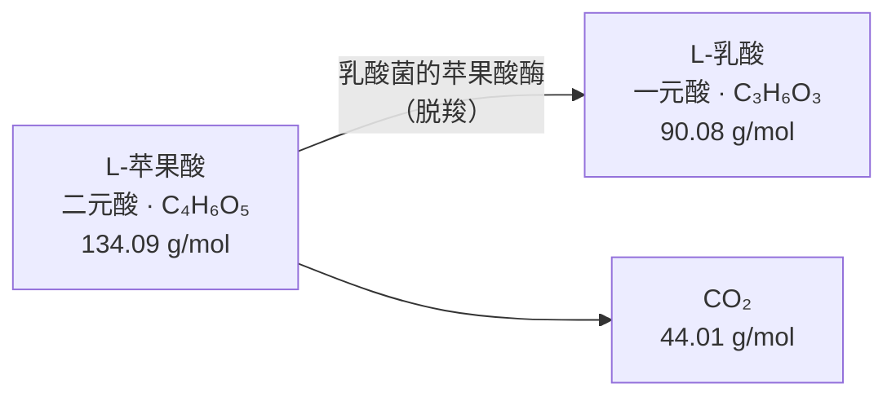
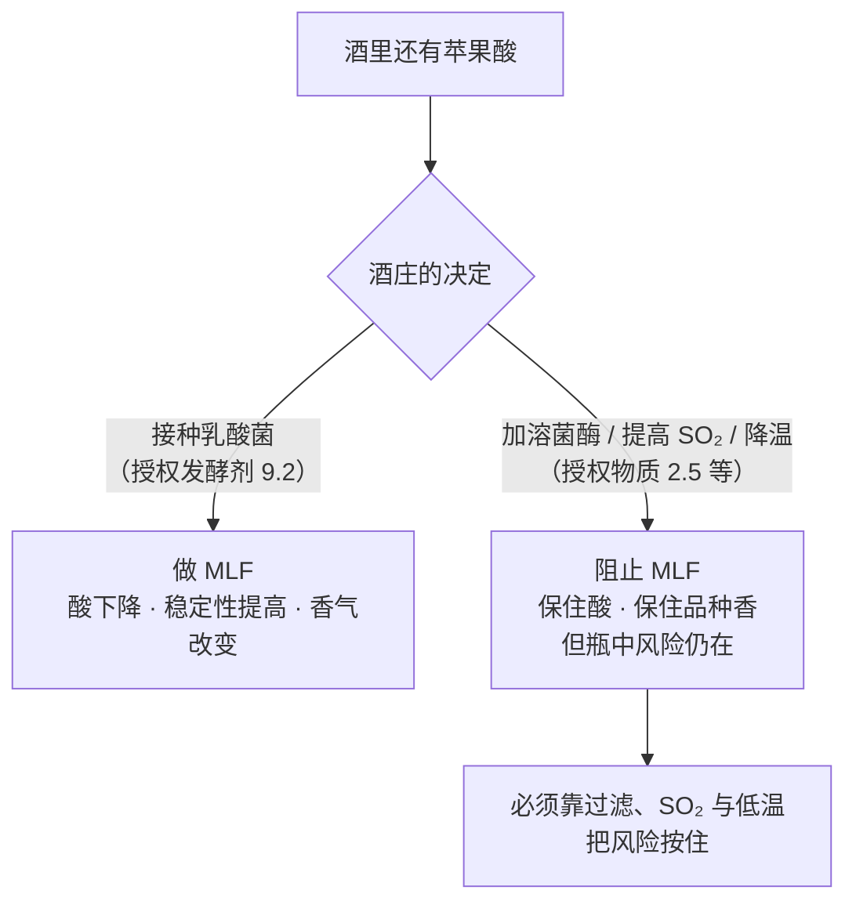
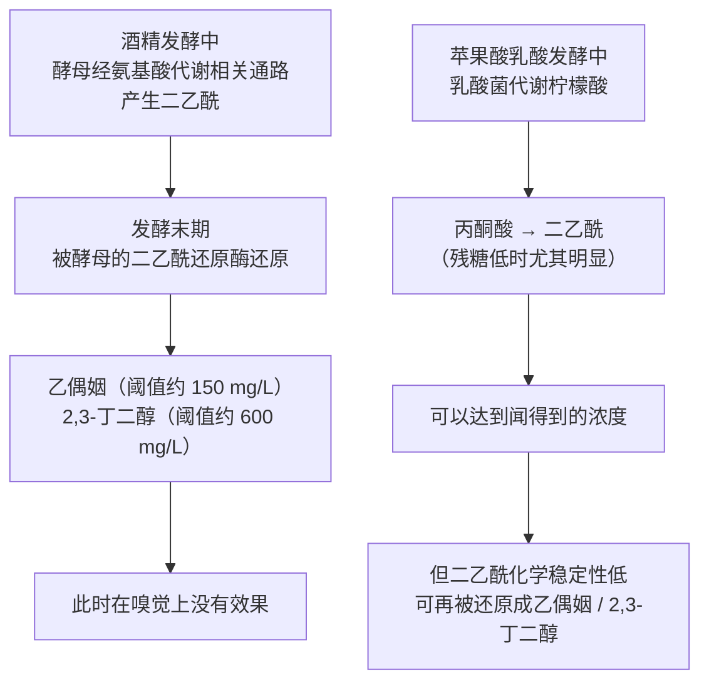
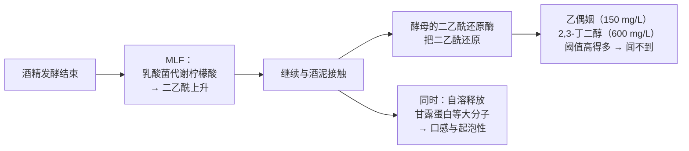

# 第 14 章 苹果酸乳酸发酵与酒泥接触

> **本章目标**：回答第 1 章埋下的一个问题——**酸度是可以被工艺改写的吗？**
> 答案是可以，而且改写它的不是酿酒师的手，是**另一类微生物**。
>
> 顺带处理那一组最容易被讲错的香气词：**黄油、奶油、面包**。
> 它们有明确的分子归属，但**分子浓度与"闻起来有多黄油"之间的关系比想象中松**——
> 这一章会给出四组独立数据来说明这件事。

> **适度饮酒，未成年人不饮酒，酒后不驾车。** 本章的 🅐 实操全部不需要开瓶。

## 14.1 一个脱羧反应，三个后果

**苹果酸乳酸发酵（MLF）** 的化学核心只有一句话：
**乳酸菌把 L-苹果酸脱羧，变成 L-乳酸和二氧化碳**[^1]。

[^1]: [苹果酸乳酸发酵](../../glossary.md#mlf)（英：malolactic fermentation, MLF；
    法：fermentation malolactique）。注意它**不是酒精发酵**——不产乙醇。

**只看这张图就能推出三件事**：

### ① 酸会降——因为"二元"变成了"一元"

苹果酸每个分子能给出**两个**可解离的质子，乳酸只能给出**一个**。
所以即使质量没少多少，**可滴定酸也会下降、pH 会上升**。

**按摩尔质量做一次化学计量核算**（这是算术，不是实测得率）：

| 消耗 | 生成 |
|------|------|
| **1 g** L-苹果酸（134.09 g/mol） | **0.67 g** L-乳酸（90.08 g/mol）+ **0.33 g** CO₂（44.01 g/mol）|

⚠️ **两条必须说清的限制**：

1. 这是**理想化学计量**。真实发酵里乳酸菌还会代谢其他底物，
   所以实际产物比例会偏离；
2. **可滴定酸下降多少、pH 升多少，取决于原酒里苹果酸占总酸的比例**——
   而这个比例在不同产区、不同年份差别极大（第 7 章：成熟过程中**被分解的是苹果酸**，
   而**酒石酸在成熟期的定量变化本书至今未核到一手出处**）。
   **所以本书不给"MLF 使总酸降低 x g/L"这类数字。**

### ② 微生物稳定性会提高

苹果酸是微生物可用的碳源。**把它提前吃掉**，就等于**拿走了瓶中再次发酵的燃料**。
这一条解释了为什么很多红葡萄酒**必须**做 MLF：不是为了风味，是为了**别在瓶里发生**。

### ③ 香气会变——但这一条最复杂，占了本章的 §14.3

## 14.2 谁在做这件事，以及法规怎么管它

**主角是乳酸菌**，其中 ***Oenococcus oeni*** 最常见[^2]。
一篇 2022 年 *Microorganisms* 的综述给出了理由：
它**能适应葡萄酒这种高乙醇、低 pH、高 SO₂、低温的严苛环境**。

[^2]: [酒球菌](../../glossary.md#oenococcus-oeni)（学名：*Oenococcus oeni*）。

该综述同时提出一个**与气候变化有关的变化**：
随着酒的**酒精度升高、酸度下降**，细菌的生境在变，
*Lactobacillus* 与 *Pediococcus* 在不同酿造环境中存活并发挥作用的报道在增加。

> **诚实说明**：该综述的主体是**接种策略**（共接种 / 顺序接种 / 自发），
> 本书只引用它对菌种与环境条件的描述，**不引用其中任何具体菌株的性能数字**。

**法规这一层有一个漂亮的对称**——**同一张授权物质表里，既有启动它的，也有阻止它的**：

| 物质 | 在 (EU) 2019/934 Annex I Part A Table 2 中的位置 | 作用方向 |
|------|---------------------------------------------|---------|
| **乳酸菌**（9.2，发酵剂类）| 与"酿酒酵母"（9.1）并列在**发酵剂**一节 | **启动** MLF |
| **溶菌酶**（2.5，E 1105）| 与二氧化硫、山梨酸钾并列在**防腐/稳定**一节 | **抑制**乳酸菌 |

> **这张图是本章最实用的一张**：
> **"做不做 MLF"不是"要不要更好喝"，而是一次风险与风格的交换。**
> 不做 MLF 的白葡萄酒（很多长相思、雷司令走这条路）保住了尖锐的酸，
> **代价是把微生物稳定性转嫁给了别的手段**。

## 14.3 黄油味：一个被讲得太简单的分子

### ① 分子与通路

"黄油味"对应的分子是**二乙酰（2,3-丁二酮）**[^3]。
一项 2018 年 *Molecules* 的研究在引言里给出了完整通路，**两个来源要分开**：

[^3]: [二乙酰](../../glossary.md#diacetyl)（英：diacetyl；化学名 2,3-butanedione）。

**这张图里藏着三个关键判断**：

1. **二乙酰不是 MLF 独有的**——酵母在酒精发酵中就会产生它，
   只是**随后被还原掉了**；
2. **MLF 产生它的路径是柠檬酸代谢**，而且该研究明确写道：
   **当残糖浓度过低时，柠檬酸才开始被当作碳源利用**——
   也就是说，**它是乳酸菌"没别的可吃了"时的产物**；
3. **它会继续被还原掉**——所以"黄油味"是一个**时间窗口**里的现象，不是终点状态。

### ② 阈值随酒种变化一个数量级

这是本章最应该记住的一组数字。Martineau 等 1995 年发表在
*Food Research International* 上的研究，用**受训品评员**与 **ASTM E679 强制选择递增浓度法**
测定了同一个分子在**三种酒**里的检测阈值：

| 基质 | 二乙酰的小组检测阈值 |
|------|-------------------|
| **霞多丽** | **0.2 mg/L** |
| **黑皮诺** | **0.9 mg/L** |
| **赤霞珠** | **2.8 mg/L** |

作者的结论写得很直白：**这否定了"对所有酒使用单一阈值"的做法。**
该文还指出，此前文献报道的阈值是 **2~3 mg/L**——
**也就是说，旧的通用阈值恰好接近红葡萄酒那一端，在霞多丽上偏高了十倍以上。**

> **这条与第 2、4 章是同一条纪律的第三次出现**：
> **阈值不是分子的属性，是"分子 + 基质 + 人群 + 方法"的属性。**
> 酚类多的红葡萄酒对这个分子有很强的掩蔽作用——**同样的浓度，在红酒里可能完全不是问题。**

### ③ 实测浓度：做没做 MLF 都可能高于阈值

Martineau 等同年在 *Am. J. Enol. Vitic.* 上测了 **36 家酒厂的 41 款美国霞多丽**：

| 观察项 | 结果 |
|-------|------|
| 二乙酰浓度范围 | **0.005 ~ 1.7 mg/L** |
| 高于香气阈值的比例 | **68 %** |
| MLF 的影响 | 做过 MLF 的酒**显著更高**（p < 0.02）|
| **但是** | **做过与没做过 MLF 的酒里，都能测到高于和低于个体阈值的样品** |

作者的结论：**二乙酰可能对霞多丽的风味有贡献，而与是否发生 MLF 无关**——
取决于品评者感知能力的差异与酿造实践。

### ④ 浓度预测不了"闻起来多黄油"

Bartowsky 等 2002 年在 *Aust. J. Grape Wine Res.* 上做了一项更直接的检验：
**商业酒的二乙酰浓度 vs 受训品评组打的"黄油"强度**。

> **样本**：**8 个年份（1992—1999）、20 个产区、28 家生产者**的
> 霞多丽、赤霞珠、梅洛与西拉。

| 结果 | 数值 |
|------|------|
| 24 款霞多丽的二乙酰 | **0.3 ~ 0.6 mg/L**（均值 **0.4**）|
| 43 款红葡萄酒的二乙酰 | **0.3 ~ 2.5 mg/L**（均值 **1.1**）|
| 霞多丽：黄油强度与浓度 | **显著相关（P < 0.01），但回归方程预测得并不好** |
| **把游离 SO₂ 纳入之后** | 预测改善（**调整 R² = 0.43**，P < 0.01）|
| 红葡萄酒 | 相关**很弱**但仍统计显著（**调整 R² = 0.12**，P < 0.05）|
| 陈放 | 一部分**红葡萄酒**在 **15 ℃ 存放三年**后二乙酰**明显下降**，**白葡萄酒没有** |

作者对红葡萄酒相关性弱的解释是：**红酒里二乙酰的浓度普遍低于其已发表的阈值**
（对照 §14.3 ②：红酒阈值 2.8 mg/L，而红酒实测均值只有 1.1）。

> **把四组数据放在一起，可以写成一条规律**：
>
> **"黄油味"至少受四个东西控制：浓度、基质（酒种）、游离 SO₂、时间。**
> 其中**只有第一个是酒庄在宣传里会提的**。
> 所以下次看到"经过苹果酸乳酸发酵，带来迷人的黄油气息"，
> 可以追问的是：**在什么酒种上？游离 SO₂ 多少？装瓶几年了？**

⚠️ **为什么 SO₂ 会进来**：二氧化硫会与羰基化合物结合（第 5 章的"结合态 SO₂"）。
本书**未核到直接测定"游离 SO₂ 结合掉多少二乙酰"的一手数据**，
因此这里只陈述**把 SO₂ 纳入模型后预测变好**这一统计事实，**不给结合比例**。

### ⑤ MLF 还留下别的痕迹

同一项 2018 年 *Molecules* 研究（三个年份、红白两类冷凉气候酒、
比较**共接种 / 顺序接种 / 自发** 三种诱导方式）给出了两个更稳的标志物：

| 化合物 | 香气阈值 | 观察到的浓度 |
|-------|---------|------------|
| **乳酸乙酯** | **110 mg/L** | 该研究的 MLF 酒 **90~150 mg/L**；文献报道最高至 **440 / 235 / 190 mg/L**，也有"红酒中通常不超过 50 mg/L"的说法 |
| **琥珀酸二乙酯** | **1.2 mg/L** | **只做酒精发酵**时 ≤ **0.68 mg/L**（低于阈值）；**做过 MLF** 后 **0.49~2.63 mg/L** |

该研究对三种诱导方式的结论：
**总乙酯浓度在"共接种"组最高**，而**二乙酰浓度在"自发"组最高**。

> ⚠️ **注意乳酸乙酯这一行的内部张力**：不同文献报道的范围相差近五倍，
> 而阈值只有一个数（110 mg/L）。**本书因此只写"它是 MLF 的标志物之一"**，
> **不写"闻到乳酸乙酯就说明做了 MLF"**——浓度能不能过阈值是个案问题。

### ⑥ 时机与温度也是旋钮

一项 2020 年 *Foods* 的霞多丽试验比较了 **MLF 接种时机**（酒精发酵后顺序接种 vs 与酵母共接种）、
**温度（15 ℃ 与 21 ℃）**，以及是否引入非酿酒酵母 *Torulaspora delbrueckii*：

- **香气组成与口感感知**在不同时机与接种条件之间**都有显著差异**；
- **温度对"顺序接种"组的香气影响更大**，而共接种组受温度影响较小；
- **口感受到影响，但影响程度不如香气**。

## 14.4 酒泥：先看法规怎么定义它

酒泥这个词在欧盟法规里**有正式定义**——
**(EU) No 1308/2013 Annex II Part IV 第 8 点**：

> **"酒脚（wine lees）"** 指：(a) 发酵后、储存中或经授权处理后，**在盛酒容器中沉积的残渣**；
> (b) 对上述物料**过滤或离心**得到的；(c) 储存中或经授权处理后**在盛葡萄汁容器中沉积的**残渣；
> (d) 对上述物料过滤或离心得到的。

**这个定义有用的地方在于它划了两条线**：

1. **酒泥是"沉积物"，来源可以是酒也可以是汁**——所以"带泥陈酿"里的"泥"不是单一物质；
2. 第 13 章已核过的 **Annex VIII Part II D.3** 还规定：**禁止压榨酒脚**，
   且**皮渣与酒脚中必须保留至少相当于成酒酒精体积 5 % 的酒精**（D.1）。
   **换句话说，酒泥在法律上是"被明确管起来的副产物"，不是随意处置的东西。**

## 14.5 自溶：酵母死掉之后才开始的工序

**带泥陈酿（sur lie）** 的机制叫**酵母自溶**[^4]。
Alexandre 与 Guilloux-Benatier 2006 年在 *Aust. J. Grape Wine Res.* 上的综述这样描述：

[^4]: [带泥陈酿](../../glossary.md#sur-lie)（法：sur lie；英：ageing on lees）与
    [酵母自溶](../../glossary.md#yeast-autolysis)（英：yeast autolysis）。

> **自溶的定义**：细胞死亡后被激活的**酵母自身的酶**水解细胞内的生物聚合物，
> 结果是**释放出低分子量产物**。这些产物改变酒的感官性质，
> 并**影响起泡性**——传统法起泡酒所需的"圆润与特征香气"正来自这段时间。

一篇 2026 年 *Comprehensive Reviews in Food Science and Food Safety* 的更新综述
给出了当前研究的**条件画像**与两条诚实的限制：

| 项目 | 综述的归纳 |
|------|----------|
| 研究对象 | **多数集中在传统法起泡酒** |
| 自溶时长 | 典型 **6 ~ 18 个月** |
| 温度 | **12 ~ 18 ℃** |
| 常用体系 | **合成酒模型**使用频繁 |
| 挥发物标志 | **琥珀酸二乙酯**被提议为关键标志物，**但结果并不一致** |
| 加速手段 | 脉冲电场、高静水压、高压均质、超声、微波等**显示出潜力** |
| **作者的限制声明** | **农艺与工艺上的变异使具体结论难以普适化** |

> **最后一行值得单独抄下来**：
> 这是本书第三次遇到同一种形态——**机制清楚，但"具体给多少、多久"无法普适**。
> （前两次是第 12 章的帽管理、第 13 章的压榨分段。）

## 14.6 甘露蛋白：可以自己长，也可以买

自溶释放的物质里，被讨论最多的是**甘露蛋白**[^5]——酵母细胞壁来源的糖蛋白。

[^5]: [甘露蛋白](../../glossary.md#mannoprotein)（英：mannoprotein）。

**这里有一件在法规里写得明明白白、但在酒庄故事里很少提的事**：
**(EU) 2019/934 Annex I Part A Table 2** 同时授权了下面这些**酵母来源的现成产品**：

| 授权条目 | 编号 |
|---------|------|
| **酵母甘露蛋白** | 6.10（列在澄清/稳定类物质中）|
| **酵母自溶物** | 4.6 |
| **酵母细胞壁** | 4.7 |
| **失活酵母** | 4.8 |

也就是说：**"搅桶十个月"与"加 20 g/hL 商业甘露蛋白"在法规上都是合法路径**，
只是**前者是过程，后者是配料**。

**效果呢？** 一项 2021 年 *Molecules* 的试验给出了一个**有条件**的答案：
桑娇维塞，三类基酒（延长浸渍 E、压榨 P、自流 F），
加入三种商业甘露蛋白类酵母提取物各 **20 g/hL**，陈放 **6 个月**。

| 基酒（花色苷/单宁比 A/T）| 结果 |
|------------------------|------|
| **延长浸渍（A/T = 0.2，单宁很重）** | 其中一种制剂带来**包裹感、柔软与"天鹅绒"感**，并带来**颜色稳定性** |
| **压榨酒（A/T = 0.3）** | 两种制剂改善了口感与颜色 |
| **自流酒（A/T = 0.5）** | **所有处理**都促成了聚合色素的形成，并与丝滑/天鹅绒/包裹感相关；**苦味下降** |

作者的总结是：**甘露蛋白的效果取决于酒本身的花色苷/单宁比。**

> **可以带走的一条规律**：
> **"加了甘露蛋白会更柔顺"是个不完整的句子**——
> 完整的说法是"**在单宁与花色苷的某个比例下**，某种甘露蛋白会让某些涩感子性质下降"。
> （涩的"子性质"见第 1 章：粗糙 / 干 / 天鹅绒是可分别描述的。）

## 14.7 两半怎么接起来：酵母会把黄油味吃掉

本章前后两半其实是**同一件事的两个时段**：

⚠️ **本书必须在这里踩一脚刹车**：
上图右半段的**机制**有出处（酵母的二乙酰还原酶会把它还原成阈值高得多的两个分子），
但**"带泥 vs 不带泥"对成酒二乙酰的直接对照试验，本书未核到**。
**因此本章只写机制，不写"带泥陈酿一定会降低黄油味"。**（登记见 §14.12。）

## 14.8 常见说法辨析

按本书约定标注**证据强度**：✅ 有共识 / ⚠️ 有争议 / ❌ 明确错误 / 缺乏证据。

| 说法 | 判定 | 说明 |
|------|------|------|
| "苹果酸乳酸发酵是第二次酒精发酵" | ❌ **它不产乙醇** | 它是**脱羧**：L-苹果酸 → L-乳酸 + CO₂，由**乳酸菌**完成。产 CO₂ 但不产乙醇。真正的"第二次酒精发酵"是起泡酒那一步（第 16 章）|
| "MLF 会让酒变软，因为乳酸比苹果酸柔和" | ⚠️ **方向对，机制讲一半** | 更基本的原因是**二元酸变一元酸**——可解离质子少了一个，所以**可滴定酸下降、pH 上升**。⚠️ **降多少取决于原酒里苹果酸占总酸的比例**，本书不给数字 |
| "做了 MLF 就有黄油味" | ⚠️ **不成立** | 41 款美国霞多丽的抽样中，**做过与没做过 MLF 的酒里都能测到高于和低于个体阈值的二乙酰**；作者结论是二乙酰**可能与是否发生 MLF 无关**地影响风味 |
| "黄油味浓说明二乙酰多" | ⚠️ **相关但预测很差** | 8 个年份 / 20 个产区 / 28 家生产者的商业酒里：霞多丽的黄油强度与浓度显著相关但回归预测不佳，**纳入游离 SO₂ 后才改善（调整 R² = 0.43）**；红葡萄酒相关**很弱（调整 R² = 0.12）** |
| "二乙酰的香气阈值是 2~3 mg/L" | ⚠️ **那是旧的通用值** | 受训品评组实测：**霞多丽 0.2、黑皮诺 0.9、赤霞珠 2.8 mg/L**。作者明确写这**否定了对所有酒使用单一阈值**。基质（酚类）的掩蔽作用是主因 |
| "不做 MLF 的酒更天然" | ⚠️ **它是风险转移，不是少做了一件事** | 苹果酸是瓶中再发酵的燃料。不做 MLF 就必须靠**溶菌酶（授权物质 2.5）/ SO₂ / 低温 / 过滤**把风险按住——法规把这两条路都写进了同一张授权表 |
| "带泥陈酿就是偷懒不过滤" | ❌ **是一道有机制的工序** | 自溶 = **细胞死后被激活的酵母自身酶**水解细胞内生物聚合物、释放低分子量产物，改变感官性质并**影响起泡性**。它与"是否过滤"是两件事 |
| "酒泥陈酿越久越好" | 缺乏证据 | 已核到的只有**研究条件的画像**（多数集中在传统法起泡酒、**6~18 个月**、**12~18 ℃**），而该综述明确说**农艺与工艺的变异使结论难以普适化**；连被提议的标志物（琥珀酸二乙酯）**结果都不一致** |
| "搅桶带来的圆润感只能靠时间换" | ❌ **法规里有现成配料** | **酵母甘露蛋白（6.10）、酵母自溶物（4.6）、酵母细胞壁（4.7）、失活酵母（4.8）** 都是 (EU) 2019/934 授权的物质。⚠️ 但效果**取决于酒本身**：一项试验显示甘露蛋白的作用随**花色苷/单宁比**而变 |
| "闻到黄油味就是酒有问题" | ⚠️ **要分情形** | 它是一个**正常代谢产物**，且在红葡萄酒里通常**低于该基质的阈值**。真正需要警惕的是它伴随其他异常（第 31 章）。本书不隔屏断言任何一瓶酒 |

## 14.9 思考题

1. 用"二元酸变一元酸"这一句话，解释为什么 MLF 会同时**降低可滴定酸**并**提高 pH**。
   为什么本书**不给**"降低 x g/L"这个数字？
2. 二乙酰在酒精发酵中就产生了，为什么那个阶段"在嗅觉上没有效果"？
   请把通路写出来，并指出其中哪一步是可逆操作的关键。
3. 同一个分子在霞多丽、黑皮诺、赤霞珠里的检测阈值是 **0.2 / 0.9 / 2.8 mg/L**。
   请说明这组数字**同时**支持了哪两个不同的结论
   （一个关于分子，一个关于"阈值"这个概念本身）。
4. **【案例】** 一份技术资料写道：
   *"本款霞多丽经 100 % 苹果酸乳酸发酵，二乙酰含量 0.5 mg/L，
   是公认阈值 2 mg/L 的四分之一，因此不会有黄油味。"*
   请指出这段推理里的两处问题。
5. 为什么乳酸菌要等到**残糖很低**时才开始大量利用柠檬酸？
   这一点对"什么时候把酒从菌上分开"有什么提示？
6. **【查证】** 打开 (EU) 2019/934 Annex I Part A Table 2，
   找出**乳酸菌**与**溶菌酶**两个条目，抄下它们的条件与限制。
   然后回答：为什么同一部法规要同时授权"促进"与"抑制"同一类微生物的手段？
7. 一项综述把自溶研究的条件归纳为"多数是传统法起泡酒、6~18 个月、12~18 ℃、
   常用合成酒模型"，并说结论**难以普适化**。
   请说明这四个条件里，哪一个最限制了把结论外推到**静止白葡萄酒**。
8. 甘露蛋白试验中，同样的制剂在 **A/T = 0.2、0.3、0.5** 三种基酒上效果不同。
   请解释这为什么**不是**"结果不可靠"，而是一个**有信息量**的结果。
9. 本章出现了两次"**同一件事既可以是过程，也可以是配料**"
   （自溶 ↔ 商业酵母衍生物）。请再找出本书前面章节里的一个同类例子，
   并说明这种"过程/配料"的替代关系为什么值得在买酒时留意。

> 📖 **参考答案**（想清楚再看）：[Q1](../../qa/14-mlf-and-lees-qa.md#q1) ·
> [Q2](../../qa/14-mlf-and-lees-qa.md#q2) · [Q3](../../qa/14-mlf-and-lees-qa.md#q3) ·
> [Q4](../../qa/14-mlf-and-lees-qa.md#q4) · [Q5](../../qa/14-mlf-and-lees-qa.md#q5) ·
> [Q6](../../qa/14-mlf-and-lees-qa.md#q6) · [Q7](../../qa/14-mlf-and-lees-qa.md#q7) ·
> [Q8](../../qa/14-mlf-and-lees-qa.md#q8) · [Q9](../../qa/14-mlf-and-lees-qa.md#q9)

## 14.10 本章实操

🅐 档**全部不需要开瓶喝酒**。

### 🅐 无器具版 · 任务一：把"黄油"这个词拆成四个变量

找 **6 份**酒评或酒款描述（**红白各三**），凡是出现"黄油 / 奶油 / butter / creamy"的，填下表。

| # | 酒种 | 原文怎么写的 | 它提到基质了吗 | 它提到年份/瓶龄了吗 | 它提到 SO₂ 了吗 | 它提到浓度了吗 |
|---|-----|------------|--------------|------------------|---------------|--------------|
| 1 | | | | | | |
| … | | | | | | |

**完成后回答**：六份里有几份提到了浓度以外的任何一个变量？
对照本章 §14.3 的四个控制因素，这说明酒评在描述什么？

### 🅐 无器具版 · 任务二：做一次化学计量核算

用本章 §14.1 的摩尔质量，自己算一遍：

| 待算 | 你的答案 |
|------|---------|
| 1 g 苹果酸完全转化，生成多少克乳酸？ | |
| 生成多少克 CO₂？ | |
| 质量守恒对得上吗（134.09 = 90.08 + 44.01）？ | |
| **如果一瓶 750 mL 的酒里有 3 g/L 苹果酸全部转化，会放出多少克 CO₂？** | |

**完成后回答**：这些 CO₂ 去了哪里？
（提示：第 5 章讲过溶解与逸出；第 16 章会讲什么情况下它**必须**留在瓶里。）

### 🅐 无器具版 · 任务三：读一次"酵母衍生物"的授权清单

打开 (EU) 2019/934 Annex I Part A Table 2，找到下列条目并填表。
**只抄法规写的条件，不抄产品宣传。**

| 条目 | 编号 | 法规写的使用条件/限制 | 它对应酒庄的哪个"故事" |
|------|------|---------------------|---------------------|
| 酵母自溶物 | 4.6 | | |
| 酵母细胞壁 | 4.7 | | |
| 失活酵母 | 4.8 | | |
| 酵母甘露蛋白 | 6.10 | | |
| 乳酸菌 | 9.2 | | |
| 溶菌酶 | 2.5 | | |

**完成后回答**：这张表里哪几项，酒标上**不会**出现？这对"读酒标"意味着什么？

### 🅑 有条件版 · 任务四：一对做过与没做过 MLF 的白葡萄酒（备齐后再做）

**所需**：两支白葡萄酒——一支明确标注或经确认**做过完整 MLF**（很多桶发酵霞多丽），
一支**明确未做 MLF**（很多新西兰长相思、德国雷司令），
两只同款杯、[品鉴记录表](../../forms/tasting-note.md)两份。

**适度饮酒，未成年人不饮酒，酒后不驾车。** 每杯 20~30 mL 即可。

| 观察项 | 做过 MLF | 未做 MLF |
|-------|---------|---------|
| 酸的**尖锐程度**（不是"多酸"，是"多尖"）| | |
| 酸出现的时段（前段 / 中段 / 收尾）| | |
| 有没有"黄油 / 奶油"类气味？强度 1~5 | | |
| 口感的**厚度**（与酸分开评）| | |
| 放置 30 分钟后，上面哪一项变化最大 | | |

**然后做一次诚实的自我检验**：

> 如果你**闻不到**任何黄油气息——请把它写下来。
> 对照 §14.3 的阈值表：**霞多丽 0.2 mg/L、赤霞珠 2.8 mg/L**，
> 而 41 款商业霞多丽里有 **32 %** 低于阈值。
> **"没闻到"是一个正常且有信息量的结果**，不是你的感官不行。

## 14.11 🔎 买酒与点酒时的用处

1. **"苹果酸乳酸发酵"出现在酒标或酒单上时，它主要在说"酸被改写过"**，
   不是在说"有黄油味"。对**红葡萄酒**来说它几乎是默认操作，信息量很低；
   出现在**白葡萄酒**上才值得注意。
2. **点一支"高酸白"时，问的是"有没有做 MLF"**，比问"酸度多少"更快得到答案——
   不做 MLF 的白葡萄酒保住了苹果酸那种**更尖**的酸。
3. **"黄油味"要连酒种一起判断。** 红葡萄酒里同样的浓度可能根本到不了阈值
   （赤霞珠 2.8 vs 霞多丽 0.2 mg/L）。所以在红酒身上强调"黄油气息"通常是修辞。
4. **"带泥陈酿 / sur lie"值得问一个具体问题：多久、什么温度。**
   已核到的研究条件是 **6~18 个月、12~18 ℃**；
   说不出时长的"带泥"和说得出的，信息量完全不同。
5. **"圆润"可以来自时间，也可以来自一包粉。** 两条路在欧盟都合法，
   **而酒标不会区分**。这不是要你抵制，而是提醒：**口感的柔顺度不是陈年时间的证据。**
6. **"零添加"的酒要多问一句苹果酸。** 苹果酸没被吃掉、SO₂ 又低的酒，
   在运输与储存中发生瓶内 MLF 的条件是齐的——表现为轻微起泡与浑浊。
   这不代表酒坏了，但**它对温度更敏感**（第 41 章）。

## 14.12 本章依据

### A. 已核对原文的法规

- **(EU) No 1308/2013 Annex II Part IV 第 8 点**：**"酒脚（wine lees）"的定义**——
  发酵后/储存中/经授权处理后**在盛酒容器中沉积的残渣**，对其过滤或离心所得，
  以及葡萄汁容器中的对应物。（legislation.gov.uk 的欧盟"as adopted"文本，2026-09-14。）
- **(EU) No 1308/2013 Annex VIII Part II D.1 / D.3**（第 13 章已核）：
  禁止过度压榨；**禁止压榨酒脚**。
- **(EU) 2019/934 Annex I Part A Table 2**：本章用到
  **9.1 酿酒酵母**、**9.2 乳酸菌**（同列在"发酵剂"一节）、
  **2.5 溶菌酶（E 1105）**、**4.6 酵母自溶物**、**4.7 酵母细胞壁**、
  **4.8 失活酵母**、**6.10 酵母甘露蛋白**。（同上，2026-09-14。）

### B. 已核对摘要或正文的同行评议文献

- **二乙酰的阈值随酒种变化**：Martineau, B.; Acree, T.; Henick-Kling, T.
  "Effect of wine type on the detection threshold for diacetyl",
  *Food Research International* **28** (1995) 139–143，DOI 10.1016/0963-9969(95)90797-E。
  受训品评员、**ASTM E679 强制选择递增浓度系列极限法**；
  小组检测阈值与几何均值标准差：**霞多丽 0.2 mg/L（0.32）、黑皮诺 0.9（0.21）、
  赤霞珠 2.8（0.38）**；此前文献报道的阈值为 **2~3 mg/L**；
  作者结论：**这否定了对所有酒使用单一阈值**。
- **商业霞多丽中的二乙酰实测**：Martineau, B.; Henick-Kling, T.; Acree, T.
  "Reassessment of the Influence of Malolactic Fermentation on the Concentration of
  Diacetyl in Wines", *Am. J. Enol. Vitic.* **46** (1995) 385–388，
  DOI 10.5344/ajev.1995.46.3.385。**36 家酒厂 41 款**美国霞多丽；
  浓度 **0.005~1.7 mg/L**；**68 %** 高于香气阈值；MLF 酒显著更高（p < 0.02）；
  **但做过与未做过 MLF 的酒中都测到高于与低于个体阈值的样品**。
- **浓度能否预测"黄油"感知**：Bartowsky, E.; Francis, I.; Bellon, J. 等
  "Is buttery aroma perception in wines predictable from the diacetyl concentration?",
  *Aust. J. Grape Wine Res.* **8** (2002) 180–185，DOI 10.1111/j.1755-0238.2002.tb00254.x。
  **8 个年份（1992—1999）、20 个产区、28 家生产者**的商业酒；
  24 款霞多丽 **0.3~0.6 mg/L（均值 0.4）**、43 款红酒 **0.3~2.5 mg/L（均值 1.1）**；
  霞多丽的黄油强度与浓度**显著相关（P < 0.01）但回归预测不佳**，
  **纳入游离 SO₂ 后改善（调整 R² = 0.43，P < 0.01）**；
  红酒相关**很弱（调整 R² = 0.12，P < 0.05）**，作者认为部分原因是红酒中二乙酰浓度
  普遍低于其已发表阈值；一部分**红酒**在 **15 ℃ 陈放三年**后二乙酰明显下降，**白酒没有**。
- **二乙酰的通路与 MLF 标志物**：一项 2018 年 *Molecules* 的研究
  （DOI 10.3390/molecules23102549；三个年份的冷凉气候红白葡萄酒，
  比较**共接种 / 顺序接种 / 自发**三种 MLF 诱导方式，SPME + GC×GC-ToFMS）。
  本书用到其引言给出的机制：**二乙酰由酵母在酒精发酵中经氨基酸代谢相关通路产生，
  发酵末期被二乙酰还原酶还原为乙偶姻与 2,3-丁二醇**，
  **该阶段因此在嗅觉上没有效果**；**MLF 中二乙酰作为柠檬酸代谢的中间产物大量生成**，
  而**柠檬酸只有在残糖过低时才开始被当作碳源**；二乙酰化学稳定性低，可再被转化为
  乙偶姻与 2,3-丁二醇，二者阈值**平均分别约 150 与 600 mg/L**。
  结果部分：**乳酸乙酯阈值 110 mg/L**，该研究 MLF 酒 **90~150 mg/L**
  （文献报道最高 440 / 235 / 190 mg/L，也有"红酒通常 ≤50 mg/L"的说法）；
  **琥珀酸二乙酯阈值 1.2 mg/L**，只做酒精发酵时 ≤ **0.68 mg/L**，MLF 后 **0.49~2.63 mg/L**；
  **总乙酯在共接种组最高，二乙酰在自发组最高**。
- **MLF 时机与温度**：一项 2020 年 *Foods* 的霞多丽试验
  （DOI 10.3390/foods9060802；比较 MLF 接种时机与 **15 ℃ / 21 ℃**，
  并考察非酿酒酵母 *Torulaspora delbrueckii* 的存在；HS-SPME-GC-MS +
  酿酒师品评组的 Napping® 与 Ultra-flash profiling）：
  香气组成与口感感知在不同时机与接种条件间**均有显著差异**；
  **温度对顺序接种的香气影响更大**；口感受影响但**不如香气强烈**。
- **MLF 的微生物学**：一篇 2022 年 *Microorganisms* 的综述
  （"Malolactic Fermentation: New Approaches to Old Problems"，
  DOI 10.3390/microorganisms10122363）：MLF 是**由乳酸菌将 L-苹果酸脱羧为 L-乳酸**；
  ***Oenococcus oeni* 因能适应高乙醇、低 pH、高 SO₂、低温的葡萄酒环境而最常见**；
  随着气候变化使酒的酒精度升高、酸度下降，***Lactobacillus* 与 *Pediococcus***
  在不同酿造环境中存活的报道增加；**自发 MLF 不可预测**，可能带来
  不良气味、大量生物胺与过高的挥发酸。
- **酵母自溶**：Alexandre, H.; Guilloux-Benatier, M. "Yeast autolysis in sparkling wine – a review",
  *Aust. J. Grape Wine Res.* **12** (2006) 119–127，DOI 10.1111/j.1755-0238.2006.tb00051.x。
  自溶 = **细胞死亡后被激活的酵母自身酶水解细胞内生物聚合物**，释放低分子量产物；
  这些产物改变感官性质并**影响起泡性**；传统法起泡酒的"圆润与特征香气"需要这段陈放。
- **自溶研究的现状与限制**：一篇 2026 年
  *Comprehensive Reviews in Food Science and Food Safety* 的更新综述
  （DOI 10.1111/1541-4337.70458）：研究**以传统法起泡酒为主**，
  自溶期典型 **6~18 个月**、**12~18 ℃**，**常用合成酒模型**；
  **琥珀酸二乙酯被提议为关键标志物但结果不一致**；
  自噬相关基因被探索为自溶潜力的分子标记；
  脉冲电场、高静水压、高压均质、超声、微波等**显示出加速自溶的潜力**；
  作者明确指出**农艺与技术上的变异使具体结论难以普适化**。
- **商业甘露蛋白的效果依赖基酒**：一项 2021 年 *Molecules* 的试验
  （DOI 10.3390/molecules26144133）：桑娇维塞，延长浸渍（E）/ 压榨（P）/ 自流（F）
  三类基酒 × 三种商业富甘露蛋白酵母提取物，**各 20 g/hL**，**陈放 6 个月**。
  多变量分析显示效果**取决于酒的花色苷/单宁（A/T）比**：
  A/T = 0.2 时某一制剂带来**包裹感、柔软与天鹅绒感**及颜色稳定性；
  A/T = 0.3 时两种制剂改善口感与颜色；A/T = 0.5 时**所有处理**都促成聚合色素形成，
  并与丝滑/天鹅绒/包裹感相关，**苦味下降**。

### C. 本章有意留白的地方

- **MLF 使总酸下降 / pH 上升的具体幅度**：取决于原酒中苹果酸占总酸的比例，
  本书未核到可引用的一手区间 → **只写方向与机制，不写数字**。
- **"带泥陈酿 vs 不带泥"对成酒二乙酰的直接对照**：未核到 →
  **只写"酵母能把二乙酰还原掉"这一机制**，不写带泥的净效果。
- **游离 SO₂ 与二乙酰的结合比例**：未核到一手定量数据 →
  只引用"把游离 SO₂ 纳入模型后预测变好"这一统计事实。
- **搅桶（bâtonnage）的频率与效果的定量对照**：未核到 → **不给频率建议**。
- **乳酸乙酯在酒中的典型区间**：不同文献相差近五倍（≤50 / 90~150 / 至 440 mg/L）→
  只写"它是 MLF 的标志物之一"，不写"闻到它就说明做过 MLF"。
- **中国与美国关于 MLF 相关添加物（如溶菌酶）的规定**：本章只核到欧盟条文，
  **不得当作世界通则**（与第 6、9、12、13 章同一条纪律）。

以上每一条的完整题录、DOI 与核对状态，见[出处与资料登记](../../standards.md)。

---

**下一章预告**：第 15 章处理**橡木**——
本章刚讲完"酒泥能给酒什么"，下一章讲"木头能给酒什么"。
两者有一个共同的结构：**它们都是"把一种材料泡进酒里"**，
因此都可以用第 12 章的萃取曲线来思考，
而且**都在欧盟法规里有一份写得非常具体的技术条件**。
