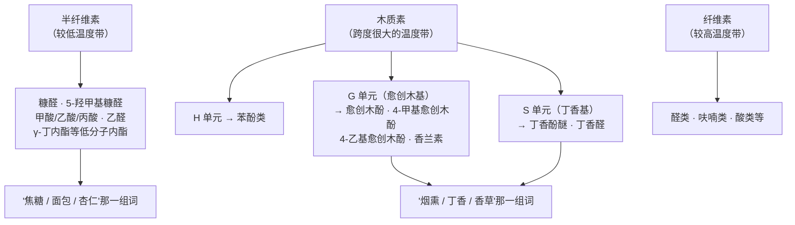
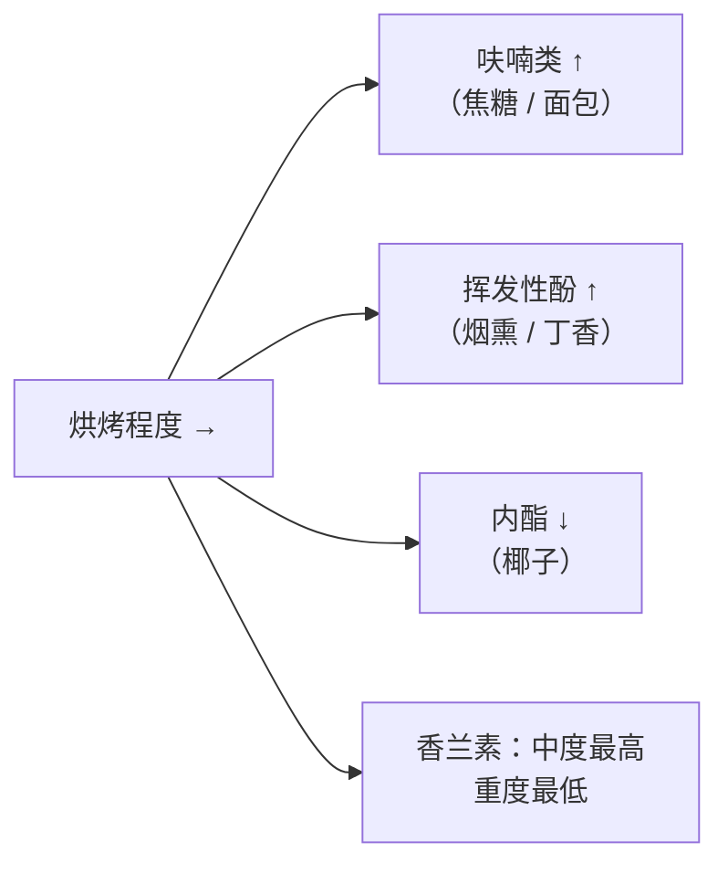

# 第 15 章 橡木：桶的化学、新桶比例与替代品

> **本章目标**：把"桶味"拆成**可以命名的分子、可以计算的强度、可以查证的法规**。
>
> 三个要讲清楚的问题：
> **① 香草、椰子、烟熏、丁香这些词分别对应哪个分子；**
> **② 为什么"新桶"和"重烘烤"不是同一个旋钮，而且方向常常相反；**
> **③ 橡木片是不是作弊——法规对它写了什么。**
>
> 本章还会做一件前面没做过的事：**用已核到的阈值与实测浓度算一次气味活度值（OAV）**，
> 然后得到一个可能让人意外、但很稳的结论。

> **适度饮酒，未成年人不饮酒，酒后不驾车。** 本章的 🅐 实操全部不需要开瓶。

## 15.1 先把桶当成一味配料

第 12 章讲浸皮时，我们把"皮和籽"当成被萃取的固体。
**橡木在结构上是同一件事**：把一种固体材料泡进酒里，让它的成分迁移出来。

**欧盟法规的处理方式最能说明这一点**——
在 **(EU) 2019/934 Annex I Part A Table 1**（授权的酿酒工艺清单）里，
**第 11 项就叫「橡木片（Pieces of oak wood）」**，
使用条件写的是：

> **用于酿造与陈年，包括鲜葡萄与葡萄汁的发酵过程**；须符合本附件 **Appendix 7** 的条件。

也就是说，**在法规眼里，橡木不是容器，是一项"工艺/物料"**。
而 Appendix 7 把技术条件写得非常具体（**本书已核对原文**）：

| 条款 | 法规写的内容 |
|------|------------|
| **树种** | **必须完全来自栎属（*Quercus*）** |
| **处理** | 可保持自然状态，或**以低温、中温、高温加热**；**不得经过燃烧（包括表面燃烧）**，不得炭化，不得手感易碎；**除加热外不得经过任何化学、酶法或物理处理** |
| **不得添加** | **不得为增强其天然风味或增加可萃取酚类的量而添加任何产品** |
| **标签** | 必须注明**橡木植物学种的来源**与**加热强度**，以及储存条件与安全注意事项 |
| **尺寸** | 木粒尺寸须使**至少 95 %（按重量）被 2 mm 孔径（9 目）滤网截留** |
| **纯度** | 不得释放出浓度可能有害健康的物质 |
| **登记** | 该处理须记入 (EU) No 1308/2013 第 147(2) 条所指的**登记册** |

> **"不得经过表面燃烧"这一条特别值得注意**：
> 它把**烘烤（toasting，热处理）**与**炭化（charring，烧焦）**在法律上分开了。
> 第 34 章讲美国威士忌时会看到相反的规定——
> **波本必须用"炭化（charred）"的新橡木桶**（27 CFR 5 已核）。
> **同一种材料，两个法系为两类酒规定了相反的表面处理。**

## 15.2 木头里有什么，以及加热把它变成了什么

橡木的骨架是三种聚合物：**纤维素、半纤维素、木质素**，
外加**多酚（含鞣花单宁）、脂类、有机酸、蜡、树脂、萜类与少量矿物**。

**制桶时把木板加热**（弯板成型 + 烘烤），三种聚合物在不同温度带分解，
产物完全不同——这就是"桶味"的来源：

⚠️ **一处必须诚实说明的不一致**：本书所依据的那篇 2026 年 *Molecules* 综述，
在**两个不同段落里给了两套不同的分解温度区间**
（表格里：半纤维素 150~260 ℃、木质素 200~500 ℃、纤维素 260~450 ℃；
正文里按无氧条件：半纤维素 220~315 ℃、纤维素 315~400 ℃、木质素 160~900 ℃）。
**两套数字的来源不同、条件不同**，本书因此**只采用其定性顺序**
（半纤维素最先分解、纤维素次之、木质素跨度最大），**不写死温度。**

**另外两条已核到、而且很有用的事实**：

1. **产物在木板里是"表层富集"的**：对烘烤过的橡木板，
   **HMF、糠醛与香兰素在外层 2 mm 的浓度，比 10 mm 深处高出几十倍到一百倍**；
2. **烧过头会适得其反**：燃烧使木材产生裂纹，
   **便于挥发与内酯类挥发性化合物的损失**。

> **把这两条放在一起，就能解释两个常见现象**：
> **① 桶用几次之后"桶味"迅速变淡**——表层那 2 mm 被榨干了；
> **② 重烘烤不等于"更多风味"**——有些分子在高温下反而跑掉了（§15.5 有数据）。

## 15.3 分子与阈值：一张需要认真读的表

下面这张表来自同一篇综述（它汇编了多篇原始文献的嗅觉阈值，**属于转引**）。
**请特别注意最右边那一列的单位**：

| 分子 | 气味描述 | **嗅觉阈值** |
|------|---------|------------|
| **顺式-β-甲基-γ-辛内酯**（cis-橡木内酯 / 威士忌内酯）| 椰子、木质、香草 | **20 ~ 46 µg/L** |
| **反式-β-甲基-γ-辛内酯** | 椰子、木质、香草 | **140 ~ 370 µg/L** |
| **丁香酚**（eugenol）| 丁香、蜂蜜、辛香、肉桂 | **6 µg/L** |
| **异丁香酚** | 花香、丁香、木质 | **6 µg/L** |
| **愈创木酚**（guaiacol）| 烟熏、甜、药味 | **9.5 µg/L** |
| **4-甲基愈创木酚** | 辛香、酚味 | **20 µg/L** |
| **4-乙烯基愈创木酚** | 丁香 | **40 µg/L** |
| **4-乙基愈创木酚** | 酚味、烟熏、皮革 | **47 µg/L** |
| **丁香酚醚**（syringol）| 烟熏、焦、木头 | **570 µg/L** |
| **香兰素**（vanillin）| 香草 | **1 mg/L** |
| **乙酰香草酮** | 香草 | **1 mg/L** |
| **麦芽酚** | 蜂蜜、烤香、焦糖 | **5 mg/L** |
| **糠醛** | 面包、杏仁、甜 | **15 mg/L** |
| **5-甲基糠醛** | 杏仁、焦糖、焦、糖 | **16 mg/L** |
| **丁香醛** | 香草 | **50 mg/L** |
| **5-羟甲基糠醛（HMF）** | 焦糖 | **100 mg/L** |

**第一条规律就在单位里**：

> **µg/L 级阈值的是内酯与挥发性酚**（椰子、丁香、烟熏）；
> **mg/L 级阈值的是呋喃类与香兰素类**（面包、焦糖、香草）。
> **两者相差约一千倍。**

**四个橡木内酯立体异构体中，只有 cis（3S,4S）与 trans（3S,4R）存在于橡木里**；
而 **cis 的阈值比 trans 低约七倍**——
所以"椰子味"的强弱主要由 **cis 异构体**决定。

**顺带澄清一个吓人的名字**：橡木还会释放 **γ-丁内酯（GBL）**，
它在酒中的浓度是 **0.5~0.8 mg/L**，而其感知阈值**约 20 mg/L**——
**既闻不到，量级也远低于任何可测量的生理效应**。本书对此只作事实陈述，不做健康论断。

## 15.4 算一次 OAV：谁真的过了阈值

有了阈值，就可以用**实测浓度 ÷ 阈值** 算**气味活度值（OAV）**[^1]。
综述本身给的判据是：**只有 OAV > 1 的化合物才可能塑造酒的香气。**

[^1]: [气味活度值](../../glossary.md#oav)（英：odour activity value, OAV）=
    某化合物在酒中的浓度 ÷ 其感知阈值。**OAV > 1 是"可能被察觉"的必要条件，不是充分条件**
    ——掩蔽、协同与加和效应都会改变结果（第 2、4 章）。

同一篇综述汇编了大量"桶陈 12 个月后酒中各化合物浓度"的数据。
取其中**三行有代表性的**，用上表的阈值算一遍（浓度单位统一成 µg/L）：

| 化合物 | 法国橡木 · 赤霞珠 12 个月（中度烘烤）| 法国橡木 · 西拉 12 个月（中度）| 美国橡木 · 丹魄 12 个月（中度）| 阈值 |
|-------|------------------------------|--------------------------|--------------------------|------|
| **cis-橡木内酯** | 142 → **OAV 3~7** | 577 → **OAV 13~29** | 1083 → **OAV 24~54** | 20~46 |
| **丁香酚** | 7.8 → **OAV 1.3** | 101 → **OAV 17** | 63.3 → **OAV 11** | 6 |
| **愈创木酚** | 19.6 → **OAV 2.1** | 43.8 → **OAV 4.6** | 41.5 → **OAV 4.4** | 9.5 |
| **香兰素** | 62 → **OAV 0.06** | 408 → **OAV 0.41** | 482 → **OAV 0.48** | 1000 |
| **糠醛** | 836 → **OAV 0.06** | 39.8 → **OAV 0.003** | 1869 → **OAV 0.12** | 15 000 |
| **丁香醛** | 23.3 → **OAV 0.000 5** | 1305 → **OAV 0.026** | 1495 → **OAV 0.03** | 50 000 |

**结论很清楚，而且在整张原表上都成立**：

> **在这些实测数据里，真正过阈值的是内酯与挥发性酚；
> 而"香草醛（香兰素）"本身几乎总是 OAV < 1。**

这意味着一句需要被认真对待的话：

> **你在桶陈酒里闻到的"香草"，多半不是香兰素一个分子扛起来的。**
> 更可能的是**cis-橡木内酯**（其气味描述里本来就包含"香草"）
> 在起主要作用，或者是多个低于阈值的分子**协同**作用。

⚠️ **四条必须标注的限制**：

1. 浓度表**汇编自多项不同研究**，品种、年份、桶龄、烘烤条件都不同——
   **不能当作"某某酒的典型值"**；
2. 阈值同样是**转引**，且**阈值随基质变化**（第 14 章的二乙酰是最好的教材：
   同一分子在霞多丽与赤霞珠相差十四倍）；
3. **OAV > 1 只是必要条件**，不是"一定闻得到"；
4. 综述自己指出：**即使同一品种、同一木材、同一陈年时间，
   化合物浓度也可能相差十倍**（丹魄在法国桶中的糠醛、5-甲基糠醛与 HMF 即如此）。

**所以本章不写"桶陈酒里香兰素通常是多少"**，只写**这条方向性规律**。

## 15.5 三个旋钮：树种、烘烤、桶龄

### ① 树种：美国橡木 vs 法国橡木，差别是可以量化的

Chatonnet 与 Dubourdieu 1998 年在 *Am. J. Enol. Vitic.* 上做了一项经典比较，
对象是三个制桶用种：**美国白栎（*Quercus alba*）、无梗花栎（*Q. petraea*，"法国橡木"主力）、
夏栎（*Q. robur*）**。

| 观察项 | 结果 |
|-------|------|
| **结构** | 美国白栎心材的**侵填体（thyllae）结构特殊**，因此**可以锯切而不漏液**；欧洲橡木**必须劈开**，否则会破坏导管、无法保证密封 |
| **可萃取鞣花单宁** | **夏栎最多**，无梗花栎**少得多**，**美国白栎更少** |
| **芳香潜力** | 美洲种**更高**，原因是其 **β-甲基-γ-辛内酯（cis/trans 异构体）含量高** |
| **鉴别特征** | 美国白栎 = **低可萃取多酚 + 高甲基辛内酯 + 存在两种 3-氧代-retro-α-紫罗兰醇异构体** |
| **作者的用途建议** | **无梗花栎与美国白栎都完全适合陈年优质葡萄酒**；**夏栎**芳香潜力低、鞣花单宁高，**最适合陈年烈酒** |
| **一条反直觉的提醒** | 美国白栎的**可萃取甲基辛内酯有时过量**，**可能对酒的香气产生负面影响**；作者认为**恰当控制烘烤**可以调节其释放 |

**这条结论被后来的实测数据支持**：在汇编表里，
**美国橡木桶陈酒的 cis-橡木内酯常常达到 1000 µg/L 以上**
（丹魄 1083、门西亚 1313、慕合怀特 1332、一例 1370），
而**法国橡木桶的同类酒多在 79~629 µg/L**。
另有研究直接得出：**在所有烘烤等级、以及新桶与一年桶上，
美国橡木释放的内酯（尤其 cis 异构体）都显著高于法国橡木。**

> **所以"法国桶细腻、美国桶奔放"这句话有一个可核的内核**：
> **美国橡木给的是"椰子—木质"那一组 µg/L 级的分子，而且量级更大；
> 欧洲橡木（尤其夏栎）给的更多是可萃取酚类/鞣花单宁，那是口感与抗氧化的事，不是香气。**
> ⚠️ 但"细腻/奔放"本身是感官词，**本书未核到直接的盲品对照**，不据此判定优劣。

### ② 烘烤：三类分子的方向并不相同

已核到的试验结论（同一综述转引）：

| 随烘烤加深 | 方向 |
|-----------|------|
| **呋喃类化合物**（糠醛、HMF 等）| **上升** |
| **挥发性酚**（愈创木酚类等）| **上升** |
| **内酯类** | **显著下降** |
| **香兰素** | **中度烘烤时最高，重度烘烤时最低** |

> **这张图直接否证了一个很流行的说法**："重烘烤 = 更浓的香草和椰子"。
> **已核到的方向恰好相反**：椰子（内酯）**下降**，香草（香兰素）在**重烘烤时最低**。
> 重烘烤增加的是**烟熏与焦糖**那一侧。

⚠️ **同时要承认复杂性**：该综述明确说烘烤的影响"**并不总是清晰明确**"，
并给了反例——不同品种的酒在轻烘烤/中烘烤桶之间的表现方向不一致
（长相思、赤霞珠、霞多丽三者的趋势各不相同）。
**本书因此只写上表这四条被反复观察到的方向，不写具体数值。**

### ③ 桶龄：第一年之后就是另一回事了

两条已核到的观察：

1. **一年桶中所有挥发性化合物的水平都显著低于新桶**；
2. 一项西拉的追踪：在**新的美国白栎桶**中陈放 **9 个月**期间，
   **糠醛从 3920 降到 736 µg/L、5-甲基糠醛从 613 降到 435 µg/L**，
   而**cis-内酯从 259 升到 1332 µg/L**；
   **用过的桶中这些呋喃类含量更低**。

> **注意第 2 条里那个反直觉的细节**：在同一段时间里，
> **呋喃类是"下降"的，内酯是"上升"的**。
> 这说明桶陈不是单向的"往酒里加东西"——
> **有的分子在被萃取，有的分子在被消耗或转化。**
> 这一条会在第 18 章（瓶中陈年化学）被再次用到。

**把三个旋钮合起来，可以写成一句供买酒时用的话**：

> **"新桶比例"控制的是总量；"树种"控制的是给哪一类分子；"烘烤"控制的是分子的构成。**
> 三者独立可调，所以**"100 % 新桶"这个数字单独出现时，信息量比看起来小得多。**

## 15.6 替代品：橡木片、板条与它们的法律地位

**桶贵在哪？** 已核到的机制性描述是：
**桶通常取自树干最有价值的部位**；欧洲橡木**必须劈开**（不能锯），
因此出材率天然更低。加上烘烤与制作工艺，成本很高。
（**本书不写价格数字**——汇率与行情随时变，见本书写作纪律。）

**于是有了替代路线**：

| 路线 | 机制上的差别 | 法规地位 |
|------|------------|---------|
| **橡木桶** | 接触面积由桶容积决定；桶壁**对氧有一定通透性** | 容器，不在授权工艺表里 |
| **橡木板条（staves）** | 接触面积小于木片；常配合**微氧处理** | 属"橡木片"条目（Table 1 第 11 项）|
| **橡木片（chips）** | **接触面积远大于桶**，因此**用量小、时间短** | 同上，须符合 **Appendix 7** |

**几条已核到的事实**：

- 使用木片可**显著缩短熟成时间**，靠的就是**接触面积**；
- 在苹果白兰地的对照中，**木片作为挥发性香气化合物来源优于木桶**，
  其数值为木桶的 **3~6 倍**；
- 在白兰地的对照中，**不锈钢罐 + 板条 + 微氧**处理可以使木材来源化合物的浓度
  **有时甚至超过橡木桶**；
- **中/重度烘烤的法国与美国橡木木片中，威士忌内酯含量为 13~58 mg/kg**。

> **所以"橡木片是作弊"这个判断需要拆开**：
>
> - **合法性**：在欧盟是**被明确授权的工艺**，且技术条件写得比多数工艺都细
>   （树种、加热方式、不得燃烧、不得添加、粒径、标签、登记）；
> - **可辨识性**：⚠️ **本书未核到欧盟要求在酒标上披露使用橡木片的条文**，
>   因此只能说**这项信息通常不出现在酒标上**（第 20 章展开）；
> - **效果**：**不等价**。桶同时提供了**缓慢的氧**与**容器的物理条件**，
>   而木片主要提供**萃取**。这是两件事，**微氧处理就是用来补上前者的**。

## 15.7 常见说法辨析

按本书约定标注**证据强度**：✅ 有共识 / ⚠️ 有争议 / ❌ 明确错误 / 缺乏证据。

| 说法 | 判定 | 说明 |
|------|------|------|
| "橡木桶只是容器" | ❌ **在欧盟法规里它是配料级别的东西** | (EU) 2019/934 Annex I Part A Table 1 **第 11 项「橡木片」是被授权的酿酒工艺**，Appendix 7 规定了树种（**仅栎属**）、**不得燃烧**、不得添加增味物、**粒径 95 % 被 2 mm 筛截留**、标签须注明**树种与加热强度**、须记入登记册 |
| "重烘烤桶给更多香草和椰子" | ❌ **方向相反** | 已核到的方向：随烘烤加深，**呋喃类与挥发性酚上升，内酯显著下降**；**香兰素在中度烘烤时最高、重度时最低** |
| "桶陈酒的香草味来自香兰素" | ⚠️ **多数实测里香兰素 OAV < 1** | 按该综述给的阈值（**1 mg/L**）与其汇编的浓度（多为 **40~700 µg/L**）计算，OAV 约 **0.05~0.7**。而 **cis-橡木内酯**（阈值 **20~46 µg/L**，实测常达数百至上千 µg/L）OAV 往往是**几倍到几十倍**，且其气味描述本就包含"香草"。⚠️ 阈值为转引且随基质变化，本书只写方向 |
| "美国橡木就是更香更甜" | ⚠️ **可核的部分是内酯，不是"甜"** | 1998 年的经典比较：**美洲种芳香潜力更高，源于 β-甲基-γ-辛内酯含量高**；实测里美国桶酒的 cis-内酯常 >1000 µg/L，法国桶多在 79~629。**但原作者同时提醒美国白栎的可萃取甲基辛内酯"有时过量、可能产生负面影响"** |
| "法国橡木单宁更细" | ⚠️ **已核到的是"量"，不是"细"** | 可萃取**鞣花单宁**：**夏栎 > 无梗花栎 > 美国白栎**。作者结论是**夏栎最适合陈年烈酒**（芳香潜力低、鞣花单宁高）。"细腻"是感官词，**本书未核到盲品对照** |
| "旧桶没用，只是省钱" | ⚠️ **它确实给得少，但给的东西不同** | **一年桶中所有挥发物水平都显著低于新桶**；但同一追踪里，9 个月内**呋喃类在下降而 cis-内酯在上升**——说明桶陈**不是单向加法**。旧桶主要提供**容器与缓慢的氧**，第 18 章展开 |
| "橡木片是作弊" | ⚠️ **要拆成三个问题** | **合法**（欧盟授权工艺，技术条件比多数工艺都细）；**通常不披露**（⚠️ 本书未核到欧盟要求酒标披露的条文）；**效果不等价**（木片主要给萃取，桶还给氧与物理条件——所以才需要配微氧） |
| "橡木片用多了就是重口味工业酒" | 缺乏证据 | 已核到的只有机制层面：**木片接触面积远大于桶，故用量小、时间短**；苹果白兰地的对照里木片来源化合物为木桶的 **3~6 倍**。⚠️ **"品质更差"未核到可引用的盲品对照**，本书不下判断 |
| "桶烤得越焦越好，像烧烤一样" | ❌ **法规与化学都反对** | 法规：橡木片**不得经过燃烧（包括表面燃烧）**、不得炭化。化学：燃烧使木材产生**裂纹，便于挥发与内酯类的损失** |
| "100 % 新桶说明这是好酒" | ❌ **它只是一个数字** | 新桶比例控制**总量**，树种控制**给哪类分子**，烘烤控制**构成**。三者独立可调；而且综述指出，**即使同品种、同木材、同时长，浓度也可能相差十倍** |

## 15.8 思考题

1. 为什么本书说"在法规眼里，橡木不是容器而是配料"？
   请用 Appendix 7 里的**三条**具体规定支持这个说法。
2. 阈值表里，内酯与挥发性酚的单位是 **µg/L**，呋喃类与香兰素是 **mg/L**。
   请说明这一千倍的差距，如何改变你读"烤面包香、焦糖香"这类酒评的方式。
3. 用本章 §15.4 的方法，自己算一遍：
   某酒的 **cis-橡木内酯 245 µg/L、香兰素 289 µg/L、糠醛 110 µg/L**。
   三者的 OAV 各是多少？哪些可能被察觉？
4. **【案例】** 某酒款页面写道：
   *"采用 100 % 全新法国橡木桶重度烘烤陈酿 18 个月，
   带来浓郁的香草与椰子风味；我们坚持不用橡木片这种工业捷径。"*
   请逐句判断。（三句各踩中本章一个不同的知识点。）
5. 一项追踪显示，西拉在新美国桶中的 9 个月里，**糠醛从 3920 降到 736 µg/L，
   而 cis-内酯从 259 升到 1332 µg/L**。
   请说明这为什么意味着"桶陈不是单向的加法"，并推测两类分子走势相反的可能原因
   （**标注哪部分是推测**）。
6. 本章说"**烧过头会适得其反**"。请把已核到的两条证据写出来
   （一条来自法规，一条来自化学），并说明它们各自约束的是什么。
7. **【查证】** 打开 (EU) 2019/934 Annex I Part A 的 Appendix 7，
   抄下**标签必须注明的四项内容**。然后回答：
   **为什么法规要求木片的标签写明这些，却（就本书所核）不要求酒标写明用过木片？**
   （提示：想想这两张标签各自的读者是谁。）
8. 综述指出：**即使同一品种、同一木材、同一陈年时间，某些化合物浓度也可能相差十倍**。
   这条限制对本章 §15.4 的 OAV 计算意味着什么？哪些结论仍然站得住？

> 📖 **参考答案**（想清楚再看）：[Q1](../../qa/15-oak-qa.md#q1) ·
> [Q2](../../qa/15-oak-qa.md#q2) · [Q3](../../qa/15-oak-qa.md#q3) ·
> [Q4](../../qa/15-oak-qa.md#q4) · [Q5](../../qa/15-oak-qa.md#q5) ·
> [Q6](../../qa/15-oak-qa.md#q6) · [Q7](../../qa/15-oak-qa.md#q7) ·
> [Q8](../../qa/15-oak-qa.md#q8)

## 15.9 本章实操

🅐 档**全部不需要开瓶喝酒**。

### 🅐 无器具版 · 任务一：把桶味词翻译成分子与量级

找 **8 份**酒评，把其中所有与木头有关的词挑出来，填下表。
**关键是最后两栏**——它们决定了这个词的"可信度成本"。

| 词 | 可能对应的分子 | 该分子的阈值量级 | 要达到它，浓度得有多高 |
|----|--------------|---------------|---------------------|
| 椰子 | cis-橡木内酯 | **µg/L** | 20~46 µg/L 即可 |
| 丁香 | | | |
| 烟熏 | | | |
| 香草 | | | |
| 烤面包 / 杏仁 | | | |
| 焦糖 | | | |

**完成后回答**：八份酒评里，哪一类词出现得最多？
对照阈值量级，**出现最多的词是不是最容易达到阈值的那一类**？

### 🅐 无器具版 · 任务二：自己算一遍 OAV

用本章 §15.3 的阈值表，把下面这组（来自综述汇编的一行实测）算完：

| 化合物 | 浓度 | 阈值 | OAV | 可能闻到吗 |
|-------|------|------|-----|----------|
| cis-橡木内酯 | 1313 µg/L | | | |
| 丁香酚 | 51.9 µg/L | | | |
| 愈创木酚 | 40.9 µg/L | | | |
| 香兰素 | 540 µg/L | | | |
| 糠醛 | 187 µg/L | | | |
| 丁香醛 | 1378 µg/L | | | |

**完成后回答**：这瓶酒的"桶味"主要由哪几个分子撑起来？
如果酒评写它"浓郁的香草与烤面包"，你会怎么评价这句描述？

### 🅐 无器具版 · 任务三：读一次橡木片的法规条件

打开 (EU) 2019/934 Annex I Part A 的 **Appendix 7**，填下表。
**只抄法规原文的意思，不抄供应商宣传。**

| 项目 | 法规怎么写的 | 它防的是什么 |
|------|------------|------------|
| 树种限制 | | |
| 允许的处理 | | |
| 明确禁止的 | | |
| 粒径要求 | | |
| 标签要求 | | |
| 登记要求 | | |

**完成后回答**："不得为增强其天然风味或增加可萃取酚类的量而添加任何产品"
这一条，防的是哪一种造假？

### 🅑 有条件版 · 任务四：同酒庄、同品种、不同用桶的一对（备齐后再做）

**所需**：同一酒庄、同一品种、同一年份，但**用桶方式明确不同**的两支酒
（例如"不锈钢/旧桶"与"新桶"，或该酒庄的基础款与桶陈款），
两只同款杯、[品鉴记录表](../../forms/tasting-note.md)两份。

**适度饮酒，未成年人不饮酒，酒后不驾车。** 每杯 20~30 mL 即可。

| 观察项 | A（少/无新桶）| B（新桶）|
|-------|------------|---------|
| 椰子 / 木质（内酯类）强度 1~5 | | |
| 丁香 / 烟熏（挥发酚类）强度 1~5 | | |
| 香草 / 焦糖（呋喃与醛类）强度 1~5 | | |
| 单宁的**量**（不是质地）| | |
| 单宁的**质地**（粗糙 / 干 / 天鹅绒，第 1 章）| | |
| 果味被压住了吗？ | | |

**然后做一次归因练习**：

> 如果 B 的"椰子"明显更强，按本章 §15.5，这更可能指向**树种**还是**烘烤**？
> 如果 B 的"烟熏"更强而"椰子"不强呢？
>
> **如果你两支都分不出来，也请写下来**——
> 对照 §15.4 的限制：阈值随基质变化，而红葡萄酒的酚类背景本身就有掩蔽作用。

## 15.10 🔎 买酒与点酒时的用处

1. **"新桶比例"要和"树种 + 烘烤"一起问才有意义。**
   三个旋钮方向不同：比例管总量，树种管给哪类分子，烘烤管构成。
   只说"100 % 新桶"的，信息量很有限。
2. **听到"重烘烤带来浓郁香草"时可以留个心。**
   已核到的方向是：**香兰素在中度烘烤最高、重度最低**，而**内酯随烘烤加深下降**。
3. **"椰子味"是判断美国橡木的最好线索**，因为它对应的 cis-橡木内酯
   在美国橡木上系统性更高（实测常 >1000 µg/L，法国桶多在几百）。
4. **"橡木片"不必当成贬义词。** 它在欧盟是被授权且技术条件很细的工艺；
   真正的区别在于**木片主要给萃取，桶还给氧**——所以配了微氧的板条方案更接近桶。
5. **旧桶的酒不一定"没有桶味"，而是"另一种桶味"。**
   第一年之后，表层 2 mm 已经被榨得差不多了（那一层的浓度是深层的几十到一百倍）。
6. **桶味太重的酒不必归咎于"劣质"。** 已核到的原作者提醒是：
   **美国白栎的可萃取甲基辛内酯有时本来就过量**，可以靠控制烘烤来调节。
   这是**工艺取舍**，不是品质判决。
7. **点酒时，"桶味"和"单宁"要分开问。** 前者主要是香气分子（µg/L 级），
   后者主要是可萃取酚类（第 12 章）。**夏栎给的是后者——所以它被用来陈烈酒。**

## 15.11 本章依据

### A. 已核对原文的法规

- **(EU) 2019/934 Annex I Part A Table 1 第 11 项「橡木片（Pieces of oak wood）」**：
  **用于酿造与陈年，包括鲜葡萄与葡萄汁的发酵过程**；须符合 **Appendix 7** 的条件。
- **(EU) 2019/934 Annex I Part A Appendix 7「橡木片的要求」**（本轮新核）：
  用途为**把橡木的某些特征传递给酒**；**必须完全来自栎属（*Quercus*）**；
  可保持自然状态或**以低温、中温、高温加热**，但**不得经过燃烧（包括表面燃烧）**、
  不得炭化、不得手感易碎；**除加热外不得经过任何化学、酶法或物理处理**；
  **不得为增强其天然风味或增加其可萃取酚类的量而添加任何产品**；
  **标签**须注明**橡木植物学种的来源**与**任何加热的强度**、储存条件与安全注意事项；
  **尺寸**须使**至少 95 %（按重量）被 2 mm 孔径（9 目）滤网截留**；
  **纯度**上不得释放浓度可能有害健康的物质；
  该处理须记入 **(EU) No 1308/2013 第 147(2) 条**所指的登记册。
  （legislation.gov.uk 的欧盟"as adopted"文本，2026-09-14。）
- **27 CFR 5**（第 5 章体系外，本章只作对照，出处见[出处与资料登记](../../standards.md)）：
  **波本等类别要求使用"炭化的新橡木桶"**——与欧盟对橡木片"不得燃烧"的规定形成对照。

### B. 已核对摘要或正文的同行评议文献

- **木材来源化合物的综述（本章主干来源）**：一篇 2026 年 *Molecules* 的综述
  （"The Influence of Wood-Derived Compounds on the Quality of Alcoholic Beverages"，
  DOI 10.3390/molecules31091408）。本书已读其摘要、木材化学与热解各节、
  阈值表（Table 2）、桶陈酒浓度汇编表（Table 3）及其后的讨论段落。本章用到：
  - **热解产物归属**：半纤维素 → 糠醛、HMF、甲酸/乙酸/丙酸、乙醛、γ-丁内酯等；
    木质素 H/G/S 单元 → 苯酚类 / 愈创木酚类与香兰素 / 丁香酚醚与丁香醛；纤维素 → 醛、呋喃、酸。
    ⚠️ **该综述在两处给出不同的分解温度区间**（表格：半纤维素 150~260 ℃、木质素 200~500 ℃、
    纤维素 260~450 ℃；正文按无氧条件：半纤维素 220~315 ℃、纤维素 315~400 ℃、木质素 160~900 ℃）
    → **本书只用定性顺序，不写温度数字**。
  - **表层富集**：烘烤橡木板**外层 2 mm 的 HMF、糠醛与香兰素浓度比 10 mm 深处高出
    几十倍到一百倍**；**燃烧造成裂纹，便于挥发与内酯类的损失**。
  - **阈值表（转引）**：cis-β-甲基-γ-辛内酯 **20~46 µg/L**、trans **140~370 µg/L**；
    丁香酚 **6**、异丁香酚 **6**、愈创木酚 **9.5**、4-甲基愈创木酚 **20**、
    4-乙烯基愈创木酚 **40**、4-乙基愈创木酚 **47**、丁香酚醚 **570 µg/L**；
    香兰素 **1 mg/L**、乙酰香草酮 **1**、麦芽酚 **5**、糠醛 **15**、5-甲基糠醛 **16**、
    丁香醛 **50**、HMF **100 mg/L**。**只有 OAV > 1 的化合物才可能塑造酒的香气。**
  - **立体化学**：β-甲基-γ-辛内酯的四个立体异构体中，**只有 3S,4S（cis）与 3S,4R（trans）
    存在于橡木中**；**中/重度烘烤的法国与美国橡木木片中威士忌内酯含量 13~58 mg/kg**。
  - **γ-丁内酯（GBL）**：酒中浓度 **0.5~0.8 mg/L**，**感知阈值约 20 mg/L**。
  - **桶陈酒浓度汇编（Table 3，转引自十余项原始研究）**：本章 §15.4 使用的三列为
    法国橡木赤霞珠（12 个月，中度烘烤）、法国橡木西拉（Somontano，12 个月，中度）、
    美国橡木丹魄（12 个月，中度）；美国橡木桶酒的 cis-内酯常 **>1000 µg/L**
    （丹魄 1083、门西亚 1313、慕合怀特 1332、一例 1370），法国橡木桶酒多在 **79~629 µg/L**。
    ⚠️ 综述指出**即使同品种、同木材、同时长，浓度也可能相差十倍**。
  - **烘烤与桶龄的方向**：随烘烤加深，**呋喃类与挥发性酚上升、内酯显著下降**，
    **香兰素在中度烘烤最高、重度最低**；**一年桶中所有挥发物水平都显著低于新桶**；
    **在所有烘烤等级与新桶/一年桶上，美国橡木释放的内酯（尤其 cis）都显著高于法国橡木**。
    一项西拉追踪：新美国白栎桶中 **9 个月**内**糠醛 3920 → 736 µg/L、
    5-甲基糠醛 613 → 435 µg/L**，而 **cis-内酯 259 → 1332 µg/L**；用过的桶中呋喃类更低。
    ⚠️ 综述同时说明烘烤的影响"**并不总是清晰明确**"，并给出方向不一致的反例。
  - **替代品**：木片的**接触面积远大于桶**，故用量小、时间短；
    苹果白兰地对照中木片来源化合物为木桶的 **3~6 倍**；
    白兰地对照中**不锈钢罐 + 板条 + 微氧**可使木材来源化合物浓度**有时超过橡木桶**；
    **重复使用的桶（酒用与白兰地用）都显著降低木材来源挥发物**。
- **树种比较（经典文献）**：Chatonnet, P.; Dubourdieu, D.
  "Comparative Study of the Characteristics of American White Oak (*Quercus alba*) and
  European Oak (*Quercus petraea* and *Q. robur*) for Production of Barrels Used in
  Barrel Aging of Wines", *Am. J. Enol. Vitic.* **49** (1998) 79–85，
  DOI 10.5344/ajev.1998.49.1.79。摘要要点：美国白栎心材**侵填体结构特殊**，
  因此**可锯切而不失密封性**，欧洲橡木**必须劈开**；**可萃取鞣花单宁：夏栎 ≫ 无梗花栎 > 美国白栎**；
  **美洲种芳香潜力更高，源于 β-甲基-γ-辛内酯 cis/trans 异构体含量高**；
  美国白栎的鉴别特征为**低可萃取多酚 + 高甲基辛内酯 + 两种 3-氧代-retro-α-紫罗兰醇异构体**；
  **无梗花栎与美国白栎均适合陈年优质葡萄酒，夏栎最适合陈年烈酒**；
  **美国白栎的可萃取甲基辛内酯有时过量、可能对香气产生负面影响**，
  作者认为**恰当控制烘烤**可使这种橡木更好用。

### C. 本章有意留白的地方

- **各聚合物的热解温度区间**：所依据综述内部两处不一致 → **只写定性顺序，不写温度**。
- **桶陈酒中各化合物的"典型区间"**：汇编表跨多项研究，且综述自承**可相差十倍** →
  **只用于演示 OAV 计算，不作为典型值**。
- **"法国桶细腻 / 美国桶奔放"的感官对照**：未核到可引用的盲品试验 → **不判优劣**。
- **橡木片与橡木桶成品的盲品对照**：未核到 → **不判优劣**，只写机制差别（萃取 vs 氧）。
- **欧盟是否要求在酒标上披露使用橡木片**：本书**未核到**相关条文 →
  只写"这项信息通常不出现在酒标上"，留待第 20 章核对标签法规。
- **桶的价格结构**：按本书写作纪律，**只讲机制（取材部位、必须劈开、烘烤工艺），不写数字**；
  定价问题留给第 40 章。
- **"新桶比例"与感官强度之间的定量关系**：未核到 → 不给换算。

以上每一条的完整题录、DOI 与核对状态，见[出处与资料登记](../../standards.md)。

---

**下一章预告**：第 16 章处理**起泡酒**。
它会把本章与第 14 章接起来——**起泡酒是"酒泥陈酿"研究得最透的场景**，
而且它有一个别的酒都没有的变量：**压力**。
届时你会看到，欧盟法规对这一类酒的规定细到**用什么加糖、加糖能让酒精升高多少、
必须在泥上待多少天**——**"传统法 vs 罐式法"的差别，在法规里就是两个数字。**
