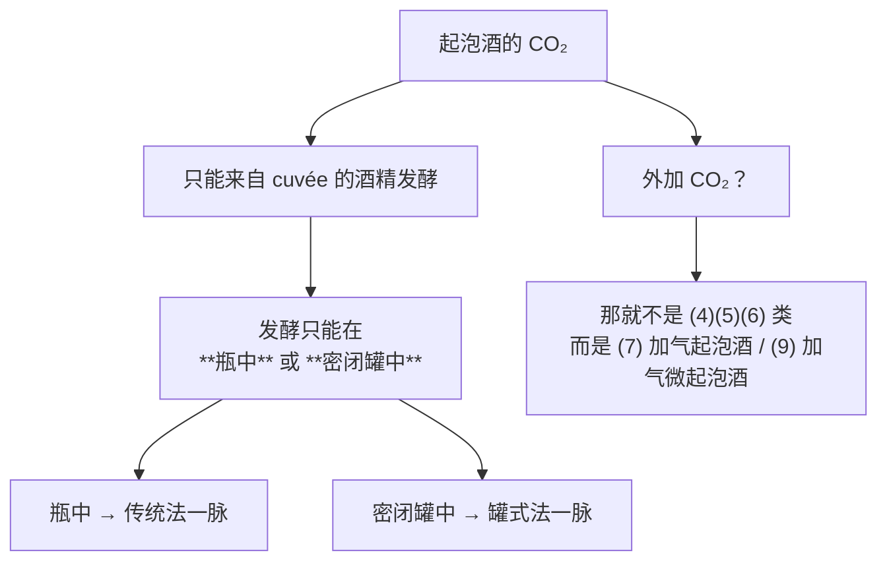
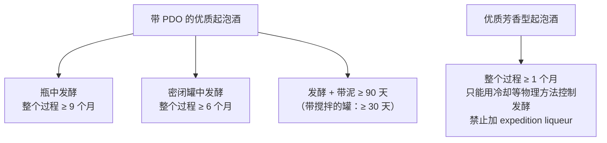

# 第 16 章 起泡酒：传统法、罐式法与气压

> **本章目标**：把起泡酒从"一种氛围"还原成**一组可以查证的数字**。
>
> 三个核心问题：
> **① 气泡从哪来——法规规定它只能从哪来；**
> **② "传统法"和"罐式法"的差别，在法规里就是两个数字；**
> **③ 酒标上的 brut、extra dry、dosage 分别在说什么。**
>
> 这一章会用到第 14 章的酒泥与自溶，也会第一次遇到一个别的酒没有的变量：**压力**。

> **适度饮酒，未成年人不饮酒，酒后不驾车。** 本章的 🅐 实操全部不需要开瓶。

## 16.1 先把词定义清楚

**(EU) No 1308/2013 Annex II Part IV** 给了四个本章反复要用的定义（**已核对原文**）：

| 术语 | 法规定义 |
|------|---------|
| **cuvée**（第 12 点）| **(a) 葡萄汁；(b) 葡萄酒；或 (c) 具有不同特性的葡萄汁与/或葡萄酒的混合物**，用于制备某一特定类型的起泡酒 |
| **实际酒精度**（第 13 点）| 20 ℃ 下每 100 体积产品中所含纯酒精的体积数 |
| **潜在酒精度**（第 14 点）| 20 ℃ 下，**由产品中所含糖完全发酵所能产生的**纯酒精体积数 |
| **总酒精度**（第 15 点）| **实际 + 潜在** |

> **"cuvée"这个词在中文语境里常被译成"基酒"，但法规的定义比"基酒"宽**——
> 它可以是汁、是酒、也可以是**不同特性的汁/酒的混合物**。
> **"调配"被写进了定义本身**，这解释了为什么第 13 章那条
> "非 PDO 红白调配不得做桃红"的禁令，**唯独对起泡酒的 cuvée 开了口子**。

## 16.2 气泡从哪来：一条很硬的规定

**(EU) 2019/934 Annex II Section A 第 10 点**（**本轮新核对原文**）：

> **起泡酒中所含的二氧化碳，只能由制备该酒的 cuvée 的酒精发酵产生。**
> 除非是把葡萄、葡萄汁或部分发酵的葡萄汁直接加工成起泡酒，
> 否则该发酵**只能来自 tirage liqueur 的添加**。
> **它只能在瓶中或密闭罐中进行。**
>
> **反压转移法**中使用二氧化碳是被授权的，但须在监督下进行，
> 且条件是**与 cuvée 酒精发酵产生的二氧化碳之间不可避免的气体交换，
> 不得提高起泡酒中二氧化碳的压力**。

**这一条把三件事一次钉死**：

**第 12 章讲过欧盟的"授权正面清单"思路，这里是另一种立法技术**：
**不列举允许的设备，而是规定"这个分子必须从哪里来"。**
于是"传统法 / 转移法 / 罐式法"三条工艺路线，
在法规眼里只是"**瓶中**还是**密闭罐中**"的区别——**而外加气的那条路被分到了别的类别里去。**

## 16.3 压力：类别的阶梯

**(EU) No 1308/2013 Annex VII Part II**（第 5 章已核）给出一整套按**过压**划分的类别。
所有气压都规定"**在 20 ℃ 的封闭容器中**"：

| 类别 | 过压 | CO₂ 来源 | 其他关键要求 |
|------|------|---------|------------|
| **(4) 起泡酒** | **≥ 3 bar** | 完全来自第一次或第二次酒精发酵 | cuvée 总酒精度 **≥ 8.5 % vol** |
| **(5) 优质起泡酒** | **≥ 3.5 bar** | 同上 | cuvée 总酒精度 **≥ 9 % vol** |
| **(6) 优质芳香型起泡酒** | **≥ 3 bar** | 同上 | 须用名单上的特定品种；实际酒精度 **≥ 6 % vol**、总酒精度 **≥ 10 % vol** |
| **(7) 加气起泡酒** | **≥ 3 bar** | **全部或部分为外加** | 由**不带 PDO/PGI** 的酒制得 |
| **(8) 微起泡酒** | **1 ~ 2.5 bar** | **内源** | 实际 ≥ 7 % vol、原料总 ≥ 9 % vol；容器 **≤ 60 L** |
| **(9) 加气微起泡酒** | **≥ 1 bar** | **外加** | 实际 ≥ 7 % vol、总 ≥ 9 % vol |

**再加上一条 (EU) 2019/934 Annex II Section C 的细节**（新核）：

> **带 PDO 的优质起泡酒，即使装在容量小于 25 cl 的封闭容器中，
> 在 20 ℃ 时的过压也不得低于 3 bar。**

⚠️ **为什么要专门写这一条？** 因为小瓶的顶空比例不同，
法规在这里**主动堵住了一个可以钻的技术空子**——**这是"防规避条款"的典型长相。**

> **对买酒的人，这张表有一个直接用法**：
> **"加气"这两个字在欧盟是一个法定类别，不是贬义词，但也不能不写。**
> 类别 (7) 与 (9) 明确规定 CO₂ 可以外加，
> 而且 (7) **只能由不带地理标志的酒制得**——**法规自己把它和 PDO 世界隔开了。**

## 16.4 糖的账：法规怎么间接管住了压力

### ① 化学计量

酒精发酵的总反应（第 3 章）：**1 分子己糖 → 2 分子乙醇 + 2 分子 CO₂**。
按摩尔质量算（葡萄糖 180.16、乙醇 46.07、CO₂ 44.01）：

| 每 1 g 己糖完全发酵 | 生成 |
|-------------------|------|
| | **约 0.51 g 乙醇** |
| | **约 0.49 g CO₂** |

**在封闭容器里，这些 CO₂ 无处可去**——一部分溶解在酒中，一部分进入顶空，
**共同决定了压力**。

⚠️ **本书在这里必须停下**：
**把"溶解的 CO₂ 浓度"换算成"多少 bar"需要 CO₂ 的亨利定律常数与温度修正，
而本书至今只核到了 SO₂ 的亨利常数（第 5 章），没有核到 CO₂ 的。**
**因此本章不给任何"每 x g/L 糖 = y bar"的换算式。**
（登记进 §16.11 的留白清单。）

**但有一条定性结论是稳的**（第 5 章已核的物理层面）：
**温度升高会降低气体的溶解度**——所以**同一瓶酒，温热时瓶内压力更高**。
这就是为什么侍酒温度与开瓶安全是同一个问题（第 42 章）。

### ② 法规给糖设了一个上限——于是也给压力设了上限

**(EU) 2019/934 Annex II Section A 第 5 点**（新核）：

> **tirage liqueur 与 expedition liqueur 的添加，既不视为增浓，也不视为加甜。**
> **tirage liqueur 的添加，不得使 cuvée 的总酒精度提高超过 1.5 % vol。**
> 该提高量通过计算 **cuvée 的总酒精度**与**添加任何 expedition liqueur 之前的起泡酒的
> 总酒精度**之差来测定。

**把这条和本书的糖—酒精经验值接起来**：

> 本书登记的经验值是**每升约 16~18 g 糖对应 1 % vol**
> （⚠️ **本书至今未核到可引用的一手换算定义**，见[出处与资料登记](../../standards.md) §9）。
> 按这个量级，**1.5 % vol 的上限大致对应每升 24~27 g 糖**。

**于是可以写出本章最有用的一条规律**：

> **欧盟并没有直接规定"tirage 最多加多少糖"，
> 它规定的是"加糖带来的酒精度提高不得超过 1.5 % vol"——
> 而这在化学上等价于给二次发酵能产生的 CO₂ 总量设了一个天花板。**
>
> **这是第 13 章"禁止过度压榨"那条立法技术的又一次出现**：
> **不管手段，管一个事后可测的结果。**

### ③ 还有两条同样重要的限制

| 条款 | 内容 |
|------|------|
| **A.3 / A.4** | **cuvée 的增浓原则上被禁止**（各组分此前的合法增浓不受影响）；成员国可在技术上有理由时授权例外，但须满足：各组分此前均未增浓、原料全部来自本国、**一次操作完成**、且不超过 **A 区 3 % / B 区 2 % / C 区 1.5 % vol** |
| **A.7** | **cuvée 及其组分的加甜被禁止** |
| **A.6** | **expedition liqueur 的添加，不得使起泡酒的实际酒精度提高超过 0.5 % vol** |

> **A.7 与 A.5 合起来解释了一件容易混淆的事**：
> **"加糖"在起泡酒里被拆成了两个法律上完全不同的动作。**
> 给 cuvée 加甜是**禁止**的；加 tirage liqueur（为了引发二次发酵）
> 与加 expedition liqueur（为了最终口味）**被明确排除在"加甜"之外**，
> 各自另有上限。**同一件物理操作，三种法律身份。**

## 16.5 时间：法规写死的酒泥时长

这是本章最该记住的一组数字。**(EU) 2019/934 Annex II Section C**（新核）
对**带 PDO 的优质起泡酒**规定：

| 项目 | 法规规定 |
|------|---------|
| **整个生产过程的时长**（含在生产企业内的陈年，自"使酒起泡的发酵过程"开始计）| **密闭罐中发酵：不得少于 6 个月**；**瓶中发酵：不得少于 9 个月** |
| **使 cuvée 起泡的发酵过程时长 + cuvée 在酒泥上的时长** | **不得少于 90 天**；**若发酵在带搅拌装置的容器中进行，则不得少于 30 天** |
| **cuvée 的总酒精度** | C III 区 **≥ 9.5 % vol**，其他种植区 **≥ 9 % vol**（单一品种的 Prosecco 系列可低至 **8.5 % vol**）|
| **成品的实际酒精度**（含 expedition liqueur 中的酒精）| **≥ 10 % vol** |

**对优质芳香型起泡酒**（Section B 第 4 点与 Section C 第 9 点）：

| 项目 | 规定 |
|------|------|
| 品种 | 只能用附件所列名单中的品种（名单含 **Glera**、各类 **Moscatel/Malvasía**、**琼瑶浆**、**Gamay**、**Clairette** 等）；Veneto 与 Friuli-Venezia Giulia 的 **Glera** 有专门的传统方式例外 |
| **发酵控制** | **只能通过冷却或其他物理方法**进行 |
| **expedition liqueur** | **禁止添加** |
| **生产过程时长** | **不得少于 1 个月** |
| PDO 芳香型的酒精度 | 实际 **≥ 6 % vol**、总 **≥ 10 % vol**；过压 **≥ 3 bar** |

> **三条可以直接带走的判断**：
>
> 1. **"传统法 vs 罐式法"在法规里首先是 9 个月 vs 6 个月的差别**，
>    以及"瓶中"与"密闭罐中"的差别——**不是品质判决**；
> 2. **"带搅拌装置就只要 30 天"这一条暴露了立法者的模型**：
>    立法者认为**搅拌能加速酒泥与酒的接触**（对照第 14 章的自溶机制），
>    所以允许缩短。**法规在这里事实上承认了'搅桶'的作用。**
> 3. **优质芳香型是另一套逻辑**：它**禁止**加 expedition liqueur、
>    只允许**物理方法**控制发酵、实际酒精度低至 6 % vol 而总酒精度 ≥10 % vol——
>    **这三条合起来意味着：它的甜味必须来自"没发酵完的原糖"，不是后加的糖。**
>    （用第 16.1 的定义算一下：总 10 − 实际 6 = **潜在 4 % vol**，
>    按经验值约合 **64~72 g/L 糖**。）

## 16.6 加两次糖：tirage 与 dosage

**(EU) 2019/934 Annex II Section A 第 1 点**给了两个定义（新核）：

| 术语 | 法规定义 |
|------|---------|
| **tirage liqueur** | **加入 cuvée 以引发二次发酵的产品** |
| **expedition liqueur**（行业常称 **dosage**）| **加入起泡酒以赋予其特殊风味品质的产品** |

**它们各自能由什么组成，法规也列了清单**：

| | 允许的成分 |
|---|---|
| **expedition liqueur**（A.2）| **蔗糖、葡萄汁、发酵中的葡萄汁、浓缩葡萄汁、精馏浓缩葡萄汁、葡萄酒**，或其混合物；**可再加葡萄酒蒸馏液** |
| **不带 PDO 的起泡酒的 tirage liqueur**（A.11）| **只能**含葡萄汁、发酵中的葡萄汁、浓缩葡萄汁、精馏浓缩葡萄汁，**或蔗糖与葡萄酒** |
| **优质起泡酒的 tirage liqueur**（B.1）| 蔗糖、浓缩葡萄汁、精馏浓缩葡萄汁、葡萄汁或部分发酵葡萄汁、或葡萄酒 |
| **带 PDO 的（优质）起泡酒的 tirage liqueur**（C.4）| 蔗糖 / 浓缩葡萄汁 / 精馏浓缩葡萄汁，**加上**葡萄汁 / 部分发酵葡萄汁 / 葡萄酒——且后者须**适合产出与被添加对象相同的那款 PDO 起泡酒** |

> **C.4 那句限定很讲究**："用来补的酒，必须本来就能做成同一款 PDO 起泡酒"。
> **这是在防止用外来酒稀释原产地。**

**最后落到酒标上**：甜度术语由 **(EU) 2019/33 Annex III Part A** 规定（第 1 章已核原文）：

| 术语 | 糖含量 |
|------|-------|
| **brut nature** | **< 3 g/L**，**且二次发酵后未加糖** |
| **extra brut** | 0 ~ 6 g/L |
| **brut** | **< 12 g/L** |
| **extra dry** | **12 ~ 17 g/L** |
| **sec / dry** | 17 ~ 32 g/L |
| **demi-sec** | 32 ~ 50 g/L |
| **doux** | > 50 g/L |

**两个容易踩的坑**：

1. **`extra dry` 比 `brut` 甜。** 这是历史遗留的命名，不是逻辑——
   **在这套术语里，"dry"系列排在"brut"系列的甜的一侧**；
2. **`brut nature` 有两个条件**，第二个（**二次发酵后未加糖**）才是关键——
   **它管的是"有没有做 dosage"这个动作，而不只是最终糖含量。**

## 16.7 酒泥给了什么：接着第 14 章往下

起泡酒是**酵母自溶研究得最充分的场景**。
一篇 2026 年的综述（第 14 章已引）明确说：
**大多数研究集中在传统法起泡酒**，自溶期典型 **6~18 个月**、**12~18 ℃**。

**几项已核到的具体观察**：

| 研究 | 观察 |
|------|------|
| **两株 flor 酵母做瓶中二次发酵**（2025 年 *IJMS*）| 同一基酒、同样工艺：**N62 用 27 天达到 3 bar，G1 用 52 天**；但**两者最终压力相近（5.1~5.4 bar）**；带泥 **9 个月**后做代谢组分析 |
| **封瓶方式对二次发酵的影响**（2026 年 *Microorganisms*）| 比较**皇冠盖**与 **tirage 软木塞**，跟踪前 **90 天**：**发酵时间是支配酒成分的首要因素**，**最显著的代谢变化发生在装瓶后第 30~45 天**；tirage 软木塞组**倾向于**更快的发酵进程 |
| **带泥 9 个月 vs 36 个月**（2026 年 *Foods*，三个罗马尼亚本土品种）| 延长带泥使**高级醇与中链脂肪酸上升**，例如**辛酸从约 4.2 升到 7.9 mg/L**；三个品种酸度 **6.12~6.53 g/L** |

⚠️ **对第三项的诚实说明**：该文还报告了一个**看起来异常高**的数值
（1-戊醇 106.8 mg/L）。本书**只采用其方向性结论**（延长带泥 → 高级醇与中链脂肪酸上升），
**不引用其绝对浓度**，理由与第 12 章处理歌海娜那篇论文时相同：
**只引用能自洽的部分。**

> **第一项那组对比特别值得记住**：
> **同一基酒、同样加糖，两株酵母达到 3 bar 的时间差了近一倍（27 天 vs 52 天），
> 但最终压力几乎一样。**
>
> 这说明：**压力的"终点"主要由糖决定，而"到达速度"由酵母决定。**
> 于是"陈放 X 个月"这个数字，**在不同酵母下对应的自溶进度并不相同**——
> 这也解释了为什么综述会说结论难以普适化。

## 16.8 其他路线

| 路线 | 机制 | 法规位置 |
|------|------|---------|
| **传统法**（瓶中二次发酵 + 带泥 + 转瓶 + 除渣 + dosage）| 二次发酵与自溶都在**最终那只瓶子**里发生 | Annex II C.6(b)：PDO 优质起泡酒**瓶中发酵者整个过程 ≥ 9 个月** |
| **转移法** | 瓶中二次发酵，之后在**反压**下转出、过滤、重新装瓶 | Annex II A.10 明确**授权反压转移时使用 CO₂**，但**不得因此提高压力** |
| **罐式法 / Charmat** | 二次发酵在**密闭罐**中完成 | Annex II A.10 允许"密闭罐中"；C.6(a)：PDO 优质起泡酒**罐中发酵者整个过程 ≥ 6 个月**；C.7：**带搅拌装置的容器可缩短到 30 天** |
| **祖传法（ancestral）** | **不加糖**，**单次酒精发酵在瓶中完成** | 见第 13 章所引 2026 年 *Foods* 的定义与试验 |
| **加气法** | **外加 CO₂** | 不属于类别 (4)(5)(6)，而是 **(7) 加气起泡酒**或 **(9) 加气微起泡酒** |

> **注意转移法那一行**：法规**允许**在反压转移时接触 CO₂，
> 但加了一句"**不得提高起泡酒中二氧化碳的压力**"。
> **这是一条既务实又防漏的写法**——承认工程上不可避免的气体交换，
> 但禁止用它来"补气"。

## 16.9 常见说法辨析

按本书约定标注**证据强度**：✅ 有共识 / ⚠️ 有争议 / ❌ 明确错误 / 缺乏证据。

| 说法 | 判定 | 说明 |
|------|------|------|
| "起泡酒的气泡是充进去的" | ⚠️ **要看它属于哪一类** | 类别 **(4)(5)(6)** 的 CO₂ **只能来自 cuvée 的酒精发酵**，且发酵**只能在瓶中或密闭罐中**（2019/934 Annex II A.10）；外加 CO₂ 的是**另外的法定类别 (7) 与 (9)** |
| "传统法一定比罐式法好" | ⚠️ **法规规定的是时长与容器，不是品质** | 带 PDO 的优质起泡酒：**瓶中 ≥ 9 个月 / 罐中 ≥ 6 个月**；发酵 + 带泥 **≥ 90 天**，**带搅拌装置的容器 ≥ 30 天**。⚠️ **本书未核到两种方法成品的盲品对照**，不判优劣 |
| "brut 就是不甜" | ⚠️ **brut 的上限是 < 12 g/L** | 按 (EU) 2019/33 Annex III Part A：brut nature **< 3 g/L 且二次发酵后未加糖**；extra brut **0~6**；brut **< 12**。12 g/L 在静止酒里已经接近"半干"那一侧了 |
| "extra dry 比 brut 干" | ❌ **正好相反** | **extra dry 是 12~17 g/L，brut 是 < 12 g/L**。这是历史命名，不是逻辑 |
| "零补液（brut nature）说明酒更纯粹" | ⚠️ **它说明的是一个动作没做** | 法规定义是**糖 < 3 g/L 且二次发酵后未加糖**——它描述的是**工艺事实**，不是品质。低 dosage 也意味着**少了一层对酸与结构的调整余地** |
| "气泡越细越好，说明是传统法" | 缺乏证据 | **本书未核到把气泡尺寸与工艺方法或品质联系起来的可引用对照研究**。已核到的只有：CO₂ 来源与容器由法规规定；温度会改变气体溶解度（第 5 章）。**不要用气泡外观下工艺结论** |
| "加糖越多气压越高，所以法规不管" | ❌ **法规管了，只是绕了个弯** | **tirage liqueur 不得使 cuvée 的总酒精度提高超过 1.5 % vol**（Annex II A.5）。按本书登记的经验值（每升 16~18 g 糖 ≈ 1 % vol），这大致对应**每升 24~27 g 糖**的上限。⚠️ 该换算系数**本书未核到一手定义**，只作量级参考 |
| "阿斯蒂这类甜起泡酒是后加糖做的" | ⚠️ **对优质芳香型起泡酒，法规恰恰禁止后加糖** | **禁止添加 expedition liqueur**，发酵控制**只能用冷却或其他物理方法**，且实际 ≥ 6 % vol、总 ≥ 10 % vol——**差额来自未发酵完的原糖** |
| "起泡酒不能陈年" | ⚠️ **法规本身就要求它先陈一段** | 带 PDO 的优质起泡酒**整个生产过程不得少于 6 / 9 个月**；自溶研究的典型时长是 **6~18 个月**。至于装瓶后能放多久，涉及 CO₂ 的缓慢损失，**本书留到第 18、41 章** |
| "陈放时间越长，自溶越充分，所以越好" | ⚠️ **时间不是唯一变量** | 已核到的个案：同一基酒、同样工艺，**两株酵母达到 3 bar 的时间相差近一倍（27 天 vs 52 天）**；而综述明确说**农艺与工艺的变异使结论难以普适化** |
| "小瓶起泡酒气压更低" | ❌ **法规专门堵了这一条** | (EU) 2019/934 Annex II C.5：带 PDO 的优质起泡酒**即使装在容量小于 25 cl 的封闭容器中，20 ℃ 时过压也不得低于 3 bar** |

## 16.10 思考题

1. 法规规定起泡酒的 CO₂ "**只能由 cuvée 的酒精发酵产生**"，
   并且该发酵"**只能在瓶中或密闭罐中进行**"。
   这两句话合起来，把哪几条工艺路线**留在了同一个类别里**，又把哪条**排除了出去**？
2. 为什么说"**tirage liqueur 不得使 cuvée 总酒精度提高超过 1.5 % vol**"
   这一条**间接管住了压力**？请把推理链写出来，并指出其中哪一步是**本书的经验值而非法规**。
3. 用第 16.1 的四个定义算一次：某优质芳香型 PDO 起泡酒的
   **实际酒精度 6.5 % vol、总酒精度 11 % vol**。它的潜在酒精度是多少？
   按本书的经验值，大致对应多少残糖？它落在 (EU) 2019/33 的哪个甜度术语里？
4. **【案例】** 某电商页面写道：
   *"本款采用传统法，瓶中二次发酵 18 个月，气泡细腻绵密；
   标注 extra dry，比 brut 更干爽；且为零添加糖工艺。"*
   请逐句判断。（三句各踩中本章一个不同的知识点。）
5. 法规允许"**带搅拌装置的容器**"把发酵 + 带泥的最短时长从 **90 天**缩短到 **30 天**。
   请说明这条规定**隐含了立法者怎样的机制假设**，并把它与第 14 章的自溶机制对上。
6. 两株酵母在同一基酒上，**达到 3 bar 的时间是 27 天与 52 天，最终压力都是 5.1~5.4 bar**。
   请说明这组数据分别告诉了你关于**压力终点**与**发酵速度**的什么，
   以及它为什么让"陈放 X 个月"这个数字变得不那么可比。
7. **【查证】** 打开 (EU) 2019/934 Annex II，找到 Section A 的第 5、6、7 点。
   抄下三条限制，并回答：**为什么立法者要特意声明
   "tirage liqueur 与 expedition liqueur 的添加既不算增浓也不算加甜"？**
   （提示：第 13 章 Q7 处理过一个同构的问题。）
8. 本章出现了一条"防规避条款"（小于 25 cl 容器也须 ≥ 3 bar）。
   请再从本书前面的章节里找出一条同类条款，并说明**防规避条款通常长什么样**。

> 📖 **参考答案**（想清楚再看）：[Q1](../../qa/16-sparkling-qa.md#q1) ·
> [Q2](../../qa/16-sparkling-qa.md#q2) · [Q3](../../qa/16-sparkling-qa.md#q3) ·
> [Q4](../../qa/16-sparkling-qa.md#q4) · [Q5](../../qa/16-sparkling-qa.md#q5) ·
> [Q6](../../qa/16-sparkling-qa.md#q6) · [Q7](../../qa/16-sparkling-qa.md#q7) ·
> [Q8](../../qa/16-sparkling-qa.md#q8)

## 16.11 本章实操

🅐 档**全部不需要开瓶喝酒**。

### 🅐 无器具版 · 任务一：给 8 款起泡酒定位到法定类别

找 **8 款**起泡酒的酒标或商品页（尽量覆盖不同价位与产地），填下表。
**只填受法规约束的信息。**

| # | 甜度术语 | 有无 PDO/PGI | 标示酒精度 | 有没有说发酵在瓶中/罐中 | 有没有说带泥时长 | 我判断它属于哪个法定类别 |
|---|---------|------------|-----------|---------------------|---------------|----------------------|
| 1 | | | | | | |
| … | | | | | | |

**判断依据提示**：过压 ≥3 / ≥3.5 bar、CO₂ 是否外加、是否为芳香型品种、容器容量。

**完成后回答**：八款里有几款能让你**确定**它属于哪一类？
不能确定的，缺的是哪一条信息？

### 🅐 无器具版 · 任务二：把甜度术语排成一条线

**不要看表**，先凭印象把下面七个词按**从干到甜**排序，然后再对照 (EU) 2019/33 Annex III Part A：

`brut` · `brut nature` · `demi-sec` · `doux` · `extra brut` · `extra dry` · `sec`

| 我的排序 | 法规的排序 | 我排错的地方 |
|---------|-----------|------------|
| | | |

**完成后回答**：你把 `extra dry` 排在哪里？为什么这个词最容易排错？

### 🅐 无器具版 · 任务三：做一次"潜在酒精度"的换算练习

用第 16.1 的法规定义（**总酒精度 = 实际 + 潜在**）与本书的经验值
（**每升 16~18 g 糖 ≈ 1 % vol**，⚠️ 未核到一手定义，只作量级参考）填表：

| 酒 | 实际酒精度 | 总酒精度 | 潜在酒精度 | 大致残糖 | 对应甜度术语 |
|----|-----------|---------|-----------|---------|------------|
| A | 12.0 % vol | 12.0 % vol | | | |
| B | 11.5 % vol | 12.2 % vol | | | |
| C | 6.5 % vol | 11.0 % vol | | | |
| D | 7.0 % vol | 10.5 % vol | | | |

**完成后回答**：C 与 D 这类酒（实际酒精度低、总酒精度高）在法规里对应哪一类？
它们的甜为什么**必须**来自没发酵完的糖？

### 🅑 有条件版 · 任务四：一对"时间不同"的起泡酒（备齐后再做）

**所需**：两支起泡酒——一支为**短带泥**的罐式法（很多 Prosecco 类），
一支为**长带泥**的瓶中二次发酵款；两只同款杯（同形状很重要）、
[品鉴记录表](../../forms/tasting-note.md)两份、
一支温度计（两杯必须**同温**，否则压力与释气速度不可比）。

**适度饮酒，未成年人不饮酒，酒后不驾车。** 每杯 20~30 mL 即可。
**开瓶注意安全**：瓶内压力可达数 bar，且温度越高压力越大——**冷藏后再开，瓶口不要对人。**

| 观察项 | A（短带泥）| B（长带泥）|
|-------|----------|----------|
| 果味 vs 面包/坚果/烤香的比重 | | |
| 气泡的**持续时间**（倒入后到基本无泡） | | |
| 口中的**刺感**强度（第 5 章：CO₂ 的三叉神经刺激）| | |
| 酸的位置与尖锐度 | | |
| 回温到室温 10 分钟后，哪一项变化最大 | | |

**然后做一次归因练习**：

> 如果 B 的"面包/坚果"明显更强，按第 14 章与本章 §16.7，
> 这更可能来自**自溶**还是**橡木**（第 15 章）？你怎么区分这两者？
>
> **如果两支你分不出来**，请写下来——并注意一个可能的干扰：
> **两杯不同温**会同时改变释气速度与香气顶空浓度（第 5 章），
> 足以盖过工艺差异。

## 16.12 🔎 买酒与点酒时的用处

1. **先看甜度术语，再看价格。** `extra dry`（12~17 g/L）比 `brut`（<12 g/L）**甜**，
   这是最常被搞反的一条，也是最容易买错的一条。
2. **`brut nature` 是"没做 dosage"，不是"更高级"。**
   它的两个条件是糖 < 3 g/L **且**二次发酵后未加糖。
   少了 dosage 这一层调整，酸与结构会更直接——**喜不喜欢是另一回事。**
3. **"传统法"值得问的是两个数字：在瓶中还是罐中、带泥多久。**
   法规的底线是 PDO 优质起泡酒**瓶中 ≥ 9 个月 / 罐中 ≥ 6 个月**，
   发酵 + 带泥 **≥ 90 天**（带搅拌的罐 **≥ 30 天**）。**说得出数字的才有信息量。**
4. **甜型芳香起泡酒（Moscato 一类）不是"后加糖"。**
   优质芳香型起泡酒**禁止加 expedition liqueur**，甜来自没发酵完的糖；
   它的实际酒精度可以低到 **6 % vol**——**低酒精 + 甜是这一类的结构特征，不是偷工。**
5. **看到"加气"不必惊慌，但要对得上价格。**
   (7) 加气起泡酒是一个法定类别，且**只能由不带地理标志的酒制得**——
   **法规已经把它和 PDO 世界分开了，价格也应该分开。**
6. **气泡的外观不要拿来当证据。** 本书未核到把气泡尺寸与工艺或品质联系起来的对照研究，
   而温度、杯壁状况都会改变它。**用甜度术语、带泥时长、类别去判断，比看气泡可靠得多。**
7. **开瓶与保存要按"压力容器"对待。** 温度升高会降低 CO₂ 溶解度、抬高瓶内压力（第 5 章）。
   冷藏后开瓶既安全，也能减少喷涌带来的损失。

## 16.13 本章依据

### A. 已核对原文的法规

- **(EU) No 1308/2013 Annex II Part IV**（本轮新核）：
  **第 12 点 "cuvée"** = **葡萄汁 / 葡萄酒 / 具有不同特性的葡萄汁与/或葡萄酒的混合物**，
  用于制备特定类型的起泡酒；
  **第 13 点 实际酒精度**（20 ℃ 下每 100 体积产品中的纯酒精体积）；
  **第 14 点 潜在酒精度**（由产品所含糖**完全发酵**所能产生的纯酒精体积）；
  **第 15 点 总酒精度 = 实际 + 潜在**；**第 16 点 自然酒精度 = 任何增浓之前的总酒精度**。
  （legislation.gov.uk 的欧盟"as adopted"文本，2026-09-14。）
- **(EU) No 1308/2013 Annex VII Part II 第 (4)~(9) 项**（第 5 章已核）：
  起泡酒 **≥3 bar**、优质起泡酒 **≥3.5 bar**、优质芳香型 **≥3 bar** 且实际 ≥6 % vol / 总 ≥10 % vol、
  加气起泡酒（**CO₂ 全部或部分外加**、由不带 PDO/PGI 的酒制得）**≥3 bar**、
  微起泡酒（内源 CO₂）**1~2.5 bar** 且容器 ≤60 L、加气微起泡酒 **≥1 bar**；
  所有气压均以"**20 ℃ 的封闭容器**"为条件。
- **(EU) 2019/934 Annex II**（**本轮新核对原文**，本章主干）：
  - **A.1**：**tirage liqueur** = **加入 cuvée 以引发二次发酵的产品**；
    **expedition liqueur** = **加入起泡酒以赋予其特殊风味品质的产品**。
  - **A.2**：expedition liqueur **只能**含蔗糖、葡萄汁、发酵中的葡萄汁、浓缩葡萄汁、
    精馏浓缩葡萄汁、葡萄酒或其混合物，**可再加葡萄酒蒸馏液**。
  - **A.3 / A.4**：**cuvée 的增浓被禁止**（各组分依 (EU) No 1308/2013 已获授权的增浓除外）；
    成员国可在技术上有理由时授权例外，条件为各组分此前未增浓、原料全部来自其境内、
    **一次操作完成**、且不超过 **A 区 3 % / B 区 2 % / C 区 1.5 % vol**，
    手段限于加蔗糖、浓缩葡萄汁或精馏浓缩葡萄汁。
  - **A.5**：**tirage 与 expedition liqueur 的添加既不视为增浓也不视为加甜**；
    **tirage liqueur 不得使 cuvée 的总酒精度提高超过 1.5 % vol**
    （以 cuvée 的总酒精度与添加 expedition liqueur 前起泡酒的总酒精度之差测定）。
  - **A.6**：**expedition liqueur 不得使实际酒精度提高超过 0.5 % vol**。
  - **A.7**：**cuvée 及其组分的加甜被禁止**。
  - **A.8 / A.9**：cuvée 可增酸或降酸（**两者互斥**），增酸**最多 1.5 g/L（以酒石酸计，
    即 20 meq/L）**；气候异常年份可提高到 **2.5 g/L（34 meq/L）**，
    条件是产品的自然酸度不低于 **3 g/L（40 meq/L）**。
  - **A.10**：**CO₂ 只能由 cuvée 的酒精发酵产生**；除直接加工情形外，
    该发酵**只能来自 tirage liqueur 的添加**；**只能在瓶中或密闭罐中进行**；
    **反压转移法中使用 CO₂ 被授权**，但须在监督下且**不得提高起泡酒中 CO₂ 的压力**。
  - **A.11**：不带 PDO 的起泡酒——tirage liqueur 的允许成分清单；
    **实际酒精度（含 expedition liqueur 中的酒精）不得低于 9.5 % vol**。
  - **B.1 / B.2 / B.4**：优质起泡酒的 tirage liqueur 成分；成员国可规定更严格条件；
    **优质芳香型起泡酒**须用本附件附录名单上的品种（**Glera** 在 Veneto 与
    Friuli-Venezia Giulia 有传统方式例外），**发酵控制只能用冷却或其他物理方法**，
    **禁止添加 expedition liqueur**，**生产过程不得少于 1 个月**。
  - **C.1 / C.2 / C.3**：带 PDO 的优质起泡酒，cuvée 总酒精度 **C III 区 ≥9.5 % vol、
    其他区 ≥9 % vol**（**单一品种的 Prosecco 系列可低至 8.5 % vol**）；
    **成品实际酒精度（含 expedition liqueur 中的酒精）≥10 % vol**。
  - **C.5**：**即使装在容量小于 25 cl 的封闭容器中，20 ℃ 时过压也不得低于 3 bar**。
  - **C.6 / C.7**：生产过程时长（含在生产企业内的陈年，自使酒起泡的发酵开始计）
    **密闭罐中 ≥6 个月、瓶中 ≥9 个月**；
    **使 cuvée 起泡的发酵时长 + cuvée 在酒泥上的时长 ≥90 天**，
    **若发酵在带搅拌装置的容器中进行则 ≥30 天**。
  - **C.9**：带 PDO 的优质芳香型起泡酒——品种名单、**只能用物理方法控制发酵**、
    **禁止 expedition liqueur**、实际 **≥6 % vol**、总 **≥10 % vol**、过压 **≥3 bar**、
    生产过程 **≥1 个月**。
- **(EU) 2019/33 Annex III Part A**（第 1 章已核）：起泡酒类的甜度术语与糖含量区间。

### B. 已核对摘要或正文的同行评议文献

- **酵母自溶**：Alexandre & Guilloux-Benatier (2006) 与 2026 年
  *Comprehensive Reviews in Food Science and Food Safety* 的更新综述——题录与要点见第 14 章。
  本章用到：**研究以传统法起泡酒为主**、自溶期 **6~18 个月**、**12~18 ℃**、
  **结论难以普适化**。
- **两株 flor 酵母的瓶中二次发酵**：一项 2025 年 *Int. J. Mol. Sci.* 的研究
  （DOI 10.3390/ijms262110457）：以同一基酒接种两株分离自 Pérez Barquero 酒庄的
  flor 酵母（G1 与 N62），按传统法做二次发酵，在 **3 bar** 时与**带泥 9 个月**后
  用 GC-MS 与 HPLC 做代谢组分析。结果：**N62 动力学更快、细胞浓度更高，
  27 天达到 3 bar，而 G1 需 52 天**；**两者最终压力相近，为 5.1~5.4 bar**。
  该文还引用行业数据：2023 年全球起泡酒市场约 **2400 万百升**，年增约 **4 %**。
- **封瓶方式与二次发酵**：一项 2026 年 *Microorganisms* 的研究
  （DOI 10.3390/microorganisms14081623）：比较**皇冠盖**与 **tirage 软木塞**
  在二次发酵前 **90 天**内的表现。**发酵时间是支配酒成分的首要因素**，
  **最显著的代谢变化出现在装瓶后第 30~45 天**；两种封口都能完成发酵，
  **tirage 软木塞组倾向于更快的发酵进程**并呈现不同的氨基酸与挥发物模式；
  作者指出氨基酸与对应挥发物之间的相关性**仅为弱到中等**，
  支持"香气形成来自多个代谢过程的整合，而非仅取决于前体可得性"。
- **带泥 9 个月 vs 36 个月**：一项 2026 年 *Foods* 的研究
  （DOI 10.3390/foods15020353）：三个罗马尼亚本土品种，按传统法生产，
  在**带泥 9 个月与 36 个月**两个时点、并对**已除渣与未除渣**样品做分析。
  本书采用的方向性结论：**延长带泥使高级醇与中链脂肪酸上升**
  （**辛酸约由 4.2 升至 7.9 mg/L**）；三个品种酸度 **6.12~6.53 g/L**。
  ⚠️ **该文报告的 1-戊醇 106.8 mg/L 相对于葡萄酒的常见量级明显偏高**，
  本书**不引用其绝对浓度**，只用方向（与第 12 章处理歌海娜那篇论文同一条纪律）。
- **祖传法**：第 13 章所引 2026 年 *Foods* 的试验
  （DOI 10.3390/foods15152661）——**不加糖、单次酒精发酵在瓶中完成**。

### C. 本章有意留白的地方

- **"每升 x g 糖 = y bar"的换算**：需要 CO₂ 的亨利定律常数与温度修正，
  **本书只核到 SO₂ 的亨利常数（第 5 章），未核到 CO₂ 的** → **不给换算式**。
- **糖 → 酒精的换算系数**：仍是本书第 3 章登记的**经验值（每升 16~18 g 糖 ≈ 1 % vol）**，
  **未核到一手定义**（见[出处与资料登记](../../standards.md) §9 第 13 条）→
  凡用到它的推算都标注为"量级参考"。
- **气泡尺寸、数量与工艺/品质的关系**：**本书未核到可引用的对照研究** →
  **不用气泡外观下任何工艺或品质结论**。
- **传统法与罐式法成品的盲品对照**：未核到 → **不判优劣**，只写法规规定的时长与容器差别。
- **装瓶后 CO₂ 随时间的损失**：涉及封口透气性与储存条件，**留到第 18、41 章**。
- **中国、美国等法域对起泡酒类别与气压的规定**：本章只核到欧盟条文，
  **不得当作世界通则**（与第 6、9、12、13、14 章同一条纪律）。

以上每一条的完整题录、DOI 与核对状态，见[出处与资料登记](../../standards.md)。

---

**下一章预告**：第 17 章处理**加强酒与甜酒**。
本章讲的是"**让 CO₂ 留在瓶里**"，下一章讲的是"**让糖留在酒里**"——
而留住糖只有两条路：**用酒精把酵母摁停**，或者**让糖浓到酵母干不动**。
两条路在欧盟法规里都有写得极细的条文，
其中一条甚至把**"在酒面上自发长出一层酵母膜"这件事本身定义成了法律术语**。
