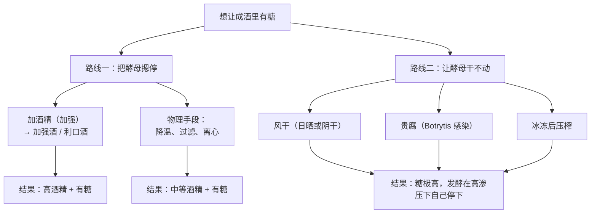
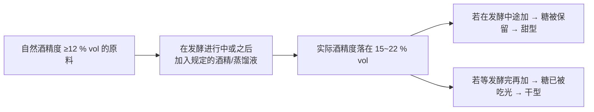
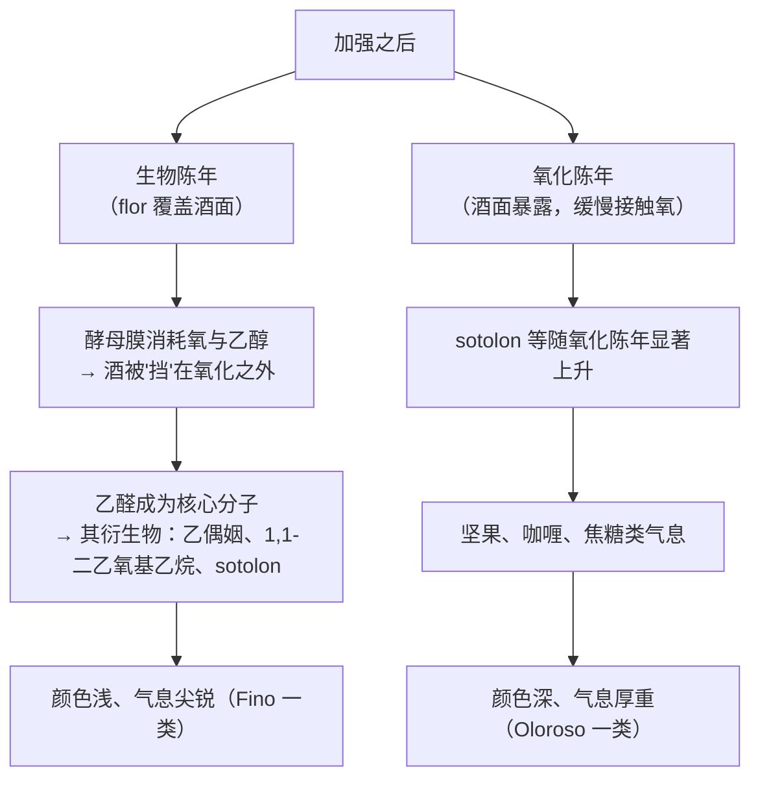

# 第 17 章 加强酒与甜酒：波特、雪莉、贵腐、冰酒

> **本章目标**：糖要留在酒里，只有两条路——
> **① 用酒精把酵母摁停；② 让糖浓到酵母干不动。**
> 本章把这两条路各自的机理、代价与法规写清楚，
> 再处理陈年的两条岔路：**生物陈年**与**氧化陈年**。
>
> 这一章会出现本书到目前为止**最"具体"的法规条文**——
> 具体到把"酒面上自发长出一层酵母膜"这件事本身定义成了法律术语，
> 也具体到给某一款酒的陈年温度写了一个上限。

> **适度饮酒，未成年人不饮酒，酒后不驾车。** 本章的 🅐 实操全部不需要开瓶。

## 17.1 两条留住糖的路

**两条路的代价完全不同，这一点比工艺细节更重要**：

| 路线 | 主要代价 |
|------|---------|
| **加酒精** | 成品**酒精度被抬到 15 % vol 以上**（法规定义如此，见 §17.2）；口感被酒精主导 |
| **让糖浓到干不动** | **葡萄的量被大幅浓缩**（要多得多的葡萄才能得到一瓶酒）；而且**发酵本身会出问题**（§17.5 有数据）|

## 17.2 加强酒的法律骨架

**(EU) No 1308/2013 Annex VII Part II 第 (3) 项「利口酒（Liqueur wine）」**
（**本轮新核对原文**）：

| 条 | 规定 |
|----|------|
| **(a)** | **实际酒精度不低于 15 % vol、不高于 22 % vol** |
| **(b)** | **总酒精度不低于 17.5 % vol**，但某些带原产地名称或地理标志、列入委员会名单的利口酒除外 |
| **(c)** | 由**发酵中的葡萄汁、葡萄酒或二者的组合**制得；某些 PDO/PGI 利口酒还可用**葡萄汁或其与酒的混合物** |
| **(d)** | **初始自然酒精度不低于 12 % vol**，某些列入名单的 PDO/PGI 除外 |
| **(e)** | 加入的必须是：**葡萄来源的中性酒精（含葡萄干蒸馏所得），实际酒精度 ≥ 96 % vol**；或**葡萄酒或葡萄干蒸馏液，实际酒精度 52 % ~ 86 % vol**；可同时加入浓缩葡萄汁等 |

**这五条合起来，就是"加强"这件事的全部法律含义**：

> **这张图解释了一件很多人搞混的事**：
> **"加强"与"甜"不是同一件事。**
> **什么时候加**才决定甜不甜——**加得早，糖留下；加得晚，酒是干的。**
> 雪莉的 Fino 与 Oloroso 都是干的，波特的 Ruby/Tawny 是甜的，**用的是同一条法规。**

### 用第 16 章的定义算一次

**第 16 章已核的定义**：**总酒精度 = 实际酒精度 + 潜在酒精度**，
而**潜在酒精度 = 所含糖完全发酵所能产生的酒精**。

于是 (a) 与 (b) 两条可以合起来读：

| 情形 | 实际 | 总 | 潜在（= 残糖）|
|------|------|----|-------------|
| **干型加强酒** | 15~22 % vol | 与实际接近 | **接近 0** → (b) 的 17.5 % 由实际酒精度本身满足 |
| **甜型加强酒** | 例如 19 % vol | 例如 27 % vol | **8 % vol** → 按本书经验值约合 **每升 130~145 g 糖** |

⚠️ **那个换算是经验值**（每升 16~18 g 糖 ≈ 1 % vol），
**本书未核到一手定义**（见[出处与资料登记](../../standards.md) §9 第 13 条），只作量级参考。

### 还有一个容易混的近亲

**(EU) No 1308/2013 Annex II Part IV 第 11 点**定义了**「用于蒸馏的加强酒」**：
**实际酒精度 18 % ~ 24 % vol**；**只能由向"不含残糖的葡萄酒"中加入
实际酒精度不超过 86 % vol 的未精馏葡萄酒蒸馏物制得**；
**挥发酸最高 1.5 g/L（以乙酸计）**。

而第 13 章已核的 **Annex VIII Part II A.3** 规定：
**这种酒只能用于蒸馏。**

> **为什么要专门造这么一个类别？**
> 因为"给酒加酒精"这件事在欧盟原则上是**被禁止**的
> （Annex VIII Part II A.2），**例外是被逐一列举的**：
> 以酒精中止发酵的鲜葡萄汁、**利口酒**、起泡酒、**用于蒸馏的加强酒**与微起泡酒。
> **于是每一个例外都必须有自己的定义与用途限制**——这是防止例外被滥用的标准写法。

## 17.3 法规里的"传统"：写成数字与地名

**(EU) 2019/934 Annex III** 专门管利口酒。
下面这些条文**本书已核对原文**，它们最能说明**"传统"在法律上长什么样**：

### ① 把"flor"定义成法律术语

**Annex III Section B 第 8 点**规定了西班牙传统用语 **"vino generoso"** 的使用条件：

> 只能用于**全部或部分在 flor 之下发展**的 PDO 利口酒，且：
> **只能由 Palomino de Jerez、Palomino fino、Pedro Ximénez、Verdejo、Zalema、Garrido Fino
> 这几个白葡萄品种的葡萄制得**；
> **在橡木桶中平均陈年两年后**方可投放市场。
>
> 其中**"在 flor 之下发展"**指：**当葡萄汁完全酒精发酵之后，
> 一层典型的酵母膜在酒的自由表面自发形成时所发生的生物学过程，
> 该过程赋予产品特定的分析与感官特征。**

> **请注意最后那句话的写法**：
> **法规没有说"这样更好喝"，它说的是"赋予产品特定的分析与感官特征"。**
> **立法者描述了一个可观察的生物学事实，而把价值判断留白。**
> 这是本书遇到过的法规里最克制、也最值得学习的一种措辞。

### ② 给一款酒的陈年温度写上限

**Annex III Section A 第 4 点 (c)**：

> 对带 PDO **"Madeira"** 的利口酒，**允许在温度不超过 50 ℃ 的容器中陈年**。

**同一条的其他两项**也很有代表性：

| 条 | 内容 |
|----|------|
| **A.4(a)** | **加甜**（须申报与登记）：用浓缩葡萄汁或精馏浓缩葡萄汁，且**使总酒精度提高不超过 3 % vol**；西班牙的 **"vino generoso de licor"** 可到 **8 % vol**；**Madeira** 也可到 **8 % vol** |
| **A.4(b)** | **允许加入酒精、蒸馏液或烈酒，以补偿陈年期间因蒸发造成的损失** |

> **A.4(b) 这一条很实在**：它承认**长期桶陈会蒸发**，
> 并允许补回去——**但补的东西必须是 (3)(e)(f) 里列明的那几种。**

### ③ 把地名写进条文

**Annex III Section B 第 4 点**：

> 对保留给"**Porto**"这一名称的 PDO 利口酒（原料来自划定的 **Douro** 产区），
> **额外的生产与陈年过程可以在上述产区内进行，也可以在 Vila Nova de Gaia — Porto 进行。**

**Section B 第 3 点**同样把两个地名连了起来：

> 对带 PDO **"Málaga"** 与 **"Jerez-Xérès-Sherry"** 的利口酒，
> 由 **Pedro Ximénez** 品种制得、**加入葡萄来源中性酒精以阻止发酵的葡萄干汁**，
> **可以来自 "Montilla-Moriles" 产区。**

> **这两条是同一类条文**：**它们把历史上形成的物流与分工，直接写成了法律例外。**
> 第四部分讲原产地制度时，这类"例外条款"会是重点——
> **原产地法规里最有信息量的部分，往往不是规则，而是例外。**

### ④ 给"自然甜"设一条糖的门槛

**Annex III Section B 第 6 点**规定
**"vino dulce natural" / "vinho doce natural"** 等传统用语只能用于满足下列全部条件的 PDO 利口酒：

- 采收的葡萄**至少 85 %** 属于附录 3 所列品种；
- 来自**初始自然含糖量至少 212 g/L** 的葡萄汁；
- **通过加入 (3)(e)(f) 所列的酒精、蒸馏液或烈酒获得，排除任何其他增浓方式**。

> **"212 g/L"这个数字值得记住**——
> 它是本书到目前为止，法规**直接对糖**（而不是对酒精度）设定门槛的少数几处之一。

## 17.4 陈年的两条岔路：生物陈年与氧化陈年

**已核到的事实（来自一篇 2023 年 *Foods* 的加强酒综述）**：

| 观察 | 内容 |
|------|------|
| **flor 膜的组成** | 主要是**酵母的聚集**，**以 *S. cerevisiae* 最丰富**；也鉴定到 *Torulaspora delbrueckii*、*Zygosaccharomyces rouxii*、*Z. bailii*、*Wickerhamomyces anomalus*、*Pichia membranaefaciens*、*Rhodotorula* 属、*Candida* 属、*Hansenula* 属，以及**被视为负面的 *Dekkera bruxellensis*（无性型 *Brettanomyces*）** |
| **乙醛的地位** | 被报告为**雪莉酒的关键组分**，并与 **Fino 特有的刺激性气味**相关；它是多种气味物的**前体**——乙偶姻（黄油）、1,1-二乙氧基乙烷（青果、甘草）、**sotolon**（坚果、咖喱、棉花糖）|
| **sotolon** | 被报告为**陈年酒的关键气味物**，因其**浓度高而阈值低（几 µg/L 量级）**；在**氧化陈年中浓度显著上升** |
| **生物陈年的标志物** | **1,1-二乙氧基乙烷**与 **Z-威士忌内酯**被提议为生物陈年标志物，其浓度随陈年时间上升 |
| **索莱拉系统** | 雪莉用 **"criaderas" 与 "solera"** 的桶阵，**把年轻酒与更老的酒逐级混合**，以得到稳定一致的风味 |
| **Madeira 的热处理（estufagem）** | 酒装入大型内衬罐，**温度每天升高约 5 ℃**，**维持在 45~50 ℃ 共三个月**；此后在橡木桶中**至少陈年三年**。另一条路线是在 **30~35 ℃**、湿度 >70 % 的酒窖中陈放 **3~20 年或更久** |

> **把 estufagem 的 45~50 ℃ 与 §17.3 ② 的法规条文放在一起看**：
> **法规写的是"温度不超过 50 ℃"，而工艺实践的上沿正好是 50 ℃。**
> **这是一个很好的例子：法规的数字不是凭空定的，它是把既有实践的边界写下来。**

**该综述给的气味阈值表里，有两行可以和第 15 章交叉验证**：

| 分子 | 本章来源给的阈值 | 第 15 章来源给的阈值 |
|------|---------------|-------------------|
| **cis-橡木内酯** | **25 µg/L** | **20 ~ 46 µg/L** |
| **trans-橡木内酯** | **110 µg/L** | **140 ~ 370 µg/L** |
| **sotolon** | **8 µg/L** | —— |

> **两个独立来源给出的橡木内酯阈值量级一致**（cis 二十几微克每升、trans 一百多），
> 这让第 15 章那条"cis 比 trans 潜力大得多"的结论更稳。
> ⚠️ 该表中**乙醛那一行的单位在原文中不明确**，本书**不引用它**。

## 17.5 甜酒：三种浓缩方式，以及一个共同的代价

### ① 法规认下来的两个类别

**(EU) No 1308/2013 Annex VII Part II**（本轮新核）：

| 类别 | 定义 |
|------|------|
| **(15) 葡萄干葡萄酒（Wine from raisined grapes）** | **不经增浓**，由**在日晒或阴处放置以部分脱水**的葡萄制得；**总酒精度 ≥ 16 % vol**、**实际酒精度 ≥ 9 % vol**；**自然酒精度 ≥ 16 % vol（或每升 272 g 糖）** |
| **(16) 过熟葡萄酒（Wine of overripe grapes）** | **不经增浓**；**自然酒精度 > 15 % vol**；**总酒精度 ≥ 15 % vol、实际酒精度 ≥ 12 % vol**。成员国可为该产品规定陈年期 |

> **注意 (15) 里那个括号**：**"自然酒精度 ≥ 16 % vol（或每升 272 g 糖）"**——
> **法规在这里自己给出了一次糖与酒精度的对应关系**：
> **272 ÷ 16 = 17 g/L 每 1 % vol。**
>
> ⚠️ **但本书不把它当作通用换算系数**：
> 它是**这一条定义内部的等价表述**，而不是法规对糖酒转化率的一般性定义
> （见[出处与资料登记](../../standards.md) §9 第 13 条的留白）。
> **不过它落在本书经验值 16~18 g/L 的区间里，可以互相印证。**

### ② 贵腐

**贵腐**是 *Botrytis cinerea* 在**特定天气条件下**感染成熟葡萄的结果[^1]。

[^1]: [贵腐](../../glossary.md#noble-rot)（英：noble rot；法：pourriture noble；
    德：Edelfäule）；病原为[灰葡萄孢](../../glossary.md#botrytis-cinerea)（*Botrytis cinerea*）。

已核到的一项对照（2025 年 *Foods*，宁夏贺兰山东麓小芒森，按感染程度分
**未感染 / 轻度 / 重度**三组，HS-SPME-GC-MS + 电子鼻 + 受训品评组）：

| 观察项 | 结果 |
|-------|------|
| **香气复杂度** | **重度感染组的香气轮廓最丰富、最复杂** |
| 鉴定到的挥发物 | **70 个**（32 酯、17 醇、5 酸、8 醛酮、4 萜烯、4 其他），**酯与醇含量最高** |
| 关键香气活性物 | 乙酸异戊酯、癸酸乙酯、乙酸苯乙酯、月桂酸乙酯、己酸、**芳樟醇**、癸酸、**香茅醇**、己酸乙酯、辛酸甲酯 |
| **感官** | **"花香""菠萝/香蕉香""蜂蜜香"与整体香气强度在重度感染组最突出** |

⚠️ **限制**：**单一品种、单一产区、单一年份**，本书只用其**方向性结论**，
**不外推为"贵腐酒都会怎样"**。

⚠️ **一处重要留白**：**贵腐对葡萄汁化学组成的定量改变**
（如甘油与葡萄糖酸的生成量）**本书未核到可引用的一手数据** → **不写数字**。

### ③ 冰冻浓缩

**原理很简单**：水先结冰，糖留在未冻的那一部分——**在冰冻状态下压榨，得到的是浓缩汁。**

⚠️ **但"冰酒"的法定定义，本书的核对结果是一个诚实的空白**：

- **欧盟层面**：本书**已读的 Annex VII Part II 各类别中，没有"冰酒"这一类**；
  德国的 **Eiswein** 属于其国内的成熟度分级体系，
  而该体系的条文**本书尚未核对**（见[出处与资料登记](../../standards.md) §3）；
- **中国**：**GB/T 25504《冰葡萄酒》**是现行标准（2010 版），
  但**本书尚未读到其条文**，因此**不写任何数字**；
- **加拿大等主要产地的规则**：**本书未核到原文**。

**因此本章不给"冰酒必须在多少度采收 / 多少糖度压榨"这类数字。**
按本书纪律，这属于"**查不到就别写死**"。

### ④ 共同的代价：高糖会把发酵逼到墙角

这是本章最值得记住的一组数据。一项 2024 年 *Scientific Reports* 的试验，
用**维代尔冰葡萄汁**，把**初始糖调到 370、450、500、550 g/L** 四档，
**18 ℃**、同一株商业酵母、**YAN 统一调到 350 mg/L**：

| 初始糖 | 乙醇产量 | 乙酸 |
|-------|---------|------|
| **370 g/L** | **130.26 g/L** | 区间下端（**0.82 g/L**）|
| **450 g/L** | **117.83 g/L** | |
| **500 g/L** | **106.14 g/L** | **2.14 g/L** |
| **550 g/L** | **90.85 g/L** | **2.86 g/L** |

**作者报告的相关性**：初始糖浓度与**活跃发酵期的活酵母数、总糖与 YAN 的消耗量、
乙醇产量**都**显著负相关**，而与**乙酸与乙醛的生成正相关**。
**初始糖 ≥ 500 g/L 时乙酸过量**，并**抑制了正丁醇与正己醇的酯化**，
同时**促进了异戊醇、乙酸异戊酯、琥珀酸二乙酯、己酸乙酯与辛酸乙酯的生成**，
以及 **2-苯乙醇与异丁醇**的增加。

**把乙酸换算成法规用的单位**（乙酸摩尔质量 60.05 g/mol，
故 **1 meq/L = 0.060 05 g/L**）：

| 试验里的乙酸 | 换算成 meq/L | 对照第 5 章已核的一般限值 |
|------------|------------|------------------------|
| 0.82 g/L | **约 13.7 meq/L** | 白与桃红 **18**、红 **20 meq/L** → 仍在限内 |
| 2.14 g/L | **约 35.6 meq/L** | **远超一般限值** |
| 2.86 g/L | **约 47.6 meq/L** | **远超一般限值** |

> **这一步换算把一个实验室结果变成了一个可执行的判断**：
> **"把糖堆到 500 g/L 以上再发酵"这件事，在化学上会撞到法规的挥发酸上限。**
>
> **而法规恰好留了口子**：第 5 章已核的 **(EU) 2019/934 Annex I Part C**
> 允许成员国对**陈年不少于两年、或总酒精度不低于 13 % vol** 等情形给予豁免。
> **甜酒与加强酒正好都落在这些情形里。**
>
> **所以"甜酒的挥发酸往往更高"不是传闻，它有机理（高渗胁迫）、有数据、也有法规的回应。**

⚠️ **限制**：该试验是**加糖调节**的对照设计（用葡萄糖把糖调到指定浓度），
**不是自然冰葡萄汁的年份对比**；且只用了一株酵母。本书只用其**方向与量级**。

### ⑤ 甜不等于稳定

**高糖不是无菌。** 一项 2023 年 *Microorganisms* 的研究
**首次从托卡伊发酵后的贵腐甜酒中分离到 *Zygosaccharomyces lentus***：

| 性质 | 结果 |
|------|------|
| **耐渗透压** | 是 |
| **耐硫** | **高** |
| **耐酒精** | **8 % v/v** |
| **生长条件** | 在**酒窖温度**与**酸性条件**下生长良好 |
| **发酵力** | **显著低于**对照的 *S. cerevisiae*（Lalvin EC1118）|
| **结论** | 是酿酒学上**潜在的腐败酵母**，**可能引发陈年期间的二次发酵** |

> **这条对读者的实用含义很直接**：
> **甜酒开瓶后与储存中的风险，不比干型酒小。**
> 它的糖是微生物的食物，而能在酒里活下来的耐渗透压酵母是存在的。

## 17.6 常见说法辨析

按本书约定标注**证据强度**：✅ 有共识 / ⚠️ 有争议 / ❌ 明确错误 / 缺乏证据。

| 说法 | 判定 | 说明 |
|------|------|------|
| "加强酒就是甜酒" | ❌ **两回事** | 法规只规定**实际酒精度 15~22 % vol**、**总酒精度 ≥17.5 % vol**（有例外名单）。**甜不甜取决于什么时候加酒精**：发酵中途加 → 留糖；发酵完再加 → 干型。雪莉的 Fino 与 Oloroso 都是干的 |
| "波特加的是白兰地" | ⚠️ **法规规定得更具体** | 允许加入的是：**葡萄来源的中性酒精（≥96 % vol）**，或**葡萄酒/葡萄干蒸馏液（52~86 % vol）**；某些列名 PDO 另有 (f) 项的选项。**"白兰地"是口语，不是法规用词** |
| "给葡萄酒加酒精在欧盟是允许的" | ⚠️ **原则禁止、例外列举** | **Annex VIII Part II A.2：所有授权工艺均不得加酒精**，例外**仅限**：以酒精中止发酵的鲜葡萄汁、**利口酒**、起泡酒、**用于蒸馏的加强酒**与微起泡酒。而"用于蒸馏的加强酒"**只能用于蒸馏**（A.3）|
| "雪莉都是氧化的酒" | ❌ **生物陈年那一支恰恰是被挡住氧的** | 法规把 **flor** 定义成"葡萄汁完全酒精发酵后，一层典型酵母膜在酒的自由表面**自发形成**时发生的生物学过程"；**"vino generoso"须全部或部分在 flor 之下发展**，且限定六个白品种、**橡木桶中平均陈年两年** |
| "索莱拉就是把老酒兑新酒，等于作假" | ⚠️ **它是法规承认的传统体系** | 已核到的描述：**"criaderas"与"solera"**桶阵**把年轻酒与更老的酒逐级混合**，目的是得到**稳定一致**的风味。⚠️ 本书**未核到各产区对索莱拉抽取比例的具体规定**，不给数字 |
| "马德拉是被烤坏了的酒" | ❌ **加热是法定允许的工艺** | **(EU) 2019/934 Annex III A.4(c)：允许 Madeira 在温度不超过 50 ℃ 的容器中陈年**。已核到的工艺描述：**每天升温约 5 ℃、维持 45~50 ℃ 共三个月**，其后橡木桶中**至少三年** |
| "贵腐就是发霉的葡萄" | ⚠️ **是同一个真菌，条件不同** | 病原是 *Botrytis cinerea*。已核到的对照显示：**重度感染组的香气最丰富复杂**，**"花香/菠萝香蕉/蜂蜜"与整体强度最突出**。⚠️ 单一品种、单一年份、单一产区，**不外推**；而且第 13 章已核：**灰霉带来的漆酶会使谷胱甘肽类抗褐变方案失效** |
| "冰酒必须零下 x 度采摘、糖度必须达到 y" | ⚠️ **这些数字本书没核到，因此不写** | 欧盟已读的类别中**没有"冰酒"这一类**；德国 Eiswein 属其国内分级体系（**条文未核**）；**GB/T 25504《冰葡萄酒》**是中国现行标准但**条文未读** → 按本书纪律**不写死数字** |
| "甜酒糖分高，所以不容易坏" | ❌ **高糖不是无菌** | 从托卡伊发酵后的贵腐甜酒中**首次分离到 *Zygosaccharomyces lentus***：**耐渗透压、耐硫高、耐酒精 8 % v/v、在酒窖温度与酸性条件下生长良好**，被判定为**潜在腐败酵母，可能引发陈年期间的二次发酵** |
| "甜酒的挥发酸高是工艺粗糙" | ⚠️ **它首先是高渗胁迫的化学后果** | 维代尔冰葡萄汁试验：初始糖 **370→550 g/L** 时，乙醇产量 **130.26→90.85 g/L** 递减，**乙酸 0.82→2.86 g/L** 递增；**≥500 g/L 时乙酸过量**。换算成法规单位：**2.86 g/L ≈ 47.6 meq/L**，远超一般限值（白与桃红 18 / 红 20 meq/L）——**而法规对陈年 ≥2 年或总酒精度 ≥13 % vol 等情形留了豁免口子** |
| "贵腐酒和冰酒差不多，都是甜白" | ⚠️ **浓缩机制不同，后果也不同** | 贵腐是**真菌代谢 + 脱水**（还会带来漆酶等酶活，第 13 章）；冰冻是**纯物理的水分分离**。⚠️ **两者成品差异的定量对照本书未核到**，因此只写机制差别 |

## 17.7 思考题

1. 用 (EU) No 1308/2013 Annex VII Part II 第 (3) 项的 (a)(b)(d) 三条，
   解释为什么"加强"与"甜"是两件事。
2. 法规把 flor 定义为"葡萄汁完全酒精发酵后，一层典型酵母膜在酒的自由表面**自发形成**
   时发生的生物学过程，赋予产品特定的**分析与感官特征**"。
   请指出这句定义里**刻意没有说**的是什么，以及为什么这样写更稳妥。
3. Annex III 允许 **Madeira 在不超过 50 ℃ 的容器中陈年**，
   而已核到的工艺描述是**维持 45~50 ℃ 三个月**。
   请说明法规的数字与工艺实践之间是什么关系，并举出本书前面章节的一个同类例子。
4. **【案例】** 某促销文案写道：
   *"本款波特加入优质白兰地强化至 20 度；雪莉都是氧化型酒，越黑越好；
   甜酒糖分高不易变质，开瓶后可以放很久。"*
   请逐句判断并改写。（三句各踩中本章一个不同的知识点。）
5. 把维代尔试验里的三个乙酸数值（**0.82 / 2.14 / 2.86 g/L**）换算成 **meq/L**
   （乙酸摩尔质量 60.05 g/mol），并与第 5 章已核的一般限值对照。
   然后回答：**为什么法规要为"陈年 ≥2 年或总酒精度 ≥13 % vol"的酒留豁免？**
6. **(15) 葡萄干葡萄酒**的定义里写着"自然酒精度 ≥16 % vol（**或每升 272 g 糖**）"。
   这是不是意味着本书可以据此确定糖 → 酒精的通用换算系数？为什么？
7. **【查证】** 打开 (EU) 2019/934 Annex III Section B 的第 3 点与第 4 点，
   抄下其中提到的地名与它们被允许的操作。
   然后回答：**为什么原产地法规里会出现"允许在另一个地方完成某道工序"的条文？**
8. 本章的两条留住糖的路径——**加酒精**与**高糖**——
   各自把"风险"推到了哪里？请结合第 5 章（SO₂ 与微生物）与本章 §17.5 ⑤ 回答。
9. 贵腐与冰冻都是"浓缩"，但本书说它们的后果不同。
   请列出至少两条**机制上**的差别，并说明为什么本书**不给**两者成品差异的定量结论。

> 📖 **参考答案**（想清楚再看）：[Q1](../../qa/17-fortified-and-sweet-qa.md#q1) ·
> [Q2](../../qa/17-fortified-and-sweet-qa.md#q2) · [Q3](../../qa/17-fortified-and-sweet-qa.md#q3) ·
> [Q4](../../qa/17-fortified-and-sweet-qa.md#q4) · [Q5](../../qa/17-fortified-and-sweet-qa.md#q5) ·
> [Q6](../../qa/17-fortified-and-sweet-qa.md#q6) · [Q7](../../qa/17-fortified-and-sweet-qa.md#q7) ·
> [Q8](../../qa/17-fortified-and-sweet-qa.md#q8) · [Q9](../../qa/17-fortified-and-sweet-qa.md#q9)

## 17.8 本章实操

🅐 档**全部不需要开瓶喝酒**。

### 🅐 无器具版 · 任务一：用三个数字给加强酒定位

找 **6 款**加强酒（波特、雪莉、马德拉、马沙拉、法国 VDN 等各类都可），填下表。

| # | 标示酒精度 | 甜/干（酒标怎么写的）| 有无 PDO | 有没有说陈年方式（索莱拉/年份/桶陈）| 它在 (3)(a) 的 15~22 % vol 区间里吗 |
|---|-----------|-------------------|---------|--------------------------------|--------------------------------|
| 1 | | | | | |
| … | | | | | |

**完成后回答**：六款里，**标示酒精度最低与最高的相差多少**？
按 §17.2 的表，同样是"加强酒"，为什么这个跨度可以这么大？

### 🅐 无器具版 · 任务二：自己做一次 meq/L 换算

按"**1 meq/L 乙酸 = 0.060 05 g/L**"填表，并对照第 5 章已核的一般限值
（白与桃红 **18 meq/L**、红 **20 meq/L**）：

| 乙酸浓度 | meq/L | 在一般限值内吗 |
|---------|-------|-------------|
| 0.5 g/L | | |
| 0.82 g/L | | |
| 1.08 g/L | | |
| 2.14 g/L | | |
| 2.86 g/L | | |

**完成后回答**：**1.08 g/L 这个值为什么正好是一条线？**
（提示：把 18 乘以 0.060 05。）

### 🅐 无器具版 · 任务三：读一次 Annex III 里的"传统用语"条款

打开 (EU) 2019/934 Annex III Section B，找到下列传统用语的条件并填表。
**只抄法规写的，不抄市场介绍。**

| 传统用语 | 法规规定的条件（品种 / 工艺 / 陈年 / 糖）| 它对应的是哪一类酒 |
|---------|--------------------------------------|-----------------|
| `vino generoso` | | |
| `vino generoso de licor` | | |
| `vinho generoso` | | |
| `vino dulce natural` / `vin doux naturel` | | |

**完成后回答**：这四个词里，**哪一个的条件里出现了具体的糖含量数字**？
为什么偏偏是它？

### 🅑 有条件版 · 任务四：一支干型加强酒与一支甜型加强酒（备齐后再做）

**所需**：一支**干型**加强酒（如 Fino / Oloroso 类）与一支**甜型**加强酒
（如 Ruby / Tawny 类），两只同款杯、
[品鉴记录表](../../forms/tasting-note.md)两份、一支温度计。

**适度饮酒，未成年人不饮酒，酒后不驾车。**
加强酒酒精度可达 20 % vol 左右——**每杯 15~20 mL 足够**，并请准备饮用水。

| 观察项 | 干型 | 甜型 |
|-------|------|------|
| 酒精的**热感**（第 1 章：化学感觉，不是味觉）| | |
| 甜的位置（前段 / 中段 / 收尾）| | |
| 有没有"坚果 / 咖喱 / 焦糖"类气息？强度 1~5 | | |
| 有没有"苹果 / 青果 / 刺激"类气息？强度 1~5 | | |
| 颜色（色调 + 深浅 + 边缘，文字描述）| | |
| 两支的**余味长度**对比 | | |

**然后做一次归因练习**：

> 若"坚果 / 咖喱"类气息在某一支上明显更强，按 §17.4，
> 这更指向**氧化陈年**（sotolon 上升）还是**生物陈年**？
> 若"苹果 / 刺激"更强呢？（提示：乙醛与 Fino 的关联。）
>
> **如果你觉得两支的酒精热感差不多**，请把标示酒精度记下来对照——
> **甜度会改变对酒精的感知**（第 1、2 章的交叉模态），这本身就是一个值得记录的现象。

## 17.9 🔎 买酒与点酒时的用处

1. **看到"加强酒"先问干还是甜，再问酒精度。**
   法规允许的区间是 **15~22 % vol**，跨度很大；而**甜不甜取决于加酒精的时机**，
   不取决于"加强"这个词。
2. **"vino generoso"这个词在酒标上是有法律含义的**：
   **全部或部分在 flor 之下发展**、限定六个白品种、**橡木桶中平均陈年两年**。
   它比任何形容词都硬。
3. **"索莱拉"意味着没有年份。** 它的目的是**风味一致**，
   所以在这类酒上追问年份通常没有意义——该问的是**平均酒龄与体系**。
4. **马德拉的"加热"是合法且必要的工艺**，不是缺陷。
   法规给的上限是 **50 ℃**，工艺实践的上沿也正是 45~50 ℃。
5. **甜酒不要迷信"糖多不会坏"。** 已核到的耐渗透压腐败酵母
   （耐硫、耐 8 % v/v 酒精、在酒窖温度下生长良好）就是反例。
   开瓶后的保存要求不比干型酒低（第 41、42 章）。
6. **甜酒的挥发酸略高不必立刻当成缺陷。**
   高糖会把发酵推向产乙酸的方向（370→550 g/L 时乙酸 0.82→2.86 g/L），
   **而法规对长陈年、高酒精度的酒本来就留了豁免**。
   要警惕的是它**伴随其他异常**时（第 31 章）。
7. **"冰酒"的具体门槛，请以你所在市场的现行标准为准。**
   本书**没有核到**欧盟层面的冰酒类别、德国 Eiswein 的条文，
   也没有读到 **GB/T 25504** 的正文——**所以本书不给数字，也建议你不要相信随手写出的数字。**

## 17.10 本章依据

### A. 已核对原文的法规

- **(EU) No 1308/2013 Annex VII Part II 第 (3) 项「利口酒」**（本轮新核）：
  **(a) 实际酒精度 ≥15 % vol 且 ≤22 % vol**；
  **(b) 总酒精度 ≥17.5 % vol**（列入委员会名单的某些 PDO/PGI 利口酒除外）；
  **(c)** 由发酵中的葡萄汁、葡萄酒或其组合制得（某些 PDO/PGI 还可用葡萄汁或其与酒的混合物）；
  **(d) 初始自然酒精度 ≥12 % vol**（列名 PDO/PGI 除外）；
  **(e)** 加入物限于**葡萄来源的中性酒精（含葡萄干蒸馏所得），实际酒精度 ≥96 % vol**，
  或**葡萄酒/葡萄干蒸馏液，实际酒精度 52 %~86 % vol**，可同时加浓缩葡萄汁等；
  **(f)** 对列名 PDO/PGI 的减损选项（含葡萄酒/葡萄干酒精 95 %~96 % vol、
  葡萄酒或皮渣蒸馏烈酒 52 %~86 % vol、葡萄干蒸馏烈酒 52 %~<94.5 % vol 等）。
- **(EU) No 1308/2013 Annex VII Part II 第 (15)、(16) 项**（本轮新核）：
  **(15) 葡萄干葡萄酒**——**不经增浓**，由**日晒或阴处部分脱水**的葡萄制得；
  **总酒精度 ≥16 % vol、实际 ≥9 % vol**；**自然酒精度 ≥16 % vol（或每升 272 g 糖）**。
  **(16) 过熟葡萄酒**——**不经增浓**；**自然酒精度 >15 % vol**；
  **总 ≥15 % vol、实际 ≥12 % vol**；成员国可规定陈年期。
- **(EU) No 1308/2013 Annex II Part IV 第 11 点「用于蒸馏的加强酒」**（本轮新核）：
  **实际酒精度 ≥18 % vol 且 ≤24 % vol**；**只能由向不含残糖的葡萄酒中加入
  实际酒精度不超过 86 % vol 的未精馏葡萄酒蒸馏物制得**；
  **挥发酸最高 1.5 g/L（以乙酸计）**。另 **第 13~16 点**的酒精度定义见第 16 章。
- **(EU) No 1308/2013 Annex VIII Part II A.2 / A.3**（第 13 章已核）：
  **所有授权工艺均不得加酒精**，例外仅限以酒精中止发酵的鲜葡萄汁、利口酒、起泡酒、
  **用于蒸馏的加强酒**与微起泡酒；**用于蒸馏的加强酒只能用于蒸馏**。
- **(EU) 2019/934 Annex III**（**本轮新核对原文**）：
  - **A.2(a)**：自然酒精度的提高**只能来自 (3)(e) 与 (f) 所列产品**；
    **A.2(b)**：西班牙可对传统用语 `vino generoso` / `vino generoso de licor`
    使用**硫酸钙**（处理后硫酸盐含量以硫酸钾计 **≤2.5 g/L**），并可再增酸**最多 1.5 g/L**。
  - **A.4(a) 加甜**（须申报与登记）：用浓缩葡萄汁或精馏浓缩葡萄汁，
    **使总酒精度提高不超过 3 % vol**；`vino generoso de licor` 与 **Madeira** 可到 **8 % vol**。
  - **A.4(b)**：允许加入酒精、蒸馏液或烈酒**以补偿陈年期间蒸发造成的损失**。
  - **A.4(c)**：**Madeira 可在温度不超过 50 ℃ 的容器中陈年**。
  - **A.6**：非 PDO/PGI 利口酒所用原料的**自然酒精度不得低于 12 % vol**。
  - **B.3**：**Málaga 与 Jerez-Xérès-Sherry** 所用、由 **Pedro Ximénez** 制得并加中性酒精
    阻止发酵的葡萄干汁，**可来自 Montilla-Moriles 产区**。
  - **B.4**：保留给 **Porto** 的 PDO 利口酒，其**额外的生产与陈年过程可在 Douro 产区内
    或在 Vila Nova de Gaia — Porto 进行**。
  - **B.5(a)**：PDO 利口酒原料的自然酒精度一般 **≥12 % vol**，
    并列举了 **≥10 %、≥11 %、≥10.5 %**（列表 3 的白葡萄汁）与 **≥9 %（Madeira）** 的例外。
  - **B.5(b)**：存在一份**总酒精度低于 17.5 % vol 但不低于 15 % vol** 的 PDO 利口酒名单
    （以 1985-01-01 前的国内法明文规定为条件）。
  - **B.6**：`vino dulce natural` 等传统用语只能用于——采收葡萄**至少 85 %** 属附录 3 所列品种、
    来自**初始自然含糖量至少 212 g/L** 的葡萄汁、且**通过加入 (3)(e)(f) 的酒精/蒸馏液/烈酒获得，
    排除任何其他增浓**的 PDO 利口酒。
  - **B.8**：`vino generoso` 只能用于**全部或部分在 flor 之下发展**的 PDO 利口酒，
    **只能由 Palomino de Jerez、Palomino fino、Pedro Ximénez、Verdejo、Zalema、
    Garrido Fino 的白葡萄制得**，**在橡木桶中平均陈年两年后**投放市场；
    **"在 flor 之下发展"** 定义为：**葡萄汁完全酒精发酵后，一层典型酵母膜在酒的自由表面
    自发形成时所发生的生物学过程，该过程赋予产品特定的分析与感官特征**。
  - **B.9**：`vinho generoso` 只能与 **Porto、Madeira、Moscatel de Setubal、Carcavelos**
    的原产地名称连用。
  - **B.10**：`vino generoso de licor` = 在 `vino generoso` 中加入
    **加了葡萄来源中性酒精以阻止发酵的葡萄干汁**、或精馏浓缩葡萄汁、或 `vino dulce natural`，
    并**在橡木桶中平均陈年两年后**投放市场。
  （以上均为 legislation.gov.uk 的欧盟"as adopted"文本，2026-09-14。）
- **(EU) 2019/934 Annex I Part C**（第 5 章已核）：挥发酸上限
  **白与桃红 18 meq/L、红 20 meq/L**；成员国可对**陈年不少于两年**、
  或**总酒精度不低于 13 % vol** 等情形给予豁免。

### B. 已核对摘要或正文的同行评议文献

- **加强酒的工艺、微生物与香气（本章主干来源）**：一篇 2023 年 *Foods* 的综述
  （"The Fingerprint of Fortified Wines—From the *Sui Generis* Production Processes to the
  Distinctive Aroma"，DOI 10.3390/foods12132558）。本书已读其摘要、生产与微生物章节、
  葡萄牙与西班牙加强酒章节及其气味物表。本章用到：
  **flor 膜主要由酵母聚集形成，*S. cerevisiae* 最丰富**，另鉴定到
  *Torulaspora delbrueckii*、*Zygosaccharomyces rouxii*、*Z. bailii*、
  *Wickerhamomyces anomalus*、*Pichia membranaefaciens*、*Rhodotorula* 属、
  *Candida* 属、*Hansenula* 属与**被视为负面的 *Dekkera bruxellensis***；
  雪莉的 **criaderas / solera** 体系**把年轻酒与更老的酒逐级混合以求风味一致**；
  **乙醛是雪莉的关键组分**、与 **Fino 的刺激性气味**相关，并是**乙偶姻、
  1,1-二乙氧基乙烷与 sotolon** 的前体；**sotolon 因浓度高、阈值低（几 µg/L 量级）
  被报告为陈年酒的关键气味物，且在氧化陈年中显著上升**；
  **1,1-二乙氧基乙烷与 Z-威士忌内酯被提议为生物陈年标志物**；
  **Madeira 的 estufagem**：酒入大型内衬罐，**每天升温约 5 ℃**，
  **维持 45~50 ℃ 共三个月**，此后橡木桶中**至少三年**；另一路线为在 **30~35 ℃**、
  湿度 >70 % 的酒窖中 **3~20 年或更久**。该文的气味阈值表中，
  **sotolon 8 µg/L、cis-橡木内酯 25 µg/L、trans-橡木内酯 110 µg/L**——
  后两者与第 15 章来源给出的 **20~46 / 140~370 µg/L** **量级一致**。
  ⚠️ 该表中**乙醛一行的单位在原文中不明确**，**本书不引用**。
- **贵腐对香气的影响**：一项 2025 年 *Foods* 的研究
  （DOI 10.3390/foods14152723）：宁夏贺兰山东麓小芒森，按 *Botrytis cinerea*
  感染程度分**未感染 / 轻度 / 重度**三组，HS-SPME-GC-MS + 电子鼻 + 受训品评组。
  结果：**重度感染组香气最丰富复杂**；共鉴定 **70 个**挥发物
  （32 酯、17 醇、5 酸、8 醛酮、4 萜烯、4 其他），**酯与醇含量最高**；
  关键香气活性物含乙酸异戊酯、癸酸乙酯、乙酸苯乙酯、月桂酸乙酯、己酸、
  **芳樟醇**、癸酸、**香茅醇**、己酸乙酯、辛酸甲酯；
  感官上**"花香""菠萝/香蕉香""蜂蜜香"与整体香气强度在重度感染组最突出**。
  ⚠️ **单一品种、单一产区、单一年份**，只用方向性结论。
- **高糖对发酵的影响（本章 §17.5 ④ 的来源）**：一项 2024 年 *Scientific Reports* 的研究
  （DOI 10.1038/s41598-024-82721-z）：维代尔冰葡萄汁，用葡萄糖把**初始糖调到
  370 / 450 / 500 / 550 g/L**，**18 ℃**，Zymaflore ST 酵母，**YAN 统一调到 350 mg/L**。
  结果：初始糖浓度与**活跃发酵期的活酵母数、总糖与 YAN 的消耗量、乙醇产量**
  **显著负相关**（乙醇 **130.26 / 117.83 / 106.14 / 90.85 g/L**），
  与**乙酸（0.82~2.86 g/L）与乙醛**的生成**正相关**；
  **初始糖 ≥500 g/L（500 与 550）时乙醇偏低而乙酸过量（2.14 与 2.86 g/L）**，
  **抑制了正丁醇与正己醇的酯化**，**促进了异戊醇、乙酸异戊酯、琥珀酸二乙酯、
  己酸乙酯与辛酸乙酯的生成**，并提高 **2-苯乙醇与异丁醇**；
  初始糖影响甘油、异丁醇、乙酸乙酯与琥珀酸二乙酯的生成，
  但**不影响冰酒的最终含量**。⚠️ **加糖调节的对照设计、单一酵母**，只用方向与量级。
- **甜酒中的耐渗透压腐败酵母**：一项 2023 年 *Microorganisms* 的研究
  （DOI 10.3390/microorganisms11040852）：**首次从托卡伊发酵后的贵腐甜酒中分离到
  *Zygosaccharomyces lentus***；生理试验确认其**耐渗透压、耐硫高、耐酒精 8 % v/v**、
  **在酒窖温度与酸性条件下生长良好**；β-葡萄糖苷酶与亚硫酸盐还原酶活性低，
  未检出蛋白酶、纤维素酶与 α-阿拉伯呋喃糖苷酶活性；
  **发酵力显著低于对照 *S. cerevisiae*（Lalvin EC1118）**；
  作者结论：它是酿酒学上**潜在的腐败酵母，可能引发陈年期间的二次发酵**。

### C. 本章有意留白的地方

- **"冰酒"的法定定义与门槛**：欧盟已读类别中**没有该类别**；
  德国 Eiswein 的条文**未核**；**GB/T 25504** 的条文**未读**；
  加拿大等主要产地的规则**未核** → **不写任何数字**。
- **贵腐对葡萄汁化学组成的定量改变**（甘油、葡萄糖酸等的生成量）：
  **未核到可引用的一手数据** → **不写数字**。
- **贵腐酒与冰酒成品差异的定量对照**：未核到 → **只写机制差别**。
- **索莱拉体系的抽取比例与各产区的具体规定**：未核到产区规范原文 → **不给数字**。
- **flor 膜的厚度、覆盖率与乙醛浓度的定量关系**：未核到 → 只写机制与标志物方向。
- **各国对加强酒的定义**（美国、澳洲、中国等）：本章只核到欧盟条文，
  **不得当作世界通则**（与第 6、9、12、13、14、16 章同一条纪律）。
- **糖 → 酒精的通用换算系数**：**(15) 项里的"16 % vol 或 272 g/L"是该定义内部的
  等价表述**，不是法规对换算系数的一般性定义 → 本书仍**只用经验值并标注**。

以上每一条的完整题录、DOI 与核对状态，见[出处与资料登记](../../standards.md)。

---

**下一章预告**：第 18 章是第三部分的最后一章——**装瓶、封瓶与陈年化学**。
本章反复出现的"氧"将在那里成为主角：
**软木塞与螺旋盖的争论、还原与氧化、瓶中到底在发生什么变化。**
之后是本部分的实战项目 **P2：从一支酒反推它的酿造决策**。
