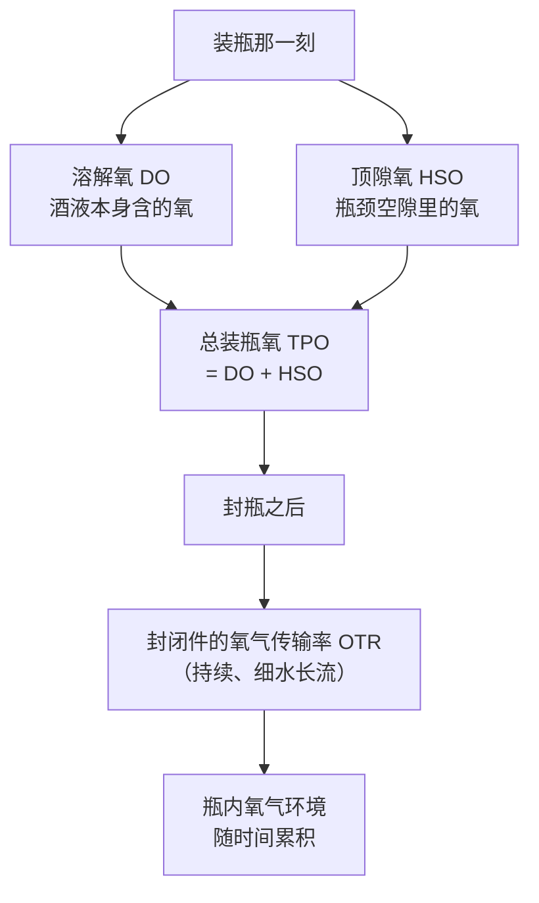
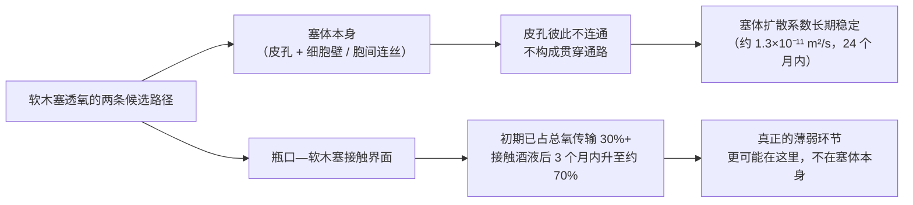
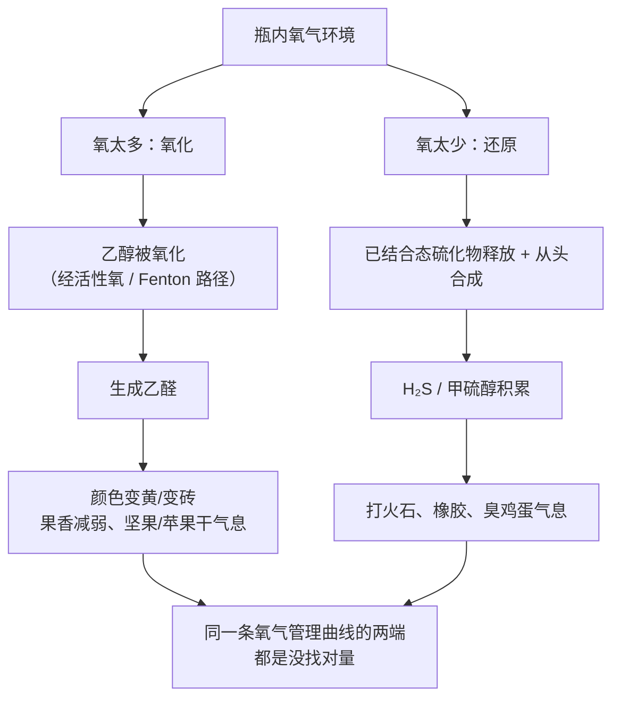
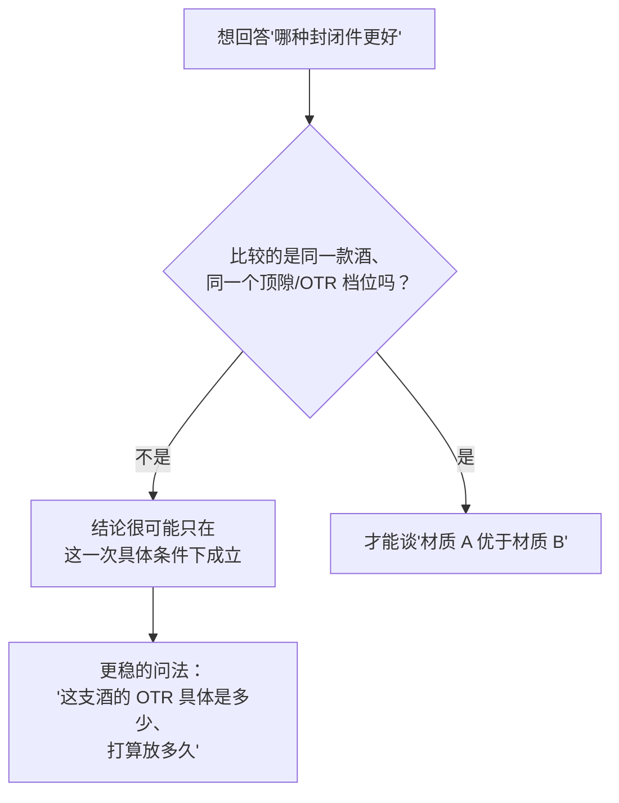
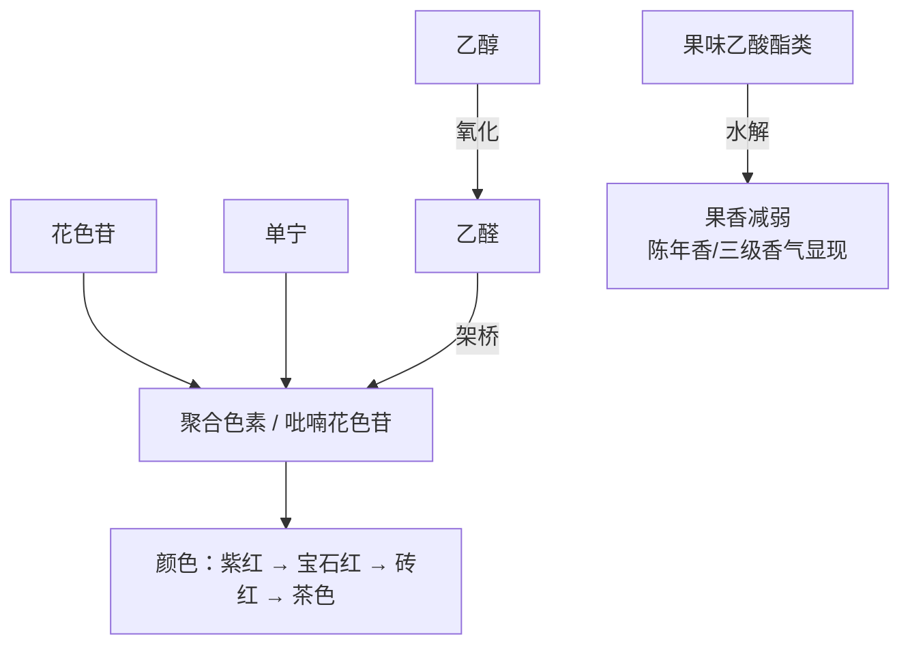

# 第 18 章 装瓶、封瓶与陈年化学

> **本章目标**：把"软木塞 vs 螺旋盖"这场吵了二十多年的争论，拆成几件可以分开核查的事——
> **① 装瓶那一刻封进瓶子里多少氧（一次性的账）；
> ② 封闭件之后每年再漏进多少氧（细水长流的账）；
> ③ 氧太多和氧太少分别会出什么问题；
> ④ 实验室里真做过的对比试验，到底测到了什么。**
>
> 这场争论**话术密度极高**——"软木塞会呼吸""螺旋盖不透气所以不能陈年"
> 这类句子流传很广，但本章会显示：**真正测过的人，很少敢把话说得这么满。**

> **适度饮酒，未成年人不饮酒，酒后不驾车。** 本章 🅐 实操全部不需要开瓶。

## 18.1 装瓶那一刻的账：TPO

装瓶那一刻，瓶子里的氧来自两处：

- **溶解氧（DO）**——酒液本身含的氧；
- **顶隙氧（HSO）**——封口前瓶颈空隙里的氧。

二者之和叫**总装瓶氧**[^1]（TPO = DO + HSO）。这是装瓶**那一刻一次性**封进瓶子的氧，
和封闭件日后持续透过的氧是**两套完全独立的账**——本章接下来会反复用到这个区分。

[^1]: [总装瓶氧 · TPO](../../glossary.md#tpo)（英：total package oxygen）。

澳大利亚葡萄酒研究所（AWRI）给出的行业技术基准（**非法规、非同行评议论文，
是装瓶车间常用的操作基准**）：

| TPO | 评级 |
|-----|------|
| < 1.5 mg/L | 最佳实践 |
| 1.5~2.5 mg/L | 可接受 |
| > 3 mg/L | 需要改进 |
| > 4 mg/L | 不良实践 |

**顶隙氧通常占瓶内总氧的六成以上**——这意味着控制 TPO 最该抓的不是"酒液本身有多少氧"，
而是**封口前有没有把瓶颈那口空气排掉**。现代灌装线用真空或惰性气体（氮气、氩气）冲洗顶隙，
一般能排掉 **60~80 %** 的顶隙氧。

> **这张图要带走的判断**：**"这瓶酒的封闭件好不好"和"装瓶时氧控制得好不好"是两个问题**。
> 一个用最好的封闭件但装瓶车间顶隙排气没做好的酒，起跑线就已经比对手差。

## 18.2 封瓶之后的账：OTR，以及"软木塞会呼吸"是不是真的

封瓶之后，氧气还会持续、缓慢地进入瓶子，这个速率叫**氧气传输率**[^2]（OTR，
通常以 mg O₂/年表示）。

[^2]: [氧气传输率 · OTR](../../glossary.md#otr)（英：oxygen transmission rate）。

### 不同封闭件的 OTR，量级差很多

已核到的多项测定给出的量级（⚠️ **不同研究的测试条件——封闭件尺寸、是否接触酒液、
温度、测试时长——差异很大，不同研究的绝对数值不能直接互相比较**，本书只给量级与排序）：

- 一项追踪 **12 年**、覆盖 7 种封闭件（天然软木塞、3 种微聚合塞、合成塞、2 种螺旋盖）的研究，
  测得 OTR 从 **0.05 到 89.11 mg/年**不等，**最低值是某款螺旋盖，最高值是某支天然软木塞**；
- 一篇综述给出的**长期氧气屏障性能排序：技术塞 > 螺旋盖 > 天然软木塞 > 合成塞**
  （从低透氧到高透氧）；
- 另一项针对天然塞与微聚合塞的研究发现：**封闭件是否接触酒液，比温度从 8 ℃ 升到 40 ℃
  的影响还大**——接触酒液能把透氧量降低约 **5 倍**。

> **这三条合起来说明一件事**：**"软木塞"和"螺旋盖"都不是单一数值，
> 而是跨度很大的两个产品类别**。一款高品质螺旋盖的 OTR 可以远低于一支天然软木塞，
> 反过来也成立。**先问具体 OTR 数值，材质类别本身提供的信息有限。**

### 争议所在：氧到底是怎么穿过软木塞的

软木塞由栓皮栎树皮制成，宏观上有**皮孔**[^3]（直径 200 μm~1 mm 的天然孔道），
微观上细胞之间还有约 100 nm 的胞间连丝通道。

[^3]: [软木塞结构：皮孔与细胞壁](../../glossary.md#cork-lenticel)（英：lenticels / cell walls of cork）。

**"软木塞会持续呼吸、让外界空气慢慢渗进来"**是流传最广的解释之一，但已核到的研究指出：

- **皮孔彼此并不连通**，不能构成贯穿整个塞体的通路；
- 氧究竟主要靠**细胞壁扩散**还是**胞间连丝的分子流（Knudsen 扩散）**穿过塞体，
  **学界至今没有共识**；
- 一项用中子断层扫描与同位素示踪追踪 24 个月的研究发现：**软木塞塞体本身的扩散系数
  长期保持稳定（约 1.3×10⁻¹¹ m²/s），既不受瓶身朝向影响，20 ℃ 下也不受时间影响**；
  真正会变化的是**瓶口与软木塞的接触界面**——
  **装瓶之初该界面已占总氧传输的 30 % 以上**，接触酒液 3 个月内传输量**几乎翻倍**，
  稳定后**占总氧传输近 70 %**。

> **要带走的判断**：**"软木塞会呼吸"这句话把一个比喻当成了机制**。
> 已核到的证据更支持：**软木塞本体相当稳定，氧气的变量主要出在瓶口—塞体这圈接触面上**——
> 这也解释了为什么"瓶子放多久、放哪个朝向"这类外部条件，更可能通过**改变接触面**
> （见下一节）而不是"让塞子变干"来起作用。

**温度对这圈接触面的影响很大**：同一项研究显示，**20 ℃ 下 24 个月内接触面都很稳定**，
但**35 ℃ 下约 9 个月后总扩散系数骤升三个数量级**，**50 ℃ 下 3 个月内已出现明显劣化，
12 个月后扩散系数接近开放大气量级**（相当于实质性漏气）。作者提出的机制是：
**接触面处的密封处理层（石蜡/硅酮涂层）受热部分熔融**，加上软木塞对瓶颈玻璃的
机械把持力随温度下降。

> **这条直接连到后面储存章节（第 41、42 章）**：**怕热比怕朝向更有道理**。

## 18.3 氧太多与氧太少：氧化与还原是同一条轴的两端

瓶内氧气环境走向两个极端，会分别导致两类风味问题——**它们不是两种互相独立的缺陷，
而是同一条"氧气管理曲线"上过犹不及的两端**。

### 氧化那一端：乙醇怎么变成乙醛

一篇 2006 年的综述性论文提出（**作者明确写"意在激发更多研究与讨论"，这是一个假说
而非定论**）：氧本身与有机分子直接反应很弱，真正的氧化剂是通过"**还原阶梯**"
逐步生成的**活性氧物种**；在这个假说里，**催化性的铁**把酒中的过氧化氢转化为
**羟基自由基**，后者氧化性强、选择性低，**几乎能按浓度比例氧化酒中任何成分**，
生成以**醛酮**为主的多种产物——其中最重要的一个是**乙醇被氧化生成的乙醛**[^4]，
带"炖苹果、青果"气息，并且是后续多种陈年化学反应（见 §18.6）的关键中介。

[^4]: [乙醛](../../glossary.md#acetaldehyde)（英：acetaldehyde）。

### 还原那一端：H₂S 与甲硫醇是怎么积累的

**还原型异味**[^5]主要是 H₂S 与甲硫醇（MeSH）在低氧环境下积累造成的
"打火石、橡胶、臭鸡蛋、烂洋葱"气息。

[^5]: [还原型异味](../../glossary.md#reductive-character)（英：reductive off-odor / reduction）。

已核到的两项关键证据，分别回答了"**是不是**"和"**机制部分是什么**"：

- **是不是**：一项让长相思基酒分别在加铜、加谷胱甘肽（或二者组合）的处理下，
  用预先储存于空气或氮气中的合成塞装瓶，再分别存放于空气或氮气环境 6 个月的试验发现：
  **封闭件/环境的氧摄入越低，H₂S 积累越多**——这是"低氧促进还原型硫化物积累"
  最直接的实验证据之一；
- **机制部分是什么**：一项在**严格厌氧、50 ℃、3 周**加速条件下追踪 24 款酒的研究发现：
  **几乎所有酒都含相当比例的"结合态"H₂S 与 MeSH**（平均分别约 93 % 与 47 %），
  厌氧存放会让这部分**结合态释放出来**，同时还有**从头合成**的贡献；
  **红酒与 H₂S 以"释放已有结合态"为主，而白/桃红与 MeSH 以"从头合成"为主**。

⚠️ **这里本书刻意留白**：**具体是哪些结合态（例如与铜形成的络合物）、
在什么条件下释放、释放的精确化学路径**——已核到的文献明确写这部分**仍未完全确定**，
本书把它标注为"机制部分已知、部分仍是研究中的假说"，不当作已解决的定论。

### 一个实用的补救：摇杯能不能去掉轻微的还原气味

一项 2026 年的研究比较了**摇杯 30 秒**及其后**开口放置**对白诗南中 H₂S 与感官的影响，
发现：

- **H₂S 浓度下降主要靠挥发，不是氧化**（H₂S 沸点很低，−60.3 ℃，在无盖容器中挥发很快）；
- **低 H₂S 处理中，摇杯 30 秒就能显著降低"还原"感、提升果香描述词**；
- **高 H₂S/高品种硫醇处理中，单靠摇杯不够**，还需要之后再开口放置一段时间才有改善。

> **要带走的判断**：**轻微的还原气味，摇一摇、放一放，很多时候真的会变好**——
> 这是有机制支持的，不是玄学。**但这不能证明"所有红酒都要醒"**（本书在
> [出处与资料登记](../../standards.md) 里把那条一般性断言继续标为缺乏证据），
> 它只针对**还原型异味**这一种具体的化学问题。

## 18.4 封闭件对比试验：说了什么，也没说什么

"螺旋盖更容易出现还原味"这句话，是不是实验室里测出来的结论？
本书核对了五项**直接对比不同封闭件**的试验，结果并**不完全一致**：

| 研究 | 酒款 | 对比的封闭件 | 时长 | 关于还原/氧化的发现 |
|------|------|------------|------|-------------------|
| Godden 等 2001 | 赛美蓉 | 14 种（螺旋盖、天然塞×2 等级、技术塞×2、合成塞×9）| 20 个月 | **螺旋盖保留 SO₂ 最多、褐变最慢**；游离 SO₂ 低于约 10 mg/L（该酒 pH 3.1）时"氧化"感官得分显著上升；天然塞组出现 TCA 问题，合成塞未见明显"塑料味" |
| Kwiatkowski 等 2007 | 赤霞珠 | 螺旋盖（4/16/64 mL 三档顶隙）、合成塞、天然塞 | 2 年 | **还原气味（"橡胶/打火石"）在顶隙最小（4 mL）的螺旋盖组得分最高**；但 16 mL 螺旋盖、合成塞、天然塞三者**总体相近，只有细微差别** |
| Skouroumounis 等 2005 | 雷司令 + 橡木味霞多丽 | 螺旋盖、天然塞×2、合成塞、玻璃安瓿 | 5 年 | **合成塞组相对氧化、偏褐、SO₂ 偏低**；某一款酒在合成塞下"打火石/橡胶"气味**高于**螺旋盖与玻璃安瓿组；**天然塞组还原问题很小** |
| Cantu 等 2022 | 长相思 | 天然塞、合成塞、螺旋盖 | 30 个月 | **33 项感官描述词里，无一项因封闭件类型出现显著差异**；游离 SO₂ 低至约 5 mg/L 仍足以让受训品评组测不出氧化或还原类描述词 |
| Pons 等 2021 | 长相思 ×3 | OTR 跨度 <0.1~4.6 mg/年的多种封闭件 | 10 年 | **OTR 越高，游离 SO₂ 与品种硫醇下降越多，褐变与 sotolon 上升越多**；**OTR 不超过约 0.3 mg/年**的封闭件在十年尺度上仍能保持品种香、延缓氧化 |

> **把这五行放在一起看，能读出什么？**
>
> 1. **"螺旋盖更容易还原"不是一条稳定的结论**——Kwiatkowski 测到了（且仅在
>    顶隙最小的那一档），Cantu 完全没测到，Skouroumounis 测到的反而是**合成塞**更氧化。
> 2. **酒款、顶隙/OTR 的具体数值、陈年年限**这三个变量在五项研究里各不相同，
>    直接把结论跨研究地搬运（"螺旋盖=还原"）是在**丢弃实验设计只留结论**；
> 3. **唯一跨研究重复出现的变量是"顶隙体积"与"OTR 数值"本身**——
>    这比"封闭件是什么材质"更能预测结果。

> **要带走的判断**：**"哪种封闭件更好"这个问题本身可能问错了**。
> 更该问的是**这支具体酒的氧气管理目标是什么**（快速饮用 vs 长期窖藏），
> **以及这款具体封闭件的 OTR 落在哪个区间**。

## 18.5 木塞味：TCA 的化学与一个有争议的数字

**木塞味**（cork taint）的主要责任分子是 **2,4,6-三氯苯甲醚（TCA）**[^6]，
气味像湿纸板、潮湿地下室，并会**压低**酒本身的果香。

[^6]: [TCA · 2,4,6-三氯苯甲醚](../../glossary.md#tca)。

### 两条形成机制

已核到的综述给出**两条形成路径**：

1. **微生物对 2,4,6-三氯苯酚（TCP）的 O-甲基化**——经"氯酚氧甲基转移酶"，
   能完成这一转化的真菌属**很广泛**（含 *Penicillium*、*Aspergillus*、*Trichoderma*、
   *Fusarium*、*Cladosporium*、*Botrytis* 等二十余属，其中 *Fusarium* 与 *Trichoderma*
   的转化效率更高）；
2. **苯甲醚本身的氯化**——一种亲电取代反应，**只在酸性条件下**发生。

> **为什么饮用水的 TCA 污染几乎只经第①条路径？**
> 因为饮用水通常**不是酸性的**，第②条路径的反应条件不成立。
> 而酒的 pH（约 3.0~4.0）落在酸性区间，**理论上两条路径都有可能**，
> 但已核到的文献仍把**微生物途径**作为更主要、研究得更充分的那一条。

### 感知阈值：一个值得警惕的区间

已核到的综述给出的数字是**转引自更早文献、跨度较宽的区间**：
水中约 **0.03~2 ng/L**、酒中约 **4 ng/L**；另有"人对酒中 TCA 的感知阈值在
**2~10 ng/L**"的表述。⚠️ **本书没有读到这些阈值测定研究的原始方法（介质、人群、
测定条件），只用其量级**——**个位数到十位数 ng/L，远低于大多数香气分子的阈值**，
不把其中任何一个数字当作精确定值。

### 检出率：一个各方立场不同的数字

"多少比例的酒受木塞味影响"这个问题**没有单一公认答案**：
软木塞行业的估计常在 **1~2 %**，其他行业与独立检测的估计常在 **3~7 %**，
不同估计之间的差异与**检测方法、样本来源、是否存在利益相关**都有关系。
⚠️ 本书**不选边站**，只写"存在争议、各方估计不一"，并提醒：
**任何单一来源给出的精确百分比，都值得先问一句"这是谁测的、怎么测的"**。

> **这条呼应了本书第 1 章就定下的纪律**：**查不到一致的数字，就老实写"有争议"**，
> 不要为了显得权威而挑一个看起来合理的数字写死。

## 18.6 瓶子里到底在变什么：陈年化学一览

即使不出现缺陷，**瓶中陈年本身也是一连串缓慢的化学反应**。把前几节的乙醛接上，
就能看到一条贯穿全章的主线：

### 颜色：从紫红到砖红

已核到的综述描述：陈年中**单体花色苷浓度持续下降**，同时生成更多更复杂稳定的色素——
主要是**吡喃花色苷**（如第 12 章提到的 vitisin A/B 一类）与**聚合花色苷色素**
（花色苷与/或单宁**直接缩合**，或**由乙醛架桥**介导缩合）。这些结构变化对应了
**酒色从年轻酒的紫红色，逐渐转向陈年酒的砖红色**。

⚠️ 作者明确提示：**现有很多这类研究用的是模型溶液而非真实酒液**，
要获得这些色素随时间变化的完整图景**仍需更多研究**——本书据此不把具体的
颜色变化时间表当作定值，只写方向。

### 游离 SO₂、酚类与乙醛：一个五年尺度上仍能测到的"封闭件效应"

一项用**三款高单宁红酒**（相同总 SO₂、不同初始游离 SO₂）、
通过封闭件控制氧接触、陈年**五年**的研究发现：
**游离 SO₂ 更低、花色苷与单宁含量更少的酒，生成的乙醛更多**，
且**封闭件造成的差异在五年后依然可测**——
也就是说，**封闭件 OTR 的影响不是开瓶头几个月的短期现象**，
它会在整个陈年周期里持续起作用。这与 §18.4 里 Pons 等人 **10 年**尺度的发现一致。

### 果香的另一面：酯类水解

年轻酒里带来"果味乙酸酯"香气的分子，陈年中会逐渐**水解**，
使最初的鲜果香气减弱，同时让更复杂的陈年香气、三级香气有机会显现出来——
这是"新酒果味冲、老酒更复杂内敛"这种常见描述背后的**一条**机制
（不是唯一机制，颜色与酚类的变化同时也在发生）。

## 18.7 常见说法辨析

按本书约定标注**证据强度**：✅ 有共识 / ⚠️ 有争议 / ❌ 明确错误 / 缺乏证据。

| 说法 | 判定 | 说明 |
|------|------|------|
| "软木塞会呼吸，让外界空气慢慢渗进来，这样酒才会越陈越好" | ⚠️ **机制被部分推翻** | 已核到的研究显示**软木塞塞体本身的扩散系数长期稳定**，真正会变化、会随时间上升的是**瓶口—塞体的接触界面**（装瓶之初已占总氧传输 30% 以上，接触酒液后升至约 70%）。"持续呼吸外界空气"这个比喻**把界面效应错安在了塞体本身**上 |
| "螺旋盖密封太好、不透气，所以装瓶的酒不会陈年" | ❌ **明确错误** | 已核的 OTR 数据显示螺旋盖 OTR 可低至约 0.05 mg/年但并非绝对零；10 年追踪显示**合适 OTR 范围内（不超过约 0.3 mg/年）的封闭件仍能让酒保留品种香、延缓氧化**——螺旋盖酒照样会陈年，只是氧气积累的速率更可控、更可预测 |
| "螺旋盖比软木塞更容易出现还原味" | ⚠️ **有争议，依赖具体条件** | 五项已核对比试验结论不一：Kwiatkowski (2007) 在**顶隙最小**的螺旋盖组测到最高还原得分；Cantu (2022) **三种封闭件均未检出**显著还原差异；Skouroumounis (2005) 反而是**合成塞**更氧化。更稳的结论是**顶隙体积/OTR 数值**比"封闭件材质类别"本身更能预测结果 |
| "低氧会促进还原型硫化物（H₂S/甲硫醇）积累" | ✅ **机制层面有共识** | 已核到的实验直接证明：**封闭件/环境氧摄入越低，H₂S 积累越多**；但**完整的化学释放路径**（已结合态释放 vs 从头合成的具体比例）仍有不确定之处，本书把它标为"机制部分已知、部分仍是假说" |
| "闻到一次木塞味，说明这批酒全完了" | ❌ **明确错误** | TCA 污染**高度局部化**——同一批软木塞、甚至同一块树皮来源的不同塞子，TCA 含量可以差很多；同一箱酒里一瓶有问题、另一瓶完全正常是常见情形 |
| "酒要卧放，软木塞才不会干裂漏气" | ❌ **明确错误** | 瓶内顶隙的湿度常年接近 100 %，只要瓶里有酒，塞子就不会"干"；两项独立研究（Skouroumounis 2005 的五年追踪、Chanut 等 2023 的机理研究）都显示**直立与卧放之间，成分、感官与扩散系数均无可测差异** |
| "螺旋盖是工业化偷工减料，不配用在好酒上" | ⚠️ **价值判断，非科学问题** | 新西兰、澳大利亚等产区已大规模在高端酒款上使用螺旋盖；科学测量上螺旋盖并不必然劣于软木塞。行业选择更多反映**传统、品牌形象与具体酒款的陈年策略**，不是单纯的质量排序 |
| "TCA 闻起来像湿纸板，我自己就能百分百判断有没有污染" | ⚠️ **有争议** | 感知阈值个体差异很大（参照第 2 章的嗅觉个体差异纪律），轻度污染可能只是**压低了果香**而不表现为明显的"湿纸板"味，未经训练的判断并不可靠 |
| "白葡萄酒的'未成熟氧化'（premox）病因已经清楚，就是软木塞的问题" | ⚠️ **缺乏共识** | 专业媒体与学界提出过软木塞质量、谷胱甘肽不足、现代种植方式改变氮素平衡等**多个假说**，但至今**没有单一公认病因**，且同一批酒瓶间差异很大，使单一因素的解释很难立住 |
| "乙醛是葡萄酒里不好的东西，出现就是缺陷" | ❌ **明确错误** | 乙醛是陈年化学里的**枢纽分子**：适量时是聚合色素形成的必要中介（让单宁变柔和、颜色更稳定），过量时才成为缺陷（"炖苹果"气息过重）；在雪莉 Fino 等加强酒风格里，它本身就是关键的**风格特征分子**（第 17 章已核） |

## 18.8 思考题

1. 用 TPO 与 OTR 两个概念，解释"装瓶时氧多不多"和"封闭件好不好"为什么是两件不同的事。
   把它们混为一谈会导致什么样的错误结论？
2. Chanut 等 (2023) 发现瓶口—软木塞接触界面占总氧传输的比例会随时间上升
   （从 30% 以上升到约 70%），而塞体本身的扩散系数长期稳定。
   如果你是封闭件工程师，这个发现会让你把改进重点放在哪里？
3. **【案例】** 某侍酒师说："这瓶酒是螺旋盖，肯定不耐放，买了尽快喝。"
   请结合 Pons 等 (2021) 的十年追踪结果，判断这句话对不对，并给出更准确的表述。
4. Ugliano 等 (2011) 与 Franco-Luesma & Ferreira (2016) 分别从什么角度
   支持"低氧促进还原型硫化物积累"这个结论？这两项证据，一个回答的是"是不是"，
   另一个回答的是"机制部分是什么"——请分别说明。
5. 为什么本书说"氧化"与"还原"是同一条氧气管理曲线的两端，而不是两种互不相干的缺陷？
   请用乙醛和 H₂S 两个分子分别举例说明机制上的对称之处。
6. **【查证】** 找一款你能查到产品资料的螺旋盖酒（例如用了 Stelvin 一类商业封闭件），
   看厂商有没有公开标注其 OTR 或"氧气等级"分类。如果能找到，记下数值，
   对照本章 §18.4 的量级，判断它更像是为"长期窖藏"还是"尽快饮用"设计的。
7. Kwiatkowski 等 (2007)、Skouroumounis 等 (2005) 与 Cantu 等 (2022)
   三项封闭件对比试验的结论并不完全一致。请指出它们在"用的什么酒""顶隙/OTR 具体是多少"
   "陈年多久"这三个变量上的差异，并说明为什么"哪种封闭件更好"这个问题本身可能问错了。
8. TCA 的两条形成机制中，为什么"饮用水污染几乎只经微生物 O-甲基化这条路径"，
   而不是苯甲醚氯化那条？
9. **【案例】** 促销文案写道：*"本款选用进口软木塞，让酒在瓶中持续呼吸、越陈越香；
   另一款走性价比路线用了螺旋盖，适合尽快喝完。"* 请逐句判断，指出各自踩中本章哪个知识点。

> 📖 **参考答案**（想清楚再看）：[Q1](../../qa/18-bottling-closures-aging-qa.md#q1) ·
> [Q2](../../qa/18-bottling-closures-aging-qa.md#q2) ·
> [Q3](../../qa/18-bottling-closures-aging-qa.md#q3) ·
> [Q4](../../qa/18-bottling-closures-aging-qa.md#q4) ·
> [Q5](../../qa/18-bottling-closures-aging-qa.md#q5) ·
> [Q6](../../qa/18-bottling-closures-aging-qa.md#q6) ·
> [Q7](../../qa/18-bottling-closures-aging-qa.md#q7) ·
> [Q8](../../qa/18-bottling-closures-aging-qa.md#q8) ·
> [Q9](../../qa/18-bottling-closures-aging-qa.md#q9)

## 18.9 本章实操

🅐 档**全部不需要开瓶喝酒**。

### 🅐 无器具版 · 任务一：给自己手上的酒做一次"封闭件档案"

找你近期买过、或者家里现有的 **3~5 款**酒（不用开瓶），记录：

| # | 封闭件类型（螺旋盖/天然软木塞/合成塞/其他）| 酒标或官网有没有标注 OTR / 氧气等级 | 这款酒的定位（尽快饮用 / 适度陈年 / 长期窖藏）| 封闭件与定位是否匹配 |
|---|--------------------------------------|----------------------------------|----------------------------------|-------------------|
| 1 | | | | |
| … | | | | |

**完成后回答**：有没有哪一款的封闭件信息完全查不到？如果查不到，
你觉得这件事本身说明了什么？

### 🅐 无器具版 · 任务二：算一次 TPO，判断落在哪个档位

用 AWRI 的基准表（§18.1），给定以下三组 DO + HSO，算出 TPO 并判断档位：

| DO（mg/L）| HSO（mg/L）| TPO | 档位 |
|-----------|-----------|-----|------|
| 0.3 | 0.8 | | |
| 0.6 | 1.6 | | |
| 1.2 | 2.5 | | |

**完成后回答**：为什么"把顶隙氧排掉 60~80 %"这个操作，
比"把酒液里的溶解氧降到更低"往往更有性价比？

### 🅐 无器具版 · 任务三：拆解五项封闭件对比试验的设计差异

回到 §18.4 的表格，自己重新画一张表，只填三列：**酒款、顶隙/OTR 的具体数值、陈年年限**。

**完成后回答**：如果有人只告诉你"螺旋盖容易还原"这个结论，不告诉你是哪项研究、
什么条件测出来的，你会怎么追问？

### 🅑 有条件版 · 任务四：一支螺旋盖与一支软木塞的对照盲评（备齐后再做）

**所需**：风格尽量接近的两款酒，一支螺旋盖、一支天然软木塞封闭，
[品鉴记录表](../../forms/tasting-note.md)两份。

**适度饮酒，未成年人不饮酒，酒后不驾车。**

| 观察项 | 螺旋盖款 | 软木塞款 |
|-------|---------|---------|
| 开瓶时"打火石/橡胶/臭鸡蛋"气息，强度 1~5 | | |
| 开瓶时"坚果/苹果干/氧化"气息，强度 1~5 | | |
| 颜色（色调+深浅+边缘，文字描述）| | |
| 摇杯 30 秒后，还原类气息有没有变化？| | |
| 开瓶 30 分钟后，上述两类气息分别有没有变化？| | |

**如果某一支出现明显的还原类气息**，按 §18.3 的方法，摇杯 30 秒，
隔几分钟再闻一次，对照 Lesković 等 (2026) 的结论——**低浓度下这个动作通常有效，
高浓度下可能需要再多放一会儿**。记录你观察到的实际效果。

## 18.10 🔎 买酒与点酒时的用处

1. **封闭件材质本身不能告诉你答案，先问想要的陈年策略。**
   想尽快喝就不必纠结材质；想长期窖藏，优先找愿意公开 OTR 数据的产品，
   而不是单纯按"软木塞=能陈年、螺旋盖=不能陈年"分类——这个二分法已被证据推翻。
2. **闻到轻微的"打火石/橡胶"气息，先别急着下结论是缺陷。**
   摇杯 30 秒、隔几分钟再闻——如果明显改善，大概率是轻度还原而不是不可逆的问题；
   但浓度高时单靠摇杯可能不够。
3. **木塞味（闻起来像湿纸板、把果香压住了）是可以合理退换的缺陷**，
   不是"这支酒本来的风格"——它和轻微还原气味是两件完全不同的事，不要混淆处理。
4. **"软木塞=高端，螺旋盖=便宜"是行业传统与定价观感，不是科学结论。**
   新西兰、澳大利亚的顶级酒款大量使用螺旋盖，这件事本身就是最好的反例。
5. **存酒不必纠结"一定要卧放"**——机制证据已经把"防止塞子变干"这条理由排除了；
   真正关键的是**温度**（见第 41、42 章），避免长期处于高温环境。
6. **同一箱酒出现"一瓶有木塞味、其他都正常"是常见情形**，不代表整批酒都有问题；
   也不代表"这个牌子的软木塞不行"。

## 18.11 本章依据

### A. 已核对的同行评议文献与行业技术资料

- **封闭件对比试验（本章主干来源之一）**：
  - Godden 等 (2001)，*Aust. J. Grape Wine Res.* 7，DOI 10.1111/j.1755-0238.2001.tb00196.x：
    赛美蓉、14 种封闭件、20 个月；**螺旋盖 SO₂ 保留最好、褐变最慢**；
    **游离 SO₂ 临界值约 10 mg/L**（该酒 pH 3.1）；天然塞组出现 TCA 问题。
  - Kwiatkowski 等 (2007)，*Aust. J. Grape Wine Res.* 13，
    DOI 10.1111/j.1755-0238.2007.tb00238.x：赤霞珠，螺旋盖三档顶隙（4/16/64 mL）
    对比合成塞、天然塞，2 年；**还原气味得分在最小顶隙螺旋盖组最高**。
  - Skouroumounis 等 (2005)，*Aust. J. Grape Wine Res.* 11，
    DOI 10.1111/j.1755-0238.2005.tb00036.x：雷司令+橡木味霞多丽，5 年，
    另设直立/卧放对照；**合成塞组最氧化**；**朝向对成分与感官影响可忽略**。
  - Cantu 等 (2022)，*Molecules* 27，DOI 10.3390/molecules27185881：长相思，
    天然塞/合成塞/螺旋盖，30 个月；**33 项感官描述词均无显著的封闭件间差异**。
  - Pons 等 (2021)，*J. Agric. Food Chem.* 69，DOI 10.1021/acs.jafc.1c02635：
    长相思，OTR 跨度 <0.1~4.6 mg/年，**10 年**；**OTR 不超过约 0.3 mg/年的封闭件
    延缓氧化、保留品种硫醇**。
- **氧传输机制**：
  - Chanut 等 (2023)，*PNAS Nexus* 2，DOI 10.1093/pnasnexus/pgad344：
    **瓶口—软木塞接触界面占总氧传输 30%~70%**，**塞体本身扩散系数长期稳定**，
    **朝向无可测差异**，**高温（35/50 ℃）会显著加速界面劣化**。
  - Lopes 等 (2007)，*J. Agric. Food Chem.* 55，DOI 10.1021/jf0706023：
    天然塞的氧释放呈"头 12 个月持续但缓慢、此后很少"的两段式；
    合成塞的透氧更像持续渗透，**主要发生在装瓶一个月之后**。
  - Lopes Cardoso 等 (2022)，*J. Food Eng.* 331，DOI 10.1016/j.jfoodeng.2022.111105：
    **接触酒液可使透氧量降低约 5 倍**，影响比温度从 8 升到 40 ℃ 更大。
  - Crouvisier-Urion 等 (2018)，*Trends Food Sci. Technol.* 78，
    DOI 10.1016/j.tifs.2018.05.021：综述给出屏障性能排序
    **技术塞 > 螺旋盖 > 天然软木塞 > 合成塞**，并指出跨研究数值不可直接比较。
- **还原型异味的化学**：
  - Franco-Luesma & Ferreira (2016)，*Food Chem.* 199，
    DOI 10.1016/j.foodchem.2015.11.111：24 款酒、严格厌氧、50 ℃、3 周；
    **结合态 H₂S 平均 93%、MeSH 平均 47%**；**释放与从头合成都有贡献**，
    **红酒/H₂S 以释放为主，白桃红/MeSH 以从头合成为主**。
  - Ugliano 等 (2011)，*J. Agric. Food Chem.* 59，DOI 10.1021/jf1043585：
    长相思，铜/谷胱甘肽处理，封闭件与环境氧摄入对照，6 个月；
    **氧摄入越低，H₂S 积累越多**。
  - Lesković 等 (2026)，*OENO One* 60(1)，DOI 10.20870/oeno-one.2026.60.1.9616：
    **摇杯 30 秒使 H₂S 经挥发（非氧化）而下降**，低浓度下显著改善还原感，
    高浓度下需配合开口放置。
- **TCA 木塞味**：Zhou 等 (2024)，*Food Innov. Adv.* 3，DOI 10.48130/fia-0024-0011：
  **两条形成机制**（微生物 O-甲基化为主、苯甲醚氯化需酸性条件）；
  **感知阈值区间（转引，水中 0.03~2 ng/L，酒中约 4~10 ng/L）**；
  **检出率各方估计不一（1~7% 区间）**。
- **氧化与陈年化学机制**：
  - Waterhouse & Laurie (2006)，*Am. J. Enol. Vitic.* 57，
    DOI 10.5344/ajev.2006.57.3.306：**Fenton 反应/羟基自由基假说**，
    乙醇氧化生成乙醛；作者明确标注这是**假说**，意在推动讨论。
  - He 等 (2012)，*Molecules* 17，DOI 10.3390/molecules17021483：
    **单体花色苷下降、聚合色素与吡喃花色苷上升**，对应颜色从紫红到砖红的演变；
    提示现有研究**多用模型溶液**。
  - Gambuti 等 (2020)，*OENO One* 54，DOI 10.20870/oeno-one.2020.54.3.3527：
    三款高单宁红酒、五年陈年；**游离 SO₂/酚类更低的酒生成更多乙醛**，
    **封闭件效应五年后仍可测**。
- **行业技术基准**：AWRI "Understanding total package oxygen"
  （技术说明页面，非同行评议）：**TPO 基准档位、顶隙氧占比与排气效率**。

### B. 本章有意留白的地方

- **TCA 感知阈值的精确数字**：读到的综述给出的是**转引自更早文献**、跨度较宽的区间，
  本书未读到原始阈值测定研究（介质、人群、方法均未核）→ 只写量级，不写单一精确数字。
- **TCA 实际检出率**：各方估计差异很大且本书未核到方法统一的原始研究 →
  只写"存在争议"，不给单一数字当定论。
- **软木塞透氧的微观机制**（Knudsen 扩散 vs 细胞壁扩散）：本书只读到"学界尚无共识"
  这一层表述，具体机制论文未逐篇核对 → 不裁决具体机制。
- **还原型硫化物积累的完整化学路径**（已结合态释放的具体机制）：
  已核到的文献明确写"尚未确定" → 标注为"部分已知、部分是假说"，不写成定论。
- **封闭件类型与"还原 vs 氧化"孰优孰劣的总体定论**：已核到的多项试验结论不一致 →
  不裁决"哪种封闭件总体更好"，只写"氧气管理的具体数值比材质本身更能预测结果"。
- **白葡萄酒"未成熟氧化"（premox）的病因**：本书只读到"存在这个现象、
  提出过多种假说、没有单一公认病因"这一层（来源为专业媒体报道，非同行评议论文）→
  不裁决具体病因，只作为"氧化陈年机制仍有未解之处"的简短例子。
- **全球封闭件市场份额的精确数字**：各行业报告口径、年份差异很大，互相矛盾 →
  正文只写方向性观察（新西兰/澳大利亚螺旋盖采用率很高），不写死单一百分比。

以上每一条的完整题录、DOI 与核对状态，见[出处与资料登记](../../standards.md)。

---

**下一站**：第三部分到此结束，下一步是本部分的实战项目——
**🛠 项目 P2：从一支酒反推它的酿造决策**，把第 12~18 章串成一次完整的推理练习。
之后进入**第四部分：世界产区谱系与酒标法规**，从第 19 章"原产地制度的逻辑"开始。
