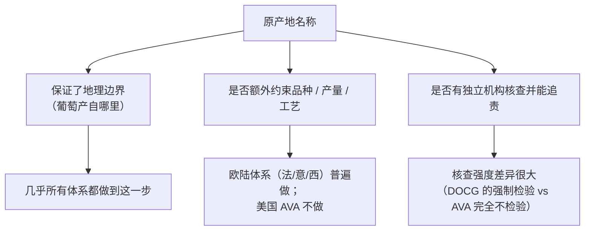

# 第四部分导读 · 世界产区谱系与酒标法规

> **前三部分回答的是"酒里有什么、为什么会这样"，这一部分回答"名字背后承诺了什么"。**
> 产区名称不是要背的地名表——**它是"气候 + 品种 + 法规"打包在一起的一个标签**，
> 学会读它，就是把前面三部分的机理**挂到具体的名字上**。

## 为什么先学"原产地制度的逻辑"再学具体产区

因为**各国名称体系用的词完全不同（AOC、DOCG、DO、AVA……），
但它们都在回答同一个问题：谁，向谁，保证了什么？**

先把这个共同问题拆清楚，再去看法国、意大利、西班牙、美国各自的具体答案，
会比反过来——先死记一堆缩写再回头拼凑逻辑——轻松得多。
第 19 章就做这件"拆共同问题"的工作，后面第 20~27 章才是逐个产区的具体档案。

## 这一部分要建立的核心框架

第 19 章会反复用这张图去拆解每一个具体体系：**先问它保证了什么，
再问它不保证什么**——后者往往比前者更有信息量。

## 当前进度

- 🔜 第 19 章 [原产地制度的逻辑](19-origin-system-logic.md)
- ⬜ 第 20 章 怎么读一张酒标
- ⬜ 第 21 章 法国 ①：波尔多与勃艮第
- ⬜ 第 22 章 法国 ②：罗讷、卢瓦尔、阿尔萨斯、香槟、南法
- ⬜ 第 23 章 意大利：DOC/DOCG 与本土品种
- ⬜ 第 24 章 西班牙与葡萄牙
- ⬜ 第 25 章 德国、奥地利与中东欧
- ⬜ 第 26 章 新世界 ①：美国、智利、阿根廷
- ⬜ 第 27 章 新世界 ②：澳洲、新西兰、南非与中国
- ⬜ 🛠 项目 P3：做一个产区的深度档案

完整大纲见[学习路线图](../../roadmap.md)。

> **适度饮酒，未成年人不饮酒，酒后不驾车。** 本部分各章的 🅐 实操依然不需要开瓶。
