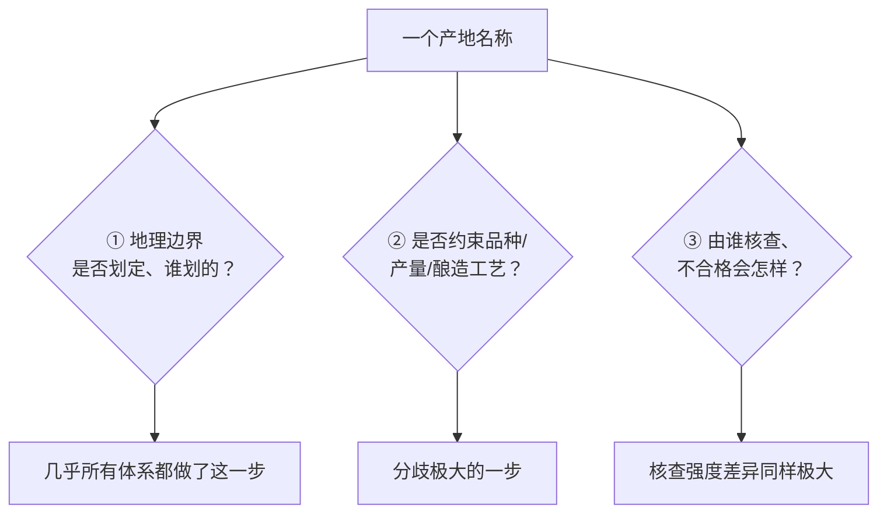
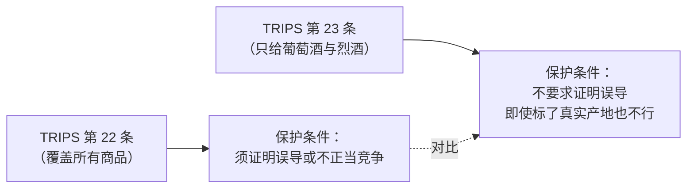
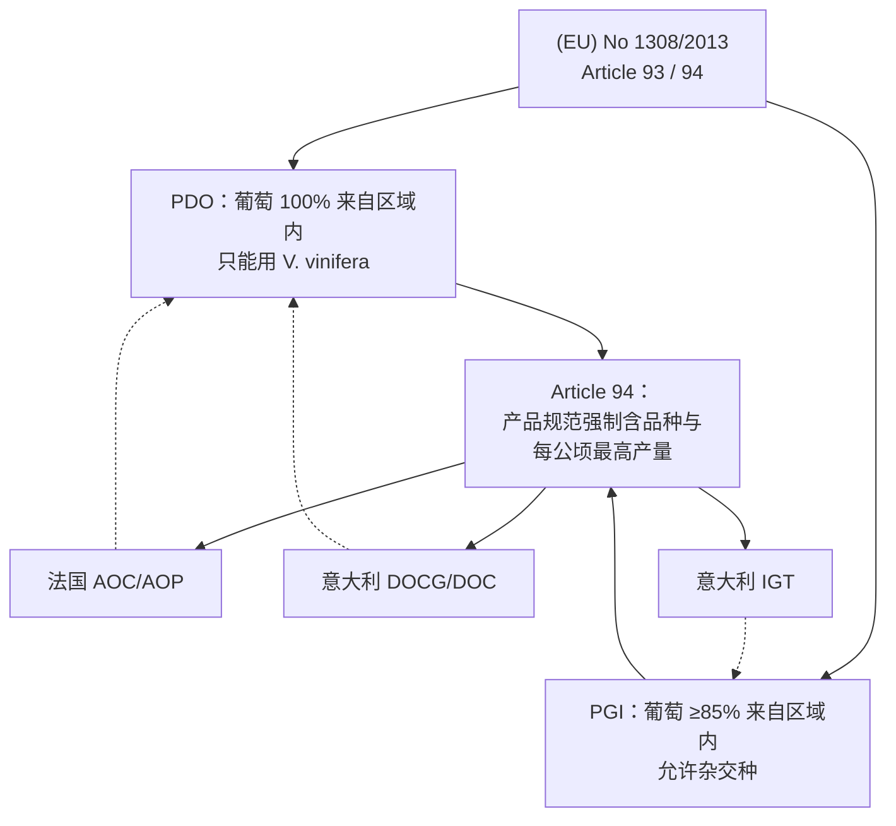
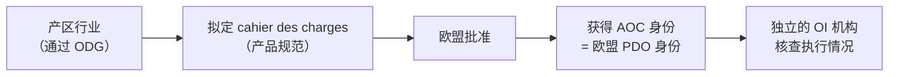
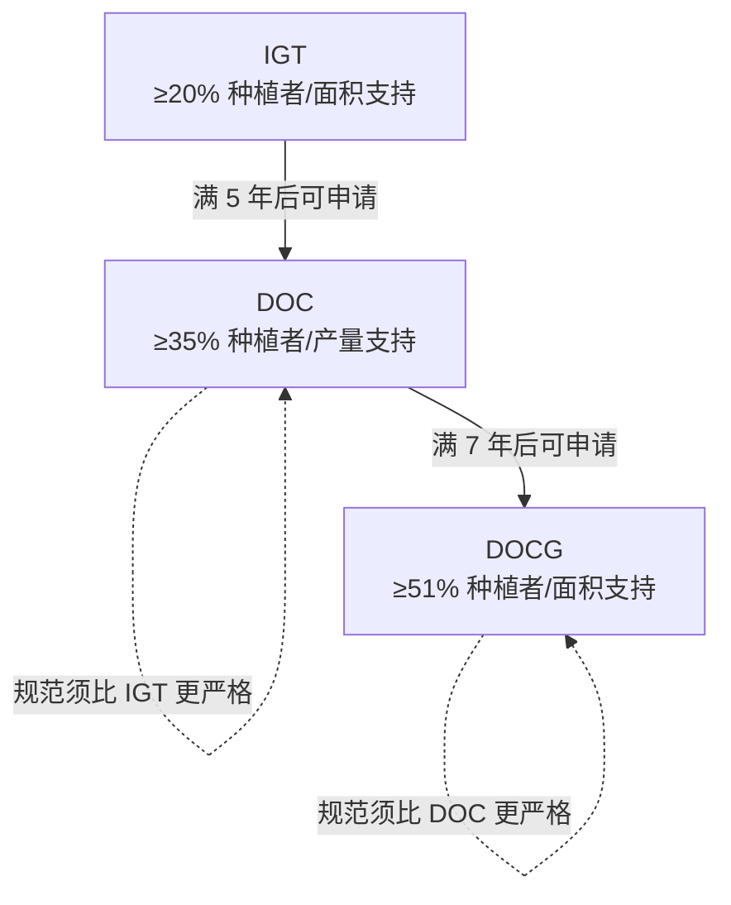
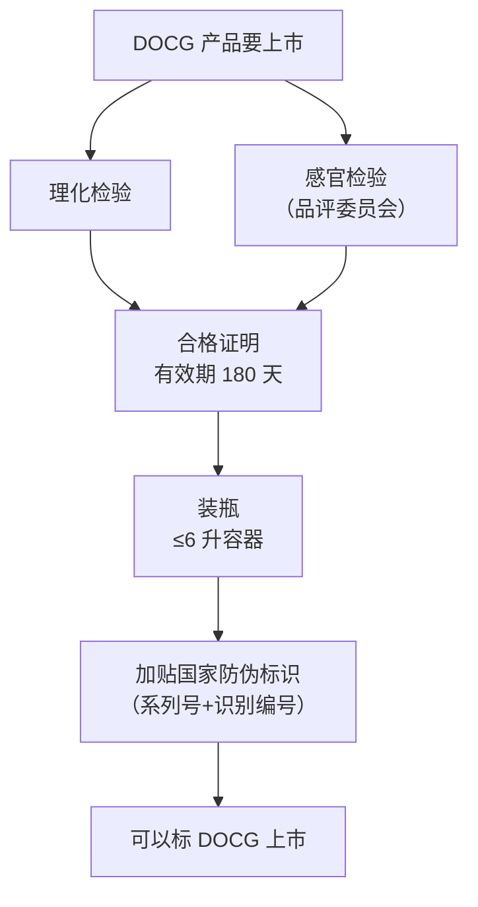
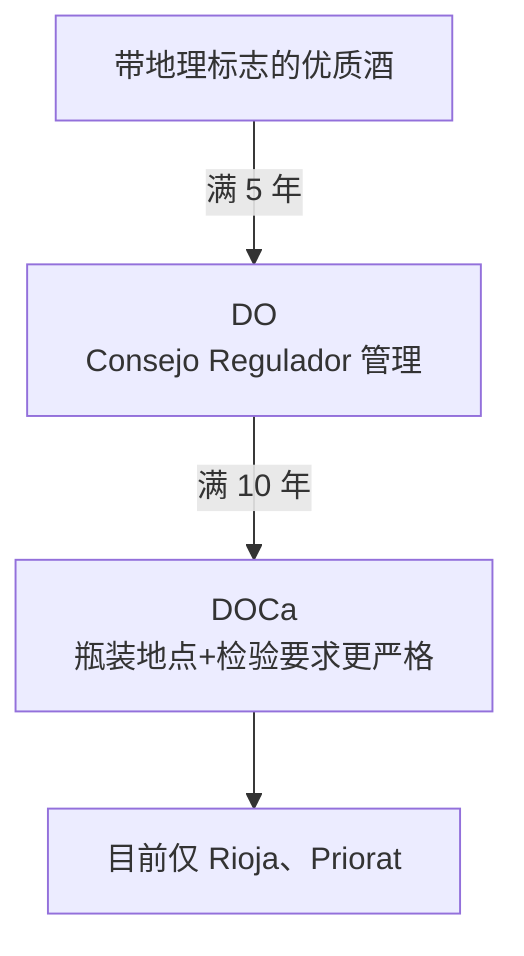
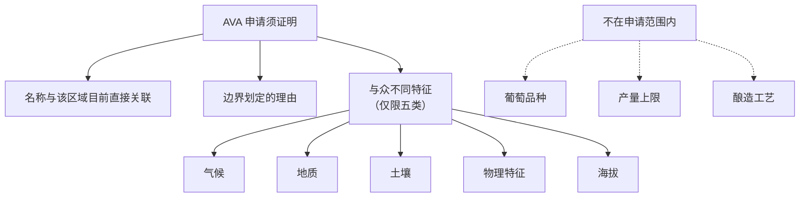
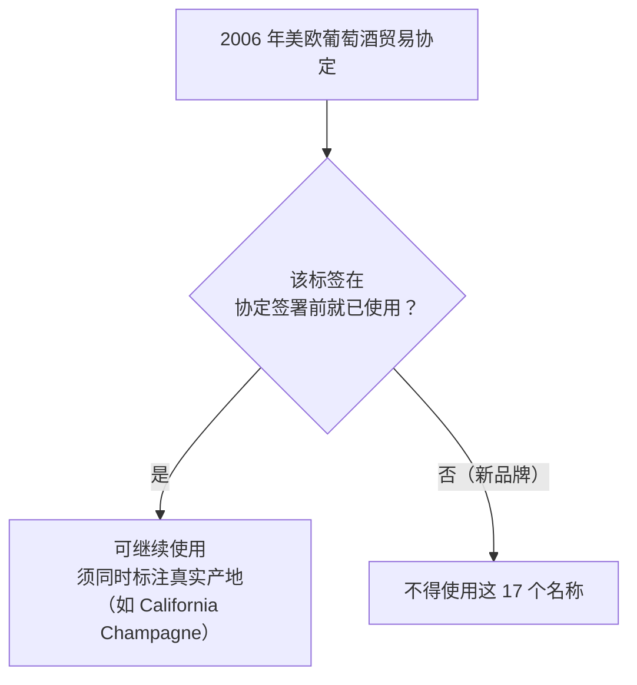

# 第 19 章 原产地制度的逻辑：PDO/PGI、AOC、DOCG、DO、AVA

> **本章目标**：法国 AOC、意大利 DOCG/DOC/IGT、西班牙 DO/DOCa、美国 AVA——
> 这些缩写看起来像需要死记的地名体系，但它们**都在回答同一个问题**：
> **一个产地名称，向消费者保证了什么？谁来核查？核查不过会怎样？**
>
> 本章会显示：**各国体系在"地理边界"上几乎都做到了，但在"是否约束品种/产量/工艺"
> 与"核查强度"这两件事上，分歧极大**——美国 AVA 几乎完全不管后两件事，
> 意大利 DOCG 则把它们做到了"强制检验+国家防伪标识"的程度。

> **适度饮酒，未成年人不饮酒，酒后不驾车。** 本章 🅐 实操全部不需要开瓶。

## 19.1 先问一个共同的问题

把前三部分学到的东西收个尾：一瓶酒的成分（第一部分）由品种与风土决定（第二部分），
再被工艺改造（第三部分）。**产地名称**是把这一整条链路**浓缩成一个词**的尝试。

但"浓缩成一个词"可以做得很松，也可以做得很紧。本章用一个共同的框架去衡量每种体系：

**先说结论，后面逐条给证据**：

| 体系 | ①地理边界 | ②品种/产量/工艺约束 | ③核查强度 |
|------|---------|-------------------|-----------|
| 欧盟 PDO | 有，且**生产须在区域内完成** | **强制**（品种、每公顷最高产量写入产品规范）| 独立核查机构，依产品规范逐项核查 |
| 欧盟 PGI | 有，但门槛更松（≥85% 来自该区域）| 同样要求产品规范列出品种等信息，但约束力度通常弱于 PDO | 同上，但常见约束更少 |
| 法国 AOC | 有（法国国家级认定，是产品升级为 PDO 的前置步骤）| cahier des charges 规定品种/产量/最低酒精度等 | ODG 拟定规范，独立 OI 机构核查 |
| 意大利 DOCG | 有 | **强制**，且法律要求比来源 DOC **更严格** | **强制理化+感官双重检验**，国家防伪标识，180 天有效期 |
| 意大利 DOC | 有 | 强制，但比 DOCG 宽松 | 理化+感官检验（视年产量决定抽检/全检），2 年有效期 |
| 意大利 IGT | 有 | 约束最少 | 理化检验（抽样为主）|
| 西班牙 DO | 有 | 由 Consejo Regulador 规定 | Consejo Regulador 管理，须先满足"优质酒"身份满 5 年 |
| 西班牙 DOCa | 有，且要求更细（地块须逐市镇制图）| 比 DO 更严格 | 瓶装地点、理化感官双重检验均更严格 |
| **美国 AVA** | **有，但只有地理边界** | **完全没有**（申请文件明确限定为气候/地质/土壤/物理特征/海拔五类）| 无感官或理化强制检验；只核查标签上 85% 来源比例 |

> **这张表最该记住的一行是美国 AVA 那一行**：
> **它是本章里唯一一个"只做①、完全不做②③"的体系。**

## 19.2 国际底线：TRIPS 与 OIV 怎么定义这件事

在各国自己的体系之上，还有两层国际共识先把"地理标志"这件事的下限钉住。

### WTO TRIPS：两级保护，葡萄酒拿到的是更高那一级

**TRIPS 第 22.1 条**给出覆盖所有商品的基础定义（**已核对 WTO 官方法律文本**）：

> 地理标志是标示某商品产自某成员方境内（或该境内某地区/地方）的标志，
> 且该商品的**某种品质、声誉或其他特征本质上可归因于其地理来源**。

**第 22.2~22.4 条**的基础保护，要求能够**阻止误导公众或构成不正当竞争的使用**——
注意这里有一个隐含条件：**要证明有人被误导或存在不正当竞争**。

**第 23.1 条**单独给葡萄酒与烈酒**更高的保护**：

> 即使已标明真实产地，或该地理标志被翻译使用，或搭配"风格""仿""type"等措辞，
> **仍不得使用**该地理标志标示非产自该地的葡萄酒/烈酒。

> **为什么葡萄酒与烈酒单独拿到更高保护？**
> 这是 TRIPS 谈判史上的既定结果（条文本身没有写理由），
> **本书不替条文编一个"为什么"**——只报告条文本身的差异：
> **普通商品的地理标志要证明消费者被骗才能管，葡萄酒和烈酒的地理标志不需要**。

### OIV：GI 与 AO 两个概念的区分

OIV 在 2021 年用新决议（**OIV-ECO 656-2021**）更新了**地理标志（GI）**与
**原产地名称（AO，appellation of origin）**两个定义，取代 1992 年的旧决议，
目的是与 TRIPS（1994）和《里斯本协定日内瓦文本》（2015）的国际用法对齐。

| 概念 | 定义要点 | 对葡萄酒的具体门槛 |
|------|---------|------------------|
| **GI**（地理标志）| 品质/声誉/特征"**本质上可归因于**"地理来源 | 本书读到的表述：**至少 85% 的葡萄采收自该地理区域** |
| **AO**（原产地名称）| 门槛更高——名称须由/含该地名，品质须"**完全或主要由该地理环境（含自然与人文因素）所致**" | 本书未核到统一的量化门槛 |

> **AO 比 GI 门槛更高这件事，可以用来理解"为什么同一个国家会有两级体系"**：
> 法国的 **AOC**（而非更松的 IGP）、意大利的 **DOC/DOCG**（而非更松的 IGT），
> 在概念谱系上更接近"原产地名称"而非普通"地理标志"。

## 19.3 欧盟内部：PDO 与 PGI 是地基，各国传统名称挂在上面

**(EU) No 1308/2013 Article 93**（第 6、9 章已核对原文）把欧盟统一的两级地理标志
框架定死了：

| | PDO | PGI |
|---|-----|-----|
| **葡萄来源** | **完全来自**划定区域 | **至少 85%** 来自该区域 |
| **生产地点** | **须在该区域内完成** | 同上 |
| **允许品种** | 只能用 ***Vitis vinifera*** | *Vitis vinifera* 或其与葡萄属其他种的杂交种 |
| **与地理来源的关系** | 品质与特征"**本质上或完全归因于**"特定地理环境 | 具有"**可归因于**该地理来源"的特定品质、声誉或其他特征 |

**Article 94** 规定产品规范（无论哪一级）至少须含**九项内容**，其中
**(e) 每公顷最高产量**与**(f) 品种**是**强制项**——这正是第 19.1 节表格里
"欧盟体系②强制约束品种/产量"结论的直接法律依据。

**各成员国的传统专用名称**在这个框架下**各自对应一级**，不是另起炉灶：
法国用 **AOC** 这个国家级名称表达 PDO 身份（且是"产品升级为欧盟 PDO 之前的
强制性国家认定阶段"），意大利用 **DOCG/DOC** 表达 PDO、用 **IGT** 表达 PGI。

### 欧盟的官方登记库：eAmbrosia

欧盟把所有注册在案的 PDO/PGI 名称集中放在官方数据库 **eAmbrosia**
（2019 年上线，整合了此前分散的三个数据库）。本书读到的数量级
（⚠️ 经检索引擎复述欧盟委员会新闻稿，**未直接核对数据库页面**，仅供理解规模）：
截至 2023 年年中，注册的**葡萄酒 PDO 约 1185 个、葡萄酒 PGI 约 446 个**。
这个数字会持续变化，**本书只用它说明"这是一个数量级很大、持续运作的注册体系"**，
不当作固定值引用。

## 19.4 法国：AOC 是一张由行业自己拟、国家与欧盟批准的"合同"

法国的国家级产地认定机构是 **INAO**（Institut national de l'origine et de la qualité）。
已核到的 INAO 官网表述给出了这套体系最值得记住的一点：

> **AOC 是产品在欧盟层面注册为 PDO 之前的强制性国家认定阶段。**

也就是说，**AOC 不是与 PDO 平行的另一套体系，而是 PDO 的"法国语境下的名字+
申请必经的国家关卡"**。

**cahier des charges 由谁写、谁核查，这条分工本身是本章的一个重点**：
每个产区的产品规范**由行业自己拟定**（通过 **ODG**，Organisme de Défense et de
Gestion），**经欧盟批准**；执行层面的核查则交给**独立的 OI**（Organisme
d'Inspection）机构——**制定规则的人和核查规则的人是分开的两拨人**。

INAO 官网明确写：产品规范规定**品种、最高产量、最低自然酒精度等**。
⚠️ **本书未核对任一具体产区的 cahier des charges 原文**，所以这里只能停在
"规范里写这几类东西"这一层，**不编造任何具体产区的数字**——
第 21、22 章处理波尔多、勃艮第等具体产区时，会逐一去查这些数字。

## 19.5 意大利：一套用"时间+支持率"晋级的三级体系

意大利现行法律依据是 **Legge 12 dicembre 2016, n. 238**
（《葡萄与葡萄酒统一法》，俗称 "Testo Unico del Vino"，共 91 条）。
**本书已读取该法官方 PDF 原文**，这是本章核查最深入的一套体系。

### 三级名称，对应欧盟的两级框架

**第 3 条（定义）**明确写：**DOCG** 与 **DOC** 是意大利对 (EU) No 1308/2013
所定义的 **DOP** 葡萄酒产品使用的传统专用名称；**IGT** 是意大利对 **IGP**
葡萄酒产品使用的传统专用名称——即 **DOCG 与 DOC 都对应 PDO，只是互相之间
再分出高低**，IGT 对应 PGI。

### 晋级门槛：时间加种植者支持率，写得非常具体

**第 33 条**给出了三级晋级门槛，是本书目前核到的**最具体的一套晋级规则**：

| 晋级 | 时间门槛 | 支持率门槛 |
|------|---------|-----------|
| **成为 IGT** | — | 申请须代表**至少 20%** 种植者与**至少 20%** 葡萄园面积 |
| **IGT → DOC** | 须已被认定为 IGT **满至少 5 年** | 最近两年内获**至少 35%** 种植者（及至少 35% 产量）申报 |
| **DOC → DOCG** | 须已被认定为 DOC **满至少 7 年** | 最近两年内获**至少 51%** 种植者（按面积加权同样至少 51%）申报 |

**第 33 条第 4、5 款**还写了一条贯穿式规则：

> **DOCG 的种植与酿造规范必须比其所源出的 DOC 更严格；
> DOC 的规范必须比其所源出的 IGT 更严格。**

> **这条规则本身就是一条"立法技术"**：它不去逐条列举 DOCG 具体该比 DOC
> 严格在哪里，而是**用一句通用条款把"更严格"写成了强制义务**，
> 具体严格在哪由各产区自己的 disciplinare di produzione 去填——
> 这与第三部分反复出现的"管结果不管手段"是同一种立法思路的变体
> （只是这里管的是"相对严格程度"而不是某个具体指标）。

### DOCG 独有的两项强制要求

**第 48 条（容器与标识）**：**DOCG 酒必须用容量不超过 6 升的瓶装容器**
（产品规范另有规定的除外），并须**强制加贴**由意大利国家印钞厂
（Istituto Poligrafico e Zecca dello Stato）或授权印刷厂印制的**专用防伪标识**——
印有系列号与识别编号，施加方式须能防止重复使用。**DOC 可以选用同一套标识，
也可以改用批次号替代**，即**对 DOC 不是强制的**。

**第 65 条（理化与感官检验）**：DOCG 与 DOC 产品在申报命名前，
须经主管控制机构的**理化与感官双重检验**，确认符合各自产品规范；

> **合格证明的有效期：DOCG 为 180 天，DOC 为 2 年，利口型 DOC 为 3 年。**

感官检验由**商会等机构下设的品评委员会**执行，另设**申诉委员会**复核。

> **要带走的判断**：**"DOCG"这三个字母背后，不只是一条更严格的产区边界，
> 而是一整套可追溯、可核查的强制程序**——这也是为什么意大利酒圈常把
> DOCG 瓶颈上那张编号纸条当成一个具体可查的凭证，而不只是一个荣誉称号。

## 19.6 西班牙：以"资历"晋级，陈年分级留给地方自己定

西班牙现行法律依据是 **Ley 24/2003, de 10 de julio, de la Viña y del Vino**。
⚠️ **本书经检索引擎复述核对了关键条文的要点，未逐字核对 BOE 官方公报原文**，
以下表述以此为限，不引用条文的精确措辞。

**第 13 条**建立分级体系，并把 "**Cava**" 这个起泡酒名称**在该法下一律视为
"denominación de origen"**（无论其产区如何分散，法律地位统一按 DO 对待）。

**第 22 条（DO）**：认定要求该地区**此前已被认定为"带地理标志的优质酒"
满至少 5 年**，管理须委托一个称为 **Consejo Regulador** 的机构。

**第 23 条（DOCa）**：**认定要求已持有 DO 身份满至少 10 年**，
并须满足更严格的条件——例如**产品只能以在同一地理区域内注册、
且彼此至少隔一条公共道路的酒庄瓶装后销售**，以及**按有限批次做理化与
感官双重检验**。目前西班牙**只有 Rioja 与 Priorat 两个 DOCa**。

**一条本章必须明说的留白**：**Crianza / Reserva / Gran Reserva 这类陈年分级
的最低年限，不是 Ley 24/2003 这部全国性法律统一规定的数字**，
而是**由各产区自己的 Consejo Regulador 规定**——不同产区可能不同。
⚠️ 本书**未核到各产区 Consejo Regulador 的具体年限原文**，不写单一数字，
第 24 章处理西班牙具体产区时需要重新去查。

## 19.7 美国：AVA 只回答"在哪"，不回答"用什么、产多少、怎么酿"

这是本章对比里最鲜明的一组反差。美国的产地标签体系由 **TTB**
（Alcohol and Tobacco Tax and Trade Bureau）依 **27 CFR Part 4 与 Part 9** 管理，
**本书已核对官方 XML 原文**（通过 eCFR 的 Versioner API）。

### AVA 的定义：只谈地理，不谈别的

**27 CFR § 4.25(e)(1)(i)** 对美国 AVA 的定义：

> "a delimited grape-growing region having distinguishing features as described
> in part 9 of this chapter and a name and a delineated boundary as established
> in part 9 of this chapter"
> （一个具有第 9 部分所述与众不同特征的、划定边界的葡萄种植区域，
> 其名称与边界依第 9 部分确立）

**这句定义本身只字未提品种、产量或酿造方式。**

### 申请新设 AVA：要证明什么，不要证明什么

**27 CFR § 9.12** 规定新设 AVA 的申请须包含的证据，**本书核对了官方原文**，
它只分三大类：

1. **名称证据**：该名称须与该区域**目前且直接**关联，证据须来自
   **独立于申请人**的历史/现代地图、书籍、报刊、旅游资料等；
2. **边界依据**：解释划定边界的理由，说明边界内外的共性与差异；
3. **"与众不同特征"说明**——条文把这一项**明确限定为五类**：

   | 类别 | 条文列举的内容 |
   |------|--------------|
   | **气候** | 温度、降水、风、雾、日照朝向与辐射等 |
   | **地质** | 下伏地层、地形、地震/喷发/洪水等地质事件 |
   | **土壤** | 土系或土相，含母质、质地、坡度、渗透性、酸碱度、排水与肥力 |
   | **物理特征** | 地形起伏、地理构造、水体、流域、灌溉资源等 |
   | **海拔** | 最低最高高程 |

**申请文件还须附 USGS 地图与详细边界描述**——但**全篇条文里没有任何一处
提到葡萄品种、产量上限或酿造工艺**。

### 标签使用 AVA 名称的唯一硬门槛：85% 来源比例

**27 CFR § 4.25(e)(3)**：酒要标某 AVA 名称，须

- 该产区已依第 9 部分（或经外国政府）获批准；
- **不低于 85%** 的酒液来自该 AVA 边界内种植的葡萄；
- 美国酒须在该 AVA 所在州内完成全部酿造。

**没有一句提到必须种什么品种、产量不能超过多少、必须怎么酿**。
这意味着：**法律上，同一个 AVA 里完全可以种任何 *Vitis vinifera* 品种、
任何产量、用任何酿造方式**——AVA 只负责回答"这些葡萄长在哪"。

> **要带走的判断**：**AVA 与欧盟 PDO/PGI、法国 AOC、意大利 DOC/DOCG 的
> 根本差别不是"严不严格"，而是"管不管同一类事情"**——
> 欧陆体系把品种、产量、工艺写进了强制条款，AVA 的制度设计上就不这样做，
> 这不是执行不到位，而是**申请文件本身就没有留这个位置**。

## 19.8 历史遗留问题：半通用名称与祖父条款

一个不属于任何单一体系、但解释了很多消费者疑惑的历史问题：
为什么美国货架上能看到 "California Champagne" 这种标签？

2006 年 3 月 10 日，美国与欧盟签署**葡萄酒贸易协定**，处理 **17 个
"半通用名称"**（semi-generic names）——这些原本是欧洲地名，
但在美国已被当作酒的类型/风格名称使用，包括 Burgundy、Chablis、Champagne、
Chianti、Malaga、Marsala、Madeira、Moselle、Port、Retsina、Sherry、Tokay 等。

**核心机制是"祖父条款"**：

> 协定签署前（或 2005-12-13，以较晚者为准）已在美国境内使用这些名称的标签，
> **可以继续使用**——但须在同一标签上**同时标注真实产地**
> （这就是 "California Champagne" 这类标签的由来）；
> **此后不再批准使用这些名称的新标签**。

> **要带走的判断**：**"California Champagne" 不是法律漏洞，
> 它是一项明确的、有时间截点的历史妥协**——
> 理解了祖父条款，就不会把它误读成"美国不尊重地理标志"。
> ⚠️ 本书只核到协定要点的二手复述，未核对协定全文与美国国内立法条文原文，
> 不展开更多细节。

## 19.9 中国：地理标志产品的管理体制与一条未完成的整合

中国对葡萄酒地理标志产品的保护依据是**《地理标志产品保护规定》**
（原国家质量监督检验检疫总局 2005-06-07 发布）与通用标准
**GB/T 17924**（《地理标志产品标准通用要求》），各具体产区另有专属国标
（如 GB/T 18966 烟台葡萄酒、GB/T 19049 昌黎葡萄酒、GB/T 19504
贺兰山东麓葡萄酒）。

**管理体制在 2018 年机构改革后发生了变化**：原产地地理标志的注册登记与
行政裁决职责，**从原国家质量监督检验检疫总局划转至新组建的国家知识产权局**。
但⚠️ **这次整合并不完整**——与《商标法》下的"地理标志商标"（集体商标/
证明商标体系）、农业农村部主管的"农产品地理标志"体系，**至今仍是三套
并行的法律体系**，尚未统一立法。

> **这条留白值得明说**：本书只核到这套体制沿革与"质量/声誉与产地自然人文
> 因素相关"这一通用定义，**未逐条读取任一具体葡萄酒产区国标
> （如 GB/T 19504）的产区边界、品种与工艺要求原文**，
> 正文不写任何具体产区的数字。第 27 章处理中国产区时需要重新补查。

## 19.10 常见说法辨析

按本书约定标注**证据强度**：✅ 有共识 / ⚠️ 有争议 / ❌ 明确错误 / 缺乏证据。

| 说法 | 判定 | 说明 |
|------|------|------|
| "AOC/DOCG/DO 这些都差不多，反正都是'原产地保护'" | ❌ **明确错误** | 它们在欧盟框架下都对应 PDO，但**晋级门槛、核查强度、强制项目差别很大**——意大利 DOCG 有国家防伪标识+180 天有效期的双重检验，西班牙 DO 只需 5 年"优质酒"资历即可认定，严格程度不是同一量级 |
| "美国没有产区分级，AVA 想标就能标" | ⚠️ **部分对** | AVA 的**设立**需要通过 TTB 的正式申请（名称、边界、与众不同特征三类证据），不是随便标的；但 AVA **本身不审查品种、产量、酿造方式**，这部分确实没有欧陆体系那种强制约束 |
| "螺旋盖……" | — | （此条属于第 18 章话题，本章不重复）|
| "法国 AOC 是行业自己说了算，政府不管" | ⚠️ **有争议，且简化了分工** | cahier des charges 确实由行业（通过 ODG）拟定，但须**经欧盟批准**，执行层面由**独立的 OI 机构核查**——不是行业自说自话，而是"**拟定者与核查者分开**"的设计 |
| "DOCG 比 DOC 贵是因为品质更好" | ⚠️ **机制对，但不能倒推品质** | DOCG 确实要求规范比来源 DOC **更严格**（第 33 条明文），且多一道强制检验与国家标识；但这些是**生产约束与核查强度**的差别，不直接等于"消费者喝到的酒一定更好喝"——好不好喝仍是感官问题，不是行政分级能单独回答的 |
| "美国的 AVA 制度比欧洲的落后/不科学" | ⚠️ **价值判断，非科学问题** | 两种制度设计的目标不同：欧陆体系把"品种+产量+工艺"捆进地理标签里一起管，AVA 选择**只管地理、把品种与工艺的选择权留给生产者**。这是两种不同的监管哲学，不存在"哪个更先进"的客观答案 |
| "'California Champagne' 是假冒香槟" | ❌ **不准确** | 它是 2006 年美欧协定**祖父条款**下的合法历史遗留标签，且**依法须同时标注真实产地**；该协定签署后**不再批准新的此类标签**，所以这是一个在缩小、有明确时间截点的历史问题，不是"假冒" |
| "Crianza/Reserva/Gran Reserva 全国统一多少年" | ❌ **明确错误** | 这些陈年分级的具体年限**由各产区自己的 Consejo Regulador 规定**，不是西班牙全国性法律统一规定的数字，不同产区可能不同（本书未核到各产区具体年限原文，不写数字） |
| "中国的地理标志保护和欧盟是同一套逻辑" | ⚠️ **部分借鉴，但管理体制不同** | 中国的通用定义（"质量声誉本质上取决于产地自然人文因素"）与欧盟 PDO 的措辞相近，但中国目前是**三套并行的法律体系**（商标法下的地理标志商标/原产地保护规定/农产品地理标志），尚未像欧盟那样统一到单一注册库下 |

## 19.11 思考题

1. 用本章的"①地理边界 ②品种/产量/工艺约束 ③核查强度"三问框架，
   比较意大利 DOCG 与美国 AVA 在②③两项上的差异，并说明这种差异
   反映的是两种什么样的监管哲学。
2. TRIPS 第 22 条与第 23 条的保护门槛不同——第 23 条**不要求**证明消费者被误导。
   请说明：如果某美国酒庄在标签上写"California-style Champagne"，
   按第 23 条的字面规定，这种做法本身违不违反 TRIPS？
3. 意大利第 33 条规定 DOC 须已是 IGT 满 5 年、DOCG 须已是 DOC 满 7 年。
   请解释：为什么法律要规定"时间"这个变量，而不是直接按品质好坏来认定？
4. **【案例】** 某葡萄酒销售文案写道："这是一款 DOCG 认证的顶级佳酿，
   品质由意大利政府担保，绝对比普通 DOC 好喝；而美国的 AVA 制度形同虚设，
   随便一个产区都能申请。" 请逐句判断并改写。
5. 西班牙 Ley 24/2003 把"Cava"这一起泡酒名称**一律视为**denominación de origen，
   而不论其产区地理上是否连续。这与本章 §19.7 介绍的美国 AVA 定义
   （必须是"划定边界的区域"）相比，体现了两种体系对"原产地"理解的
   什么不同？
6. 请解释为什么"AOC 是产品升级为欧盟 PDO 之前的强制性国家认定阶段"
   这句话，说明 AOC 和 PDO **不是两套平行的体系**，而是**同一件事在
   不同层级上的名字**。
7. **【查证】** 打开 eAmbrosia 数据库（或任一你能访问到的欧盟 PDO/PGI
   查询页面），搜索你感兴趣的一个产区名称，记录它被登记为 PDO 还是 PGI、
   登记日期，以及页面上能看到的产品规范链接。
   然后回答：这个页面本身能不能替你回答"这个产区的最高产量是多少"？
   如果不能，还需要查什么文件？
8. 本章 §19.8 介绍的"祖父条款"只解决了**已存在的**标签问题。
   请说明：如果 2006 年之后有一家新成立的美国酒庄，想在标签上使用
   "Chablis" 这个词，按协定的规定，它能不能这样做？为什么？
9. 为什么本章在西班牙 DO/DOCa 一节里特意说明"Crianza/Reserva/
   Gran Reserva 的具体年限不是全国性法律统一规定的"？
   这条提醒与本书第 1 章就定下的"查不到就别写死数字"纪律是什么关系？

> 📖 **参考答案**（想清楚再看）：[Q1](../../qa/19-origin-system-logic-qa.md#q1) ·
> [Q2](../../qa/19-origin-system-logic-qa.md#q2) ·
> [Q3](../../qa/19-origin-system-logic-qa.md#q3) ·
> [Q4](../../qa/19-origin-system-logic-qa.md#q4) ·
> [Q5](../../qa/19-origin-system-logic-qa.md#q5) ·
> [Q6](../../qa/19-origin-system-logic-qa.md#q6) ·
> [Q7](../../qa/19-origin-system-logic-qa.md#q7) ·
> [Q8](../../qa/19-origin-system-logic-qa.md#q8) ·
> [Q9](../../qa/19-origin-system-logic-qa.md#q9)

## 19.12 本章实操

🅐 档**全部不需要开瓶喝酒**。

### 🅐 无器具版 · 任务一：给手上/网上能查到的酒标做一次"三问"分级

找 **5 款**不同产地体系的酒（可以是你家里现有的、或任意购物网站上能看到酒标图的酒，
不需要购买），按本章框架填表：

| # | 产地名称（如写了什么 AOC/DOCG/DO/AVA）| ①有没有写明确地理边界/产区 | ②酒标上能看出任何品种/产量/工艺约束的痕迹吗 | ③你能查到核查机构是谁吗 |
|---|--------------------------------|----------------------|------------------------------------|---------------------|
| 1 | | | | |
| … | | | | |

**完成后回答**：五款里，哪一款你能查到的信息最少？这说明了什么？

### 🅐 无器具版 · 任务二：核对本章给的三条"时间门槛"

不查资料，先凭记忆填：**意大利 IGT→DOC 需要满多少年？DOC→DOCG 需要满多少年？
西班牙 DO→DOCa 需要满多少年？**

写完后，回到 §19.5、§19.6 核对，看看记对了几条。

**完成后回答**：如果你把"DOC→DOCG 需要 10 年"记成了标准答案
（这是网上常见的错误说法），对照本章核对的官方原文（**7 年**），
说说"网上流传的数字"与"法律原文"之间可能的差异来源是什么。

### 🅐 无器具版 · 任务三：读一次美国 AVA 申请的"与众不同特征"清单

回到 §19.7 的五类清单（气候、地质、土壤、物理特征、海拔），
任选一个你知道的美国 AVA（如 Napa Valley、Willamette Valley 等），
尝试只用这五类描述它的特点（不用查官方资料，凭你已有的了解即可，
写不出来的类别留空）。

**完成后回答**：这五类里，你发现自己最难只靠公开常识描述的是哪一类？
如果要去查证，你会从哪个渠道入手（提示：27 CFR § 9.12 要求的证据来源）？

## 19.13 🔎 买酒与点酒时的用处

1. **看到一个产地缩写，先问"它保证了什么、不保证什么"**，
   不要默认所有缩写都代表同一种强度的承诺——DOCG 与 AVA 不是同一回事。
2. **"意大利国家防伪标识"（瓶颈上的编号纸条）是 DOCG 的强制要求**，
   DOC 则是选择性使用——看到它可以当作"至少走过一道国家检验"的参考信号，
   但不能当成"好喝"的保证。
3. **西班牙的 Crianza/Reserva/Gran Reserva 年限因产区而异**，
   看到这几个词时，如果想知道确切年限，需要去查**该产区自己的
   Consejo Regulador 规定**，而不是假设全国统一。
4. **美国酒标上的 AVA 名称只告诉你葡萄长在哪**，不代表品种、产量或工艺
   受到任何约束——想了解这些信息，需要看酒标上其他地方的品种标注，
   或直接询问酒庄。
5. **看到 "California Champagne" 一类标签，理解它是历史遗留的合法标签**，
   不是假冒；但新品牌不会再获准使用这类名称，货架上会越来越少见。
6. **产地名称是"法律约束的部分"（第四部分的主线）**，
   风格形容词、年份评价是"营销与惯例的部分"——买酒时先分清哪句话
   受哪种约束，这比记住具体某个产区的规则更有长期用处。

## 19.14 本章依据

### A. 已核对原文或官方页面的国际组织与法律文本

- **(EU) No 1308/2013 Article 93 / 94**（第 6、9 章已核，本章复用）：
  PDO/PGI 的定义性差异（葡萄来源比例、允许品种、生产地点、产品规范
  强制项目），详见[出处与资料登记](../../standards.md) §2。
- **WTO TRIPS 第 22、23 条**（本轮新核，官方法律文本原文）：
  地理标志基础定义（第 22.1 条）、葡萄酒与烈酒的更高保护标准（第 23.1 条，
  不要求证明消费者被误导）。
- **OIV-ECO 656-2021 决议**（本轮新核，经官网文章复述）：
  GI 与 AO 两个概念的区分，GI 对葡萄酒的 85% 采收比例门槛。
- **27 CFR § 4.25**（本轮新核，官方 XML 原文，ecfr.gov Versioner API）：
  美国原产地名称五级体系、AVA 定义（仅涉及地理边界）、
  使用 AVA 名称的 85% 来源比例要求。
- **27 CFR § 9.12**（本轮新核，官方 XML 原文）：
  新设 AVA 的申请证据三大类，"与众不同特征"被明确限定为气候/地质/
  土壤/物理特征/海拔五类，不含品种、产量、工艺。
- **Legge 12 dicembre 2016, n. 238**（意大利《葡萄与葡萄酒统一法》，
  本轮新核，官方 PDF 原文）：第 3 条（DOCG/DOC/IGT 定义）、
  第 33 条（晋级门槛：IGT 需 20% 支持率；DOC 需已是 IGT 满 5 年、
  35% 支持率；DOCG 需已是 DOC 满 7 年、51% 支持率；DOCG/DOC 规范须
  分别比来源层级更严格）、第 48 条（DOCG 强制国家防伪标识、容量限制）、
  第 65 条（DOCG/DOC 理化感官双重检验及有效期：180 天/2 年/3 年）。
- **Ley 24/2003, de 10 de julio, de la Viña y del Vino**（西班牙，
  本轮新核，经检索引擎复述 BOE 条文要点）：第 13 条（Cava 的 DO 地位）、
  第 22 条（DO 认定条件：满 5 年）、第 23 条（DOCa 认定条件：
  已持有 DO 满 10 年，瓶装地点与检验要求更严格）。

### B. 经检索引擎复述、本书未逐字核对原文的二手资料

- INAO 官网（inao.gouv.fr）对 AOC/cahier des charges/ODG/OI 分工的表述。
- eAmbrosia 数据库的注册数量级（欧盟委员会新闻稿，2023 年数据）。
- 美国-欧盟 2006 年葡萄酒贸易协定（半通用名称与祖父条款）的要点复述。
- 中国地理标志产品管理体制沿革（2018 年机构改革）的要点复述。

### C. 本章有意留白的地方

- **法国 INAO 法律依据《农村与海洋渔业法典》第 L.641-5 至 L.641-10 条**
  的条文原文：本书只核到 INAO 官网的复述，法典原文未读。
- **各产区 cahier des charges / disciplinare di produzione 的具体数字**
  （品种清单、产量上限、最低酒精度、陈年月数）：全国性框架条文已核，
  但**任何单一产区的具体数字本书均未核对**，留给第 21~24 章逐个产区去查。
- **OIV-ECO 656-2021 决议 PDF 原文**：文本抽取失败，只读到元数据与
  检索引擎对官网文章的复述，决议完整条文表述未核。
- **西班牙 Ley 24/2003 的 BOE 官方条文逐字核对**，以及**各产区
  Consejo Regulador 对 Crianza/Reserva/Gran Reserva 具体陈年年限的规定**：
  均未核到原文，不给数字。
- **中国具体葡萄酒产区地理标志国标原文**（如 GB/T 19504）：
  只核到管理体制沿革与通用定义，具体产区的边界/品种/工艺要求未读。
- **美国-欧盟 2006 年葡萄酒贸易协定全文与 26 U.S.C. §5388(c) 原文**：
  只核到协定要点的二手复述，协定全文与国内立法条文原文均未读。

以上每一条的完整题录、DOI 与核对状态，见[出处与资料登记](../../standards.md)。

---

**下一站**：第 20 章——**怎么读一张酒标**。本章建立了"法律约束哪些内容"的框架，
下一章把它落到一张具体的酒标上：哪些字是法律要求必须写的，哪些是选填的，
哪些纯粹是营销用词。
