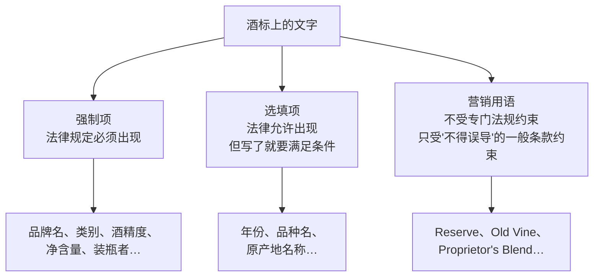
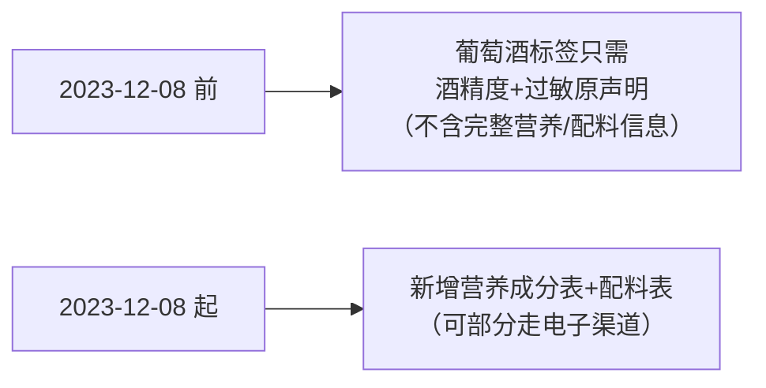
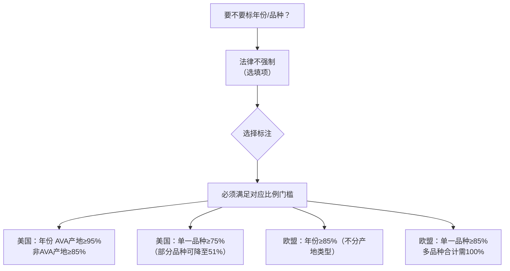
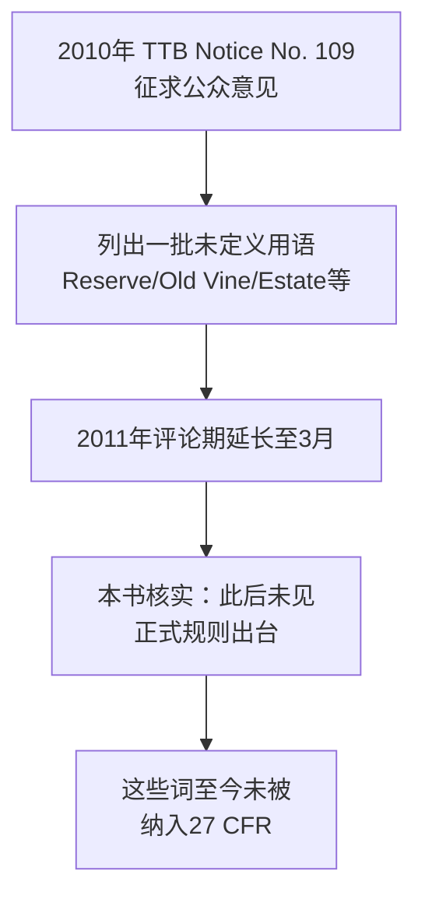
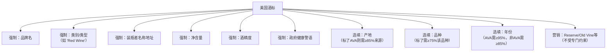
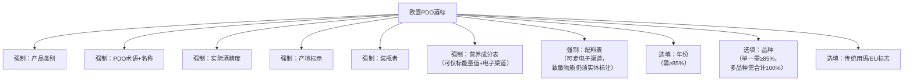

# 第 20 章 怎么读一张酒标：哪些字受法律约束，哪些是营销

> **本章目标**：把第 19 章建立的框架（地理边界 / 品种-产量-工艺约束 / 核查强度）
> 落到一张具体的酒标上，回答一个更直接的问题：**标签上的每一个词，
> 哪些是法律规定必须写的，哪些是法律规定可以选择写的（但写了就要兑现承诺），
> 哪些完全是营销，不受任何法律约束？**
>
> 本章会显示：**"Reserve""Old Vine"这类听起来很正式的词，
> 在美国法律上几乎是空的**——而同样的词（或其对应词）在西班牙、意大利，
> 却是**写进 DO/DOCG 规则、有具体陈年年限的法定术语**。
> **同一个词，不同法域，法律含义可能天差地别。**

> **适度饮酒，未成年人不饮酒，酒后不驾车。** 本章 🅐 实操全部不需要开瓶。

## 20.1 先把一张酒标拆成三类信息

这三类的**核查强度完全不同**：强制项不写就不能上市；选填项写了就要符合
对应的比例/工艺要求，核查机构会较真；营销用语**几乎不受专门核查**，
只要不构成"虚假或误导性陈述"就行——而"是否误导"是一个宽松得多的标准。

## 20.2 强制项：美国与欧盟各自的最小清单

### 美国：27 CFR § 4.32 列出的五类，外加一条健康警语

**27 CFR § 4.32**（已核对官方 XML 原文）把强制项限定得很窄：

| 位置 | 强制内容 |
|------|---------|
| 正标 **(a)** | **(1)** 品牌名（§ 4.33）；**(2)** 类别/类型标示（§ 4.34）|
| 任意附着标签 **(b)** | **(1)** 名称与地址（§ 4.35）；**(2)** 净含量（§ 4.37）；**(3)** 酒精度（§ 4.36）|
| 任意标签 **(e)** | 总 SO₂ **≥10 ppm** 时的亚硫酸盐声明 |

外加 **27 CFR § 16.21** 规定的**政府健康警语**[^1]——固定措辞，
"GOVERNMENT WARNING" 须大写加粗，正文不得加粗，须在反差背景上清晰可读，
内容含孕妇饮酒风险与驾驶/操作机械风险两句，自 1989-11-18 起对所有
≥0.5% ABV、在美国销售的酒精饮料生效。

[^1]: [政府健康警语](../../glossary.md#government-warning)（英：Government Warning）。

**这份清单里没有产区、没有品种、没有年份。** 一瓶完全不标产区、不标品种、
不标年份的美国酒，只要品牌名、类别、名称地址、净含量、酒精度与健康警语齐全，
**依然是一张合法的酒标**。

### 欧盟：Article 119 列出的十项，两项是 2023 年才加的

**(EU) No 1308/2013 Article 119**（经 eur-lex.europa.eu 现行合并文本核对）
规定的强制项**现为十项（a)~(j)**：

| 项 | 内容 |
|----|------|
| (a) | 产品类别（含"脱醇""部分脱醇"等术语）|
| (b) | 带 PDO/PGI 的酒须标"protected designation of origin"/"protected geographical indication"及名称 |
| (c) | 实际酒精度 |
| (d) | 产地标示 |
| (e) | 装瓶者标示 |
| (f) | 进口酒的进口商标示 |
| (g) | 起泡酒的含糖量标示 |
| **(h)** | **营养成分表** |
| **(i)** | **配料表** |
| (j) | 脱醇产品（<10% vol）的最短保质期日期 |

> **(h)(i) 两项由 (EU) 2021/2117 新增，自 2023-12-08 起生效**——这是欧盟葡萄酒标签
> 近年**最大的一次强制项扩充**。在此之前，葡萄酒长期被排除在食品行业通用的
> 营养与配料标注规则之外，只需要标"contains sulphites"一类的过敏原声明。

**(d) 产地标示是欧盟独有的强制项，美国没有对应的强制项**——
美国酒标完全可以不写任何产地名称（只用"American"这个国家级默认值）；
欧盟的 PDO/PGI 酒则**必须**标明产地信息，这与第 19 章讲的"欧盟把品种、
产量、产地打包进强制条款"的逻辑一致。

### 营养成分表与配料表：可以走"电子标签"

Article 119 对 (h)(i) 两项给了一条减损：**营养成分表可以只在实体标签上
标能量值**（可用符号"E"表示），**完整的营养成分表与配料表可以通过
电子方式提供**（例如二维码）。但有两条硬约束：

- 该电子渠道**不得展示营销或广告内容，不得采集或追踪用户数据**；
- **致敏物质**（如亚硫酸盐）**即使配料表走电子渠道，仍须在实体标签上
  以"contains"开头单独标注**——过敏原信息不能被"藏"进二维码里。

> **要带走的判断**：**"扫码看配料表"不是偷懒，而是法律给的一条正式减损**；
> 但**"含亚硫酸盐"这行字必须印在瓶身上**，扫不扫码都躲不开。

## 20.3 选填项：写了就要兑现——年份与品种的比例门槛

年份与品种名称，在美国与欧盟**都属于选填项**，但选择标注后，
两大法域给出的**具体比例门槛完全不同**，而且**同一法域内部还按产地类型分层**。

### 年份标注

| 法域 | 门槛 | 依据 |
|------|------|------|
| 美国 · 标 **AVA** 产地 | **≥95%** 的酒液产自该年份采收的葡萄 | 27 CFR § 4.27(a)(1) |
| 美国 · 标**非 AVA**产地 | **≥85%** | 27 CFR § 4.27(a)(2) |
| 欧盟 | **≥85%**（不区分产地类型）| (EU) 2019/33 Article 49 |

**美国体系里，AVA 产地的年份门槛（95%）比非 AVA 产地（85%）更高**——
这是本书目前核到的、美国体系里**唯一一处"AVA 比非 AVA 要求更严格"**的
具体数字（第 19 章已说明 AVA 本身不约束品种/产量/工艺，但**使用 AVA 名称
后，年份标注的门槛会被拉高**）。

### 品种标注

| 法域 | 单一品种门槛 | 多品种规则 |
|------|-------------|-----------|
| 美国 | **≥75%**（部分品种可降至 **51%**，但须在标签加注"contains not less than 51% (品种名)"）| 须标各品种占比，容差 ±2% |
| 欧盟 | **≥85%** | 合计须达 **100%**，且按比例从高到低排列 |

⚠️ **75% 与 85% 这两个数字在网上经常被读者记混**——本书的处理方式是
每次都明确标注"这是哪个法域的数字"，不写成一个笼统的"品种标注通常要求 XX%"。

美国还有一条**强制联动规则**：**27 CFR § 4.23(a)** 规定，标品种名**必须
同时标原产地名称**；**27 CFR § 4.34(b)** 进一步要求，标品种名、半通用
地理类型名，或标年份时，**原产地名称须与类别/类型标示字号大致相当**——
不能把"Napa Valley"印成蚂蚁大小、把品种名印成巨大字体。

## 20.4 营销用语：法律上几乎是空的那一类词

这是本章最该记住的一节。"Reserve""Old Vine""Proprietor's Blend"这类词，
**在美国联邦法规里没有专门定义**。

### 美国：2010 年 TTB 曾想管，但没管成

**TTB Notice No. 109**（2010-11-03 发布，官方 Federal Register 原文已核对）
是一份"预告式规则制定通知"，TTB 在其中**明确列出了一批现行法规未定义的
酿酒用语**，征求公众意见：

> "Proprietors Blend," "Old Vine," "Barrel Fermented," "Old Clone,"
> "Reserve," "Select Harvest," "Bottle Aged," and "Barrel Select."

通知还专门讨论了 "Estate"（脱离"Estate bottled"单独使用时）、
"Proprietor grown"、"Vintner grown"、"Single vineyard"等词是否需要定义。
评论期后来延长到 2011-03-04。**本书核实到的结果是：此后未见正式的
规则制定（NPRM 或 Final Rule）**——这些词**至今仍未被纳入 27 CFR**。

**那么这些词完全不受约束吗？也不是。** 它们仍须满足两条**一般性条款**：

- **§ 4.38(f)**：标签上的附加信息须"真实、准确、具体、不贬低、不误导"；
- **§ 4.39(a)(1)**：禁止任何"虚假或不真实的陈述"，或"直接、
  或通过含糊、省略、推断，或添加不相关的科学/技术内容而制造误导印象"的陈述。

也就是说：**没有人规定"Reserve"必须对应多少年陈年**，但如果一款酒
**完全没有任何特殊之处却标"Reserve"**，理论上仍可能落入"制造误导印象"
的一般性条款——**只是这个标准比"有没有满足具体数字"宽松得多，
执法也罕见**。

### "Old"这个词：法律明确开了一个口子

**27 CFR § 4.39(b)（年龄声明）**的条文很值得逐字读：

> **除以下情形外，不得做任何年龄声明**（含品牌名或商标里的文字/图案）：
> **①** 符合 § 4.27 的年份酒；**②** 符合 § 4.38(f) 的陈酿方式说明；
> **③** 将"old"作为品牌名的一部分使用。

**第③条是关键**：法规**明确允许**把"old"用作品牌名的一部分，
**而不要求它对应任何可核查的年龄或年限**。这正是"Old Vine"一类说法
在美国法律上几乎不受约束的直接依据——**不是监管空白，而是法规明文豁免**。

### 欧盟与西班牙/意大利：同一类词，在那里是法定术语

对比之下，**"Reserva"（西班牙）与"Riserva"（意大利）在各自的 DO/DOCG
体系里是有法律约束力的术语**，与美国的"Reserve"形成鲜明反差：

⚠️ 本书读到的以下陈年年限数字**均为经检索引擎复述的二手整理，
未核对各产区 Consejo Regulador 或 disciplinare di produzione 的官方条文原文**，
只作量级参考：

| 术语 | 法域/产区 | 经复述的陈年年限 |
|------|----------|----------------|
| Reserva（红酒）| 西班牙（各产区 Consejo Regulador 规定，年限因产区而异）| 据复述常见为**桶陈+瓶陈合计至少 3 年** |
| Gran Reserva（红酒）| 西班牙 | 据复述常见为**合计至少 5 年** |
| Riserva（基安蒂·经典）| 意大利 DOCG | 据复述为**陈年 24 个月以上，含瓶陈 3 个月** |

> **这条对比呼应第 19 章的核心论点**：**原产地制度是否约束品种/产量/工艺，
> 各国选择不同**；这里再加一层——**同一个"听起来像专业术语"的词，
> 是否有法律约束力，同样因国家而异**。看到"Reserve"类词，
> **第一件事是确认这是哪个法域的酒标**，而不是假设它在哪里都代表同一件事。

### OIV 对"老藤"的推荐性定义：一个值得知道、但不是强制标准的参考

"老藤"（Old Vine / Vieilles Vignes）同样长期没有法律定义——
无论美国、法国还是其他产区，在法律层面都**没有统一的最低树龄要求**，
同一个法国产区里，一位生产者可能把 20 年的葡萄树称为"vieilles vignes"，
另一位可能只用来称呼 70 年以上的树。

2024 年，**OIV 通过决议 OIV-VITI 703-2024**，首次给出一个**国际组织层面
的推荐性定义**：

> **老葡萄株** = 一株被官方记录证明**树龄 35 年或以上**的单株
> （嫁接苗须砧木与接穗的连接关系同样维持 35 年以上）；
> **老葡萄园** = 一个划定地块内**至少 85% 的植株**满足上述树龄条件。

⚠️ **这是一份推荐性决议，不是强制性法规**——它**不要求**任何国家或产区
必须照此标注"老藤"类字样，各国与各产区**完全可以继续按自己的习惯使用
这个词**。本书用它来说明"'老藤'存在一个被广泛讨论的国际参考定义"，
不代表现实中看到的"Old Vine"标签都满足这个标准。

## 20.5 把几张典型酒标拆给你看

### 典型美国酒标

### 典型欧盟（以标 PDO 的静止葡萄酒为例）酒标

**两张图对比最值得注意的差异**：**欧盟把"产地"做成了强制项，
美国没有**；**欧盟 2023 年起多了营养成分表与配料表这两项强制内容，
美国至今没有对应要求**。

## 20.6 常见说法辨析

按本书约定标注**证据强度**：✅ 有共识 / ⚠️ 有争议 / ❌ 明确错误 / 缺乏证据。

| 说法 | 判定 | 说明 |
|------|------|------|
| "酒标上写的都是法律规定必须写的" | ❌ **明确错误** | 年份、品种、"Reserve"类营销词的法律地位完全不同——前两者是"选填但有比例门槛"，后者几乎不受专门约束 |
| "标了'Reserve'说明这款酒经过特别陈酿" | ⚠️ **因法域而异** | 在西班牙/意大利，对应词（Reserva/Riserva）在 DO/DOCG 体系下有法定陈年年限；在美国，"Reserve"**没有**任何法律要求的陈年年限，TTB 2010 年的征求意见最终未落地为规则 |
| "'Old Vine'至少得是老树，不然不能叫这个名字" | ⚠️ **缺乏强制约束** | 27 CFR § 4.39(b)(3) **明确允许**把"old"用作品牌名一部分，不要求对应可核查年限；OIV 2024 年提出的 35 年推荐定义**是非强制性的国际参考**，不是各国法律要求 |
| "欧盟酒标现在都得印营养成分和配料表" | ⚠️ **部分对，且有电子渠道减损** | (EU) 2021/2117 确实把这两项列为强制项（自 2023-12-08 起），但**允许营养成分表只标能量值、配料表整体走电子渠道**，只有致敏物质必须留在实体标签上 |
| "美国酒标必须写产地（州/AVA）" | ❌ **明确错误** | 美国的"原产地名称"是选填项，法律允许只标"American"这个默认国家级名称，不强制标更细的州或 AVA |
| "品种标注比例，全世界都是 75% 或都是 85%" | ❌ **明确错误** | 美国单一品种门槛是 75%（部分品种可降至 51%），欧盟是 85%——**不是同一个数字，不能混用** |
| "扫码能看到配料表，说明这家酒庄想藏着掖着" | ❌ **不准确** | 欧盟法规明确允许配料表与完整营养成分表走电子渠道，这是**合规的减损选项**，不是刻意隐藏；但该电子页面依法**不得包含营销内容或追踪用户**，过敏原仍须在瓶身实体标注 |
| "年份标注的比例门槛，AVA产地和普通产地一样" | ❌ **明确错误** | 美国标 AVA 产地要求当年采收葡萄占比≥95%，标非 AVA 产地只需≥85%——**AVA 门槛更高**，这是本书核到的美国体系里年份规则唯一的产地类型差异 |

## 20.7 思考题

1. 用本章的"强制项/选填项/营销用语"三分类，解释为什么"Reserve"和"年份"
   虽然都不是美国法律的强制项，但它们受到的约束力度完全不同。
2. 美国 27 CFR § 4.39(b) 规定"除三种情形外不得做任何年龄声明"，
   其中第③种情形是"将'old'作为品牌名的一部分使用"。
   请解释：这条规定是在**禁止**滥用年龄声明，还是在**允许**一个例外？
   这个例外本身说明了什么？
3. **【案例】** 某进口酒商的宣传文案写道："这款酒标注'Reserve'，
   说明酒庄特意挑选了最好的葡萄，按欧洲传统陈酿了至少三年，品质有保证。"
   请判断这段话的问题出在哪里，并说明如果换成一款西班牙 Reserva 级别的酒，
   这段话是否依然有问题。
4. 本章提到欧盟标签的营养成分表与配料表"可以走电子渠道"，
   但有两条硬约束（不得展示营销内容/不得追踪用户、致敏物质仍须实体标注）。
   请说明：如果没有"致敏物质仍须实体标注"这条例外，
   会出现什么样的消费者风险？
5. 为什么美国的年份标注规则里，"标 AVA 产地"比"标非 AVA 产地"的比例门槛
   更高（95% vs 85%）？结合第 19 章对 AVA 制度的理解，
   试着给出一个合理的解释（本书未核到官方给出的理由，这是一道开放思考题）。
6. **【查证】** 找一张你能看到清晰照片的酒标（美国或欧盟产地均可），
   把上面的每一项信息按"强制项/选填项/营销用语"分类填入表格，
   并标注你依据的是本章哪一条规则。
7. 本章说"75% 与 85% 这两个数字经常被读者记混"。
   请说明：如果你看到一篇中文科普文章写"葡萄酒标注品种名要求至少含
   85% 该品种"，但没有说明是哪个国家，你应该怎么追问或核实？
8. TTB Notice No. 109 列出的待讨论用语里包括"Estate""Proprietor grown"
   "Single vineyard"。请说明：为什么这些词和"Reserve"一样，
   也被 TTB 列入了"现行法规未定义"的名单，而不是像"Estate bottled"
   那样已经有明确的法律定义（提示：回顾 § 4.26 对"Estate bottled"的要求）？
9. OIV-VITI 703-2024 决议给出的"老藤"定义（单株 35 年以上，
   或地块内 85% 植株达标）是推荐性的，不是强制性的。
   请说明：如果未来某个产区把这个定义**写进了自己的 disciplinare 或
   cahier des charges**，这个推荐性定义会发生什么样的法律地位变化？

> 📖 **参考答案**（想清楚再看）：[Q1](../../qa/20-reading-a-wine-label-qa.md#q1) ·
> [Q2](../../qa/20-reading-a-wine-label-qa.md#q2) ·
> [Q3](../../qa/20-reading-a-wine-label-qa.md#q3) ·
> [Q4](../../qa/20-reading-a-wine-label-qa.md#q4) ·
> [Q5](../../qa/20-reading-a-wine-label-qa.md#q5) ·
> [Q6](../../qa/20-reading-a-wine-label-qa.md#q6) ·
> [Q7](../../qa/20-reading-a-wine-label-qa.md#q7) ·
> [Q8](../../qa/20-reading-a-wine-label-qa.md#q8) ·
> [Q9](../../qa/20-reading-a-wine-label-qa.md#q9)

## 20.8 本章实操

🅐 档**全部不需要开瓶喝酒**。

### 🅐 无器具版 · 任务一：给一张酒标做"三分类"拆解

找 **3 款**不同产地的酒（可以是家里现有的、或任意购物网站上能看清文字的
酒标照片），把标签上出现的**每一项信息**填入下表：

| # | 信息原文 | 分类（强制项/选填项/营销用语）| 依据哪条规则（写法域+条文号或条款名）|
|---|---------|----------------------------|--------------------------------|
| 1 | | | |
| … | | | |

**完成后回答**：三款酒里，有没有哪一项信息你不确定该归到哪一类？
是什么让你犹豫？

### 🅐 无器具版 · 任务二：算一次年份/品种的"达标线"

假设你在读一张标"Napa Valley"（美国 AVA）、标"Cabernet Sauvignon"、
标"2021"年份的酒标，填空：

| 要素 | 该法域/产地类型下的门槛 | 依据条文 |
|------|----------------------|---------|
| 年份 2021 | 至少 ____% 的酒液须产自 2021 年采收的葡萄 | |
| 品种 Cabernet Sauvignon | 至少 ____% 的酒须由该品种制得 | |
| 原产地名称 Napa Valley | 若标品种/年份，须同时标注，且字号须 ____ | |

**完成后回答**：如果同一款酒改标一个**非 AVA** 的原产地名称（比如直接标
"California"），年份的门槛会发生什么变化？

### 🅐 无器具版 · 任务三：追一次"Reserve"类词的监管历史

不查资料，先凭本章内容回答：**TTB 在哪一年发布了关于"Reserve"等词的
征求意见通知？这份通知最终有没有变成正式规则？**

写完后回到 §20.4 核对，并思考：**一项"曾经被认真讨论过、但最终没有
落地"的监管动议，对消费者理解这个词意味着什么？**（提示：
"曾经讨论过"和"现在有法律约束"是两件不同的事。）

## 20.9 🔎 买酒与点酒时的用处

1. **看到"Reserve""Old Vine"类词，先问清楚是哪个法域的酒标。**
   美国酒标上这些词几乎不受约束；西班牙的"Reserva"、意大利的"Riserva"
   则是有陈年年限要求的法定术语——不要用同一套期待去理解它们。
2. **酒标没标产区/品种/年份，不代表这酒有问题。** 在美国，这三项都是
   选填项，不标完全合法；但如果标了，说明厂商选择承担对应的比例要求，
   这本身是一个（弱）信号。
3. **扫码看到的营养成分表和配料表是合规的，不是刻意隐瞒。** 欧盟法规
   明确允许这样做；但"含亚硫酸盐"这类过敏原信息一定会印在瓶身上，
   不会被藏进二维码里。
4. **看到"至少 XX% 该品种"这类小字声明，说明这款酒用了美国允许的
   51% 特殊豁免**（通常用于风味过强或特定品种），不是标注错误。
5. **判断一款酒"值不值这个价"，不要单独依赖"Reserve"一类词**——
   它在很多市场里不提供任何可核查的额外信息，真正该看的是法律强制项
   （产地、品种、年份比例是否标注、酒精度）与你自己的品鉴判断。
6. **"老藤"目前没有统一的法律最低年限**（OIV 2024 年的 35 年只是推荐性
   参考）——想了解具体树龄，最可靠的方式是直接询问酒庄，而不是假设
   "老藤"三个字本身已经暗示了某个具体数字。

## 20.10 本章依据

### A. 已核对原文的法规与官方文件

- **27 CFR § 4.32、§ 4.33、§ 4.34、§ 4.23、§ 4.27、§ 4.39**（本轮新核，
  官方 XML 原文，ecfr.gov Versioner API）：强制标签信息五类、品牌名要求、
  类别/类型标示规则、品种标注的 75%/51% 门槛、年份标注的 95%/85% 门槛、
  禁止行为与年龄声明的三种例外（含"old"用作品牌名的豁免）。
- **27 CFR § 16.21**（本轮新核，经检索引擎复述官方条文要点）：
  政府健康警语的固定措辞与格式要求、1989-11-18 生效日期。
- **TTB Notice No. 109（Docket TTB-2010-0006）**（本轮新核，
  federalregister.gov 官方全文）：TTB 就"Reserve""Old Vine"等未定义
  酿酒用语征求公众意见的完整列表与法律依据（FAA Act § 105(e)(f)），
  以及"此后未见正式规则出台"这一核实结果。
- **(EU) No 1308/2013 Article 119、Article 120**（本轮新核，经
  eur-lex.europa.eu 现行合并文本复述）：十项强制项（含 2021/2117 新增的
  营养成分表、配料表两项及其电子渠道减损）、七项选填项。
- **(EU) 2019/33 Article 49、Article 50**（本轮新核，legislation.gov.uk
  官方原文）：年份标注 85% 门槛、品种标注单一 85%/多品种 100% 门槛及
  排列顺序要求。
- **(EU) No 1169/2011 Annex II**（第 1 章已核，本章复用）：
  亚硫酸盐标注门槛 10 mg/L。

### B. 经检索引擎复述、本书未逐字核对原文的二手资料

- 西班牙 Reserva/Gran Reserva、意大利 Riserva（以基安蒂·经典为例）的
  具体陈年年限数字：均为二手整理，未核对各产区官方条文原文。
- OIV-VITI 703-2024 决议的"老藤"定义：经检索引擎复述决议要点，
  未逐字核对决议原文。
- "(EU) 2021/2117 自 2023-12-08 起生效"这一日期与具体修订内容：
  经 eur-lex.europa.eu 现行合并文本与检索引擎交叉复述，
  未读到 2021/2117 这份修订法规本身的条文原文。

### C. 本章有意留白的地方

- **西班牙 Reserva/Gran Reserva、意大利 Riserva 的官方陈年年限原文**：
  未核对 Consejo Regulador 或 disciplinare di produzione 原文，
  本章数字只作量级参考（与第 19 章 §9 第 62 条同一条纪律）。
- **TTB Notice No. 109 之后是否存在本书未检索到的后续规则**：
  本书核对了 2010 年原始通知全文并确认评论期延长后未见后续 NPRM/Final
  Rule，但未逐一核对 2011 年后历年联邦公报目录，不做绝对化表述。
- **(EU) 2021/2117 修订法规本身的条文原文**：本书只读到其并入 1308/2013
  现行合并文本后的结果，未读到该修订法规的独立条文原文。
- **各国（除美、欧）对年份/品种标注比例的规定**：本章只核对了美国与欧盟
  两大法域，中国、澳大利亚、新西兰等其他法域的具体门槛未核，
  不得当作世界通则（与第 6、9、12~14、16、17、19 章同一条纪律）。

以上每一条的完整题录、DOI 与核对状态，见[出处与资料登记](../../standards.md)。

---

**下一站**：第 21 章——**法国 ①：波尔多与勃艮第**。第 19、20 两章建立的框架
（谁保证了什么、哪些字受法律约束）将在这里第一次落到具体产区上：
两套截然不同的分级哲学——**酒庄分级**与**地块分级**。
