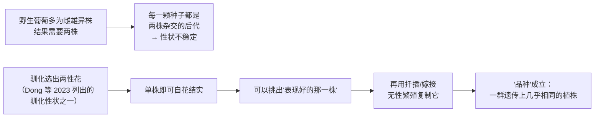
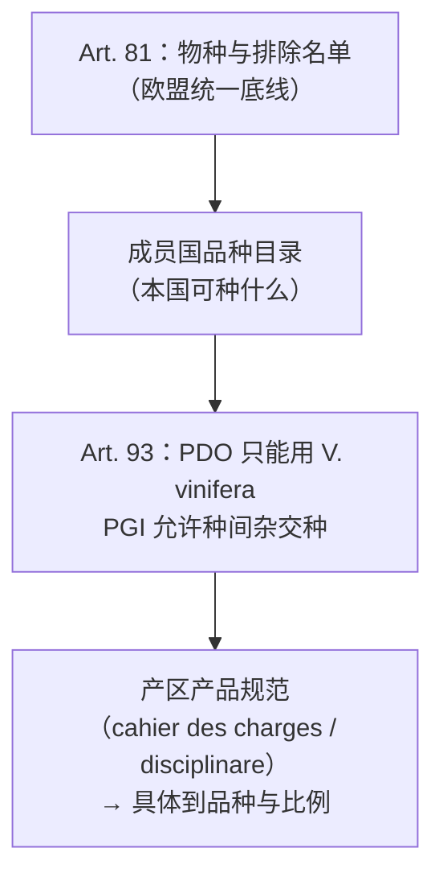

# 第 6 章 思考题参考答案

> 只记「问题 + 正确答案」，不记读者作答。案例题给**完整推理链**。
>
> 凡本书**尚未核到一手出处**的地方，答案里会明说——请不要把"待核"当成"已知"。

## Q1

**问**：为什么"雌雄同株（两性花）"是"品种"这个概念得以存在的前提？

**答**：

因为**只有能被稳定复制的植株，才谈得上"品种"**。

链条是这样的：

**要点有两条**：

1. 有性繁殖（种子）意味着**每一代都重新洗牌**，没有"同一个品种"可言；
2. 无性繁殖（扦插/嫁接）才能把某一株**原样复制**下去——
   而这件事的前提是那一株**本身能结果**。

> **要带走的判断**：你在酒标上看到的每一个品种名，
> 本质上都指向**一批遗传上几乎相同的植株**，而不是"一类长得像的葡萄"。
> 这也是为什么第 9 章能说"所有白葡萄品种可能有共同起源"——
> 那是可以用分子标记查的，不是修辞。

## Q2

**问**：根瘤蚜在两类寄主上的虫态差异，如何解释"嫁接"这个解法？

**答**：

Granett 等（2001）的关键观察是：

| 寄主 | 主要虫态 | 受害器官 |
|------|---------|---------|
| *V. vinifera* 品种 | **根部虫态为主** | **根** |
| 美洲原生 *Vitis* 种 | **叶部虫态为主** | 叶（形成叶瘿）|

于是问题被精确地定位了：**要保住的风味长在枝和果上，受致命伤害的却是根。**

嫁接把这两件事拆开：

- **根**换成美洲种（或其杂交后代）——虫在这套根系上主要不走根部路线，
  即使取食也不至于致命；
- **枝（接穗）**仍是 *V. vinifera*——果实、香气、品种特征全部保留。

**还要补一句机制上的诚实**：综述说损害"在很大程度上由**取食点被土传次生病原侵染**造成"，
并明确写"虫与植株的生理互作**没有被很好地研究**"。
所以严格地说，嫁接解决的是"**在这套根系上，那条伤害链走不通**"，
而不是"美洲根有一种杀虫物质"。

> **要带走的判断**：一个工程解法能成立，常常是因为**问题被定位到了具体器官**。
> 这也解释了为什么"自根"在有根瘤蚜的产区是一件**有风险**的事，而不是一种情怀。

## Q3

**问**："砧木显著影响糖、酸与酚类"与"砧木对香气影响很少有一致趋势"，矛盾吗？

**答**：

**不矛盾。** 两句话说的是**不同的因变量**，而且**证据量级完全不同**。

| | 糖 / 有机酸 / 酚类 | 香气化合物 |
|---|------------------|-----------|
| 测量难度 | 常规分析，成本低，每个试验都会测 | 需要 GC-MS 等，成本高 |
| 研究数量 | 大量、长期积累 | 综述统计：33 个砧木被测挥发物、29 个被做感官，**多数砧木只出现在一项研究里** |
| 因果链长度 | 砧木 → 树势/水分/氮 → 糖酸酚（**一步到位的组成指标**）| 砧木 → …… → 前体 → **发酵释放** → 香气（第 4 章：中间还隔着酵母）|
| 结论状态 | 方向性结论较稳 | **高度依赖情境，一致趋势很少** |

**还有第三层原因**：香气受**酿造端**的强烈干扰。
该综述专门指出，各试验在**氮管理、发酵条件、苹乳发酵方式、浸渍时长**上差异很大，
这些都会改变香气，从而**掩盖砧木本身的效应**。

最后一条：**有些香气大类根本还没被研究过**（挥发性硫醇、内酯、呋喃酮）。
"没有一致趋势"和"没有被研究"是两种不同的空白，**不要混为一谈**。

> **要带走的判断**：看到"A 影响 B"，先问三件事：
> **B 是哪个指标？测了多少次？中间隔着几步？**

## Q4

**问**：指出这段商品页文案至少四处问题（含一处内部矛盾），并逐句改写。

> *"本园为百年自根老藤，未经嫁接，因此保留了葡萄最纯粹的原始风味；
> 我们采用欧洲禁止的古老杂交品种酿造，风味独一无二；
> 砧木选用 110R，赋予酒体更好的矿物感。"*

**答**：问题至少**五处**。

**① 内部自相矛盾（最硬的一处）**：
前面说"**自根老藤，未经嫁接**"，后面又说"**砧木选用 110R**"。
**一株葡萄不可能既是自根的又有砧木。**
看到这种矛盾，正确的反应不是猜哪句是真的，而是**认定这段文案不是由懂行的人写的**——
它后面所有的技术性表述都因此贬值。

**② "自根 → 保留最纯粹的原始风味"** → **事实 + 无证据因果**。
"自根"是可核实的事实；"因此风味更纯粹"需要证据，而本书未核到这类对照研究。

> **改写**："本园为自根植株（未嫁接）。自根与嫁接的差异在风味上尚无一致的公开证据，
> 我们把它作为园区信息如实说明。"

**③ "百年老藤"** → **不受法定约束的表述**（与第 4 章结论一致）。
本书在已核对的欧盟条文中**未见到"老藤"的法定年限定义**。

> **改写**："本地块定植于 ____ 年（可提供种植记录）。"
> ——**给年份比给形容词强**。

**④ "采用欧洲禁止的古老杂交品种"** → **与"它能在欧盟合法销售"冲突，且概念错误**。
(EU) No 1308/2013 Art. 81(2) **允许** *Vitis vinifera* 与葡萄属其他种的杂交种，
被点名排除的只有 **Noah、Othello、Isabelle、Jacquez、Clinton、Herbemont** 六个。
所以：**要么这个品种并不在禁列**（那"欧洲禁止"就是编的），
**要么它真在禁列**（那这瓶酒在欧盟境内的合法性就有问题）。

> **改写**："本酒使用的品种为 ____，属于 *Vitis vinifera* 与其他 *Vitis* 种的杂交种，
> 已列入 ____ 国的品种目录。"

**⑤ "110R 砧木赋予更好的矿物感"** → **两层都站不住**。

- 第一层（第 5 章）："矿物感"本身**没有公认定义**，
  对 1697 名消费者的研究结论是**即使在专业人士之间也找不到共识含义**；
- 第二层（本章）：砧木对香气的影响**高度依赖情境、一致趋势很少**，
  而且 110R 虽然是被研究得较多的砧木之一，**也没有"带来矿物感"这类结论**。

> **改写**："本园砧木为 110R。砧木会影响树势、糖酸与酚类组成；
> 它对香气的影响在公开研究中尚无一致结论。"

> **要带走的判断**：这段文案的病根是**把可核实的事实和无证据的因果捆在一起卖**。
> 拆开之后你会发现：**事实部分（自根/树龄/砧木型号）都很好核实，
> 而所有"因此更好"都是加上去的。**

## Q5

**问**："PGI 和 PDO 的区别只是产区划得大一点，品质其实一样"——漏掉了什么？

**答**：

按 (EU) No 1308/2013 **Article 93**，至少漏掉了**三条与范围大小无关**的差别：

| 差别 | PDO | PGI |
|------|-----|-----|
| **葡萄来源比例** | **100 %** 来自该地理区域 | **至少 85 %**；其余须来自该成员国或第三国境内 |
| **允许的植物材料** | **只能是 *Vitis vinifera*** | ***V. vinifera*，或 *V. vinifera* 与葡萄属其他种的杂交种** |
| **与产地的因果强度** | 品质与特征"**本质上或完全归因于**"该地理环境（含自然与人文因素）| 具有"**可归因于**该地理来源的特定品质、声誉或其他特征" |

（另：Art. 93(4) 规定 PDO 的"生产"涵盖**从采收到酿造完成**。）

**那"品质其实一样"这句对不对？**

要分两半看：

- **不对的一半**：两者的**约束强度不同**（上表三条都是硬约束），
  这直接影响成本与可控性；
- **有道理的一半**：**约束强度不等于杯中品质**。
  PDO 保证的是"**满足了这套规定**"，不是"**更好喝**"。
  本书从第 1 章起就把"法规规定"和"品质"当成两层来处理。

**所以更准确的说法是**：

> "PGI 的约束更松（葡萄可有 15 % 来自区域外、允许种间杂交品种），
> 这通常带来更低的成本与更大的风格自由度；
> **它可能更便宜，但便宜不等于更差，贵也不等于更好。**"

> **要带走的判断**：产地制度回答的问题是"**谁保证了什么**"，
> 不是"**谁更好喝**"。这条是第四部分（第 19 章）的主轴。

## Q6

**问**：为什么 21 045 个"名字"里有大量同物异名与同名异物？这对看酒标认品种有什么影响？

**答**：这是**查证题**，考的是过程。下面给出结论与本书的推理。

**为什么名字会膨胀**，至少三条原因（前两条可由本章内容直接推出）：

1. **无性繁殖 + 长距离传播**：同一个品种被带到另一个国家，
   常常获得一个**当地名字**（本章 §6.6：葡萄靠无性繁殖复制，走到哪里都还是它）；
2. **命名早于遗传学**：这些名字大多在能做 DNA 鉴定之前就已经存在了，
   靠的是叶形、果形与口耳相传；
3. **名字本身有商业价值**，因此存在"叫得像"的动机（这一条属于**行业惯例**层面的推断，
   本书未核到系统性证据，标为推断）。

**OIV 报告用的例子可以自己去数**：Cabernet Sauvignon 一条目下就列了十几个国家的写法
（Petit Cabernet、Kaberne Sovinjon、Burdeos Tinto…）；
Sauvignon Blanc 的同物异名里甚至有 **Muscat Sylvaner**（德国）与 **Fumé Blanc**——
后者在市场上常被误当作另一个品种。

**对看酒标的三条实际影响**：

1. **同一个品种在两国可能是两个名字** → 你可能重复买到同一个东西，
   或错过一个你其实喜欢的品种；
2. **名字相似不等于亲缘相近**（"同名异物"），
   反过来**名字毫不相干却可能是同一个品种**；
3. **所以"按品种买酒"的正确做法是：认品种 + 认产区 + 认结构坐标三件一起用**
   ——只认名字最容易被绕进去。

> **要带走的判断**：**品种名是一个商业标签，也是一个可查的科学标识——
> 两者并不总是重合。** 有免费的公开数据库可以查，没有理由只信酒标。

## Q7

**问**：一份产区法规的品种名单，同时受哪两层约束？

**答**：

**两层，缺一不可**：

| 层 | 来源 | 约束内容 |
|----|------|---------|
| **第一层：欧盟层面** | (EU) No 1308/2013 **Art. 81** | 品种必须属于 *Vitis vinifera* 或为 *V. vinifera* × 其他 *Vitis* 的杂交种，且不得为被点名的六个；由**成员国**建立可种植目录。若该酒要挂 **PDO**，还要叠加 **Art. 93** 的"**只能用 *V. vinifera***" |
| **第二层：产区自己** | 该产区的产品规范（法国称 *cahier des charges*，意大利称 *disciplinare*）| 在上一层允许的范围内，**进一步收紧**：哪些品种可用、主品种与辅助品种的比例、最高产量、最低自然酒精度等 |

**关系是"层层收紧"**：

> **要带走的判断**：读产区法规时永远要问一句"**这条是谁定的**"。
> 同一张酒标上的约束往往来自**三个不同层级**的文本——
> 这正是第四部分要拆开的东西。
>
> ⚠️ **本书目前尚未核对任何一份具体产区的 cahier des charges 原文**
> （见[出处与资料登记](../standards.md)），所以这里只讲结构，不给任何具体数字。
