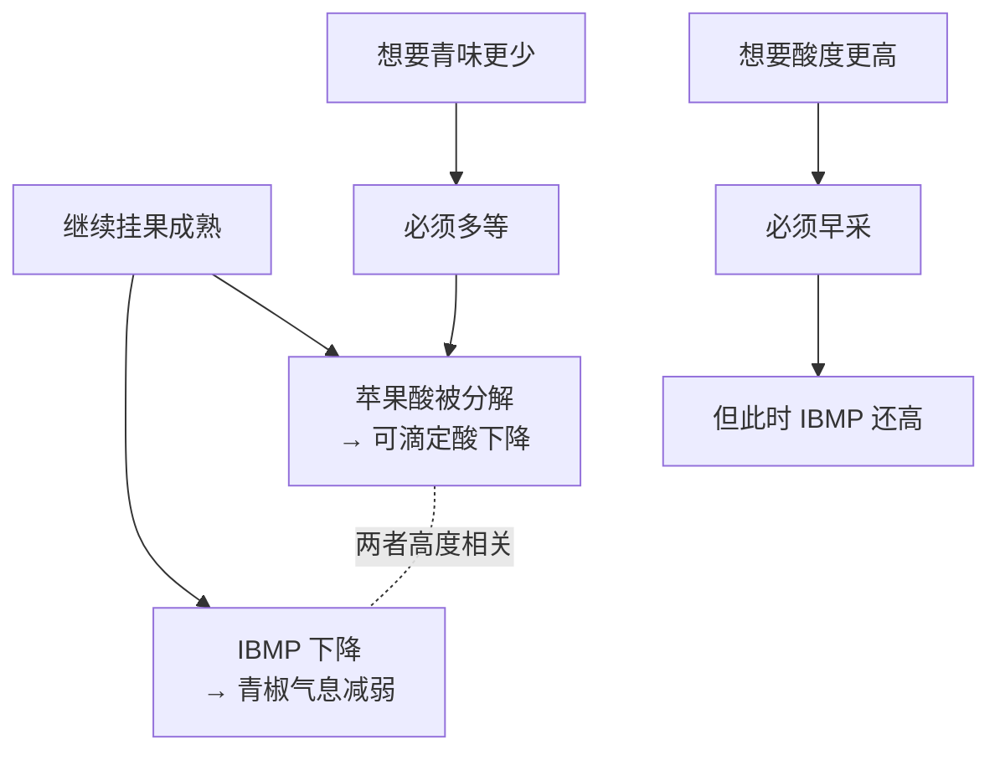

# 第 7 章 思考题参考答案

> 只记「问题 + 正确答案」，不记读者作答。案例题给**完整推理链**。
>
> 凡本书**尚未核到一手出处**的地方，答案里会明说——请不要把"待核"当成"已知"。

## Q1

**问**：为什么转色后"每颗果里的溶质随时间的变化"可以指示韧皮部的活动？

**答**：

因为**另一条通道关掉了**。

Coombe 与 McCarthy（2000）的推理前提是：**转色之后木质部（xylem）的流入被阻断**。
于是浆果只剩**韧皮部（phloem）**一条物质输入通道。

既然只剩一条路，那么"每颗果里的溶质（主要是糖）随时间增加了多少"，
就直接反映**这条路上运了多少东西**——它成了一个**间接但可用的流量计**。

该文进一步给出的证据是：在开花时间不同、体积增幅差异很大的一批浆果上，
**转色后的 °Brix 曲线几乎重合**，因为**溶质的增速与体积的增速成正比**。
这说明糖和水**来自同一来源、按同一比例进来**——正是韧皮部汁液的特征。

> **要带走的判断**：很多生理学结论的力量来自"**把其他通道排除掉**"。
> 这和本书反复强调的实验纪律是同一件事：**一次只改一个变量。**

## Q2

**问**："晚采两周，糖度从 23 升到 26 °Brix，浓缩度更好"——至少两种物质解释？

**答**：

**至少两种，而且对酒的意义完全不同。**

| 解释 | 发生了什么 | 对酒意味着什么 |
|------|-----------|--------------|
| **① 糖真的进来了**（韧皮部仍在输入）| 每颗果的**溶质总量增加** | 潜在酒精度上升；同时这两周里其他成熟过程也在推进（苹果酸继续分解、IBMP 继续下降）|
| **② 水跑掉了**（果实已达最大重量后收缩）| 每颗果的溶质**接近平台**，但**失水**使浓度上升 | °Brix 同样上升，但**浓缩的是全部成分**——包括不想要的那些；果重下降还意味着**产量下降** |

**证据来自哪里**：Coombe 与 McCarthy（2000）的第二组试验（Shiraz）明确观察到——
果实在**花后 91 天、约 20 °Brix** 达到最大重量后**开始收缩**，
此时**溶质曲线先减速、随后进入平台**，说明**韧皮部流入已受阻**。
也就是说，**在相当高的糖度区间里，°Brix 的继续上升可以主要来自失水。**

**所以正确的追问是**：

1. "这两周里**每公顷产量**（或平均果重）变了多少？"——掉得多，说明②的成分大；
2. "**可滴定酸与 pH** 怎么变的？"——浓缩会同时抬高一些成分的浓度；
3. "采收时的**果实状态**如何（有没有明显皱缩）？"

> **要带走的判断**：**"浓缩"是一个中性词。**
> 它既可以意味着"东西更多了"，也可以意味着"水更少了"。
> 只有后者会**同时放大缺点**。

## Q3

**问**：为什么"更少青椒味"与"更高酸度"在采收决策上互相拉扯？哪一步有一手文献支持？

**答**：

**推理链**：

**哪一步有一手文献支持**：

- **"IBMP 的下降与苹果酸的分解高度相关，且与品种、土壤类型、天气条件无关"**
  ——这一步来自 Roujou de Boubée 等（2000）的摘要，**本书已核对**。
  这是整条链上最关键、也最容易被跳过的一环：
  它说明二者的同步**不是巧合，也不是某个产区的特例**。
- **"苹果酸在成熟中被分解"**——有 Sweetman 等（2009）综述支持。
- **"青椒特征变明显的阈值约 15 ng/L（红葡萄酒）"**——同上（Roujou de Boubée 等 2000）。

**哪一步本书没有写死**：

- **"晚采多少天，酸会掉多少"**——没有可引用的定量关系；
- **"酒石酸怎么变"**——未核到一手出处。

> **要带走的判断**：采收决策的本质不是"什么时候最熟"，
> 而是"**我愿意在这条时间轴上停在哪里**"。
> 每往后一步，都同时买到一样东西、卖掉一样东西。

## Q4

**问**：指出这份年份报告至少四处需要追问或站不住的地方。

> *"本年度生长季积温达 1 750，显著高于均值，是近十年最佳年份；
> 转色期比常年提前，我们得以在最佳风味成熟度采收；
> 由于晚采，本年份酒款同时具备高酸与成熟风味。"*

**答**：问题至少**五处**。

**① "积温达 1 750"——缺条件。**
**没有给基准温度，也没有给统计区间**，这个数字无法与任何其他数字比较。
本书目前核到的一手用法是 **base 10 ℃**（van Leeuwen 等 2004），
但别人可能用别的基准——**换个基准，同一年的数字就变了**。

> **我会问**："这个积温的**基准温度**和**统计起止日期**是什么？"

**② "显著高于均值 → 是近十年最佳年份"——推理跳跃。**
积温高只说明**热量累积多**，它**不区分**"整季温和偏暖"与"几波极端高温"，
而两者对葡萄的意义完全不同。而且第 8 章会给出证据：
**水分状况**往往才是风味差异的中介变量——一份只讲温度的报告漏掉了它。

> **我会问**："这一年的**降水与水分状况**如何？有没有出现极端高温事件？"

**③ "在最佳风味成熟度采收"——缺乏可操作判据。**
"成熟中风味会变"有证据（IBMP 那条很清楚），
但**可操作的、公认的"风味成熟"判据本书未核到**。这句话目前是**惯例表述**，不是指标。

> **我会问**："你们判断风味成熟用的是什么指标？测了什么？"

**④ "晚采 → 同时具备高酸与成熟风味"——与机制相反。**
这正是 Q3 的拉扯：继续成熟意味着**苹果酸继续分解**。
"晚采 + 高酸"在同一片园子里需要额外解释。

> **我会问**："高酸是怎么来的？是不同地块/更高海拔/凉夜，还是做过**增酸**？"
> （增酸在欧盟是被明确规定的操作：(EU) No 1308/2013 Annex VIII Part I 规定
> 葡萄酒增酸上限为 **2.50 g/L（以酒石酸计）**，且**增酸与增浓互斥**——第 3 章已核。）

**⑤ 内部的时间矛盾：转色提前 + 晚采。**
转色提前意味着整条成熟曲线前移；在此基础上还"晚采"，
那么**果实在成熟阶段停留的时间比常年更长**——这会进一步压低酸度、提高糖度。
文案没有解释这一点，反而用它来支持"高酸"。

> **要带走的判断**：一份可用的年份报告应该长这样——
> **物候日期 + 积温（含基准与区间）+ 降水/水分状况 + 产量**，
> 其余是文学。看到"最佳年份"四个字，先找这四项。

## Q5

**问**："气候变暖不影响品质，反正可以提前采收"——怎么回应？

**答**：

**先承认他说对的那一半**：提前采收确实是被广泛采用的适应手段之一，
而且成熟提前本来就意味着采收日期会往前走。

**然后指出三件他多半没想到的事**（第三件来自 2018 年那项研究，最容易被忽略）：

1. **提前采收不是免费的**。第 7 章的拉扯依然成立：
   早采得到更高的酸，同时得到**更多的青味与更少的成熟风味**（IBMP 与苹果酸同步下降）。
   "提前采收"是在同一条取舍曲线上换了个位置，**不是绕过了取舍**。

2. **升温不只改变日期，也改变了成熟时的环境**。
   成熟提前意味着成熟期落在**一年中更热的时段**里，
   而不是把凉爽的秋天整体前移。这两者不等价。
   （本书目前没有可引用的定量研究支持这一条的后果，**因此只作为需要追问的方向提出**。）

3. **"采收期压缩"——这是那项研究里最实际的一条**。
   该研究在**一半的产区**中观察到不同品种的采收时间彼此靠近。
   后果不在葡萄里，而在**操作上**：采收人手、压榨设备、发酵罐同时吃紧 →
   **选果与工艺环节被迫压缩**。这是一条**供应链**层面的品质风险，
   任何"提前采收"都解决不了。

**证据规格**（回应时要说清楚）：澳大利亚 **13 个产区、31 个葡萄园地块**的园区记录 +
网格化温度数据；**所有被考察地块与产区都出现成熟提前与生长季升温**；
趋势幅度**因品种与产区而异**。

> **要带走的判断**：**"可以适应"不等于"没有影响"。**
> 适应本身有成本，而且有些成本（设备排队、人手）根本不在葡萄园里。

## Q6

**问**：评估一份公开年份报告，缺了哪一项之后就无法与其他年份比较？

**答**：这是**查证题**，考的是过程。下面给出判据与本书的结论。

**评估清单与"缺了会怎样"**：

| 项 | 缺了之后 |
|----|---------|
| **物候日期**（萌芽/开花/转色/采收）| 无法判断这一年**快了还是慢了**，也无法把气候数据对应到正确的生育阶段 |
| **积温 + 基准温度 + 统计区间** | **最致命的一项**：没有基准与区间，这个数字**和任何别的数字都不可比**，等于没给 |
| **降水 / 水分状况** | 无法评估第 8 章那条关键变量（水分状况是很多风味差异的中介）|
| **产量（hL/ha 或 t/ha）** | 无法区分"浓缩"来自成熟还是来自低产；也无法判断报告里的"精选"是否有代价 |

**单选"缺了就没法比"的那一项**：**积温的基准温度与统计区间**。
理由：其余三项缺失时，报告**至少还是可读的定性信息**；
而一个没有基准的积温数字**看起来像数据、实际不含信息**——**这比没有更糟**。

**本书做这道题时的典型发现**（供对照）：

- 很多面向消费者的"年份报告"里**一个可比较的数字都没有**，全是天气叙事；
- 产区管理机构或科研机构发布的技术版本通常更完整；
- **同一年份、不同来源的报告，口径常常不一致**——这本身就是有价值的观察。

> **要带走的判断**：看到"某某年是世纪年份"，先找那四项。
> **找不到，就把这句话当成营销而不是信息。**

## Q7

**问**：相邻两块地采收日期相差 10 天，至少四个可能原因？

**答**：

**本章能给两个，第 6 章能给两个，另有两个属于人的决策**：

| 来源 | 原因 | 机制 |
|------|------|------|
| **第 7 章** | **物候起点不同** | 土壤温度、坡向、冷空气汇集等使萌芽/开花期不同，整条曲线随之平移（土壤温度对物候的影响见第 8 章的土壤综述）|
| **第 7 章** | **水分状况不同** | 水分状况影响浆果生长与成熟节奏（第 8 章给出证据）|
| **第 6 章** | **品种不同**（或同品种不同克隆）| OIV 的品种资料里，各品种的萌芽早晚与成熟期长短本身就不同（例如 Chardonnay 记为**晚萌芽、早成熟**，Cabernet Sauvignon 记为**晚萌芽、成熟期长**）|
| **第 6 章** | **砧木不同** | 砧木影响树势与糖酸积累（2025 年砧木综述）|
| **人的决策** | **目标酒款不同** | 同一块地的果可能被分给不同酒款（起泡基酒要早采、高酸；静止酒要晚采）|
| **人的决策** | **采收能力排队** | 人手与设备有限，只能分批（这正是"采收期压缩"造成的问题）|

**答题要点**：能列出**"自然原因"与"人的决策"两类**就算到位——
很多人只想到前者，而后者在实际生产中往往更常见。

> **要带走的判断**：看到两块地的差异，先问一句"**这是长出来的差异，还是安排出来的差异？**"
> 这个问题在第三部分（工艺）会不断复现。
