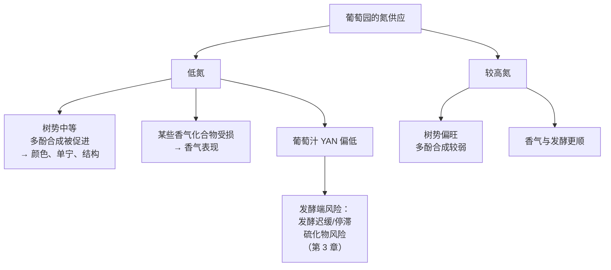

# 第 8 章 思考题参考答案

> 只记「问题 + 正确答案」，不记读者作答。案例题给**完整推理链**。
>
> 凡本书**尚未核到一手出处**的地方，答案里会明说——请不要把"待核"当成"已知"。

## Q1

**问**：OIV 定义里"所施用的葡萄栽培与酿造实践"这一项，让哪两种常见说法站不住？

**答**：

**第一种："人为干预会破坏风土" / "零干预才能让风土说话"。**

如果实践本身就写在定义里，那"干预"就不是风土的**对立面**，
而是它的**组成部分**。而且"不干预"同样是一种被选择的实践——
它也在定义覆盖的范围内。
（2018 年的土壤综述更进一步：**风土表达可以通过植物材料选择、地面管理、施肥等手段优化**。）

**第二种："风土是天生的，与人的水平无关"。**

OIV 的定义把核心放在**"集体性知识"**上——
是"关于环境与实践如何相互作用"的知识在一个区域中**被积累起来**。
没有这种积累，就只有一块地，没有"风土"。
这条与 2006 年那篇论文的结尾相互印证：
**伟大的风土只有在社会经济条件有利于建立品质导向生产时才会出现。**

> **要带走的判断**：风土不是"地"，是"**地 + 人在这块地上积累的知识**"。
> 这不是本书的诠释，是 OIV 决议的字面内容。

## Q2

**问**：写出 van Leeuwen 等（2004）的设计边界，并说明为什么不能据此说"品种不重要"。

**答**：

**设计边界（缺一不可）**：

| 维度 | 该研究的设定 |
|------|------------|
| 品种 | **梅洛、品丽珠、赤霞珠**——**三个亲缘很近的波尔多品种** |
| 灌溉 | **非灌溉**（nonirrigated）|
| 土壤 | **三类**：砾石土 / 底层重黏土 / 根系可及地下水的沙土 |
| 气候 | 同一地区 **1996—2000 年**的**年际变化**（不是跨气候带比较）|
| 观测 | 树体生长与浆果组成（如花青素浓度）|

**为什么不能说"品种不重要"，三条理由**：

1. **品种的取样范围太窄**。三个都是波尔多红葡萄品种，
   它们的差异远小于"雷司令 vs 赤霞珠"这种跨度。
   **被比较的"品种效应"本身就是一个小区间。**
   而且原文明确写了三者的影响**都高度显著**——"小于"不等于"不显著"。
2. **气候的变异来自年份，不是来自产区**。
   该研究比较的是同一地区五个年份之间的差异，
   **不能直接外推到"波尔多 vs 新西兰"这种尺度**。
3. **结论的真正形状是"机制"，不是"排序"**。
   作者给的核心结论是：气候与土壤**很可能经由树体水分状况**影响果实品质。
   排序（谁大谁小）是这项设计下的结果，**机制才是可迁移的部分**。

**那这项研究到底证明了什么**：

> 在**这些条件下**，**环境（气候 + 土壤）对浆果组成的影响大于这三个品种之间的差异**，
> 并且这种影响很可能通过**水分状况**这一中介实现。

> **要带走的判断**：一句"A 比 B 重要"的结论，
> **永远要连着它的设计边界一起引用**。
> 剥掉边界之后，它就变成了一句可以被任何人拿去用的口号。

## Q3

**问**：把"低氮促进多酚、但可能损害某些香气化合物"翻译成一个具体取舍。

**答**：

**取舍长这样**：

**具体到一个酿酒师的选择**：

> "我要做一款结构扎实、能陈年的红葡萄酒，于是控制氮供应、追求中等树势；
> **代价是**某些香气化合物会打折扣，而且**葡萄汁的可同化氮可能偏低**，
> 发酵端要为此做准备（补氮、选菌株、控温）。"

**与第 3 章的连接点是 YAN（酵母可同化氮）**：

- 第 3 章已经核过：YAN 水平影响**酵母基因表达与硫化氢生成**，
  也影响**乙酸酯与芳樟醇、橙花醇**等香气化合物的表现，
  而且**不同菌株的 YAN 需求差异很大**（一项研究里同一菌株在 433 mg/L 与 55 mg/L 下表现不同）；
- 第 8 章补上了它的**上游**：**YAN 的高低首先是葡萄园里的氮决策**。

> **要带走的判断**：**葡萄园里的一个决定，会在发酵罐里第二次收费。**
> 这也是本书把"酿造"排在"品种与风土"后面的理由——
> 很多酒窖里的操作，其实是在为葡萄园里的选择买单。

## Q4

**问**：为什么"土壤的化学签名进入了酒"与"尝不出土壤"可以同时成立？

**答**：

因为**"进入"与"被感知"是两件独立的事**——**这正是第 4 章那条老规矩："检出 ≠ 闻得到"。**

| 问题 | 答案 | 依据 |
|------|------|------|
| 土壤的东西进酒了吗？ | **进了**。⁸⁷Sr/⁸⁶Sr 同位素比从土壤**可交换态**一路传到枝、果、酒，个案研究显示各环节显著相关 | 2023 年综述 + 2025 年个案 |
| 那能尝出来吗？ | **不能**。酒中的矿质元素是**营养元素**，与地质矿物关系很远，而且**浓度极小、一般没有风味** | 2018 年 *Beverages* 综述；另见第 5 章的地质学三条 |

**一句话版本**：

> **进去的是"身份证"，不是"味道"。**
> 同位素比值是一个**可测量但无味**的标签——它精确到能用来判定产地，
> 却完全不参与你的感官体验。

**顺带一个方法论收获**：这两件事之所以常被混为一谈，
是因为人们默认"**检测出来的东西一定和感受有关**"。
第 4 章用维他斯品（阈值约 800 µg/L，实测常远低于此）讲过一次，
这里用锶同位素再讲一次——**两次都是同一条规矩。**

## Q5

**问**：逐句判断并改写这段酒庄文案，指出哪一句与 OIV 官方定义直接冲突。

> *"我们的葡萄园坐落在三亿年前的火山岩上，矿物质经由根系直接进入葡萄，
> 赋予酒款标志性的矿物感与咸鲜；我们坚持零干预，让风土自己说话；
> 我们的 AOC 等级本身就是风土优越的证明。"*

**答**：

**第一句："矿物质经根系直接进入葡萄 → 矿物感与咸鲜"** → ❌ **与已核证据冲突**。

- 酒中的"矿物"是**营养元素**，与葡萄园的**地质矿物**只有很远的关系；
- 其浓度**极小**，且**一般没有风味**；
- 而"矿物感"这个词本身**在专业人士之间也没有共识定义**（第 5 章：1697 名消费者的研究）。

> **改写**："本园位于火山岩母质发育的土壤上。
> 土壤会通过**温度、持水能力与氮供应**影响物候与浆果组成；
> 它**不会**把矿物的味道直接带进酒里。"
> （如果想强调土壤与酒的联系，**可以做锶同位素溯源**——那是可验证的。）

**第二句："坚持零干预，让风土自己说话"** → ❌ **这就是与 OIV 定义直接冲突的那一句**。

OIV/VITI 333/2010 的定义中，**"所施用的葡萄栽培与酿造实践"是风土的组成部分**。
"零干预"本身也是一种实践选择，**并不能把人从风土里摘出去**。

> **改写**："我们尽量减少干预，具体包括……（列出实际做法）。
> 这是我们选择的一种实践，它同样是这片风土的一部分。"

**第三句："AOC 等级本身就是风土优越的证明"** → ❌ **把两个层级混为一谈**。

OIV 决议的理由部分**明确要求区分**描述性的 terroir 定义与**地理标志的法律定义**。
AOC / PDO 是**法律资格**（满足了一套规定），不是**风土论证**，更不是品质结论。
（(EU) No 1308/2013 Art. 93 规定的 PDO 三条硬约束是：葡萄 100 % 来自该区域、
生产在区域内完成、**只能用 *Vitis vinifera***——都不是"更好喝"的保证。）

> **改写**："本酒为 AOC ____ 级，这意味着它满足了该产区规范对品种、产量、
> 酿造与产地的规定。"

**（隐含的第四处）"三亿年前"** → **事实可能成立，但与风味无关**。
岩石年龄并不通过任何已知机制作用于风味；它在文案里承担的是**修辞**功能。

> **要带走的判断**：这段文案的三句话，恰好踩中了本章三个不同的错误类型——
> **① 机制错误（矿物直接进风味）；② 定义错误（把人排除出风土）；
> ③ 层级错误（把法律资格当风土论证）。**
> 认出类型，比逐句反驳更省力。

## Q6

**问**："黏土 vs 砾石，所以风格完全不同——这就是风土"，哪里对、哪里缺？

**答**：

**对的部分**：土壤**确实**会造成风格差异，而且这条有机制支持。
2018 年的综述给了三条路径：**土壤温度**（影响物候）、**水分供应**、**矿质供应（氮）**。
van Leeuwen 等（2004）比较的三类土壤里就包括**砾石土**与**重黏土底土**，
并发现土壤影响高度显著。

**缺的那一环：中介变量。**

**"黏土 → 风格"这个说法跳过了四步**，于是产生两个问题：

1. **不可检验**。跳过中介之后，这句话无法被证伪——
   而补上中介之后，每一步都能问："**你们测过 δ¹³C 吗？**"
2. **不可迁移**。同样是黏土，在多雨产区与干旱产区的含义完全相反
   （持水在一处是负担、在另一处是保险）。
   **只有说到"水分状况"这一层，结论才可能跨产区成立。**

**还要补充两个无法排除的混杂因素**（侍酒师那句话里也没提）：

- 两块地的**品种/克隆/砧木**是否相同？
- 两瓶酒的**酿造**是否相同？（几乎从不相同——桶、发酵、陈年任一不同都足以造成差异）

> **要带走的判断**：**"土壤 → 风味"是一条有机制的链，但它有中间环节。**
> 说出中间环节的人在陈述机制，跳过中间环节的人在讲故事。

## Q7

**问**：查一份风土/地块研究报告，它给了哪些可测参数？全缺的话与散文有何区别？

**答**：这是**查证题**，考的是过程。下面给出判据与本书的结论。

**该找的可测参数清单**（全部来自本章已核文献）：

| 参数 | 为什么它可测且有意义 |
|------|-------------------|
| 土壤类型、深度、质地 | 决定持水与根系可及深度 |
| **持水量 / 是否灌溉** | 直接对应水分供应这条路径 |
| **δ¹³C**（葡萄糖分的碳同位素判别）| **直接测量树体水分状况**——本章最有力的一个指标 |
| **YAN**（酵母可同化氮）| 测量氮状况，同时是发酵端的输入参数 |
| 土壤温度（相对气温）| 影响物候 |
| 海拔 / 朝向 / 坡度 | 影响受光与温度 |
| 产量 | 解释"浓缩"来自哪里（第 7 章）|

**如果全部缺失，它和一段散文的区别是什么？**

**没有区别——但这句话要说得更精确一点**：

- 一份没有可测参数的"风土报告"，**不能被验证，也不能与其他地块比较**；
- 它可能仍然**真诚且准确**（写它的人可能确实很了解这块地），
  但它提供的是**不可核查的信息**；
- 按本书的四层划分（事实 / 法规 / 惯例 / 传说），它落在**惯例与叙事**之间。

**所以正确的态度不是嘲笑它，而是给它正确的权重**：
把它当作**线索**（值得去问），而不是**证据**（可以直接引用）。

> **要带走的判断**：**"可测量"是风土叙事与风土研究之间唯一的分界线。**
> 这条线本章给得很清楚，因为 2018 年那篇综述的主张就是：
> **风土参数不仅可以被测量，还可以被制图。**

## Q8

**问**：为什么"微生物风土"只能写到"有格局"为止？缺失的两步是什么？

**答**：

*PNAS* 2014 那项研究证明的是：
**葡萄表面的真菌与细菌群落由区域、地块与品种共同塑造，并与气候特征相关**——
即**存在非随机的地理格局**。

**从这里到"所以酒喝起来不一样"，中间缺两步**：

| 缺失的步骤 | 要回答的问题 | 为什么不能默认 |
|-----------|------------|--------------|
| **第一步：这些微生物是否真的参与了发酵？** | 葡萄**表面**的群落 ≠ 发酵**过程中**起作用的群落 | 现代酿造中大量使用**接种酵母**；即使自然发酵，酒精发酵中后期的环境（乙醇、缺氧、SO₂）也会强烈筛选菌群（第 3、5 章）|
| **第二步：它们的代谢物是否达到了感知阈值？** | 产生了不等于闻得到 | 第 4 章的老规矩：**检出 ≠ 闻得到**。维他斯品（阈值约 800 µg/L）与 β-大马士酮（真酒基质中阈值比水醇溶液高一千倍以上）都是现成的例子 |

**所以本书的写法是**：

> "葡萄表面的微生物组成有地理与品种格局（有证据），
> 这为'风土'提供了一个**可测量的新维度**；
> 但**它是否造成了你尝到的差异，本书未核到能补上这两步的研究**。"

**顺带回应一个常见卖点**："野生发酵更能表达风土"——
本书标为**缺乏证据**，理由就是上面这两步没有被补上。
（**这不等于说野生发酵不好**：它可能带来更复杂的代谢产物组合，
也确实带来更高的风险。这些是第三部分的话题，与"风土表达"是两回事。）

> **要带走的判断**：一项好研究常常**恰好只证明了它说的那件事**。
> 把它往前多推一步，责任就从作者转到了引用者身上。
