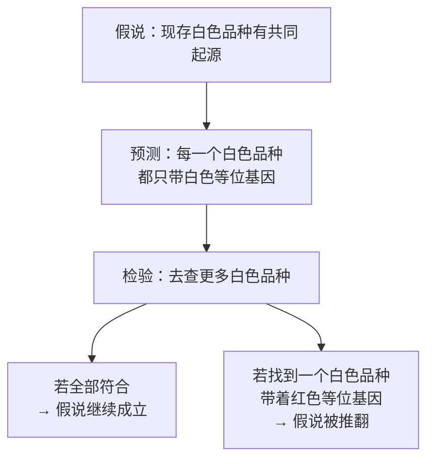

# 第 9 章 思考题参考答案

> 只记「问题 + 正确答案」，不记读者作答。案例题给**完整推理链**。
>
> 凡本书**尚未核到一手出处**的地方，答案里会明说——请不要把"待核"当成"已知"。

## Q1

**问**：为什么"现存白葡萄品种可能有共同起源"是可检验的结论？

**答**：

因为**证据是"等位基因的有无"这种离散的、可以逐个品种去查的形状**。

2007 年那项工作的关键句是：
**序列分析与标记信息确认，55 个白色品种全部携带白色等位基因、而不含红色等位基因。**

这句话之所以强，是因为它**可以被一个反例推翻**：

**再加一层机制上的合理性**：该位点由**两个相邻的、功能冗余的基因**组成
（*VvMYBA1* 与 *VvMYBA2*，**任一有功能就会显色**）。
要变白，**两个都得坏掉**，而且坏的方式各不相同
（一个是启动子插入逆转座子、一个是氨基酸替换加移码）。
**两次罕见事件同时发生在同一株上的概率极低**——
所以"它只发生过一次、然后被无性繁殖扩散开"是更省事的解释。

> **要带走的判断**：一个结论可不可检验，看它**能不能被什么东西推翻**。
> "白葡萄更优雅"无法被推翻，"所有白色品种都不含红色等位基因"可以。

## Q2

**问**：为什么按香气分子分组而不是按国家？给两个"按国家会分错"的例子。

**答**：

**根本理由**：国家/产区**不预测机制**，而香气分子类型**直接回答那个花钱的问题**——
"这个香气需要特定的葡萄，还是换个操作就能有？"（第 4 章）

**例子一：硫醇型不按国界分布。**
2000 年那项工作在**琼瑶浆（阿尔萨斯/德国系）、雷司令（德国系）、鸽笼白、
小满胜（法国西南）与贵腐赛美蓉**的酒中，
都测到 4MMP / 3MH / A3MH **显著高于感知阈值**。
按国家分，这些品种会被分到好几个格子里；
按分子分，它们和长相思共享同一套机制——**而这正是可以据以预判的部分**。

**例子二：同一个国家里机制完全不同的品种被硬凑在一起。**
"法国白葡萄品种"这一组里，同时装着
**长相思（硫醇型）、麝香类（萜烯型）、霞多丽（风格主要由工艺塑造）、
Ugni Blanc（主要流向蒸馏）**。
**这四者对'换一株酵母会怎样''换个桶会怎样''陈年会怎样'的回答完全不同**——
一个不能预测任何事情的分组，是没有用的分组。

**例子三（加分）：同一个品种在不同地方机制侧重也会变。**
雷司令既出现在硫醇那项研究里，又是 TDN（陈年型）的代表；
而 **TDN 含量依赖紫外线**，南北半球差异很大（2024）。
**按国家分组会把"同一个品种的两种风格"当成两个国家的特产。**

> **要带走的判断**：**分类法的好坏，取决于它能预测什么。**
> 国家分组能预测的只有"这瓶酒来自哪"——那酒标上本来就写着。

## Q3

**问**：2000 年那项研究对"品种香"这个概念做了什么修正？

**答**：

它把"**有 / 无**"修正成了"**多 / 少**"。

| 修正前的直觉 | 修正后的表述 |
|------------|------------|
| "4MMP、3MH 是长相思的品种香分子" | 这些分子在**多个品种**的酒中都能超过感知阈值（琼瑶浆、雷司令、鸽笼白、小满胜、贵腐赛美蓉）|
| "品种香 = 某品种独有的分子" | **品种香 = 一组共享分子的浓度组合**（哪些多、哪些少、比例如何）|

**三条推论**：

1. **"典型性"是一个统计概念，不是一个化学开关。**
   所以同一个品种在不同年份/产区可以离"典型"很远——这不是造假，是分布。
2. **"这支酒不像某某品种"往往是浓度组合的问题**，
   而不是"用错了葡萄"。（要判断是否用错葡萄，得查 DNA 或供应链，不是靠闻。）
3. **本书因此按分子分组**：分子是**共享的语言**，品种只是**配方**。

**还要叠上第 4 章的另一半**：即使前体总量相同，
**3MH 需要酶作用从结合态释放，而酿酒酵母释放效率不高**（2021）。
所以同样一批葡萄，不同酿造会给出**不同的"品种特征强度"**。

> **要带走的判断**：**"品种特征"是一个被酿造放大或压低之后的结果。**
> 把它当成葡萄的固有属性，会高估产地、低估酒窖。

## Q4

**问**："本酒芳樟醇 35 µg/L，超过阈值"——怎么回应？

**答**：

**回应要分三层，一层比一层重要。**

**第一层：它超过了哪个阈值？**

| 阈值 | 介质 | 35 µg/L 相对它 |
|------|------|---------------|
| **25 µg/L** | **模拟酒液** | 超过 |
| **50 µg/L** | **葡萄酒** | **没有超过** |

所以这份报告的说法**取决于它用了哪个阈值**，而它没说。
**在真酒这个基质里，35 µg/L 低于转引到的阈值。**

**第二层：这两个数字本身都是转引的。**
本书是通过 2025 年的一篇综述读到它们的，
原始出处（2015 年的萜类综述、Ribéreau-Gayon 等）**本书未读到原文**。
所以严格说，正确的表述是"**据转引，葡萄酒中的报告阈值约为 50 µg/L**"。

**第三层（最根本）：阈值是一次测量，不是常数。**
第 4 章已经用 β-大马士酮讲过一次：
**它在红葡萄酒中的阈值比在水醇溶液中高一千倍以上。**
芳樟醇这里只差两倍，但方向是一样的——**真酒基质里的阈值更高**。

**所以我的回应是**：

> "请问这个阈值的**介质**是什么？如果是模拟酒液，
> 那么在葡萄酒基质里通常需要更高的浓度才能被察觉——
> 转引到的葡萄酒阈值约为 50 µg/L，**35 µg/L 低于它**。
> 另外，即使超过阈值，还要考虑**增强与掩盖**（第 4 章 Q3）。"

> **要带走的判断**：**"超过阈值"这句话，不带介质就没有意义。**
> 这是本书第三次讲同一条规矩——因为它是酒类数字里最常被忽略的一条。

## Q5

**问**：逐句判断并改写这段电商文案。

> *"新西兰长相思，百香果与西柚香气爆棚，这是当地独一无二的风土造就的品种香；
> 我们的霞多丽为中性品种，因此完全靠橡木桶赋予风味；
> 本款年轻雷司令已具备标志性汽油香，说明品质卓越。"*

**答**：三句各踩中一个不同的知识点。

**第一句："香气爆棚 = 当地独一无二的风土造就"** → ⚠️ **缺了释放这一环**（第 4 章 Q5 的重演）。

链条是：**葡萄里的结合态前体 →（需酶作用释放）→ 游离硫醇 → 你闻到的香气**。
已核结果：3MH 在汁中**大量以谷胱甘肽/半胱氨酸结合态存在**，
且**酿酒酵母释放这些硫醇的效率并不高**（2021）。
所以"香气强度"至少有两个来源：**前体总量（可归因于产地与葡萄）**
与**释放率（属于酿造决策）**——只看成品**无法区分**。

> **改写**："本酒表现出明显的硫醇类品种香（西柚、百香果）。
> 这类香气的强度同时取决于葡萄中的前体含量与发酵中的释放条件；
> 我们使用的酵母/酶处理为 ____。"

**第二句："中性品种，因此完全靠橡木桶赋予风味"** → ⬜ **前提未经证实 + 逻辑跳跃**。

- **前提**："霞多丽缺乏品种香分子"——**本书未核到一手证据**，不能当作已知；
- **逻辑**：即使风格主要由工艺塑造，"工艺" ≠ "橡木桶"。
  霞多丽酒评里的高频词至少还涉及**苹果酸乳酸发酵与酒泥接触**（第 14 章）、
  **发酵温度与酵母**（第 3 章）——**把工艺窄化成橡木，是在替自己的成本做辩护**。

> **改写**："本款霞多丽的风格主要来自酿造选择：____ % 新桶、____ 个月桶陈、
> 是否进行苹乳发酵、是否搅桶。"

**第三句："年轻雷司令已具备标志性汽油香 = 品质卓越"** → ❌ **两处错误**。

1. **层级错误**：TDN 属于**陈年相关**的特征（第 4 章的三类香气）。
   在**年轻**酒里把它当卖点，与这个分子的来源不符，需要解释。
2. **把地域偏好当成普世标准**：TDN 含量**依赖紫外线**，
   **澳大利亚雷司令浓度最高、当地视为加分项**，
   而在**欧洲的雷司令中可能成为被拒绝的原因**（2024）。
   **同一分子、同一浓度，两地评价相反**——它不能当"品质"的证明。

> **改写**："本款已显现 TDN 带来的煤油/汽油气息。
> 这类气息与紫外线暴露相关，在不同市场的接受度差异很大——
> 喜欢与否因人因地而异。"

> **要带走的判断**：这段文案的三句话对应三种错误：
> **① 漏掉中间环节；② 用未经证实的前提为成本辩护；③ 把地域偏好包装成品质。**

## Q6

**问**："阿依伦是西班牙面积最大的白葡萄，所以是最好的"——问题在哪？

**答**：

**这是一个把"数量"直接读成"质量"的推理，而 OIV 报告里恰好有反证。**

**报告对 Airen 的原始描述包括**：

- **218 000 ha**，**占西班牙葡萄园的 22 %**，几乎只种在西班牙，是该国面积第一的品种；
- **生长周期长、树势与结实率都高、果串很大、产量高**（5~20 t/ha，视树势与灌溉而定）；
- **对多种病害抗性好**；
- 通常在**干旱炎热条件**下以**低密度**种植；
- 产出"**香气细微、酸度低**"的白葡萄酒，**常用于混酿**，**也用于蒸馏制烈酒**。

**把这些串起来，"面积大"实际上意味着**：

| 特性 | 对种植者的意义 |
|------|--------------|
| 高产、大果串 | 单位面积产出高 |
| 抗病性好、耐旱热 | 投入低、风险低 |
| 低酸、香气细微 | **适合混酿基酒与蒸馏**，而不是彰显个性 |

也就是说：**面积第一反映的是"在那套自然与经济条件下最合算"，不是"最好喝"。**

**同样的逻辑在全球尺度上也成立**（本章 §9.5）：
面积第一梯队里，**Sultanina 主要用于食用与制干**，
**Airen 与 Ugni Blanc 大量用于蒸馏**。
**"世界上最多的葡萄"与"酒单上最常见的葡萄"是两份不同的名单。**

> **要带走的判断**：面积数据回答的是"**种什么合算**"，
> 不是"**什么好喝**"。把两者混起来，是第 40 章要处理的那类误读的雏形。

## Q7

**问**：查一个白葡萄品种的亲本、面积与同物异名，哪一条最能帮你在酒单上做决定？

**答**：这是**查证题**，考的是过程。下面给出本书的判断与理由。

**三条信息的实际用途**：

| 信息 | 能帮你做什么 | 局限 |
|------|------------|------|
| **亲本** | 建立"品种家谱"的直觉，理解为什么某些品种风格相近 | **对当下点酒几乎没有直接帮助**——亲缘近不等于风格近（霞多丽与佳美同父母，风格天差地别）|
| **面积与主要产国** | 判断它是**大宗品种**还是**小众品种**，从而预期价格带与可得性 | 不预测风味 |
| **同物异名** | **在酒单/酒标上认出它**——尤其当同一个品种在两个国家叫不同名字时 | 需要现场能查 |

**本书的答案：在酒单上做决定时，最有用的是"同物异名"。**

理由很实际：**酒单是一个"认名字"的场景**。
你已经知道自己喜欢什么风格，问题只是**能不能认出眼前这一行字是不是它**。
OIV 报告里长相思的同物异名就包括 **Fumé Blanc、Blanc Fumé、Muscat Sylvaner、
Sauvignonasse** 等——**其中好几个看上去像是别的品种**。

**但要补一句更重要的**：

> **这三条信息加起来，都不如"这支酒的香气属于哪一组"有用。**
> 亲本、面积、别名都是**索引信息**；
> 而本章的分组（萜烯 / 硫醇 / 陈年 / 工艺主导）是**预测信息**。
> 点酒时真正的问题是"**它会是什么味道、我要为什么付钱**"。

## Q8

**问**：OIV 报告摘要说 5 %、词条说 4 %，引用时怎么处理？给出两种站得住的做法。

**答**：

**先把事实说清楚**：这份报告的**摘要**写赤霞珠占世界葡萄园面积的 **5 %**，
而**品种词条**写"341 000 ha，占世界葡萄园的 **4 %**"。
**同一份官方报告内部不一致**——这不罕见，通常源于**分母口径不同**
（是否含未投产面积、统计年份是否一致、是否只计有数据的 44 个国家等）。

**两种都站得住的做法**：

**做法一（本书采用的）：只引原始统计量，不引派生量。**

> 引用 "**341 000 ha（2015）**"，不引用百分比。
> **理由**：面积是被直接统计的量，百分比是用一个**未说明口径的分母**算出来的。
> 派生量出问题时，原始量通常还是好的。

**做法二：引用时把不一致本身写出来。**

> "据 OIV（2017），赤霞珠 2015 年的种植面积为 341 000 ha；
> 该报告在词条中记为占世界葡萄园面积的 4 %，在摘要中记为 5 %，
> **两处不一致，分母口径未说明**。"
> **理由**：如果你的文章确实需要百分比（例如讨论集中度），
> 那就**如实呈现分歧**，让读者自己决定权重。

**两种都不可接受的做法**：

- ❌ 随便挑一个数字用（尤其是挑更好听的那个）；
- ❌ 把两个数字平均成 4.5 %——**它们不是两次测量，是同一组数据的两种呈现**。

> **要带走的判断**：本书第 1 章说"关键数字要两个独立来源"，
> 这道题给出了它的日常形态：**连同一个来源内部都可能不自洽**。
> 所以真正的纪律不是"找两个来源"，而是**"每个数字都要能说出它是怎么来的"**。
