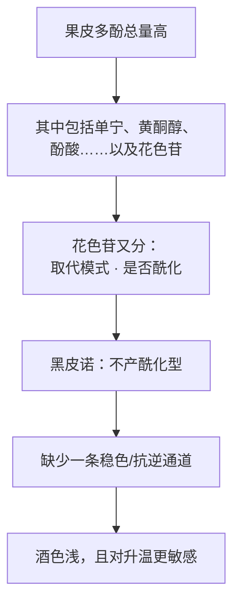
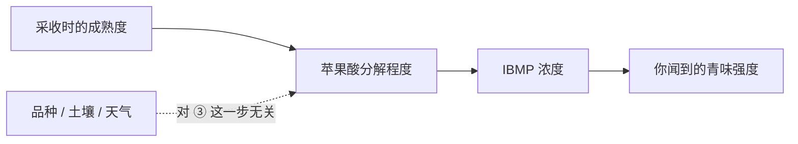

# 第 10 章 思考题参考答案

> 只记「问题 + 正确答案」，不记读者作答。案例题给**完整推理链**。
>
> 凡本书**尚未核到一手出处**的地方，答案里会明说——请不要把"待核"当成"已知"。

## Q1

**问**：一支红葡萄酒颜色很浅，列出至少三种机制上不同的原因，并说明如何区分。

**答**：

至少有**四条**（本章给了三条，第 12 章会补第四条）。

| # | 机制 | 一句话 | 要区分它，需要什么信息 |
|---|------|-------|--------------------|
| 1 | **花色苷的形态** | 品种产的是哪几类花色苷、是否酰化 | 品种名 + 该品种花色苷谱的文献（多数品种查不到）|
| 2 | **花色苷的浓度** | 果皮里到底有多少 | 葡萄的实测数据（酒庄通常不公开）|
| 3 | **可萃取性与萃取操作** | 泡了多久、多少度、怎么管理酒帽 | 浸皮时长、温度、帽管理方式（第 12 章）|
| 4 | **酒龄与色素转化** | 单体花色苷会转成聚合色素，色调由紫红转砖红 | 年份 + 储存条件（第 18 章）|

**两个可以立刻用的判据**：

- **看边缘而不是看中心**：杯壁边缘的色带宽度与色调，比"整体深不深"信息量大得多
  （中心的深浅极易被杯型与光线误导）。
- **先看年份**：如果是一支有年纪的酒，**"浅"很可能只是"老"**，而不是"薄"。

> **要带走的判断**：**"颜色浅"是一个结果，不是一个原因。**
> 在拿不到浸皮信息（通常拿不到）的情况下，
> 把颜色当品质指标，等于在用一个混杂了四种机制的变量做判断。

## Q2

**问**：为什么"黑皮诺果皮富含多酚"与"黑皮诺酒颜色浅"不矛盾？

**答**：

因为**"多酚"是一个大类，"颜色"只由其中一小部分负责，而且负责的那部分还分形态**。

OIV 对黑皮诺的原始描述是：果实**糖高、酸度中等、果皮富含多酚**，
产出**颜色浅**的酒。这两句写在同一段里，说明报告本身并不认为它们冲突。

**已核到的分子层面的一条原因**（2022 年 *Plants*）：

> **黑皮诺不产酰化花色苷。**

该研究在马尔贝克、梅洛、黑皮诺上把果实区平均日温提高 **1.5~2.0 ℃**，
发现升温普遍提高**酰化/非酰化花色苷的比值**，作者推测酰化可能是一种应激反应；
**而黑皮诺是唯一在采收期总花色苷显著下降的品种**——它没有这条通道。

> ⚠️ **同时要说清本书没证明什么**：
> 本书**没有**证明"黑皮诺花色苷总量低"（未核到可引用的一手区间），
> 也**没有**否定果皮厚薄与皮汁比的作用——只是那条机制本书未核到定量证据，因此不立论。

> **要带走的判断**：**"含量"与"形态"是两栏。**
> 大量通俗解释把所有颜色问题都归到"含量"上，
> 于是"皮厚就深、皮薄就浅"成了万能答案——它解释力强，但没有证据支撑。

## Q3

**问**：IBMP 的下降"与品种、土壤、天气无关"却"与苹果酸分解高度相关"，
这对"青椒味来自风土"意味着什么？

**答**：

意味着**这个说法把一个成熟度信号误读成了产地签名**。

**把 2000 年那项工作的三条结论摆在一起**：

1. 比较 **50 款**红波尔多与卢瓦尔酒，估得青椒特征变明显的门槛**约 15 ng/L**；
2. 对 **89 款**红波尔多的统计显示**赤霞珠系更常出现**该特征；
3. 成熟过程中 **IBMP 的下降与苹果酸的分解高度相关**，
   **且与品种、土壤类型、天气条件无关**。

第 2 条常被单独拿出来当"品种特征"的证据，但第 3 条把因果关系重新排了：

**注意这条链没有否定品种的作用**——赤霞珠系确实**更常**出现该特征（第 2 条），
OIV 也写"**若葡萄采收偏早，则吡嗪存在**"。
但**品种决定的是起点有多少，成熟度决定的是掉到哪里**。

**所以"青椒味是波尔多风土的印记"这句话的问题是**：

- 它把一个**时间变量**（采收决策）说成了**空间变量**（产地）；
- 而已核到的证据恰恰说这个下降过程**与土壤类型无关**。

> **要带走的判断**：第 8 章的老规矩在这里又出现一次——
> **凡是把"可以被别的因素解释的现象"独占给风土的说法，都要先问那个别的因素排除了没有。**

## Q4

**问**："我们浸皮 21 天以追求柔顺"——怎么理解？

**答**：

**先不判断好坏，只说它必然带来了什么。**

已核到的萃取时序（2026 年 *Foods* 综述整理的文献共识）：

| 组分 | 时间特征 |
|------|---------|
| 单体花色苷 | 通常在**头 4~7 天**达到最高，随后**下降**（被酵母与固体吸附、并入聚合色素、降解）|
| 皮来源的黄烷-3-醇 | **约五天达到最大值的 80~85 %** |
| 籽来源的化合物 | **需十天以上**；外层脂质角质层是扩散屏障，随**乙醇浓度上升**才逐步突破 |
| 赤霞珠总单宁 | 一项研究中**约在第 9 天**达到峰值 |

**所以浸皮 21 天必然意味着**：

1. **单体花色苷早已过了峰值**——浸到第 21 天，它的浓度多半在下降段；
2. **增加的主要是籽来源的单宁**，尤其是**没食子酰化**的那部分；
3. **风险窗口被拉长**：发酵结束后酒失去 CO₂ 保护，氧暴露与微生物风险都上升，
   所以这类工艺通常配合充 CO₂ 顶空与温度控制。

**那"柔顺"从哪来？** 有两条已核到的可能，方向相反，所以本书并列：

- 一项 2013 年 *J. Agric. Food Chem.* 的对照试验（赤霞珠，10 天 vs 30 天皮接触）显示：
  延长浸渍**导致花色苷损失、原花青素萃取增加**，其中**约 73 % 为籽来源**，
  单体黄烷-3-醇与低聚、高聚原花青素浓度**都更高**——
  **这看起来不像"更柔顺"，更像"更厚重"**；
- 但综述也引到：**温暖条件下的发酵后延长浸渍在波尔多红酒上被报告可软化涩感、增强甜感**。

**所以正确的回应是提问，而不是下判断**：

> "请问 21 天是**发酵中**还是**发酵结束后**？温度维持在多少？
> 你们观察到的柔顺，是与多长的对照组比出来的？"

> **要带走的判断**：**工艺参数本身不是承诺。**
> 同一个"21 天"，配不同的温度、不同的葡萄、不同的对照，能得出相反的结论。
> 一个数字如果没有对照组，它只是一个数字。

## Q5

**问**：逐句判断并改写这段文案。

> *"本款赤霞珠颜色极深，证明葡萄品质卓越；标志性的青椒香气是波尔多风土的印记；
> 单宁全部来自果皮，因此柔顺无涩；黑胡椒气息明显，闻不到说明您的味蕾还需要训练。"*

**答**：四句各踩中一个不同的知识点。

**第一句："颜色极深 = 品质卓越"** → ❌ **混淆了至少三条机制**。

颜色由**花色苷形态、浓度、可萃取性**共同决定（本章 §10.1），再叠加**浸皮时长与温度**
（第 12 章）与**酒龄**（第 18 章）。同一批葡萄，浸皮 5 天与 15 天的颜色差别，
可能大于两个产区之间的差别。**而这些信息酒标上通常都没有。**

> **改写**："本款颜色深浓，边缘呈 ____ 色带。我们的浸皮时长为 ____ 天，
> 发酵温度 ____ ℃。"

**第二句："青椒香气是波尔多风土的印记"** → ⚠️ **把成熟度信号说成了产地签名**（见 Q3）。

IBMP 的下降与**苹果酸分解高度相关**，且**与品种、土壤类型、天气条件无关**（2000）。
OIV 的写法是"**若采收偏早则吡嗪存在**"。

> **改写**："本款带有轻微的植物性气息（甲氧基吡嗪），这与采收成熟度相关；
> 我们的采收日期为 ____，采收时糖度 ____。"

**第三句："单宁全部来自果皮，因此柔顺无涩"** → ❌ **两处错误**。

1. **事实上做不到**："全部来自果皮"意味着浸皮必须短到籽单宁来不及出来
   （籽来源**需十天以上**），而那样的酒通常颜色与结构都很轻——与第一句的"颜色极深"冲突。
   **这两句话互相打架。**
2. **逻辑上也不成立**：皮单宁同样会带来涩感。涩的强弱与**分子大小分布**相关
   （第 1 章：平均聚合度高的更"粗糙干"，低的更"顺滑"），**不是与"来自哪里"一一对应**。

> **改写**："本款的单宁以皮来源为主（浸皮 ____ 天）。若您偏好更轻的结构，本款适合。"

**第四句："闻不到黑胡椒说明味蕾需要训练"** → ❌ **拿个体差异当水平差异**。

rotundone 的嗅盲比例在两项研究中分别为约 **1/5~1/4**（2008，受训人群）与约 **40 %**
（2020，非专业消费者）；**嗅盲的定义性特征是"提高浓度也无效"**——
2008 年那项工作里，嗅盲者在浓度高达 **4000 ng/L** 时仍闻不到（第 2 章）。

> **改写**："本款可能呈现黑胡椒气息。该气息来自 rotundone，
> **相当比例的人在生理上闻不到它**，这与品鉴经验无关。"

> **要带走的判断**：这段文案的四句话，**有两句在互相矛盾**（第一句与第三句）。
> 这是辨别话术最省力的一招：**不必逐条查证，先看它自己一致不一致。**

## Q6

**问**：用 OIV 国家表反驳"法国种得最多的是赤霞珠 / 意大利记住桑娇维塞就够了"。

**答**：

**第一句错在事实。** OIV 国家表（2015 口径）：

| 法国 | 面积 | 占比 |
|------|------|------|
| **梅洛** | **112 000 ha** | **13.9 %** |
| Ugni Blanc | 82 000 | 10.2 % |
| 歌海娜 | 81 000 | 10.0 % |
| 西拉 | 64 000 | 7.9 % |
| 霞多丽 | 51 000 | 6.3 % |
| **赤霞珠** | **48 000** | **6.0 %** |

**赤霞珠在法国排第六**，面积不到梅洛的一半。报告还专门写了一句：
**梅洛是法国唯一超过 100 000 ha 的品种。**

**第二句错在方向。** 意大利表显示：**十大品种只占全国面积的 38 %**，
第一名桑娇维塞 **54 000 ha**（7.9 %）是唯一超过 50 000 ha 的品种。

也就是说：**记住十个品种，你也只覆盖了意大利的 38 %。**
"记住桑娇维塞就够了"覆盖的是 **7.9 %**。

**两处错误共同反映的思维习惯**：

> **把"名气"当成"体量"。**

赤霞珠名气大（OIV 称其为分布最广的品种之一），于是被默认为"法国第一"；
桑娇维塞名气大，于是被默认为"意大利的代表"。
但**名气是传播的结果，面积是农业与经济的结果**——两者只在部分情况下重合。

**同一个习惯还会以别的形式出现**（第 9 章已遇到一次）：
"世界上种得最多的葡萄"实际上是**巨峰**（365 000 ha，鲜食，九成以上在中国），
而中国**近三分之二**的葡萄园种的是鲜食品种。

> **要带走的判断**：**面积表是最便宜的反直觉训练。**
> 它不需要你品尝任何东西，就能纠正一整套靠传播形成的印象。

## Q7

**问**：查一个红品种的亲本、面积、花色苷谱。记录你是怎么确认"查不到"的。

**答**：这是**查证题**，考的是过程与记录方式。

**三类信息的可得性差别极大**：

| 信息 | 典型可得性 | 到哪里查 |
|------|----------|---------|
| **亲本** | 中等——主流品种多有专门的亲子分析论文 | 文献检索（Crossref / Europe PMC / OpenAlex）+ 公共品种数据库 |
| **面积与产国** | 高——但**只覆盖 OIV 报告收录的范围** | OIV 报告本身（注意它只覆盖世界葡萄园面积的 75 %、44 个国家）|
| **花色苷谱** | **低**——多数品种没有公开、可引用的系统数据 | 专业文献；常常只能找到单项研究里的对照数据 |

**"确认查不到"的正确记录方式**（这才是本题的重点）：

> 不要写"查不到"三个字就结束。要写：
>
> 1. **我用了哪些检索词**（中英文各列出来）；
> 2. **我查了哪些库**（以及哪些库对我返回了 403 / 需要付费）；
> 3. **我找到了什么"接近但不是"的东西**——例如"只找到该品种与另一品种对比时的
>    单篇数据，没有独立的品种谱"；
> 4. **我因此不写什么**。

**本书自己的示范**：第 10 章 §10.11 的"本章有意留白"一节，逐条写明了
"未核到什么 → 因此正文不写什么"。这不是免责声明，**它是这本书最有信息量的部分之一**：
它告诉你，市面上那些写着这些数字的资料，**至少在公开文献里是没有依据的**。

> **要带走的判断**：**"查不到"是一个结果，不是一次失败。**
> 一个被记录清楚的"查不到"，比一个来路不明的数字有用得多。

## Q8

**问**：什么时候"方向"比"数字"有用？什么时候反过来？

**答**：

**先给结论**：

| 场景 | 更有用的是 | 理由 |
|------|----------|------|
| **做选择**（买哪支、点哪支、配什么菜）| **方向** | 你要的是"比另一支更酸还是更不酸"，不是绝对值 |
| **做比较**（这支与上次那支差在哪）| **方向** | 你的舌头本来就是一个比较器，不是测量仪（第 2 章）|
| **判断某句话对不对** | **方向 + 机制** | 大部分话术错在机制，不在数值 |
| **合规与交易**（进出口、检测、投诉）| **数字** | 法规写的是数字，且有法定测定方法 |
| **复现某个工艺** | **数字** | 温度、天数、剂量必须可复制 |
| **发现"不对劲"** | **数字** | 例如总 SO₂、挥发酸超出法定上限（第 5、31 章）|

**为什么本章一个酚类数字都没给**：

因为本书**未核到**任何品种的可引用酚类区间。
而在这种情况下给数字，会造成一种特别难纠正的错觉——

> **数字看起来像知识，其实是一种对精度的承诺。**
> 一旦写下"赤霞珠单宁 x g/L"，读者就会用它去比较、去判断、去质疑别人，
> 而这个数字本身没有出处。

**反过来，方向性结论的可靠性来自它的稳健性**：
"赤霞珠单宁感强于梅洛"这个方向，在 OIV 的农艺描述、在混酿实践
（OIV：梅洛"可与更具单宁感的酒混调以取得平衡"）、在消费者印象里**是一致的**；
它不依赖任何一次测量。

> **要带走的判断**：**这本书宁可少给一个数字，也不给一个没有出处的数字。**
> 判断一份资料是否可信，可以先看它在**该给数字的地方**给了没有
> （法规限值、检测结果），以及在**不该给数字的地方**克制了没有（品种的"典型含量"）。
