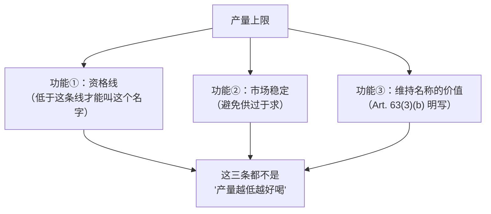
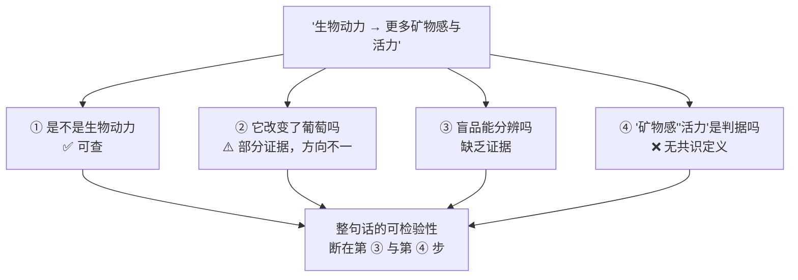
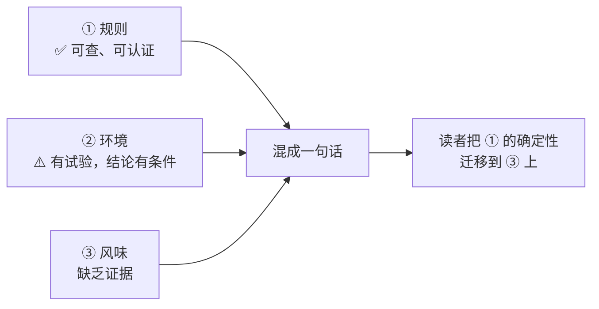

# 第 11 章 思考题参考答案

> 只记「问题 + 正确答案」，不记读者作答。案例题给**完整推理链**。
>
> 凡本书**尚未核到一手出处**的地方，答案里会明说——请不要把"待核"当成"已知"。

## Q1

**问**：为什么"最高产量写进产品规范"不等于"产量越低酒越好"？

**答**：

因为**这两句话里的"产量"在做两件完全不同的事**。

**法规里的产量上限是一条边界条件。** (EU) No 1308/2013 **Art. 94(2)(e)**
要求 PDO/PGI 的产品规范"至少"包含每公顷最高产量，
它与地理区域划定、品种、允许的酿酒操作并列——
**它们共同定义的是"什么样的酒有资格用这个名字"，而不是"什么样的酒更好喝"。**

**而 Art. 63(3) 把另一个动机写在了明处**：
成员国限制发放新种植授权，须以下列理由之一证成——

1. 避免**已被充分证明的供过于求风险**；
2. 避免**某个 PDO/PGI 被显著贬值的风险**。

**再叠上试验证据**：在一项同时比较地块、疏果与发酵方式的梅洛试验里，
**疏果（降低单株负载）在感官上没有造成显著差异**，
而**地块与发酵方式都造成了显著差异**。

> **要带走的判断**：**约束条件不是因果解释。**
> 产量上限保证的是"没有被无限稀释"，
> 它不保证、也没打算保证"这瓶比那瓶好喝"。

## Q2

**问**：引用 OIV 的产量区间却删掉脚注，会造成什么误导？

**答**：

**会把一句"我们也测不准"变成一句"这是标准值"。**

OIV 在产量数据的脚注里写得非常清楚：

> 产量参数取决于**多个变量**：气候条件、土壤类型、灌溉、施肥、**架式**、
> **株型大小**、**行距与株距**、**行向**等等。
> **因此，很难为每个品种确定一个准确的平均产量值。**

**被删掉脚注之后，会发生三件事**：

| 被删的信息 | 读者会以为 | 实际上 |
|-----------|----------|-------|
| "取决于多个变量" | 这是品种的固有属性 | 它主要是**栽培决策的结果** |
| "很难给出准确平均值" | 这是一个可比较的标准 | 报告自己说它**不适合当标准** |
| 区间的宽度被无视 | 落在区间里就"正常" | 赤霞珠的区间是 **2~14 t/ha**，**上下差七倍** |

**第三条最致命。** 一个跨度七倍的区间，几乎不可能被证伪：
无论一个酒庄报什么数，都能"落在 OIV 给的范围内"。
**一个不可能被证伪的指标，不能用来做判断。**

> **要带走的判断**：**引用一个数字时，把它的限定条件一起引用，
> 是引用纪律最基本的一条。** 本书第 9 章遇到的是"同一份报告内部不一致"，
> 这里遇到的是另一种常见形态：**数字被从它的免责声明里剥出来单独流通**。

## Q3

**问**：那项梅洛试验的结果**不能**被用来证明什么？

**答**：

至少有四条**不能**得出的结论。

| ❌ 不能说 | 为什么 |
|----------|-------|
| "疏果没有用" | 这是**一个品种、两个地块、两个年份、两档负载**的试验。"在这项设计里没测到显著感官差异"**不等于**"疏果在任何条件下都无效"。特别是：两档负载的**差距有多大**决定了这项检验的灵敏度 |
| "产量与品质无关" | 试验测的是**疏果**（同一片园子里减少单株果串数），**不是**跨越 2 t/ha 到 14 t/ha 的产量梯度。**小范围内测不到差异，不能外推到大范围** |
| "地块比工艺重要" | 试验里**发酵方式的影响大于负载**，而发酵方式属于**工艺**。所以正确的排序是"地块 ≈ 发酵方式 > 负载"，不是"园里 > 窖里" |
| "3MH 高的酒更好" | 3MH 只是**区分两个地块的分析标记**（B 地块高 38~130 %），试验没有说哪个地块的酒更受偏好 |

**还有一条容易被忽略的**：

> 该试验报告疏果使 pH **显著升高 0.03~0.08 个单位**。
> **"统计显著"与"有意义"是两回事**——0.03~0.08 的 pH 变化在感官上意味着什么，
> 这项试验并没有回答（而它的感官评价恰恰**没有**发现显著差异）。

> **要带走的判断**：单项试验最有价值的用法，是**限制你能说的话**，而不是**扩大**它。
> 本书引用它，是为了说明"低产=好酒"**缺少这一类证据的支持**，
> 而不是为了反过来证明"疏果无效"。

## Q4

**问**：为什么"树冠约三层叶"比"低产=好酒"更容易被检验？

**答**：

因为**它的每一环都是可测量的物理量，而且中间没有跳步**。

对比"低产=好酒"：

**具体差别有三条**：

1. **自变量的定义清楚**：叶层数是数出来的，"好酒"不是。
2. **中介变量存在且可测**：光与温度。而产量与品质之间**缺一个公认的中介变量**——
   常被提出的"每颗果分到的资源"并没有一个标准测法
   （§11.2 提到的**产量/修剪重量比**是一个候选，但本书未核到普适阈值）。
3. **可以做剂量—反应**：叶层数可以设成 1、2、3、4 层做梯度；
   而"好酒"没有一个可以做梯度的刻度。

**顺带一提**：Smart 1985 那篇综述给的不只是"三层叶"，
还给了**什么会加重遮阴**（每公顷新梢数多、行距宽、树势高、叶片偏垂直）
与**什么能减轻**（窄行、分冠）——
**这四加二条全都是可以在一块地里直接改的操作变量**。

> **要带走的判断**：判断一个论断值不值得认真对待，
> 有一个省力的办法：**问它的因果链上有没有一个可以被测量的中间环节。**
> 有，就可以检验；没有，那它更接近一句口号。

## Q5

**问**：逐句判断并改写这段酒庄文案。

> *"我们采用生物动力法，严格控制产量在 25 hL/ha 以下；
> 老藤天然低产，加上生物动力制剂改良了土壤，因此我们的酒有着无法复制的深度；
> 有机种植让葡萄更健康，产量与常规无异。"*

**答**：四句各踩中一个不同的知识点，而且**最后一句与第一句自相矛盾**。

**第一句："严格控制产量在 25 hL/ha 以下"** → ✅ **可核查，但要问一句**。

这是一个**具体、可验证**的陈述，值得肯定。要问的只有一句：
**这个数字与该产区产品规范里 Art. 94(2)(e) 规定的上限相比是多少？**
"严格控制"只有在**与法定上限对比**时才有信息量。

> **改写**："本园产量控制在 25 hL/ha，产区规范的上限为 ____ hL/ha。"

**第二句："老藤天然低产"** → 缺乏证据（两处都是）。

- **"老藤"本身**：本书**未在已核对的欧盟条文中见到该词的法定年限定义**（第 6 章已登记）——
  也就是说，"老藤"在酒标上不是一个受约束的词；
- **"低产因此深度"**：这一环见 Q1 与 Q3。

> **改写**："本园葡萄树种植于 ____ 年。"（**给年份，而不是给形容词**。）

**第三句："生物动力制剂改良了土壤"** → ⚠️ **设计最干净的那项试验没测到**。

加州那项试验的设计正是为了单独回答这个问题：**4.9 ha 商业梅洛园、两个处理
（生物动力 vs 有机对照）、各四次重复、随机完全区组、所有管理措施相同，
唯一的差别就是加不加那套制剂。** 结果：

- **前六年土壤质量没有差异**；
- 叶组织养分、每株果串数、单株产量、果串重、果粒重**都没有差异**；
- **但**产量/修剪重量比**有显著差异（p<0.05）**，2003 年生物动力处理的**糖度显著更高**，
  总酚与总花色苷**值得注意地更高（p<0.1）**。

作者自己的措辞是：**制剂"可能影响树冠与果实化学"，但"未被证明影响本研究测量的土壤参数与组织养分"。**

> **改写**："我们使用生物动力制剂。已发表的长期对照试验在土壤参数上未发现差异，
> 但在树体平衡与果实化学上报告过差异。"
> （**这样写反而更可信**——因为它可以被查证。）

**第四句："有机种植让葡萄更健康，产量与常规无异"** → ❌ **与两类证据都不符，且与第一句冲突**。

- **产量**：全球 meta 分析给出 **5 % / 13 % / 34 %** 三档低产情形；
  盖森海姆的雷司令三方对照中，**有机与生物动力的生长与产量都显著低于集约处理**。
- **"更健康"**：同一项试验里，有机与生物动力的**产量部分因霜霉病更重而下降**——
  在病害这个意义上，**恰恰相反**。
- **自相矛盾**：第一句刚说"**严格控制产量**"（即刻意压低），
  第四句又说"**产量与常规无异**"。两句话不能同时成立。

> **改写**："我们采用有机种植。植保方案排除合成药剂，因此在多雨年份霜霉病压力更大，
> 产量波动也更大。"

> **要带走的判断**：和第 10 章 Q5 一样——**先看它自己一致不一致**。
> 这段文案不需要任何文献就能看出问题：**"严格控产"与"产量无异"同时出现**。

## Q6

**问**：拆解"这支酒是生物动力的，所以你能尝出更多的矿物感和活力"。

**答**：

这一句话里叠了**四个需要分别检验的断言**。

| # | 断言 | 证据状况 |
|---|------|---------|
| 1 | **这支酒确实按生物动力法生产** | ✅ **可核查**——看有没有第三方认证（Demeter 等私营标准）。这是四条里唯一容易验证的 |
| 2 | **生物动力法改变了葡萄** | ⚠️ **部分有证据**：加州试验测到**产量/修剪重量比**与 2003 年**糖度**的差异（p<0.05），总酚与花色苷 p<0.1；但**土壤参数与组织养分无差异**。盖森海姆试验则报告**果实品质不受管理体系影响** |
| 3 | **这些改变能在盲品中被察觉** | 缺乏证据——本书未核到设计可靠的盲品对照 |
| 4 | **被察觉出来的是"矿物感"与"活力"** | ❌ **这两个词本身就不成立为判据**（第 5、8 章已处理）|

**第 4 条值得展开，因为它是前面几章的复习**：

- **"矿物感"**：对近一千七百名法语消费者的研究显示，**该词不存在精确定义**，
  即使在专业人士之间也无法识别出共识含义；不同经验层次的人所指完全不同
  （矿泉水的离子 / 风土概念 / 燧石味 / 酸度）。
  "土壤矿物直接进入酒"在地质学上讲不通（岩石无味、不易挥发、酒中矿质元素常低于感知阈值）。
- **"活力"**：本书没有、也找不到任何可测量的对应物。

**所以完整的拆解是**：

**一句得体的回应**（不抬杠，但把问题问准）：

> "生物动力是可以查认证的。不过'矿物感'这个词，不同的人指的东西差别很大——
> 您指的是**燧石/火柴那类气息**，还是**酸度带来的那种紧绷**？"

> **要带走的判断**：**把一句复合断言拆成可分别检验的几条，是本书最常用的一招。**
> 拆开之后你会发现，争议往往不在第一条（那条通常是真的），而在最后一条。

## Q7

**问**：查一个 PDO 产区的产品规范，对照 Art. 94(2) 的九项。

**答**：这是**查证题**，考的是过程。下面给出本书的预期与判据。

**九项的清单**（照 Art. 94(2) 原文顺序）：

(a) 名称｜(b) 酒的描述｜(c) 特定酿酒操作与限制｜(d) 地理区域划定｜
**(e) 每公顷最高产量**｜(f) 品种｜(g) 与地理环境的联系｜(h) 适用的欧盟/国家要求｜
(i) 核查机构及其任务。

**做这道题时最常见的三种情况**：

| 情况 | 通常的真实原因 |
|------|-------------|
| "(e) 我找到了，但单位是 hL/ha 不是 t/ha" | 法规文本里两种都可能出现；**t/ha 与 hL/ha 不能直接换算**，中间隔着出汁率，而欧盟**禁止过度压榨**（第 13 章）|
| "(g) 与地理环境的联系那一节写得像散文" | 这一项确实允许描述性表述；**但它必须给出"依据（details bearing out the link）"**，看它有没有具体的气候、土壤、历史材料 |
| "(i) 我没找到核查机构" | 多数规范会在最后一节给出机构名称、地址与任务；找不到通常是**文件被拆成了多个附件** |

**判断"这个产区在意什么"的一个简单方法**：

> 比较 **(c) 酿酒操作与限制** 和 **(e) 最高产量** 两节的**篇幅与具体程度**。
> 有的产区把陈年时间、容器类型、最低酒精度写得极细（说明它在管**风格**），
> 有的产区几乎只写产量与品种（说明它主要在管**来源**）。
> **第四部分会反复使用这个对比。**

> **要带走的判断**：**产品规范是酒标背后唯一的"源代码"。**
> 读过一份之后，你对酒标上任何一个受法律约束的词的理解，都会上一个台阶。

## Q8

**问**：为什么宣传材料常把"规则 / 环境 / 风味"三个问题混在一句话里说？

**答**：

因为**这三者的证据强度依次递减，而混在一起时，最强的那条会给最弱的那条背书**。

**一个典型句式**：

> "我们通过了**有机认证**（①，真），**不用合成农药，善待土壤**（②，部分真、有条件），
> **所以酒里有更纯粹的果味**（③，缺乏证据）。"

三个分句用"所以"串起来，读者验证了第一句（确实有认证），
就倾向于接受整串——**这是一种很有效、而且通常不需要说谎的说服结构**。

**这种混合对判断做了三件事**：

1. **转移了举证责任**：读者去查认证（容易且会成功），而不去查风味主张（困难且查不到）；
2. **把"立场"包装成"品质"**：认证反映的是**生产方式的选择**，不是成品的感官属性；
3. **让反对意见显得像在反对环保**——而实际上质疑的只有第三句。

**本书的应对就是 §11.5 开头那张图**：**先拆成三问，再逐条看证据。**
拆开之后可以做到一件很重要的事：

> **可以同时认可①与②，并且拒绝③**——
> 这不矛盾，而且是目前证据状况下最诚实的位置。

> **要带走的判断**：同样的结构在别处还会反复出现——
> "老藤（可查年份）+ 低产（可查数字）+ 因此复杂度高（查不到）"，
> "橡木桶产地（可查）+ 烘烤程度（可查）+ 因此更优雅（查不到）"。
> **看到"所以"两个字，就回头数一数：前面几句的证据强度一样吗？**
