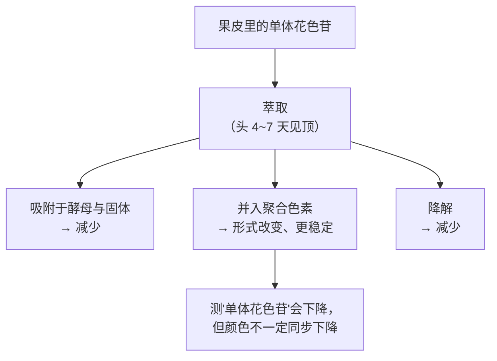
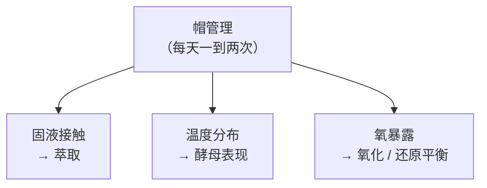
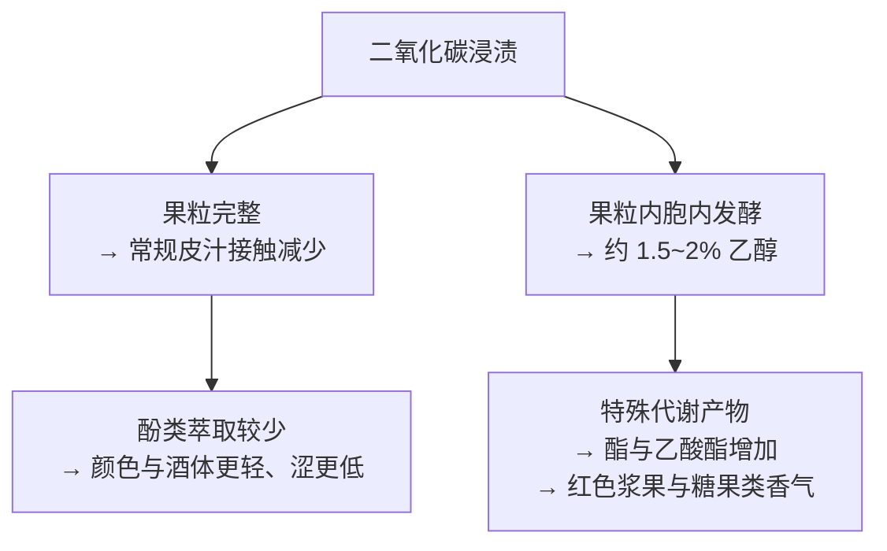

# 第 12 章 思考题参考答案

> 只记「问题 + 正确答案」，不记读者作答。案例题给**完整推理链**。
>
> 凡本书**尚未核到一手出处**的地方，答案里会明说——请不要把"待核"当成"已知"。

## Q1

**问**：为什么浸皮时长影响的是花色苷的**组成与稳定性**，而不只是浓度？

**答**：

因为**被萃取出来的花色苷并没有停在那里等你，它一直在反应**。

综述的原话大意是：**浸渍时长主要影响花色苷的组成与稳定性，而不是简单地影响浓度**；
更长的浸渍**不一定**带来更高的花色苷水平，但可能**促进它们转化为更稳定的形式**，
包括**聚合色素**，并增强与其他酚类的相互作用。

**单体花色苷下降的三条已核到的去向**：

| 去向 | 结果 |
|------|------|
| **被酵母与固体吸附** | 真的少了（被带走）|
| **并入聚合色素** | 不是消失，是**换了一种形式继续提供颜色**，而且更稳定 |
| **化学降解** | 真的少了 |

**所以有两个指标必须分开**：

- **单体花色苷浓度**：会见顶、会下降；
- **颜色（色强与色调）**：由单体与聚合色素**共同**决定，走势可以不同。

> **要带走的判断**：**"测到的下降"与"看到的变浅"不是一回事。**
> 这也是为什么本书在第 10 章说"颜色浅至少有四条来路"——
> 其中一条就是**酒龄与色素转化**。

## Q2

**问**：皮单宁与籽单宁的时间差，化学上的原因是什么？为什么乙醇是关键？

**答**：

**两件事的叠加：位置不同，以及那个位置外面有一层屏障。**

| 组分 | 化学特征 | 物理障碍 | 结果 |
|------|---------|---------|------|
| **皮来源黄烷-3-醇** | **水溶性好** | 细胞壁在破碎与酶作用下已被削弱 | **约五天达最大值的 80~85 %** |
| **籽来源原花青素** | 分子量高、**水相溶解度有限**；结构上还受种子内部约束 | **外层脂质角质层是扩散屏障**，造成**初始滞后期** | **需十天以上** |

**乙醇的角色**：

> 综述的表述是：籽单宁的滞后期**随发酵中乙醇浓度上升而被逐步克服**；
> 但**乙醇并非严格必需**——在水相条件下也能释放，**只是效率较低**。

所以乙醇在这里是**溶剂极性的调节器**：它能溶解脂质角质层、
也提高了高分子量、低极性化合物在液相中的溶解度。

**这直接解释了三件本章反复出现的事**：

1. **为什么发酵前的冷浸渍与发酵中的浸皮不是一回事**——
   前者是**水相、无乙醇**，"溶剂极性决定了萃取的选择性"；
2. **为什么发酵后延长浸渍萃取的主要是籽单宁**——
   那时乙醇浓度最高（那项赤霞珠试验里 30 天组的原花青素**约 73 % 来自籽**）；
3. **为什么"我们只要皮单宁"在时间上很难做到**——
   经典浸皮发酵本身就是 7~14 天。

> **要带走的判断**：**萃取是溶剂问题。**
> 把"泡"理解成"泡久一点就多一点"，会漏掉最重要的那个变量：**泡在什么里面。**

## Q3

**问**：帽内温度可高出下方液体多达 14 ℃，这带来哪些必须被管理的后果？

**答**：

至少**五条**，综述里提到的就有四条。

| # | 后果 | 为什么必须管 |
|---|------|------------|
| 1 | **温度梯度促进萃取** | 这是"好"的一面，但不可控就变成不均匀 |
| 2 | **过高的温度伤害酵母表现** | 可能导致发酵迟缓甚至中止（第 3 章的 stuck fermentation）|
| 3 | **压实或混合不良的帽限制内层萃取** | 帽内部没有直接接触发酵液的部分**泡不到** |
| 4 | **帽的表层更易氧化** | 它暴露在罐内顶空 |
| 5 | **罐内不同位置的发酵进度不同步** | 温度差异 → 酵母活性差异 → 同一罐里"几批酒" |

**这就是为什么帽管理同时在管三件事**：

**第三条正是那项歌海娜试验测到的**：**不压帽的酒还原味显著更高（5.02 vs 3.50）**。
还原类气味与低氧环境相关（第 31 章会展开）——
**不做帽管理 = 减少了氧进入的机会**，这个后果是机制上可预期的。

> **要带走的判断**：**帽管理不是"搅一搅"这么简单的动作。**
> 它是同一个操作同时在调三个旋钮——这也是为什么
> "对香气感知的影响大于温度，对挥发物浓度的影响小于温度"这种看似矛盾的结果能同时出现：
> **它们量的是不同的东西。**

## Q4

**问**：二氧化碳浸渍的酒"颜色与酒体更轻、更果味"，两项分别归到哪一层机制？

**答**：

**两项走的是完全不同的路。**

**① 颜色与酒体更轻 → 酚类萃取那一层（本章 §12.2 的曲线）**

在二氧化碳浸渍中，果粒**保持完整**，汁液与皮的常规接触被大幅推迟或减少；
真正的液相发酵只在容器底部由自身重量压出的那部分汁里开始。
所以与常规对照相比，综述报告**倾向于更低的花色苷与总酚**
（西拉、Cascade、丹魄与 Graciano 的研究），感官上**颜色与酒体更轻、涩感更低**。

⚠️ **但要并列一条反向结果**：另一项丹魄研究报告 CM 酒**色强更高、
酚类与聚合色素更高、vitisin A 与 vitisin B 更高**（后两者是与长期颜色稳定性相关的
吡喃花色苷）。综述把差异归因于**果粒内乙醇的形成**与**品种间果皮韧性的差别**。

**② 更果味 → 第 4 章的"二类香气"那一层**

果粒在缺氧富 CO₂ 环境中**从呼吸转为发酵性无氧代谢**，
在酵母发酵开始前就在果粒内部生成**约 1.5~2 %** 的乙醇。
这套代谢产生的产物与常规酵母发酵不同：
丹魄上报告**总酯与乙酸酯增加**，歌海娜与佳利酿上报告
**二氢肉桂酸乙酯、3-巯基己醇与肉桂酸乙酯更高**。

> **要带走的判断**：**这是全书最干净的一个"二类香气"案例。**
> 那股草莓糖果味**既不来自葡萄品种，也不来自橡木**，
> 它来自一种**特定的代谢状态**——换句话说，**它是做出来的，而且可以被复制**。
> 按第 4 章的定价逻辑：**这一类特征不构成原料溢价的理由。**

## Q5

**问**：逐句判断并改写这段文案。

> *"本款浸皮长达 45 天，因此颜色极深、单宁极其柔顺；
> 我们坚持 100 % 带梗发酵以获得最纯粹的果味；
> 发酵温度全程 34 ℃ 以最大化萃取；为保证品质，我们把皮渣压榨到不含一丝酒液。"*

**答**：四句各踩一个知识点，**最后一句可能违法**。

**第一句："浸皮 45 天 → 颜色极深 + 单宁极其柔顺"** → ❌ **两处与曲线冲突，且内部矛盾**。

- **颜色**：单体花色苷**头 4~7 天见顶后往往下降**。45 天之后，
  酒里的颜色主要由**聚合色素**提供——**可能确实稳定，但"极深"不是浸皮时长的自动结果**；
- **单宁**：一项赤霞珠对照（10 天 vs 30 天）显示延长浸渍使原花青素**全面升高**，
  其中**约 73 % 来自籽**，且单体、低聚、高聚各档**都更高**。
  综述也提示延长浸渍可能导致**过度单宁萃取**，带来**过苦与过涩**；
- **内部矛盾**：这句话同时声称"萃取到极致"（45 天）与"结果极其柔顺"，
  **却没有说明是靠什么达成的**。⚠️ 注意：本书**不说它一定做不到**——
  综述确实引到**温热的发酵后延长浸渍在波尔多红酒上被报告软化涩感、增强甜感**。
  但那是一个**有条件的结果**，需要被说明。

> **改写**："本款发酵后延长浸渍 ____ 天，期间温度维持在 ____ ℃。
> 长浸渍提高了籽来源单宁的比例，我们通过 ____ 来管理其口感。"

**第二句："100 % 带梗以获得最纯粹的果味"** → ⚠️ **把一个有得有失的选择说成了单向加分**。

已核到的整串发酵效应里，**与"纯粹果味"方向相反**的至少有两条：

1. 高整串比例可能**提高甲氧基吡嗪、部分 C6 化合物、丁香酚、愈创木酚与肉桂酸乙酯**——
   对应"**植物性 / 青梗 / 木质 / 辛香**"的感官描述；
2. **梗会吸附花色苷**，可能降低色强——这又与第一句的"颜色极深"打架。

**而且综述明说这块研究"仍相对有限且零散"。**

> **改写**："本款采用 100 % 整串发酵。梗带来额外的单宁与辛香、植物性气息；
> 我们采收时对梗的成熟度有 ____ 的要求。"

**第三句："全程 34 ℃ 以最大化萃取"** → ⚠️ **超出常见区间，且只讲了收益不讲代价**。

- 综述给出的红葡萄酒发酵温度**通常 20~30 ℃**，34 ℃ 在其之上；
- 升温确实加快萃取，但同时**加速降解、氧化与聚合**，并因挥发**损失低沸点香气**；
- 再叠上帽内温度可高出液体**多达 14 ℃**——**罐内某些位置的实际温度会更高**，
  这正是"过高会伤害酵母表现"的风险所在。

> **改写**："发酵峰值温度 ____ ℃，帽内最高测得 ____ ℃。
> 我们选择较高温度以加强萃取，代价是部分低沸点香气的损失。"

**第四句："把皮渣压榨到不含一丝酒液"** → ❌ **在欧盟，这是被禁止的**。

(EU) No 1308/2013 **Annex VIII Part II D.1**：**禁止过度压榨葡萄**；
成员国须结合本地与技术条件规定**皮渣与酒脚在压榨后必须含有的最低酒精量**，
且该水平**至少相当于所产葡萄酒中酒精体积的 5 %**。

**所以这句宣传语描述的状态，恰好是法规要避免的那个状态。**

> **改写**："我们按产区规定控制压榨强度，皮渣与酒脚中保留的酒精量符合法定要求。"

> **要带走的判断**：这段文案有**两处内部矛盾**（45 天长浸 vs 极其柔顺；
> 颜色极深 vs 100 % 带梗吸附花色苷）与**一处可能违法**。
> **再一次：先看它自己一致不一致，再去查文献。**

## Q6

**问**："我们不做帽管理，让酒自然接触皮"——必然带来什么？你会追问什么？

**答**：

**先说这不是荒唐做法**——综述里就有"软"帽管理的探索方向
（用空气注入或受控释放 CO₂ 让帽保持松散，**不施加强机械作用**）。
但"完全不管"与"轻管理"不是一回事。

**必然的后果**（都有机制支撑）：

| 后果 | 依据 |
|------|------|
| **萃取更不均匀** | 压实或混合不良的帽**限制内层萃取**——帽中心的皮泡不到 |
| **罐内温度梯度更大** | 帽内温度可比下方液体**高出多达 14 ℃**，无混合则梯度持续存在 |
| **还原类气味风险上升** | 那项歌海娜试验中**不压帽的酒还原味显著更高（5.02 vs 3.50）**；帽管理同时在管氧暴露 |
| **帽表层氧化风险** | 综述明确列出：压实或混合不良的帽**增加表层氧化的易感性** |
| **酵母表现的风险** | 局部温度过高可能影响发酵进程（第 3 章）|

**所以"最柔和"这个说法需要被拆开**：
不做帽管理确实**减少了总萃取量**（可能意味着更轻的单宁），
但它**同时**放弃了对温度分布与氧暴露的控制。
**"柔和"是一个结果，而它是靠"什么都不做"取得的，还是靠别的手段补偿的？**

**我会追问三个问题**：

1. **"你们用什么替代？"**——是完全静置，还是采用了"软"方式（如控制释放 CO₂）？
2. **"罐内温度是怎么监测的？测的是液体还是帽？"**——两者可差 14 ℃。
3. **"还原味怎么处理？"**——如果答案是"装瓶前会通氧/倒罐"，
   那说明他们知道这个风险且在管；如果对方没意识到这个关联，**那"自然"更像是没有方案**。

> **要带走的判断**：**"不做某件事"也是一个决策，它有可预期的后果。**
> 判断一个"不干预"的说法是否可信，看的是**对方能不能说出不干预的代价**——
> 能说出来的，通常是真的想清楚了。

## Q7

**问**：查 (EU) 2019/934 Annex I Part A 的授权工艺表，找三项本章没提到的，
并说明这张表的存在意味着什么。

**答**：这是**查证题**，重点是体会"正面清单"这种立法形式。

**本章已经点名的条目**（供你排除）：通气或充氧、热处理、离心与过滤、制造惰性气氛、
鼓泡、浮选、橡木片、膜技术耦合活性炭、含 y-八面沸石的滤板。

**表里还有不少**，例如（本书核对原文时记录到的）：

| 条目 | 使用条件与限制的要点 |
|------|-------------------|
| **以物理方法去除二氧化硫** | 只允许用于鲜葡萄、葡萄汁、部分发酵的葡萄汁、浓缩葡萄汁、精馏浓缩葡萄汁，或仍在发酵的新酒 |
| **离子交换树脂** | **只允许用于**打算制造精馏浓缩葡萄汁的葡萄汁，且须符合附录的条件 |
| **电渗析处理** | **仅用于**酒石稳定；仅适用于特定类别的产品；须符合附录条件 |
| **纠正酒的酒精含量** | **只能对酒进行**，须符合附录条件 |
| **膜接触器** | **仅用于**管理酒中的溶解气体；对若干起泡酒类别**禁止加二氧化碳** |
| **膜耦合（membrane coupling）** | **仅用于**降低葡萄汁的糖含量 |

**做完这道题后应该看到的三件事**：

1. **这是一张"正面清单"**：**没写进去的就不允许**——
   这与"只禁止有害的、其余随便"的立法思路完全不同；
2. **几乎每一项都带"仅限……"**：条件比条目本身更重要
   （例如"鼓泡"只允许用氩或氮，"通气"只允许用气态氧）；
3. **很多条目要求登记**：数项写明"该处理须记入法规规定的登记簿"——
   **可追溯性是这套制度的一部分**。

**所以它对"酒庄想怎么做就怎么做"这个印象做了什么？**

> 它把它推翻了一半。**在欧盟，酿酒是一个被正面清单管理的活动。**
> 但要注意另外一半：**清单很长、条件很细，里面有大量技术手段是多数消费者从未听说过的**
> （电渗析、离子交换、膜耦合、纠正酒精含量……）。
>
> **换句话说："合法"与"传统"是两个不同的概念**，
> 而酒标上通常两者都不会写。

> **要带走的判断**：**读一次正面清单，胜过读十篇关于"自然与否"的争论。**
> 第四部分会用同一份清单来读产区规范里的"允许的酿酒操作与限制"那一节。

## Q8

**问**：本章那些天数，哪些是机理性的、哪些是惯例性的？为什么要区分？

**答**：

**先分类**：

| 天数 | 类型 | 理由 |
|------|------|------|
| 花色苷**头 4~7 天**见顶 | **机理性** | 反映扩散与随后的吸附/聚合/降解的竞争；在多个品种上一致观察到 |
| 皮黄烷-3-醇**约 5 天**达 80~85 % | **机理性** | 反映水溶性好、细胞壁已被削弱 |
| 籽来源**需 10 天以上** | **机理性** | 反映脂质角质层这一扩散屏障与乙醇浓度的上升 |
| 赤霞珠总单宁**约第 9 天**达峰 | **机理性但特定**：一项研究、一个品种 |
| 经典浸皮**7~14 天** | **惯例性** | 综述明说取决于温度、酵母、糖、帽管理**与目标风格** |
| **7~9 天 vs 至 11 天** | **惯例性** | 直接对应两种风格目标（新鲜易饮 vs 结构与陈年）|
| 冷浸渍 **3~5 天** | **惯例性**（但受温度这一物理条件约束）|
| 二氧化碳浸渍 **5~15 天** | **两者兼有** | 时长本身是风格选择，但**温度—时长的换算是机理性的**：30~32 ℃ → 5~8 天，15 ℃ → 15~20 天 |

**为什么必须区分？三条理由**：

1. **机理性的数字可以用来做推断，惯例性的不能。**
   知道"籽单宁需十天以上"，你就能从"浸皮 21 天"推出"这酒里有相当比例的籽单宁"。
   而知道"通常 7~14 天"，你推不出任何关于某一支具体的酒的结论。
2. **机理性的数字跨产区通用，惯例性的不通用。**
   扩散和溶解不认国界；而"传统上泡多久"是地方性的，还会随市场口味改变。
3. **话术最常做的事，就是把惯例性数字说成机理性的。**
   "我们按传统浸皮 21 天"是一句关于惯例的陈述；
   "浸皮 21 天因此单宁更成熟"是一句伪装成机理的陈述——
   **后者需要对照组才能成立。**

> **要带走的判断**：拿到任何一个工艺数字，先问一句：
> **"这个数字是从化学里出来的，还是从习惯里出来的？"**
> 前者可以用来推理，后者只能用来了解这家酒庄的风格偏好。
