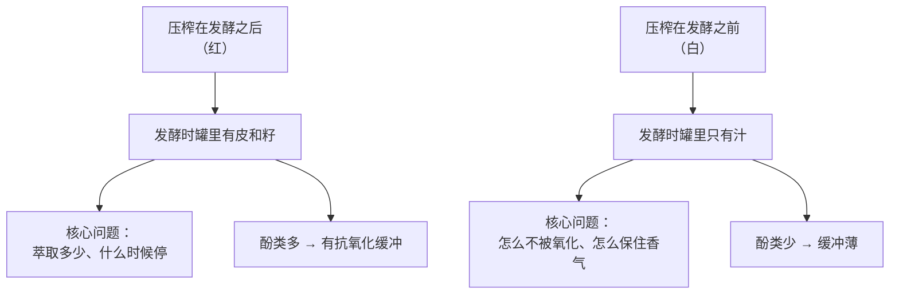
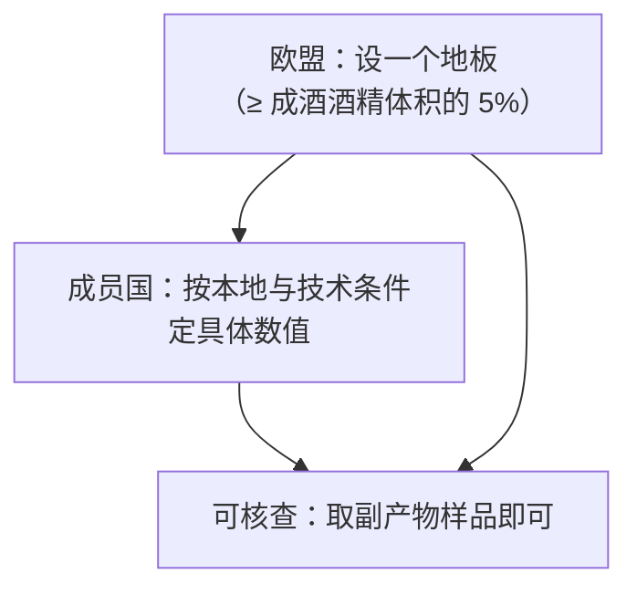
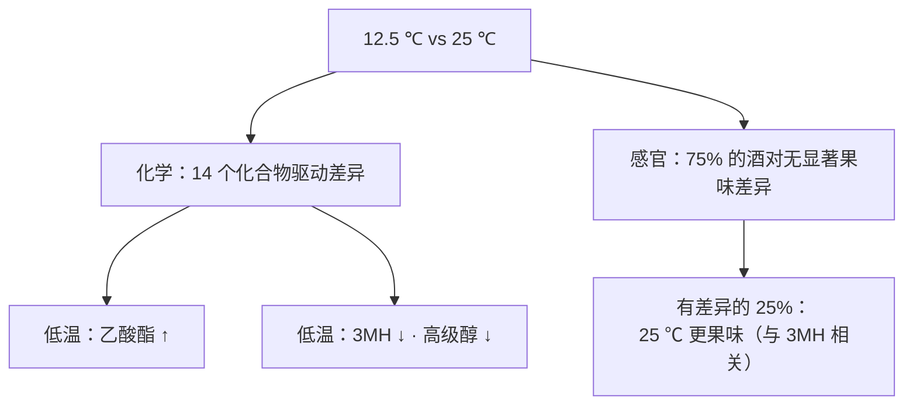
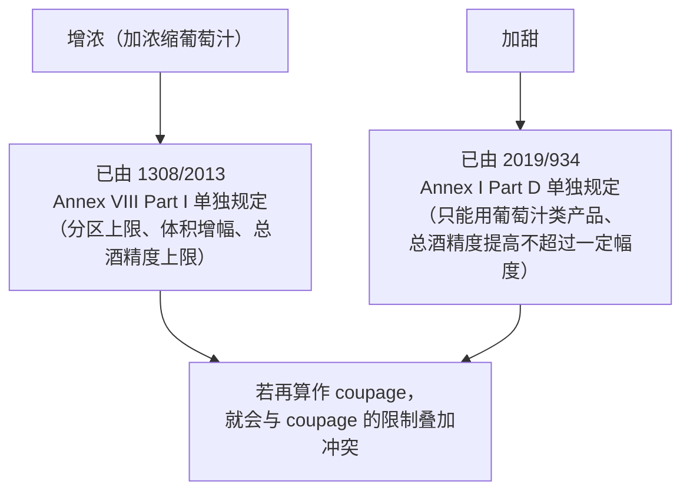

# 第 13 章 思考题参考答案

> 只记「问题 + 正确答案」，不记读者作答。案例题给**完整推理链**。
>
> 凡本书**尚未核到一手出处**的地方，答案里会明说——请不要把"待核"当成"已知"。

## Q1

**问**：为什么把压榨挪到发酵之前，会改变后面几乎所有工序的目标？

**答**：

因为**它取消了"固体"这个变量，于是所有工序都从"控制萃取"变成了"控制氧化"**。

**具体到每道工序，目标都换了**：

| 工序 | 红葡萄酒的目标 | 白葡萄酒的目标 |
|------|-------------|-------------|
| 破碎/压榨 | 让皮汁充分接触 | **尽快分离**，且**不要压出更多酚类** |
| 固液分离后的操作 | 帽管理——维持接触 | **澄清**——把剩下的固体也拿走 |
| 发酵温度 | 20~30 ℃，用温度**促进萃取** | 更低，用温度**保住挥发物**（但效果复杂，见 Q4）|
| 氧 | 帽管理时适度引入是常规 | **主线矛盾**：既要防褐变，又存在"让汁先氧化"的路线 |

**还有一条结构性的后果**：白葡萄酒**没有单宁这一层缓冲**，
所以它对氧、对温度、对微生物的容错都更低。
已核到的数字可以量化这个脆弱性：**SO₂ 能把葡萄汁的耗氧速率压低约 72 %**——
一个需要靠添加物来压低数量级的变量，说明它本身有多活跃。

> **要带走的判断**：**"白葡萄酒工艺简单"是个误解。**
> 它工序更少，但每一步的**容错窗口更窄**——错了没有东西替你兜底。

## Q2

**问**："禁止过度压榨"规定的是副产物中的最低酒精量，而不是压力上限。这有什么优点？

**答**：

**至少两个，都是关于"可执行性"的。**

**优点一：它是结果导向的，因此设备中立。**

如果法规写"压力不得超过 x bar"，那么：

- 不同类型的压榨机（气囊式、螺旋式、传统竹筐式……）的压力读数**不可比**；
- 同样的压力，作用在不同品种、不同成熟度的葡萄上，榨出的东西也不同；
- 而且监管者得**在压榨的那一刻在场**。

而"皮渣与酒脚里必须还剩下**至少相当于成酒酒精体积 5 %** 的酒精"这条：

- **事后可测**——副产物在那里，随时能取样；
- **与设备无关**——你用什么机器都行，只看结果；
- **与规模无关**——大小酒厂同一把尺子。

**优点二：它把"多少算过度"交给了成员国按本地条件决定。**

法规原文的结构是：**成员国须结合本地与技术条件决定那个最低量**，
而欧盟只规定了**那个量的下限**（不得低于成酒酒精体积的 5 %）。

> **额外的一条**：这种"**管结果不管手段**"的立法思路，在酒类法规里其实是少数派——
> 第 12 章那份**授权工艺正面清单**恰恰是相反的思路（管手段）。
> **同一部法律体系里两种思路并存，是因为它们各自适合不同的问题。**

> **要带走的判断**：读法规时，除了看它**规定了什么**，
> 还要看它**打算怎么查**——后者往往解释了它为什么写成那个样子。

## Q3

**问**：只看 72 % / 23 % / 36 % 三个数字，为什么还不能下"SO₂ 不可替代"的结论？

**答**：

因为**那项研究里有一个决定性的前提条件，而它恰好把结论分成了两半**。

**那个条件是：葡萄健不健康（有没有漆酶）。**

漆酶来自灰霉等真菌感染，是一种比葡萄自身 PPO 更"顽强"的氧化酶。
该研究**同时在有漆酶与无漆酶两种条件下**做了测试：

| 处理 | 耗氧速率下降 | **健康葡萄**条件下防褐变（b\* 下降）| **有漆酶**时防褐变（b\* 下降）|
|------|------------|--------------------------------|---------------------------|
| **SO₂** | 约 **72 %** | 约 **91 %** | **约 76 %（仍然有效）** |
| **纯 GSH** | 约 **23 %** | 约 **81 %** | **约 39 %（不足）** |
| **富 GSH 失活酵母** | 约 **36 %** | —— | **约 24 %（不足）** |

**关键在第三、四列的对比**：

- 在**健康葡萄**上，纯 GSH 的防褐变效果（81 %）与 SO₂（91 %）**并没有差一个数量级**；
- 在**有漆酶**时，两者拉开了：SO₂ 仍有 76 %，GSH 掉到 39 %、IDY-GSH 掉到 24 %。

**所以作者写的结论是有条件的**：
两种 GSH 形式都是 SO₂ 的**有意思的替代工具**，**但仅限于葡萄健康的情况**。

**还缺的信息（本书也没有）**：

1. **成品的长期表现**——该研究测的是**葡萄汁阶段**的耗氧与褐变，不是装瓶后的货架寿命；
2. **抗微生物那一半**——SO₂ 同时是抗氧化剂与抗微生物剂（第 5 章），
   这项研究只比了抗氧化那一面；
3. **感官结果**——耗氧速率与 b\* 都是仪器指标。

> **要带走的判断**：**"替代品效果差"与"替代品在某些条件下效果差"是两个结论。**
> 前者是断言，后者是知识——而且后者告诉你**在什么年份该更谨慎**
> （雨水多、灰霉重的年份）。

## Q4

**问**：14 个化合物有差异但 75 % 的酒对感官无差异，这对"低温发酵保留果香"意味着什么？
它**没有**证伪什么？

**答**：

**意味着这句宣传语至少缺了三个限定词。**

| 缺的限定 | 试验里对应的事实 |
|---------|---------------|
| **"保留"的是哪一类果香？** | 低温组**果味乙酸酯更高**，但**3MH（西柚/百香果那一类硫醇）更低**——**两类"果香"方向相反** |
| **能不能被喝出来？** | 感官组在 **75 % 的酒对**中**没有测到显著果味差异** |
| **哪一边更果味？** | 在有差异的那 **25 %** 里，**25 ℃ 发酵的酒更果味**，而且高果味与 **3MH** 相关 |

**作者自己给的解读更克制**：低温的益处**可能在于果味与青味之间的平衡**，
而不是单纯提高果味。作者甚至补了一句很实在的话：
**提高发酵温度或许可以在不损害品质的前提下降低能耗。**

**它没有证伪什么**（这一半同样重要）：

1. **没有证明"发酵温度不重要"**——它确实改变了 14 个化合物；
2. **没有证明"低温没用"**——在有差异的 25 % 里差异是真实的，
   而且低温对"果味/青味平衡"的作用没有被否定；
3. **没有覆盖所有品种与风格**——这是**长相思**的试验，
   而长相思恰好是**硫醇型**品种（第 9 章），**低温降低 3MH 这条可能是品种特异的**；
4. **没有测陈年后的差异**——它测的是成酒，不是三年后的成酒。

> **要带走的判断**：这是全书最重要的一种"结果形态"，值得给它一个名字——
> **化学显著、感官不显著。**
> 它在葡萄酒研究里极其常见，而宣传材料只会引用前半句。
> **下次看到"经科学证实"，先问一句：证实的是仪器读数还是人的感知？**

## Q5

**问**：逐句判断并改写这段桃红文案。

> *"欧盟严禁用红白调配做桃红，只有香槟例外，所以桃红一定是真材实料；
> 本款浸渍长达 3 天以获得美丽的色泽；我们全程零二氧化硫，因此更纯净；
> 桃红在法规上就是淡红葡萄酒。"*

**答**：四句各踩一个知识点。

**第一句："欧盟严禁红白调配做桃红，只有香槟例外"** → ⚠️ **方向对，两处不准确**。

**(EU) 2019/934 Article 8(1)** 的原文结构是：

- 禁令的对象是 **"非 PDO/PGI 的白葡萄酒" 与 "非 PDO/PGI 的红葡萄酒"** 之间的 coupage——
  **它针对的是无地理标志的酒**；
- 例外不是"香槟"，而是：**最终产品用于制备 (EU) No 1308/2013 Annex II Part IV
  第 12 点定义的 cuvée（起泡酒基酒），或用于生产微起泡酒**。

**"所以桃红一定是真材实料"这个推论也不成立**：
一条禁止某种造假方式的法律，不能推出"因此所有产品都好"——
它只排除了**一种**捷径。

> **改写**："欧盟法规规定，非 PDO/PGI 的白葡萄酒与红葡萄酒调配不得产出桃红酒
> （起泡酒基酒与微起泡酒除外）。本款为 ____（直接压榨 / 放血 / 短时浸渍）。"

**第二句："浸渍长达 3 天以获得美丽色泽"** → ⚠️ **尺度可疑，且漏掉了温度**。

桃红的浸渍通常以**小时**计——已核到的那项试验用的是 **8 小时**，
而在这 8 小时里，**温度从 5 ℃ 变到 15 ℃ 就足以改变色强、a\*、C\* 与
malvidin-3-葡萄糖苷含量**。

**3 天（72 小时）在桃红的语境下是很长的时间**。按第 12 章的萃取曲线，
72 小时已经进入**皮来源黄烷-3-醇快速累积**的区间（约五天达最大值的 80~85 %），
所以这支酒**大概率带有可察觉的涩感**——这可以是风格，但应该被说明。

⚠️ **本书不说 3 天"错"**——只说这句话**把一个会显著改变口感的参数说成了纯粹的颜色手段**。

> **改写**："本款带皮浸渍 72 小时，温度 ____ ℃。较长的浸渍带来更深的颜色，
> 同时带来一定的酚类结构。"

**第三句："全程零二氧化硫，因此更纯净"** → ⚠️ **两处问题**。

1. **"零"这个词**：发酵本身会产生 SO₂（第 5 章：酵母在酒精发酵中产生的内源 SO₂
   一般在 10~50 mg/L 的量级），而**欧盟与美国的标注门槛都是 10 mg/L**。
   所以"零添加"与"不含"是两回事；
2. **"因此更纯净"**：这是把一个**生产选择**说成了**成品属性**。
   而已核到的代价是可量化的：SO₂ 使葡萄汁耗氧速率降低约 **72 %**、
   **即使有漆酶也能防褐变**（b\* 降低约 76 %），而谷胱甘肽类替代品
   **在有漆酶时效果不足**（39 % / 24 %）。

> **改写**："本款未额外添加二氧化硫。请注意发酵本身会产生少量二氧化硫。
> 未添加二氧化硫的酒对温度与氧更敏感，建议 ____ 条件下保存并尽早饮用。"

**第四句："桃红在法规上就是淡红葡萄酒"** → ❌ **只对了一半，而且是随机的一半**。

同一部法规 **(EU) 2019/934** 里，桃红有**两个身份**：

| 场合 | 桃红算什么 | 依据 |
|------|----------|------|
| **调配（coupage）的类别划分** | **视为红葡萄酒** | Art. 7(2)(a) |
| **总 SO₂ 与挥发酸限量** | **与白葡萄酒同组**（总 SO₂ 200 mg/L、挥发酸 18 meq/L）| Annex I Part B / Part C |

> **改写**："桃红在欧盟法规中的归类取决于条款目的：
> 论调配类别时被视为红葡萄酒，论二氧化硫与挥发酸限量时与白葡萄酒同组。"

> **要带走的判断**：这段文案的四句里，有三句的问题是同一种——
> **把一条有限定条件的规则，说成一条无条件的规则。**
> 而第四句提醒了另一件事：**在法规里找"本质"是找不到的，只能找"目的"。**

## Q6

**问**：拆解"不澄清、不过滤、不加硫，所以保留了最完整的风味"。

**答**：

这句话里有**三个独立的工艺选择 + 一个未经证实的结论**，必须分开看。

| # | 断言 | 证据状况 |
|---|------|---------|
| 1 | **不澄清** | ⚠️ 已核到的一项对照中，**未澄清的酒胶体负荷更高、起泡性更低**；**澄清过的酒果香与花香酯类浓度更高**。⚠️ 单一品种、单一年份的祖传法起泡酒试验，不外推 |
| 2 | **不过滤** | ⚠️ 同一试验中**未澄清且未过滤的酒挥发性酚与挥发酸更高**，对应**不愉快的气味**；澄清与过滤**提高了泡沫高度与稳定性** |
| 3 | **不加硫** | ⚠️ 代价可测：SO₂ 使葡萄汁耗氧速率降低约 **72 %**；替代品在**葡萄健康**时有效、**有漆酶时不足** |
| 4 | **"因此保留最完整的风味"** | 缺乏证据——而且**在已核到的那项对照里，方向是相反的** |

**注意第 4 条的措辞**：本书不说"不澄清不过滤的酒一定更差"。
可以说的是：

> **"保留最完整的风味"这个说法，在本书能核到的那项对照试验里没有得到支持，
> 而且部分指标指向相反的方向。**

**还有一条容易被忽略的逻辑问题**：
这三个"不"是**三个独立决策**，但被用一个"所以"绑成了一个整体。
一个酒庄完全可以**澄清但不过滤**、**过滤但不加硫**。
**把三件事捆在一起叙述，实际上是在讲一种立场，而不是在描述一款酒。**

**我会追问的三个问题**：

1. **"不加硫"是指不添加，还是指检测值低于 10 mg/L？**
2. **"不过滤"之后，你们怎么保证微生物稳定性？**（低温？高酸？尽快销售？）
3. **这支酒建议多久内喝完？**——这是最实用的一个问题，
   而一家想清楚了的酒庄通常会有明确答案。

> **要带走的判断**：**"三个不"是一种叙事结构，不是一个质量指标。**
> 与第 11 章 Q8 讲的"规则 / 环境 / 风味"混说是同一种手法：
> **把若干可核查的事实，用"所以"接到一个不可核查的结论上。**

## Q7

**问**：查 Article 7 三款，写出 coupage 的定义、类别划分，以及哪两项不算 coupage。
为什么要特意排除"增浓"与"加甜"？

**答**：

**Article 7 的三款**：

| 款 | 内容 |
|----|------|
| **7(1)** | **"coupage"** 指**不同来源、不同品种、不同年份，或不同类别**的酒或葡萄汁的**混合** |
| **7(2)(a)** | 下列视为**不同类别**：**红葡萄酒、白葡萄酒**，以及适合产出这两类之一的葡萄汁或酒。**就本款而言，桃红酒应被视为红葡萄酒** |
| **7(2)** 续 | 不带地理标志的酒、**PDO 酒**与 **PGI 酒**，以及适合产出其中一类的葡萄汁或酒，也属不同类别 |
| **7(3)** | 下列**不算 coupage**：(a) 以**浓缩葡萄汁或精馏浓缩葡萄汁**进行的**增浓**；(b) **加甜** |

**为什么要排除增浓与加甜？**

因为**这两项操作本身已经被另一套条文单独管住了**，如果再算成 coupage，
就会造成**双重规制与逻辑打架**：

**更本质的理由是：这两项操作的目的不是"混合两种酒"。**
Coupage 规制的对象是**把不同来源/类别的产品混起来**这件事本身
（因为它可能被用来**伪装来源或品类**）；
而增浓与加甜加进去的是**葡萄汁类的加工品**，目的是**调整糖或酒精**，
**不涉及来源或品类的伪装**。

**顺带体会一下第 7(2) 款的另一半**：
**不带 GI 的酒、PDO 酒、PGI 酒之间也算"不同类别"**——
这意味着**把一款 PGI 酒混进 PDO 酒里同样是 coupage**，受同一套规则约束。
**这条是整个原产地制度能站住的技术基础之一**（第 19 章会展开）。

> **要带走的判断**：定义条款（"什么算 X"）常常比禁止条款（"不许 X"）更值得读——
> **因为一条禁令的真正边界，写在它的定义里。**

## Q8

**问**：再举一个"同一事物在不同目的下被归入不同类别"的例子，
并说明"先问为了什么目的分类"为什么是好习惯。

**答**：

**本书前面已经出现过好几个，任选其一即可。**

| 例子 | 分类之一 | 分类之二 | 各自的目的 |
|------|---------|---------|----------|
| **起泡酒的气压** | **微起泡酒**：过压 **1~2.5 bar** | **起泡酒**：过压 **≥3 bar**；**优质起泡酒 ≥3.5 bar**（第 5 章已核 (EU) No 1308/2013 Annex VII Part II）| 前者是**品类边界**（叫什么名字），后者关系到**容器与安全**，也关系到**税与标示** |
| **"葡萄酒"的最低酒精度** | 一般 **8.5 % vol**（A、B 区原料）或 **9 % vol**（其他区）| **带 PDO/PGI 的酒可低至 4.5 % vol** | 通用定义是为了**防止稀释**；例外是为了**容纳传统低酒精风格** |
| **二氧化硫** | 法规管**总量** | 酿酒师关心**分子态**（抗菌活性的主力，比例由 pH 决定）| 前者为了**可执行**（总量能测），后者为了**有效**（第 5 章）|
| **"白葡萄"** | 分类学/农业上：果皮不含花色苷的品种 | 工艺上："blanc de noirs"用黑皮葡萄也能做白葡萄酒（第 9 章辨析表）| 一个在说**原料**，一个在说**成品** |

**"先问目的"为什么是个好习惯？三条理由**：

1. **它能立刻消解大量"到底算不算"的争论。**
   "桃红到底是红还是白"没有答案，但"为了 SO₂ 限量，桃红和白同组"有答案。
2. **它能防止把分类当成本质。**
   法规里的类别是**为了实现某个监管目的而画的线**，
   不是对世界的形而上描述。把它当本质，就会推出荒谬的结论
   （比如"桃红在法规上是淡红葡萄酒，所以应该按红葡萄酒侍酒"——这是两件事）。
3. **它让你能预判"例外"会出现在哪。**
   知道一条规则的目的，就能猜到它会在哪里开口子：
   Art. 8(1) 禁止红白调配做桃红，**例外恰恰在起泡酒**——
   因为起泡酒的基酒（cuvée）本来就是**以调配为核心工艺**的产品类别。

> **要带走的判断**：这是本书从第一部分就在练的同一件事的法规版本——
> **先问"这个词是在回答什么问题"，再问"它答得对不对"。**
