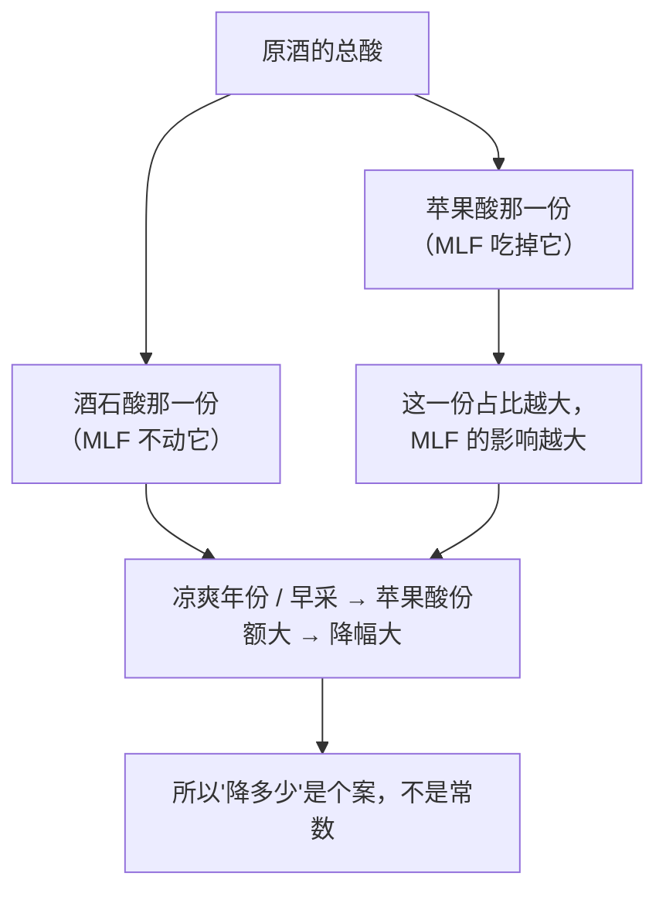
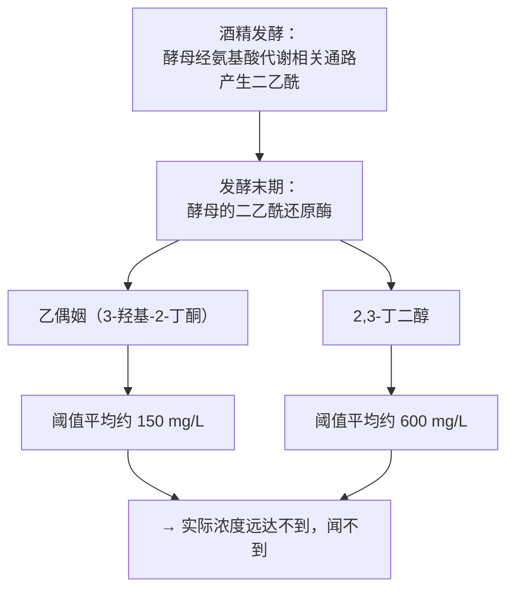
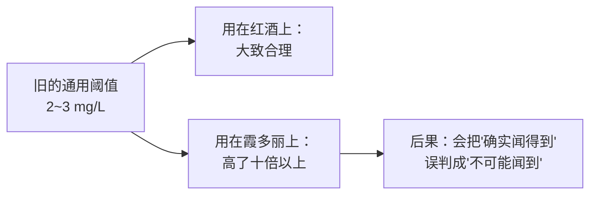
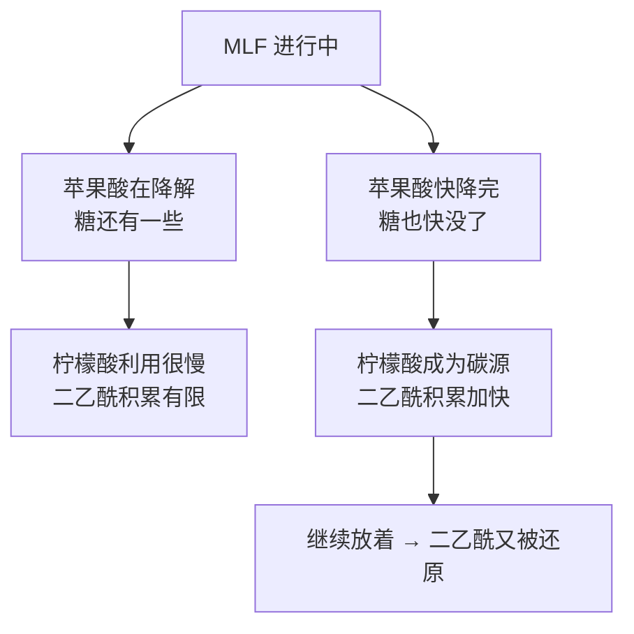
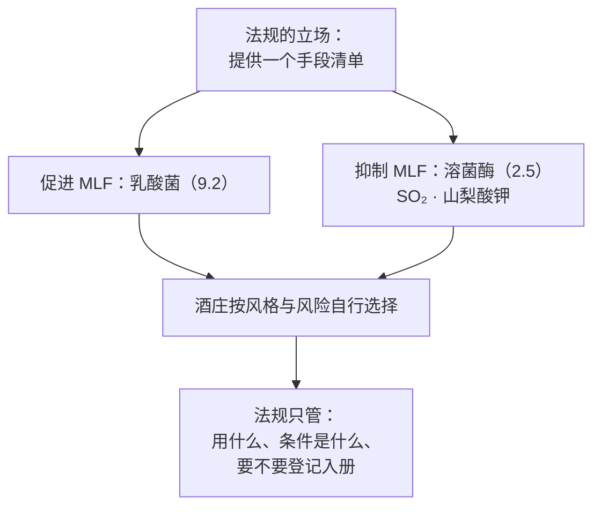

# 第 14 章 思考题参考答案

> 只记「问题 + 正确答案」，不记读者作答。案例题给**完整推理链**。
>
> 凡本书**尚未核到一手出处**的地方，答案里会明说——请不要把"待核"当成"已知"。

## Q1

**问**：用"二元酸变一元酸"解释 MLF 为什么同时降低可滴定酸、提高 pH。
为什么本书不给"降低 x g/L"？

**答**：

**可滴定酸测的是"能被碱中和的质子数"**，不是"酸分子的重量"。

- **L-苹果酸**有**两个**羧基 → 每个分子能贡献**两个**可滴定的质子；
- **L-乳酸**只有**一个**羧基 → 每个分子只贡献**一个**。

MLF 把每一个苹果酸分子换成一个乳酸分子（外加一个 CO₂ 跑掉），
**分子数没变，可滴定质子数减半**。所以：

| 指标 | 方向 | 原因 |
|------|------|------|
| **可滴定酸** | ↓ | 可解离质子总数下降 |
| **pH** | ↑ | 溶液中氢离子活度下降 |
| **酸的"质感"** | 变化 | 两种酸的味觉强度与酸感特征不同（第 1 章）|

**为什么不给数字？** 因为最终幅度取决于**原酒里苹果酸占总酸的比例**，
而这个比例本身高度可变：

而且本书在第 7 章就登记了一条留白：
**成熟过程中被分解的是苹果酸**（已核），而
**"酒石酸相对稳定"这条流传说法本书未核到一手出处**。
既然分母（各酸的相对份额）本身没核实，分子（降幅）就更不能写死。

> **要带走的判断**：**"少了一个羧基"比"乳酸更柔和"是更硬的解释**——
> 前者可以从分子式直接推出，后者是感官描述。

## Q2

**问**：二乙酰在酒精发酵中就产生了，为什么那时闻不到？通路是什么？关键的一步是哪一步？

**答**：

**通路（已核到的引言表述）**：

**"闻不到"的原因不是它消失了，而是它变成了两个阈值高出两三个数量级的分子。**
对照二乙酰自己的阈值（霞多丽 **0.2**、赤霞珠 **2.8 mg/L**）：

| 分子 | 阈值 |
|------|------|
| **二乙酰** | **0.2 ~ 2.8 mg/L**（随酒种）|
| **乙偶姻** | 约 **150 mg/L** |
| **2,3-丁二醇** | 约 **600 mg/L** |

**关键的一步是"还原"这一步**，理由有二：

1. 它是**方向性的**——把一个高感知力的分子变成两个低感知力的分子；
2. **它在 MLF 之后还会继续发生**（该研究明确写二乙酰"化学稳定性低，
   可以被容易地转化为乙偶姻与 2,3-丁二醇"）。
   这就是为什么"黄油味"是一个**时间窗口**里的现象。

⚠️ **但本书在这里必须踩刹车**：
"因此带泥陈酿会降低黄油味"这个推论**本书未核到直接对照试验**，
所以第 14 章只写机制、不写净效果。

## Q3

**问**：0.2 / 0.9 / 2.8 mg/L 这组数字同时支持了哪两个结论？

**答**：

**结论一（关于这个分子）：红葡萄酒对二乙酰有强掩蔽作用。**

同一个分子，在赤霞珠里需要**十四倍**于霞多丽的浓度才被察觉。
再结合商业酒的实测（红酒均值 **1.1 mg/L**，而红酒阈值 **2.8**），
可以推出一个具体判断：**很多红葡萄酒里的二乙酰根本到不了阈值**——
这正是 Bartowsky 等给出的、用来解释红酒相关性弱（调整 R² = 0.12）的理由。

**结论二（关于"阈值"这个概念）：阈值不是分子的属性。**

原文的措辞是：这些结果**否定了对所有酒使用单一阈值**。
而在此之前，文献里流传的是一个 **2~3 mg/L** 的通用值——
它恰好落在红葡萄酒那一端，**在霞多丽上高了十倍以上**。

> **这是本书第三次遇到同一条纪律**（第 2 章的 rotundone、第 4 章的各类阈值表）：
> **写阈值必须带介质、人群与方法。**
> 这一条在本例中还多了一层：**同一篇论文自己就证明了这一点**——
> 它不是外部批评，是作者自己的结论。

## Q4

**问**：判断这段推理——
> *"本款霞多丽经 100 % 苹果酸乳酸发酵，二乙酰含量 0.5 mg/L，
> 是公认阈值 2 mg/L 的四分之一，因此不会有黄油味。"*

**答**：**两处问题，而且方向相反——它先用错了阈值，然后用对了逻辑的反面。**

**问题一：用错了阈值（这是硬错）。**

| 它用的 | 应该用的 |
|-------|---------|
| "公认阈值 2 mg/L" | **霞多丽的实测阈值是 0.2 mg/L** |

**0.5 mg/L 不是阈值的四分之一，而是霞多丽阈值的两倍半。**
换句话说，按已核到的数据，**这个浓度在霞多丽上大概率是闻得到的**。

那个"2 mg/L"来自哪里？来自 1995 年之前流传的通用值（2~3 mg/L），
而那篇论文的全部意义就是**否定它可以通用**。

**问题二：单靠浓度下结论，本身就不可靠。**

即使阈值用对了，"浓度低于阈值 → 不会有黄油味"这个推理也**过强**：

- 商业酒的检验显示，霞多丽的黄油强度与浓度**显著相关但回归预测不好**，
  **纳入游离 SO₂ 后才改善（调整 R² = 0.43）**——
  也就是说，**同样的浓度在不同 SO₂ 水平下感知不同**；
- 阈值是**小组统计量**，个体差异很大（第 2 章）：
  41 款霞多丽的研究里，作者明确提到品评者感知能力的差异。

**推理链应该怎么写**：

> 看到"0.5 mg/L" → 先问是**什么酒种**（霞多丽 0.2 / 黑皮诺 0.9 / 赤霞珠 2.8）→
> 再问**游离 SO₂ 多少** → 再问**装瓶多久**（红酒在 15 ℃ 三年后有明显下降的报道）→
> 才能说"大概率闻得到 / 闻不到"。

> **改写建议**："本款霞多丽经完整苹果酸乳酸发酵，二乙酰 0.5 mg/L。
> 受训品评组在霞多丽基质上测得的检测阈值约 0.2 mg/L，
> 因此多数人应能察觉到一定的乳脂气息；实际感知还受游离 SO₂ 与瓶龄影响。"

> **要带走的判断**：**"低于阈值"这四个字，必须跟着一个基质。**
> 脱离基质的阈值是本书见过最常见的一种"看起来很科学"的错误。

## Q5

**问**：为什么乳酸菌要等残糖很低才大量利用柠檬酸？这对"何时分离"有什么提示？

**答**：

**因为柠檬酸是备用碳源，不是首选。**

已核到的表述是：在乳酸菌的碳水化合物代谢中，丙酮酸被还原为乳酸；
**只有当残糖浓度过低时，柠檬酸才开始被当作碳源利用**，从而额外合成丙酮酸，
而这些丙酮酸是二乙酰的前体。
该研究还补了一句：柠檬酸的利用**与苹果酸的降解同时开始，但过程很慢**，
**在糖不足的状态下尤其明显**。

**推论（本书标为推论，不是已核结论）**：

**对"何时把酒从菌上分开"的提示**：

**二乙酰的浓度是一条先升后降的曲线，而不是一个终点值。**
所以"什么时候停止 MLF / 什么时候加 SO₂ 或溶菌酶把菌按住"
**本身就是在选曲线上的一个点**——和第 12 章"浸皮泡多久"是同一类决策。

⚠️ **必须说明的限制**：**本书未核到这条曲线的定量形状**
（峰值在第几天、各阶段的浓度）。上面写的是**机制推论**，
**不能当作操作指南**。

> **要带走的判断**：一旦你发现某个风味物质是**中间产物**，
> 就应该立刻想到"它有一条时间曲线"，并去问**"你们在哪个点停的"**。

## Q6

**问**：查 (EU) 2019/934 Annex I Part A Table 2 里的乳酸菌与溶菌酶。
为什么同一部法规要同时授权"促进"与"抑制"同一类微生物的手段？

**答**：

**两个条目在表中的位置本身就是答案。**

| 条目 | 编号 | 它被归在哪一类 |
|------|------|-------------|
| **酿酒酵母** | 9.1 | **发酵剂（fermentation agents）** |
| **乳酸菌** | 9.2 | **发酵剂** |
| **溶菌酶（E 1105）** | 2.5 | 与**二氧化硫、山梨酸钾**同一节（防腐与稳定）|

**为什么两者并存？因为法规管的不是"应该做什么酒"，而是"允许用什么手段"。**

**这背后是一条更一般的规律**（第 13 章 Q2 已遇到一次）：

> **酒类法规大量采用"授权正面清单"的形式**——
> 它不判断风格好坏，只回答"这件事被允许吗、在什么条件下"。
> 所以**在同一张表里看到方向相反的两个工具，是正常的，不是矛盾**。

**这对读者的实用含义**：
"这支酒没做 MLF"与"这支酒做了 MLF"**在合规层面是等价的**，
两者都不构成品质证明。差别在于**风格与风险管理方式**（见第 14 章 §14.2 的决策图）。

## Q7

**问**：自溶研究的四个条件（传统法起泡酒为主、6~18 个月、12~18 ℃、常用合成酒模型）里，
哪一个最限制把结论外推到**静止白葡萄酒**？

**答**：

**最限制的是第一个：研究对象以传统法起泡酒为主。**

理由是**起泡酒的自溶环境与静止白葡萄酒有三处系统性差异**：

| 差异 | 传统法起泡酒 | 静止白葡萄酒的带泥陈酿 |
|------|------------|---------------------|
| **容器与压力** | 密闭瓶内，**有几个大气压的 CO₂**（第 16 章）| 常压，桶或罐 |
| **氧** | 几乎完全隔绝 | 桶壁有一定透氧 |
| **酒泥的来源** | **二次发酵的酵母**，量小而均一 | 一次发酵的酒泥，含果渣、酒石等多种成分（对照法规对"酒脚"的定义）|

**而"6~18 个月""12~18 ℃"这两条限制较小**——
它们是**参数范围**，可以被外推时明确标注；
**"合成酒模型"也是可标注的限制**（它去掉了真实酒的基质复杂度）。
但"**对象是另一类酒**"不是参数问题，是**体系问题**。

**综述自己给的那句话可以直接用**：
**农艺与技术上的变异使具体结论难以普适化**，并呼吁把研究扩展到
**尚未充分研究的葡萄酒类别**。

> **要带走的判断**：判断一篇研究能不能外推，先看**对象**，再看**参数**。
> 参数不同可以标注，对象不同往往需要重做。

## Q8

**问**：甘露蛋白在 A/T = 0.2 / 0.3 / 0.5 三种基酒上效果不同。
为什么这**不是**"结果不可靠"？

**答**：

**因为它给出了一个可用的条件变量，而不是一堆互相矛盾的结论。**

对比两种情形：

| 情形 | 长什么样 | 该怎么读 |
|------|---------|---------|
| **结果不可靠** | 同样的酒、同样的处理，这次有效、下次无效，说不出为什么 | 只能存疑 |
| **效果有条件** | 效果随一个**事先可测的变量**（A/T 比）系统性变化 | **这就是知识** |

该试验的结构本身就是为此设计的：三类基酒（延长浸渍 / 压榨 / 自流）
**恰好构成一个 A/T 递增序列（0.2 → 0.3 → 0.5）**，
而结果沿这个序列有方向性：

| A/T | 结果 |
|-----|------|
| **0.2**（单宁最重）| 其中**一种**制剂带来包裹感、柔软与天鹅绒感，并带来颜色稳定性 |
| **0.3** | **两种**制剂改善口感与颜色 |
| **0.5**（花色苷相对多）| **所有**处理都促成聚合色素形成并与丝滑/天鹅绒/包裹感相关，**苦味下降** |

**作者的结论因此是有结构的**：效果**取决于酒的花色苷/单宁比**。

**它对买酒的人意味着什么**：
"我们添加了甘露蛋白让口感更柔顺"这句话，**在单宁极重的酒上可能只对某一种制剂成立**。
所以这类宣传的可信度，**取决于它有没有说清是什么酒**。

> **要带走的判断**：看到"效果因情况而异"时，先问一句——
> **那个"情况"是可测量的吗？** 可测量 → 是知识；说不清 → 才是不可靠。

## Q9

**问**：再找一个"同一件事既可以是过程，也可以是配料"的例子，
并说明这种替代关系为什么在买酒时值得留意。

**答**：

**本书前面至少已经出现过三个，任选其一。**

| 例子 | 作为"过程" | 作为"配料/操作" | 出处 |
|------|----------|---------------|------|
| **酸度** | 靠气候、产量、采收期获得（第 7、11 章）| **增酸 / 降酸**：法规规定了上限（葡萄酒增酸 2.5 g/L，降酸 1 g/L，且两者互斥）| 1308/2013 Annex VIII Part I C |
| **酒精度** | 靠成熟度获得 | **增浓（加糖/浓缩汁）**：分区上限 A 区 3 %、B 区 2 %、C 区 1.5 % vol | 同上 Part I A、B |
| **香气前体的释放** | 靠浸渍与时间 | **果胶酶类**："仅用于浸渍、澄清、稳定、过滤，以及**使香气前体显现**" | 2019/934 Annex I Part A Table 2 |
| **柔顺口感** | 带泥陈酿 + 搅桶 | **酵母甘露蛋白 / 自溶物 / 细胞壁 / 失活酵母** | 同上（6.10、4.6~4.8）|

**为什么值得留意？三条**：

1. **成品属性不等于生产方式的证据。**
   尝到柔顺，不能推出"陈酿了很久"；尝到高酸，不能推出"凉爽产区"。
   **这是本书反复出现的同一个逻辑漏洞**（第 11 章的有机、第 13 章的"三个不"）。
2. **法规通常只规定"允许与否"和"上限"，不要求在酒标上披露。**
   本书**未核到**欧盟要求在酒标上声明使用过酵母衍生物或橡木片的条文，
   因此只能说：**这些信息通常不在酒标上**（第 20 章会系统处理酒标的必填与选填）。
3. **它把"贵"这件事解释清楚了。**
   过程路线花的是**时间与容器占用**，配料路线花的是**采购成本**。
   两者价格结构完全不同——这正是第 40 章要处理的问题。

> **要带走的判断**：遇到任何一个口感/风味描述，都值得问一句：
> **"这个效果有没有一条更便宜的路可以到达？"**
> 如果有，那么这个效果本身就不能当作品质或工艺的证据。
