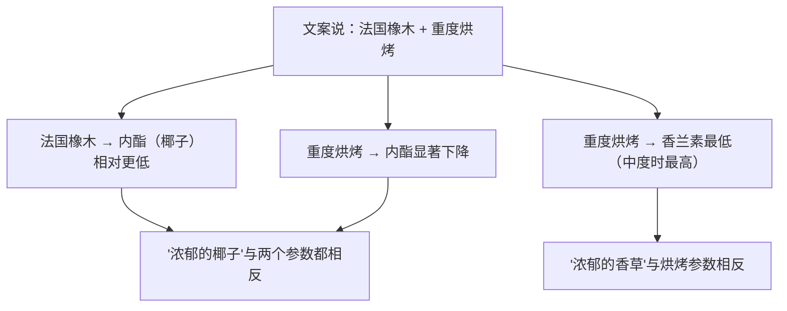
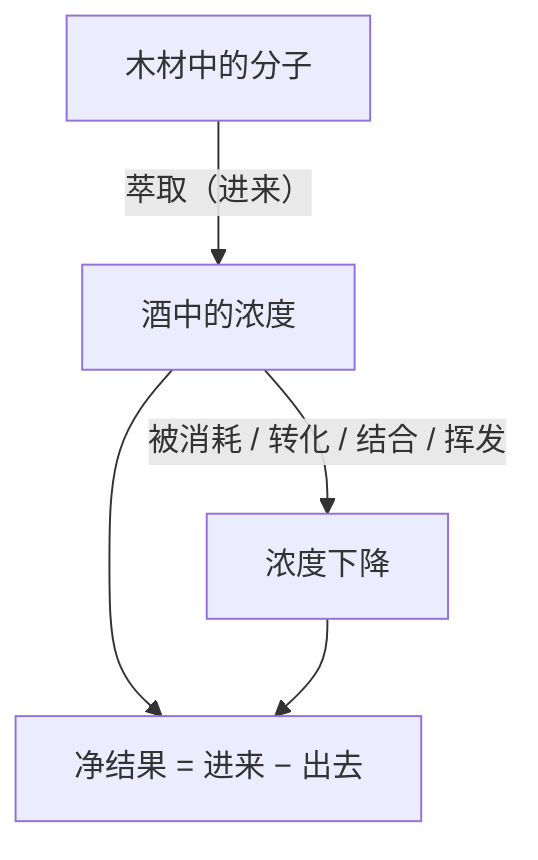
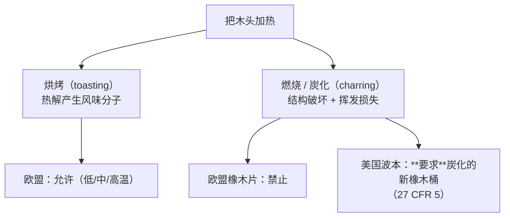
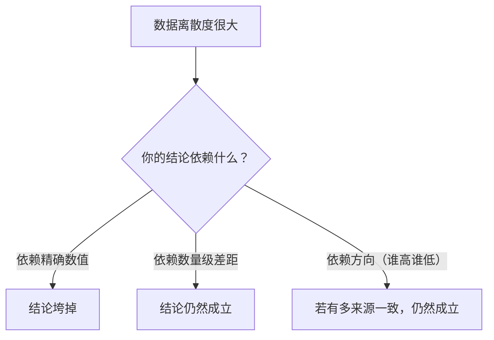

# 第 15 章 思考题参考答案

> 只记「问题 + 正确答案」，不记读者作答。案例题给**完整推理链**。
>
> 凡本书**尚未核到一手出处**的地方，答案里会明说——请不要把"待核"当成"已知"。

## Q1

**问**：为什么说"在法规眼里，橡木不是容器而是配料"？用 Appendix 7 的三条规定支持。

**答**：

**最直接的证据是它出现的位置**：
**「橡木片」是 (EU) 2019/934 Annex I Part A Table 1 里的第 11 项**——
那张表的标题是**"授权的酿酒工艺（authorised oenological processes）"**，
与"通气或充氧""离心与过滤""鼓泡""浮选"（第 13 章已核）并列。
**容器不会出现在工艺清单里。**

**Appendix 7 里可以支持这个判断的三条**（任选三条即可）：

| 规定 | 它像什么 |
|------|---------|
| **必须完全来自栎属（*Quercus*）** | 像**原料来源限定**——法规在管"这味配料是什么" |
| **不得为增强其天然风味或增加可萃取酚类的量而添加任何产品** | 像**防掺假条款**——法规在管"这味配料有没有被做手脚" |
| **标签须注明橡木植物学种的来源与加热强度** | 像**配料规格说明**——供买方核对批次 |
| **粒径：至少 95 %（按重量）被 2 mm 筛截留** | 像**产品规格**——容器不需要粒径 |
| **须记入 (EU) No 1308/2013 第 147(2) 条的登记册** | 像**使用记录**——法规要求可追溯 |

> **要带走的判断**：**法规怎么给一样东西归类，透露了它打算怎么监管它。**
> 这是第 13 章 §13.7 那条"分类是工具不是本质"的又一次应用——
> 把橡木片放进工艺表，意味着监管者关心的是**"用了什么、怎么用、有没有记录"**。

## Q2

**问**：µg/L 与 mg/L 的一千倍差距，怎么改变你读"烤面包香、焦糖香"的方式？

**答**：

**它把"这个词可信吗"变成了一道可以估算的题。**

| 香气词 | 主要分子 | 阈值量级 | 要被闻到，浓度得达到 |
|-------|---------|---------|-------------------|
| 椰子 / 木质 | cis-橡木内酯 | **µg/L** | **20~46 µg/L** |
| 丁香 | 丁香酚 | **µg/L** | **6 µg/L** |
| 烟熏 | 愈创木酚 | **µg/L** | **9.5 µg/L** |
| 香草 | 香兰素 | **mg/L** | **1 000 µg/L** |
| 面包 / 杏仁 | 糠醛 | **mg/L** | **15 000 µg/L** |
| 焦糖 | HMF | **mg/L** | **100 000 µg/L** |

**读法上的三个变化**：

1. **"椰子""丁香""烟熏"是低成本描述**——几十微克每升就够了，
   在桶陈酒里**很容易真的成立**；
2. **"烤面包""焦糖"是高成本描述**——需要 mg/L 级浓度。
   在已核到的汇编数据里，糠醛多为几百到几千 µg/L，**OAV 普遍 ≪ 1**；
3. 因此当一份酒评里**"烤面包、焦糖"出现得比"椰子、丁香"还多**时，
   合理的解释往往不是"这些分子特别多"，而是：
   - 这些词描述的是**多个分子的综合印象**（加和与协同），或者
   - 它们描述的**根本不是橡木来源**（例如起泡酒的酒泥自溶，第 16 章；
     或瓶中陈年产物，第 18 章）。

> ⚠️ **不要过度推论**：OAV < 1 不等于"毫无贡献"。
> 亚阈浓度的化合物可以通过**加和与协同**参与整体印象——
> 第 4 章引过的 β-大马士酮就是典型（它对红酒香气"间接影响大于直接影响"）。
> **本书只说"单靠这个分子解释不了"，不说"它没有作用"。**

## Q3

**问**：cis-橡木内酯 245 µg/L、香兰素 289 µg/L、糠醛 110 µg/L，OAV 各是多少？

**答**：

**先统一单位**（阈值表里香兰素 1 mg/L = 1000 µg/L，糠醛 15 mg/L = 15 000 µg/L）：

| 化合物 | 浓度 | 阈值 | **OAV** | 判断 |
|-------|------|------|--------|------|
| **cis-橡木内酯** | 245 µg/L | 20~46 µg/L | **约 5.3 ~ 12.3** | **明显高于 1**，很可能被察觉 |
| **香兰素** | 289 µg/L | 1 000 µg/L | **约 0.29** | 低于 1 |
| **糠醛** | 110 µg/L | 15 000 µg/L | **约 0.007** | 远低于 1 |

**三点解读**：

1. **这瓶酒的"桶香"主要由内酯撑着**——而 cis-橡木内酯的气味描述本身就是
   **"椰子、木质、香草"**。所以**即使香兰素没过阈值，"香草"这个词也可能是准确的**；
2. **注意 cis 内酯的 OAV 是一个区间（5.3~12.3）**，
   因为其阈值本身就被报告为一个区间（20~46 µg/L）。
   **阈值有区间，OAV 就必须是区间**——这是本书的写作纪律之一；
3. 糠醛的 OAV 是 **0.007**，差了两个数量级。
   **要让糠醛单独撑起"面包香"，浓度得再高一百多倍。**

> **要带走的判断**：把浓度换算成 OAV，只需要一次除法，
> 却能立刻分辨出"哪个分子在说话、哪个分子只是被检测到了"。
> **"检测到"与"闻得到"之间，隔着一个阈值。**

## Q4

**问**：判断这段文案。
> *"采用 100 % 全新法国橡木桶重度烘烤陈酿 18 个月，
> 带来浓郁的香草与椰子风味；我们坚持不用橡木片这种工业捷径。"*

**答**：三句各踩一个知识点。

**第一句："100 % 全新法国橡木桶重度烘烤"** → ✅ **描述本身没问题**，
但**这三个参数是三个不同方向的旋钮，不能当作同一个"强度条"**：

| 参数 | 它控制什么 |
|------|----------|
| **100 % 新桶** | **总量**（一年桶中所有挥发物水平都显著低于新桶）|
| **法国橡木** | **给哪一类分子**（相对美国橡木，**内酯尤其 cis 异构体系统性更低**；欧洲橡木以可萃取酚类见长）|
| **重度烘烤** | **构成**（呋喃类与挥发酚 ↑、内酯 ↓、香兰素在重烘烤时最低）|

**第二句："带来浓郁的香草与椰子风味"** → ⚠️ **与前一句的参数方向冲突**。

**这不是说这瓶酒不可能有这些味道**——酒是复杂体系，
而且综述自己也说烘烤的影响"并不总是清晰明确"。
**但这段文案把三个参数当成了'越多越浓'的同向叠加，而已核到的方向恰好相反。**

**第三句："不用橡木片这种工业捷径"** → ⚠️ **价值判断，且忽略了法规事实**。

- **橡木片在欧盟是被明确授权的酿酒工艺**（Table 1 第 11 项），
  且其技术条件（树种、不得燃烧、不得添加、粒径、标签、登记）
  **比很多工艺写得都细**；
- **本书未核到"木片酒品质更差"的盲品对照**，因此不作判断；
- 真正可说的差别是**机制**：**木片主要提供萃取，桶还提供缓慢的氧与容器条件**——
  所以工业上会用**板条 + 微氧**来补这一半。

> **改写建议**："本款在 100 % 新法国橡木桶中陈酿 18 个月，桶为 ____ 烘烤度。
> 法国橡木的椰子类内酯通常低于美国橡木，而较深的烘烤会增强烟熏与焦糖类气息、
> 减弱椰子类气息——这是我们想要的方向。"

> **要带走的判断**：**当一段文案把多个方向不同的参数堆在一起说"所以很浓郁"时，
> 它多半没有在描述这瓶酒，而是在堆砌听起来贵的词。**

## Q5

**问**：9 个月里糠醛 3920 → 736 µg/L，cis-内酯 259 → 1332 µg/L。
为什么说"桶陈不是单向的加法"？两类分子走势相反的可能原因是什么？

**答**：

**"单向加法"模型是这样的**：木头里有一堆分子 → 泡在酒里 → 它们一个个进入酒中 →
时间越长，每个分子都越多。

**实测否证了它**：在同一只桶、同一段时间里，

| 分子 | 9 个月里的变化 |
|------|--------------|
| **糠醛** | **3920 → 736 µg/L**（下降约 81 %）|
| **5-甲基糠醛** | **613 → 435 µg/L**（下降）|
| **cis-橡木内酯** | **259 → 1332 µg/L**（上升约 4 倍）|

**所以酒里某个木材来源分子的浓度，是"进来"与"消失"两个过程的净结果**：

**可能的原因（本书标注：以下为推测，未核到针对这组数据的机制解释）**：

- **糠醛类是醛**，醛在酒里有多条去路：与 SO₂ 结合（第 5 章的结合态）、
  被酵母还原成相应的醇、参与缩合反应。**"下降"完全可能是化学消耗而非萃取停止**；
- **内酯相对惰性**，主要受萃取速率控制，因此持续累积；
- 综述提到的另一条相关事实可以作为旁证：**燃烧造成的裂纹便于挥发与内酯类的损失**——
  说明这些分子的**物理损失通道**同样存在。

⚠️ **必须标注**：上面三条是**机理推测**，本书**未核到直接验证它们的一手研究**。
可以写死的只有那组浓度变化本身。

> **要带走的判断**：看到一条随时间变化的浓度曲线，先问一句——
> **"这是萃取变慢了，还是这个分子被吃掉了？"**
> 两者对"再放久一点会怎样"给出完全相反的预测。

## Q6

**问**："烧过头会适得其反"的两条证据分别是什么？各自约束的是什么？

**答**：

| 证据 | 内容 | 它约束的是 |
|------|------|-----------|
| **法规** | (EU) 2019/934 Appendix 7：橡木片**不得经过燃烧（包括表面燃烧）**、不得炭化、不得手感易碎；**除加热外不得经过任何化学、酶法或物理处理** | **合规性**——在欧盟，"烤到炭化"的木片根本不是合法的橡木片 |
| **化学** | 燃烧使木材产生**裂纹，便于挥发与内酯类挥发性化合物的损失** | **有效性**——即使不违法，烧过头也会**丢掉**你想要的那类分子 |

**两条的关系值得说清楚**：

**注意最下面那个分叉**：**同一个操作在两个法系里一个被禁、一个被要求。**
这不是矛盾——**它们规制的是不同的产品**：
欧盟那条管的是**加进葡萄酒里的木片**，
美国那条管的是**威士忌必须使用的容器**（第 34 章展开）。

> **要带走的判断**：**"烘烤"和"炭化"不是程度差别，是两件事。**
> 而且这是本书第二次看到"同一件事因目的不同而被归入不同类别"
> （第一次是第 13 章的桃红）。

## Q7

**问**：Appendix 7 要求木片标签注明哪四项？
为什么法规要求木片标签写这些，却（就本书所核）不要求酒标写明用过木片？

**答**：

**标签必须注明的四项**：

1. **橡木植物学种的来源**（botanical species）；
2. **任何加热的强度**（intensity of any heating）；
3. **储存条件**；
4. **安全注意事项**。

**为什么两张标签的要求不同？因为读者不同、目的不同。**

| 标签 | 读者 | 它要回答的问题 |
|------|------|--------------|
| **木片包装上的标签** | **酿酒师（专业买方）** | "这批木片是什么种、烤到什么程度、我该怎么用" |
| **酒瓶上的标签** | **消费者** | 第 20 章会系统处理——主要是**产地、类别、酒精度、过敏原、批号** |

**前者是"原料规格"，后者是"商品信息"。**
原料规格必须精确到能指导使用；商品标签受另一套立法逻辑约束
（必填项通常围绕**身份、来源、安全与可追溯**，而非生产细节）。

⚠️ **本书必须诚实**：
**"欧盟不要求酒标披露橡木片"这一点，本书未核到相应条文**——
只核到"未在已读的条文中见到该要求"。
这是**没找到**，不等于**不存在**。
第 20 章处理酒标法规时必须补核（已登记进[出处与资料登记](../standards.md)的待办清单）。

**但有一条可以确定**：Appendix 7 要求**该处理须记入登记册**
（(EU) No 1308/2013 第 147(2) 条）。
**也就是说，这件事是被记录、可被监管者查到的——只是不写在给你看的那张标签上。**

> **要带走的判断**：**"酒标没写"有三种可能**：
> ①法规不要求写；②法规要求但写在别处（如登记册）；③确实没做。
> 把这三种混为一谈，是很多"酒圈揭秘"内容的起点。

## Q8

**问**："即使同品种、同木材、同时长，浓度也可能相差十倍"——
这对 §15.4 的 OAV 计算意味着什么？哪些结论仍然站得住？

**答**：

**先说它打掉了什么**：

| 被打掉的 | 为什么 |
|---------|-------|
| "桶陈红葡萄酒的 cis-内酯典型值是 x µg/L" | 十倍的离散度让"典型值"失去意义 |
| "OAV 算出来是 12.3，所以强度是……" | OAV 的**绝对数值**不可靠 |
| 把某一行数据当成某类酒的代表 | 那只是某项研究的某个处理 |

**再说什么仍然站得住**——**凡是"跨越多个数量级的定性对比"都还在**：

1. **内酯与挥发酚的 OAV 普遍 > 1，香兰素与呋喃类普遍 < 1。**
   这个结论依赖的是**阈值相差一千倍**，而不是浓度的精确值。
   即使浓度上下浮动十倍，**糠醛的 OAV（0.003~0.12）离 1 还差一到两个数量级**；
2. **美国橡木的 cis-内酯系统性高于法国橡木。**
   这不是靠某一行数据，而是靠**两条独立证据**：
   1998 年的树种化学分析（美洲种甲基辛内酯含量高）
   + 后来的桶陈实测（所有烘烤等级、新桶与一年桶上都如此）；
3. **烘烤对四类分子的方向**（呋喃 ↑、挥发酚 ↑、内酯 ↓、香兰素中度最高）
   同样是方向性结论。

**方法论上的一般规律**：

> **要带走的判断**：**离散度大的数据不是没用的数据**——
> 它只是**不能支持精确结论**。
> 所以本书的写法是：**遇到十倍离散度，就把结论写成"量级"或"方向"**，
> 并且**把离散度本身写进正文**，而不是挑一个好看的数字当代表。
> （这与第 12 章帽管理、第 14 章乳酸乙酯的处理方式是同一条纪律。）
