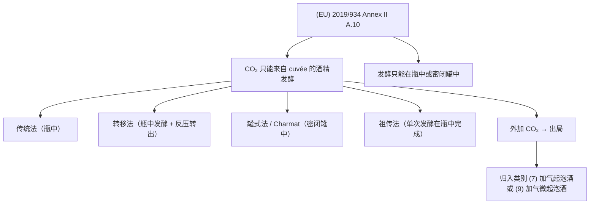
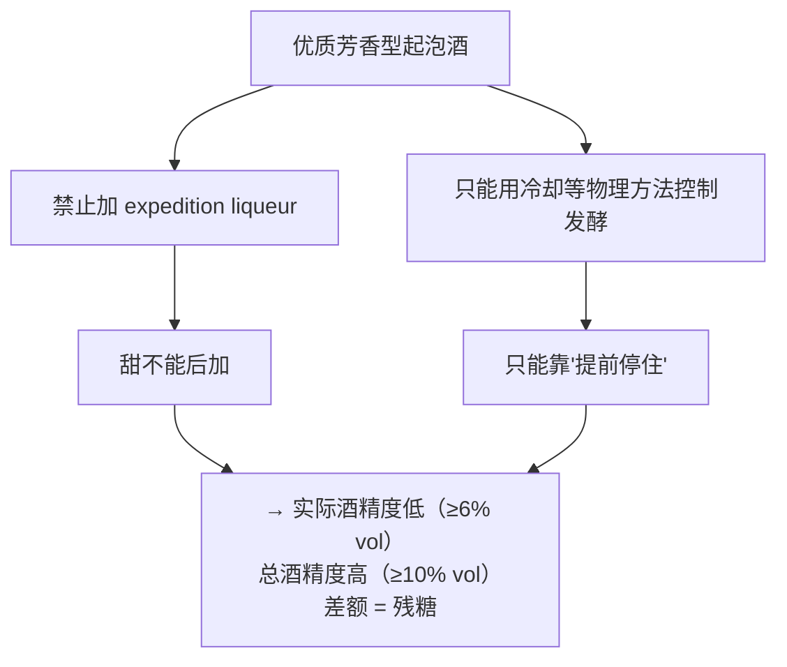
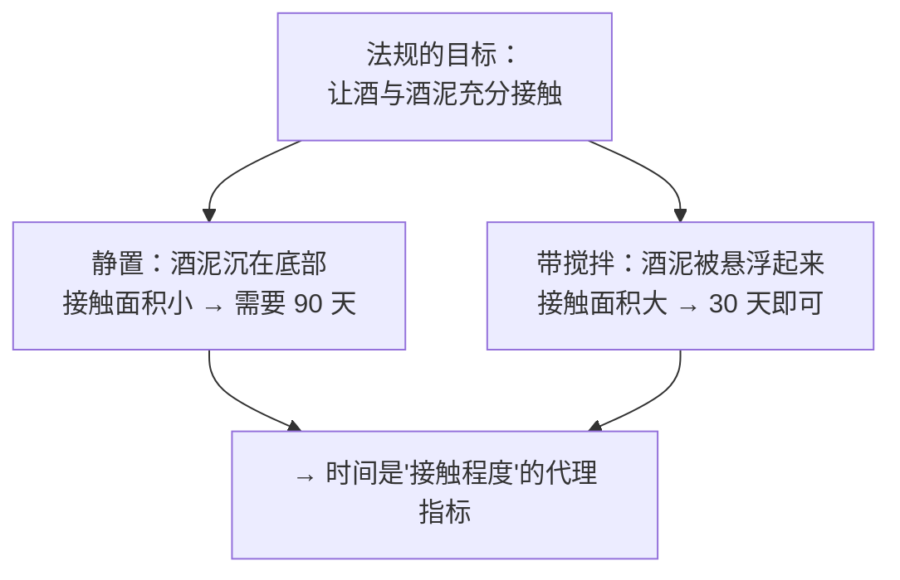
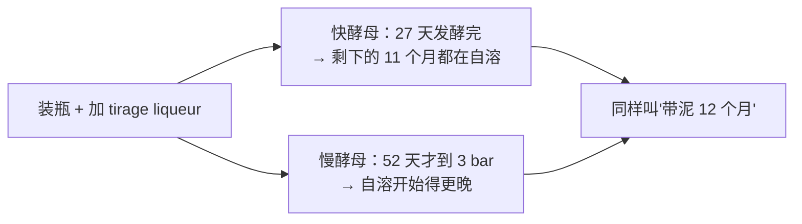
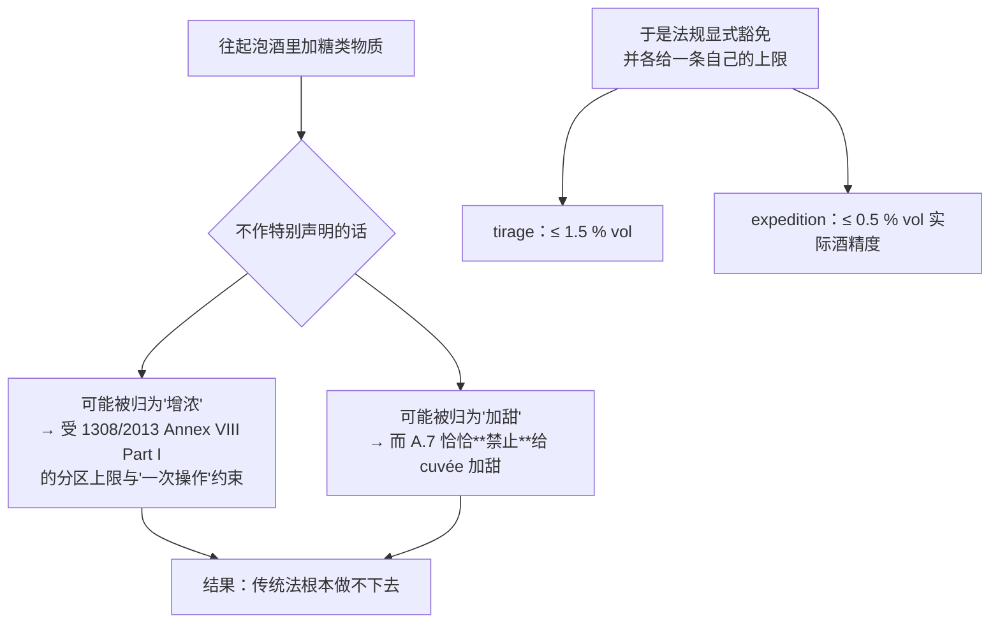

# 第 16 章 思考题参考答案

> 只记「问题 + 正确答案」，不记读者作答。案例题给**完整推理链**。
>
> 凡本书**尚未核到一手出处**的地方，答案里会明说——请不要把"待核"当成"已知"。

## Q1

**问**："CO₂ 只能由 cuvée 的酒精发酵产生"+"只能在瓶中或密闭罐中进行"，
把哪些路线留在同一类别里，把哪条排除出去？

**答**：

**留在同一类别里的**：传统法、转移法、罐式法、祖传法——
**它们的差别只是"哪只容器"和"几次发酵"，而 CO₂ 的来源是同一个。**

**被排除出去的**：**外加 CO₂ 的做法**。
它不是"违法"，而是**被分到了另外的法定类别**：
**(7) 加气起泡酒**与 **(9) 加气微起泡酒**——
而且 (7) 还有一条限定：**只能由不带 PDO/PGI 的葡萄酒制得**。

**两个值得注意的细节**：

1. **转移法并没有被排除**，尽管它在工程上要接触 CO₂。
   法规的处理很务实：**授权反压转移时使用 CO₂**，
   但加了一句"**不得因此提高起泡酒中二氧化碳的压力**"；
2. **法规没有提"传统法""罐式法"这些行业名词**——
   它只写"瓶中或密闭罐中"。**行业名词是市场语言，法规写的是物理条件。**

> **要带走的判断**：**读法规时找"它在管什么物理量"**。
> 这一条管的是**分子来源 + 容器类型**，于是所有工艺名词都自动落位。

## Q2

**问**：为什么"tirage liqueur 不得使 cuvée 总酒精度提高超过 1.5 % vol"间接管住了压力？
哪一步是经验值？

**答**：

**推理链有四步**：

| 步 | 内容 | 依据 |
|----|------|------|
| ① | tirage liqueur 带来的酒精度提高 **≤ 1.5 % vol** | **法规**（2019/934 Annex II A.5）|
| ② | 酒精度的提高来自糖的发酵，因此 ①**等价于给加糖量设了上限** | **法规定义**（Annex II Part IV 第 14 点：潜在酒精度 = 糖完全发酵所能产生的酒精）|
| ③ | 每 1 % vol 大约需要每升 **16~18 g** 糖 → 1.5 % vol ≈ **每升 24~27 g** | ⚠️ **这一步是本书的经验值，不是法规** |
| ④ | 每 1 g 己糖完全发酵产 **约 0.49 g CO₂** → 24~27 g/L 糖 ≈ **12~13 g/L CO₂** | **化学计量**（1 己糖 → 2 乙醇 + 2 CO₂）|

**在封闭容器里，这些 CO₂ 无处可去**，所以**产气总量有了天花板 → 压力也就有了天花板**。

**⚠️ 第 ③ 步必须打星号**：
本书在第 3 章就把"每升 16~18 g 糖对应 1 % vol"登记为**经验值**，
并且在[出处与资料登记](../standards.md) §9 第 13 条写明：
**法规只规定增浓的结果上限，不规定换算系数，本书至今未找到可引用的一手定义。**

**还有一个本书没有跨过去的坎**：**从"12~13 g/L CO₂"到"多少 bar"**。
这一步需要 CO₂ 的亨利定律常数与温度修正，**本书只核到了 SO₂ 的亨利常数（第 5 章）**。
所以本章明确不给换算式。

> **要带走的判断**：这是本书第三次看到同一条立法技术——
> **不管手段，管一个事后可测的结果。**
> （第一次：禁止过度压榨 → 规定副产物里的最低酒精量；
> 第二次：橡木片"不得添加增味物" → 管配料而不是管风味；
> 第三次：就是这一条。）

## Q3

**问**：实际 6.5 % vol、总 11 % vol。潜在酒精度是多少？大致残糖？属于哪个甜度术语？

**答**：

**第一步，用法规定义**（Annex II Part IV 第 15 点：**总 = 实际 + 潜在**）：

> **潜在酒精度 = 11.0 − 6.5 = 4.5 % vol**

**第二步，用经验值换算**（⚠️ 量级参考，非法规）：

> **4.5 × (16~18) ≈ 每升 72 ~ 81 g 糖**

**第三步，对照 (EU) 2019/33 Annex III Part A**：

| 术语 | 糖含量 |
|------|-------|
| demi-sec | 32 ~ 50 g/L |
| **doux** | **> 50 g/L** |

> **72~81 g/L 落在 `doux` 区间。**

**这道题真正要练的是最后一问**：
**为什么这类酒的甜"必须"来自没发酵完的糖？**

因为它属于**优质芳香型起泡酒**（实际 ≥6 % vol、总 ≥10 % vol），
而法规对这一类同时规定了：

- **禁止添加 expedition liqueur**（Annex II B.4(c) 与 C.9(c)）；
- **发酵过程的控制只能通过冷却或其他物理方法**（B.4(b) 与 C.9(b)）。

**两条合起来只剩一条路**：**在发酵进行到某个点时用物理方法（降温）把它停住**，
剩下的糖就是成品的甜味来源。

> **要带走的判断**：**"实际酒精度低而总酒精度高"是一个可以直接读出来的甜度指纹。**
> 它比甜度术语更根本——因为它告诉你**糖是哪来的**。

## Q4

**问**：判断这段文案。
> *"本款采用传统法，瓶中二次发酵 18 个月，气泡细腻绵密；
> 标注 extra dry，比 brut 更干爽；且为零添加糖工艺。"*

**答**：三句各踩一个知识点，而且**第二、三句互相矛盾**。

**第一句："传统法，瓶中二次发酵 18 个月，气泡细腻绵密"** → **前半合规、后半无据**。

- **"瓶中二次发酵 18 个月"是有意义的信息**：
  对带 PDO 的优质起泡酒，法规底线是**整个生产过程 ≥ 9 个月**（瓶中发酵者），
  而发酵 + 带泥 **≥ 90 天**。**18 个月明显高于底线，且落在自溶研究的典型区间
  （6~18 个月）的上端。**
- **"气泡细腻绵密"→ 缺乏证据**。
  **本书未核到把气泡尺寸与工艺方法或品质联系起来的可引用对照研究。**
  而气泡的外观还受**温度、杯壁状况**等影响（第 5 章：温度改变气体溶解度）。

**第二句："extra dry，比 brut 更干爽"** → ❌ **明确错误，方向反了**。

| 术语 | (EU) 2019/33 Annex III Part A 规定的糖含量 |
|------|------------------------------------------|
| **brut nature** | **< 3 g/L 且二次发酵后未加糖** |
| **extra brut** | 0 ~ 6 g/L |
| **brut** | **< 12 g/L** |
| **extra dry** | **12 ~ 17 g/L** |

**extra dry 比 brut 甜**，不是更干。这是这套术语最经典的陷阱：
**"dry"系列（extra dry / sec / demi-sec / doux）整体排在"brut"系列的甜的一侧。**

**第三句："零添加糖工艺"** → ⚠️ **与第二句直接冲突**。

- 法规里与"零添加糖"最接近的表述是 **brut nature**：
  **糖 < 3 g/L，且二次发酵后未加糖**；
- 而 **extra dry 是 12~17 g/L**——**这个糖含量通常正是 dosage 带来的**。

**两句话不可能同时成立。**（除非它指的是"tirage 时用的不是蔗糖"，
但 tirage liqueur 的合法成分本来就包括浓缩葡萄汁等——**那样说也只是换了糖的来源。**）

> **改写建议**："本款在瓶中完成二次发酵并带泥陈放 18 个月。
> 补液（dosage）后糖含量落在 extra dry 区间（12~17 g/L），
> 比 brut（<12 g/L）略甜，适合 ____ 场景。"

> **要带走的判断**：**甜度术语是酒标上最硬、也最容易被说反的信息。**
> 遇到"更干爽/更清爽"这类形容词时，直接去查它对应的 g/L 区间——**两秒钟就能验完。**

## Q5

**问**："带搅拌装置的容器可把 90 天缩短到 30 天"隐含了什么机制假设？
它与第 14 章的自溶机制怎么对上？

**答**：

**隐含的假设是：法规关心的不是"泡了多久"，而是"酒与酒泥接触得够不够充分"。**

**与第 14 章对上的三点**：

1. **自溶是"细胞死后被激活的酵母自身酶水解内部生物聚合物、释放低分子量产物"**——
   **释放出来的物质必须进入酒中才算数**，所以**传质**是限速环节之一；
2. **搅桶（bâtonnage）做的就是同一件事**：把沉下去的酒泥重新悬浮；
3. 第 15 章讲橡木片时也出现过同一逻辑：
   **木片"接触面积远大于桶，因此用量小、时间短"**。

**所以这条法规其实是在说一句很化学的话**：
**"接触面积 × 时间"才是那个真正的自变量，而法规只能规定其中容易核查的那一个。**

⚠️ **一条必要的限制**：法规的"30 天 / 90 天"是**监管底线**，
**不是"搅拌 30 天 = 静置 90 天"的等效换算**。
本书**未核到验证这种等效性的一手研究**——
事实上第 14 章引的综述明确说，自溶研究的结论**难以普适化**。

> **要带走的判断**：**当一条规定给出两个不同的最短时长时，
> 去找它们之间那个没被写出来的物理量。** 通常那才是真正的机制。

## Q6

**问**：27 天 vs 52 天达到 3 bar，最终都是 5.1~5.4 bar。这告诉你什么？

**答**：

**把两件事分开看**：

| 观察 | 它告诉你的 |
|------|----------|
| **最终压力几乎相同（5.1~5.4 bar）** | **压力的终点由"可发酵糖的总量"决定**——两株酵母最终都把糖发完了，产生的 CO₂ 总量相近 |
| **到达 3 bar 的时间相差近一倍（27 vs 52 天）** | **速度由酵母决定**（该研究还记录到 N62 的细胞浓度更高）|

**这对"陈放 X 个月"的可比性意味着什么？**

**"带泥 12 个月"这句话，在两支酒里可能对应完全不同的实际进度**：

因为**自溶发生在细胞死亡之后**（第 14 章），
而**发酵期的长短直接改变了"从什么时候起开始自溶"**。

**另一项研究给了旁证**：比较皇冠盖与 tirage 软木塞的试验发现，
**发酵时间是支配酒成分的首要因素**，且**最显著的代谢变化发生在装瓶后第 30~45 天**——
**恰好落在上面两株酵母的时间差之内。**

> **要带走的判断**：**"陈放多少个月"是一个起算点不明确的指标。**
> 它从装瓶算起，但真正决定风味的那段（自溶）从**发酵结束**才算起。
> 所以在比较两支酒时，**同样的月数不等于同样的进度**。

## Q7

**问**：抄下 Annex II Section A 第 5、6、7 点。
为什么要特意声明"tirage 与 expedition liqueur 的添加既不算增浓也不算加甜"？

**答**：

**三条的内容**：

| 点 | 内容 |
|----|------|
| **A.5** | **tirage liqueur 与 expedition liqueur 的添加，既不视为增浓，也不视为加甜**；**tirage liqueur 不得使 cuvée 的总酒精度提高超过 1.5 % vol**（以 cuvée 总酒精度与加 expedition liqueur 前起泡酒总酒精度之差测定）|
| **A.6** | **expedition liqueur 的添加，不得使起泡酒的实际酒精度提高超过 0.5 % vol** |
| **A.7** | **cuvée 及其组分的加甜被禁止** |

**为什么要特意声明？因为如果不声明，这两个动作会被别的条文"顺手管死"。**

**更本质的理由是：这两个动作的目的与"增浓/加甜"不同。**

| 动作 | 目的 |
|------|------|
| **增浓** | 提高成酒的酒精度（弥补成熟度不足）|
| **加甜** | 提高成品的甜度 |
| **tirage liqueur** | **引发二次发酵**（法规的定义原文如此）——糖会被吃掉，目的是产气 |
| **expedition liqueur** | **赋予特殊风味品质**——是最终风格的调整 |

**这与第 13 章 Q7 是同一个结构**：
在 (EU) 2019/934 Article 7(3) 里，**"增浓"与"加甜"被明确排除在 coupage 之外**，
理由同样是"这两项操作已被别的条文单独管住，且其目的不是混合不同来源"。

> **要带走的判断**：**法规里的"不视为 X"条款，往往比禁止条款更能说明立法结构。**
> 它出现的位置告诉你：**立法者预见到了一个分类冲突，并主动拆掉了它。**
> 读到这种句子时，值得反问一句：**如果不写这句，会发生什么？**

## Q8

**问**：再找一条"防规避条款"，并说明它们通常长什么样。

**答**：

**本书前面至少有三条现成的**：

| 条款 | 它防的规避 | 出处 |
|------|----------|------|
| **禁止过度压榨**：不规定压力上限，而规定**皮渣与酒脚中必须保留至少相当于成酒酒精体积 5 % 的酒精** | 用不同设备"合法地"把葡萄榨干 | 1308/2013 Annex VIII Part II D.1（第 13 章）|
| **用于蒸馏的加强酒只能用于蒸馏** | 把为蒸馏而加了酒精的酒当成普通酒卖 | 同上 Part II A.3（第 13 章）|
| **橡木片不得为增强天然风味或增加可萃取酚类而添加任何产品** | 卖"加了料的木片" | 2019/934 Annex I Part A Appendix 7（第 15 章）|
| **非 PDO 白酒与非 PDO 红酒 coupage 不得产出桃红** | 用调配伪造品类 | 2019/934 Art. 8(1)（第 13 章）|
| **本章的**：带 PDO 的优质起泡酒**即使装在 < 25 cl 的容器中也须 ≥ 3 bar** | 用小瓶规避气压要求 | 2019/934 Annex II C.5 |

**防规避条款的三个典型特征**：

1. **它通常以"即使…也…"或"不排除…"的句式出现**——
   语法上就是在**堵一个例外**；
2. **它规定的往往是一个事后可测的量**（副产物里的酒精、瓶内过压、粒径），
   而不是一个过程或意图；
3. **它出现的位置暴露了曾经有人这么做过**——
   法规不会凭空去堵一个没人想过的漏洞。

> **要带走的判断**：**读法规时，"奇怪的细节"往往是最有信息量的部分。**
> 为什么偏偏要写"小于 25 cl"？因为**顶空比例会随容器变化**，
> 而如果不写，小瓶就能在同样的工艺下报出更低的过压。
> **法规的琐碎，通常是对现实的记录。**
