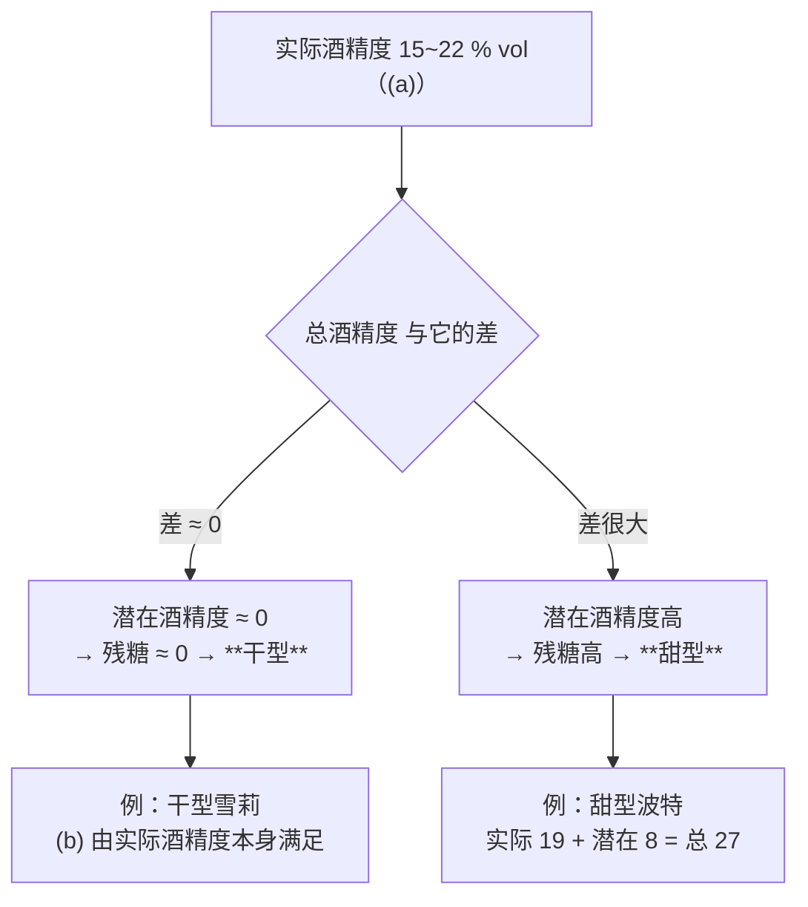
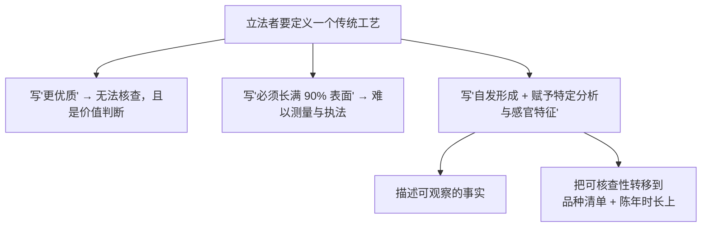
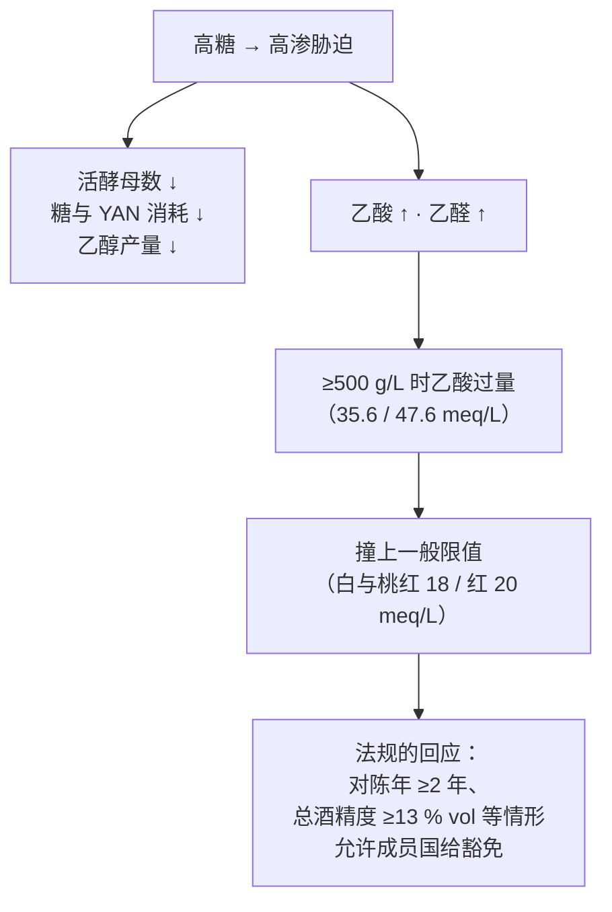
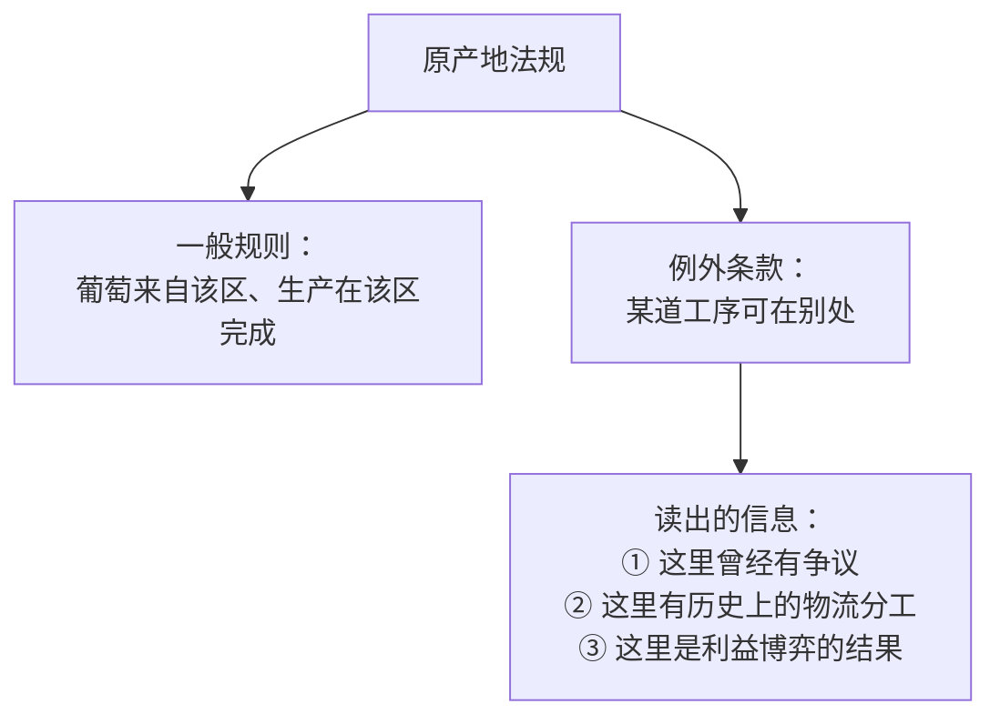
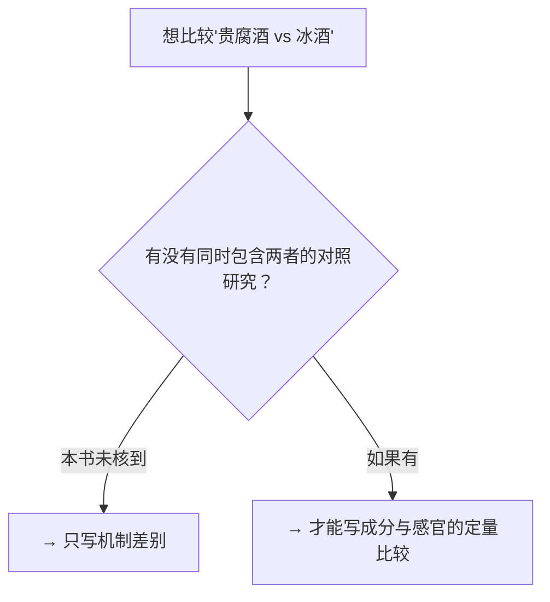

# 第 17 章 思考题参考答案

> 只记「问题 + 正确答案」，不记读者作答。案例题给**完整推理链**。
>
> 凡本书**尚未核到一手出处**的地方，答案里会明说——请不要把"待核"当成"已知"。

## Q1

**问**：用 (3) 项的 (a)(b)(d) 三条，解释为什么"加强"与"甜"是两件事。

**答**：

**三条规定的分别是三件事，没有一条规定甜度**：

| 条 | 规定的是 | 它管的是 |
|----|---------|---------|
| **(a)** | **实际酒精度 15~22 % vol** | **成品里有多少乙醇** |
| **(b)** | **总酒精度 ≥17.5 % vol**（有例外名单）| **乙醇 + 糖折算的酒精之和** |
| **(d)** | **初始自然酒精度 ≥12 % vol** | **原料成熟到什么程度** |

**"甜"藏在 (a) 与 (b) 的差额里**（用第 16 章的定义：总 = 实际 + 潜在）：

**决定落在哪一边的，是"什么时候加酒精"**：

- **发酵中途加** → 酵母被高酒精摁停 → **糖被留下** → 甜型；
- **等发酵完再加** → 糖已经被吃光 → **干型**。

**法规对这两种做法一视同仁**——它只管加的是什么（(e) 项：
中性葡萄酒精 ≥96 % vol，或葡萄酒/葡萄干蒸馏液 52~86 % vol）和加完之后落在哪个区间。

> **要带走的判断**：**"加强"是一个关于酒精来源的类别，不是一个关于甜度的类别。**
> 所以"加强酒=甜酒"这个等式从来就不成立——**干型雪莉是最常见的反例。**

## Q2

**问**：flor 的法规定义里**刻意没有说**什么？为什么这样写更稳妥？

**答**：

**原文是**：

> "在 flor 之下发展"指：**当葡萄汁完全酒精发酵之后，一层典型的酵母膜在酒的自由表面
> 自发形成时所发生的生物学过程，该过程赋予产品特定的分析与感官特征。**

**它刻意没说的有三件事**：

| 没说的 | 如果说了会怎样 |
|-------|--------------|
| **这层膜是哪个物种** | 已核到的事实是：flor 膜**以 *S. cerevisiae* 最丰富，但同时含多个其他属种**——**写死物种就会和现实冲突** |
| **这样做更好喝** | 那是价值判断，**监管者无法核查** |
| **要长多厚、覆盖多久** | 这些是难以标准化的量；法规改用**可核查的替代指标**——**限定六个品种 + 橡木桶中平均陈年两年** |

**为什么"赋予特定的分析与感官特征"这种写法更稳妥？**

因为它**只断言"会不一样"，不断言"会更好"**。

**注意"自发形成（develops spontaneously）"这个词也在干活**：
它把"接种一层酵母上去"排除在这个定义之外——
**这是一条不显眼、但很关键的限定。**

> **要带走的判断**：**好的定义条款描述"可观察的过程"，把"品质"留给市场。**
> 本书前面见过的反面教材是营销话术——它们习惯于把过程直接等同于品质。

## Q3

**问**：法规的 50 ℃ 与工艺实践的 45~50 ℃ 是什么关系？举一个同类例子。

**答**：

**关系是：法规把既有实践的边界写成了上限。**

| | 内容 |
|---|---|
| **工艺实践**（已核到的描述）| 酒入大型内衬罐，**每天升温约 5 ℃**，**维持 45~50 ℃ 共三个月**，其后橡木桶中**至少三年** |
| **法规**（2019/934 Annex III A.4(c)）| **允许 Madeira 在温度不超过 50 ℃ 的容器中陈年** |

**法规并没有"发明"一个温度，它是在两件事之间划界**：

1. **对内**：确认这项在别处会被视为异常的操作（把酒加热）**对这一款酒是合法的**；
2. **对外**：**封住上限**——不允许用更高的温度更快地"做旧"。

**同类例子（本书前面至少有三个）**：

| 例子 | 法规写的边界 | 它对应的实践 |
|------|------------|------------|
| **禁止过度压榨** | 皮渣与酒脚中的酒精量 **≥ 成酒酒精体积的 5 %**（第 13 章）| 行业本来就不会把葡萄榨到极限，法规把"极限"定了下来 |
| **增浓上限** | A 区 **3 %**、B 区 **2 %**、C 区 **1.5 % vol**（第 3 章）| 按纬度递减，与各区的自然成熟度对应 |
| **tirage liqueur 使总酒精度提高 ≤1.5 % vol** | 第 16 章 | 大致对应传统的加糖量级 |

> **要带走的判断**：**读到法规里一个"奇怪的具体数字"时，先假设它来自实践，而不是来自理论。**
> 这个假设通常是对的，而且它能帮你记住这些数字——
> **50 ℃ 不是随便挑的，它是 estufagem 的上沿。**

## Q4

**问**：判断并改写这段文案。
> *"本款波特加入优质白兰地强化至 20 度；雪莉都是氧化型酒，越黑越好；
> 甜酒糖分高不易变质，开瓶后可以放很久。"*

**答**：三句各踩一个知识点。

**第一句："加入优质白兰地强化至 20 度"** → ⚠️ **结论没错，用词不准**。

- **"20 度"落在法规区间内**：利口酒的实际酒精度须在 **15~22 % vol**——没问题；
- **但"白兰地"不是法规用词**。(3)(e) 规定加入物必须是：
  **葡萄来源的中性酒精（含葡萄干蒸馏所得），实际酒精度 ≥96 % vol**，
  或**葡萄酒/葡萄干蒸馏液，实际酒精度 52 %~86 % vol**；
  列名 PDO 另有 (f) 项的选项（含葡萄酒或皮渣蒸馏烈酒 52~86 % vol 等）。
- **"优质"是形容词，不带信息。** 真正可问的是：**加的是中性酒精还是蒸馏液、多少度。**

> **改写**："本款在发酵进行中加入符合欧盟规定的葡萄来源烈酒中止发酵，
> 成品实际酒精度 20 % vol，残糖 ____ g/L。"

**第二句："雪莉都是氧化型酒，越黑越好"** → ❌ **两处都错**。

- **"都是氧化型"错**：雪莉有**两条陈年路线**。
  **生物陈年**那一支恰恰是**被 flor 挡在氧化之外**的——
  法规把 flor 定义为"葡萄汁完全酒精发酵后，一层典型酵母膜在酒的**自由表面自发形成**"，
  而 **`vino generoso` 必须全部或部分在 flor 之下发展**；
- **"越黑越好"错**：颜色深浅对应的是**陈年路线与时间**，不是品质等级。
  Fino 一类颜色浅、气息尖锐（与**乙醛**相关）；
  Oloroso 一类颜色深、以坚果咖喱类气息见长（与 **sotolon** 相关）。
  **这是两种风格，不是两个档次。**

> **改写**："雪莉有生物陈年与氧化陈年两条路线：前者在 flor 酵母膜下进行，
> 酒色浅、气息尖锐；后者与氧缓慢接触，酒色深、坚果与焦糖类气息突出。本款属 ____。"

**第三句："甜酒糖分高不易变质，开瓶后可以放很久"** → ❌ **有直接反例**。

已核到的证据：**首次从托卡伊发酵后的贵腐甜酒中分离到 *Zygosaccharomyces lentus***——
它**耐渗透压、耐硫高、耐酒精 8 % v/v，在酒窖温度与酸性条件下生长良好**，
被判定为**潜在腐败酵母，可能引发陈年期间的二次发酵**。

**推理链**：

> "糖多所以不坏"的隐含前提是**没有微生物能在高糖里活下去**。
> 这个前提**已被证伪**——耐渗透压酵母是存在的，而且就是从这类酒里分离出来的。
>
> **真正让甜酒相对稳定的，是糖 + 酒精 + 酸 + SO₂ 的组合**，不是糖单独起作用。
> 而**开瓶之后，这个组合里最脆弱的一环（顶空的氧）被打开了**。

> **改写**："本款残糖 ____ g/L。开瓶后请冷藏并在 ____ 内饮用完毕。
> 高糖并不意味着无菌——耐渗透压酵母在这类酒中已被分离到。"

> **要带走的判断**：这段文案三句的共同毛病是**把一个部分正确的事实推到绝对**
> （加了酒精 → "白兰地"；有氧化路线 → "都是氧化"；糖多 → "不会坏"）。
> **本书反复见到的同一种错误：把有条件的规则说成无条件的规则。**

## Q5

**问**：把 0.82 / 2.14 / 2.86 g/L 乙酸换算成 meq/L，并对照限值。
为什么法规要为"陈年 ≥2 年或总酒精度 ≥13 % vol"的酒留豁免？

**答**：

**换算**（乙酸摩尔质量 **60.05 g/mol**，一元酸，故 **1 meq/L = 0.060 05 g/L**）：

| 试验中的乙酸 | 计算 | **meq/L** | 对照 |
|------------|------|----------|------|
| **0.82 g/L**（初始糖 370 g/L）| 0.82 ÷ 0.060 05 | **约 13.7** | 在白与桃红 **18 meq/L** 限内 |
| **2.14 g/L**（初始糖 500 g/L）| 2.14 ÷ 0.060 05 | **约 35.6** | **约为限值的两倍** |
| **2.86 g/L**（初始糖 550 g/L）| 2.86 ÷ 0.060 05 | **约 47.6** | **约为限值的 2.6 倍** |

**为什么法规要留豁免？三条理由，一条比一条根本**：

**理由一（化学）：高糖必然把发酵推向产乙酸的方向。**
该试验里初始糖与乙酸生成**正相关**，与乙醇产量**负相关**——
这是**高渗胁迫下酵母代谢的系统性后果**，不是操作失误。
**如果不留豁免，一整类酒在法律上无法存在。**

**理由二（工艺）：长期桶陈本身会抬高挥发酸。**
陈年时间越长，与氧接触的机会越多，醋酸菌活动与化学氧化的窗口也越长。
**"陈年不少于两年"这个豁免条件，恰好对应了这一点。**

**理由三（感知）：同样的挥发酸，在不同基质里的显著程度不同。**
高糖与高酒精都会改变挥发酸的感知——这与第 14 章的二乙酰、第 2 章的阈值纪律是同一件事。
⚠️ **但本书未核到关于挥发酸感知阈值随糖/酒精变化的一手数据**，
**因此这一条只作为机制性解释，不当作已核结论。**

> **要带走的判断**：**当一条法规的豁免条件看起来很"具体"时，
> 去找它对应的那类产品——豁免的形状，通常就是那类产品的形状。**

## Q6

**问**："自然酒精度 ≥16 % vol（或每升 272 g 糖）"能不能当作通用换算系数？

**答**：**不能。理由有三层。**

**第一层：它是什么。**
**272 ÷ 16 = 17 g/L 每 1 % vol**——数值上确实落在本书经验值 **16~18 g/L** 的区间里，
**可以作为交叉印证**。

**第二层：它不是什么。**
这句话出现在 **(15) 葡萄干葡萄酒的定义条款**内部，
其作用是**为这一条定义提供一个等价的判定口径**——
即"要么测自然酒精度，要么测糖含量，两者择一即可判定是否合规"。

**它没有说的是**：

- 这个比例适用于**其他类别的酒**；
- 这个比例是**发酵的实际得率**（实际得率还受酵母、温度、氮源等影响，第 3 章）；
- 这个比例是**欧盟对糖酒转化的一般性定义**。

**第三层：本书的纪律。**
[出处与资料登记](../standards.md) §9 第 13 条明确登记：
**"糖 → 酒精的实际转化系数"本书至今只有经验值，法规只规定增浓的结果上限，
不规定换算系数。**
**一条定义条款里的等价表述，不足以解除这条留白。**

> **要带走的判断**：**法规里出现一个数字，不等于法规给了你一个公式。**
> 要问的是：**这个数字在条文里承担什么功能？**
> 这里它承担的是"判定口径"，不是"换算依据"。
>
> ⚠️ 但它有一个**实实在在的用处**：
> **当有人给出一个明显偏离 16~18 g/L 的换算系数时，你手上多了一个官方文本可以对照。**

## Q7

**问**：抄下 Annex III Section B 第 3、4 点里的地名与允许的操作。
为什么原产地法规会出现"允许在另一个地方完成某道工序"的条文？

**答**：

**两条的内容**：

| 点 | 地名 | 允许的操作 |
|----|------|----------|
| **B.3** | **Málaga**、**Jerez-Xérès-Sherry**；**Montilla-Moriles** | 由 **Pedro Ximénez** 品种制得、加入葡萄来源中性酒精以阻止发酵的**葡萄干汁**，**可以来自 Montilla-Moriles 产区** |
| **B.4** | **Douro**；**Vila Nova de Gaia — Porto** | 保留给 **Porto** 的 PDO 利口酒（葡萄来自划定的 Douro 产区），其**额外的生产与陈年过程可在 Douro 产区内，或在 Vila Nova de Gaia — Porto 进行** |

**为什么会有这种条文？三条理由**：

**① 因为历史上的分工先于法律。**
这些做法在原产地制度建立之前就已经存在（葡萄在一地种、陈年在另一地做）。
**法律要么承认它，要么消灭一个产业。**

**② 因为"原产地"保护的是"特征的来源"，不是"每一道工序的地点"。**
第 11 章已核的 **(EU) No 1308/2013 Article 93** 规定：
**PDO 要求"葡萄完全来自该地理区域"且"生产在该区域内完成"**，
并在 **93(4)** 里把"生产"限定为**从采收到酿造过程完成**为止。
**"陈年"并不当然包含在"生产"里**——这就给 B.4 这类条文留出了空间。

**③ 因为这类条文本身就是原产地制度最有信息量的部分。**

> **要带走的判断**：**读产区法规时，先读例外，再读规则。**
> 规则告诉你"官方想讲的故事"，**例外告诉你"这个产业实际是怎么运转的"**。
> 第四部分（第 19~27 章）会把这条方法用满。

## Q8

**问**：加酒精与高糖两条路，各自把风险推到了哪里？

**答**：

**两条路都没有消灭风险，只是把它搬了个位置。**

| | **加酒精（加强）** | **高糖（浓缩）** |
|---|-----------------|----------------|
| **微生物风险** | **被压得很低**——15~22 % vol 的酒精对绝大多数酿酒微生物是致命的 | **依然存在**——耐渗透压酵母（*Z. lentus*：耐硫、耐 8 % v/v 酒精、酒窖温度下生长良好）可引发**陈年期间的二次发酵** |
| **化学风险** | 主要转移到**氧化**上（长期桶陈、索莱拉、estufagem 都是与氧或热长期相处）| **发酵阶段就出问题**：乙酸与乙醛随初始糖升高而增加，≥500 g/L 时**乙酸过量** |
| **感官代价** | **酒精主导口感**，热感强（第 1 章：TRPV1 通路的化学感觉）| **挥发酸偏高**、发酵可能停滞、酒精度反而更低（130.26 → 90.85 g/L）|
| **法规的回应** | 把它做成一个**受限的例外类别**（禁止加酒精，但列举例外），并对加入物的种类与度数逐条限定 | 对**陈年 ≥2 年、总酒精度 ≥13 % vol** 等情形**给挥发酸豁免** |
| **储存的含义** | 开瓶后相对耐放（高酒精），但仍会继续氧化 | **开瓶后按"有糖有微生物风险"对待**，冷藏并尽快喝完 |

**与第 5 章的联系**：SO₂ 在这两条路上都还在工作，
但**它不是唯一的防线**——加强酒靠酒精，甜酒靠糖 + 酸 + 酒精 + SO₂ 的**组合**。
**组合里最弱的一环决定了实际的稳定性，而开瓶会打开其中一环（氧）。**

> **要带走的判断**：**"这瓶酒稳不稳"从来不是单一变量的问题。**
> 问"它靠什么稳住"，比问"它糖多不多"有用得多。

## Q9

**问**：贵腐与冰冻都是浓缩，机制差别在哪？为什么本书不给定量结论？

**答**：

**至少三条机制差别**：

| 差别 | 贵腐 | 冰冻浓缩 |
|------|------|---------|
| **谁在做浓缩** | **一个活的真菌**（*Botrytis cinerea*）在葡萄上代谢并使浆果脱水 | **纯物理过程**：水先结冰，压榨时把冰留下 |
| **它会不会改变成分种类** | **会**。真菌代谢会引入新的物质与酶活——第 13 章已核：**灰霉带来的漆酶使谷胱甘肽类抗褐变方案失效**；第 17 章已核：**重度感染组的挥发物轮廓最丰富，共鉴定 70 个** | **原则上不会**：糖、酸、香气前体按同一比例被浓缩（**这是简化，实际会有选择性**）|
| **风险来自哪里** | 感染程度不可控；同一串葡萄上程度不一，因此**必须分次手工采收**；漆酶带来氧化风险 | 依赖**天气**（要等到自然冰冻），因此**产量与年份风险极高** |

**为什么本书不给成品差异的定量结论？**

**因为本书没有核到做过这种直接对照的研究。**

已核到的两项分别是：

- 贵腐：**单一品种（小芒森）、单一产区（贺兰山东麓）、单一年份**的三档感染程度对照；
- 冰酒：**用葡萄糖人为调节初始糖**的发酵试验，**不是自然冰葡萄汁的年份对比**。

**两者的对象、设计与目的都不同，把它们的数字并排比较是没有意义的。**

> **要带走的判断**：**"机制不同"可以写，"成品差多少"必须有对照才能写。**
> 这是本书从第 12 章（帽管理）、第 13 章（压榨分段、两条氧化路线）、
> 第 15 章（木片 vs 桶）一路贯彻下来的同一条纪律——
> **宁可留白，也不用听起来合理的措辞填补空白。**
