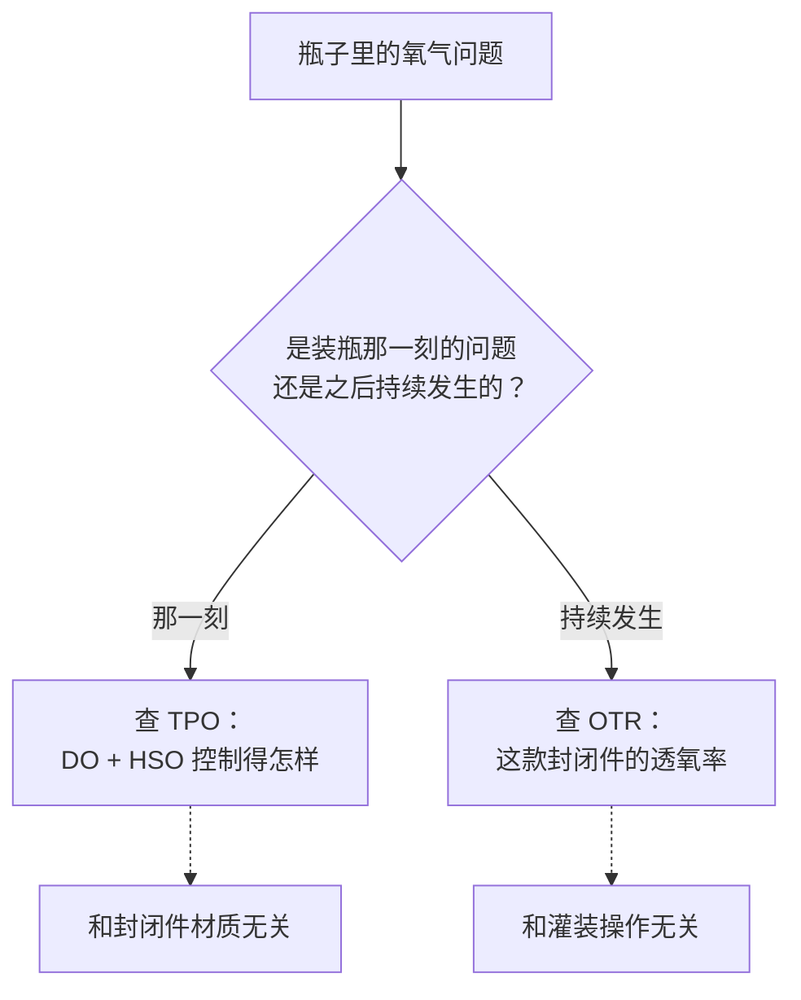
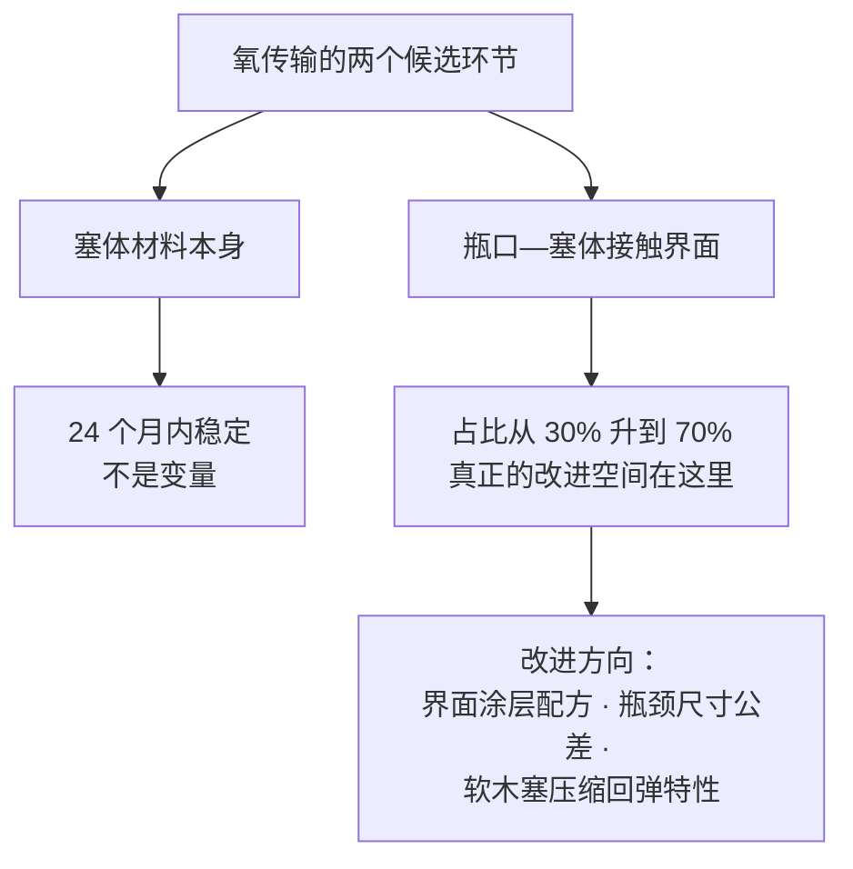
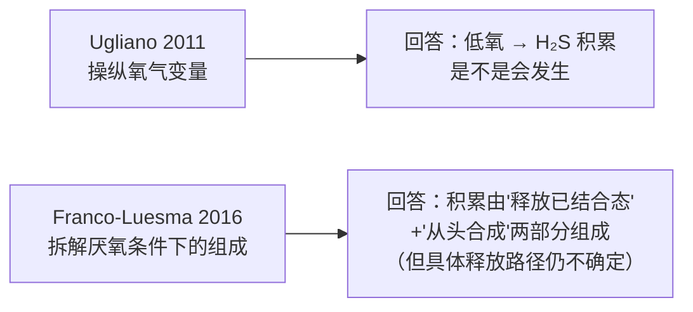
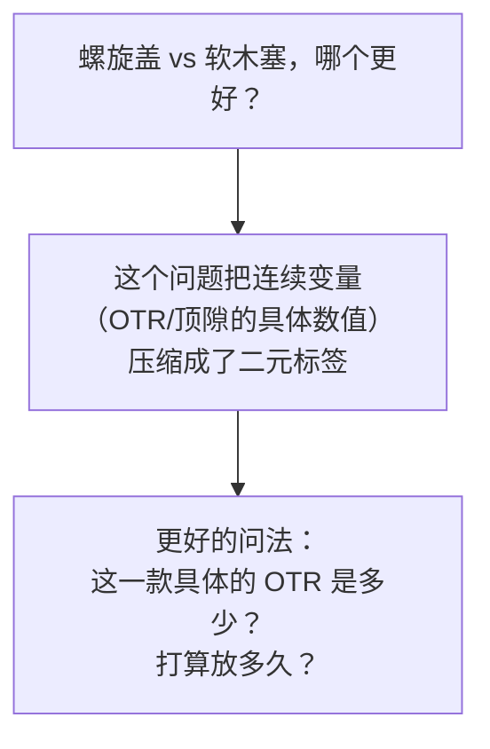

# 第 18 章 思考题参考答案

> 只记「问题 + 正确答案」，不记读者作答。案例题给**完整推理链**。
>
> 凡本书**尚未核到一手出处**的地方，答案里会明说——请不要把"待核"当成"已知"。

## Q1

**问**：用 TPO 与 OTR 两个概念，解释"装瓶时氧多不多"和"封闭件好不好"为什么是两件不同的事。
混为一谈会导致什么样的错误结论？

**答**：

**两个概念管的是完全不同的时间段**：

| 概念 | 管的是 | 时间尺度 |
|------|-------|---------|
| **TPO**（总装瓶氧 = DO + HSO）| 装瓶**那一刻**一次性封进瓶子的氧 | 一次性事件 |
| **OTR**（氧气传输率）| 封闭件**之后每年**持续透过的氧 | 持续、细水长流 |

**它们由完全不同的环节决定**：TPO 取决于**灌装车间的操作**（是否充分排空顶隙、
酒液本身的溶解氧控制），和封闭件材质**几乎无关**；OTR 取决于**封闭件本身的物理特性**，
和灌装操作无关。

**混为一谈会导致的典型错误**：

- 把"这瓶酒刚开瓶就有点氧化味"归咎于"封闭件不好"，但真正原因可能是
  **装瓶那天顶隙没排空**（TPO 过高）——换一款封闭件也救不了这瓶酒；
- 反过来，把"这批酒放了十年还很新鲜"归功于"装瓶控制得好"，
  但真正原因可能是**封闭件的 OTR 本来就很低**——装瓶环节其实很普通。

> **要带走的判断**：**诊断一瓶酒的氧气问题时，先问是哪个阶段出的问题**，
> 否则容易把灌装车间的锅，甩给封闭件供应商（或者反过来）。

## Q2

**问**：Chanut 等 (2023) 发现接触界面占总氧传输的比例会随时间从 30% 以上升到约 70%，
而塞体本身的扩散系数长期稳定。如果你是封闭件工程师，改进重点该放在哪？

**答**：

**应该放在瓶口与软木塞的接触界面，而不是塞体材料本身。**

理由直接来自已核到的数据：

- **塞体本身的扩散系数在 24 个月内保持稳定**（约 1.3×10⁻¹¹ m²/s），
  不受瓶身朝向、20 ℃ 下的时间推移影响——**它不是变量**；
- **接触界面是真正会变化的部分**：装瓶之初已占总氧传输的 30% 以上，
  接触酒液 3 个月内传输量**几乎翻倍**，稳定后**占总氧传输近 70%**；
- 作者提出的机制是**界面处的密封处理层（石蜡/硅酮涂层）** 与**软木塞对玻璃的
  机械把持力**——这两样都是**界面工程问题**，不是"换一种木头"能解决的。

**另外一条推论**：这也解释了为什么**高温会先从界面开始破坏密封**
（35 ℃ 约 9 个月后、50 ℃ 约 3 个月后扩散系数骤升）——
高温更容易让界面处的涂层软化、让软木塞的机械把持力下降，
而不是让塞体材料本身突然"透气"。

> **要带走的判断**：**改进一个系统时，先找真正在变化的那个环节**，
> 不要把精力花在已经稳定、不是瓶颈的地方。

## Q3

**问**：**【案例】** 某侍酒师说："这瓶酒是螺旋盖，肯定不耐放，买了尽快喝。"
结合 Pons 等 (2021) 的十年追踪结果，判断这句话对不对，给出更准确的表述。

**答**：**这句话不对——把"材质类别"当成了"耐不耐放"的判据，跳过了真正重要的变量。**

**推理链**：

1. **Pons 等 (2021) 的十年追踪显示**：决定长相思十年后是否仍保留品种香、
   是否延缓氧化的，是**封闭件的具体 OTR 数值**（不超过约 0.3 mg/年时效果好），
   **不是"螺旋盖"还是"软木塞"这个材质标签**；
2. **已核到的 OTR 测定（12 年追踪）显示**：螺旋盖的 OTR 跨度可以从**约 0.05 到
   接近天然软木塞的量级**不等——市面上**存在专为长期窖藏设计的低 OTR 螺旋盖**；
3. 因此"螺旋盖"这个词**本身不包含"耐不耐放"的信息**，
   就像"天然软木塞"这个词也不包含——**都要看具体这一款的 OTR**。

**更准确的表述**：
"这款酒用的是螺旋盖，如果厂商公开了 OTR 数据或标注了'适合陈年'的等级，
可以据此判断；如果没有标注，材质本身不足以判断耐放程度——
天然软木塞也同样存在高 OTR、不适合久放的产品。"

> **要带走的判断**：**"材质决定陈年潜力"是一个被实验数据推翻的简化说法**。
> 真正该问的问题是"这一款具体的 OTR 是多少"，而不是"它是什么材质"。

## Q4

**问**：Ugliano 等 (2011) 与 Franco-Luesma & Ferreira (2016) 分别从什么角度支持
"低氧促进还原型硫化物积累"？一个回答"是不是"，另一个回答"机制部分是什么"——
请分别说明。

**答**：

**Ugliano 等 (2011)：回答"是不是"。**

实验设计直接操纵氧气变量——用预先储存于**空气或氮气**中的合成塞装瓶
（制造"封闭件自带氧"的差异），再把瓶子分别存于**空气或氮气**环境 6 个月
（制造"透过封闭件的氧摄入"的差异）。结果：**封闭件/环境氧摄入越低，
H₂S 积累越多**——这是一个**直接的因果实验**，氧气是唯一被系统性操纵的变量，
所以能直接回答"低氧**是不是**会导致更多 H₂S 积累"——**是的**。

**Franco-Luesma & Ferreira (2016)：回答"机制部分是什么"。**

这项研究不是去操纵氧气高低，而是去**拆解**厌氧条件下 H₂S/MeSH 积累
**由哪几部分组成**：让 24 款酒在严格厌氧、50 ℃ 条件下存放 3 周，
分别测**游离态**与**结合态**的 H₂S、MeSH。发现**几乎所有酒本来就含有
大比例的结合态**（H₂S 平均 93%、MeSH 平均 47%），厌氧存放会让
**这部分结合态释放出来**，同时还有**从头合成**的贡献，
且**不同酒、不同分子的比例不同**（红酒/H₂S 以释放为主，
白桃红/MeSH 以从头合成为主）。这回答的是**低氧导致积累的"机制"由哪两部分组成**，
但作者也明确写**具体的释放路径（例如从铜络合物中释放的化学机制）仍未完全确定**。

> **要带走的判断**：**一个"是不是"的因果证据，加上一个"由什么组成"的机制证据**，
> 合起来才构成一个相对完整（但仍有未解之处）的科学图景——
> 单独引用其中一篇都只讲了半个故事。

## Q5

**问**：为什么说"氧化"与"还原"是同一条氧气管理曲线的两端，而不是两种互不相干的缺陷？
用乙醛和 H₂S 分别举例说明机制上的对称之处。

**答**：

**对称之处在于：两者都是"瓶内氧气环境偏离某个合适区间"的后果，只是偏离的方向相反。**

| | 氧化（氧太多）| 还原（氧太少）|
|---|---------------|---------------|
| **缺的是什么** | 缺抗氧化能力（SO₂ 耗尽、酚类被氧化殆尽）| **缺氧本身** |
| **关键分子** | **乙醛**（乙醇被氧化 / 经活性氧路径生成）| **H₂S、甲硫醇**（低氧下积累/释放）|
| **感官后果** | 颜色变黄变砖、果香减弱、坚果/苹果干气息 | 打火石、橡胶、臭鸡蛋气息 |
| **是否"同一化学过程，两种评价"** | 适度氧化是雪莉、马德拉的**设计**（第 17 章已核）| 轻度还原可以被摇杯去除、不一定是缺陷 |

**机制上的对称**：

- **乙醛的产生需要氧**——没有氧化反应就不会生成乙醛，所以它是"氧太多"那一端的
  标志性产物；
- **H₂S/MeSH 的积累恰恰因为缺氧**——已核到的证据显示，这两种硫化物在**有氧环境中
  会被氧化为非挥发性的二硫化物等形态**而不表现为气味，只有在**持续缺氧**时，
  它们才以游离态形式"冒出来"被闻到。

**这意味着**：理想的瓶内氧气环境不是"越低越好"也不是"越多越好"，
而是**一个合适的区间**——低于某个值出现还原问题，高于某个值出现氧化问题，
这正是 Pons 等 (2021) 提出"OTR 不超过约 0.3 mg/年"这类具体阈值的原因：
**它们在找这条曲线上相对安全的区间，而不是在找"零氧"或"无限氧"这两个极端**。

> **要带走的判断**：**不要把氧化和还原当成两种独立的"病"**，
> 它们是同一个"氧气管理"问题在两个方向上的失败——诊断时要先问
> "这支酒的氧气环境偏向哪一端"，而不是分别套用两套不相关的知识。

## Q6

**问**：**【查证】** 找一款你能查到产品资料的螺旋盖酒，看厂商有没有公开标注 OTR 或
"氧气等级"。如果能找到，对照本章量级，判断它更像是为"长期窖藏"还是"尽快饮用"设计的。

**答**：**本书不代为查证具体产品**（这是一道要求读者自己动手的查证题），
但给出判断的参照系：

- 已核到的**长期尺度**阈值：Pons 等 (2021) 的长相思十年追踪显示
  **OTR 不超过约 0.3 mg/年**的封闭件能较好地保留品种香、延缓氧化；
- 已核到的**跨产品量级**：12 年追踪研究测得的 OTR 范围是 **0.05~89.11 mg/年**——
  **跨度接近三个数量级**；
- 如果厂商标注的 OTR **明显高于 1 mg/年**（量级上更接近该研究里较高的那一端），
  这类封闭件更可能是为**较快周转、不追求长期陈年**的酒款设计；
  如果标注或宣传明确提到"低氧气传输""长期陈年专用"一类描述，
  且能找到具体数值落在 **0.3 mg/年量级以下**，则更支持长期窖藏的定位。

**查不到任何数值时该怎么办**：不要用"螺旋盖=不能陈年"或者
"螺旋盖=能陈年"这类材质标签代替判断——**本章 §18.4 已经用五项试验证明
材质标签本身的预测力有限**，查不到具体数据，就只能写"无法判断"，
这正是本书"查不到就别写死"纪律的一次具体演练。

## Q7

**问**：Kwiatkowski 等 (2007)、Skouroumounis 等 (2005)、Cantu 等 (2022) 三项试验结论
不一致。请指出它们在"酒款""顶隙/OTR 具体值""陈年年限"三个变量上的差异，
并说明为什么"哪种封闭件更好"这个问题可能问错了。

**答**：

**三者的实验设计差异**：

| 研究 | 酒款 | 顶隙/OTR 具体值 | 陈年年限 |
|------|------|----------------|---------|
| Kwiatkowski 等 (2007) | 赤霞珠（红） | 螺旋盖三档顶隙：**4 / 16 / 64 mL** | 2 年 |
| Skouroumounis 等 (2005) | 雷司令 + 橡木味霞多丽（白） | 未按 OTR 精确分档，比较天然塞×2、合成塞、螺旋盖、玻璃安瓿 | **5 年** |
| Cantu 等 (2022) | 长相思（白） | 三种材质，**未做顶隙/OTR 精细分档**，但测了实际顶隙体积（螺旋盖 4.8 cm、合成塞 1.5 cm、天然塞 1.3 cm）| 30 个月 |

**为什么"哪种封闭件更好"这个问题可能问错了**：

1. **三项研究测的不是同一件事**：酒款不同（红 vs 白）、具体顶隙/OTR 数值不同、
   观察窗口不同，**结论不具备跨研究可比性**；
2. **唯一在多项研究中都显示出影响力的变量是"具体的顶隙/OTR 数值"**，
   而不是"封闭件属于哪个材质类别"——
   Kwiatkowski 的发现本身就证明了这一点：**同样都是螺旋盖，
   顶隙从 4 mL 变到 16/64 mL，结果就不一样**；
3. 这意味着"螺旋盖 vs 软木塞"这种二元提问方式，**把一个连续变量
   （氧气传输的具体数量）硬塞进了一个离散的材质标签里**，
   丢失了真正起作用的信息。

> **要带走的判断**：**当同一材质内部的差异（比如 Kwiatkowski 里的三档顶隙）
> 比材质之间的差异更大时，按材质分类这件事本身就已经没有多少信息量了。**

## Q8

**问**：TCA 的两条形成机制中，为什么饮用水污染几乎只经微生物 O-甲基化这条路径，
而不是苯甲醚氯化那条？

**答**：

**因为苯甲醚氯化这条路径需要酸性条件，而饮用水通常不是酸性的。**

已核到的综述把 TCA 的形成归为两条路径：

1. **微生物对 2,4,6-三氯苯酚（TCP）的 O-甲基化**——不依赖酸碱度，
   依赖的是能完成这一转化的真菌或细菌存在；
2. **苯甲醚本身的氯化**——这是一个亲电取代反应，**只在酸性条件下**才能进行。

**饮用水的 pH 通常接近中性**（不满足第②条路径的反应条件），
所以饮用水里出现的 TCA 污染，**几乎只能经第①条微生物途径**发生。

**对照组是葡萄酒**：葡萄酒的 pH 一般在 **3.0~4.0**，落在酸性区间，
**理论上两条路径都有可能发生**，但已核到的文献仍把**微生物途径**
作为研究得更充分、被认为更主要的那一条——这部分文献没有给出
"两条路径在葡萄酒里各自贡献多少比例"的定量数字，本书因此只写
"理论上两者皆有可能，微生物途径证据更充分"，不裁决具体占比。

> **要带走的判断**：**同一种污染物，在不同介质里可能走不同的化学路径**——
> 饮用水与葡萄酒的 pH 差异，直接决定了哪条路径"打得开"。

## Q9

**问**：**【案例】** 判断这段促销文案：
*"本款选用进口软木塞，让酒在瓶中持续呼吸、越陈越香；另一款走性价比路线用了螺旋盖，
适合尽快喝完。"*

**答**：两句话各踩中本章一个知识点，**都不准确**。

**第一句："软木塞让酒持续呼吸、越陈越香"** → ⚠️ **机制被部分推翻**。

- **"持续呼吸外界空气"这个比喻把界面效应错安在了塞体本身上**：
  已核到的研究（Chanut 等 2023）显示**塞体本身的扩散系数长期稳定**，
  真正会随时间变化、占比上升的是**瓶口—塞体的接触界面**；
- **"越陈越香"是一个价值判断**，而陈年本身只是化学变化的集合
  （聚合色素形成、酯类水解、乙醛积累等），**是否"更香"取决于这支具体的酒
  是否适合长期陈年、陈年到了哪个阶段**，不是软木塞这个材质自带的承诺；
- "进口"二字**不带任何关于 OTR 或氧气管理的信息**，是纯粹的营销措辞。

> **改写**："本款使用天然软木塞，OTR 约为 ____ mg/年，建议陈年窗口 ____ 年。"

**第二句："螺旋盖适合尽快喝完"** → ❌ **把材质类别当成了陈年潜力的判据**。

- 已核到的十年追踪（Pons 等 2021）显示，**只要 OTR 落在合适区间
  （不超过约 0.3 mg/年），螺旋盖酒同样能延缓氧化、保留品种香**；
- 市面上**存在专为长期窖藏设计的低 OTR 螺旋盖产品**（新西兰、澳大利亚的
  不少高端酒款即如此）；
- **"性价比路线"与"螺旋盖"被捆绑在一起，是一种常见的营销联想**，
  但两者在化学上没有必然联系——螺旋盖本身**不比软木塞更便宜或更低端**，
  这更多是**行业传统与品牌形象**的产物，不是科学结论。

> **改写**："本款使用螺旋盖封瓶，适合 ____ 年内饮用（具体依据：____）。"

> **要带走的判断**：这段文案的共同毛病是**把封闭件的材质标签，
> 偷换成了关于陈年潜力与品质档次的结论**。本书反复强调的纪律在这里再次适用：
> **真正该问的是具体的 OTR 数值，而不是材质属于哪一类**。
