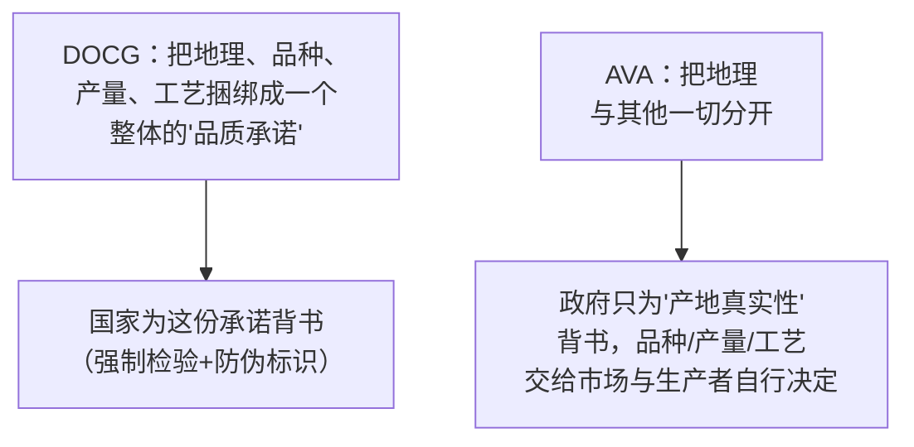
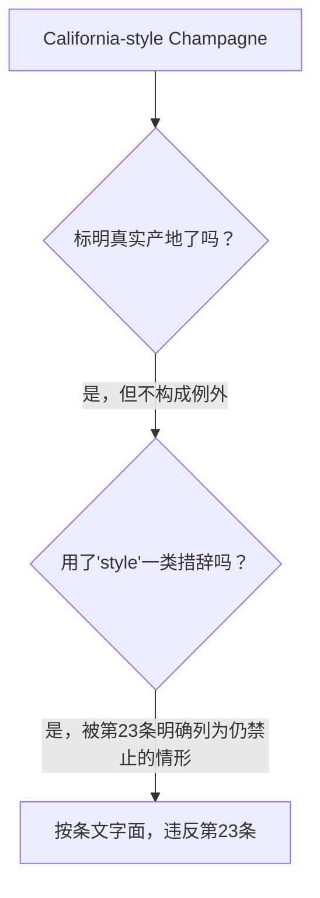
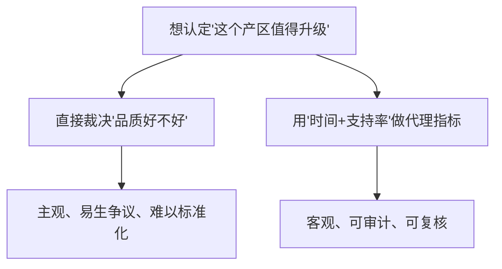
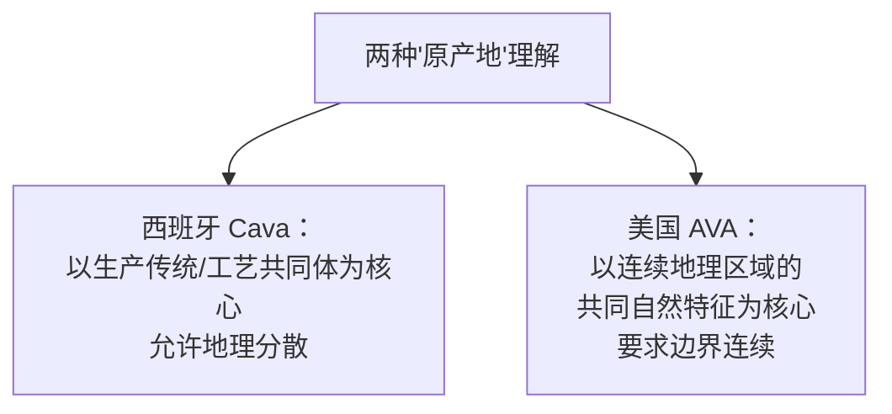
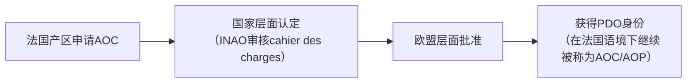
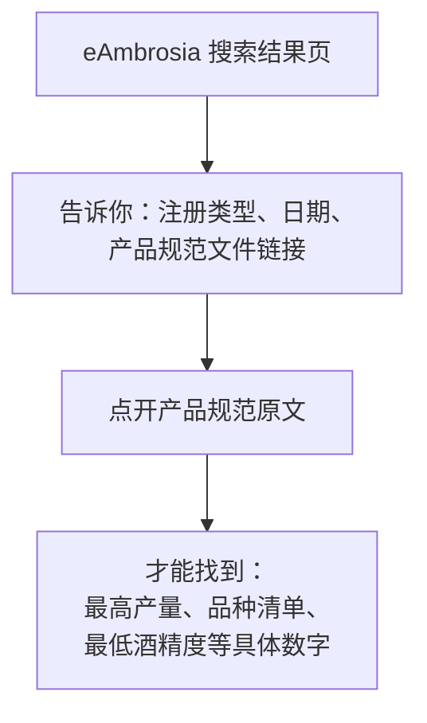
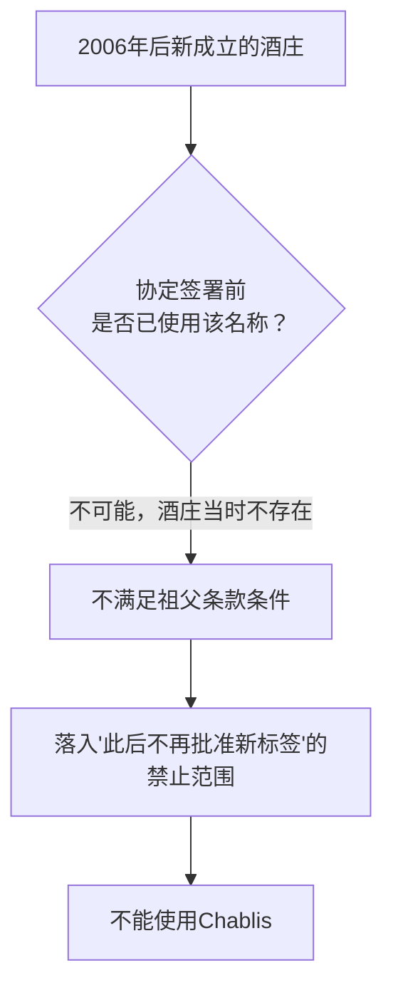
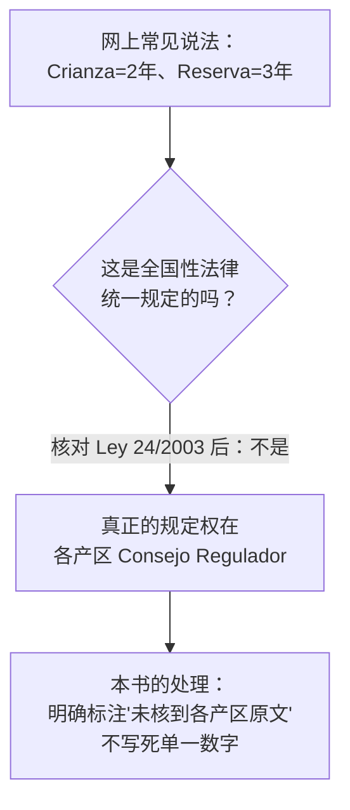

# 第 19 章 思考题参考答案

> 只记「问题 + 正确答案」，不记读者作答。案例题给**完整推理链**。
>
> 凡本书**尚未核到一手出处**的地方，答案里会明说——请不要把"待核"当成"已知"。

## Q1

**问**：用"①地理边界 ②品种/产量/工艺约束 ③核查强度"三问框架，比较意大利 DOCG 与
美国 AVA 在②③两项上的差异，并说明这种差异反映的是两种什么样的监管哲学。

**答**：

**②品种/产量/工艺约束**：

| | DOCG | AVA |
|---|------|-----|
| 法律依据 | Legge 238/2016 第 33 条：DOCG 规范须比来源 DOC **更严格** | 27 CFR § 9.12：申请证据**明确限定为**气候/地质/土壤/物理特征/海拔五类 |
| 是否约束品种 | 是（写入产品规范）| **否**（申请文件没有这一项）|
| 是否约束产量 | 是 | **否** |
| 是否约束酿造工艺 | 是 | **否** |

**③核查强度**：

| | DOCG | AVA |
|---|------|-----|
| 检验类型 | 理化 + **感官**双重检验（第 65 条）| 无强制理化/感官检验 |
| 检验频率/有效期 | 合格证明有效期仅 **180 天** | — |
| 物理防伪 | **强制**国家防伪标识（第 48 条）| 无 |
| 实际核查内容 | 产区边界 + 品种 + 产量 + 工艺是否合规 | 只核查标签上**85% 来源比例**是否属实 |

**反映的监管哲学**：

**DOCG 代表的哲学**：原产地名称应当**打包承诺一整套品质相关的生产约束**，
国家愿意为这份打包承诺投入检验资源。

**AVA 代表的哲学**：原产地标签应当**只回答一个狭窄的事实问题**（葡萄长在哪），
把"用什么品种、产多少、怎么酿"这些决定**完全留给市场竞争与生产者声誉**去解决，
不通过法律强制。

> **要带走的判断**：**这不是"谁更先进"的问题，而是"愿意用法律去捆绑多少件事"
> 的不同选择**——两种选择都能自洽，只是对消费者意味着不同的信息含量。

## Q2

**问**：TRIPS 第 23 条不要求证明消费者被误导。如果某美国酒庄在标签上写
"California-style Champagne"，按第 23 条的字面规定，这种做法违不违反 TRIPS？

**答**：**按第 23.1 条的字面规定，违反。**

**推理链**：

第 23.1 条原文明确写（已核对官方文本）：

> 即使已标明真实产地，**或该地理标志被翻译使用，或搭配"风格（style）"、"仿"、
> "type"等措辞，仍不得使用**该地理标志标示非产自该地的葡萄酒/烈酒。

"California-style Champagne" 这个标签：

1. **标明了真实产地**（California）——但第 23 条明确写**这不构成例外**；
2. **使用了"style"这个词**——第 23 条**明确把"style"列为被禁止的搭配措辞之一**；
3. 因此，即使没有任何消费者被误导（没人会真的以为这是法国香槟），
   **从条文字面看，这种标签形式仍然落在第 23 条禁止的范围内**。

**但要加一个重要限定**：

- **TRIPS 本身不是直接在各国生效的"自动执行"法律**，而是设定各成员**必须达到的
  最低保护标准**，具体怎样落实到国内立法（以及祖父条款一类的历史妥协安排）
  是各国自己的事；
- 美国通过**2006 年美欧双边协定的祖父条款**，为已存在的"半通用名称"标签
  （包括 Champagne）设了一条过渡性的国内处理方式——这是**双边协定层面的
  具体安排**，不是对 TRIPS 第 23 条本身的修改；
- 本书**未核到 TRIPS 争端解决机制是否曾就这类具体标签形式做出过裁决**，
  因此这里只回答"按条文字面文本分析的结论"，不代表存在生效的国际裁决先例。

> **要带走的判断**：**国际条约的"字面规定"与"各国实际执行"之间
> 可能存在落差，这种落差正是双边协定（如 2006 年美欧协议）存在的原因**。

## Q3

**问**：意大利第 33 条规定晋级需要"满一定年限"。为什么法律要规定"时间"这个变量，
而不是直接按品质好坏来认定？

**答**：

**因为"品质好坏"本身无法被客观、可核查地直接认定，而"时间+支持率"可以。**

**推理链**：

1. **品质是感官判断，容易引发争议**。如果法律直接写"品质足够好就能认定为 DOCG"，
   认定过程会变成一场关于"什么算好"的主观争论，难以标准化、难以复核；
2. **第 33 条选择的替代指标是两个可核查的量**：
   - **时间**（已是 DOC 满 7 年、已是 IGT 满 5 年）——这是一个**客观、不可伪造
     的日期记录**；
   - **支持率**（51%/35%/20% 的种植者或面积占比）——这是一个**可统计、可审计
     的比例**；
3. **这两个指标共同起到的作用是"筛选出有持续经营历史、且得到产区内多数生产者
   认可的名称"**，用这个作为"值得给予更高法律地位"的**代理指标（proxy）**，
   而不是直接去裁决"这酒好不好喝"。

**这与本书前面章节反复出现的立法技术是同一类思路**：
**用一个可测量的间接指标，替代一个难以直接测量或容易引发争议的目标**
（第三部分见过"管结果不管手段"的多个例子，这里是"管资历不管主观品质"的变体）。

> **要带走的判断**：**法律偏爱可核查的代理指标，而不是直接去裁决主观价值判断**——
> 这条原则能帮你理解很多看起来"为什么是这个具体数字"的法条。

## Q4

**问**：**【案例】** 判断并改写：
*"这是一款 DOCG 认证的顶级佳酿，品质由意大利政府担保，绝对比普通 DOC 好喝；
而美国的 AVA 制度形同虚设，随便一个产区都能申请。"*

**答**：三处断言，**全部需要修正**。

**第一句："DOCG 认证……品质由意大利政府担保"** → ⚠️ **部分对，但"担保品质"用词过重**。

- **对的部分**：DOCG 确实经过**理化+感官双重检验**，并由国家印制的防伪标识
  核验身份真实性（第 48、65 条）；
- **错的部分**：这套检验核查的是"**是否符合该产区自己的产品规范**"
  （品种、产量、工艺等是否达标），**不是对"好不好喝"这件事做市场化、
  跨产区的品质排名**。"政府担保品质"把"合规性核查"偷换成了"品质保证"。

> **改写**："这款酒经过 DOCG 的理化与感官双重检验，符合该产区产品规范的要求。"

**第二句："绝对比普通 DOC 好喝"** → ❌ **明确错误**。

- DOCG 的规范**确实**比来源 DOC 更严格（第 33 条第 4 款），
  但"规范更严格"是**生产约束层面**的差别，**不直接等价于**
  "消费者喝到的这一瓶、与另一瓶具体的 DOC 相比，一定更好喝"；
- 好不好喝是**感官判断**，受品种、年份、酿造师水平、储存条件等多重因素影响，
  **行政分级不能单独回答这个问题**（本书第五部分会系统讨论"好不好喝"
  与"有没有缺陷"的区别）。

> **改写**："这款 DOCG 酒的生产规范比来源 DOC 更严格，但具体好不好喝，
> 仍需要你自己品鉴判断。"

**第三句："美国 AVA 制度形同虚设，随便一个产区都能申请"** → ❌ **明确错误**。

- 已核到的 **27 CFR § 9.12** 规定，新设 AVA 须提交**独立于申请人**的
  名称证据、详细边界依据、以及**气候/地质/土壤/物理特征/海拔五类**的
  与众不同特征说明，并附 USGS 地图——**这是一套有明确证据门槛的正式申请程序**，
  不是"随便申请"；
- **AVA 制度"不做的事"是约束品种/产量/工艺，这与"申请门槛低"是两件不同的事**——
  前者是制度设计的范围选择，后者是审核的严格程度，不能混为一谈。

> **改写**："美国的 AVA 制度需要通过 TTB 的正式申请程序（名称、边界、
> 与众不同特征三类证据），但它的审核范围只限于地理层面，不涉及品种、
> 产量或酿造工艺的约束。"

> **要带走的判断**：这段文案的共同毛病是**把"检验/申请程序的存在"
> 偷换成了"品质保证"或"审核不严格"的结论**——程序的存在与否、
> 程序审核的范围、以及最终感官品质，是三件需要分开判断的事。

## Q5

**问**：西班牙把"Cava"一律视为 denominación de origen，不论产区地理是否连续；
这与美国 AVA 必须是"划定边界的区域"相比，体现了两种体系对"原产地"理解的
什么不同？

**答**：

**体现的是"原产地"概念里，"地理连续性"是否被视为必要条件的不同选择。**

| | Cava（西班牙）| AVA（美国）|
|---|-----------------|------------|
| 地理是否要求连续 | **不要求**——Cava 的产区在西班牙境内分布分散，法律**一律**赋予其 DO 地位 | **要求**——27 CFR § 9.12 要求提交详细边界描述，划定的是一块**连续的、有明确边界线**的区域 |
| 认定的立足点 | 以**工艺/产品类别**（传统法起泡酒）为核心，地理分布服从于"谁在用这套工艺"| 以**连续地块的共同自然特征**（气候、地质、土壤等）为核心 |

**推理链**：

- Cava 的历史成因是：传统法起泡酒的生产者**分散在西班牙多个不相邻的地区**
  （主要在加泰罗尼亚，但也有其他零星产区），如果按"必须是连续地理区域"的
  标准，Cava 根本无法构成一个单一的原产地名称；
- 西班牙法律的解决方式是**把"原产地"的认定重心放在"受同一套产品规范约束
  的生产者共同体"上，而不是"地理上连成一片"**——这是一种更偏向
  "生产传统共同体"的原产地理解；
- 美国 AVA 制度则**坚持地理连续性与可测量的自然特征**是构成"种植区"的
  必要条件，**不存在"把分散地块打包成一个 AVA"的操作空间**。

> **要带走的判断**：**"原产地"不是一个只有一种标准答案的概念**——
> 它可以被定义成"一块地"，也可以被定义成"一群遵守同一套规矩的生产者"，
> 两种定义在不同法律传统里都存在，本章不裁决哪种"更对"。

## Q6

**问**：为什么"AOC 是产品升级为欧盟 PDO 之前的强制性国家认定阶段"这句话，
说明 AOC 和 PDO 不是两套平行体系，而是同一件事在不同层级上的名字？

**答**：

**因为这句话描述的是一个"先后承接"的流程，而不是两个各自独立、可以并存
或互相替代的体系。**

**推理链**：

1. 如果 AOC 和 PDO 是**两套平行体系**，那么一款酒理论上应该可以
   **只拿 AOC、不拿 PDO**，或者**只拿 PDO、不拿 AOC**，二者互不依赖；
2. 但已核到的 INAO 官网表述明确写：**AOC 是产品在欧盟层面注册为 PDO
   "之前"的"强制性"国家认定阶段**——"之前"说明这是时间上的**先后关系**，
   "强制性"说明这是**必经步骤**，不是可选项；
3. 这意味着：**获得 AOC 身份，本身就是在走向获得 PDO 身份的路上
   （法国语境下，二者在实践中是同一件事的两个名字）**，
   不存在"某款酒是 AOC 但不是 PDO"这种情况（在现行框架下）。

**类比帮助理解**：这有点像"先拿到地方执照，再凭地方执照去申请国家执照"——
地方执照不是跟国家执照并列的另一套资格，而是**申请国家执照必经的前置步骤**，
拿到国家执照后，地方执照的名字仍然会被沿用来指代这件事。

> **要带走的判断**：**"AOC"这个词，在法国语境下既是"国家认定阶段的名字"，
> 也是"这款酒最终拥有的 PDO 身份在法国的叫法"**——理解这层"承接关系"，
> 比把它们当成两个互不相干的缩写更接近制度的实际运作。

## Q7

**问**：**【查证】** 在 eAmbrosia 或类似数据库搜索一个产区，记录它的登记类型
（PDO/PGI）、日期与产品规范链接。这个页面能不能回答"最高产量是多少"？
如果不能，还需要查什么？

**答**：**本书不代为查证具体产区**（这是一道要求读者自己动手的查证题），
但给出该怎么判断的参照系：

- **数据库本身的作用**：确认一个名称**是否已注册、注册为 PDO 还是 PGI、
  注册日期**，并**提供指向产品规范（cahier des charges / disciplinare）
  原文的链接**——这是官方"登记簿"的功能；
- **"最高产量是多少"这个问题，数据库页面本身通常不会直接列出**
  （除非页面摘要恰好提炼了这一项）——**真正的数字写在产品规范原文里**，
  需要点开数据库提供的链接，找到该产区的 cahier des charges 或
  disciplinare di produzione，再在其中查找"每公顷最高产量（resa massima /
  rendement）"这一具体条款；
- 这正是 (EU) No 1308/2013 **Article 94** 规定的——产品规范**必须含
  "(e) 每公顷最高产量"**这一强制项，所以这个数字**一定存在于某份文件里**，
  只是不一定直接显示在数据库的摘要页面上。

> **要带走的判断**：**官方数据库的"登记簿"功能与"内容细节"功能是分开的**——
> 数据库告诉你"去哪找"，具体数字永远要在被链接的那份产品规范原文里找。
> 这也是本书反复强调"查原文，不要止步于二手摘要"的一次具体演练。

## Q8

**问**：2006 年之后有一家新成立的美国酒庄，想在标签上使用"Chablis"这个词，
按协定的规定，它能不能这样做？为什么？

**答**：**不能。**

**推理链**：

1. **祖父条款的适用条件是"协定签署前（或 2005-12-13，以较晚者为准）
   已在美国境内使用"**——这是一个**时间点+既存使用事实**的双重条件；
2. 一家**2006 年之后新成立**的酒庄，在协定签署时**根本不存在**，
   自然也就**不存在"协定签署前已使用该名称的标签"**这一事实；
3. 已核到的协定要点明确写：**"此后不得再批准使用这些名称的新标签"**——
   新酒庄属于协定生效后的"新情形"，直接落入这条禁止范围；
4. 因此，这家新酒庄**无法**合法地在标签上使用"Chablis"这个词
   （无论是否加上"style"一类限定词，也无论是否同时标注真实产地——
   第 19.8 节与 Q2 已经分析过，"加限定词/标真实产地"并不构成
   在 TRIPS 第 23 条意义上的豁免）。

> **要带走的判断**：**祖父条款是"保留既有既得利益，但堵死新增"的典型立法技术**——
> 它解决的是历史遗留问题，不是给未来留口子。理解这一点，
> 就能预见"半通用名称"这类标签会随时间推移而**越来越少见**，
> 而不是维持现状或扩大。

## Q9

**问**：为什么本章在西班牙 DO/DOCa 一节特意说明"Crianza/Reserva/Gran Reserva
的具体年限不是全国性法律统一规定的"？这与第 1 章"查不到就别写死数字"的纪律
是什么关系？

**答**：

**这条提醒是该纪律的一次直接应用：本书核对了 Ley 24/2003 的全国性条文原文
（或其复述），但没有核到各产区 Consejo Regulador 的具体年限规定，
所以明确拒绝替读者"脑补"一个数字。**

**推理链**：

1. 很多关于西班牙酒的科普材料会直接给出"Crianza 至少陈年 2 年、
   Reserva 至少 3 年"这类具体数字，读起来像是全国统一标准；
2. 但本章核对 **Ley 24/2003** 的全国性条文后发现：**这部法律规定的是
   DO/DOCa 的认定条件（时间资历、管理机构、瓶装与检验要求）**，
   **并没有在全国层面统一规定 Crianza/Reserva/Gran Reserva 的陈年年限**；
3. 这些具体的陈年年限，**实际上是由各产区自己的 Consejo Regulador**
   在其产区规范里规定的——**不同产区的 Consejo Regulador 可能定出不同的数字**
   （本书未逐一核对每个产区的规定，所以不知道是否存在差异、差异有多大）；
4. 按本书第 1 章的纪律："**禁止凭印象编造精确数字**……宁可写
   '典型在 x~y，因产区差异很大'"，以及"查不到就别写死数字，
   宁可写'这一点缺乏可靠公开数据'"——**本章选择后一种处理方式**：
   明确指出"这是一个需要区分全国性法律与产区自主规定的问题"，
   而不是把网上常见的"2 年/3 年"这类数字直接写进正文。

> **要带走的判断**：**"某个说法流传很广"不等于"它是全国统一标准"**——
> 分清"全国性框架规定了什么"与"地方机构自主规定了什么"，
> 是本书第四部分（产区法规）会反复用到的一条读法，第 24 章处理
> 西班牙具体产区时会继续沿用这条纪律去逐一核对。
