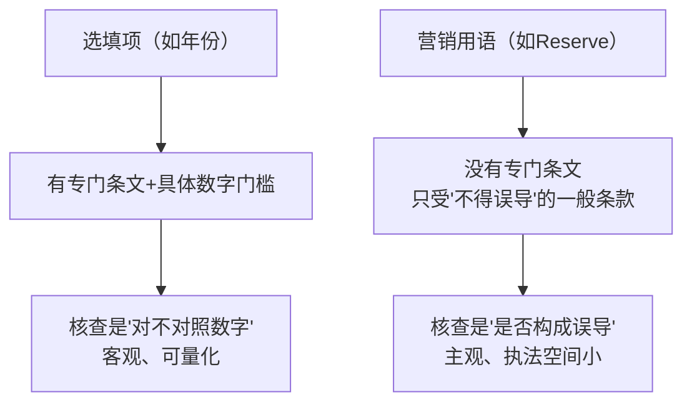
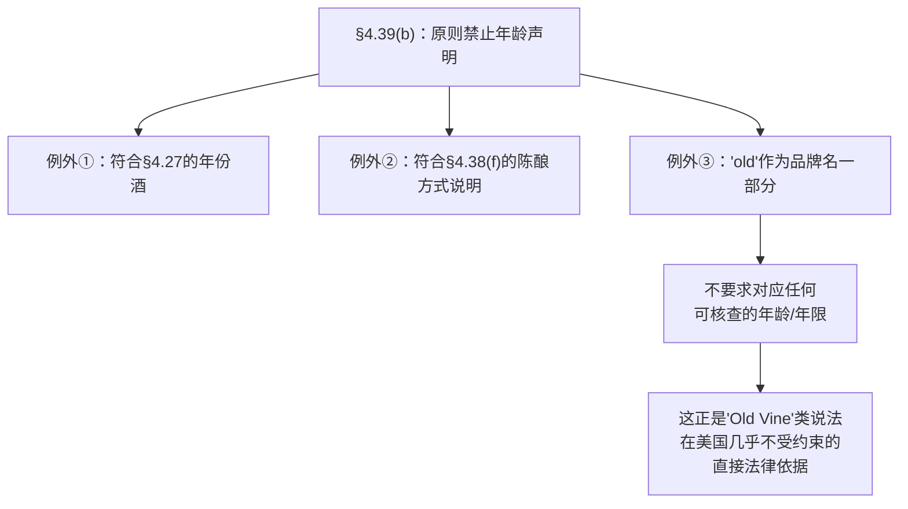
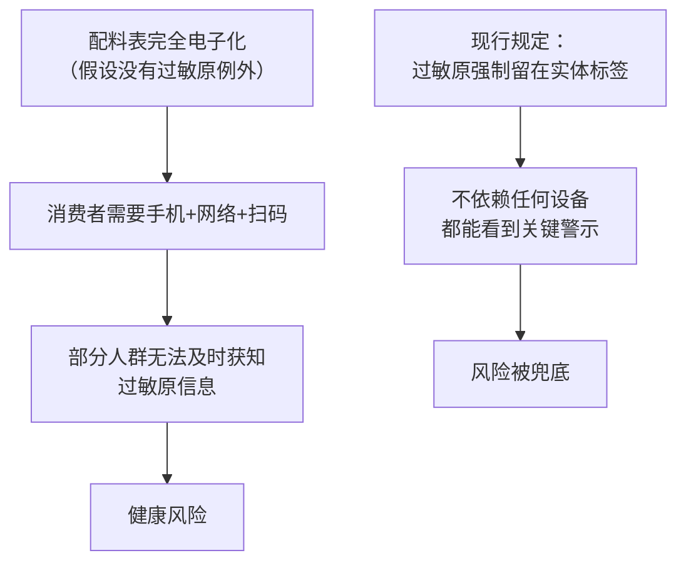
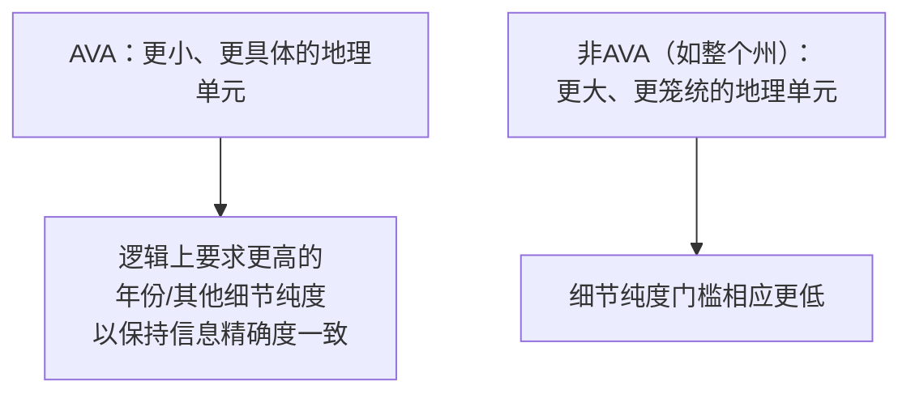
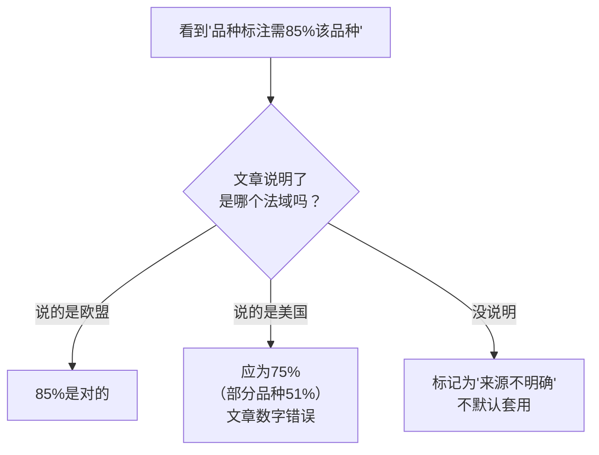
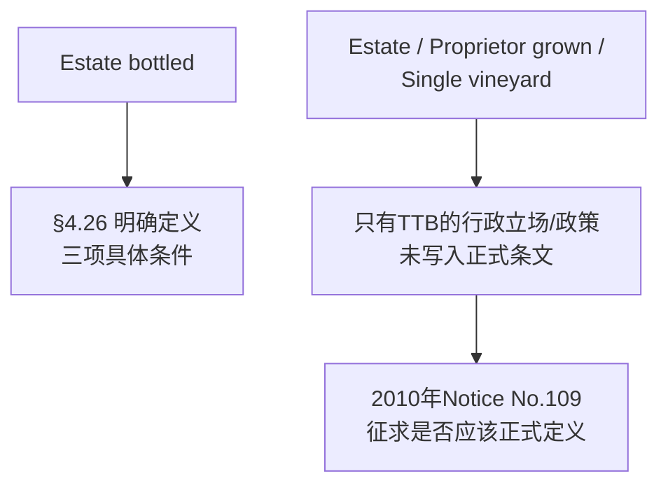
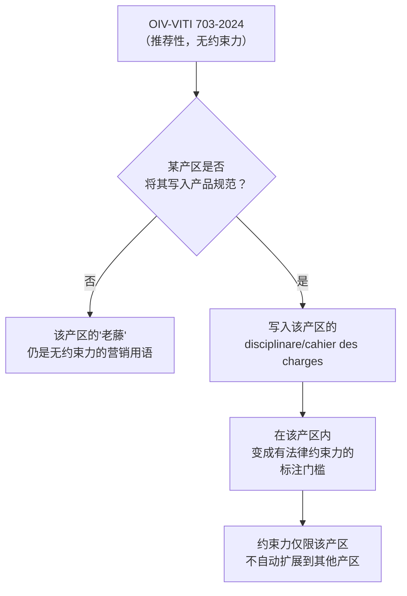

# 第 20 章 思考题参考答案

> 只记「问题 + 正确答案」，不记读者作答。案例题给**完整推理链**。
>
> 凡本书**尚未核到一手出处**的地方，答案里会明说——请不要把"待核"当成"已知"。

## Q1

**问**：用"强制项/选填项/营销用语"三分类，解释为什么"Reserve"和"年份"
虽然都不是美国法律的强制项，但它们受到的约束力度完全不同。

**答**：

**"年份"是选填项，"Reserve"是营销用语——这是两个不同的类别，
约束力度的差异正是由类别决定的。**

| | 年份 | "Reserve" |
|---|------|-----------|
| 法律类别 | **选填项**（27 CFR § 4.25、§ 4.27）| **营销用语**（不在任何专门条文的定义范围内）|
| 写了要满足什么 | **具体的比例门槛**：标 AVA 产地需当年采收葡萄占比≥95%，非 AVA 产地≥85% | **没有专门数字要求** |
| 核查方式 | TTB 在批准标签（COLA）时**会核对该门槛是否可能被满足**，且该门槛写在条文里，**可被客观核查** | 只受"不得虚假或误导"的**一般性条款**（§ 4.38(f)、§ 4.39(a)(1)）约束，**没有专门的数字标准可供核查** |
| 后果 | 不满足门槛的年份标注，**直接违反具体条文** | 滥用"Reserve"要构成"误导"才可能被处理，**这是一个宽松得多、主观判断空间更大的标准** |

> **要带走的判断**：**"选填"不等于"不受约束"**——选填项一旦被使用，
> 约束力度可能**不亚于**（甚至在核查精确度上**超过**）强制项；
> 真正"几乎不受约束"的，是**连专门条文都没有**的营销用语这一类。

## Q2

**问**：27 CFR § 4.39(b) 规定"除三种情形外不得做任何年龄声明"，第③种情形
是"将'old'作为品牌名的一部分使用"。这条规定是在**禁止**滥用年龄声明，
还是在**允许**一个例外？这个例外本身说明了什么？

**答**：**两者都是——这条规定的主体是"禁止"，但它同时明文写了一个"允许"的例外，
而这个例外恰好是消费者最容易误解的那个缺口。**

**推理链**：

1. **条文的主体结构是"原则禁止+列举例外"**：
   "除以下情形外，不得做任何年龄声明"——这句话本身是在**从严禁止**
   年龄声明，防止酒庄随意暗示"这酒很老、很有年头"来误导消费者；
2. **但条文明确列了三种例外**，其中第③种是**"将'old'作为品牌名的一部分
   使用"**——这意味着，如果一款酒的品牌名字面上就含有"old"这个词
   （比如虚构的例子"Old Barn Winery"），**法规直接允许**，
   **不要求这个"old"对应任何可核查的年龄、年限或陈年时间**；
3. **这个例外本身说明的是**：立法者意识到"old"这个词**已经在大量品牌名中
   被使用**（作为品牌识别的一部分，而非对产品年龄的事实陈述），
   如果一律禁止，会冲击大量已有品牌，所以**专门开了这个口子**；
4. **但这也造成了一个认知缺口**：消费者看到品牌名或酒标上出现"Old"，
   很容易联想到"这酒用了老藤/陈年了很久"，而法规**恰恰在这个点上
   没有设任何实质门槛**。

> **要带走的判断**：**一条"禁止性"条文，可能恰恰因为它列的"例外"
> 而制造了最大的信息真空**——读法规时，例外条款往往比主条款本身
> 更值得细读（这与第 19 章"读产区法规先读例外"的方法论是同一条纪律）。

## Q3

**问**：**【案例】** 判断："这款酒标注'Reserve'，说明酒庄特意挑选了最好的
葡萄，按欧洲传统陈酿了至少三年，品质有保证。"如果换成一款西班牙 Reserva
级别的酒，这段话是否依然有问题？

**答**：**原文案在美国语境下几乎全错；换成西班牙 Reserva，部分表述可以成立，
但仍有需要修正的地方。**

**先判断原文案（假设这是一款美国酒）**：

- **"特意挑选了最好的葡萄"** → ❌ **缺乏依据**。"Reserve"在美国没有法律定义，
  不对应任何关于原料筛选标准的强制要求；
- **"按欧洲传统陈酿了至少三年"** → ❌ **明确错误**。这是在**把欧洲某些法域
  （如西班牙）的法定年限，套用到一个没有这种法律要求的美国酒款上**——
  这是一种常见的误导手法：借用一个在别处有法律含义的词的"光环"，
  却不说明这款酒实际属于哪个法域；
- **"品质有保证"** → ❌ **无法律依据**。TTB 2010 年的征求意见最终未落地为
  正式规则，"Reserve"在美国只受"不得误导"的一般条款约束，
  不存在任何品质保证机制。

> **改写（美国酒）**："本款标注'Reserve'，这是酒庄自定的产品线名称，
> 美国法规对此未设具体标准，建议询问酒庄该款的具体酿造与陈年信息。"

**如果换成西班牙 Reserva 级别的酒**：

- **"按传统陈酿了至少三年"** → ⚠️ **方向基本对，但年限细节需要核实**。
  已核到的二手资料显示 Reserva 红酒的常见做法是**桶陈+瓶陈合计约 3 年**，
  但**具体年限由各产区自己的 Consejo Regulador 规定**（第 19 章已说明），
  本书未核对该特定产区的官方条文原文，所以"至少三年"这个说法
  需要以该产区官方规定为准，不能一概而论；
- **"品质有保证"** → ⚠️ **仍然过度引申**。Reserva 这个词**保证的是
  陈年工艺符合该产区规定**，**不直接保证"好喝"或"品质顶级"**——
  这与第 19 章 Q4 讨论过的"DOCG 更贵≠更好喝"是同一类逻辑错误；
- **"特意挑选了最好的葡萄"** → ⚠️ **缺乏依据**。本书未核到 Reserva 这个
  术语本身是否对原料筛选有强制要求，不应不加说明地断言。

> **改写（西班牙 Reserva 酒）**："本款标注 Reserva，根据该产区
> Consejo Regulador 的规定经过一定年限的桶陈与瓶陈（具体年限请参考
> 该产区官方规定），但'Reserva'本身不是对口感品质的保证。"

> **要带走的判断**：**同一句宣传语，换一个法域可能从"全错"变成
> "部分对但仍有夸大"**——这正说明了"先问是哪个法域"这件事有多重要。

## Q4

**问**：欧盟标签的营养成分表与配料表"可以走电子渠道"，但有"不得展示营销
内容/不得追踪用户""致敏物质仍须实体标注"两条硬约束。如果没有后一条例外，
会出现什么样的消费者风险？

**答**：

**如果没有"致敏物质仍须实体标注"这条例外，过敏原信息可能被"锁"在
一个需要额外操作（扫码、联网）才能看到的地方，对无法或不方便完成这些
操作的消费者构成实际的健康风险。**

**推理链**：

1. **致敏物质声明（如"含亚硫酸盐"）的作用是让易过敏人群在购买/饮用前
   及时获知风险**——这类信息的价值高度依赖"**能不能立刻看到**"；
2. 如果配料表（含过敏原信息）**完全**允许走电子渠道，消费者就需要：
   **有智能手机 + 能联网 + 愿意扫码 + 扫码页面能正常加载**——
   这一连串条件**不是人人都能满足**（比如没有网络信号的场合、
   老年消费者、紧急情况下想快速确认是否安全饮用的人）；
3. **现行规定通过"过敏原必须留在实体标签上"这条例外，堵住了这个风险**：
   无论配料表的其余部分是否走电子渠道，**"contains sulphites"一类的
   过敏原警示必须印在瓶身上**，不依赖任何额外设备或操作就能被看到。

> **要带走的判断**：**"信息可以电子化"与"关键安全信息必须保底在实体载体上"
> 是两件可以并存的事**——好的监管设计会区分"锦上添花的详细信息"
> 与"性命攸关的最低限度警示"，分别给予不同的强制程度。

## Q5

**问**：为什么美国的年份标注规则里，"标 AVA 产地"比"标非 AVA 产地"的比例
门槛更高（95% vs 85%）？

**答**：**本书未核到官方给出的理由，这是一道开放思考题，以下是一个合理的
推测性解释（明确标注为推测，不是已核实的官方说明）。**

**一个合理的推测方向**：

- **AVA 是一个经过正式申请、有明确边界与"与众不同特征"的地理标签**
  （第 19 章已详述 27 CFR § 9.12 的申请要求）——它本身已经承载了
  "这片地理区域有特殊性"的信息含量；
- 如果同时标注 AVA 与年份，但年份的"纯度"门槛定得很低（比如和非 AVA
  产地一样只要 85%），就会出现一种情况：**消费者看到"Napa Valley 2021"，
  以为这瓶酒高度代表 Napa Valley 这一年份的特征，但实际上可能有
  高达 15% 来自其他年份**——这**可能**被认为会**稀释 AVA 这个更具体的
  地理标签所承载的信息精确度**；
- 换个角度看：**AVA 本身的边界更小、更具体**（相对于"加利福尼亚州"
  这种大范围的非 AVA 产地标注），**对应的年份/品种等细节信息，
  逻辑上也应该要求更高的"纯度"**，以保持整体标签信息的一致精确度。

> **要带走的判断**：**这是一个合理但未经官方证实的推测**——
> 本书按纪律明确标注"未核到官方理由"，不把推测包装成定论。
> 读者如果查到 TTB 官方对这条规则的立法说明，可以验证这个推测是否成立。

## Q6

**问**：**【查证】** 找一张酒标，按"强制项/选填项/营销用语"分类填表，
并标注依据。

**答**：**本书不代为查证具体某张酒标**（这是一道要求读者自己动手的查证题），
但给出分类判断的参照系：

| 信息类型 | 分类 | 判断依据 |
|---------|------|---------|
| 品牌名 | 强制项 | 美国 27 CFR § 4.32(a)(1)；欧盟无直接对应条款，但品牌/商标受商标法规范 |
| 类别/类型（如"Red Wine"）| 强制项 | 27 CFR § 4.32(a)(2)（美国）；(EU) No 1308/2013 Article 119(1)(a)（欧盟）|
| 酒精度 | 强制项 | § 4.36（美国）；Article 119(1)(c)（欧盟）|
| 净含量 | 强制项 | § 4.37（美国）|
| 装瓶者/生产者名称地址 | 强制项 | § 4.35（美国）；Article 119(1)(e)（欧盟）|
| 政府健康警语 | 强制项（仅美国）| 27 CFR § 16.21 |
| 营养成分表/配料表 | 强制项（仅欧盟，2023 年后）| Article 119(1)(h)(i) |
| 产地名称（州/AVA/PDO/PGI）| **美国为选填，欧盟 PDO/PGI 为强制** | § 4.25（美国）；Article 119(1)(d)、(b)（欧盟）|
| 年份 | 选填项 | § 4.27（美国）；(EU) 2019/33 Article 49（欧盟）|
| 品种名 | 选填项 | § 4.23（美国）；Article 50（欧盟）|
| "Reserve" "Old Vine" "Estate"（单独使用）| 营销用语 | 无专门条文定义，只受一般性条款约束（§ 4.38(f)、§ 4.39）|

> **要带走的判断**：**同一类信息（如"产地名称"），在不同法域可能分属
> 不同类别**（美国选填、欧盟 PDO/PGI 强制）——分类时必须先确认法域，
> 不能套用一张通用表格而不加区分。

## Q7

**问**：如果看到一篇中文科普文章写"葡萄酒标注品种名要求至少含 85% 该品种"，
但没有说明是哪个国家，应该怎么追问或核实？

**答**：

**应该先追问"这是哪个法域的规定"，因为本章已经确认这两个数字在美国与
欧盟是不同的（美国 75%，欧盟 85%），一篇不说明法域的文章很可能是在
无意中把欧盟的数字当成了全球通用标准。**

**具体的核实步骤**：

1. **先问："这篇文章讨论的是哪个国家/产区的酒？"**——
   如果文章本身没有限定，默认读者可能把"85%"套用到任何一瓶酒上，
   这是一个常见的错误来源；
2. **如果文章在讨论美国酒**，核对本章 §20.3：美国单一品种门槛是
   **75%**（部分品种可降至 51%），**85%**这个数字不适用；
3. **如果文章在讨论欧盟（或受欧盟规则约束的产区）酒**，85% 的数字
   是对的（依据 (EU) 2019/33 Article 50）；
4. **如果文章没有说明、也无法确定**，应该把这条信息标记为
   "**来源不明确，暂不采信**"，而不是默认套用某一个数字。

> **要带走的判断**：**这正是本书第 1 章就定下的纪律的具体应用**——
> "各国规则不一致时并列，不要把一方当成唯一正确"。遇到不说明法域的
> 具体数字，第一反应应该是怀疑它被不加区分地套用了。

## Q8

**问**：为什么"Estate""Proprietor grown""Single vineyard"这些词也被 TTB
列入"现行法规未定义"的名单，而不是像"Estate bottled"那样已有明确法律定义？

**答**：

**因为"Estate bottled"是一个已经被 27 CFR § 4.26 明确定义的法定术语，
而"Estate"（单独使用）、"Proprietor grown"、"Single vineyard"这些词，
即使听起来和"Estate bottled"很像、或经常一起出现，法规条文本身
并没有单独给它们下定义——TTB 只是基于"行业惯例"或"长期执法立场"
在个案中判断是否允许使用，没有写进正式条文。**

**推理链（结合 TTB Notice No. 109 原文）**：

1. **"Estate bottled"有明确定义**：27 CFR § 4.26(a) 规定了三个具体条件
   （位于标注的 AVA 内、种植的葡萄全部产自酒庄拥有/控制的土地、
   破碎-发酵-陈酿-装瓶全过程在同一处连续完成不离开酒庄）——
   **这是一条有可核查标准的正式定义**；
2. **但"Estate"单独使用、不接"bottled"时，§ 4.26 不覆盖它**。
   根据 TTB 通知原文，**TTB 的长期立场（而非正式条文）是**：
   "Estate"或"Estates"单独出现**不会自动构成**"Estate bottled"式的声明，
   因此 TTB 在符合 § 4.38(f)（信息真实不误导）的前提下，**作为附加信息
   允许使用**——这是一种**行政惯例**，不是写入条文的定义；
3. **"Proprietor grown"和"Vintner grown"类似**：TTB 自 1982 年起有一项
   **政策**（不是正式条文）——只有当"100% 的葡萄产自装瓶酒庄拥有或
   控制的葡萄园"时才允许使用，但这项标准**同样没有被正式写进 27 CFR**；
4. **"Single vineyard"类词也是同理**：常见于酒标，但 27 CFR **没有专门
   条文**规定使用这个词需要满足什么条件。

> **要带走的判断**：**"长期被允许使用"不等于"有法律定义"**——
> 很多词的使用标准停留在"监管机构的行政惯例"层面，没有上升到
> 正式条文，这正是 TTB 2010 年想要通过公开征求意见来解决的问题
> （而最终也没有解决）。

## Q9

**问**：OIV-VITI 703-2024 的"老藤"定义是推荐性的。如果未来某个产区把这个
定义写进了自己的 disciplinare 或 cahier des charges，会发生什么样的
法律地位变化？

**答**：

**这个定义会从"国际组织的推荐性参考"变成"该产区具有法律约束力的
强制标准"——法律地位的转变不发生在 OIV 决议本身，而发生在
"某个具体法域选择采纳它"的那个动作上。**

**推理链**：

1. **OIV 决议本身的性质**：OIV 是一个**政府间科学技术组织**
   （第 1 章已核对其性质），它的决议**对成员国没有自动约束力**，
   是各国/各产区"可以参考、可以采纳、也可以不采纳"的推荐文件；
2. **如果某产区（比如意大利某个 DOCG，或法国某个 AOC）把这个定义
   逐字或改写后，写进自己的 disciplinare di produzione 或
   cahier des charges**：
   - 这份产品规范**本身是有法律约束力的**（第 19 章已详述——
     意大利 Legge 238/2016 第 33 条要求产品规范须经核定，
     法国的 cahier des charges 须经欧盟批准）；
   - 一旦这个"35 年"的定义被纳入其中，它就**从"国际推荐"
     转变为"该产区标注'老藤'/'vieilles vignes'类字样的强制法律门槛"**；
   - **但这个约束力仅限于该产区**——其他没有采纳这个定义的产区
     （包括同一个国家的其他产区）依然**不受其约束**，继续可以按
     自己的习惯使用"老藤"这个词。

> **要带走的判断**：**国际组织的推荐性标准要产生法律效力，
> 必须经过"被具体法域采纳并写入其有约束力的规范文件"这一步**——
> 这与第 19 章"AOC 是产品升级为 PDO 的必经国家认定阶段"揭示的
> 同一个原理：**法律效力来自具体法域的正式程序，不来自推荐文件本身
> 的权威性**。
