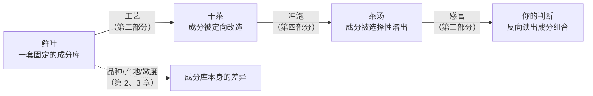
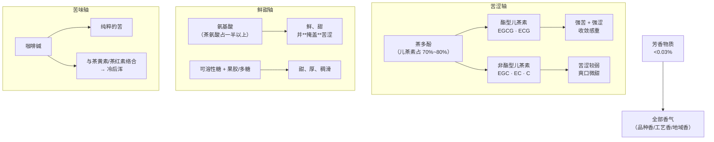

# 第 1 章 一片叶子里有什么：成分与滋味的对应

> 本章目标：建立全书最重要的一条对应关系——**哪种成分对应哪种感受**。
> 学完这一章，你听到"鲜爽""苦涩""回甘""厚"这些词时，脑子里应该能自动浮现出对应的分子。
>
> 本章数值均为教科书给出的**典型区间**（见[国标与文献索引](../../standards.md)），
> 因品种、季节、嫩度、产地差异很大。**数字只作量级感，要带走的是规律。**

## 1.1 为什么一本茶书要从化学开始

先给你一个贯穿全书的判断框架：

> **茶的一切技术问题，本质都是一件事——让哪些成分、以多少比例、进入茶汤。**

这句话可以直接展开成本书的后六个部分：



- **工艺**在做什么？把鲜叶里的成分**定向改造**——绿茶用高温把酶杀死，把成分"冻结"在原样；
  红茶反过来，让酶充分工作，把儿茶素氧化成别的东西。六大茶类的分野，就是改造程度的分野。
- **冲泡**在做什么？**选择性溶出**——不同成分溶进水里的速度和温度门槛不一样，
  所以水温、时间、茶水比一变，杯子里的成分比例就变了，味道自然变。
- **审评**在做什么？**反向读出**——从嘴里的感受，倒推这泡茶的成分格局，进而倒推它的品种和工艺。

所以化学不是这本书的装饰，它是地基。**这一章你会反复回来查。**

## 1.2 干茶的成分账本

一片茶叶，鲜叶时含水量约 75%~78%，做成成品茶后水分降到 3%~7%[^1]。
剩下的**干物质**才是我们讨论的对象。它的大致构成（占干物质的质量分数）：

| 成分 | 典型区间 | 溶于水？ | 主要感官贡献 |
|------|---------:|----------|--------------|
| **茶多酚**（以儿茶素类为主） | 18%~36% | 大部分可溶 | **苦、涩**，汤色，氧化后变红 |
| 蛋白质 | 20%~30% | 绝大部分**不溶**（水溶性仅 1%~2%） | 几乎不进茶汤 |
| 糖类 | 20%~25% | 多为纤维素等**不溶**；可溶性糖仅 3%~4% | **甜、稠滑** |
| **氨基酸**（以茶氨酸为主） | 1%~4% | 易溶 | **鲜、爽、甜**，缓和苦涩 |
| **咖啡碱**（生物碱） | 2%~4% | 易溶 | **苦**，提神；与氧化产物络合 |
| 类脂 | 约 8% | 基本不溶 | 香气前体 |
| 有机酸 | 约 3% | 可溶 | 酸味，pH 与汤色 |
| 矿质元素（灰分） | 4%~7% | 部分可溶 | 汤感、掺杂判别 |
| 色素（叶绿素、类胡萝卜素等） | 约 1% | 少量可溶 | **干茶色、叶底色、汤色** |
| **芳香物质** | **0.005%~0.03%** | 挥发 | **全部的香气** |

三个反直觉的点，值得停下来想一想：

1. **占比最大的两类（蛋白质、糖类）基本不进茶汤。** 茶叶里 40%~55% 的物质你根本喝不到，
   它们决定的是叶底的形态和口感的"骨架"，不是味道。
2. **决定香气的芳香物质总量不到 0.03%。** 万分之几的东西，撑起了茶叶最有辨识度的维度
   （已鉴定出的茶叶香气成分有数百种，常见引用为 700 余种）。这也解释了为什么香气最脆弱——
   一点受潮、串味、高温存放就毁了。
3. **真正决定"这杯茶什么味道"的，只有三个主角**：茶多酚、氨基酸、咖啡碱。
   它们加起来约占干物质 25%~40%，但滋味的骨架几乎全在这里。

> **诚实说明**：这些区间的跨度非常大（茶多酚 18%~36%，差了一倍）。这不是数据不精确，
> 而是**茶叶本身的变异就这么大**——云南大叶种的多酚可以是江浙小叶种的一倍多。
> 所以本书从不用"茶多酚 25%"这种确定说法，只讲**方向和比值**。

## 1.3 三个主角：成分 → 感受的映射



### 茶多酚：苦涩的来源，也是最大的可变量

茶多酚里 70%~80% 是**儿茶素类**[^2]。儿茶素又分两组，这个区分非常有用：

| 分组 | 主要成员 | 特点 |
|------|----------|------|
| **酯型**（复杂儿茶素） | EGCG、ECG | 苦涩强、收敛性强；EGCG 是含量最高的单体（约占儿茶素总量一半上下） |
| **非酯型**（简单儿茶素） | EGC、EC、C | 苦涩明显较弱，偏爽口，甚至带微甜 |

**为什么这个区分重要**：酯型儿茶素在加工中会部分水解、氧化成别的东西。
所以"同样的茶多酚总量"，酯型比例高的茶就是更苦涩的——
这是**总量相同、口感不同**的第一个原因（第二个原因见 1.6 节）。

### 氨基酸：鲜爽的来源，而且它会"掩盖"苦涩

茶叶的游离氨基酸里，**茶氨酸**（L-theanine）占一半以上[^3]，它是茶树的特征性氨基酸
（自然界中极少见于其他植物）。它带来的是那种**鲜**（接近日料说的"umami"）加一点甜。

关键在于它不只是"加了个鲜味"，而是**在感官上压制苦涩**。所以：

> **鲜爽 ≠ 氨基酸多，而是氨基酸相对于茶多酚多。** 这直接引出 1.5 节的酚氨比。

### 咖啡碱：苦，以及一个漂亮的副作用

咖啡碱本身就是纯粹的苦味，占干物质 2%~4%（顺便一提，同等重量下茶叶的咖啡碱含量
通常高于咖啡豆，但一杯茶的投茶量远小于一杯咖啡的用粉量，所以**一杯茶的咖啡碱通常少于一杯咖啡**）。

它还有个重要现象：咖啡碱能和红茶里的**茶黄素、茶红素形成络合物**，温度降低时析出，
让茶汤变浑——这就是**冷后浑**（cream down）。

> **别误会**：冷后浑不是变质，反而常被视为红茶**内含物丰富、浓强度好**的表征。
> 传统上判断优质工夫红茶，冷后浑是一个正面信号。

### 汤色是谁决定的

- **绿茶**：黄绿色主要来自黄酮类（花黄素）和叶绿素及其降解产物；
- **红茶**：靠儿茶素氧化后的三兄弟——

| 氧化产物 | 教科书常见区间 | 颜色与滋味贡献 |
|----------|---------------:|----------------|
| **茶黄素** (TF) | 0.3%~1.5% | 橙黄、**亮**；鲜爽、刺激性（"浓强"的来源） |
| **茶红素** (TR) | 5%~11% | 红；甜醇、汤色主体 |
| **茶褐素** (TB) | 4%~9% | 暗褐；**滞钝**，多了就"发暗、不亮"、香味钝 |

这张表在第 10 章（红茶）会大用：**红茶好不好，很大程度上是 TF/TR 的比例和 TB 有没有过量**。
审评词里的"红艳明亮"对应 TF 充足，"红暗"对应 TB 偏高。

## 1.4 "涩"根本不是一种味道

这是初学者最容易搞混、而审评里必须分清的一件事：

| | 苦 | 涩 |
|---|---|---|
| 感觉类型 | **味觉**（味蕾上的受体） | **触觉/化学感**（口腔黏膜的机械感受） |
| 机制 | 咖啡碱、酯型儿茶素等刺激苦味受体 | 多酚与唾液中的蛋白质结合并沉淀，润滑性下降 → **收敛、发干、起皱** |
| 主观描述 | "苦" | "紧""干""涩""收敛" |
| 部位 | 舌根较明显 | 整个口腔、舌面、上颚，**有延迟且持续** |

因为涩是**蛋白质被夺走**导致的润滑感下降，所以它有两个特征：

1. **有延迟**——喝下去两三秒才起来，而苦是即时的；
2. **会累积**——连喝几杯，涩感叠加，而味觉会疲劳适应。

> **对审评的直接影响**：审评表里"苦"和"涩"必须**分开记**（第 17 章）。
> 说"这茶很苦"和"这茶很涩"，指向的工艺问题完全不同：
> 涩重常指向多酚未充分转化（做青不足、发酵不足、鲜叶粗老），
> 苦重更多和品种、咖啡碱、投茶量/浸泡过度有关。

### 回甘与生津：诚实地说，机理还有争议

"回甘"（咽下后口腔返回甜感）和"生津"（唾液持续分泌）是中文茶评里的高频词，
但它们的生理机制**尚无统一结论**。目前几种主要解释：

- **对比效应**：强涩感消退时，与之对比产生的甜感错觉；
- **持续释放**：糖类、氨基酸等在口腔中缓慢释放；
- **反射性分泌**：多酚的收敛刺激引发唾液腺代偿性分泌（生津）。

> **证据强度：有争议。** 本书的处理是——**回甘生津作为可观察的现象照记**（它确实稳定存在、
> 且和品质相关），但**不把任何单一机理当定论**。谁跟你说"回甘是因为茶多糖"，那是一种假说，
> 不是共识。

## 1.5 酚氨比：一个能解释很多事的比值

```
酚氨比 = 茶多酚含量 ÷ 氨基酸含量
```

因为鲜爽来自"氨基酸相对多"，苦涩来自"多酚相对多"，这个比值就成了**滋味走向的单一指标**。
它的解释力大得惊人：

| 条件 | 酚氨比方向 | 结果 | 因此适合做 |
|------|-----------|------|-----------|
| **春茶**（气温低、生长慢，氮代谢旺） | **低** | 鲜爽、苦涩轻 | 名优**绿茶**（明前贵在这里） |
| **夏茶**（光照强、气温高，碳代谢旺） | **高** | 苦涩重、鲜爽差 | **红茶**（多酚是氧化的原料） |
| **遮阴栽培**（日本玉露、抹茶覆下栽培） | **更低** | 极鲜、涩感低 | 玉露、抹茶 |
| **大叶种**（如云南大叶种） | 高 | 浓强、苦涩重 | 滇红、普洱 |
| **小叶种**（江浙一带） | 低 | 鲜爽细腻 | 绿茶 |
| **高海拔 / 云雾多**（漫射光多、昼夜温差大） | 偏低 | 鲜爽、香气好 | 高山名优茶 |

一个经验参考的划分[^4]：

- 酚氨比 **< 8**：适制绿茶（鲜爽型）
- **8 ~ 15**：红绿兼制
- **> 15**：适制红茶（浓强型）

> **经验值**，不同教材划分略有差异，别当硬指标用。但**方向是可靠的**。

**遮阴为什么有效**（这是个很好的机理练习）：光照促进茶多酚（尤其儿茶素）的合成，
遮阴则减少多酚合成、同时有利于茶氨酸的累积和保留 → 酚氨比大幅下降 → 极致鲜爽。
代价是：**产量下降、成本上升，而且香气类型也变了**（少了阳光带来的某些香气）。
所以玉露贵，而且它的风格是"鲜到极致但不奔放"。

## 1.6 水浸出物：茶汤的"总物质量"，但不等于品质

**水浸出物**指茶叶在规定条件下能被水浸出的物质总量（测定方法见 GB/T 8305），
典型在干物质的 **30%~48%**。部分茶类的国标对它设有下限，是判定"内质是否单薄"的硬指标之一。

它对应的是茶汤的**浓度上限**和常说的"耐泡"：内含物多，能撑更多泡。

但**它绝不能单独当品质指标**，原因很干脆：

> 水浸出物只告诉你"溶出来多少"，不告诉你"溶出来的是什么、比例如何"。

40% 的水浸出物，可以是"氨基酸和糖占比高 → 厚而甜"，也可以是"酯型儿茶素占比高 → 浓而涩"。
**总量相同、结构不同**——这是本章第二次遇到这个逻辑（第一次是 1.3 节的酯型/非酯型）。

记住这个通用原则，它在全书反复出现：

> **茶的品质从来不是某个成分的"越多越好"，而是几种成分的比例是否协调。**

## 1.7 从化学推出冲泡的第一原理

不同成分溶进水里的**难易程度不同**，这直接给出了冲泡的所有直觉。定性排序：

| 成分 | 溶出速度 | 温度敏感性 | 结果 |
|------|----------|-----------|------|
| **氨基酸** | 快 | 低温也能溶出 | 前段就出来 → 前几泡最鲜 |
| **咖啡碱** | 快 | **溶解度随温度显著升高** | 高温时苦味明显增强 |
| **非酯型儿茶素** | 较快 | 中 | 早期的爽口感 |
| **酯型儿茶素**（EGCG/ECG） | 慢 | **高温、长时显著增多** | 泡久了、水太烫 → 苦涩暴涨 |
| 可溶性糖 | 较慢 | 中 | 中后段的甜 |
| 果胶 / 多糖 | 慢 | 需高温长时 | 后段的稠、滑、厚 |
| 芳香物质 | 挥发 | 高温快速释放**也快速逸失** | 高沸点香气需要沸水才"激发"出来 |

于是有了两条能记一辈子的规律：

> **低温 + 短时 → 鲜甜为主（先溶出的是氨基酸）。**
> **高温 + 长时 → 苦涩与厚重（酯型儿茶素和多糖跟上来了）。**

这一条就能解释很多"经验规则"为什么有效：

- **名优绿茶用 80~85 ℃**（经验值）：氨基酸照样溶出，但压住酯型儿茶素 → 保住鲜爽；
- **武夷岩茶、普洱用沸水**（经验值）：一是要溶出多酚和多糖构成"厚"与"骨"，
  二是高沸点香气非沸水激发不出来；
- **红碎茶几十秒就浓**：不是它成分特殊，而是**揉切让细胞破损率极高**，溶出速度快了一个量级。

> **诚实说明**：上面的溶出快慢排序在文献中大体一致，但**具体动力学高度依赖物理形态**——
> 揉捻程度、颗粒粗细、是否紧压，影响可能比温度还大。整片大叶的白茶和碎成粉的红碎茶，
> 不是一个溶出体系。所以本书讲冲泡时（第四部分）会**先看茶的形态，再谈参数**。

## 1.8 常见说法辨析

这一节是本书的固定栏目：把流传的说法拿出来，标明**证据强度**。

| 说法 | 判定 | 说明 |
|------|------|------|
| "茶多酚越高，茶叶品质越好" | **❌ 错误** | 多酚高只意味着苦涩潜力大。品质看**比例协调**（酚氨比），不看单项。多酚高更适合做红茶，做绿茶反而是缺点 |
| "氨基酸高就是好茶" | **⚠️ 部分对** | 对绿茶/白茶的鲜爽型风格是正面的；但对需要浓强度的红茶、岩茶，光鲜不够，还要"有骨" |
| "冷后浑说明茶变质了" | **❌ 错误** | 是咖啡碱与茶黄素/茶红素的络合析出，传统上是**优质红茶的正面信号** |
| "涩就是茶不好" | **❌ 错误** | 涩是一种**触感**，适度的收敛性是正常的、甚至是必要的（构成"劲"）。问题在于**涩而不化**——迟迟不消退、发苦发麻 |
| "洗茶能洗掉咖啡碱，晚上就能喝" | **❌ 基本错误** | 咖啡碱溶出确实快，但短时冲洗只能带走一部分，同时**鲜爽的氨基酸也同步流失**。想真正降咖啡碱要靠工业脱咖啡因工艺。洗茶的合理理由是别的（润茶、去杂，见第 25 章） |
| "回甘是茶多糖带来的" | **⚠️ 假说之一** | 回甘机理**尚有争议**（见 1.4 节），别当定论传播 |
| "同重量茶叶咖啡碱比咖啡豆高，所以茶更提神" | **⚠️ 偷换前提** | 前半句通常成立，但**一杯**茶的投茶量远低于一杯咖啡的用粉量，实际摄入通常更低；且茶氨酸会调节咖啡碱的兴奋感受 |

## 1.9 思考题

<a id="questions"></a>

1. 同一棵茶树、同样的工艺水平，为什么**夏茶更适合做红茶、春茶更适合做绿茶**？请用酚氨比解释，
   并说明"适制性"这个词的含义。
2. "茶多酚含量越高，茶叶品质越好"——这句话错在哪一步推理上？
3. 同一款绿茶，用沸水泡明显苦涩、用 85 ℃ 泡就鲜甜。请从**至少两种成分**的溶出差异来解释。
4. 一杯红茶放凉后变浑浊了，发生了什么？这是好事还是坏事？
5. "苦"和"涩"是同一回事吗？各自的机制是什么？为什么审评表必须把它们**分开记**？
6. 日本玉露和抹茶在采摘前要遮阴（覆下栽培）。从成分角度说明：这么做想得到什么、代价是什么。
7. （进阶）两款茶测出的水浸出物都是 40%，但一款喝起来"厚而甜"、另一款"浓而涩"。
   可能的原因有哪些？由此说明为什么水浸出物不能单独当品质指标。

> 📖 **参考答案**（想清楚再看）：[Q1](../../qa/01-leaf-chemistry-qa.md#q1) ·
> [Q2](../../qa/01-leaf-chemistry-qa.md#q2) · [Q3](../../qa/01-leaf-chemistry-qa.md#q3) ·
> [Q4](../../qa/01-leaf-chemistry-qa.md#q4) · [Q5](../../qa/01-leaf-chemistry-qa.md#q5) ·
> [Q6](../../qa/01-leaf-chemistry-qa.md#q6) · [Q7](../../qa/01-leaf-chemistry-qa.md#q7)

## 1.10 本章实操

<a id="practice"></a>

### 🅐 无器具版：读三个包装（现在就能做）

不用买茶，找三样东西——家里的茶叶包装、超市货架、或者电商详情页截图，
挑**三款不同茶类**（比如一款绿茶、一款红茶、一款普洱），填这张表：

| 项目 | 茶样 1 | 茶样 2 | 茶样 3 |
|------|--------|--------|--------|
| 品名与茶类 | | | |
| 产地 / 品种（若标注） | | | |
| 采摘季节（若标注） | | | |
| 执行标准号（`GB/T …`） | | | |
| 详情页用了哪些**滋味词** | | | |
| 详情页用了哪些**香气词** | | | |
| 👉 由茶类+产地推测：**酚氨比偏高还是偏低**？ | | | |
| 👉 推测滋味走向（鲜爽型 / 浓强型 / 醇厚型） | | | |
| 👉 商家的描述和你的推测**一致吗**？ | | | |

**这个练习真正在训练的**：把营销词翻译成成分语言。比如看到"鲜爽甘醇、明前独芽"，
你应该立刻想到"低酚氨比、氨基酸主导、要低温冲泡"；看到"浓强鲜爽、云南大叶种"，
想到"高多酚、适制红茶、冷后浑可能出现"。

### 🅐 无器具版加餐：给自己建一张空白对照表

把本章 1.3 和 1.7 两张表**默写一遍**（不看书），然后对照检查。
这两张表是全书用得最多的，值得记进肌肉记忆。

### 🅑 有条件版：一茶两温对照（备齐后再做）

**所需**：任意一款绿茶或白茶（5 g 以上）、两个同款玻璃杯、能控温的水（或水开后放凉到 85 ℃ 左右，
用温度计更准）、一支秤。

| 变量 | 杯 A | 杯 B |
|------|------|------|
| 投茶量 | 3 g | 3 g（**必须相同**） |
| 水量 | 150 mL | 150 mL（**必须相同**） |
| 水温 | 约 85 ℃ | 沸水 |
| 浸泡时间 | 2 min | 2 min（**必须相同**） |

**只让水温这一个变量不同**，然后同时对比，记录：

| 观察项 | 杯 A（85 ℃） | 杯 B（沸水） | 差异是否符合 1.7 节的预测？ |
|--------|--------------|--------------|------------------------------|
| 汤色深浅 | | | |
| 香气强度与类型 | | | |
| **鲜爽感** | | | |
| **苦**（即时、舌根） | | | |
| **涩**（延迟、收敛） | | | |
| 甜感 / 厚度 | | | |

> **实验纪律（很重要）**：一次只动一个变量，其他全部固定。这是第四部分整个部分的方法论，
> 也是你以后判断任何"茶圈说法"是否成立的唯一可靠手段。
> 记录表可以复用：[冲泡记录表](../../forms/brewing-log.md)。

---

[^1]: 成品茶含水率的具体限量各茶类国标不同，测定方法见 [GB/T 8304](../../standards.md)。
      含水率是储存稳定性的关键——受潮后陈化、霉变都快得多（第 35 章）。

[^2]: [儿茶素](../../glossary.md#catechin)（catechins）：茶多酚的主体，属黄烷醇类。
      含量测定方法见 [GB/T 8313](../../standards.md)。

[^3]: [茶氨酸](../../glossary.md#theanine)（L-theanine）：茶树特征性氨基酸，
      占游离氨基酸总量一半以上（不同资料给 40%~70%），呈鲜甜味。
      游离氨基酸总量测定见 [GB/T 8314](../../standards.md)。

[^4]: [酚氨比](../../glossary.md#phenol-amino-ratio)：茶多酚与氨基酸含量之比，
      判断茶树品种"适制性"的常用指标。此处划分为**经验参考**，各教材略有差异。
